# intelligent-core - Architecture Overview

> Архитектура и структура слоя intelligent-core

## 📊 Статистика слоя

| Метрика | Значение |
|---------|----------|
| **Модулей** | 10 |
| **Всего endpoints** | 358 |
| **Всего классов** | 650 |
| **Всего LOC** | 97,934 |

**Последнее обновление:** 2025-10-07

---

## 🏗️ Модули

| Модуль | Тип | LOC | Endpoints | Классов |
|--------|-----|-----|-----------|--------|
| [ai-foundation](./ai-foundation/README.md) | 🌐 API Service | 19,908 | 109 | 110 |
| [ai_workflow_optimizer](./ai_workflow_optimizer/README.md) | 🌐 API Service | 946 | 7 | 9 |
| [collective](./collective/README.md) | 🌐 API Service | 4,779 | 9 | 34 |
| [community_intelligence](./community_intelligence/README.md) | 🌐 API Service | 7,408 | 36 | 51 |
| [expertise-center](./expertise-center/README.md) | 📚 Library | 7,932 | 0 | 47 |
| [orchestration](./orchestration/README.md) | 🌐 API Service | 22,120 | 80 | 146 |
| [predictive](./predictive/README.md) | 🌐 API Service | 2,995 | 7 | 18 |
| [workflow-engine](./workflow-engine/README.md) | 🌐 API Service | 6,309 | 10 | 29 |
| [workflow_intelligence](./workflow_intelligence/README.md) | 🌐 API Service | 17,303 | 1 | 115 |
| [можетпригодится](./можетпригодится/README.md) | 🌐 API Service | 8,234 | 99 | 91 |

---

## 🔗 Граф зависимостей

```mermaid
graph TD
    predictive --> workflow_intelligence
    predictive --> predictive
    orchestration --> intelligent_core.ai_orchestration
    orchestration --> intelligent_core.ai_orchestration.decision_center
    orchestration --> intelligent_core.ai_orchestration.decision_center.context_aggregator
    orchestration --> intelligent_core.ai_orchestration.decision_center.delegation_manager
    orchestration --> intelligent_core.ai_orchestration.decision_center.priority_engine
    ai-foundation --> workflow_intelligence_adapter
    ai-foundation --> predictive_models
    workflow-engine --> workflow_intelligence
    community_intelligence --> community_intelligence
    community_intelligence --> predictive_timeline
    workflow_intelligence --> workflow_intelligence
    workflow_intelligence --> orchestration.bcm_services_orchestrator
```

---

## 📦 Детальное описание модулей

### ai-foundation

Базовый слой AI платформы: LLM роутинг, RAG pipeline, эмбеддинги

**Ключевые классы:**
- `LearningNeedsCollector` (23 методов)
- `SelfLearningEngine` (13 методов)
- `GamificationEngine` (10 методов)

[→ Полная документация](./ai-foundation/README.md)

---

### ai_workflow_optimizer

🌐 API Service модуль платформы

**Ключевые классы:**
- `WorkflowOptimizerService` (17 методов)
- `ProcessExecution` (0 методов)
- `OptimizationPrediction` (0 методов)

[→ Полная документация](./ai_workflow_optimizer/README.md)

---

### collective

Коллективный интеллект и агенты

**Ключевые классы:**
- `AnonymizerService` (21 методов)
- `CollectiveAgentService` (9 методов)
- `CollectiveLLMClient` (4 методов)

[→ Полная документация](./collective/README.md)

---

### community_intelligence

Сообщество и обмен знаниями

**Ключевые классы:**
- `LivingDocumentationService` (9 методов)
- `SmartAnonymizer` (9 методов)
- `MLPredictor` (7 методов)

[→ Полная документация](./community_intelligence/README.md)

---

### expertise-center

Доменные эксперты и тактические ассистенты

**Ключевые классы:**
- `LearningCoach` (10 методов)
- `OrganismCoordinator` (10 методов)
- `ExpertRegistry` (9 методов)

[→ Полная документация](./expertise-center/README.md)

---

### orchestration

Оркестрация AI агентов и микросервисов

**Ключевые классы:**
- `LearningCoach` (10 методов)
- `CommandInterpreter` (10 методов)
- `ComplianceGuardian` (8 методов)

[→ Полная документация](./orchestration/README.md)

---

### predictive

Предиктивная аналитика и ML модели

**Ключевые классы:**
- `JourneyPredictor` (11 методов)
- `ProactiveRecommendationsEngine` (6 методов)
- `ExpertDemandForecaster` (5 методов)

[→ Полная документация](./predictive/README.md)

---

### workflow-engine

BPMN workflow engine на базе Temporal

**Ключевые классы:**
- `BPMNParser` (15 методов)
- `GatewayEvaluator` (5 методов)
- `ExpressionEvaluator` (4 методов)

[→ Полная документация](./workflow-engine/README.md)

---

### workflow_intelligence

Интеллектуальное управление workflow и бизнес-процессами

**Ключевые классы:**
- `StateMachine` (12 методов)
- `BIAWorkflowEngine` (12 методов)
- `BIARules` (11 методов)

[→ Полная документация](./workflow_intelligence/README.md)

---

### можетпригодится

🌐 API Service модуль платформы

**Ключевые классы:**
- `ConsultationSessionManager` (9 методов)
- `BCMAIControlDashboard` (8 методов)
- `BCMAnthropicIntegration` (7 методов)

[→ Полная документация](./можетпригодится/README.md)

---

## 🎯 Roadmap

- [ ] Полное покрытие тестами (>80%)
- [ ] API документация (OpenAPI/Swagger)
- [ ] Performance мониторинг
- [ ] CI/CD интеграция

---

**Сгенерировано:** 2025-10-07 05:08
**Инструмент:** `tools/generators/documentation_generator.py`
