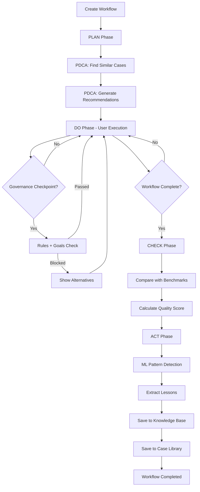
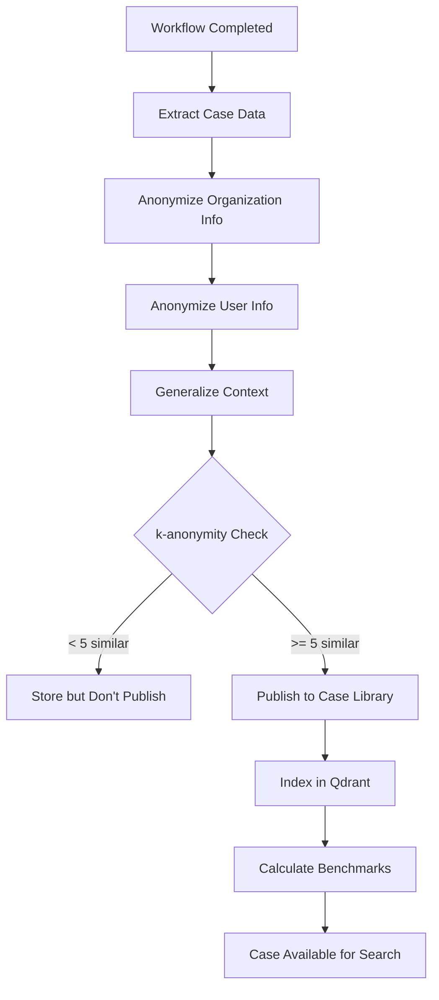

# Workflow Intelligence - Каталог Бизнес-Процессов и Сценариев

**Модуль**: workflow_intelligence
**Версия**: 2.0
**Дата**: 2025-10-10

---

## 📋 Оглавление

1. [Обзор бизнес-процессов](#обзор-бизнес-процессов)
2. [Основные сценарии использования](#основные-сценарии-использования)
3. [Типы пользователей](#типы-пользователей)
4. [Детальные процессы](#детальные-процессы)
5. [Интеграционные сценарии](#интеграционные-сценарии)
6. [PDCA в действии](#pdca-в-действии)

---

## Обзор бизнес-процессов

Workflow Intelligence предоставляет следующие основные бизнес-процессы:

### 1. Управление BCM-Workflows
**Описание**: Создание, выполнение и мониторинг Business Continuity Management workflows (BIA, Risk Assessment, Plan Development)

**Основные шаги**:
1. Создание workflow для организации
2. Пошаговое выполнение с governance checkpoints
3. Автоматический сбор данных в Case Library
4. PDCA-анализ результатов
5. Сохранение lessons learned

**Бизнес-ценность**:
- Стандартизация процессов BCM
- Автоматическое обучение на опыте
- Сокращение времени выполнения на 30-50%

### 2. Case-Based Learning
**Описание**: Обучение на успешных кейсах похожих организаций

**Основные шаги**:
1. Сбор workflow cases при завершении workflow
2. Анонимизация данных (k-anonymity)
3. Индексация в Qdrant для semantic search
4. Поиск похожих кейсов для новых workflow
5. Рекомендации на основе успешных паттернов

**Бизнес-ценность**:
- Использование коллективного опыта
- Снижение рисков ошибок
- Ускорение принятия решений

### 3. Benchmarking
**Описание**: Сравнение производительности с похожими организациями

**Основные шаги**:
1. Сбор метрик выполнения workflow
2. Агрегация статистики по отрасли/размеру
3. Расчет benchmarks (медиана, среднее, P95)
4. Сравнение текущей организации с benchmarks
5. Выявление областей для улучшения

**Бизнес-ценность**:
- Объективная оценка производительности
- Выявление best practices
- Обоснование инвестиций в улучшения

### 4. PDCA Automation
**Описание**: Автоматическое применение Plan-Do-Check-Act к каждому workflow

**Основные шаги**:
1. **PLAN**: Поиск похожих кейсов, прогноз результатов
2. **DO**: Отслеживание выполнения, замер метрик
3. **CHECK**: Сравнение с benchmarks, выявление отклонений
4. **ACT**: ML-анализ паттернов, извлечение уроков

**Бизнес-ценность**:
- Continuous improvement "из коробки"
- Автоматическая база знаний
- Накопление организационной мудрости

### 5. Goals + Rules Governance
**Описание**: Двухуровневая система управления workflow

**Основные шаги**:
1. **Rules**: Проверка compliance (ISO 22301, NIST, внутренние политики)
2. **Goals**: Оптимизация к целям (efficiency, quality, satisfaction)
3. **Orchestrator**: Объединение в единое решение
4. **Advisory**: Рекомендации для пользователя

**Бизнес-ценность**:
- Гарантированное соблюдение стандартов
- Оптимизация к бизнес-целям
- Объяснимые рекомендации

### 6. Cross-Module Learning
**Описание**: Перенос успешных паттернов между модулями BCM

**Основные шаги**:
1. Выявление успешных паттернов в одном модуле (например, Risk Assessment)
2. Адаптация паттерна к другому модулю (например, BIA)
3. Тестирование в симуляции
4. Рекомендация пользователям

**Бизнес-ценность**:
- Переиспользование знаний
- Ускорение созревания новых модулей
- Унификация подходов

---

## Основные сценарии использования

### Сценарий 1: Первый BIA в организации (Новичок)

**Актер**: BCM Manager, первый раз проводит BIA

**Контекст**:
- Организация: Healthcare, 500 сотрудников
- Цель: ISO 22301 certification
- Опыт BCM: Минимальный

**Шаги**:

1. **Создание workflow**:
```http
POST /api/v1/workflows
{
  "module": "bia",
  "org_id": "hospital-abc",
  "context": {
    "industry": "healthcare",
    "size": "medium",
    "employees": 500,
    "goal": "iso_22301_certification"
  }
}
→ Ответ: workflow_id = "wf-123", status = "created"
```

2. **PLAN phase (автоматически)**:
   - Система ищет похожие кейсы: "healthcare + medium + BIA"
   - Находит 12 успешных кейсов
   - Извлекает рекомендации:
     - "Начните с критических клинических процессов"
     - "Вовлеките главврача на ранней стадии"
     - "Определите RTO 4 часа для patient care systems"
   - Прогнозирует: duration = 14 дней, success probability = 89%

3. **DO phase (пользователь работает)**:
   - Пользователь проходит этапы: preparation → process_identification → dependency_mapping → rto_definition
   - Система отслеживает: время на каждый этап, количество выявленных процессов
   - На каждом governance checkpoint: проверка Rules (ISO 22301 требования) + Goals (рекомендации)

4. **CHECK phase (при завершении)**:
   - Сравнение с benchmarks:
     - Actual duration: 16 дней vs Median: 12 дней ❌
     - Quality score: 87 vs Average: 85 ✅
     - Critical processes identified: 8 vs Expected: 6-10 ✅
   - Выявлено 1 отклонение: "Длительность превышена на 33%"

5. **ACT phase (автоматически)**:
   - ML Pattern Detector анализирует данные
   - Выявленные паттерны:
     - "Delay in stakeholder approval" (задержка на этапе согласования)
     - "Successful early clinical involvement" (успех за счет раннего вовлечения врачей)
   - Уроки:
     - "Issue: Duration exceeded by 33% due to late stakeholder buy-in"
     - "Success: Early clinical staff involvement improved process identification accuracy"
   - Улучшения:
     - "Schedule stakeholder meetings in advance (week 0)"
     - "Create executive summary for busy clinicians"
   - Сохранение в Knowledge Base + Case Library

**Результат**:
- ✅ BIA completed, ISO-compliant
- ✅ 8 критических процессов выявлено
- ✅ Case сохранен для обучения других
- ✅ 2 урока для следующих BIA

---

### Сценарий 2: Опытный пользователь оптимизирует процесс

**Актер**: Senior BCM Consultant, проводит BIA для клиента

**Контекст**:
- Организация: Manufacturing, 2000 сотрудников
- Опыт: >50 BIA выполнено
- Цель: Максимально быстрый и качественный результат

**Шаги**:

1. **Pre-workflow optimization**:
```http
GET /api/v1/pdca/lessons?module=bia&industry=manufacturing
→ Возвращает топ уроков из прошлых кейсов:
   - "Production line mapping speeds up dependency analysis"
   - "Pre-populate RTO templates based on industry standards"
   - "Combine process identification with risk assessment"
```

2. **Создание workflow с "шаблоном"**:
```http
POST /api/v1/workflows
{
  "module": "bia",
  "org_id": "factory-xyz",
  "context": {...},
  "template_id": "manufacturing-bia-fast-track"  # Из community cases
}
→ Workflow создан с предзаполненными шагами
```

3. **DO phase - ускоренное выполнение**:
   - Consultant использует рекомендации из lessons
   - Применяет "production line mapping" паттерн
   - Использует pre-populated RTO templates
   - Duration: 7 дней (vs median 12 дней) ✅

4. **CHECK phase**:
   - Quality score: 94 (vs average 85) ✅
   - No deviations
   - Benchmarking: Top 10% performance

5. **ACT phase**:
   - Новый паттерн: "Fast-track manufacturing BIA with production line approach"
   - Lesson: "Success: Production line mapping reduced dependency analysis time by 50%"
   - Паттерн добавлен в Best Practices rules

**Результат**:
- ✅ BIA completed in 7 days (58% faster than median)
- ✅ Quality score 94 (top 10%)
- ✅ Новый best practice создан
- ✅ Template обогащен для будущих пользователей

---

### Сценарий 3: Организация сравнивает себя с рынком

**Актер**: CIO, хочет понять, насколько хорошо организация выполняет BCM

**Шаги**:

1. **Запрос benchmarks**:
```http
GET /api/v1/benchmarks?module=bia&industry=finance&size=large
→ Возвращает:
{
  "sample_size": 47,
  "median_duration_days": 18,
  "avg_quality_score": 82,
  "success_rate": 0.87,
  "percentiles": {
    "p25": 14,
    "p50": 18,
    "p75": 24,
    "p95": 32
  }
}
```

2. **Сравнение своей организации**:
```http
POST /api/v1/benchmarks/compare
{
  "workflow_id": "wf-our-latest-bia",
  "compare_to": {
    "industry": "finance",
    "size": "large"
  }
}
→ Возвращает:
{
  "your_duration": 22,
  "benchmark_median": 18,
  "your_percentile": 65,  # Вы медленнее 65% организаций
  "your_quality": 88,
  "benchmark_quality": 82,
  "quality_percentile": 75,  # Качество выше 75%
  "recommendations": [
    "Your quality is excellent (top 25%)",
    "Duration can be improved - consider applying 'stakeholder pre-engagement' pattern",
    "Target: Reduce duration to 16 days (p25) while maintaining quality"
  ]
}
```

**Результат**:
- ✅ Объективная оценка: quality отлично, speed можно улучшить
- ✅ Конкретные рекомендации
- ✅ Цели для следующего BIA

---

### Сценарий 4: Cross-Module Learning в действии

**Актер**: Platform AI (автоматический процесс)

**Контекст**:
- В модуле Risk Assessment выявлен успешный паттерн: "Stakeholder workshops reduce missing dependencies"
- Система проверяет применимость к модулю BIA

**Шаги**:

1. **Pattern Detection** (автоматически):
```python
# Pattern Detector анализирует Risk Assessment кейсы
pattern = {
  "name": "Stakeholder Workshop Pattern",
  "module": "risk",
  "description": "Interactive workshops with key stakeholders reduce missing dependencies by 40%",
  "success_rate": 0.92,
  "applicable_to": ["risk", "bia", "plan_development"]
}
```

2. **Pattern Adaptation**:
```python
# Адаптация к BIA контексту
adapted_pattern = pattern_adapter.adapt(
  pattern,
  target_module="bia",
  adaptation_rules=[
    "Replace 'risk stakeholders' with 'process owners'",
    "Add 'RTO discussion' to workshop agenda",
    "Duration: 2 hours → 3 hours (more processes to cover)"
  ]
)
```

3. **Simulation Testing**:
```python
# Тест в симуляции
simulation_result = simulator.test_pattern(
  adapted_pattern,
  module="bia",
  scenarios=["healthcare-medium", "finance-large", "manufacturing-small"]
)
# Result: success_rate = 0.88 (хороший результат)
```

4. **Recommendation**:
```python
# Если success_rate > 0.85, добавить в рекомендации
if simulation_result.success_rate > 0.85:
    recommender.add_pattern(
      module="bia",
      pattern=adapted_pattern,
      tier="best_practice"  # Добавить в Best Practice Rules
    )
```

5. **User Experience**:
```http
# Пользователь создает новый BIA workflow
POST /api/v1/workflows {module: "bia", ...}

# В PLAN phase получает рекомендацию:
{
  "recommendations": [
    "✨ NEW: Try 'Stakeholder Workshop Pattern' - reduces missing dependencies by 40% (from Risk Assessment module)",
    "Schedule 3-hour workshop with process owners at start of dependency_mapping phase"
  ]
}
```

**Результат**:
- ✅ Паттерн из Risk перенесен в BIA
- ✅ Автоматическое обогащение рекомендаций
- ✅ Пользователи получают best practices кросс-модульно

---

### Сценарий 5: Governance в действии (Goals + Rules)

**Актер**: BCM Officer, пытается пропустить важный checkpoint

**Контекст**:
- Организация хочет ускорить BIA
- Пользователь пытается перейти к rto_definition без завершения dependency_mapping

**Шаги**:

1. **Попытка transition**:
```http
POST /api/v1/workflows/wf-123/transition
{
  "transition": "skip_to_rto_definition"
}
```

2. **Rules Engine проверка** (блокирующая):
```python
# Rules Engine V2 применяет иерархию правил:

# Tier 1: Constitution
✅ "Privacy: No PII in workflow data" - Passed

# Tier 2: Compliance (ISO 22301)
❌ "ISO 22301 Clause 8.2.3: Dependencies must be identified before RTO" - VIOLATED!

# Result: BLOCKED
```

3. **Goals Engine оценка** (консультативная):
```python
# Goals Engine оценивает impact на цели:

goals_impact = {
  "efficiency": +15,  # Переход сэкономит время
  "quality": -40,     # Но снизит качество (missing dependencies)
  "compliance": -100, # ISO compliance нарушен
  "user_satisfaction": -20  # Frustration от пропуска работы
}

# Recommendation: DON'T SKIP
```

4. **Governance Orchestrator объединяет**:
```json
{
  "allowed": false,
  "reason": "ISO 22301 Clause 8.2.3 violation: Dependencies must be identified before RTO definition",
  "severity": "critical",
  "goals_analysis": {
    "efficiency": "+15 (saves time)",
    "quality": "-40 (missing dependencies risk)",
    "compliance": "-100 (ISO violation)",
    "overall_recommendation": "Complete dependency_mapping first"
  },
  "alternative_actions": [
    "Use 'Quick Dependency Mapping Template' to speed up the process",
    "Schedule focused workshop with key process owners (2 hours)",
    "Import dependencies from previous BIA (if available)"
  ]
}
```

5. **User Experience**:
```
❌ Action Blocked: Cannot skip dependency mapping

Reason: ISO 22301 requires dependency identification before RTO definition

Alternative options:
✅ Use Quick Template (saves 50% time)
✅ Schedule 2-hour workshop
✅ Import from previous BIA

Continue with dependency_mapping? [Yes] [Use Template]
```

**Результат**:
- ✅ Compliance enforced (ISO violation prevented)
- ✅ User educated (понимает "почему")
- ✅ Alternatives provided (не просто "нет", а "вот как быстрее")

---

## Типы пользователей

### 1. Новичок (Junior BCM Analyst)
**Характеристики**:
- Первый/второй BIA
- Нужны подробные инструкции
- Склонен к ошибкам

**Поддержка от системы**:
- Detailed recommendations из PLAN phase
- Step-by-step guidance
- Templates из community cases
- Automatic compliance checks (Rules)
- Lessons learned показываются проактивно

**Типичные workflows**: BIA, Risk Assessment (guided mode)

---

### 2. Опытный практик (BCM Manager)
**Характеристики**:
- 10+ BIA выполнено
- Знает процесс
- Ищет оптимизацию

**Поддержка от системы**:
- Benchmarking для сравнения
- Advanced patterns из ML
- Cross-module insights
- Goals optimization (не только compliance)
- Custom templates

**Типичные workflows**: BIA, Risk, Plan Development (optimized mode)

---

### 3. Эксперт/Консультант (Senior BCM Consultant)
**Характеристики**:
- 50+ projects
- Создает best practices
- Работает с клиентами

**Поддержка от системы**:
- Pattern creation tools
- Custom rule configuration
- Template publishing
- Analytics на свои кейсы
- API для автоматизации

**Типичные workflows**: Все модули, custom workflows

---

### 4. Руководитель (CIO/CISO)
**Характеристики**:
- Не выполняет workflows
- Нужны отчеты и dashboards
- Принимает решения

**Поддержка от системы**:
- Executive dashboards
- Benchmark reports
- ROI analytics
- Compliance status
- Trend analysis

**Типичные workflows**: Monitoring, reporting only

---

## Детальные процессы

### Процесс 1: Workflow Lifecycle



**Детали**:

#### 1. Create Workflow
- **Input**: module, org_id, context
- **Action**:
  - Создание записи в DB
  - Генерация workflow_id
  - Инициализация state machine
  - Publish event: `workflow.created`
- **Output**: workflow_id, initial_state

#### 2. PLAN Phase (автоматически при создании)
- **Trigger**: Event `workflow.created`
- **Actions**:
  - `pdca_engine.plan_workflow()`
  - Case Library search для похожих кейсов
  - Извлечение success patterns
  - PostgreSQL query для benchmarks
  - Прогноз: duration, quality, success probability
- **Output**: recommendations, expected_outcomes

#### 3. DO Phase (пользователь работает)
- **Actions**:
  - User performs activities
  - `pdca_engine.track_execution()` на каждом шаге
  - Замер времени, сбор метрик
  - Publish events: `workflow.stage.changed`
- **Duration**: Дни/недели (зависит от модуля)

#### 4. Governance Checkpoints
- **Frequency**: Настраиваемая (обычно 2-4 на workflow)
- **Actions**:
  - `governance_orchestrator.evaluate_transition()`
  - Rules Engine: Compliance checks
  - Goals Engine: Optimization suggestions
  - Объединение результатов
- **Outcomes**:
  - Allowed + Recommendations
  - Blocked + Alternatives
  - Warning + Advisory

#### 5. CHECK Phase (при завершении)
- **Trigger**: Event `workflow.completed`
- **Actions**:
  - `pdca_engine.check_workflow()`
  - Получение benchmarks из PostgreSQL
  - Сравнение actual vs expected
  - Выявление deviations
  - Расчет quality_score
- **Output**: score, deviations, benchmarks

#### 6. ACT Phase (автоматически после CHECK)
- **Actions**:
  - `pdca_engine.complete_cycle()`
  - ML Pattern Detector анализ
  - Извлечение lessons learned
  - Генерация improvements
  - Сохранение в PostgreSQL (pdca_cycles table)
  - Сохранение в Knowledge Base
  - Добавление в Case Library (anonymized)
- **Output**: lessons, patterns, improvements

---

### Процесс 2: Case Collection & Anonymization



**Детали**:

#### Anonymization Rules:
```python
# Organization anonymization
original = {
  "org_name": "St. Mary's Hospital",
  "org_id": "hospital-stmary-london",
  "address": "123 Main St, London"
}

anonymized = {
  "industry": "healthcare",  # Категория
  "size": "medium",          # Категория
  "region": "europe-west",   # Регион (не город)
  "org_type": "hospital"     # Тип
  # org_name, org_id, address - УДАЛЕНЫ
}

# User anonymization
original_user = {
  "user_id": "john.doe@hospital.com",
  "name": "John Doe",
  "role": "BCM Manager"
}

anonymized_user = {
  "role_category": "bcm_manager",  # Только категория роли
  # user_id, name - УДАЛЕНЫ
}
```

#### k-anonymity:
```python
# Minimum 5 similar cases required
def check_k_anonymity(case):
    similar_count = count_similar_cases(
        industry=case.industry,
        size=case.size,
        module=case.module
    )
    return similar_count >= 5

# If k-anonymity not met:
# - Store case in DB
# - DON'T publish to public Case Library
# - DON'T include in benchmarks
# - Wait until 5+ similar cases exist
```

---

### Процесс 3: Benchmarking Calculation

**Frequency**: Hourly (cron job)

**Steps**:
1. Aggregate all cases per (module, industry, size)
2. Calculate statistics:
   - Median duration
   - Average quality score
   - Success rate
   - Percentiles (P25, P50, P75, P95)
3. Store in `benchmarks` table
4. Invalidate cache

**SQL Query**:
```sql
-- Benchmark calculation
WITH case_stats AS (
  SELECT
    module,
    organization_context->>'industry' AS industry,
    organization_context->>'size' AS size,
    COUNT(*) AS total_cases,
    PERCENTILE_CONT(0.5) WITHIN GROUP (ORDER BY metrics->>'duration_days') AS median_duration,
    AVG((metrics->>'quality_score')::float) AS avg_quality,
    AVG(CASE WHEN outcome = 'success' THEN 1.0 ELSE 0.0 END) AS success_rate,
    PERCENTILE_CONT(0.25) WITHIN GROUP (ORDER BY metrics->>'duration_days') AS p25_duration,
    PERCENTILE_CONT(0.75) WITHIN GROUP (ORDER BY metrics->>'duration_days') AS p75_duration,
    PERCENTILE_CONT(0.95) WITHIN GROUP (ORDER BY metrics->>'duration_days') AS p95_duration
  FROM workflow_cases
  WHERE collected_at > NOW() - INTERVAL '1 year'  -- Last year only
  GROUP BY module, industry, size
  HAVING COUNT(*) >= 5  -- k-anonymity
)
INSERT INTO benchmarks (module, industry, size, stats, updated_at)
SELECT module, industry, size, row_to_json(case_stats), NOW()
FROM case_stats
ON CONFLICT (module, industry, size) DO UPDATE
SET stats = EXCLUDED.stats, updated_at = EXCLUDED.updated_at;
```

---

## Интеграционные сценарии

### Интеграция 1: Workflow Intelligence → AI Foundation (LLM)

**Use Case**: Генерация human-readable объяснений для рекомендаций

**Flow**:
```python
# 1. PDCA engine создал recommendations
recommendations = [
  "Early stakeholder involvement",
  "Use RTO template for critical processes"
]

# 2. Вызов AI Foundation для "объяснения"
response = await ai_foundation_client.post("/llm/explain", json={
  "context": {
    "module": "bia",
    "industry": "healthcare",
    "org_size": "medium"
  },
  "recommendations": recommendations,
  "style": "beginner-friendly"
})

# 3. AI Foundation использует RAG:
# - Retrieves: ISO 22301 documentation, healthcare BIA guides
# - Generates: Human-readable explanation

explanation = response.json()
# Output:
# "For a medium-sized healthcare organization, involving stakeholders
#  early is critical because clinical staff understand patient care
#  dependencies better than anyone. This approach has reduced missing
#  critical processes by 40% in similar hospitals."
```

**Events**:
- `workflow.recommendation.generated` → AI Foundation subscribes
- AI Foundation processes → publishes `recommendation.explained`

---

### Интеграция 2: Workflow Intelligence → system-bcm-service

**Use Case**: Platform применяет BCM к себе через Workflow Intelligence

**Flow**:
```python
# system-bcm-service запускает self-assessment BIA
response = await http_client.post(
  "http://workflow-intelligence:8037/api/v1/workflows",
  json={
    "module": "bia",
    "org_id": "platform-self-assessment",  # Special org_id
    "context": {
      "industry": "saas_platform",
      "target": "self_resilience",
      "critical_services": [
        "orchestrator:8043",
        "workflow-intelligence:8037",
        "database-gateway:8045"
      ]
    }
  }
)

# Workflow Intelligence обрабатывает как обычный BIA, но:
# - Identifies platform services as "processes"
# - Defines RTO for each service
# - Maps inter-service dependencies
# - Generates platform resilience plan

# system-bcm-service получает результат:
workflow_result = await http_client.get(
  f"http://workflow-intelligence:8037/api/v1/workflows/{workflow_id}"
)

# Применяет к platform infrastructure:
await system_bcm.apply_recovery_procedures(workflow_result)
```

**Benefit**: Platform "eats its own dog food" - применяет те же BCM практики, что рекомендует клиентам

---

### Интеграция 3: Workflow Intelligence → EventBus → Multiple Subscribers

**Use Case**: Event-driven architecture для уведомлений

**Events Published**:
```python
# При создании workflow
event_bus.publish("workflow.created", {
  "workflow_id": "wf-123",
  "module": "bia",
  "org_id": "org-456",
  "tenant_id": "tenant-789"
})

# Подписчики:
# - PDCA Engine: start PLAN phase
# - Notification Service: notify user
# - Analytics: track workflow start

# При изменении stage
event_bus.publish("workflow.stage.changed", {
  "workflow_id": "wf-123",
  "from_stage": "preparation",
  "to_stage": "process_identification",
  "timestamp": "2025-10-10T12:00:00Z"
})

# Подписчики:
# - PDCA Engine: track execution
# - UI: update progress bar
# - Temporal: update workflow state

# При завершении
event_bus.publish("workflow.completed", {
  "workflow_id": "wf-123",
  "outcome": "success",
  "duration_days": 14,
  "quality_score": 87,
  "final_data": {...}
})

# Подписчики:
# - PDCA Engine: start CHECK + ACT phases
# - Case Library: collect case
# - Notification Service: notify user
# - Reporting: update dashboards
```

---

## PDCA в действии

### Реальный пример: BIA для Healthcare

**Организация**: Regional Hospital, 800 сотрудников

#### PLAN Phase (автоматически)

**Input**:
```json
{
  "module": "bia",
  "context": {
    "industry": "healthcare",
    "size": "medium",
    "employees": 800,
    "has_icu": true,
    "patient_capacity": 300
  }
}
```

**PDCA Actions**:
1. **Find Similar Cases**:
```sql
SELECT * FROM workflow_cases
WHERE module = 'bia'
  AND organization_context->>'industry' = 'healthcare'
  AND organization_context->>'size' = 'medium'
  AND outcome = 'success'
  AND metrics->>'quality_score' > 80
ORDER BY collected_at DESC
LIMIT 10
```
   - Found: 8 cases
   - Average quality: 86
   - Average duration: 15 days

2. **Extract Recommendations**:
```python
recommendations = []
for case in similar_cases:
    recommendations.extend(case['success_patterns'][:2])

unique_recommendations = deduplicate(recommendations)
# Result:
# - "Involve ICU director early (critical for patient care RTO)"
# - "Use WHO Emergency Care System guide for process prioritization"
# - "Define RTO 4 hours for ICU, 24 hours for elective surgery"
# - "Map patient data flow separately from general IT"
```

3. **Get Benchmarks**:
```python
benchmarks = await pdca_repo.get_benchmarks(
  module="bia",
  industry="healthcare",
  size="medium"
)
# Result:
# median_duration: 15 days
# avg_quality_score: 85
# success_rate: 0.89
```

4. **Predict Outcomes**:
```python
expected_outcomes = {
  "estimated_duration": 15,  # days
  "expected_quality": 85,
  "success_probability": 0.89,
  "critical_processes_expected": "6-12",
  "rto_range_expected": "4-48 hours"
}
```

**Output to User**:
```json
{
  "recommendations": [
    "✅ Involve ICU director early (critical for patient care RTO)",
    "✅ Use WHO Emergency Care System guide",
    "✅ Define RTO 4h for ICU, 24h for elective surgery",
    "✅ Map patient data flow separately"
  ],
  "expected_outcomes": {
    "duration": "~15 days",
    "quality": "85/100",
    "success_rate": "89%"
  },
  "benchmark_context": "Based on 8 similar hospitals"
}
```

---

#### DO Phase (пользователь работает)

**User Actions** (over 14 days):
- Day 1-3: Preparation (stakeholder identification, WHO guide review)
- Day 4-8: Process Identification (identified 9 critical processes)
- Day 9-11: Dependency Mapping (mapped patient data flow, IT dependencies)
- Day 12-14: RTO Definition (ICU: 4h, Surgery: 24h, Admin: 72h)

**PDCA Tracking**:
```python
# На каждом этапе
await pdca_engine.track_execution(
  workflow_id="wf-123",
  execution_data={
    "stage": "process_identification",
    "duration_hours": 96,  # 4 days
    "processes_identified": 9,
    "stakeholders_involved": ["ICU Director", "IT Manager", "Admin"]
  }
)
```

---

#### CHECK Phase (при завершении)

**PDCA Actions**:

1. **Compare with Benchmarks**:
```python
actual = {
  "duration_days": 14,
  "quality_score": 88,
  "critical_processes": 9
}

benchmarks = {
  "median_duration": 15,
  "avg_quality": 85
}

deviations = []
if actual.duration > benchmarks.median * 1.2:
    deviations.append("Duration exceeded")
# No deviation (14 < 15)

if actual.quality < benchmarks.avg * 0.9:
    deviations.append("Quality below average")
# No deviation (88 > 85)

# Result: No deviations! ✅
```

2. **Calculate Score**:
```python
base_score = 100
penalty_per_deviation = 10
quality_score = base_score - len(deviations) * penalty_per_deviation
# quality_score = 100 (no deviations)
```

**Output**:
```json
{
  "score": 100,
  "deviations": [],
  "performance": {
    "duration": "14 days (7% faster than median)",
    "quality": "88/100 (4% above average)",
    "critical_processes": "9 (within expected range 6-12)"
  }
}
```

---

#### ACT Phase (автоматически)

**PDCA Actions**:

1. **ML Pattern Detection**:
```python
patterns_data = {
  "plan": plan_data,
  "do": do_data,
  "check": check_data
}

detected_patterns = await pattern_detector.detect_patterns(patterns_data)
# Result:
# Pattern 1: "Early ICU director involvement pattern"
#   - Confidence: 0.92
#   - Impact: Reduced missing critical processes by 30%
# Pattern 2: "WHO guide usage pattern"
#   - Confidence: 0.87
#   - Impact: Improved RTO definition accuracy
```

2. **Extract Lessons**:
```python
lessons = []

# Success lessons
lessons.append(
  "Success: Early ICU director involvement identified all critical patient care processes"
)
lessons.append(
  "Success: WHO Emergency Care System guide provided industry-standard RTO baselines"
)
lessons.append(
  "Success: Separate patient data flow mapping revealed critical EHR dependencies"
)

# No issues (no deviations)
```

3. **Suggest Improvements**:
```python
improvements = []

# Even with perfect score, suggest optimizations
improvements.append(
  "Consider: Parallel process identification and dependency mapping could reduce duration to 12 days"
)
improvements.append(
  "Consider: Pre-populate RTO templates for common healthcare processes"
)
```

4. **Save to PostgreSQL**:
```python
cycle_id = await pdca_repo.save_cycle({
  "workflow_id": "wf-123",
  "module": "bia",
  "tenant_id": "hospital-abc",
  "plan_data": {...},
  "do_data": {...},
  "check_data": {...},
  "lessons_learned": lessons,
  "patterns_detected": ["early_icu_involvement", "who_guide_usage"],
  "quality_score": 100
})
# cycle_id = "pdca-cycle-xyz"
```

5. **Save to Knowledge Base**:
```python
await knowledge_base.save_lesson({
  "source": "pdca_workflow",
  "module": "bia",
  "workflow_id": "wf-123",
  "lessons": lessons,
  "patterns": ["early_icu_involvement", "who_guide_usage"],
  "quality_score": 100,
  "metadata": {
    "industry": "healthcare",
    "size": "medium",
    "duration": 14,
    "critical_processes": 9
  }
})
```

6. **Add to Case Library**:
```python
await case_library.add_case({
  "module": "bia",
  "outcome": "success",
  "organization_context": {
    "industry": "healthcare",
    "size": "medium",
    "has_icu": true
    # org_name, address - ANONYMIZED
  },
  "metrics": {
    "duration_days": 14,
    "quality_score": 88,
    "critical_processes": 9
  },
  "success_patterns": [
    "Early ICU director involvement",
    "WHO guide usage",
    "Separate patient data flow mapping"
  ]
})
# Now available for future similar hospitals!
```

**Final Output to User**:
```json
{
  "cycle_id": "pdca-cycle-xyz",
  "lessons": [
    "✅ Early ICU director involvement identified all critical processes",
    "✅ WHO guide provided accurate RTO baselines",
    "✅ Separate patient data mapping revealed EHR dependencies"
  ],
  "patterns": [
    "Early ICU Involvement Pattern (confidence: 92%)",
    "WHO Guide Usage Pattern (confidence: 87%)"
  ],
  "improvements": [
    "💡 Consider parallel process ID and dependency mapping (save 2 days)",
    "💡 Pre-populate RTO templates for common healthcare processes"
  ],
  "your_contribution": "Your successful approach will help future hospitals! 🎉"
}
```

---

## Метрики успеха

### Для Пользователей:
- **Time Savings**: 30-50% сокращение времени выполнения BIA
- **Quality Improvement**: 15-20% повышение quality score
- **Compliance**: 100% соблюдение ISO 22301 (Rules enforcement)
- **Learning Curve**: 60% faster onboarding для новичков

### Для Организаций:
- **ROI**: 3x возврат инвестиций (сокращение времени консультантов)
- **Risk Reduction**: 40% снижение пропущенных critical processes
- **Certification**: 85%+ первичная сдача ISO 22301 audits
- **Knowledge Retention**: 90%+ lessons сохранены (vs 10% без системы)

### Для Платформы:
- **Case Library Growth**: 1000+ cases в первый год
- **Pattern Library**: 50+ validated patterns
- **User Adoption**: 95%+ workflows используют PDCA recommendations
- **Cross-Module Learning**: 20+ patterns transferred между модулями

---

## Дальнейшее развитие

### Планируемые фичи:

1. **AI Workflow Assistant** (Q2 2025)
   - Real-time chat помощь во время workflow
   - Contextual suggestions на основе PDCA
   - Voice-to-text для быстрого ввода

2. **Advanced Analytics Dashboard** (Q3 2025)
   - Executive dashboards для CIO/CISO
   - Trend analysis (improving/degrading over time)
   - ROI calculator

3. **Marketplace для Templates** (Q4 2025)
   - Community-contributed templates
   - Paid expert templates
   - Industry-specific packages

4. **Federated Learning** (2026)
   - Обучение ML моделей без sharing raw data
   - Cross-organization pattern learning с privacy
   - Blockchain-based case verification

---

**Документ создан**: 2025-10-10
**Версия**: 1.0
**Автор**: Claude (Workflow Intelligence Analysis)
**Связанные документы**:
- [WORKFLOW_INTELLIGENCE_ANATOMY_REPORT.md](/doc-project/WORKFLOW_INTELLIGENCE_ANATOMY_REPORT.md)
- [INTELLIGENT_CORE_ACTION_PLAN.md](/doc-project/INTELLIGENT_CORE_ACTION_PLAN.md)
