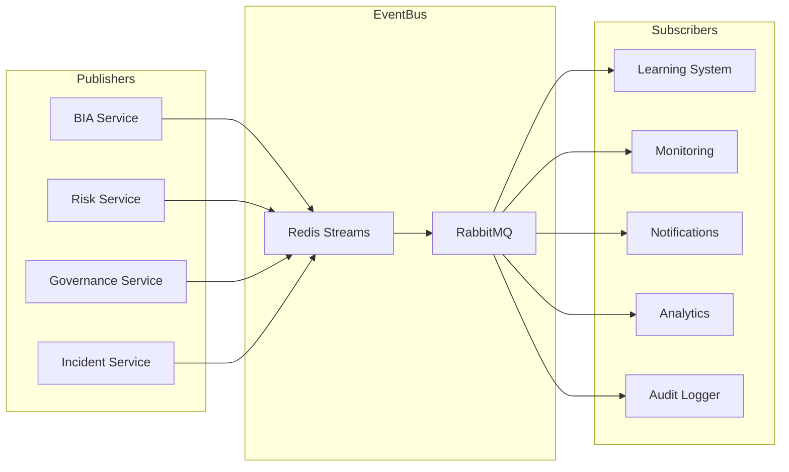

# BCM AI Platform - AsyncAPI 3.0 Specification

> **Event-driven architecture specification for the BCM AI Platform**
> **Version:** 1.0.0
> **AsyncAPI Version:** 3.0.0
> **Last Updated:** 2025-10-07

---

## Table of Contents

1. [Event Architecture Overview](#event-architecture-overview)
2. [Event Channels](#event-channels)
3. [Event Messages](#event-messages)
4. [Complete AsyncAPI YAML](#complete-asyncapi-yaml)
5. [Event Usage Examples](#event-usage-examples)
6. [Event Catalog](#event-catalog)

---

## Event Architecture Overview

### EventBus Architecture



### Event Patterns

| Pattern | Description | Use Case |
|---------|-------------|----------|
| **Publish-Subscribe** | One publisher, multiple subscribers | BIA created → notify learning, monitoring, audit |
| **Point-to-Point** | One publisher, one subscriber | Incident created → activate specific BC plan |
| **Event Sourcing** | Events as source of truth | Complete incident history reconstruction |
| **CQRS** | Command-Query Responsibility Segregation | Separate read/write models |

---

## Event Channels

### Channel Naming Convention

```
{domain}.{entity}.{action}
```

Examples:
- `bia.process.created`
- `risk.assessment.updated`
- `incident.response.activated`
- `plan.exercise.completed`

### Channel List

| Channel | Description | Publishers | Subscribers |
|---------|-------------|-----------|-------------|
| `bia.process.created` | New BIA process created | BIA Service | Learning, Monitoring, Audit |
| `bia.process.updated` | BIA process updated | BIA Service | Learning, Monitoring, Audit |
| `bia.process.deleted` | BIA process deleted | BIA Service | Audit |
| `bia.analysis.completed` | AI analysis completed | AI Foundation | BIA Service, Notifications |
| `risk.assessment.created` | New risk identified | Risk Service | Governance, Monitoring, Audit |
| `risk.assessment.updated` | Risk assessment updated | Risk Service | Governance, Monitoring, Audit |
| `risk.treatment.applied` | Risk treatment implemented | Risk Service | Compliance, Audit |
| `plan.created` | BC plan created | Governance Service | Learning, Notifications, Audit |
| `plan.updated` | BC plan updated | Governance Service | Learning, Notifications, Audit |
| `plan.activated` | BC plan activated (incident) | Incident Service | Notifications, Monitoring, Audit |
| `plan.deactivated` | BC plan deactivated | Incident Service | Notifications, Monitoring, Audit |
| `exercise.started` | Exercise started | Exercise Service | Monitoring, Notifications |
| `exercise.inject.sent` | Scenario inject sent | Exercise Service | Participants |
| `exercise.completed` | Exercise completed | Exercise Service | Learning, Reporting, Audit |
| `incident.detected` | Incident detected | Monitoring | Incident Service, Notifications |
| `incident.acknowledged` | Incident acknowledged | Incident Service | Notifications, Monitoring |
| `incident.resolved` | Incident resolved | Incident Service | Notifications, Reporting, Audit |
| `user.login` | User logged in | Auth Service | Audit, Analytics |
| `user.role.changed` | User role changed | User Service | Audit, Notifications |
| `compliance.scan.completed` | Compliance scan done | Compliance Service | Governance, Reporting |
| `alert.triggered` | Alert triggered | Monitoring | Notifications, Incident Service |

---

## Event Messages

### Standard Event Structure

All events follow this structure:

```json
{
  "event_id": "evt_20250107_abc123",
  "event_type": "bia.process.created",
  "timestamp": "2025-01-07T14:30:00Z",
  "version": "1.0",
  "source": {
    "service": "bia-service",
    "instance": "bia-service-pod-1"
  },
  "tenant_id": "tenant_abc",
  "user_id": "user_123",
  "correlation_id": "corr_xyz789",
  "data": {
    // Event-specific payload
  },
  "metadata": {
    "trace_id": "trace_456",
    "span_id": "span_789"
  }
}
```

### Event: `bia.process.created`

**Description:** Published when a new BIA process is created

**Payload:**
```json
{
  "event_id": "evt_20250107_abc123",
  "event_type": "bia.process.created",
  "timestamp": "2025-01-07T14:30:00Z",
  "version": "1.0",
  "source": {
    "service": "bia-service",
    "instance": "bia-service-pod-1"
  },
  "tenant_id": "tenant_abc",
  "user_id": "user_123",
  "correlation_id": "corr_xyz789",
  "data": {
    "bia_id": "550e8400-e29b-41d4-a716-446655440000",
    "process_name": "Customer Billing Process",
    "owner_id": "user_456",
    "department": "Finance",
    "criticality": "critical",
    "mtpd_hours": 24,
    "rto_hours": 12,
    "rpo_hours": 4,
    "financial_impact_per_hour": 50000.00,
    "status": "draft"
  },
  "metadata": {
    "trace_id": "trace_456",
    "ip_address": "203.0.113.42"
  }
}
```

**Subscribers:**
- Learning System → Extract patterns
- Monitoring → Update metrics
- Audit Logger → Record event

---

### Event: `incident.response.activated`

**Description:** Published when BC plan is activated during incident

**Payload:**
```json
{
  "event_id": "evt_20250107_inc001",
  "event_type": "incident.response.activated",
  "timestamp": "2025-01-07T15:45:00Z",
  "version": "1.0",
  "source": {
    "service": "incident-service",
    "instance": "incident-service-pod-2"
  },
  "tenant_id": "tenant_abc",
  "user_id": "user_incident_commander",
  "correlation_id": "corr_incident_123",
  "data": {
    "incident_id": "INC-2025-0042",
    "incident_type": "system_failure",
    "severity": "critical",
    "title": "Primary Data Center Power Failure",
    "affected_processes": [
      "bia_550e8400-e29b-41d4-a716-446655440000",
      "bia_660e8400-e29b-41d4-a716-446655440001"
    ],
    "activated_plans": [
      "plan_770e8400-e29b-41d4-a716-446655440000"
    ],
    "incident_commander_id": "user_incident_commander",
    "response_team_ids": [
      "user_123",
      "user_456",
      "user_789"
    ],
    "estimated_impact": "High - 1000+ customers affected",
    "activation_reason": "Primary data center power failure, failover required"
  },
  "metadata": {
    "trace_id": "trace_incident_001",
    "priority": "critical",
    "requires_notification": true,
    "notification_channels": ["sms", "email", "slack"]
  }
}
```

**Subscribers:**
- Notification Service → Send alerts to stakeholders
- Monitoring → Track incident metrics
- Audit Logger → Immutable incident log
- Analytics → Incident pattern analysis

---

### Event: `exercise.completed`

**Description:** Published when exercise is completed

**Payload:**
```json
{
  "event_id": "evt_20250107_ex001",
  "event_type": "exercise.completed",
  "timestamp": "2025-01-07T18:00:00Z",
  "version": "1.0",
  "source": {
    "service": "exercise-service",
    "instance": "exercise-service-pod-1"
  },
  "tenant_id": "tenant_abc",
  "user_id": "user_facilitator",
  "correlation_id": "corr_ex_001",
  "data": {
    "exercise_id": "ex_880e8400-e29b-41d4-a716-446655440000",
    "exercise_name": "Q1 2025 Cyber Incident Tabletop",
    "exercise_type": "tabletop",
    "scenario": "Ransomware attack affecting customer database",
    "duration_hours": 3.5,
    "participants": [
      {"user_id": "user_123", "role": "Incident Commander"},
      {"user_id": "user_456", "role": "IT Manager"},
      {"user_id": "user_789", "role": "Communications Lead"}
    ],
    "objectives_met": [
      "Validate BC plan activation procedures",
      "Test communication protocols"
    ],
    "objectives_not_met": [
      "Complete recovery within RTO"
    ],
    "findings_count": {
      "strengths": 5,
      "weaknesses": 3,
      "gaps": 2
    },
    "improvement_actions_count": 7,
    "overall_assessment": "partially_successful"
  },
  "metadata": {
    "trace_id": "trace_ex_001",
    "requires_report": true,
    "requires_action_tracking": true
  }
}
```

**Subscribers:**
- Learning System → Extract lessons learned
- Reporting → Generate after-action report
- Governance → Track improvement actions
- Audit Logger → Record exercise completion

---

## Complete AsyncAPI YAML

```yaml
asyncapi: 3.0.0

info:
  title: BCM AI Platform Event API
  version: 1.0.0
  description: |
    Event-driven architecture for the BCM AI Platform.

    ## Event Patterns
    - Publish-Subscribe for broadcasting events
    - Event Sourcing for audit trail
    - CQRS for read/write separation

    ## Event Delivery
    - **Transport:** Redis Streams + RabbitMQ
    - **Reliability:** At-least-once delivery
    - **Ordering:** Per-tenant ordering guaranteed
    - **Retention:** 30 days in Redis Streams

  contact:
    name: Platform Team
    email: platform@bcm.example.com

servers:
  production:
    host: redis.bcm.example.com:6379
    protocol: redis
    description: Production Redis Streams
    bindings:
      redis:
        bindingVersion: latest

  rabbitmq-production:
    host: rabbitmq.bcm.example.com:5672
    protocol: amqp
    description: Production RabbitMQ
    bindings:
      amqp:
        bindingVersion: latest

channels:
  bia_process_created:
    address: bia.process.created
    messages:
      BIAProcessCreated:
        $ref: '#/components/messages/BIAProcessCreated'
    description: Channel for BIA process creation events
    bindings:
      redis:
        channel: bia.process.created
        groupName: bia-consumers

  bia_process_updated:
    address: bia.process.updated
    messages:
      BIAProcessUpdated:
        $ref: '#/components/messages/BIAProcessUpdated'

  risk_assessment_created:
    address: risk.assessment.created
    messages:
      RiskAssessmentCreated:
        $ref: '#/components/messages/RiskAssessmentCreated'

  incident_response_activated:
    address: incident.response.activated
    messages:
      IncidentResponseActivated:
        $ref: '#/components/messages/IncidentResponseActivated'
    description: Channel for BC plan activation events during incidents

  exercise_completed:
    address: exercise.completed
    messages:
      ExerciseCompleted:
        $ref: '#/components/messages/ExerciseCompleted'

  plan_created:
    address: plan.created
    messages:
      PlanCreated:
        $ref: '#/components/messages/PlanCreated'

  user_login:
    address: user.login
    messages:
      UserLogin:
        $ref: '#/components/messages/UserLogin'

  alert_triggered:
    address: alert.triggered
    messages:
      AlertTriggered:
        $ref: '#/components/messages/AlertTriggered'

operations:
  publishBIACreated:
    action: send
    channel:
      $ref: '#/channels/bia_process_created'
    summary: Publish BIA process creation event
    messages:
      - $ref: '#/channels/bia_process_created/messages/BIAProcessCreated'

  subscribeBIACreated:
    action: receive
    channel:
      $ref: '#/channels/bia_process_created'
    summary: Subscribe to BIA process creation events
    messages:
      - $ref: '#/channels/bia_process_created/messages/BIAProcessCreated'

  publishIncidentActivated:
    action: send
    channel:
      $ref: '#/channels/incident_response_activated'
    summary: Publish incident response activation
    messages:
      - $ref: '#/channels/incident_response_activated/messages/IncidentResponseActivated'

  subscribeIncidentActivated:
    action: receive
    channel:
      $ref: '#/channels/incident_response_activated'
    summary: Subscribe to incident activation events
    messages:
      - $ref: '#/channels/incident_response_activated/messages/IncidentResponseActivated'

components:
  messages:
    BIAProcessCreated:
      name: BIAProcessCreated
      title: BIA Process Created
      summary: Event published when a new BIA process is created
      contentType: application/json
      payload:
        $ref: '#/components/schemas/BIAProcessCreatedPayload'

    BIAProcessUpdated:
      name: BIAProcessUpdated
      title: BIA Process Updated
      summary: Event published when BIA process is updated
      contentType: application/json
      payload:
        $ref: '#/components/schemas/BIAProcessUpdatedPayload'

    RiskAssessmentCreated:
      name: RiskAssessmentCreated
      title: Risk Assessment Created
      summary: Event published when new risk is identified
      contentType: application/json
      payload:
        $ref: '#/components/schemas/RiskAssessmentCreatedPayload'

    IncidentResponseActivated:
      name: IncidentResponseActivated
      title: Incident Response Activated
      summary: Event published when BC plan is activated
      contentType: application/json
      payload:
        $ref: '#/components/schemas/IncidentResponseActivatedPayload'

    ExerciseCompleted:
      name: ExerciseCompleted
      title: Exercise Completed
      summary: Event published when exercise is completed
      contentType: application/json
      payload:
        $ref: '#/components/schemas/ExerciseCompletedPayload'

    PlanCreated:
      name: PlanCreated
      title: BC Plan Created
      summary: Event published when BC plan is created
      contentType: application/json
      payload:
        $ref: '#/components/schemas/PlanCreatedPayload'

    UserLogin:
      name: UserLogin
      title: User Login
      summary: Event published when user logs in
      contentType: application/json
      payload:
        $ref: '#/components/schemas/UserLoginPayload'

    AlertTriggered:
      name: AlertTriggered
      title: Alert Triggered
      summary: Event published when monitoring alert is triggered
      contentType: application/json
      payload:
        $ref: '#/components/schemas/AlertTriggeredPayload'

  schemas:
    EventBase:
      type: object
      required:
        - event_id
        - event_type
        - timestamp
        - version
        - source
        - tenant_id
      properties:
        event_id:
          type: string
          description: Unique event identifier
          example: evt_20250107_abc123
        event_type:
          type: string
          description: Event type
          example: bia.process.created
        timestamp:
          type: string
          format: date-time
          description: Event timestamp (ISO 8601)
        version:
          type: string
          description: Event schema version
          example: "1.0"
        source:
          type: object
          properties:
            service:
              type: string
              example: bia-service
            instance:
              type: string
              example: bia-service-pod-1
        tenant_id:
          type: string
          format: uuid
        user_id:
          type: string
          format: uuid
        correlation_id:
          type: string
          description: Correlation ID for tracking related events
        metadata:
          type: object
          description: Additional metadata

    BIAProcessCreatedPayload:
      allOf:
        - $ref: '#/components/schemas/EventBase'
        - type: object
          properties:
            data:
              type: object
              required:
                - bia_id
                - process_name
                - criticality
              properties:
                bia_id:
                  type: string
                  format: uuid
                process_name:
                  type: string
                owner_id:
                  type: string
                  format: uuid
                department:
                  type: string
                criticality:
                  type: string
                  enum: [critical, important, normal]
                mtpd_hours:
                  type: integer
                rto_hours:
                  type: integer
                rpo_hours:
                  type: integer
                financial_impact_per_hour:
                  type: number
                status:
                  type: string

    BIAProcessUpdatedPayload:
      allOf:
        - $ref: '#/components/schemas/EventBase'
        - type: object
          properties:
            data:
              type: object
              properties:
                bia_id:
                  type: string
                  format: uuid
                changes:
                  type: object
                  description: Changed fields
                previous_values:
                  type: object
                  description: Previous values
                new_values:
                  type: object
                  description: New values

    RiskAssessmentCreatedPayload:
      allOf:
        - $ref: '#/components/schemas/EventBase'
        - type: object
          properties:
            data:
              type: object
              properties:
                risk_id:
                  type: string
                  format: uuid
                title:
                  type: string
                category:
                  type: string
                likelihood:
                  type: string
                impact:
                  type: string
                risk_score:
                  type: number
                inherent_risk_level:
                  type: string

    IncidentResponseActivatedPayload:
      allOf:
        - $ref: '#/components/schemas/EventBase'
        - type: object
          properties:
            data:
              type: object
              required:
                - incident_id
                - severity
                - activated_plans
              properties:
                incident_id:
                  type: string
                incident_type:
                  type: string
                severity:
                  type: string
                  enum: [low, medium, high, critical]
                title:
                  type: string
                affected_processes:
                  type: array
                  items:
                    type: string
                activated_plans:
                  type: array
                  items:
                    type: string
                incident_commander_id:
                  type: string
                response_team_ids:
                  type: array
                  items:
                    type: string

    ExerciseCompletedPayload:
      allOf:
        - $ref: '#/components/schemas/EventBase'
        - type: object
          properties:
            data:
              type: object
              properties:
                exercise_id:
                  type: string
                  format: uuid
                exercise_name:
                  type: string
                exercise_type:
                  type: string
                duration_hours:
                  type: number
                participants:
                  type: array
                  items:
                    type: object
                findings_count:
                  type: object
                overall_assessment:
                  type: string

    PlanCreatedPayload:
      allOf:
        - $ref: '#/components/schemas/EventBase'
        - type: object
          properties:
            data:
              type: object
              properties:
                plan_id:
                  type: string
                  format: uuid
                plan_name:
                  type: string
                processes_covered:
                  type: array
                  items:
                    type: string
                owner_id:
                  type: string
                status:
                  type: string

    UserLoginPayload:
      allOf:
        - $ref: '#/components/schemas/EventBase'
        - type: object
          properties:
            data:
              type: object
              properties:
                user_id:
                  type: string
                email:
                  type: string
                role:
                  type: string
                ip_address:
                  type: string
                user_agent:
                  type: string
                mfa_used:
                  type: boolean

    AlertTriggeredPayload:
      allOf:
        - $ref: '#/components/schemas/EventBase'
        - type: object
          properties:
            data:
              type: object
              properties:
                alert_id:
                  type: string
                alert_name:
                  type: string
                severity:
                  type: string
                  enum: [info, warning, error, critical]
                metric_name:
                  type: string
                threshold_value:
                  type: number
                actual_value:
                  type: number
                message:
                  type: string
```

---

## Event Usage Examples

### Python Publisher

```python
import json
import redis
from datetime import datetime
import uuid

class EventPublisher:
    def __init__(self, redis_client: redis.Redis):
        self.redis = redis_client

    def publish_event(self, event_type: str, data: dict, tenant_id: str, user_id: str):
        """Publish event to Redis Streams"""
        event = {
            "event_id": f"evt_{datetime.utcnow().strftime('%Y%m%d')}_{uuid.uuid4().hex[:8]}",
            "event_type": event_type,
            "timestamp": datetime.utcnow().isoformat() + "Z",
            "version": "1.0",
            "source": {
                "service": "bia-service",
                "instance": "pod-1"
            },
            "tenant_id": tenant_id,
            "user_id": user_id,
            "correlation_id": f"corr_{uuid.uuid4().hex}",
            "data": data
        }

        # Publish to Redis Stream
        stream_key = event_type.replace(".", ":")
        self.redis.xadd(stream_key, {"event": json.dumps(event)})

        print(f"Published event: {event['event_id']} to {stream_key}")
        return event["event_id"]

# Usage
redis_client = redis.Redis(host='localhost', port=6379)
publisher = EventPublisher(redis_client)

# Publish BIA created event
publisher.publish_event(
    event_type="bia.process.created",
    data={
        "bia_id": str(uuid.uuid4()),
        "process_name": "Customer Billing",
        "criticality": "critical",
        "mtpd_hours": 24,
        "rto_hours": 12
    },
    tenant_id="tenant_abc",
    user_id="user_123"
)
```

### Python Subscriber

```python
import json
import redis

class EventSubscriber:
    def __init__(self, redis_client: redis.Redis, consumer_group: str, consumer_name: str):
        self.redis = redis_client
        self.consumer_group = consumer_group
        self.consumer_name = consumer_name

    def subscribe(self, stream_key: str, handler):
        """Subscribe to Redis Stream"""
        # Create consumer group if not exists
        try:
            self.redis.xgroup_create(stream_key, self.consumer_group, id='0', mkstream=True)
        except redis.exceptions.ResponseError as e:
            if "BUSYGROUP" not in str(e):
                raise

        print(f"Subscribing to {stream_key} as {self.consumer_name}")

        # Read from stream
        while True:
            messages = self.redis.xreadgroup(
                self.consumer_group,
                self.consumer_name,
                {stream_key: '>'},
                count=10,
                block=1000
            )

            for stream, events in messages:
                for event_id, event_data in events:
                    # Parse event
                    event = json.loads(event_data[b'event'])

                    # Handle event
                    handler(event)

                    # Acknowledge
                    self.redis.xack(stream_key, self.consumer_group, event_id)

# Handler function
def handle_bia_created(event):
    print(f"Received event: {event['event_id']}")
    print(f"BIA ID: {event['data']['bia_id']}")
    print(f"Process: {event['data']['process_name']}")

    # Process event (e.g., update analytics, send notification)
    # ...

# Usage
redis_client = redis.Redis(host='localhost', port=6379)
subscriber = EventSubscriber(
    redis_client,
    consumer_group="learning-system",
    consumer_name="learning-worker-1"
)

subscriber.subscribe("bia:process:created", handle_bia_created)
```

### JavaScript Publisher

```javascript
const Redis = require('ioredis');
const { v4: uuidv4 } = require('uuid');

class EventPublisher {
  constructor(redisClient) {
    this.redis = redisClient;
  }

  async publishEvent(eventType, data, tenantId, userId) {
    const event = {
      event_id: `evt_${new Date().toISOString().split('T')[0].replace(/-/g, '')}_${uuidv4().slice(0, 8)}`,
      event_type: eventType,
      timestamp: new Date().toISOString(),
      version: '1.0',
      source: {
        service: 'bia-service',
        instance: 'pod-1'
      },
      tenant_id: tenantId,
      user_id: userId,
      correlation_id: `corr_${uuidv4()}`,
      data: data
    };

    const streamKey = eventType.replace(/\./g, ':');
    await this.redis.xadd(streamKey, '*', 'event', JSON.stringify(event));

    console.log(`Published event: ${event.event_id} to ${streamKey}`);
    return event.event_id;
  }
}

// Usage
const redis = new Redis();
const publisher = new EventPublisher(redis);

await publisher.publishEvent(
  'bia.process.created',
  {
    bia_id: uuidv4(),
    process_name: 'Customer Billing',
    criticality: 'critical',
    mtpd_hours: 24,
    rto_hours: 12
  },
  'tenant_abc',
  'user_123'
);
```

---

## Event Catalog

### Complete Event List

| Event Type | Publisher | Subscribers | Payload Size | Frequency |
|------------|-----------|-------------|--------------|-----------|
| `bia.process.created` | BIA Service | Learning, Monitoring, Audit | ~2KB | ~100/day |
| `bia.process.updated` | BIA Service | Learning, Monitoring, Audit | ~2KB | ~200/day |
| `bia.process.deleted` | BIA Service | Audit | ~1KB | ~10/day |
| `bia.analysis.completed` | AI Foundation | BIA Service, Notifications | ~5KB | ~50/day |
| `risk.assessment.created` | Risk Service | Governance, Monitoring, Audit | ~2KB | ~80/day |
| `risk.assessment.updated` | Risk Service | Governance, Monitoring, Audit | ~2KB | ~150/day |
| `risk.treatment.applied` | Risk Service | Compliance, Audit | ~1KB | ~30/day |
| `plan.created` | Governance Service | Learning, Notifications, Audit | ~10KB | ~20/day |
| `plan.updated` | Governance Service | Learning, Notifications, Audit | ~10KB | ~40/day |
| `plan.activated` | Incident Service | Notifications, Monitoring, Audit | ~3KB | ~5/month |
| `plan.deactivated` | Incident Service | Notifications, Monitoring, Audit | ~2KB | ~5/month |
| `exercise.started` | Exercise Service | Monitoring, Notifications | ~2KB | ~10/month |
| `exercise.completed` | Exercise Service | Learning, Reporting, Audit | ~5KB | ~10/month |
| `incident.detected` | Monitoring | Incident Service, Notifications | ~2KB | ~20/month |
| `incident.acknowledged` | Incident Service | Notifications, Monitoring | ~1KB | ~20/month |
| `incident.resolved` | Incident Service | Notifications, Reporting, Audit | ~3KB | ~20/month |
| `user.login` | Auth Service | Audit, Analytics | ~1KB | ~1000/day |
| `user.role.changed` | User Service | Audit, Notifications | ~1KB | ~5/day |
| `compliance.scan.completed` | Compliance Service | Governance, Reporting | ~10KB | ~1/day |
| `alert.triggered` | Monitoring | Notifications, Incident Service | ~2KB | ~50/day |

### Event Retention

| Priority | Retention Period | Storage |
|----------|-----------------|---------|
| **Critical** (incidents, audits) | 7 years | PostgreSQL + Blockchain |
| **High** (BIA, risks, plans) | 3 years | PostgreSQL |
| **Medium** (exercises, analytics) | 1 year | PostgreSQL |
| **Low** (user actions, alerts) | 90 days | Redis Streams only |

---

**Document Version:** 1.0.0
**Last Updated:** 2025-10-07
**Maintained By:** Platform Team
