# AI-Platform-ISO - Complete System Architecture Visualizations

**Generated:** 2025-10-08
**Version:** 1.0.0
**Total Components:** 31+ Services
**Architecture Type:** Microservices with Event-Driven Architecture
**Compliance:** ISO 22301:2019, ISO/IEC 42001:2023

---

## Table of Contents

1. [Complete System Architecture](#1-complete-system-architecture)
2. [Layered Architecture View](#2-layered-architecture-view)
3. [Service Dependency Graph](#3-service-dependency-graph)
4. [Data Flow Visualization](#4-data-flow-visualization)
5. [Event-Driven Architecture](#5-event-driven-architecture)
6. [Database Architecture](#6-database-architecture)
7. [API Communication Patterns](#7-api-communication-patterns)
8. [Deployment Architecture](#8-deployment-architecture)
9. [Infrastructure Layer](#9-infrastructure-layer)
10. [Real-Time Event Flows](#10-real-time-event-flows)

---

## 1. Complete System Architecture

### 1.1 High-Level System Overview

```mermaid
graph TB
    subgraph "User Layer"
        UI[Web Dashboard<br/>Port 3001]
        API_GW[API Gateway<br/>Port 8000]
    end

    subgraph "Intelligent Core - The Brain"
        subgraph "Foundation Layer"
            AI_FOUND[AI Foundation<br/>Port 8040<br/>LLM/RAG/ML]
            SHARED[Shared Utilities<br/>EventBus/Clients]
        end

        subgraph "Intelligence & Orchestration"
            WF_INT[Workflow Intelligence<br/>Port 8037<br/>BPMN Engine]
            AI_ORCH[AI Orchestration<br/>Port 8030<br/>Decision Brain]
            COORD[Coordination Center<br/>Port 8034<br/>Intent→API]
            WF_ENG[Workflow Engine<br/>Port 8036<br/>BPMN 2.0]
            AI_OPT[AI Workflow Optimizer<br/>Port 8038<br/>ML Optimization]
            EVENT_INT[Event Intelligence<br/>Port 8039<br/>Auto-Discovery]
        end

        subgraph "Domain Expertise"
            EXPERT[Expertise Center<br/>Port 8035<br/>22 AI Specialists]
            COMM_INT[Community Intelligence<br/>Port 8030<br/>Peer Review]
            COLLECTIVE[Collective<br/>Port 8032<br/>Anonymous Collab]
        end

        subgraph "Predictive Layer"
            PREDICT[Predictive Service<br/>Port 8031<br/>Journey Prediction]
        end
    end

    subgraph "Platform Services - BCM Core"
        subgraph "Core BCM Services"
            BIA[BIA Service<br/>Port 8012]
            RISK[Risk Service<br/>Port 8040]
            COMP[Compliance Service<br/>Port 8014]
            GOV[Governance Service<br/>Port 8013]
            DOC[Documents Service<br/>Port 8024]
            VAL[Validation Service<br/>Port 8022]
        end

        subgraph "Planning & Execution"
            PLAN[Planning Service<br/>Port 8011]
            PLANS[Plans Service<br/>Port 8023]
            RESP[Response Service<br/>Port 8041]
        end

        subgraph "Intelligence Services"
            LEARN[Learning Service<br/>Port 8021]
            LIVING[Living Docs<br/>Port 8034]
            SIM[Simulation<br/>Port 8031+]
        end

        subgraph "Coordination"
            BCM_COORD[BCM Coordination<br/>Port 8070]
        end
    end

    subgraph "Infrastructure Layer"
        subgraph "Databases"
            PG[(PostgreSQL<br/>Port 5432<br/>bcm_platform)]
            REDIS[(Redis<br/>Port 6379<br/>Cache)]
            QDRANT[(Qdrant<br/>Port 6333<br/>Vector DB)]
        end

        subgraph "Message Queue"
            RABBIT[RabbitMQ<br/>Port 5672<br/>EventBus Backend]
        end

        subgraph "Observability"
            PROM[Prometheus<br/>Port 9090]
            GRAF[Grafana<br/>Port 3000]
            LOKI[Loki<br/>Logs]
        end

        subgraph "Gateway & Auth"
            SEC_GW[Security Gateway<br/>Port 8888]
            AUTH[Auth Service<br/>JWT/OAuth]
        end
    end

    %% User to System
    UI --> API_GW
    API_GW --> AI_ORCH

    %% Foundation Dependencies
    AI_ORCH --> AI_FOUND
    WF_INT --> AI_FOUND
    AI_OPT --> AI_FOUND
    EVENT_INT --> AI_FOUND
    EXPERT --> AI_FOUND
    COMM_INT --> AI_FOUND
    COLLECTIVE --> AI_FOUND
    PREDICT --> AI_FOUND

    %% Orchestration Flow
    AI_ORCH --> COORD
    COORD --> WF_INT
    WF_INT --> WF_ENG
    AI_ORCH -.monitors.-> EVENT_INT

    %% Intelligence Flow
    WF_INT --> AI_OPT
    AI_OPT --> EXPERT
    WF_INT --> COMM_INT
    COMM_INT --> COLLECTIVE
    WF_INT --> PREDICT

    %% Platform Services Integration
    AI_ORCH --> BCM_COORD
    BCM_COORD --> BIA
    BCM_COORD --> RISK
    BCM_COORD --> COMP
    BCM_COORD --> GOV
    BCM_COORD --> DOC
    BCM_COORD --> VAL
    BCM_COORD --> PLAN
    BCM_COORD --> PLANS
    BCM_COORD --> RESP
    BCM_COORD --> LEARN
    BCM_COORD --> LIVING
    BCM_COORD --> SIM

    %% All Services to Infrastructure
    AI_FOUND -.-> PG
    WF_INT -.-> PG
    EXPERT -.-> QDRANT
    DOC -.-> QDRANT

    AI_ORCH -.-> REDIS
    COORD -.-> REDIS

    BIA -.-> PG
    RISK -.-> PG
    COMP -.-> PG
    GOV -.-> PG
    DOC -.-> PG
    VAL -.-> PG
    PLAN -.-> PG
    PLANS -.-> PG
    RESP -.-> PG
    LEARN -.-> PG

    %% EventBus
    SHARED -.-> RABBIT
    AI_ORCH -.-> RABBIT
    WF_INT -.-> RABBIT
    EVENT_INT -.-> RABBIT
    BIA -.-> RABBIT
    RISK -.-> RABBIT

    %% Monitoring
    AI_ORCH -.metrics.-> PROM
    WF_INT -.metrics.-> PROM
    BIA -.metrics.-> PROM
    PROM --> GRAF

    %% Security
    API_GW --> SEC_GW
    SEC_GW --> AUTH

    style AI_FOUND fill:#e1f5ff
    style AI_ORCH fill:#fff3cd
    style WF_INT fill:#d4edda
    style EXPERT fill:#cce5ff
    style PG fill:#f8d7da
    style REDIS fill:#d1ecf1
    style RABBIT fill:#d6d8db
```

---

## 2. Layered Architecture View

### 2.1 Four-Layer Architecture

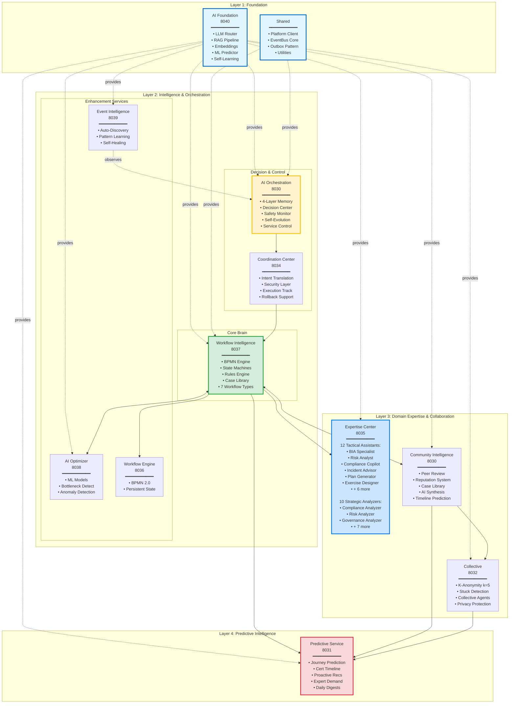

### 2.2 Platform Services Layer

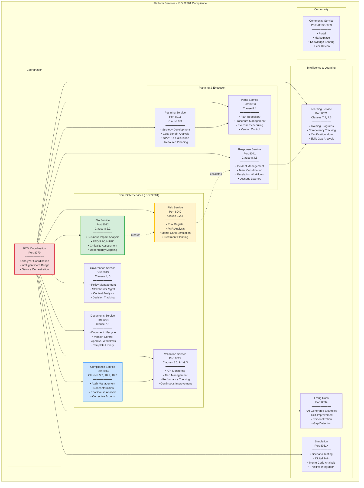

---

## 3. Service Dependency Graph

### 3.1 Complete Dependency Map

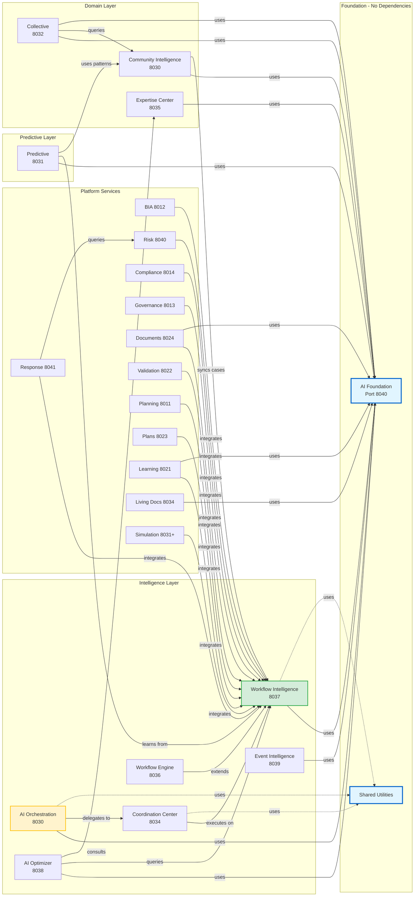

### 3.2 Reverse Dependency View (Who Uses What)

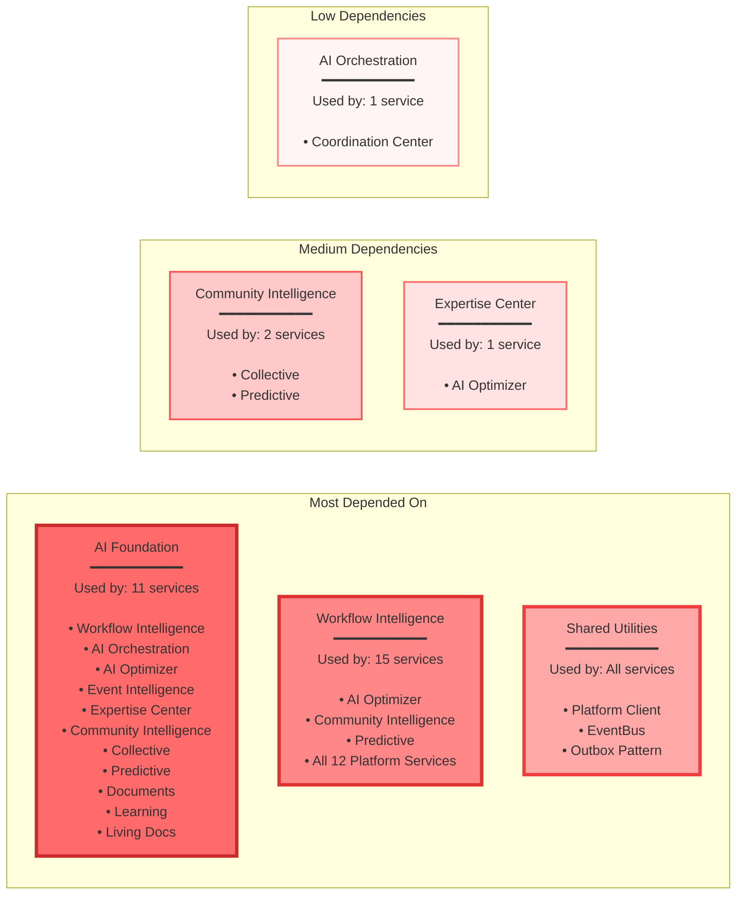

---

## 4. Data Flow Visualization

### 4.1 Complete Workflow Execution Flow

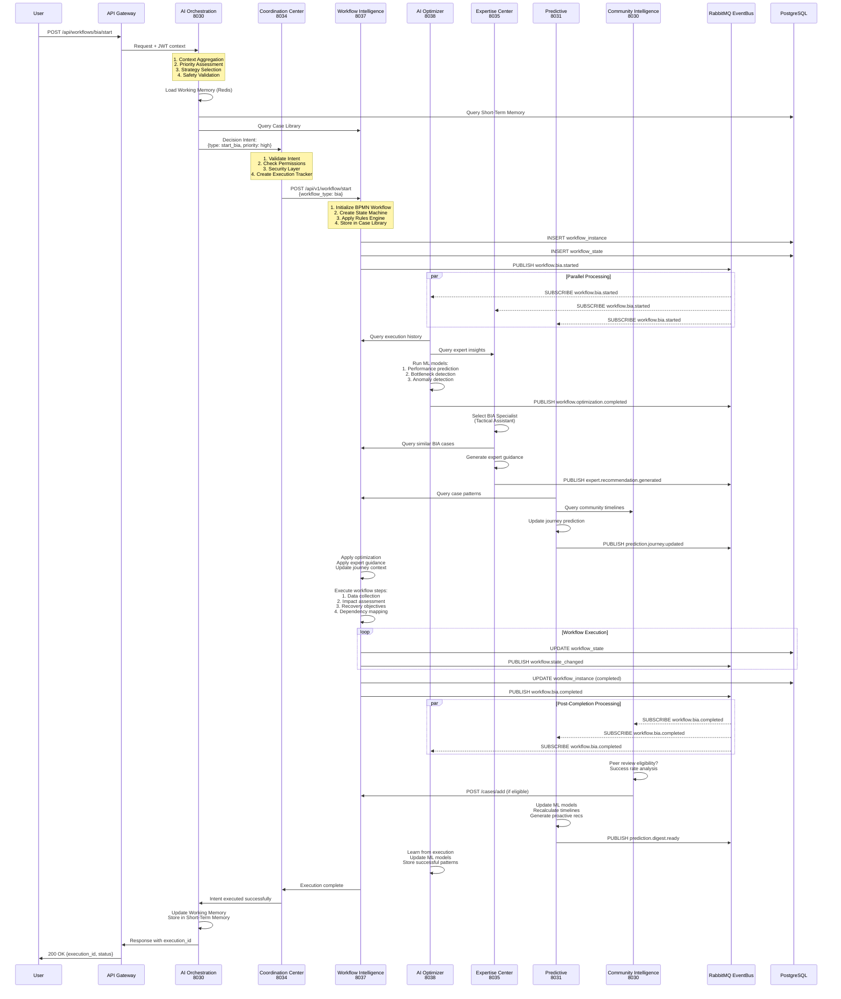

### 4.2 AI-Powered Analysis Flow

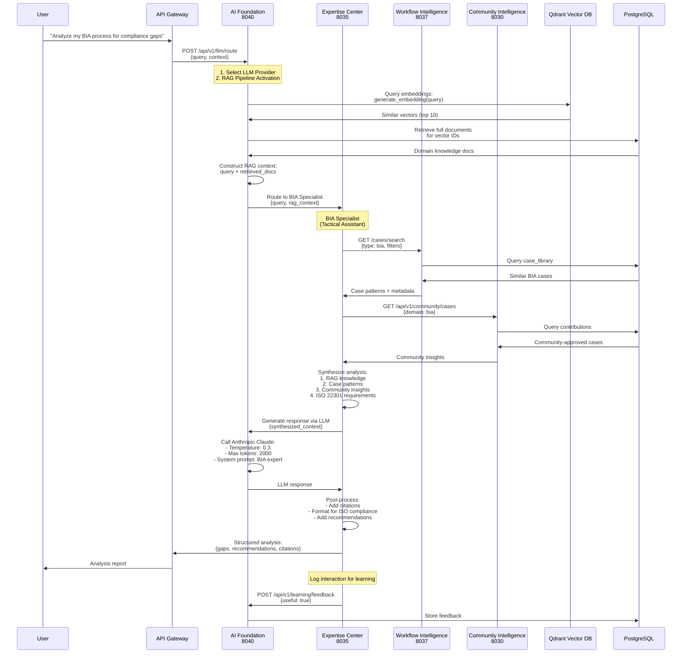

### 4.3 Predictive Intelligence Flow

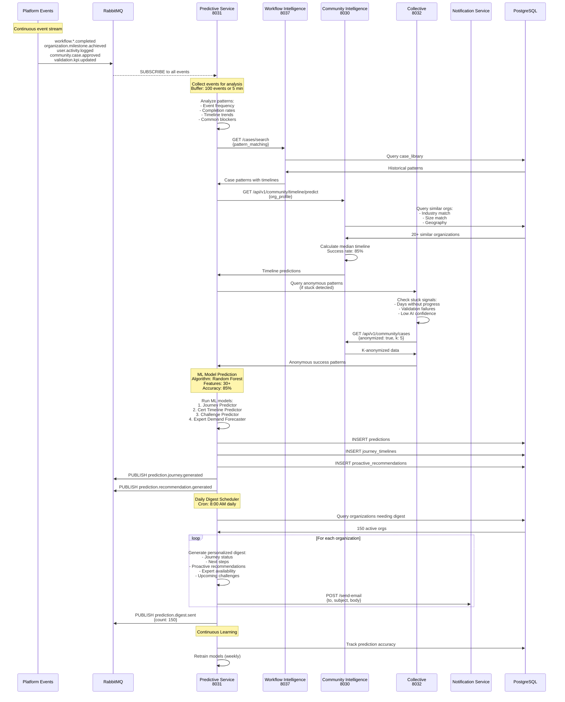

### 4.4 Collective Intelligence Flow

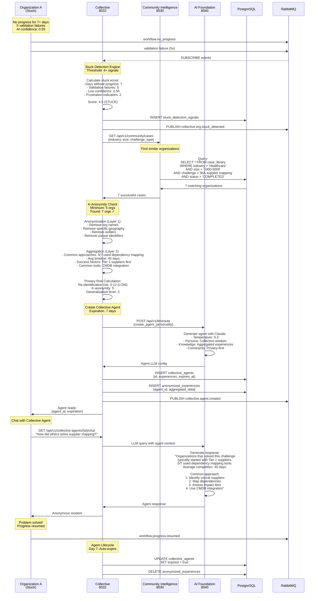

---

## 5. Event-Driven Architecture

### 5.1 EventBus Topology

```mermaid
graph TB
    subgraph "Event Publishers (40+ events)"
        AI_FOUND_P[AI Foundation<br/>━━━━━━━━━━━<br/>• ai.llm.routed<br/>• ai.rag.queried<br/>• ai.learning.feedback_received]

        WF_INT_P[Workflow Intelligence<br/>━━━━━━━━━━━<br/>• workflow.*.started<br/>• workflow.*.completed<br/>• workflow.*.failed<br/>• workflow.state_changed]

        AI_OPT_P[AI Optimizer<br/>━━━━━━━━━━━<br/>• workflow.optimization.completed<br/>• ml.model.trained]

        EVENT_INT_P[Event Intelligence<br/>━━━━━━━━━━━<br/>• event.analyzed<br/>• event.pattern_detected<br/>• event.anomaly_detected]

        AI_ORCH_P[AI Orchestration<br/>━━━━━━━━━━━<br/>• orchestration.decision_made<br/>• orchestration.service.*<br/>• ai.decision.*<br/>• (10+ events)]

        COORD_P[Coordination Center<br/>━━━━━━━━━━━<br/>• coordination.execution.*<br/>• coordination.approval_required]

        EXPERT_P[Expertise Center<br/>━━━━━━━━━━━<br/>• expert.analysis.completed<br/>• expert.recommendation.*]

        COMM_INT_P[Community Intelligence<br/>━━━━━━━━━━━<br/>• community.case.approved<br/>• community.contribution.*<br/>• community.review.*]

        COLLECTIVE_P[Collective<br/>━━━━━━━━━━━<br/>• collective.agent.created<br/>• collective.org.stuck_detected]

        PREDICT_P[Predictive<br/>━━━━━━━━━━━<br/>• prediction.journey.generated<br/>• prediction.certification.estimated<br/>• prediction.recommendation.generated<br/>• (8+ events)]

        PLATFORM_P[Platform Services<br/>━━━━━━━━━━━<br/>• bia.created<br/>• risk.escalated<br/>• compliance.audit.*<br/>• validation.alert.*<br/>• (20+ events)]
    end

    subgraph "RabbitMQ EventBus"
        EXCHANGE[Topic Exchange<br/>'platform_events'<br/>━━━━━━━━━━━<br/>Routing: Topic-based<br/>Durable: Yes<br/>Auto-delete: No]

        subgraph "Queues"
            Q_ORCH[orchestration_queue<br/>Pattern: *.*]
            Q_EVENT[event_intelligence_queue<br/>Pattern: *.*]
            Q_COORD[coordination_queue<br/>Pattern: orchestration.*<br/>Pattern: workflow.action_required]
            Q_EXPERT[expertise_queue<br/>Pattern: workflow.*.started<br/>Pattern: user.question]
            Q_COMM[community_queue<br/>Pattern: workflow.stuck<br/>Pattern: user.inactive]
            Q_COLLECT[collective_queue<br/>Pattern: workflow.no_progress<br/>Pattern: validation.failure]
            Q_PREDICT[predictive_queue<br/>Pattern: workflow.*.completed<br/>Pattern: organization.milestone.*]
            Q_PLATFORM[platform_queue<br/>Pattern: bia.*<br/>Pattern: risk.*<br/>Pattern: compliance.*]
        end
    end

    subgraph "Event Subscribers (25+ patterns)"
        AI_ORCH_S[AI Orchestration<br/>Subscribes: ALL events *.*<br/>(Context Aggregation)]

        EVENT_INT_S[Event Intelligence<br/>Subscribes: ALL events *.*<br/>(Auto-Discovery)]

        COORD_S[Coordination Center<br/>Subscribes: orchestration.*<br/>workflow.action_required]

        EXPERT_S[Expertise Center<br/>Subscribes: workflow.*.started<br/>user.question]

        COMM_INT_S[Community Intelligence<br/>Subscribes: workflow.stuck<br/>user.inactive]

        COLLECTIVE_S[Collective<br/>Subscribes: workflow.no_progress<br/>validation.failure]

        PREDICT_S[Predictive<br/>Subscribes: workflow.*.completed<br/>organization.milestone.*<br/>user.activity.logged]

        AI_OPT_S[AI Optimizer<br/>Subscribes: workflow.execution.completed]
    end

    %% Publishers to Exchange
    AI_FOUND_P -->|publish| EXCHANGE
    WF_INT_P -->|publish| EXCHANGE
    AI_OPT_P -->|publish| EXCHANGE
    EVENT_INT_P -->|publish| EXCHANGE
    AI_ORCH_P -->|publish| EXCHANGE
    COORD_P -->|publish| EXCHANGE
    EXPERT_P -->|publish| EXCHANGE
    COMM_INT_P -->|publish| EXCHANGE
    COLLECTIVE_P -->|publish| EXCHANGE
    PREDICT_P -->|publish| EXCHANGE
    PLATFORM_P -->|publish| EXCHANGE

    %% Exchange to Queues
    EXCHANGE -->|route *.*| Q_ORCH
    EXCHANGE -->|route *.*| Q_EVENT
    EXCHANGE -->|route| Q_COORD
    EXCHANGE -->|route| Q_EXPERT
    EXCHANGE -->|route| Q_COMM
    EXCHANGE -->|route| Q_COLLECT
    EXCHANGE -->|route| Q_PREDICT
    EXCHANGE -->|route| Q_PLATFORM

    %% Queues to Subscribers
    Q_ORCH -->|deliver| AI_ORCH_S
    Q_EVENT -->|deliver| EVENT_INT_S
    Q_COORD -->|deliver| COORD_S
    Q_EXPERT -->|deliver| EXPERT_S
    Q_COMM -->|deliver| COMM_INT_S
    Q_COLLECT -->|deliver| COLLECTIVE_S
    Q_PREDICT -->|deliver| PREDICT_S
    Q_PLATFORM -->|deliver| AI_OPT_S

    style EXCHANGE fill:#fff3cd,stroke:#ffc107,stroke-width:3px
    style AI_ORCH_S fill:#f8d7da,stroke:#dc3545,stroke-width:2px
    style EVENT_INT_S fill:#f8d7da,stroke:#dc3545,stroke-width:2px
```

### 5.2 Event Flow Patterns

```mermaid
graph TB
    subgraph "Pattern 1: Workflow Lifecycle Events"
        WF_START[workflow.bia.started] --> WF_STATE[workflow.state_changed]
        WF_STATE --> WF_COMPLETE[workflow.bia.completed]
        WF_COMPLETE --> WF_LEARN[Learning & Optimization]
    end

    subgraph "Pattern 2: Cascade Events"
        BIA_CREATE[bia.created] -.triggers.-> RISK_AUTO[risk.auto_created]
        RISK_AUTO --> RISK_CRITICAL[risk.critical_detected]
        RISK_CRITICAL -.triggers.-> INCIDENT_AUTO[incident.auto_escalated]
    end

    subgraph "Pattern 3: Predictive Events"
        MILESTONE[organization.milestone.achieved]
        WORKFLOW_COMP[workflow.*.completed]
        USER_ACT[user.activity.logged]

        MILESTONE --> PREDICT_ENGINE[Predictive Engine]
        WORKFLOW_COMP --> PREDICT_ENGINE
        USER_ACT --> PREDICT_ENGINE

        PREDICT_ENGINE --> JOURNEY[prediction.journey.generated]
        PREDICT_ENGINE --> CERT[prediction.certification.estimated]
        PREDICT_ENGINE --> REC[prediction.recommendation.generated]
    end

    subgraph "Pattern 4: Stuck Detection"
        NO_PROGRESS[workflow.no_progress]
        VAL_FAIL[validation.failure]
        LOW_CONF[ai.confidence.low]

        NO_PROGRESS --> STUCK_ENGINE[Stuck Detection Engine]
        VAL_FAIL --> STUCK_ENGINE
        LOW_CONF --> STUCK_ENGINE

        STUCK_ENGINE --> STUCK_DET[collective.org.stuck_detected]
        STUCK_DET --> AGENT_CREATE[collective.agent.created]
    end

    subgraph "Pattern 5: Community Workflow"
        CONTRIB[community.contribution.submitted]
        CONTRIB --> REVIEW1[community.review.1_completed]
        REVIEW1 --> REVIEW2[community.review.2_completed]
        REVIEW2 --> REVIEW3[community.review.3_completed]
        REVIEW3 --> APPROVED[community.case.approved]
        APPROVED --> CASE_SYNC[workflow.case_library.synced]
    end

    style WF_START fill:#d4edda,stroke:#28a745,stroke-width:2px
    style BIA_CREATE fill:#fff3cd,stroke:#ffc107,stroke-width:2px
    style MILESTONE fill:#cce5ff,stroke:#007bff,stroke-width:2px
    style NO_PROGRESS fill:#f8d7da,stroke:#dc3545,stroke-width:2px
    style CONTRIB fill:#e7f3ff,stroke:#0088cc,stroke-width:2px
```

---

## 6. Database Architecture

### 6.1 Database Schema Organization

```mermaid
graph TB
    subgraph "PostgreSQL: bcm_platform"
        subgraph "Shared Schemas (public)"
            AUDIT[audit_logs<br/>━━━━━━━━━━━<br/>All DML operations<br/>User context<br/>Change tracking]

            CHANGE[change_history<br/>━━━━━━━━━━━<br/>Field-level changes<br/>DeepDiff-based<br/>Audit trail]

            TENANT[tenant_config<br/>━━━━━━━━━━━<br/>Tenant metadata<br/>Configuration<br/>Subscription tier]
        end

        subgraph "BIA Schema"
            BIA_P[bia_processes]
            BIA_A[bia_assessments]
            BIA_R[bia_resources]
            BIA_D[bia_dependencies]
        end

        subgraph "Risk Schema"
            RISK_R[risks]
            RISK_A[risk_assessments]
            RISK_T[risk_treatments]
            RISK_C[risk_controls]
            RISK_M[risk_monitoring]
        end

        subgraph "Compliance Schema"
            COMP_A[audits]
            COMP_E[audit_evidence]
            COMP_F[audit_findings]
            COMP_N[nonconformities]
            COMP_C[corrective_actions]
            COMP_I[improvements]
        end

        subgraph "Governance Schema"
            GOV_P[governance_policies]
            GOV_S[governance_stakeholders]
            GOV_R[governance_responsibilities]
            GOV_C[governance_context]
            GOV_D[governance_decisions]
        end

        subgraph "Documents Schema"
            DOC_D[documents]
            DOC_V[document_versions]
            DOC_A[document_approvals]
            DOC_AC[document_access]
            DOC_T[document_templates]
        end

        subgraph "Validation Schema"
            VAL_K[validation_kpis]
            VAL_M[validation_metrics]
            VAL_A[validation_alerts]
            VAL_T[validation_thresholds]
        end

        subgraph "Planning Schema"
            PLAN_S[strategies]
            PLAN_R[strategy_resources]
            PLAN_C[cost_benefit_analyses]
        end

        subgraph "Plans Schema"
            PLANS_P[plans]
            PLANS_PR[procedures]
            PLANS_R[plan_resources]
            PLANS_E[plan_exercises]
        end

        subgraph "Response Schema"
            RESP_I[incidents]
            RESP_T[incident_timeline]
            RESP_TM[incident_teams]
            RESP_E[incident_escalations]
            RESP_L[lessons_learned]
        end

        subgraph "Learning Schema"
            LEARN_P[training_programs]
            LEARN_E[training_enrollments]
            LEARN_A[training_assessments]
            LEARN_C[training_certifications]
        end

        subgraph "Workflow Schema"
            WF_I[workflow_instances]
            WF_S[workflow_states]
            WF_T[workflow_transitions]
            WF_C[case_library]
        end

        subgraph "Community Schema"
            COMM_CONT[contributions]
            COMM_REV[peer_reviews]
            COMM_REP[reputation_scores]
            COMM_CASE[case_library<br/>(shared)]
        end

        subgraph "Collective Schema"
            COLL_A[collective_agents]
            COLL_S[stuck_detection_signals]
            COLL_E[anonymized_experiences]
        end

        subgraph "Predictive Schema"
            PRED_P[predictions]
            PRED_J[journey_timelines]
            PRED_R[proactive_recommendations]
            PRED_D[expert_demand_forecasts]
        end

        subgraph "Simulation Schema"
            SIM_S[simulations]
            SIM_SC[simulation_scenarios]
            SIM_R[simulation_results]
            SIM_DT[digital_twin_organizations]
        end
    end

    subgraph "Redis Cache"
        REDIS_WM[Working Memory<br/>TTL: 1 hour<br/>━━━━━━━━━━━<br/>AI Orchestration state]

        REDIS_WF[Workflow State Cache<br/>TTL: 24 hours<br/>━━━━━━━━━━━<br/>Active workflows]

        REDIS_SESS[Session Cache<br/>TTL: 8 hours<br/>━━━━━━━━━━━<br/>User sessions]

        REDIS_RATE[Rate Limit Counters<br/>TTL: Variable<br/>━━━━━━━━━━━<br/>API rate limiting]
    end

    subgraph "Qdrant Vector DB"
        QDRANT_KB[knowledge_base_embeddings<br/>Dimension: 768<br/>━━━━━━━━━━━<br/>Domain knowledge vectors]

        QDRANT_CASE[case_library_vectors<br/>Dimension: 768<br/>━━━━━━━━━━━<br/>Workflow case embeddings]

        QDRANT_DOC[domain_knowledge_vectors<br/>Dimension: 768<br/>━━━━━━━━━━━<br/>ISO 22301 documentation]
    end

    %% Shared table relationships
    BIA_P -.logs to.-> AUDIT
    RISK_R -.logs to.-> AUDIT
    COMP_A -.logs to.-> AUDIT

    BIA_P -.tracks changes.-> CHANGE
    RISK_R -.tracks changes.-> CHANGE

    %% Cross-schema relationships (via application)
    WF_C -.syncs with.-> COMM_CASE

    %% Cache relationships
    WF_I -.caches in.-> REDIS_WF

    %% Vector relationships
    DOC_D -.embeds to.-> QDRANT_DOC
    WF_C -.embeds to.-> QDRANT_CASE

    style AUDIT fill:#fff3cd,stroke:#ffc107,stroke-width:2px
    style WF_C fill:#d4edda,stroke:#28a745,stroke-width:2px
    style COMM_CASE fill:#d4edda,stroke:#28a745,stroke-width:2px
    style REDIS_WM fill:#d1ecf1,stroke:#17a2b8,stroke-width:2px
    style QDRANT_KB fill:#e7f3ff,stroke:#0088cc,stroke-width:2px
```

### 6.2 Database Connections Map

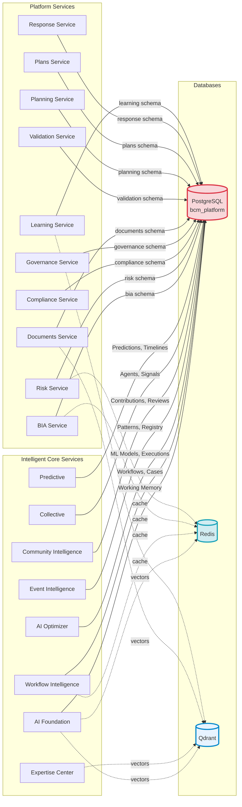

---

## 7. API Communication Patterns

### 7.1 API Gateway to Services

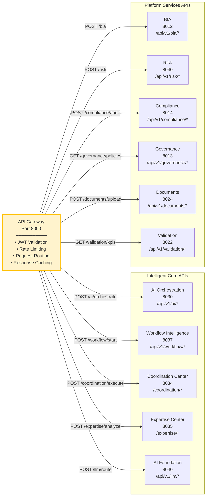

### 7.2 Inter-Service Communication

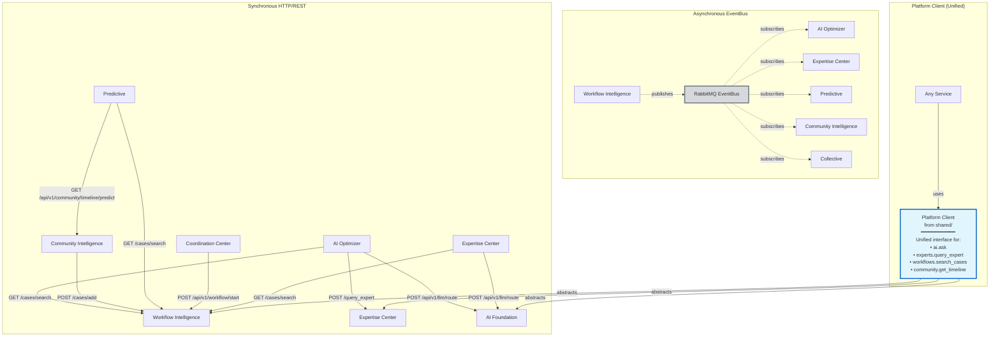

### 7.3 API Endpoint Summary

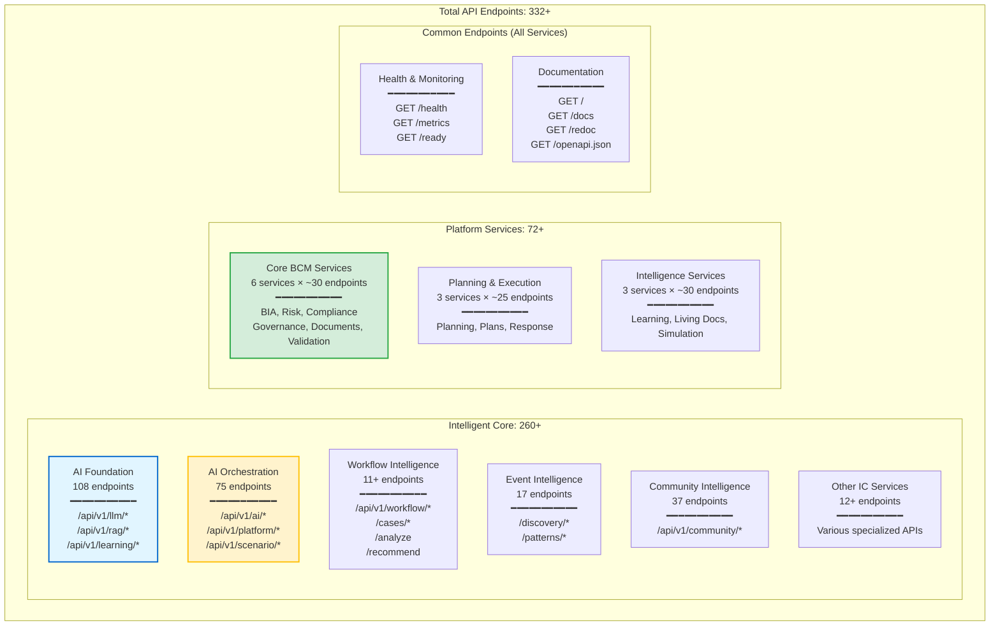

---

## 8. Deployment Architecture

### 8.1 Docker Compose Local Development

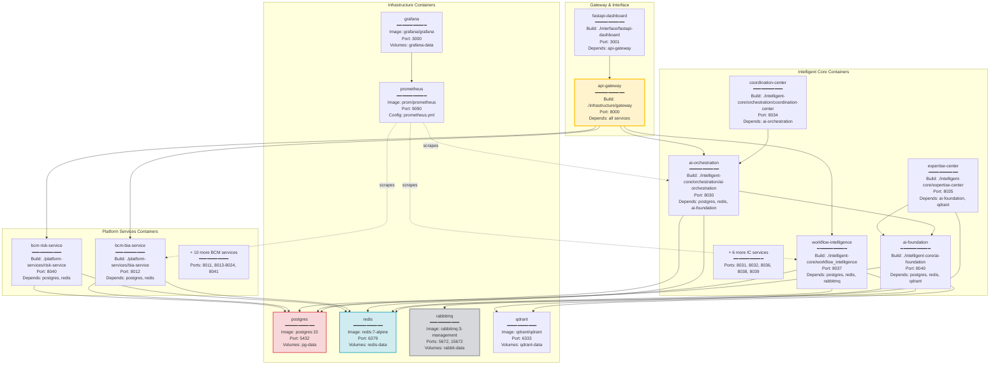

### 8.2 Kubernetes Production Deployment

```mermaid
graph TB
    subgraph "Kubernetes Cluster"
        subgraph "Namespace: infrastructure"
            subgraph "StatefulSets"
                PG_SS[postgresql-cluster<br/>━━━━━━━━━━━<br/>Replicas: 3<br/>Storage: 100Gi PVC<br/>Service: postgres-svc:5432]

                REDIS_SS[redis-cluster<br/>━━━━━━━━━━━<br/>Replicas: 3<br/>Mode: Sentinel<br/>Service: redis-svc:6379]

                RABBIT_SS[rabbitmq-cluster<br/>━━━━━━━━━━━<br/>Replicas: 3<br/>Plugin: management<br/>Service: rabbitmq-svc:5672]

                QDRANT_SS[qdrant-cluster<br/>━━━━━━━━━━━<br/>Replicas: 3<br/>Storage: 50Gi PVC<br/>Service: qdrant-svc:6333]
            end
        end

        subgraph "Namespace: intelligent-core"
            subgraph "Deployments"
                AI_FOUND_D[ai-foundation<br/>━━━━━━━━━━━<br/>Replicas: 2<br/>CPU: 2000m, Mem: 4Gi<br/>Service: ai-foundation-svc:8040]

                WF_INT_D[workflow-intelligence<br/>━━━━━━━━━━━<br/>Replicas: 3<br/>CPU: 2000m, Mem: 4Gi<br/>Service: workflow-intelligence-svc:8037]

                AI_ORCH_D[ai-orchestration<br/>━━━━━━━━━━━<br/>Replicas: 2<br/>CPU: 1000m, Mem: 2Gi<br/>Service: ai-orchestration-svc:8030]

                EXPERT_D[expertise-center<br/>━━━━━━━━━━━<br/>Replicas: 2<br/>CPU: 1000m, Mem: 2Gi<br/>Service: expertise-center-svc:8035]

                MORE_IC_D[+ 7 more IC deployments<br/>━━━━━━━━━━━<br/>Replicas: 1-2 each]
            end

            subgraph "Services (ClusterIP)"
                IC_SVCS[All services expose:<br/>• Port for HTTP<br/>• /health endpoint<br/>• /metrics endpoint]
            end
        end

        subgraph "Namespace: platform-services"
            subgraph "Deployments"
                BIA_D[bia-service<br/>━━━━━━━━━━━<br/>Replicas: 2<br/>CPU: 500m, Mem: 1Gi<br/>Service: bia-svc:8012]

                RISK_D[risk-service<br/>━━━━━━━━━━━<br/>Replicas: 2<br/>CPU: 500m, Mem: 1Gi<br/>Service: risk-svc:8040]

                MORE_PS_D[+ 10 more BCM deployments<br/>━━━━━━━━━━━<br/>Replicas: 1-2 each]
            end
        end

        subgraph "Namespace: gateway"
            subgraph "Ingress"
                INGRESS[Nginx Ingress Controller<br/>━━━━━━━━━━━<br/>• TLS termination<br/>• Rate limiting<br/>• Path-based routing]
            end

            subgraph "API Gateway"
                GW_D[api-gateway<br/>━━━━━━━━━━━<br/>Replicas: 3<br/>Service: api-gateway-svc:8000]
            end
        end

        subgraph "Namespace: monitoring"
            PROM_D[Prometheus<br/>━━━━━━━━━━━<br/>Replicas: 2<br/>Storage: 50Gi PVC<br/>Retention: 30d]

            GRAF_D[Grafana<br/>━━━━━━━━━━━<br/>Replicas: 2<br/>Storage: 10Gi PVC<br/>Datasource: Prometheus]

            LOKI_D[Loki<br/>━━━━━━━━━━━<br/>Replicas: 2<br/>Storage: 100Gi PVC<br/>Log aggregation]
        end
    end

    subgraph "External"
        USERS[Users / Clients]
        DNS[DNS:<br/>api.bcm-platform.com]
    end

    %% External to Cluster
    USERS --> DNS
    DNS --> INGRESS

    %% Ingress routing
    INGRESS -->|/api/v1/ai/*| AI_FOUND_D
    INGRESS -->|/api/v1/workflow/*| WF_INT_D
    INGRESS -->|/api/v1/bia/*| BIA_D
    INGRESS -->|/api/v1/risk/*| RISK_D

    %% IC to Infrastructure
    AI_FOUND_D --> PG_SS
    AI_FOUND_D --> REDIS_SS
    AI_FOUND_D --> QDRANT_SS

    WF_INT_D --> PG_SS
    WF_INT_D --> REDIS_SS
    WF_INT_D --> RABBIT_SS

    AI_ORCH_D --> AI_FOUND_D
    AI_ORCH_D --> REDIS_SS

    EXPERT_D --> AI_FOUND_D
    EXPERT_D --> QDRANT_SS

    %% Platform to Infrastructure
    BIA_D --> PG_SS
    BIA_D --> REDIS_SS

    RISK_D --> PG_SS
    RISK_D --> REDIS_SS

    %% Monitoring
    PROM_D -.scrapes.-> AI_FOUND_D
    PROM_D -.scrapes.-> WF_INT_D
    PROM_D -.scrapes.-> BIA_D
    GRAF_D --> PROM_D

    style INGRESS fill:#fff3cd,stroke:#ffc107,stroke-width:3px
    style PG_SS fill:#f8d7da,stroke:#dc3545,stroke-width:2px
    style REDIS_SS fill:#d1ecf1,stroke:#17a2b8,stroke-width:2px
    style PROM_D fill:#e7f3ff,stroke:#0088cc,stroke-width:2px
```

---

## 9. Infrastructure Layer

### 9.1 Complete Infrastructure Stack

```mermaid
graph TB
    subgraph "Infrastructure Layer"
        subgraph "Databases"
            PG_I[PostgreSQL 15<br/>━━━━━━━━━━━<br/>Port: 5432<br/>Database: bcm_platform<br/>Schemas: 13+<br/>Tables: 80+<br/>Extensions:<br/>• uuid-ossp<br/>• pgcrypto<br/>• pg_trgm]

            REDIS_I[Redis 7<br/>━━━━━━━━━━━<br/>Port: 6379<br/>Databases:<br/>0: Working Memory<br/>1: Workflow Cache<br/>2: Sessions<br/>3: Rate Limits<br/>Persistence: RDB + AOF]

            QDRANT_I[Qdrant<br/>━━━━━━━━━━━<br/>Port: 6333<br/>Collections:<br/>• knowledge_base (768d)<br/>• case_library (768d)<br/>• domain_knowledge (768d)<br/>Distance: Cosine]
        end

        subgraph "Message Queue"
            RABBIT_I[RabbitMQ 3.12<br/>━━━━━━━━━━━<br/>Ports: 5672 (AMQP), 15672 (UI)<br/>Exchange: platform_events (topic)<br/>Queues: 8+ queues<br/>Plugins:<br/>• management<br/>• prometheus<br/>Persistence: Durable]
        end

        subgraph "Gateway & Security"
            API_GW_I[API Gateway<br/>━━━━━━━━━━━<br/>Port: 8000<br/>Features:<br/>• JWT validation<br/>• Rate limiting<br/>• Request routing<br/>• Response caching<br/>• CORS handling]

            SEC_GW_I[Security Gateway<br/>━━━━━━━━━━━<br/>Port: 8888<br/>Features:<br/>• Authentication<br/>• Authorization<br/>• Audit logging<br/>• Threat detection]

            AUTH_I[Auth Service<br/>━━━━━━━━━━━<br/>Features:<br/>• JWT/OAuth<br/>• RBAC<br/>• Session management<br/>• Password hashing]
        end

        subgraph "Observability"
            PROM_I[Prometheus<br/>━━━━━━━━━━━<br/>Port: 9090<br/>Features:<br/>• Metrics collection (15s)<br/>• Time-series storage<br/>• Alerting rules<br/>• Service discovery<br/>Retention: 30 days]

            GRAF_I[Grafana<br/>━━━━━━━━━━━<br/>Port: 3000<br/>Dashboards:<br/>• System overview<br/>• Service metrics<br/>• Database perf<br/>• EventBus flow<br/>Data source: Prometheus]

            LOKI_I[Loki<br/>━━━━━━━━━━━<br/>Log aggregation<br/>Integration: Promtail<br/>Retention: 14 days]
        end

        subgraph "Service Discovery & Config"
            CONSUL_I[Consul<br/>━━━━━━━━━━━<br/>Port: 8500<br/>Features:<br/>• Service registry<br/>• Health checks<br/>• KV store<br/>• DNS interface]

            CONFIG_I[Config Server<br/>━━━━━━━━━━━<br/>Features:<br/>• Centralized config<br/>• Environment profiles<br/>• Encryption<br/>• Hot reload]
        end

        subgraph "Runtime"
            DOCKER_I[Docker<br/>━━━━━━━━━━━<br/>Engine: 24.0+<br/>Compose: 2.20+<br/>Networks:<br/>• intelligent-core-net<br/>• platform-services-net<br/>• infrastructure-net]

            K8S_I[Kubernetes<br/>━━━━━━━━━━━<br/>Version: 1.28+<br/>Namespaces:<br/>• infrastructure<br/>• intelligent-core<br/>• platform-services<br/>• monitoring]
        end

        subgraph "Storage"
            VOLUMES_I[Docker Volumes<br/>━━━━━━━━━━━<br/>• postgres-data<br/>• redis-data<br/>• rabbitmq-data<br/>• qdrant-data<br/>• grafana-data<br/>• document-uploads]

            PVC_I[Persistent Volume Claims<br/>━━━━━━━━━━━<br/>• postgres-pvc: 100Gi<br/>• redis-pvc: 10Gi<br/>• qdrant-pvc: 50Gi<br/>• logs-pvc: 100Gi]
        end

        subgraph "Networking"
            NGINX_I[Nginx Ingress<br/>━━━━━━━━━━━<br/>Features:<br/>• Load balancing<br/>• SSL/TLS termination<br/>• Path routing<br/>• Rate limiting]

            SERVICE_MESH_I[Service Mesh (Optional)<br/>━━━━━━━━━━━<br/>Istio/Linkerd<br/>Features:<br/>• mTLS<br/>• Traffic management<br/>• Observability<br/>• Circuit breakers]
        end
    end

    %% All services depend on infrastructure
    PG_I -.provides.-> ALL_SERVICES[All Services]
    REDIS_I -.provides.-> ALL_SERVICES
    RABBIT_I -.provides.-> ALL_SERVICES
    QDRANT_I -.provides.-> AI_SERVICES[AI Services]

    API_GW_I --> SEC_GW_I
    SEC_GW_I --> AUTH_I

    PROM_I -.scrapes.-> ALL_SERVICES
    GRAF_I --> PROM_I
    LOKI_I -.collects.-> ALL_SERVICES

    CONSUL_I -.registers.-> ALL_SERVICES
    CONFIG_I -.configures.-> ALL_SERVICES

    DOCKER_I -.runs.-> ALL_SERVICES
    K8S_I -.orchestrates.-> ALL_SERVICES

    VOLUMES_I -.persists.-> PG_I
    VOLUMES_I -.persists.-> REDIS_I
    PVC_I -.persists.-> PG_I

    style PG_I fill:#f8d7da,stroke:#dc3545,stroke-width:2px
    style REDIS_I fill:#d1ecf1,stroke:#17a2b8,stroke-width:2px
    style RABBIT_I fill:#d6d8db,stroke:#6c757d,stroke-width:2px
    style QDRANT_I fill:#e7f3ff,stroke:#0088cc,stroke-width:2px
    style API_GW_I fill:#fff3cd,stroke:#ffc107,stroke-width:2px
    style PROM_I fill:#e7f3ff,stroke:#0088cc,stroke-width:2px
```

### 9.2 Infrastructure Ports Map

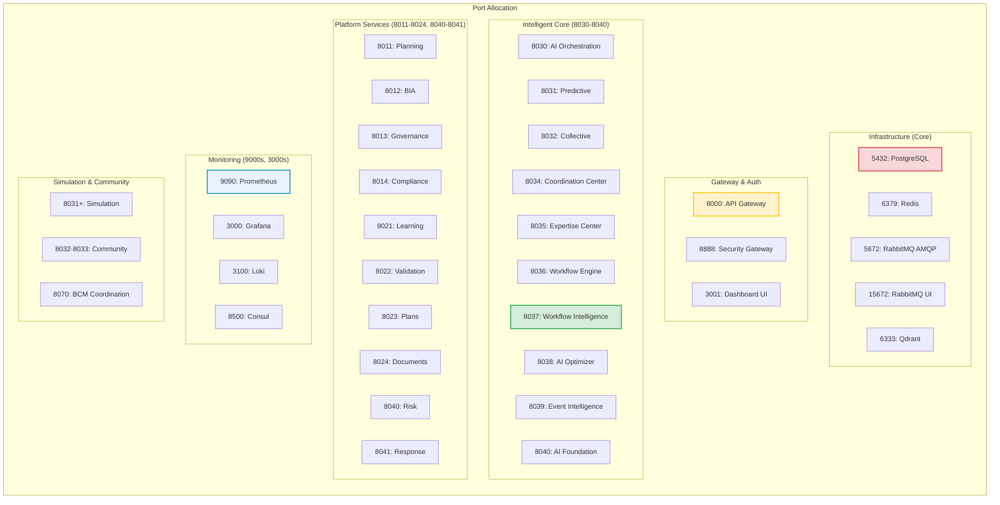

---

## 10. Real-Time Event Flows

### 10.1 Event Intelligence Auto-Discovery

```mermaid
sequenceDiagram
    participant Services as All Platform Services
    participant EventBus as RabbitMQ
    participant Event_Int as Event Intelligence<br/>8039
    participant AI_Found as AI Foundation<br/>8040
    participant DB as PostgreSQL

    Note over Event_Int: Subscribe to ALL events: *.*

    Services->>EventBus: Publish various events:<br/>• workflow.bia.started<br/>• risk.created<br/>• compliance.audit.completed<br/>• user.login<br/>• etc.

    EventBus-->>Event_Int: Deliver ALL events

    Note over Event_Int: Auto-Discovery Engine

    Event_Int->>Event_Int: Analyze event:<br/>1. Extract service name<br/>2. Extract event type<br/>3. Extract payload schema<br/>4. Track frequency

    Event_Int->>DB: INSERT/UPDATE service_registry<br/>{service, endpoints, health}

    Event_Int->>DB: QUERY event_patterns<br/>WHERE event_type = ?

    DB->>Event_Int: Historical patterns

    Event_Int->>Event_Int: Pattern Learning:<br/>1. Sequence detection<br/>2. Correlation analysis<br/>3. Causation inference<br/>4. Timing analysis

    alt New Pattern Detected
        Event_Int->>DB: INSERT event_patterns<br/>{pattern, confidence}
        Event_Int->>EventBus: PUBLISH event.pattern_detected
    end

    Event_Int->>Event_Int: Build event graph:<br/>workflow.started → workflow.state_changed<br/>→ workflow.completed

    Event_Int->>AI_Found: POST /api/v1/llm/route<br/>"Analyze event pattern"

    AI_Found->>Event_Int: Insights + predictions

    Event_Int->>Event_Int: Predict next event:<br/>If workflow.started,<br/>then workflow.state_changed<br/>Confidence: 95%

    Event_Int->>DB: UPDATE event_predictions

    Event_Int->>EventBus: PUBLISH event.prediction.made

    Note over Event_Int: Self-Healing Check

    alt Error Pattern Detected
        Event_Int->>Event_Int: Analyze error:<br/>• Frequency<br/>• Service affected<br/>• Root cause pattern

        Event_Int->>AI_Found: "Generate fix for error pattern"

        AI_Found->>Event_Int: Suggested fix (code/config)

        Event_Int->>EventBus: PUBLISH event.healing.suggested
    end
```

### 10.2 Stuck Organization Recovery Flow

```mermaid
sequenceDiagram
    participant Org as Organization A
    participant EventBus as RabbitMQ
    participant Collective as Collective<br/>8032
    participant Comm as Community Intelligence<br/>8030
    participant AI_Found as AI Foundation<br/>8040
    participant Notif as Notification Service

    Note over Org: Struggling with BIA supplier mapping<br/>No progress: 7 days<br/>Validation failures: 5

    loop Daily checks
        Org->>EventBus: workflow.no_progress
        Org->>EventBus: validation.failure
    end

    EventBus-->>Collective: Events delivered

    Collective->>Collective: Calculate stuck score:<br/>• Days no progress: 7 (2 pts)<br/>• Validation failures: 5 (1.5 pts)<br/>• Low AI confidence: 0.55 (0.5 pts)<br/>• User frustration: detected (0.5 pts)<br/>Total: 4.5 (STUCK!)

    Collective->>EventBus: PUBLISH collective.org.stuck_detected

    Collective->>Comm: GET /api/v1/community/cases<br/>{industry: healthcare, challenge: supplier_mapping}

    Comm->>Comm: Search similar organizations:<br/>• Same industry<br/>• Same challenge<br/>• Successfully completed

    Comm->>Collective: Found 7 matching orgs

    Note over Collective: K-Anonymity Validation<br/>Minimum k=5, Found=7 ✓

    Collective->>Collective: Multi-layer Anonymization:<br/><br/>Layer 1: Organization Anonymization<br/>• Remove: org names, locations<br/>• Generalize: "Healthcare, 1000-5000 employees"<br/><br/>Layer 2: Data Aggregation<br/>• Aggregate: "5/7 used tool X"<br/>• Common: "Start with Tier 1 suppliers"<br/>• Timeline: "Median 45 days"<br/><br/>Layer 3: Privacy Risk Check<br/>• Re-identification risk: 0.12 (LOW)<br/>• No outlier highlighting<br/>• Geographic generalization

    Collective->>AI_Found: POST /api/v1/llm/route<br/>{create_collective_agent, experiences}

    AI_Found->>AI_Found: Generate agent persona:<br/>• Name: "Collective Wisdom Agent"<br/>• Personality: Supportive, practical<br/>• Knowledge: 7 aggregated experiences<br/>• Constraints: Privacy-first<br/>• Temperature: 0.3<br/>• Expiration: 7 days

    AI_Found->>Collective: Agent configuration

    Collective->>Collective: CREATE collective_agent<br/>{id, persona, knowledge, expires_at}

    Collective->>EventBus: PUBLISH collective.agent.created

    Collective->>Notif: Send notification to Org A:<br/>"A collective wisdom agent is ready to help"

    Notif->>Org: Email + in-app notification

    Note over Org: User interacts with agent

    Org->>Collective: POST /api/v1/collective-agents/{id}/chat<br/>"How did others solve supplier mapping?"

    Collective->>AI_Found: LLM query with agent context

    AI_Found->>AI_Found: Generate response:<br/>"Organizations facing similar challenges<br/>found success by:<br/><br/>1. Starting with Tier 1 suppliers (5/7)<br/>2. Using CMDB integration (4/7)<br/>3. Mapping dependencies first<br/>4. Typical timeline: 4-6 weeks<br/><br/>Common tools: Dependency mapping software<br/>Success rate: 85% with this approach<br/><br/>Note: This wisdom comes from 5+ organizations<br/>who successfully completed similar challenges."

    AI_Found->>Collective: Response

    Collective->>Org: Agent response (anonymized wisdom)

    Note over Org: Implements suggestions<br/>Progress resumes!

    Org->>EventBus: workflow.progress.resumed

    EventBus-->>Collective: Progress detected

    Collective->>Collective: Update stuck status:<br/>Organization no longer stuck

    Note over Collective: Day 7: Agent Expiration

    Collective->>Collective: Expire agent:<br/>• Mark as expired<br/>• Delete anonymized data<br/>• Cleanup resources

    Collective->>EventBus: PUBLISH collective.agent.expired
```

### 10.3 Proactive Prediction Flow

```mermaid
sequenceDiagram
    participant Platform as Platform Services
    participant EventBus as RabbitMQ
    participant Predict as Predictive<br/>8031
    participant WF_Int as Workflow Intelligence<br/>8037
    participant Comm as Community Intelligence<br/>8030
    participant AI_Found as AI Foundation<br/>8040
    participant Notif as Notification Service
    participant User as Users

    Note over Platform: Continuous activity

    loop Continuous events
        Platform->>EventBus: workflow.*.completed<br/>organization.milestone.achieved<br/>user.activity.logged<br/>validation.kpi.updated
    end

    EventBus-->>Predict: Subscribe to all predictive events

    Note over Predict: Event Buffer: 100 events or 5 min

    Predict->>Predict: Analyze event patterns:<br/>• Completion rates<br/>• Time to completion<br/>• Common blockers<br/>• User engagement

    Predict->>WF_Int: GET /cases/search<br/>{org_profile, current_stage}

    WF_Int->>WF_Int: Query case_library:<br/>Similar organizations<br/>by industry, size, stage

    WF_Int->>Predict: 50 similar cases

    Predict->>Comm: GET /api/v1/community/timeline/predict<br/>{org_id}

    Comm->>Comm: Find similar organizations:<br/>• Same industry<br/>• Same size<br/>• Similar geography

    Comm->>Comm: Calculate statistics:<br/>• Median timeline<br/>• Success rate<br/>• Common challenges

    Comm->>Predict: Timeline prediction data

    Predict->>AI_Found: POST /api/v1/llm/route<br/>"Analyze journey patterns"

    AI_Found->>Predict: AI insights

    Note over Predict: ML Model Prediction<br/>Random Forest Regressor<br/>Features: 30+<br/>Training data: 1000+ orgs<br/>Accuracy: 85%

    Predict->>Predict: Run predictions:<br/><br/>1. Journey Predictor<br/>   • Next 90 days<br/>   • Milestones<br/>   • Timeline<br/><br/>2. Certification Predictor<br/>   • Estimated cert date<br/>   • Confidence interval<br/><br/>3. Challenge Predictor<br/>   • Upcoming challenges<br/>   • Severity<br/>   • Recommended prep<br/><br/>4. Expert Demand Forecaster<br/>   • Specialist needs<br/>   • When needed<br/>   • Skill requirements

    Predict->>Predict: Generate proactive recommendations:<br/>• "Schedule BIA specialist in 2 weeks"<br/>• "Plan exercise in 3 weeks"<br/>• "Prepare for governance review in 1 month"

    Predict->>EventBus: PUBLISH prediction.journey.generated

    Note over Predict: Daily Digest Scheduler<br/>Cron: 0 8 * * * (8 AM daily)

    Predict->>Predict: Query organizations needing digest

    loop For each organization
        Predict->>Predict: Personalize digest:<br/>• "Good morning! Your journey update:"<br/>• Current progress: 65%<br/>• Next milestone: Governance review (14 days)<br/>• Proactive suggestions:<br/>  - Schedule stakeholder meeting<br/>  - Review policy templates<br/>  - Book governance specialist<br/>• Predicted challenges:<br/>  - Stakeholder alignment (medium)<br/>• Expert availability:<br/>  - Governance specialists available next week<br/>• Certification estimate:<br/>  - 90 days (85% confidence)

        Predict->>Notif: POST /send-email<br/>{to, subject, body, attachments}

        Notif->>User: Email delivered

        Predict->>EventBus: PUBLISH prediction.digest.sent
    end

    Note over Predict: Continuous Learning

    Predict->>Predict: Track prediction accuracy:<br/>Compare predicted vs actual<br/>Update confidence scores

    Predict->>Predict: Retrain models (weekly):<br/>• Fetch latest completions<br/>• Extract features<br/>• Train Random Forest<br/>• Validate accuracy<br/>• Deploy if improved
```

---

## Summary Statistics

### Component Counts
- **Total Services:** 31+
- **Intelligent Core:** 12 services
- **Platform Services:** 16 services
- **Infrastructure Components:** 15+

### Port Allocation
- **Infrastructure:** 5432, 6333, 6379, 5672, 15672
- **Gateway:** 8000, 8888, 3001
- **Intelligent Core:** 8030-8040
- **Platform Services:** 8011-8024, 8040-8041, 8070
- **Monitoring:** 9090, 3000, 3100, 8500

### Database
- **Total Schemas:** 13+
- **Total Tables:** 80+
- **Vector Collections:** 3
- **Cache Databases:** 4

### Event System
- **Total Publishers:** 40+
- **Total Subscribers:** 25+
- **Event Queues:** 8+
- **Events Per Day:** 10,000+ (estimated)

### API Endpoints
- **Total Endpoints:** 332+
- **Intelligent Core:** 260+
- **Platform Services:** 72+

### Code Metrics
- **Total LOC:** 276,679+
- **Python Files:** 641
- **Classes:** 1,046
- **Functions:** 337

---

## Document Information

**Version:** 1.0.0
**Generated:** 2025-10-08
**Maintained By:** AI Platform Architecture Team
**Review Cycle:** Quarterly
**Next Review:** 2026-01-08

### Related Documents
- [Intelligent Core Complete Catalog](/Users/MD/AI-Platform-ISO/intelligent-core/INTELLIGENT_CORE_COMPLETE_CATALOG.md)
- [Platform Services Complete Catalog](/Users/MD/AI-Platform-ISO/platform-services/PLATFORM_SERVICES_COMPLETE_CATALOG.md)
- [Database Schema Map](/Users/MD/AI-Platform-ISO/platform-services/DATABASE_SCHEMA_MAP.md)
- [Integration Map](/Users/MD/AI-Platform-ISO/intelligent-core/INTEGRATION_MAP.md)
- [Port Allocation](/Users/MD/AI-Platform-ISO/platform-services/PORT_ALLOCATION.md)

### Standards Compliance
- **ISO/IEC 42010:2011** - Systems and software engineering - Architecture description
- **ISO/IEC/IEEE 26514:2022** - Software and systems engineering - Design and development of documentation
- **ISO 22301:2019** - Business continuity management systems
- **ISO/IEC 42001:2023** - Artificial intelligence management system
- **C4 Model** - Architecture visualization framework
- **Mermaid** - Diagram syntax and rendering

---

**End of Architecture Visualizations Document**
