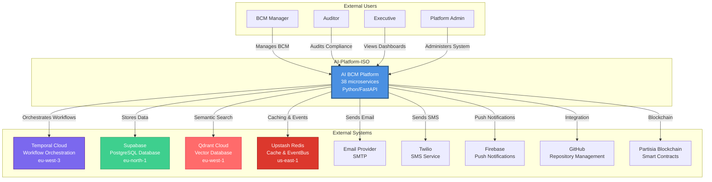
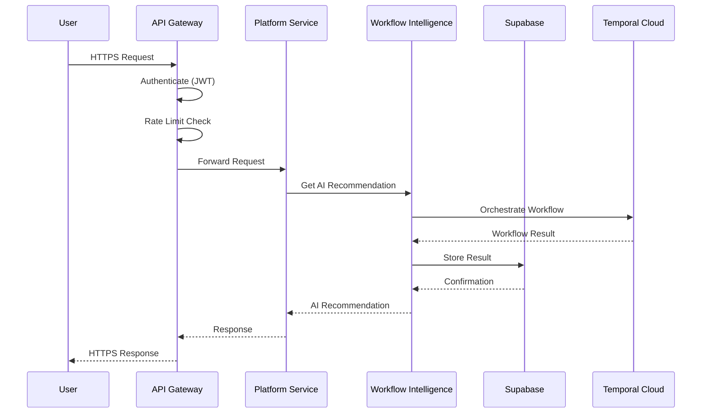
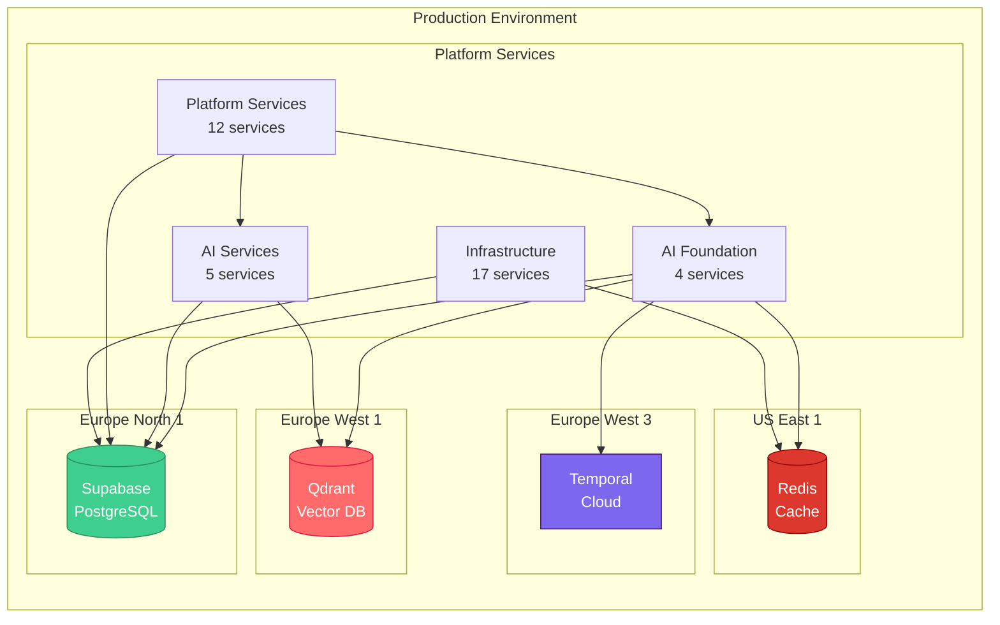
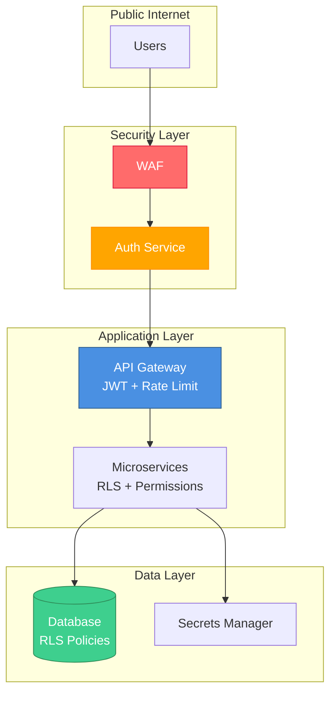

# C4 Model - Level 1: System Context

**AI-Platform-ISO - Business Continuity Management Platform**

---

## 📊 System Context Diagram

---

## 📋 Components Overview

### Core Platform (38 Services)
- **4** AI Foundation services (brain)
- **5** AI Microservices (ML/intelligence)
- **12** Platform Services (business logic)
- **17** Infrastructure Services

### External Dependencies (9 Systems)
- **3** Managed cloud services (Temporal, Supabase, Qdrant)
- **3** Notification providers (Email, SMS, Push)
- **3** Integration platforms (Redis, GitHub, Partisia)

---

## 🔗 System Boundaries

| System | Type | Region | Purpose |
|--------|------|--------|---------|
| **AI-Platform-ISO** | Core | - | BCM management platform |
| **Temporal Cloud** | Orchestration | eu-west-3 | Workflow engine |
| **Supabase** | Database | eu-north-1 | PostgreSQL + Auth |
| **Qdrant Cloud** | Vector DB | eu-west-1 | Semantic search |
| **Upstash Redis** | Cache | us-east-1 | Event bus + cache |
| **Email/SMS/Push** | Notifications | - | Alert delivery |
| **GitHub** | Code Repository | - | Version control |
| **Partisia** | Blockchain | - | Audit trail |

---

## 👥 User Personas

### BCM Manager
- Creates BIA analyses
- Manages risk assessments
- Coordinates incident response
- Designs BC exercises

### Auditor
- Reviews compliance status
- Generates audit reports
- Validates BC plans
- Tracks non-conformities

### Executive
- Views KPI dashboards
- Monitors BCM maturity
- Reviews risk posture
- Approves BC strategies

### Platform Admin
- Manages users & tenants
- Configures workflows
- Monitors system health
- Reviews security logs

---

## 🔄 Key Interactions

### User → Platform
1. User authenticates (JWT)
2. Platform validates permissions
3. Request routed through API Gateway
4. Service processes request
5. Response returned to user

### Platform → External Systems
1. **Temporal Cloud:** Workflow orchestration (BIA, Incident, Exercise)
2. **Supabase:** Data persistence (9 schemas, 43 migrations)
3. **Qdrant:** Vector search (ISO knowledge, workflow cases)
4. **Redis:** Event publishing (workflow events, system events)
5. **Notifications:** Alerts (email/SMS/push for incidents)

---

## 📊 Traffic Flows

---

## 🚀 Deployment View

---

## 📈 Scale & Performance

| Metric | Current | Target |
|--------|---------|--------|
| **Services** | 38 | 50+ |
| **Databases** | 2 | 2 |
| **Users** | Development | 1000+ |
| **Requests/sec** | Low | 100+ |
| **Availability** | Development | 99.9% |

---

## 🔒 Security Boundaries

---

## 📝 Notes

- This is **Level 1** - System Context (highest level)
- See **C4_LEVEL2_CONTAINERS.md** for microservices architecture
- All external systems are managed services (no ops required)
- Multi-region deployment for resilience

---

**Next:** [Level 2 - Containers (Microservices)](C4_LEVEL2_CONTAINERS.md)
