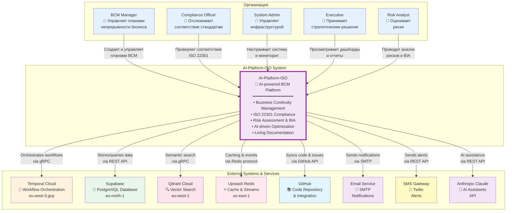
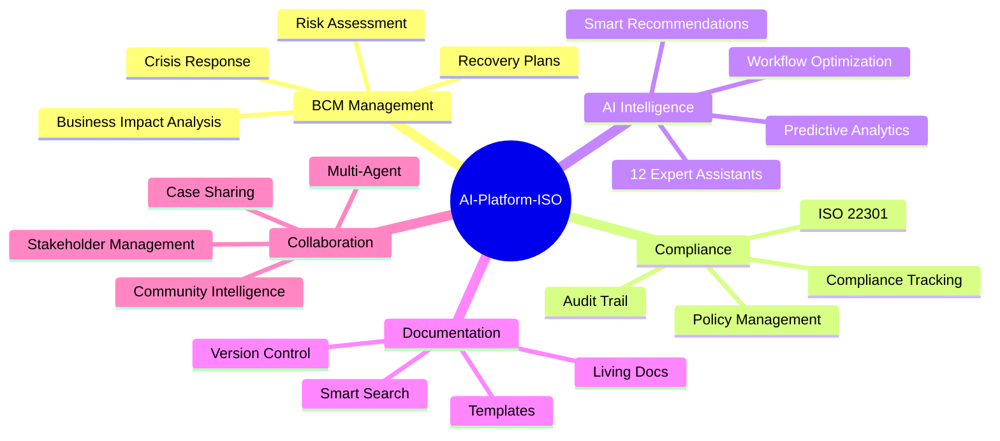
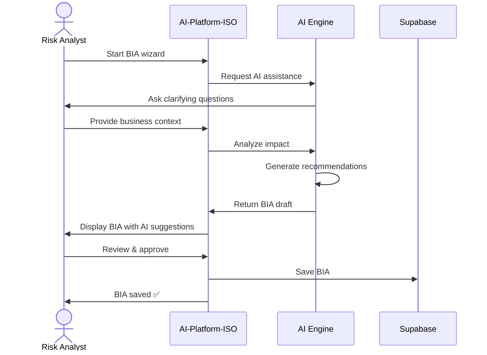
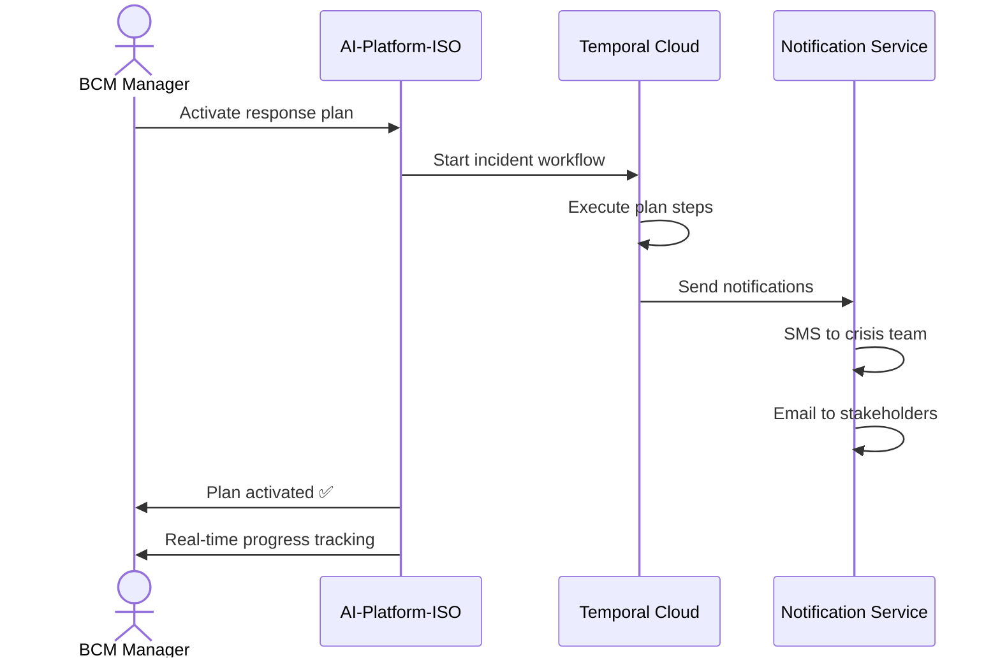
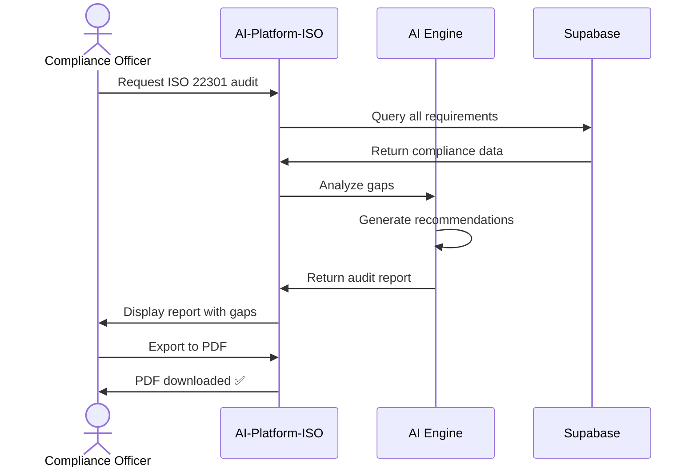
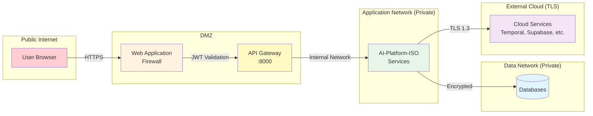

# C4 Model - Level 1: System Context (Complete)
## AI-Platform-ISO - Системный контекст

**Auto-generated from real codebase**
**Last updated:** 2025-10-06

---

## Что это?

Level 1 показывает **ЧТО** система делает с точки зрения внешних пользователей и систем.

**"Птичий взгляд" на систему:**
- Кто использует систему?
- С какими внешними системами она интегрируется?
- Какие основные функции предоставляет?

---

## 1. Полная диаграмма системного контекста



---

## 2. Роли пользователей

| Роль | Ответственность | Основные действия |
|------|----------------|-------------------|
| **BCM Manager** | Управление непрерывностью бизнеса | • Создание BCM планов<br/>• Управление инцидентами<br/>• Проведение учений<br/>• Активация планов реагирования |
| **Compliance Officer** | Соответствие стандартам | • Проверка ISO 22301<br/>• Аудит документации<br/>• Отслеживание требований<br/>• Генерация отчетов |
| **System Admin** | Администрирование системы | • Настройка пользователей<br/>• Мониторинг инфраструктуры<br/>• Управление интеграциями<br/>• Резервное копирование |
| **Executive** | Стратегические решения | • Просмотр дашбордов<br/>• Анализ KPI<br/>• Утверждение планов<br/>• Распределение ресурсов |
| **Risk Analyst** | Управление рисками | • Оценка рисков<br/>• BIA (Business Impact Analysis)<br/>• Анализ уязвимостей<br/>• Рекомендации по митигации |

---

## 3. Внешние системы

### 3.1 Критические зависимости (Critical Path)

| Система | Провайдер | Назначение | Регион | SLA |
|---------|-----------|------------|--------|-----|
| **Temporal Cloud** | Temporal.io | Оркестрация AI-workflow | eu-west-3.gcp | 99.9% |
| **Supabase** | Supabase | PostgreSQL база данных | eu-north-1 | 99.95% |
| **Qdrant Cloud** | Qdrant | Vector search для RAG | eu-west-1 | 99.9% |
| **Upstash Redis** | Upstash | Cache + Event Streams | us-east-1 | 99.99% |

### 3.2 Интеграции (Optional)

| Система | Назначение | Протокол |
|---------|------------|----------|
| **GitHub** | Синхронизация кода, Issues, Projects | REST API + Webhooks |
| **Email (SMTP)** | Уведомления пользователей | SMTP |
| **SMS (Twilio)** | Критические алерты | REST API |
| **Anthropic Claude** | AI ассистенты (12 экспертов) | REST API |

---

## 4. Основные функции платформы



---

## 5. Ключевые use cases

### 5.1 Создание BIA (Business Impact Analysis)



### 5.2 Активация плана реагирования



### 5.3 Compliance audit



---

## 6. Границы системы (System Boundaries)

### Что ВНУТРИ платформы:

✅ **Business Logic:**
- BIA Service
- Risk Service
- Compliance Service
- Governance Service
- Documents Service
- Response Service
- Validation Service
- Learning Service
- Planning Service
- Plans Service
- Living Docs

✅ **AI Foundation:**
- Workflow Intelligence (THE BRAIN)
- AI Workflow Optimizer
- Workflow Engine (BPMN 2.0)
- Expertise Center (12 AI assistants)
- Community Intelligence
- Collective Agents
- Predictive Service

✅ **Infrastructure:**
- API Gateway
- Database Gateway
- EventBus
- Monitoring
- Auth Service

### Что ВНЕ платформы:

❌ **External Services:**
- Temporal Cloud (workflow orchestration)
- Supabase (database hosting)
- Qdrant Cloud (vector search)
- Upstash Redis (cache)
- GitHub (code repository)
- Email/SMS providers
- Anthropic Claude API

---

## 7. Интеграционные точки (Integration Points)

| Точка интеграции | Протокол | Направление | Назначение |
|------------------|----------|-------------|------------|
| **API Gateway :8000** | HTTPS/REST | Inbound | Прием всех API запросов |
| **Temporal gRPC** | gRPC | Outbound | Отправка workflow activities |
| **Supabase REST API** | HTTPS/REST | Bidirectional | CRUD операции с данными |
| **Qdrant gRPC** | gRPC | Bidirectional | Vector search queries |
| **Redis Protocol** | Redis | Bidirectional | Cache + Event Streams |
| **GitHub Webhooks** | HTTPS/Webhooks | Inbound | События из GitHub |
| **SMTP** | SMTP | Outbound | Отправка email |
| **Twilio API** | HTTPS/REST | Outbound | Отправка SMS |
| **Claude API** | HTTPS/REST | Outbound | AI assistance requests |

---

## 8. Non-Functional Requirements

| Категория | Требование | Метрика |
|-----------|------------|---------|
| **Availability** | Высокая доступность | 99.5% uptime |
| **Performance** | Быстрый отклик API | < 200ms (p95) |
| **Scalability** | Горизонтальное масштабирование | 1000+ concurrent users |
| **Security** | Безопасность данных | JWT + OAuth2 + RBAC |
| **Compliance** | ISO 22301 | Full compliance |
| **Data Residency** | EU data residency | EU-only regions |
| **Backup** | Автоматическое резервирование | Daily backups |
| **Disaster Recovery** | Восстановление | RPO 1h, RTO 4h |

---

## 9. Security Context



---

## 10. Deployment Context

```mermaid
graph TB
    subgraph "Development"
        DEV[Developer Workstation<br/>Docker Compose]
    end

    subgraph "Staging"
        STAGE[Staging Environment<br/>Docker Swarm]
    end

    subgraph "Production"
        PROD[Production Environment<br/>Kubernetes (Planned)]
    end

    subgraph "Cloud Services"
        TEMPORAL[Temporal Cloud]
        SUPABASE[Supabase]
        QDRANT[Qdrant]
        REDIS[Upstash Redis]
    end

    DEV -->|CI/CD| STAGE
    STAGE -->|CI/CD| PROD

    PROD --> TEMPORAL
    PROD --> SUPABASE
    PROD --> QDRANT
    PROD --> REDIS

    style DEV fill:#e3f2fd
    style STAGE fill:#fff3e0
    style PROD fill:#e8f5e9,stroke:#4caf50,stroke-width:3px
```

---

## Summary

**AI-Platform-ISO** - это AI-powered платформа для управления непрерывностью бизнеса (BCM) и соответствия стандарту ISO 22301.

**Ключевые характеристики:**
- 🤖 **AI-driven**: 12 экспертных ассистентов на базе Claude
- 🔄 **Workflow-based**: Temporal Cloud для оркестрации
- 📊 **Data-intensive**: PostgreSQL + Vector search
- ⚡ **Event-driven**: Redis Streams для асинхронной коммуникации
- 🔒 **Secure**: JWT + OAuth2 + RBAC
- 🌍 **EU-compliant**: Все данные в EU регионах

**Основные пользователи:**
- BCM Managers (управление планами)
- Compliance Officers (аудит соответствия)
- Risk Analysts (оценка рисков)
- System Admins (администрирование)
- Executives (стратегические решения)

**Внешние зависимости:**
- Temporal Cloud (workflow orchestration) - CRITICAL
- Supabase (database) - CRITICAL
- Qdrant (vector search)
- Upstish Redis (cache + events)
- GitHub, Email, SMS, Anthropic Claude

---

**Generated:** 2025-10-06
**Next Level:** [C4 Level 2 - Containers](C4_LEVEL2_CONTAINERS.md)
