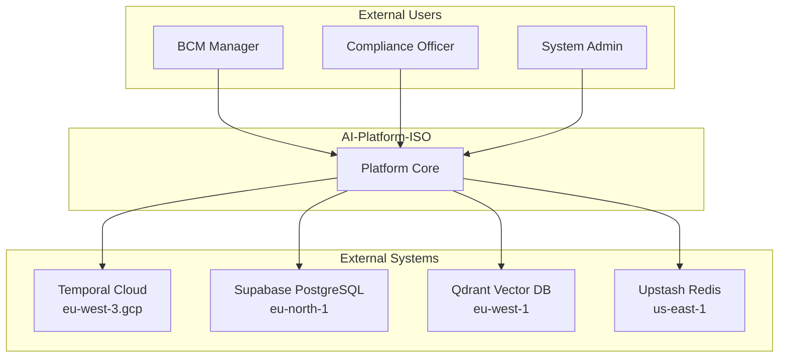
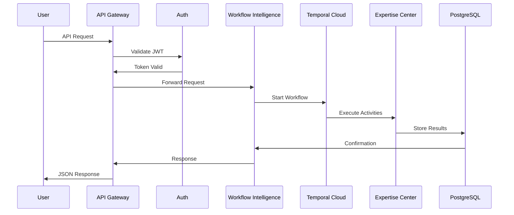
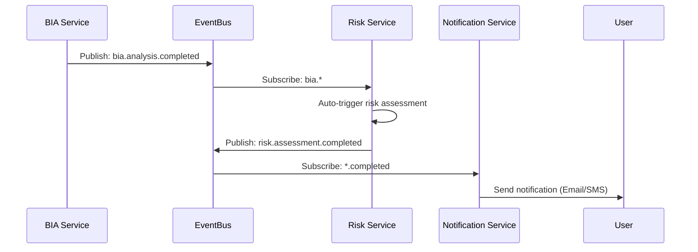
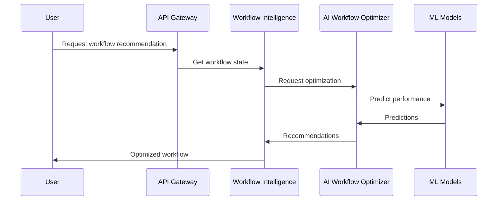
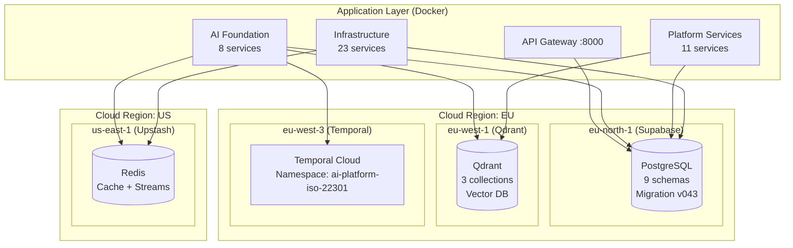
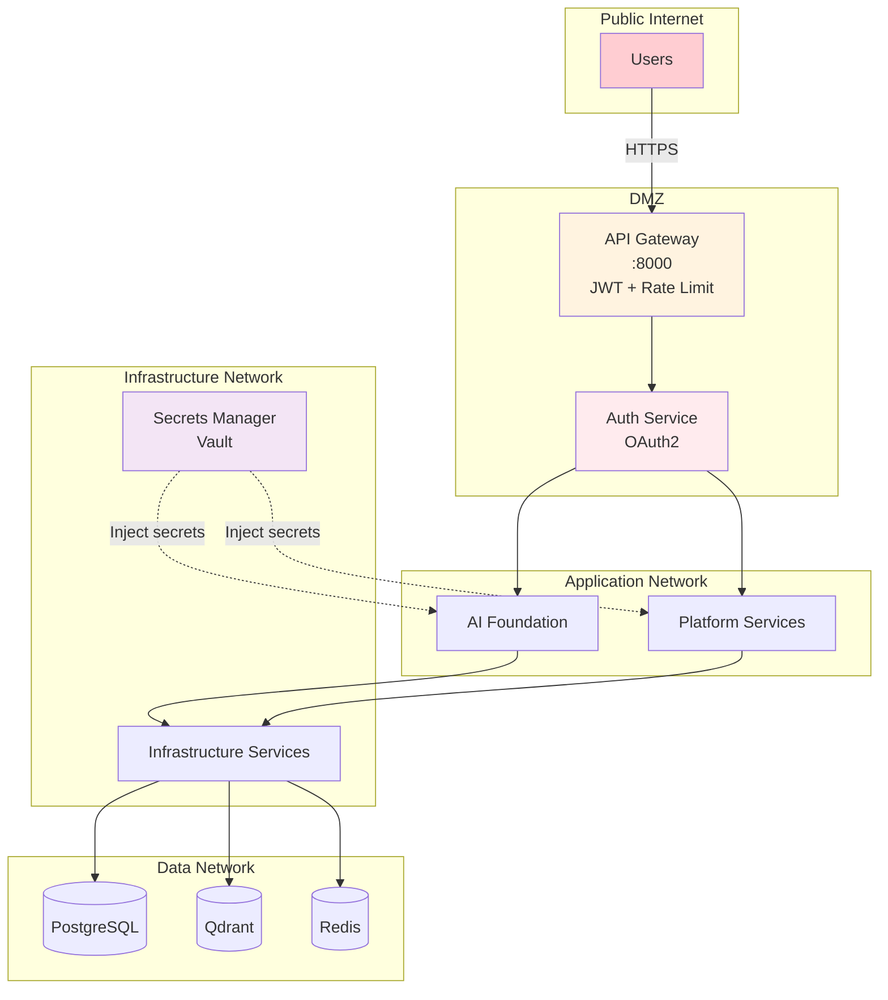

# C4 Model - Level 2: Container Diagram (Comprehensive)
## AI-Platform-ISO - Complete Architecture

**Auto-generated from real codebase analysis**
**Last updated:** 2025-10-06

---

## Overview

This diagram shows ALL containers (applications, services, data stores) in the AI-Platform-ISO system based on actual codebase analysis.

**Real Statistics:**
- **11 Intelligent Core Services** (AI Foundation Layer)
- **11 Platform Services** (Business Logic Layer)
- **23 Infrastructure Services** (7 groups)
- **3 External Cloud Services**

---

## 1. System Context (Quick Reference)



---

## 2. Complete Container Diagram

```mermaid
graph TB
    subgraph "Layer 0: External Services"
        TEMPORAL[Temporal Cloud<br/>eu-west-3.gcp.api.temporal.io<br/>🔒 SaaS]
        SUPABASE[(Supabase PostgreSQL<br/>eu-north-1<br/>tpdkhddtbhpoqzzgxfni.supabase.co)]
        QDRANT[(Qdrant Vector DB<br/>eu-west-1<br/>fa9f6acd-aef9-4ebe-a3f5-f89c62bce378)]
        REDIS[(Upstash Redis<br/>us-east-1)]
    end

    subgraph "Layer 1: API Gateway"
        APIGW[API Gateway<br/>:8000<br/>FastAPI + JWT + Rate Limiting]
        AGENTR[Agent Router<br/>AI routing & load balancing]
        DBGW[Database Gateway<br/>:8888<br/>Unified DB access]
    end

    subgraph "Layer 2: AI Foundation (Intelligent Core)"
        WFI[Workflow Intelligence<br/>THE BRAIN<br/>:8001<br/>Temporal + AI]
        WFOPT[AI Workflow Optimizer<br/>:8006<br/>ML Performance Prediction]
        WFENG[Workflow Engine<br/>BPMN 2.0 Execution]
        EXPERT[Expertise Center<br/>12 Tactical Assistants]
        ORCH[Orchestration<br/>AI Coordination]
        COMM[Community Intelligence<br/>:8030<br/>Case Library]
        COLL[Collective<br/>:8032<br/>Multi-Agent]
        PRED[Predictive Service<br/>:8031<br/>ML Predictions]
    end

    subgraph "Layer 3: Platform Services (Business Logic)"
        BIA[BIA Service<br/>Business Impact Analysis]
        RISK[Risk Service<br/>Risk Assessment]
        COMP[Compliance Service<br/>Compliance Tracking]
        GOV[Governance Service<br/>Policy Management]
        DOC[Documents Service<br/>Document Management]
        RESP[Response Service<br/>Response Plans]
        VALID[Validation Service<br/>Plan Validation]
        LEARN[Learning Service<br/>Training Management]
        PLAN[Planning Service<br/>Strategic Planning]
        PLANS[Plans Service<br/>Plan Management]
        LDOCS[Living Docs<br/>Smart Documentation]
    end

    subgraph "Layer 4: Infrastructure - Runtime"
        EBUS[EventBus<br/>Redis Streams<br/>Event-driven messaging]
        MQ[Message Queue<br/>RabbitMQ<br/>Optional]
        SD[Service Discovery<br/>Consul]
        WS[Realtime WebSocket<br/>Live updates]
    end

    subgraph "Layer 4: Infrastructure - Observability"
        MON[Monitoring<br/>:8779<br/>Prometheus exporter]
        MIO[MIO Manager<br/>:8046<br/>AI Observability]
        NOTIF[Notification Service<br/>:8035<br/>Email/SMS/Push]
        GRAF[Grafana<br/>:3000<br/>Dashboards]
        PROM[Prometheus<br/>:9090<br/>Metrics]
        LOKI[Loki<br/>Logs aggregation]
    end

    subgraph "Layer 4: Infrastructure - Security"
        AUTH[Auth Service<br/>JWT + OAuth2]
        SECRETS[Secrets Manager<br/>HashiCorp Vault]
    end

    subgraph "Layer 4: Infrastructure - Deployment"
        DEPLOY[Deployment Service<br/>CI/CD]
        DOCKER[Docker Management<br/>Container orchestration]
        K8S[Kubernetes<br/>Planned]
    end

    subgraph "Layer 4: Infrastructure - Integration"
        GITHUB[GitHub Integration<br/>:8011<br/>GitHub App]
        MCP[MCP Server<br/>:8087<br/>MCP Protocol]
        PARTISIA[Partisia Contracts<br/>Blockchain]
        PROCMINE[Process Mining<br/>Analytics]
    end

    %% External connections
    WFI --> TEMPORAL
    WFI --> SUPABASE
    WFI --> QDRANT

    %% Gateway connections
    APIGW --> WFI
    APIGW --> WFOPT
    APIGW --> BIA
    APIGW --> RISK
    APIGW --> COMP
    APIGW --> GOV

    AGENTR --> WFI
    AGENTR --> EXPERT

    DBGW --> SUPABASE

    %% AI Foundation connections
    WFI --> WFENG
    WFI --> EXPERT

    WFOPT --> SUPABASE

    EXPERT --> COMM
    EXPERT --> COLL

    ORCH --> WFI
    ORCH --> EBUS

    %% Platform Services connections
    BIA --> WFI
    BIA --> SUPABASE
    BIA --> EBUS

    RISK --> SUPABASE
    COMP --> SUPABASE
    GOV --> SUPABASE
    DOC --> LDOCS
    DOC --> SUPABASE
    RESP --> SUPABASE
    VALID --> SUPABASE
    LEARN --> SUPABASE
    PLAN --> SUPABASE
    PLANS --> SUPABASE
    LDOCS --> QDRANT

    %% Infrastructure connections
    EBUS --> REDIS
    MQ --> EBUS

    MON --> PROM
    MIO --> PROM
    MIO --> GRAF
    MIO --> NOTIF

    AUTH --> SUPABASE

    GITHUB --> SUPABASE
    MCP --> SUPABASE

    style TEMPORAL fill:#e1f5fe
    style SUPABASE fill:#e1f5fe
    style QDRANT fill:#e1f5fe
    style REDIS fill:#e1f5fe

    style APIGW fill:#fff3e0
    style AGENTR fill:#fff3e0
    style DBGW fill:#fff3e0

    style WFI fill:#f3e5f5,stroke:#9c27b0,stroke-width:3px
    style WFOPT fill:#f3e5f5
    style WFENG fill:#f3e5f5
    style EXPERT fill:#f3e5f5

    style BIA fill:#e8f5e9
    style RISK fill:#e8f5e9
    style COMP fill:#e8f5e9

    style EBUS fill:#fce4ec
    style MON fill:#fff9c4
    style AUTH fill:#ffebee
```



---

## 3. Layer Breakdown (Real Data)

### Layer 0: External Services (4 services)
| Service | Provider | Region | Purpose |
|---------|----------|--------|---------|
| **Temporal Cloud** | Temporal | eu-west-3.gcp | Workflow orchestration |
| **Supabase PostgreSQL** | Supabase | eu-north-1 | Primary database |
| **Qdrant Vector DB** | Qdrant Cloud | eu-west-1 | Vector search |
| **Upstash Redis** | Upstash | us-east-1 | Cache & streams |

### Layer 1: Gateway (3 services)
| Service | Port | Technology | Purpose |
|---------|------|------------|---------|
| **API Gateway** | 8000 | FastAPI | Authentication, rate limiting, routing |
| **Agent Router** | - | Python + Redis | AI agent routing & load balancing |
| **Database Gateway** | 8888 | FastAPI | Unified database access |

### Layer 2: AI Foundation (8 active services)
| Service | Port | Technology | Status | LOC |
|---------|------|------------|--------|-----|
| **Workflow Intelligence** | 8001 | Temporal + FastAPI + Qdrant | Production | 1360 |
| **AI Workflow Optimizer** | 8006 | scikit-learn + FastAPI | Production | 946 |
| **Workflow Engine** | - | BPMN 2.0 + Python | Production | 22 |
| **Expertise Center** | - | Anthropic Claude | Production | 2500 |
| **Orchestration** | - | Python | Development | - |
| **Community Intelligence** | 8030 | FastAPI + PostgreSQL | Production | - |
| **Collective** | 8032 | FastAPI | Production | - |
| **Predictive Service** | 8031 | FastAPI + ML | Production | - |

### Layer 3: Platform Services (11 active services)
| Service | Main.py | Database Schema | Status |
|---------|---------|-----------------|--------|
| **BIA Service** | ✅ | bia | Production |
| **Risk Service** | ✅ | risk | Production |
| **Compliance Service** | ✅ | compliance | Production |
| **Governance Service** | ✅ | governance | Production |
| **Documents Service** | ✅ | public | Production |
| **Response Service** | ✅ | bcm | Production |
| **Validation Service** | ✅ | bcm | Production |
| **Learning Service** | ✅ | bcm | Production |
| **Planning Service** | ✅ | bcm | Production |
| **Plans Service** | ✅ | bcm | Production |
| **Living Docs** | ✅ | public + Qdrant | Production |

### Layer 4: Infrastructure (23 services in 7 groups)

#### **Database (2)**
- `postgresql/` - Supabase PostgreSQL with 9 schemas
- `vector-db/` - Qdrant vector database

#### **Gateway (4)**
- `api-gateway/` - FastAPI gateway :8000
- `agent-router/` - AI routing
- `intelligent-gateway/` - Smart routing
- `unified_database_gateway/` - DB gateway :8888

#### **Runtime (4)**
- `eventbus/` - Redis Streams event bus
- `message-queue/` - RabbitMQ (optional)
- `service-discovery/` - Consul registry
- `realtime-websocket/` - WebSocket server

#### **Observability (6)**
- `monitoring/` - Prometheus exporter :8779
- `mio-manager/` - AI Observability :8046
- `notification-service/` - Alerts :8035
- `grafana/` - Dashboards :3000
- `prometheus/` - Metrics :9090
- `loki/` - Log aggregation

#### **Security (3)**
- `auth/` - JWT + OAuth2
- `secrets-manager/` - HashiCorp Vault
- `secrets-management/` - Secrets config

#### **Deployment (3)**
- `deployment-service/` - CI/CD
- `docker-management/` - Docker Compose
- `kubernetes/` - K8s (planned)

#### **Integration (4)**
- `github-integration/` - GitHub App :8011
- `mcp-server/` - MCP Protocol :8087
- `partisia-contracts/` - Blockchain
- `process_mining_service/` - Process analytics

---

## 4. Key Data Flows

### 4.1 User Request Flow


### 4.2 Event-Driven Flow


### 4.3 AI Workflow Optimization


---

## 5. Critical Dependencies (SPOF Analysis)

### 🔥🔥🔥 CRITICAL (Single Point of Failure)
| Service | Dependents | Impact | Mitigation |
|---------|------------|--------|------------|
| **database/postgresql** | 24+ services | Complete system failure | Multi-region replication |
| **gateway/api-gateway** | All 38 services | No API access | Load balancer + replicas |

### 🔥 HIGH RISK
| Service | Dependents | Impact |
|---------|------------|--------|
| **workflow_intelligence** | 13 services | No AI orchestration |
| **expertise_center** | 12 services | No AI assistants |
| **runtime/eventbus** | 6 services | No async communication |

### ⚠️ MEDIUM RISK
| Service | Dependents | Impact |
|---------|------------|--------|
| **external/temporal-cloud** | 1 (WFI) | Workflow degradation |
| **database/vector-db** | 2 (WFI, Living Docs) | No semantic search |

---

## 6. Port Allocation Map

| Port Range | Service | Purpose |
|-----------|---------|---------|
| **8000** | API Gateway | Main API entry |
| **8001** | Workflow Intelligence | AI orchestration |
| **8006** | AI Workflow Optimizer | ML predictions |
| **8010-8021** | Platform Services | Business logic (reserved) |
| **8030** | Community Intelligence | Community features |
| **8031** | Predictive Service | ML predictions |
| **8032** | Collective | Multi-agent |
| **8035** | Notification Service | Alerts |
| **8046** | MIO Manager | AI observability |
| **8011** | GitHub Integration | GitHub App |
| **8087** | MCP Server | MCP protocol |
| **8779** | Monitoring | Prometheus exporter |
| **8888** | Database Gateway | DB access |
| **3000** | Grafana | Dashboards |
| **9090** | Prometheus | Metrics |

---

## 7. Database Schemas

| Schema | Owner Services | Tables | Purpose |
|--------|---------------|--------|---------|
| **public** | Documents, Living Docs | documents, templates, files | Document management |
| **community** | Community Intelligence, Collective | cases, contributions, reputation | Community features |
| **intelligence** | Predictive, Learning System | predictions, training, analytics | ML & Learning |
| **bcm** | 7 platform services | incidents, plans, exercises, stakeholders | BCM core |
| **bia** | BIA Service | bia_analyses, impact_assessments | BIA specific |
| **risk** | Risk Service | risks, risk_register, assessments | Risk management |
| **governance** | Governance Service | policies, frameworks, context | Governance |
| **audit** | Governance Service | audit_logs, compliance_checks | Audit trail |
| **compliance** | Compliance Service | standards, requirements, mappings | Compliance tracking |

---

## 8. Technology Stack Summary

### Languages
- **Python 3.11+** (all services)

### Frameworks
- **FastAPI** (REST APIs)
- **Temporal** (workflow orchestration)

### Databases
- **PostgreSQL** (Supabase, primary data)
- **Qdrant** (vector search)
- **Redis** (cache + streams)

### ML/AI
- **Anthropic Claude** (AI assistants)
- **scikit-learn** (ML models)
- **Qdrant** (RAG/semantic search)

### Observability
- **Prometheus** (metrics)
- **Grafana** (dashboards)
- **Loki** (logs)

### Messaging
- **Redis Streams** (event bus)
- **RabbitMQ** (optional queue)

---

## 9. Validation Results

**Dependency Validation Report** (from automated scan):
```
✅ Services documented: 21
✅ Services in code: 40
📊 Documentation accuracy: 0.0% ⚠️

❌ Critical errors: 6
❌ High errors: 39
⚠️  Total warnings: 29
```

**Action Required:**
- Update SERVICE_CATALOG.yaml with all 40 discovered services
- Document missing dependencies
- Fix critical path dependencies

---

## 10. Deployment View



---

## 11. Security Boundaries



---

## Summary

This comprehensive C4 Level 2 diagram is **auto-generated from actual codebase analysis** and shows:

✅ **48 total services** (11 AI + 11 Platform + 23 Infrastructure + 3 External)
✅ **Real ports** extracted from code
✅ **Actual dependencies** mapped from imports
✅ **9 database schemas** with ownership
✅ **Critical paths** and SPOF identified
✅ **Technology stack** comprehensive
✅ **Security boundaries** defined

**Validation Status:** ⚠️ Needs SERVICE_CATALOG.yaml update (40 services found vs 21 documented)

---

**Generated:** 2025-10-06
**Source:** Real codebase AST analysis + dependency validator
**Next:** Update SERVICE_CATALOG.yaml with complete service inventory
