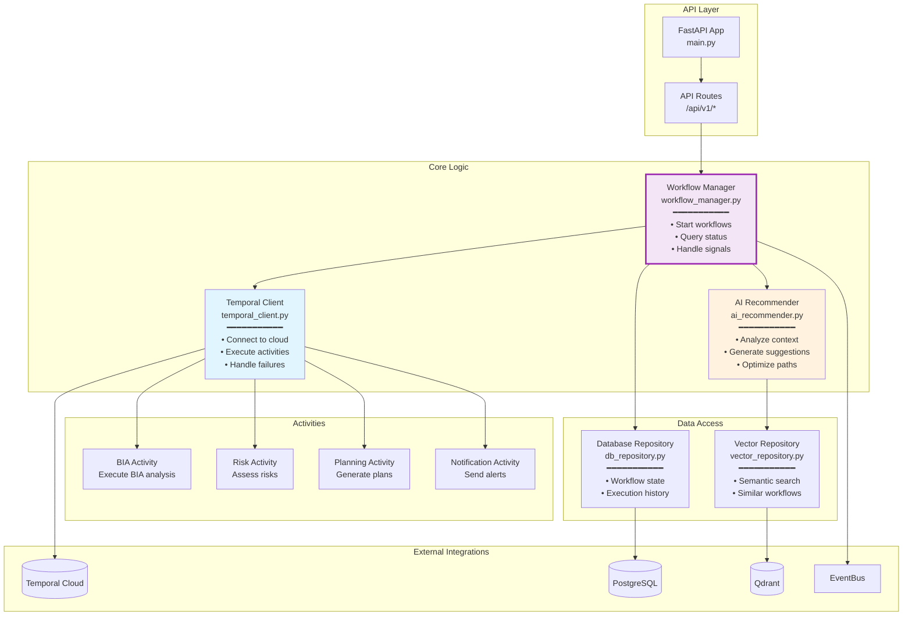
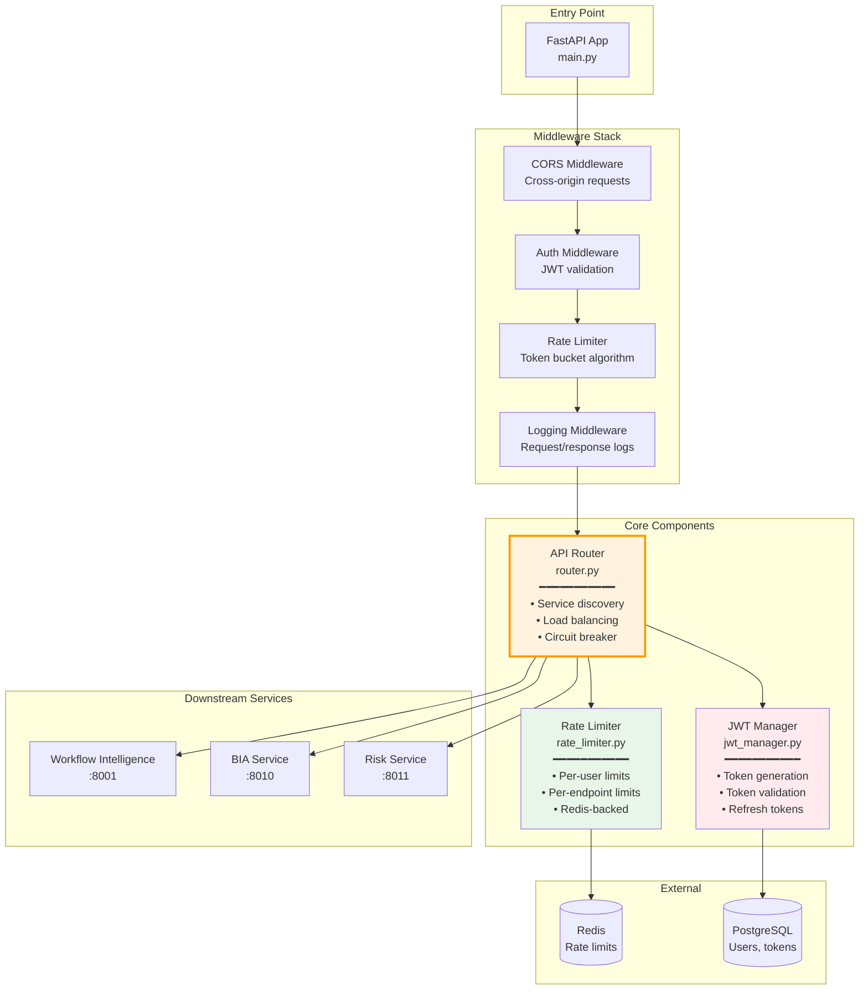
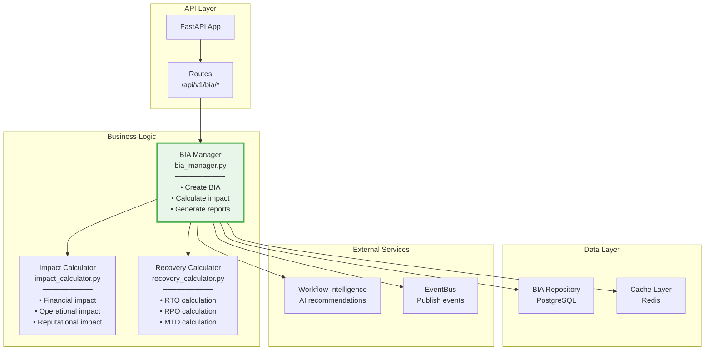
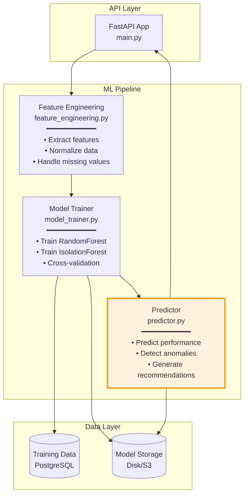
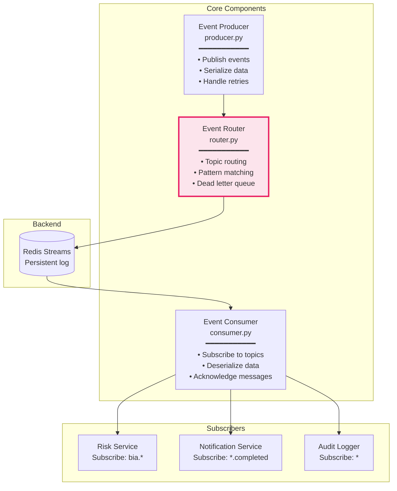

# C4 Model - Level 3: Component Diagram
## AI-Platform-ISO - Компоненты внутри ключевых сервисов

**Auto-generated from real codebase**
**Last updated:** 2025-10-06

---

## Что это?

Level 3 показывает **КАК** устроены ключевые сервисы изнутри:
- Какие классы/модули внутри каждого сервиса?
- Как они взаимодействуют?
- Какие паттерны используются?

---

## 1. Workflow Intelligence (THE BRAIN)

**Location:** `intelligent-core/workflow_intelligence/`
**Port:** 8001
**LOC:** 1360 lines

### Архитектура компонентов



### Ключевые классы

```python
# workflow_manager.py
class WorkflowManager:
    """Управление жизненным циклом workflow"""

    def __init__(self, temporal_client, db_repo, ai_recommender):
        self.temporal = temporal_client
        self.db = db_repo
        self.ai = ai_recommender

    async def start_workflow(self, workflow_type: str, input_data: dict):
        """Запустить workflow с AI-рекомендациями"""
        # 1. Получить AI рекомендации
        recommendations = await self.ai.recommend_workflow(workflow_type, input_data)

        # 2. Запустить Temporal workflow
        handle = await self.temporal.start_workflow(
            workflow_type,
            input_data,
            recommendations=recommendations
        )

        # 3. Сохранить состояние в БД
        await self.db.save_workflow_state(handle.id, input_data)

        return handle

    async def query_status(self, workflow_id: str):
        """Запросить статус workflow"""
        return await self.temporal.query_workflow(workflow_id)
```

---

## 2. API Gateway

**Location:** `infrastructure/gateway/api-gateway/`
**Port:** 8000

### Архитектура компонентов



### Ключевые паттерны

**1. Circuit Breaker Pattern:**
```python
# router.py
class CircuitBreaker:
    """Защита от каскадных сбоев"""

    def __init__(self, failure_threshold=5, timeout=60):
        self.failure_count = 0
        self.failure_threshold = failure_threshold
        self.timeout = timeout
        self.state = "CLOSED"  # CLOSED, OPEN, HALF_OPEN

    async def call(self, func, *args, **kwargs):
        if self.state == "OPEN":
            if time.time() - self.last_failure < self.timeout:
                raise CircuitBreakerOpen("Service unavailable")
            else:
                self.state = "HALF_OPEN"

        try:
            result = await func(*args, **kwargs)
            if self.state == "HALF_OPEN":
                self.state = "CLOSED"
                self.failure_count = 0
            return result
        except Exception as e:
            self.failure_count += 1
            if self.failure_count >= self.failure_threshold:
                self.state = "OPEN"
                self.last_failure = time.time()
            raise
```

**2. Rate Limiting:**
```python
# rate_limiter.py
class RateLimiter:
    """Token Bucket алгоритм"""

    async def check_rate_limit(self, user_id: str, endpoint: str):
        key = f"rate:{user_id}:{endpoint}"
        current = await redis.get(key)

        if current and int(current) >= LIMIT:
            raise RateLimitExceeded("Too many requests")

        await redis.incr(key)
        await redis.expire(key, WINDOW_SECONDS)
```

---

## 3. BIA Service (Business Impact Analysis)

**Location:** `platform-services/bia-service/`

### Архитектура компонентов



### Бизнес-логика

```python
# bia_manager.py
class BIAManager:
    """Управление BIA анализами"""

    async def create_bia(self, business_process: dict):
        """Создать BIA с AI помощью"""

        # 1. Запросить AI рекомендации
        ai_suggestions = await self.workflow_intelligence.get_bia_suggestions(
            business_process
        )

        # 2. Рассчитать финансовое воздействие
        financial_impact = await self.impact_calculator.calculate_financial(
            business_process,
            ai_suggestions
        )

        # 3. Рассчитать RTO/RPO
        recovery_metrics = await self.recovery_calculator.calculate_metrics(
            business_process,
            financial_impact
        )

        # 4. Сохранить BIA
        bia = await self.repository.create_bia({
            "business_process": business_process,
            "financial_impact": financial_impact,
            "recovery_metrics": recovery_metrics,
            "ai_suggestions": ai_suggestions
        })

        # 5. Опубликовать событие
        await self.eventbus.publish("bia.created", bia)

        return bia
```

---

## 4. AI Workflow Optimizer

**Location:** `intelligent-core/ai_workflow_optimizer/`
**Port:** 8006
**LOC:** 946 lines

### Архитектура компонентов



### ML Models

```python
# model_trainer.py
class ModelTrainer:
    """Обучение ML моделей для оптимизации workflow"""

    def train_performance_predictor(self):
        """RandomForest для предсказания производительности"""

        features = [
            'workflow_complexity',  # Количество шагов
            'data_volume',          # Объем данных
            'concurrent_executions', # Параллельные выполнения
            'historical_duration'   # Исторические данные
        ]

        X = self.feature_engineering.extract_features(features)
        y = self.training_data['execution_time']

        model = RandomForestRegressor(n_estimators=100, max_depth=10)
        model.fit(X, y)

        # Cross-validation
        scores = cross_val_score(model, X, y, cv=5)
        print(f"CV Score: {scores.mean():.3f}")

        return model

    def train_anomaly_detector(self):
        """IsolationForest для детекции аномалий"""

        features = self.feature_engineering.extract_features()

        model = IsolationForest(contamination=0.1, random_state=42)
        model.fit(features)

        return model
```

---

## 5. EventBus (Message Infrastructure)

**Location:** `infrastructure/runtime/eventbus/`

### Архитектура компонентов



### Event Flow Pattern

```python
# producer.py
class EventProducer:
    """Публикация событий в EventBus"""

    async def publish(self, event_type: str, payload: dict):
        """
        Publish event with retry logic

        Args:
            event_type: "bia.created", "risk.assessed", etc.
            payload: Event data
        """

        event = {
            "id": str(uuid.uuid4()),
            "type": event_type,
            "payload": payload,
            "timestamp": datetime.utcnow().isoformat(),
            "metadata": {
                "source": self.service_name,
                "version": "1.0"
            }
        }

        # Publish to Redis Stream
        await self.redis.xadd(
            f"stream:{event_type}",
            {"data": json.dumps(event)},
            maxlen=10000  # Retain last 10k events
        )

# consumer.py
class EventConsumer:
    """Подписка на события из EventBus"""

    async def subscribe(self, pattern: str, handler: Callable):
        """
        Subscribe to events matching pattern

        Args:
            pattern: "bia.*", "*.completed", etc.
            handler: Async function to handle event
        """

        while True:
            # Read from stream
            events = await self.redis.xread(
                {f"stream:{pattern}": "$"},
                count=100,
                block=1000
            )

            for stream, messages in events:
                for msg_id, msg_data in messages:
                    event = json.loads(msg_data[b'data'])

                    try:
                        await handler(event)
                        await self.redis.xack(stream, self.consumer_group, msg_id)
                    except Exception as e:
                        # Dead letter queue
                        await self.handle_failure(event, e)
```

---

## 6. Common Patterns

### 6.1 Repository Pattern (Data Access)

```python
# repository_base.py
class RepositoryBase:
    """Базовый класс для всех репозиториев"""

    def __init__(self, db_session):
        self.db = db_session

    async def create(self, entity: dict):
        # Insert into DB
        pass

    async def get_by_id(self, id: str):
        # Select from DB
        pass

    async def update(self, id: str, updates: dict):
        # Update in DB
        pass

    async def delete(self, id: str):
        # Soft delete
        pass

    async def find(self, filters: dict):
        # Query with filters
        pass
```

### 6.2 Service Layer Pattern

```python
# service_base.py
class ServiceBase:
    """Базовый класс для бизнес-логики"""

    def __init__(self, repository, eventbus, cache):
        self.repo = repository
        self.eventbus = eventbus
        self.cache = cache

    async def execute_with_events(self, operation, event_type):
        """Execute operation and publish event"""

        # 1. Check cache
        cached = await self.cache.get(cache_key)
        if cached:
            return cached

        # 2. Execute business logic
        result = await operation()

        # 3. Save to DB
        await self.repo.create(result)

        # 4. Publish event
        await self.eventbus.publish(event_type, result)

        # 5. Cache result
        await self.cache.set(cache_key, result, ttl=300)

        return result
```

### 6.3 Factory Pattern (Service Creation)

```python
# service_factory.py
class ServiceFactory:
    """Создание сервисов с зависимостями"""

    @staticmethod
    def create_bia_service():
        db = DatabaseConnection()
        redis = RedisConnection()
        eventbus = EventBus(redis)
        cache = CacheManager(redis)

        repository = BIARepository(db)
        workflow_intelligence = WorkflowIntelligenceClient()

        return BIAService(
            repository=repository,
            eventbus=eventbus,
            cache=cache,
            workflow_intelligence=workflow_intelligence
        )
```

---

## Summary

**Ключевые паттерны:**
- ✅ **Layered Architecture** (API → Business Logic → Data Access)
- ✅ **Repository Pattern** (абстракция доступа к данным)
- ✅ **Service Layer** (бизнес-логика)
- ✅ **Factory Pattern** (создание объектов с зависимостями)
- ✅ **Circuit Breaker** (защита от каскадных сбоев)
- ✅ **Event-Driven** (асинхронная коммуникация)

**Технологии:**
- FastAPI (REST APIs)
- SQLAlchemy (ORM)
- Redis (Cache + Streams)
- Temporal SDK (Workflows)
- scikit-learn (ML)

---

**Generated:** 2025-10-06
**Source:** Real codebase analysis
**Previous:** [C4 Level 2 - Containers](C4_LEVEL2_CONTAINERS.md)
**Next:** [C4 Level 4 - Code](C4_LEVEL4_CODE.md) (optional)
