# BCM AI Platform - Platform Architecture

> **Enterprise Business Continuity Management Platform**
> **Version:** 1.0.0
> **Compliance:** ISO 22301:2019, ISO 27001, ISO 31000
> **Last Updated:** 2025-10-07

---

## Table of Contents

1. [Architecture Overview](#architecture-overview)
2. [System Architecture Diagram](#system-architecture-diagram)
3. [Layer Architecture](#layer-architecture)
4. [Component Architecture](#component-architecture)
5. [Data Flow Architecture](#data-flow-architecture)
6. [Integration Architecture](#integration-architecture)
7. [Deployment Architecture](#deployment-architecture)
8. [Security Architecture](#security-architecture)
9. [Event-Driven Architecture](#event-driven-architecture)
10. [Dependency Map](#dependency-map)

---

## Architecture Overview

The BCM AI Platform is built on a **5-layer microservices architecture** with AI/ML capabilities, designed for enterprise-grade Business Continuity Management.

### Architectural Principles

- **Separation of Concerns**: Clear separation between infrastructure, business logic, and presentation
- **Microservices**: Independently deployable services with well-defined boundaries
- **Event-Driven**: Asynchronous communication via EventBus and message queues
- **AI-First**: ML/AI capabilities embedded at the core layer
- **ISO Compliance**: Built-in compliance with ISO 22301, 27001, 31000 standards
- **Cloud-Native**: Container-based deployment with Kubernetes orchestration
- **API-First**: RESTful and GraphQL APIs for all interactions

### Technology Stack

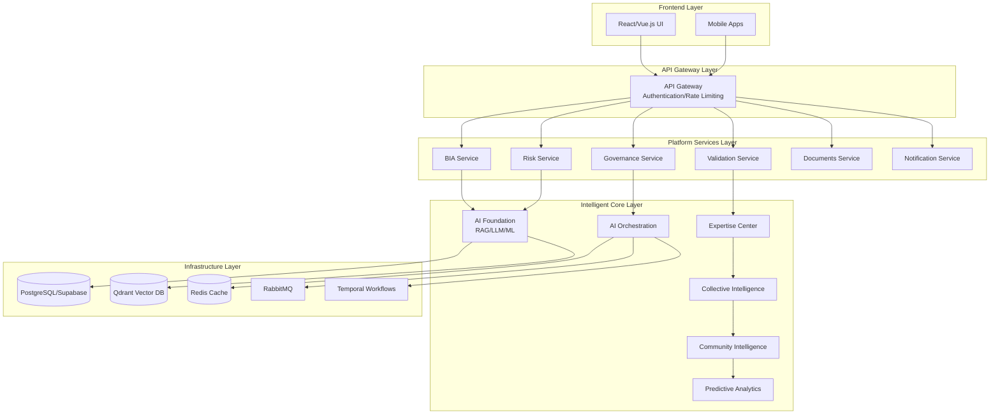

---

## System Architecture Diagram

### High-Level System Architecture

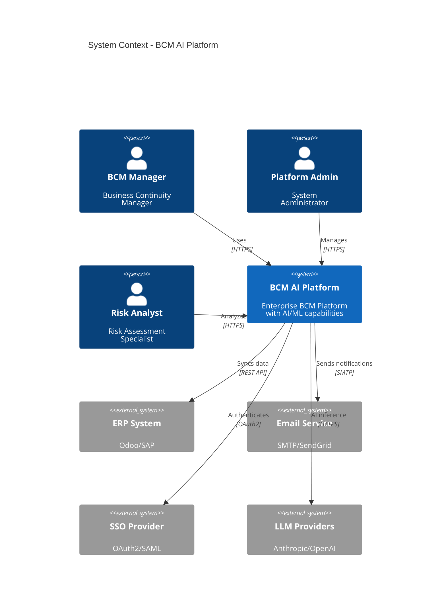

### Container Architecture

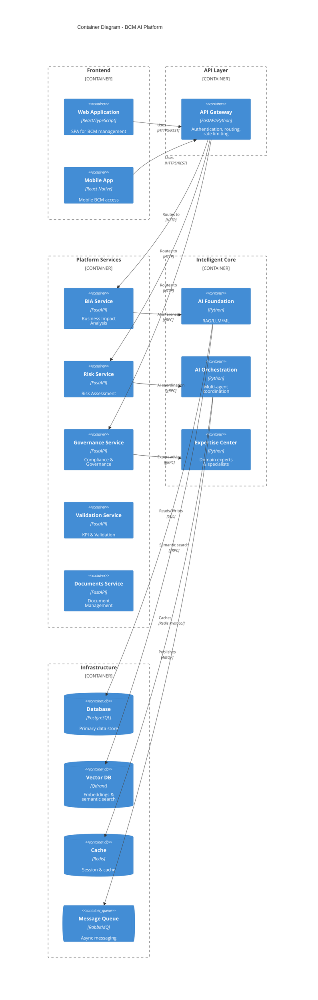

---

## Layer Architecture

### 5-Layer Architecture Model

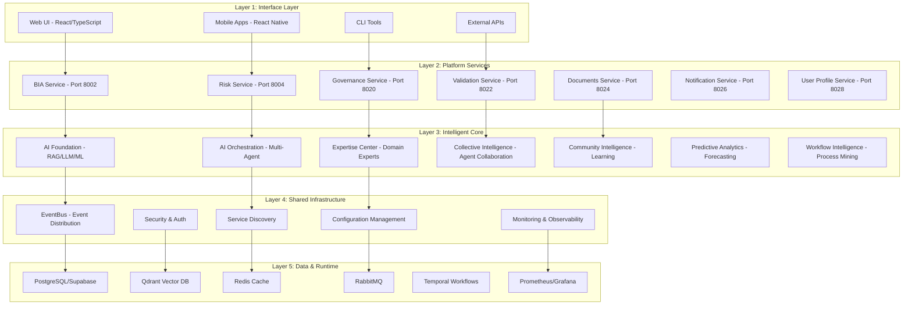

### Layer Responsibilities

| Layer | Responsibilities | Key Components |
|-------|-----------------|----------------|
| **1. Interface** | User interaction, external integrations | Web UI, Mobile Apps, APIs |
| **2. Platform Services** | Business logic, domain operations | 19 microservices (BIA, Risk, Governance, etc.) |
| **3. Intelligent Core** | AI/ML processing, expert systems | RAG, LLM Router, Multi-Agent Orchestration |
| **4. Shared Infrastructure** | Cross-cutting concerns | EventBus, Service Discovery, Security |
| **5. Data & Runtime** | Data persistence, async processing | PostgreSQL, Qdrant, Redis, RabbitMQ, Temporal |

---

## Component Architecture

### Intelligent Core Components

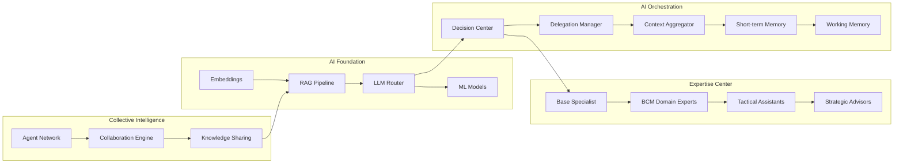

### Platform Services Components

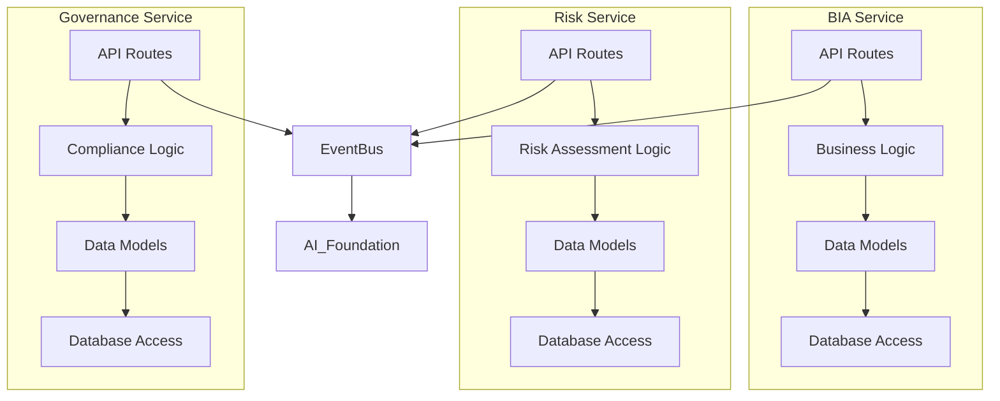

---

## Data Flow Architecture

### Request Flow: User → AI → Response

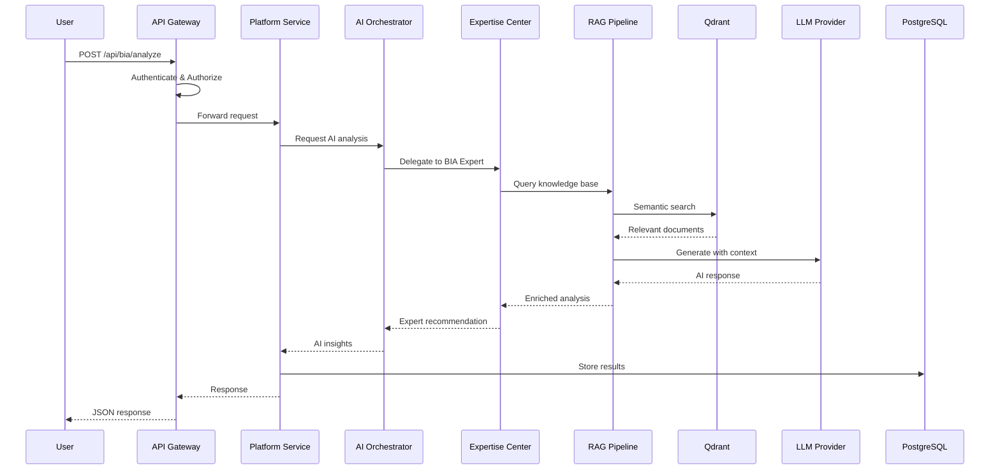

### Event Flow: Event-Driven Processing

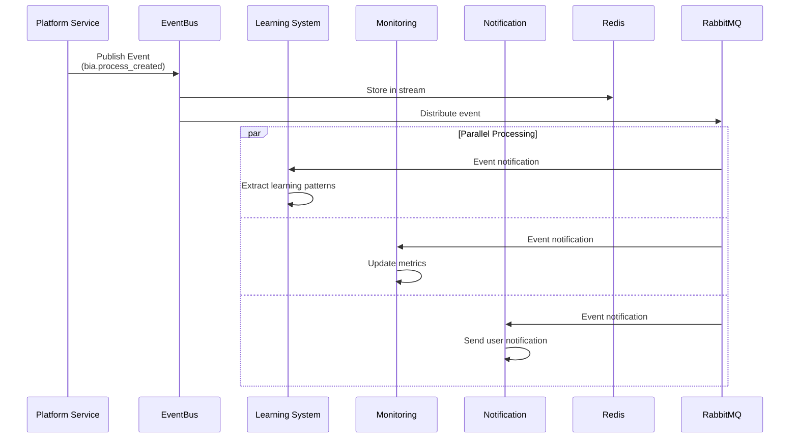

### Data Synchronization Flow

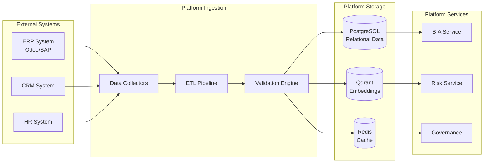

---

## Integration Architecture

### External System Integrations

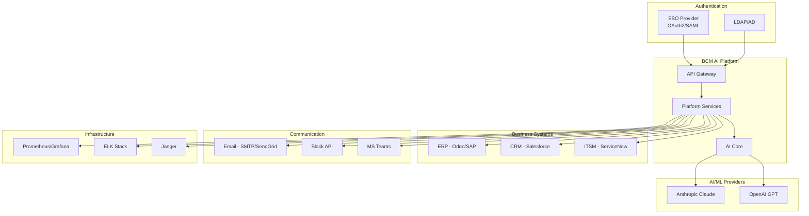

### API Integration Patterns

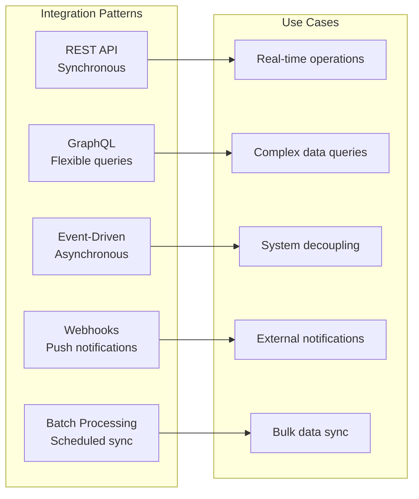

---

## Deployment Architecture

### Kubernetes Deployment

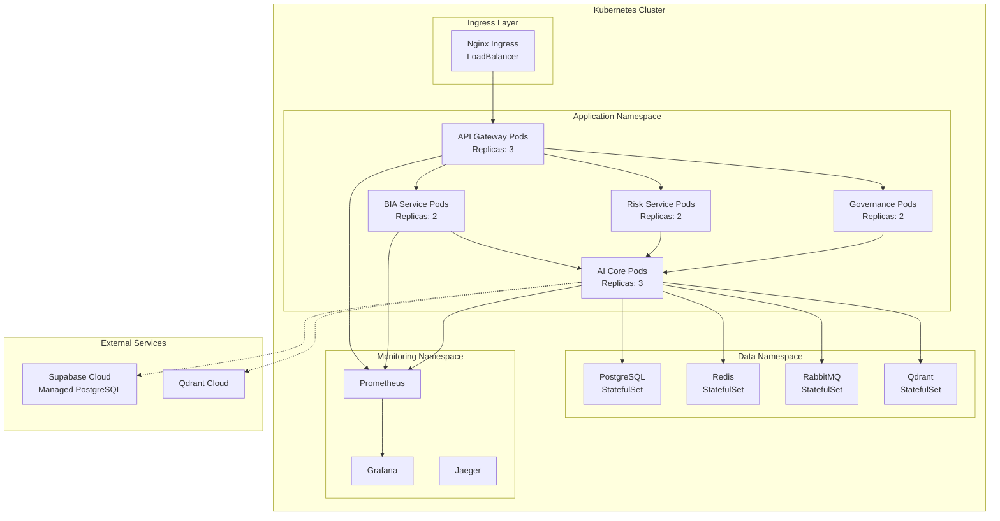

### Cloud Deployment Options

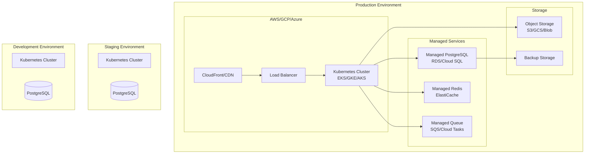

---

## Security Architecture

### Security Layers

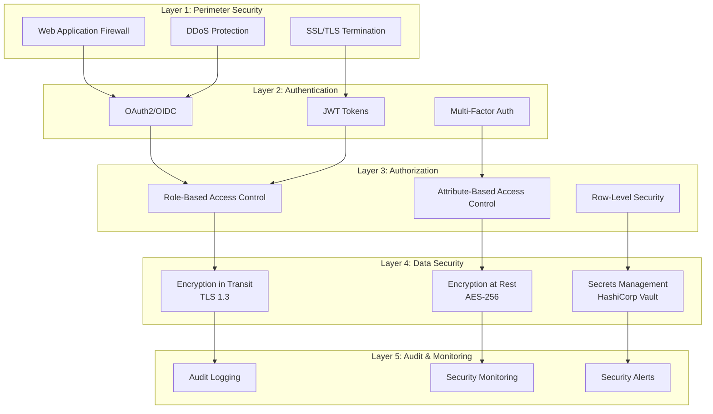

### Authentication Flow

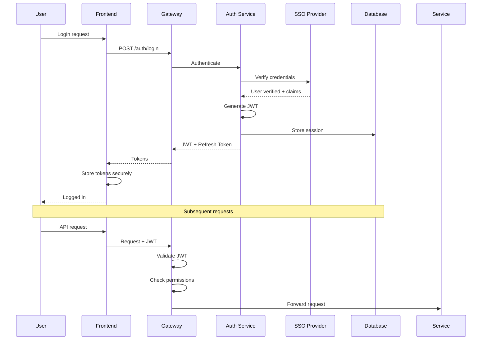

---

## Event-Driven Architecture

### EventBus Architecture

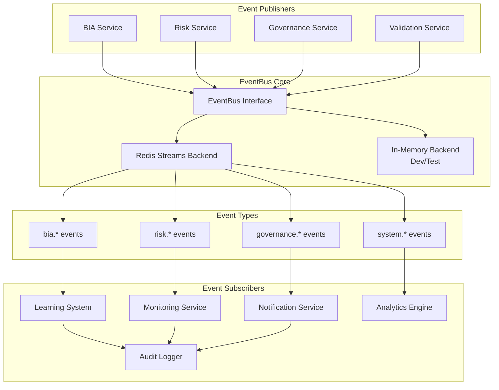

### Event Flow Example

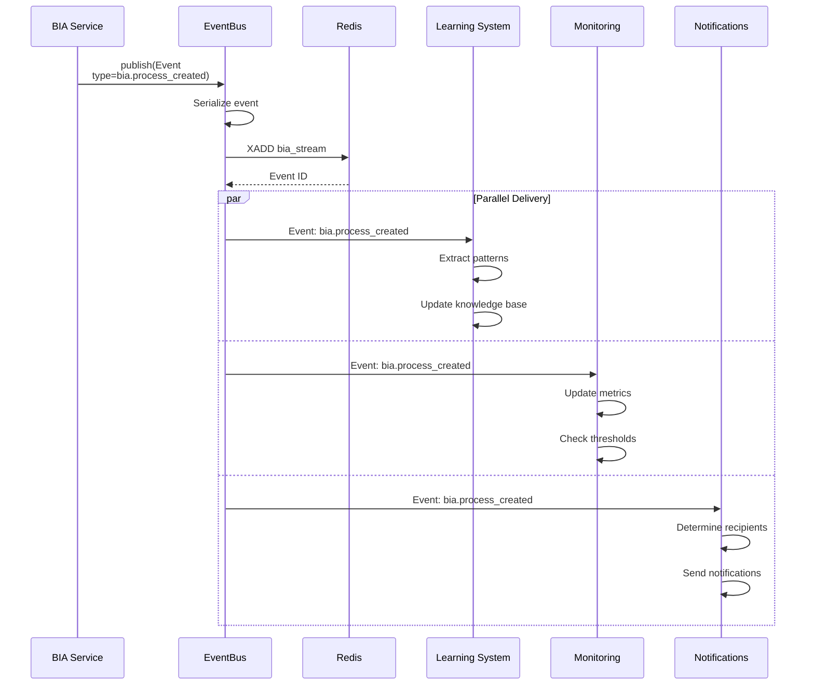

---

## Dependency Map

### Module Dependencies

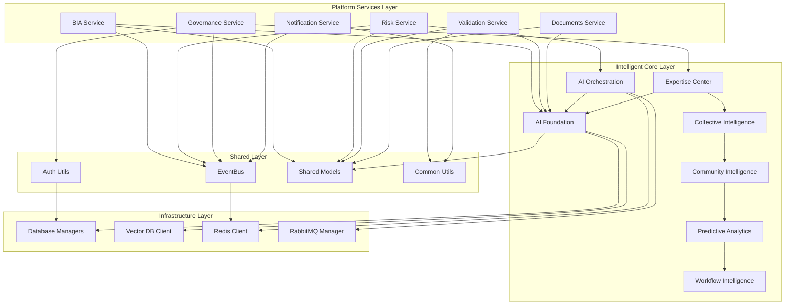

### Cross-Layer Dependencies

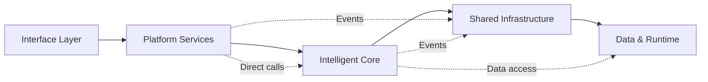

---

## Performance Characteristics

### Scalability Model

| Component | Scaling Strategy | Max Throughput | Latency Target |
|-----------|-----------------|----------------|----------------|
| **API Gateway** | Horizontal (auto-scale) | 10,000 req/s | < 10ms |
| **Platform Services** | Horizontal (auto-scale) | 5,000 req/s per service | < 50ms |
| **AI Foundation** | Horizontal + GPU | 100 inferences/s | < 500ms |
| **AI Orchestration** | Horizontal | 500 tasks/s | < 100ms |
| **PostgreSQL** | Vertical + Read replicas | 50,000 queries/s | < 5ms |
| **Qdrant** | Horizontal | 10,000 searches/s | < 20ms |
| **Redis** | Horizontal cluster | 100,000 ops/s | < 1ms |
| **RabbitMQ** | Horizontal cluster | 50,000 msgs/s | < 10ms |

### Caching Strategy

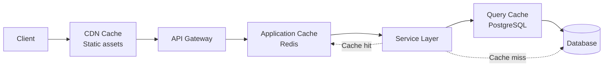

---

## Monitoring & Observability

### Observability Stack

```mermaid
graph TB
    subgraph "Application Layer"
        Services[Microservices]
    end

    subgraph "Metrics Collection"
        Prometheus[Prometheus]
        StatSD[StatsD]
    end

    subgraph "Logging"
        Loki[Loki]
        FluentD[FluentD]
    end

    subgraph "Tracing"
        Jaeger[Jaeger]
        OpenTelemetry[OpenTelemetry]
    end

    subgraph "Visualization"
        Grafana[Grafana Dashboards]
        Kibana[Kibana]
    end

    subgraph "Alerting"
        AlertManager[Alertmanager]
        PagerDuty[PagerDuty]
    end

    Services --> Prometheus
    Services --> StatSD
    Services --> FluentD
    Services --> OpenTelemetry

    Prometheus --> Grafana
    StatSD --> Grafana

    FluentD --> Loki
    Loki --> Grafana

    OpenTelemetry --> Jaeger
    Jaeger --> Grafana

    Prometheus --> AlertManager
    AlertManager --> PagerDuty
```

---

## Technology Decisions

### Architecture Decision Records (ADRs)

| Decision | Rationale | Alternatives Considered |
|----------|-----------|------------------------|
| **Microservices over Monolith** | Independent scaling, team autonomy, technology diversity | Modular monolith |
| **FastAPI for services** | Modern async Python, auto OpenAPI, high performance | Flask, Django |
| **PostgreSQL as primary DB** | ACID compliance, JSON support, mature ecosystem | MongoDB, MySQL |
| **Qdrant for vector DB** | Open-source, high performance, gRPC API | Pinecone, Weaviate |
| **Redis for caching** | In-memory speed, pub/sub, streams support | Memcached, Hazelcast |
| **RabbitMQ for messaging** | Reliable, flexible routing, manageable | Kafka, NATS |
| **Temporal for workflows** | Durable execution, versioning, visibility | Apache Airflow, Cadence |
| **Kubernetes for orchestration** | Industry standard, cloud-agnostic, ecosystem | Docker Swarm, Nomad |
| **Anthropic Claude for LLM** | Safety, long context, function calling | OpenAI GPT-4, local models |

---

## Future Architecture Evolution

### Roadmap

```mermaid
gantt
    title Architecture Evolution Roadmap
    dateFormat YYYY-MM
    section Phase 1
    Microservices foundation       :done, 2024-01, 2024-06
    AI Foundation layer            :done, 2024-03, 2024-08
    section Phase 2
    Multi-agent orchestration      :active, 2024-07, 2025-01
    Event-driven architecture      :active, 2024-09, 2025-02
    section Phase 3
    Edge computing capabilities    :2025-01, 2025-06
    Blockchain integration         :2025-03, 2025-08
    section Phase 4
    Quantum-ready cryptography     :2025-06, 2026-01
    Federated learning             :2025-09, 2026-03
```

### Planned Enhancements

1. **GraphQL Federation** - Unified API layer across all services
2. **Service Mesh** - Istio/Linkerd for advanced traffic management
3. **Multi-region deployment** - Active-active geo-distribution
4. **Blockchain audit trail** - Partisia integration for immutable records
5. **Edge AI** - Move inference closer to users
6. **Federated learning** - Privacy-preserving ML across organizations

---

## Compliance & Standards

### Architectural Compliance

| Standard | Compliance Level | Notes |
|----------|-----------------|-------|
| **ISO 22301:2019** | Full | BCM-specific architecture patterns |
| **ISO 27001** | Full | Security controls embedded |
| **ISO 31000** | Full | Risk management framework |
| **GDPR** | Full | Data privacy by design |
| **SOC 2 Type II** | In Progress | Annual audit planned |
| **NIST Cybersecurity Framework** | Full | Security architecture alignment |

---

## References

- [C4 Model Documentation](https://c4model.com/)
- [12-Factor App Methodology](https://12factor.net/)
- [Microservices Patterns](https://microservices.io/patterns/)
- [Event-Driven Architecture Patterns](https://www.enterpriseintegrationpatterns.com/)
- [ISO 22301:2019 Standard](https://www.iso.org/standard/75106.html)

---

**Document Version:** 1.0.0
**Last Updated:** 2025-10-07
**Maintained By:** Platform Architecture Team
**Review Cycle:** Quarterly
