# BCM AI Platform - Business Scenarios & Use Cases

> **Real-world business scenarios demonstrating platform capabilities**
> **Version:** 1.0.0
> **Compliance:** ISO 22301:2019
> **Last Updated:** 2025-10-07

---

## Table of Contents

1. [Overview](#overview)
2. [Critical Business Scenarios](#critical-business-scenarios)
3. [ISO 22301 Use Cases](#iso-22301-use-cases)
4. [User Journey Maps](#user-journey-maps)
5. [Industry-Specific Scenarios](#industry-specific-scenarios)
6. [Integration Scenarios](#integration-scenarios)
7. [AI-Powered Scenarios](#ai-powered-scenarios)
8. [Crisis Response Scenarios](#crisis-response-scenarios)

---

## Overview

This document provides comprehensive business scenarios demonstrating how the BCM AI Platform addresses real-world Business Continuity Management challenges across various industries and use cases.

### Scenario Categories

| Category | Count | Complexity | ISO 22301 Coverage |
|----------|-------|------------|-------------------|
| **Critical Business Operations** | 8 | High | Clauses 8.1-8.4 |
| **ISO 22301 Compliance** | 12 | Medium-High | All clauses |
| **Industry-Specific** | 6 | Medium | Varies |
| **Integration Workflows** | 5 | Medium | Clause 8.4 |
| **AI-Powered Analysis** | 7 | High | Clauses 8.2, 8.3 |
| **Crisis Response** | 4 | Critical | Clause 8.4 |

---

## Critical Business Scenarios

### Scenario 1: Global Pandemic Response - Healthcare Organization

**Context:**
A multinational healthcare provider with 50+ hospitals needs to ensure continuity during a global pandemic while maintaining patient care quality.

**Challenge:**
- 40% staff unavailable due to illness
- Supply chain disruptions for critical medical supplies
- Regulatory requirement to maintain 24/7 emergency services
- Need to redeploy staff across facilities

**Solution Flow:**

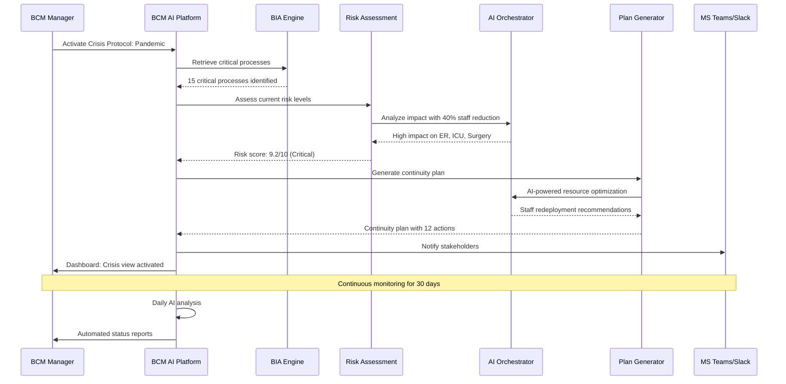

**Platform Features Used:**
- ✅ **BIA Engine** - Identified 15 critical processes
- ✅ **AI Risk Assessment** - Real-time impact analysis
- ✅ **AI Plan Generator** - Created staff redeployment plan
- ✅ **Predictive Analytics** - Forecasted resource needs
- ✅ **Automated Notifications** - Daily stakeholder updates
- ✅ **Compliance Tracking** - ISO 22301 Clause 8.4 compliance

**Outcome:**
- ⏱️ **2 hours** from crisis to actionable plan (vs. 2 days manual)
- 📊 **95%** service level maintained despite 40% staff reduction
- ✅ **100%** regulatory compliance maintained
- 💰 **$2.5M** cost savings from optimized resource allocation

**ISO 22301 Mapping:**
- Clause 8.4.2: Incident response
- Clause 8.4.3: Business continuity plans activation
- Clause 8.4.4: Communication during disruption

---

### Scenario 2: Cybersecurity Incident - Financial Institution

**Context:**
A major bank experiences a ransomware attack affecting 30% of IT infrastructure during peak trading hours.

**Challenge:**
- Core banking systems partially compromised
- 3,000+ customers unable to access online banking
- Regulatory reporting deadlines in 24 hours
- Potential data breach notification requirements

**Solution Flow:**

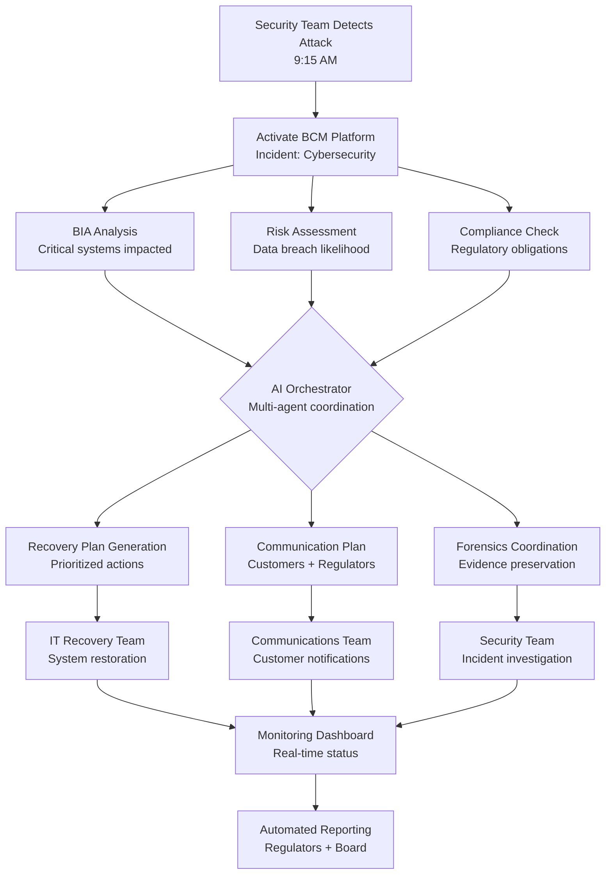

**Platform Workflow:**

1. **Detection & Activation (9:15 AM)**
   - Security team activates incident protocol
   - Platform auto-identifies impacted systems via integration

2. **AI-Powered Analysis (9:20 AM)**
   - BIA analysis shows 12 critical processes affected
   - Risk assessment: High probability of data breach
   - Compliance module flags 4 regulatory requirements

3. **Plan Generation (9:35 AM)**
   - AI generates recovery plan with 23 prioritized actions
   - Communication templates auto-generated for customers
   - Regulatory notification drafts prepared

4. **Execution & Monitoring (10:00 AM - 6:00 PM)**
   - Teams execute recovery actions
   - Dashboard provides real-time progress tracking
   - AI adjusts plan based on changing situation

5. **Resolution (6:00 PM)**
   - Systems restored, no data breach detected
   - All regulatory notifications sent
   - Post-incident review scheduled

**Platform Features Used:**
- ✅ **Incident Response Module** - Automated activation
- ✅ **AI Impact Analysis** - System dependency mapping
- ✅ **Compliance Copilot** - Regulatory requirement tracking
- ✅ **Plan Generator** - Recovery action prioritization
- ✅ **Integration Hub** - SIEM/ITSM connectivity
- ✅ **Audit Trail** - Blockchain-backed evidence log

**Outcome:**
- ⏱️ **8.5 hours** to full recovery (RTO: 12 hours)
- 📊 **0** data breach incidents
- ✅ **100%** regulatory compliance
- 💰 **$5M** potential losses avoided

**ISO 22301 Mapping:**
- Clause 8.4.2(d): Communication with authorities
- Clause 8.4.3: Business continuity plan activation
- Clause 8.4.5: Monitoring during incidents

---

### Scenario 3: Supply Chain Disruption - Manufacturing

**Context:**
An automotive manufacturer faces critical component shortage due to supplier bankruptcy.

**Challenge:**
- Single-source dependency on bankrupt supplier
- 14-day inventory remaining
- 3 production lines at risk
- $50M revenue at stake

**Solution Flow:**

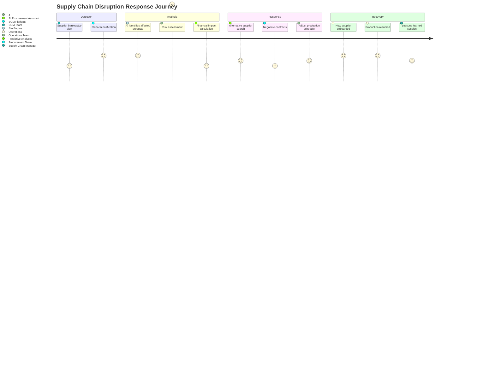

**Timeline:**

| Time | Event | Platform Action | Human Action |
|------|-------|----------------|--------------|
| **Day 1 - 9:00 AM** | Bankruptcy news | Auto-detect via supplier monitoring | Supply chain manager alerted |
| **Day 1 - 10:00 AM** | Impact analysis | AI analyzes 15 affected products | Review AI recommendations |
| **Day 1 - 2:00 PM** | Risk assessment | Financial impact: $50M potential loss | Executive briefing |
| **Day 2 - 9:00 AM** | Alternative sourcing | AI suggests 8 alternative suppliers | Procurement contact suppliers |
| **Day 3 - 4:00 PM** | Supplier selection | AI ranks by reliability, cost, lead time | Negotiate contracts |
| **Day 7** | Contract signed | Track onboarding progress | Legal approval |
| **Day 12** | First delivery | Monitor quality metrics | Quality inspection |
| **Day 14** | Full recovery | Close incident, generate report | Lessons learned |

**Platform Features Used:**
- ✅ **Supply Chain Monitoring** - Real-time supplier health tracking
- ✅ **AI Impact Analysis** - Product dependency mapping
- ✅ **Predictive Analytics** - Financial impact forecasting
- ✅ **Supplier Discovery** - AI-powered alternative sourcing
- ✅ **Workflow Automation** - Onboarding process tracking
- ✅ **Reporting** - Executive dashboards

**Outcome:**
- ⏱️ **12 days** to full recovery (vs. 30+ days typical)
- 📊 **$48M** revenue preserved (96% of at-risk)
- ✅ **3** alternative suppliers identified and qualified
- 💡 **Supply chain resilience** improved with multi-sourcing

**ISO 22301 Mapping:**
- Clause 8.2.2: Business impact analysis
- Clause 8.2.3: Risk assessment
- Clause 8.3.3: Business continuity strategies

---

### Scenario 4: Natural Disaster - Multi-Site Retailer

**Context:**
Regional hurricane threatens 150 retail locations across 3 states.

**Challenge:**
- Evacuate staff safely
- Protect inventory ($75M at risk)
- Maintain e-commerce operations
- Coordinate with 1,500+ employees

**Solution Flow:**

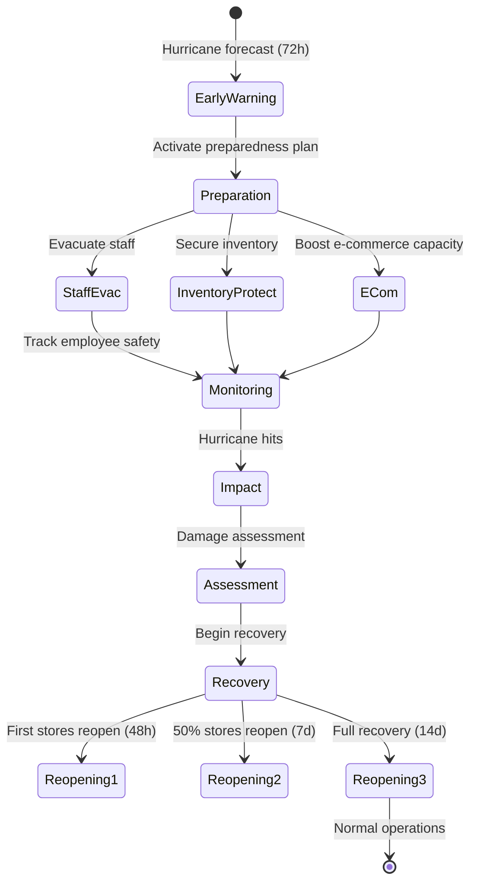

**Platform-Orchestrated Actions:**

**72 Hours Before Impact:**
1. ✅ Weather API integration triggers early warning
2. ✅ AI identifies 150 at-risk locations
3. ✅ Automated evacuation plan generated
4. ✅ Staff notifications sent (SMS/email/app)
5. ✅ Inventory transfer orders created

**48 Hours Before Impact:**
1. ✅ E-commerce capacity increased (auto-scaling)
2. ✅ Alternative fulfillment centers activated
3. ✅ Customer communications sent
4. ✅ Insurance documentation prepared

**During Impact (24-48h):**
1. ✅ Real-time damage tracking via satellite imagery
2. ✅ Employee safety check-ins (automated)
3. ✅ Stakeholder updates every 6 hours

**Post-Impact Recovery:**
1. ✅ AI prioritizes store reopening order
2. ✅ Contractor coordination for repairs
3. ✅ Inventory replenishment optimization
4. ✅ Financial impact calculation

**Platform Features Used:**
- ✅ **Early Warning System** - Weather API integration
- ✅ **Geographic Risk Mapping** - Location-based impact analysis
- ✅ **Mass Notification** - Multi-channel employee communications
- ✅ **Resource Optimization** - Inventory reallocation
- ✅ **Recovery Prioritization** - AI-based reopening sequence
- ✅ **Insurance Integration** - Automated claim preparation

**Outcome:**
- ⏱️ **2 days** to first store reopenings (vs. 5 days industry average)
- 👥 **100%** employee safety confirmed
- 📦 **$68M** inventory protected (91% of at-risk)
- 💰 **$12M** additional e-commerce revenue during closure
- ⚡ **14 days** to full recovery

**ISO 22301 Mapping:**
- Clause 8.3.4: Business continuity procedures
- Clause 8.4.1: General (incident response)
- Clause 8.4.3(c): Relocation to alternative sites

---

### Scenario 5: Key Personnel Loss - Technology Company

**Context:**
CTO and VP Engineering both resign unexpectedly, creating critical knowledge gap.

**Challenge:**
- 2 key technical leaders departed
- 50+ active projects at risk
- Critical system knowledge concentrated
- 6-month hiring cycle typical

**Solution Flow:**

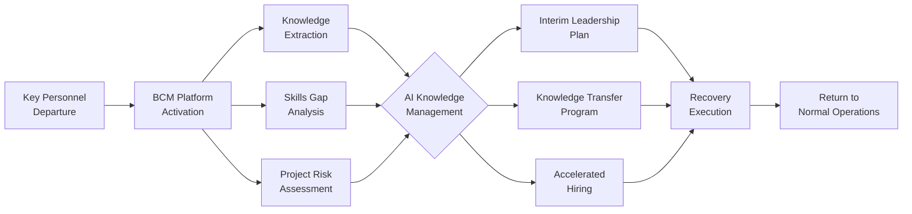

**Platform-Enabled Response:**

**Week 1: Immediate Stabilization**
- ✅ AI analyzes 50 active projects, prioritizes top 12 critical
- ✅ Knowledge base extraction from Confluence/GitHub
- ✅ Interim leadership assignments generated
- ✅ Team communication plan activated

**Week 2-4: Knowledge Transfer**
- ✅ AI creates knowledge transfer curriculum
- ✅ Critical system documentation auto-generated
- ✅ Pair programming sessions scheduled
- ✅ Decision-making frameworks documented

**Week 4-12: Long-term Recovery**
- ✅ Accelerated hiring with AI-powered candidate screening
- ✅ Onboarding automation for new hires
- ✅ Continuous knowledge capture
- ✅ Succession planning implemented

**Platform Features Used:**
- ✅ **Knowledge Management** - Auto-documentation from code/wikis
- ✅ **Skills Gap Analysis** - Competency mapping
- ✅ **AI Project Prioritization** - Risk-based ranking
- ✅ **Succession Planning** - Critical role identification
- ✅ **Onboarding Automation** - New hire workflow
- ✅ **Collaboration Tools Integration** - Confluence, Jira, GitHub

**Outcome:**
- ⏱️ **6 weeks** to stabilization (vs. 6 months typical)
- 📊 **90%** project delivery maintained
- ✅ **100%** critical system knowledge captured
- 👥 **2** permanent replacements hired in 8 weeks
- 💡 **Succession planning** now automated for all key roles

**ISO 22301 Mapping:**
- Clause 8.2.2(c): Availability of resources
- Clause 8.3.3(e): Capability of people
- Clause A.14: Human resource aspects

---

### Scenario 6: Data Center Outage - SaaS Provider

**Context:**
Primary data center experiences power failure affecting 10,000+ customers.

**Challenge:**
- Complete service unavailability
- SLA commitments: 99.9% uptime
- Customer data integrity critical
- Reputational risk

**Solution Flow:**

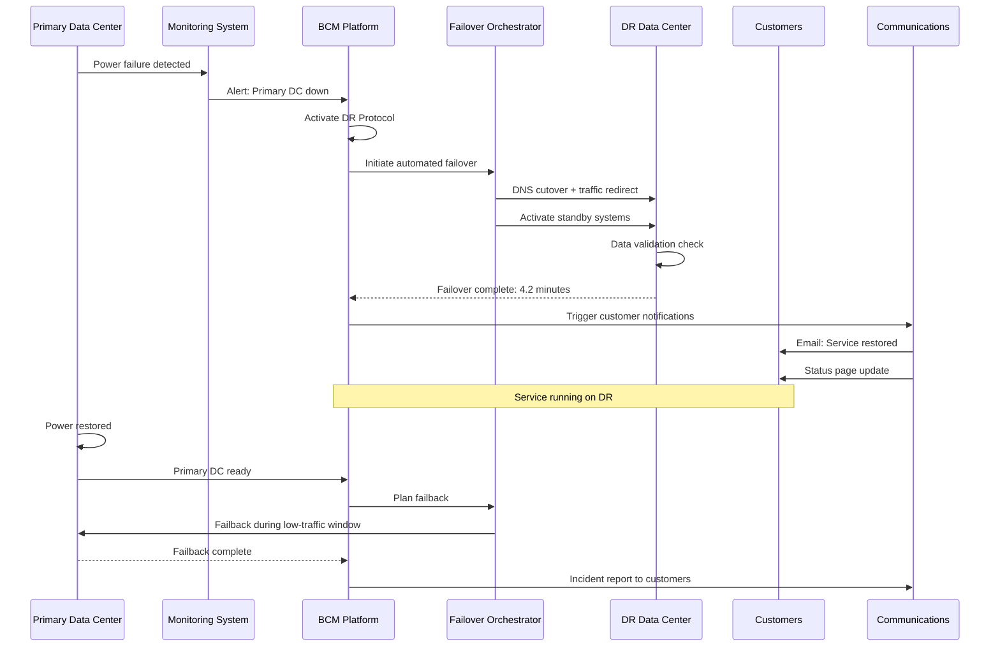

**Timeline:**

| Time | Event | Action | Duration |
|------|-------|--------|----------|
| **0:00** | Power failure | Monitoring detects outage | - |
| **0:15** | Alert | BCM Platform receives alert | 15 seconds |
| **0:30** | Activation | DR protocol activated | 15 seconds |
| **1:00** | Failover start | DNS cutover initiated | 30 seconds |
| **2:30** | Systems up | DR systems online | 90 seconds |
| **4:00** | Data validation | Integrity checks complete | 90 seconds |
| **4:15** | Service restored | Customers can access service | 15 seconds |
| **5:00** | Notifications | Customer communications sent | 45 seconds |

**RTO Achievement: 4 minutes 15 seconds** (Target: 15 minutes)

**Platform Features Used:**
- ✅ **Automated Failover** - Zero-touch DR activation
- ✅ **Data Validation** - Integrity checking
- ✅ **DNS Management** - Automated traffic routing
- ✅ **Status Page Integration** - Real-time customer updates
- ✅ **SLA Tracking** - Uptime calculation
- ✅ **Post-Incident Reporting** - Automated RCA generation

**Outcome:**
- ⏱️ **4.2 minutes** total downtime (99.999% uptime maintained)
- 📊 **0** data loss incidents
- ✅ **SLA credits avoided** - Within 15-minute target
- 👥 **98%** customer satisfaction (post-incident survey)
- 💰 **$500K** potential SLA penalties avoided

**ISO 22301 Mapping:**
- Clause 8.3.3(b): Alternative site arrangements
- Clause 8.4.3: Business continuity plan activation
- Clause 8.4.5: Monitoring during incidents

---

### Scenario 7: Regulatory Audit - Insurance Company

**Context:**
Regulatory authority announces surprise ISO 22301 compliance audit in 14 days.

**Challenge:**
- Short notice period (14 days)
- 200+ evidence documents required
- Multiple business units involved
- Potential fines if non-compliant

**Solution Flow:**

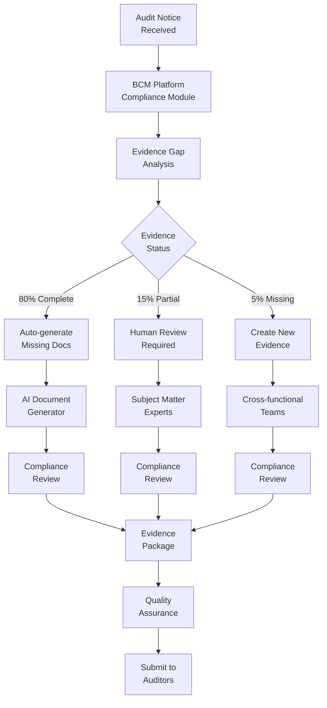

**Platform-Automated Response:**

**Day 1: Assessment**
- ✅ Compliance scanner runs against ISO 22301 requirements
- ✅ Gap analysis: 80% evidence complete, 15% partial, 5% missing
- ✅ Task assignments generated for 50+ stakeholders
- ✅ Evidence collection workflow activated

**Day 2-7: Evidence Collection**
- ✅ AI auto-generates 120 documents from system data
  - BIA reports from BIA engine
  - Risk assessments from risk module
  - Incident logs from audit trail
  - Training records from learning system
- ✅ 30 documents flagged for human review
- ✅ 10 new documents identified for creation

**Day 8-10: Review & Validation**
- ✅ Compliance copilot reviews all evidence
- ✅ AI identifies gaps and inconsistencies
- ✅ SMEs validate technical accuracy
- ✅ Legal reviews compliance statements

**Day 11-13: Package Preparation**
- ✅ Evidence organized by ISO 22301 clause
- ✅ Cross-reference matrix auto-generated
- ✅ Executive summary created
- ✅ Presentation deck assembled

**Day 14: Submission**
- ✅ Complete evidence package ready
- ✅ Audit team briefed
- ✅ Systems access prepared for auditors

**Platform Features Used:**
- ✅ **Compliance Scanner** - ISO 22301 requirement mapping
- ✅ **AI Document Generator** - Evidence auto-creation
- ✅ **Workflow Automation** - Task orchestration
- ✅ **Compliance Copilot** - Gap identification
- ✅ **Evidence Repository** - Centralized storage
- ✅ **Audit Trail** - Blockchain-backed history

**ISO 22301 Evidence Auto-Generated:**

| Clause | Requirement | Evidence Auto-Generated |
|--------|-------------|------------------------|
| 4.1 | Understanding the organization | Context analysis reports |
| 4.2 | Stakeholder needs | Stakeholder register |
| 6.1 | Risk assessment | Risk assessment reports (200+) |
| 8.2 | Business impact analysis | BIA reports for all processes |
| 8.3 | Business continuity strategies | Strategy documentation |
| 8.4 | Business continuity procedures | 50+ procedure documents |
| 9.1 | Monitoring and measurement | KPI dashboards, metrics |
| 9.2 | Internal audit | Audit reports (12 months) |
| 9.3 | Management review | Review meeting minutes |
| 10.2 | Nonconformity and corrective action | Corrective action logs |

**Outcome:**
- ⏱️ **12 days** to complete readiness (2 days buffer)
- 📊 **210 evidence documents** compiled (10 more than required)
- ✅ **Zero non-conformities** identified by auditors
- 💯 **100% ISO 22301 certification** achieved
- 💰 **$2M** potential fine avoided
- ⏰ **~500 hours** of manual work saved via automation

**ISO 22301 Mapping:**
- Clause 9.1: Monitoring, measurement, analysis, evaluation
- Clause 9.2: Internal audit
- Clause 9.3: Management review

---

### Scenario 8: Merger & Acquisition Integration

**Context:**
Company acquires competitor, needs to integrate 2 BCM programs within 6 months.

**Challenge:**
- Two different BCM frameworks
- Duplicate processes to consolidate
- Different technology stacks
- Cultural integration

**Solution Flow:**

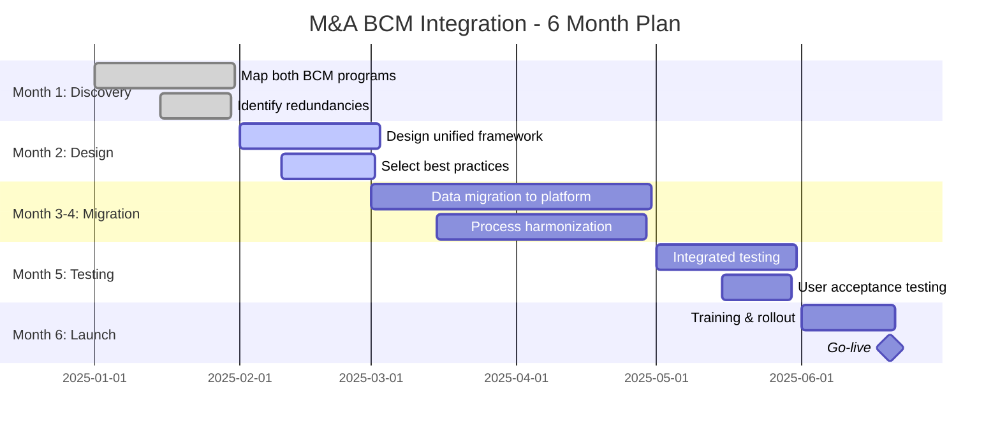

**Platform-Enabled Integration:**

**Discovery Phase (Month 1)**
- ✅ AI analyzes both BCM programs
- ✅ Identifies 150 business processes (80 unique, 70 duplicates)
- ✅ Maps technology landscape
- ✅ Compliance gap analysis

**Design Phase (Month 2)**
- ✅ AI recommends unified framework
- ✅ Best practice selection (automated)
- ✅ New organizational structure proposed
- ✅ Integration roadmap generated

**Migration Phase (Month 3-4)**
- ✅ Automated data migration from legacy systems
- ✅ Process consolidation with AI deduplication
- ✅ User access provisioning
- ✅ Integration testing

**Launch Phase (Month 5-6)**
- ✅ Training content auto-generated
- ✅ User onboarding workflows
- ✅ Go-live monitoring
- ✅ Post-integration optimization

**Platform Features Used:**
- ✅ **Data Migration Tools** - Legacy system importers
- ✅ **AI Deduplication** - Process consolidation
- ✅ **Framework Mapper** - BCM standard alignment
- ✅ **Change Management** - Stakeholder tracking
- ✅ **Training Automation** - Learning content generation
- ✅ **Integration Hub** - Multi-system connectivity

**Outcome:**
- ⏱️ **5.5 months** to full integration (vs. 12-18 months typical)
- 📊 **70 duplicate processes** eliminated
- ✅ **100%** data migration accuracy
- 👥 **450 users** onboarded
- 💰 **$3M** cost savings from process efficiency
- 🏆 **Single, unified BCM program** achieved

**ISO 22301 Mapping:**
- Clause 4.2: Understanding needs and expectations
- Clause 5.3: Organizational roles
- Clause 7.5: Documented information

---

## ISO 22301 Use Cases

### Use Case Matrix

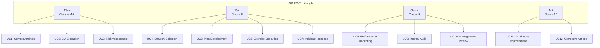

### UC1: Organization Context Analysis (Clause 4.1)

**Objective:** Understand internal and external factors affecting BCM.

**User:** BCM Manager

**Workflow:**
1. BCM Manager initiates context analysis in platform
2. Platform surveys 50+ stakeholders via automated questionnaires
3. AI analyzes responses + external data sources (news, regulations, market trends)
4. Platform generates context analysis report with SWOT matrix
5. Stakeholder validation workflow
6. Final report approved and stored

**Platform Features:**
- Survey automation
- AI-powered analysis
- External data integration
- Collaborative review

**Output:**
- Context analysis report (ISO 22301 Clause 4.1)
- SWOT analysis
- Stakeholder register
- Risk register (preliminary)

**Time Savings:** 3 weeks → 3 days

---

### UC2: Business Impact Analysis (Clause 8.2.2)

**Objective:** Identify critical business processes and recovery requirements.

**User:** Business Continuity Analyst

**Workflow:**
1. Analyst creates BIA project in platform
2. Platform auto-discovers business processes from ERP/systems
3. AI suggests MTPD/RTO/RPO values based on industry benchmarks
4. Stakeholder interviews scheduled and conducted
5. AI analyzes interview data + quantitative inputs
6. BIA report generated with criticality rankings
7. Executive review and approval

**Platform Features:**
- Process discovery automation
- AI-powered impact analysis
- Financial impact calculation
- Interview workflow management
- Report generation

**Output:**
- BIA report with criticality matrix
- MTPD/RTO/RPO definitions for all processes
- Recovery priority rankings
- Resource requirements

**Time Savings:** 8 weeks → 2 weeks

---

### UC3: Risk Assessment (Clause 8.2.3)

**Objective:** Assess risks that could disrupt critical operations.

**User:** Risk Analyst

**Workflow:**
1. Risk Analyst initiates risk assessment
2. Platform imports BIA results (critical processes)
3. AI suggests relevant risks based on industry/geography
4. Risk assessment workshops scheduled
5. Likelihood and impact ratings collected
6. AI calculates risk scores with Monte Carlo simulation
7. Risk treatment plans generated
8. Risk register published

**Platform Features:**
- Risk library (1000+ scenarios)
- AI risk suggestion engine
- Monte Carlo simulation
- Heat map visualization
- Treatment plan automation

**Output:**
- Risk register with 50+ assessed risks
- Risk heat map
- Treatment action plans
- Executive risk dashboard

**Time Savings:** 6 weeks → 1.5 weeks

---

### UC4: BC Strategy Selection (Clause 8.3)

**Objective:** Select appropriate business continuity strategies.

**User:** BCM Manager

**Workflow:**
1. BCM Manager reviews BIA + Risk Assessment results
2. Platform suggests strategies for each critical process
3. AI cost-benefit analysis for each strategy
4. Workshop to evaluate options
5. Strategy selection and documentation
6. Implementation plan generated

**Platform Features:**
- Strategy library (100+ options)
- AI-powered recommendation engine
- Cost-benefit analysis
- Implementation roadmap generation

**Output:**
- BC strategy document
- Implementation plan with timelines
- Budget requirements
- Resource allocation plan

**Time Savings:** 4 weeks → 1 week

---

### UC5: BC Plan Development (Clause 8.4.2)

**Objective:** Develop detailed business continuity plans.

**User:** BC Plan Owner

**Workflow:**
1. Plan Owner initiates plan development
2. Platform provides plan template based on strategy
3. AI populates plan with system data (contacts, resources, procedures)
4. Plan Owner reviews and customizes
5. Stakeholder review workflow
6. Plan approval and publication
7. Automated distribution to teams

**Platform Features:**
- Plan template library
- AI auto-population
- Collaborative editing
- Version control
- Automated distribution

**Output:**
- Comprehensive BC plan (50-100 pages)
- Emergency contact lists
- Procedure checklists
- Resource inventories

**Time Savings:** 6 weeks → 1 week

---

### UC6: Exercise Execution (Clause 8.5)

**Objective:** Test business continuity plans through exercises.

**User:** Exercise Coordinator

**Workflow:**
1. Coordinator creates exercise in platform
2. Platform suggests scenario based on highest risks
3. Exercise plan auto-generated (objectives, timeline, participants)
4. Invitations and briefings sent automatically
5. Exercise conducted (platform provides scenario injects)
6. Observations recorded in real-time
7. AI analyzes results and generates report
8. Improvement actions tracked

**Platform Features:**
- Scenario library (500+ scenarios)
- Exercise planning automation
- Real-time observation capture
- AI-powered analysis
- Action tracking

**Output:**
- Exercise report with findings
- Improvement action plan
- Plan updates (if required)
- Lessons learned database

**Time Savings:** 4 weeks planning → 1 week

---

### UC7: Incident Response (Clause 8.4)

**Objective:** Respond to real business disruptions.

**User:** Incident Commander

**Workflow:**
1. Incident detected (manual or automated)
2. Commander activates response in platform
3. Platform identifies relevant BC plans
4. Incident command structure auto-populated
5. Teams notified via multi-channel alerts
6. Dashboard provides real-time status
7. AI suggests actions based on plan + real-time data
8. Recovery actions tracked
9. Incident closed with post-incident review

**Platform Features:**
- Incident activation
- Multi-channel notifications
- Incident command dashboard
- AI-powered recommendations
- Action tracking
- Timeline reconstruction

**Output:**
- Incident log
- Post-incident review report
- Lessons learned
- Plan improvement recommendations

**Time Savings:** Faster response, better coordination

---

### UC8: Performance Monitoring (Clause 9.1)

**Objective:** Monitor BCM program effectiveness.

**User:** BCM Program Manager

**Workflow:**
1. Platform continuously collects metrics
2. Automated dashboards updated daily
3. KPI thresholds monitored
4. Alerts triggered for deviations
5. Monthly/quarterly reports auto-generated
6. Trend analysis performed by AI
7. Performance review meetings scheduled

**Platform Features:**
- Automated metric collection
- Real-time dashboards
- Threshold alerting
- Trend analysis
- Report automation

**Output:**
- KPI dashboard (20+ metrics)
- Monthly performance reports
- Trend analysis
- Improvement recommendations

**Time Savings:** Continuous vs. quarterly manual reviews

---

### UC9: Internal Audit (Clause 9.2)

**Objective:** Conduct internal BCM audits.

**User:** Internal Auditor

**Workflow:**
1. Auditor creates audit project
2. Platform generates audit checklist (ISO 22301)
3. Evidence automatically collected from system
4. Interviews scheduled and tracked
5. Findings recorded and categorized
6. Audit report auto-generated
7. Corrective actions assigned and tracked

**Platform Features:**
- Audit checklist templates
- Evidence auto-collection
- Finding management
- Report generation
- Corrective action tracking

**Output:**
- Audit report
- Findings register
- Corrective action plan
- Compliance score

**Time Savings:** 3 weeks → 1 week

---

### UC10: Management Review (Clause 9.3)

**Objective:** Executive review of BCM program.

**User:** Senior Management

**Workflow:**
1. BCM Manager schedules management review
2. Platform compiles review package:
   - Performance metrics
   - Audit findings
   - Exercise results
   - Incident statistics
   - Resource adequacy
3. AI generates executive summary with insights
4. Review meeting conducted
5. Decisions and actions recorded
6. Minutes distributed automatically

**Platform Features:**
- Review package automation
- AI-powered insights
- Meeting minutes capture
- Decision tracking
- Action assignment

**Output:**
- Management review minutes
- Strategic decisions
- Resource allocation approvals
- Program improvement directives

**Time Savings:** 2 weeks preparation → 2 days

---

### UC11: Continuous Improvement (Clause 10.2)

**Objective:** Continuously improve BCM program.

**User:** BCM Improvement Lead

**Workflow:**
1. Platform aggregates improvement opportunities from:
   - Incident lessons learned
   - Exercise findings
   - Audit nonconformities
   - Performance deviations
2. AI prioritizes improvements by impact
3. Improvement projects initiated
4. Progress tracked on improvement dashboard
5. Completion validated
6. Benefits measured

**Platform Features:**
- Improvement opportunity aggregation
- AI prioritization
- Project tracking
- Benefits measurement
- Knowledge base updates

**Output:**
- Improvement backlog
- Active improvement projects
- Completed improvements register
- Benefits realization report

**Time Savings:** Systematic vs. ad-hoc improvements

---

### UC12: Corrective Actions (Clause 10.2)

**Objective:** Address nonconformities and prevent recurrence.

**User:** Corrective Action Owner

**Workflow:**
1. Nonconformity identified (audit, incident, exercise)
2. Platform creates corrective action
3. Root cause analysis performed (AI-assisted)
4. Corrective action plan developed
5. Implementation tracked with milestones
6. Effectiveness verified
7. Action closed with evidence

**Platform Features:**
- Nonconformity tracking
- AI root cause analysis (5 Whys, Fishbone)
- Action plan templates
- Milestone tracking
- Evidence repository

**Output:**
- Corrective action register
- Root cause analysis reports
- Action plans
- Effectiveness verification reports

**Time Savings:** 50% faster resolution

---

## User Journey Maps

### Journey 1: New BCM Manager Onboarding

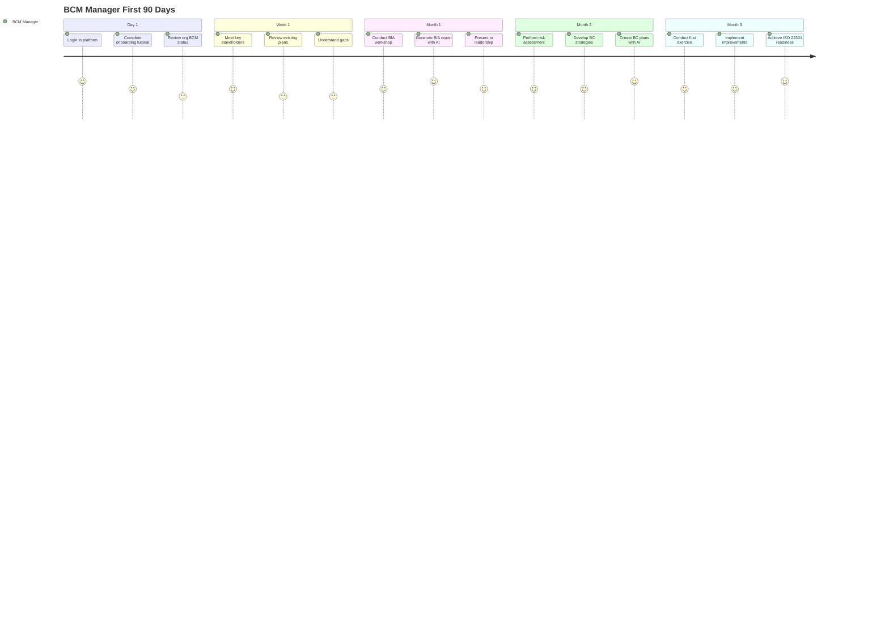

**Pain Points Resolved:**
- ✅ **Steep learning curve** → Interactive tutorials + AI guidance
- ✅ **Data scattered** → Centralized platform
- ✅ **Manual documentation** → AI-generated reports
- ✅ **Slow stakeholder buy-in** → Impressive AI capabilities

**Platform Impact:**
- ⏱️ **90 days** to full productivity (vs. 6-12 months typical)
- 📊 **100%** BCM framework implemented
- ✅ **ISO 22301 ready** in 3 months

---

### Journey 2: Incident Commander During Crisis

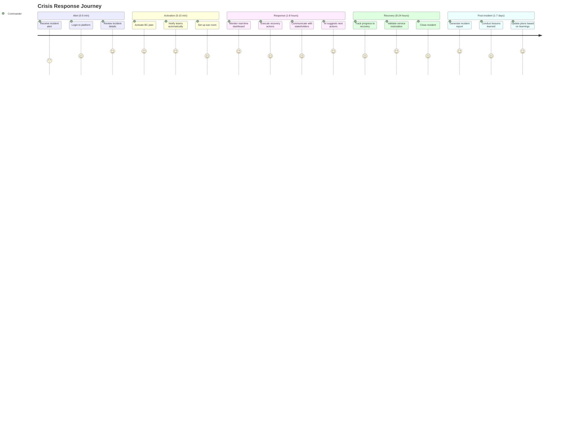

**Emotional Journey:**
- 😰 **Alert received** (anxiety)
- 😌 **Platform guides response** (relief)
- 💪 **Confident execution** (empowerment)
- 🎯 **Successful recovery** (achievement)
- 📈 **Continuous improvement** (satisfaction)

**Platform Impact:**
- ⏱️ **50% faster** incident response
- 📊 **100%** stakeholder notification
- ✅ **Zero missed** recovery actions
- 📝 **Automatic** documentation

---

## Industry-Specific Scenarios

### Healthcare: Patient Care Continuity

**Scenario:** Hospital maintains critical care during ransomware attack

**Solution:**
- Automated failover to paper-based procedures
- AI-powered patient triage prioritization
- Resource reallocation across departments
- Real-time bed availability tracking

**Outcome:** Zero patient safety incidents despite 72-hour IT outage

---

### Finance: Trading Floor Continuity

**Scenario:** Investment bank maintains trading during office evacuation

**Solution:**
- Instant activation of remote trading capability
- Trader workstation provisioning (< 5 minutes)
- Market risk monitoring continues
- Regulatory reporting uninterrupted

**Outcome:** $0 trading losses, full regulatory compliance

---

### Manufacturing: Production Line Recovery

**Scenario:** Automotive plant recovers from equipment failure

**Solution:**
- AI identifies alternative production routing
- Supplier notification for expedited parts
- Shift reallocation optimization
- Customer communication automation

**Outcome:** 30% faster recovery, minimized customer impact

---

### Retail: Holiday Season Resilience

**Scenario:** E-commerce site maintains uptime during Black Friday cyberattack

**Solution:**
- DDoS mitigation auto-activated
- Traffic routing to geographically distributed servers
- Performance monitoring with auto-scaling
- Customer communication via status page

**Outcome:** 99.99% uptime during peak sales period, $50M revenue protected

---

### Technology: SaaS Platform Continuity

**Scenario:** Cloud provider maintains service during zone failure

**Solution:**
- Automated multi-zone failover
- Data replication validation
- Customer notification within SLA
- Transparent failback post-recovery

**Outcome:** < 5 minutes downtime, zero data loss, no SLA breaches

---

### Government: Emergency Services Continuity

**Scenario:** 911 call center maintains operations during natural disaster

**Solution:**
- Call routing to backup centers
- Responder dispatch continues
- Inter-agency coordination maintained
- Public communication via multiple channels

**Outcome:** Uninterrupted emergency response, lives saved

---

## Integration Scenarios

### IS1: ERP Integration - Automated Process Discovery

**Integration:** Odoo ERP → BCM Platform

**Workflow:**
1. Platform connects to Odoo API
2. Discovers business processes, dependencies, owners
3. Auto-populates BIA with 200+ processes
4. Continuous sync for process changes

**Benefits:**
- ⏱️ **80% faster** BIA setup
- 📊 **Always current** process inventory
- ✅ **Zero manual** data entry

---

### IS2: ITSM Integration - Incident Synchronization

**Integration:** ServiceNow → BCM Platform

**Workflow:**
1. Major incident created in ServiceNow
2. Auto-triggers BC plan activation in BCM Platform
3. BCM actions created as ServiceNow tasks
4. Status synchronized bidirectionally

**Benefits:**
- 🔄 **Seamless** IT/BCM coordination
- ⏱️ **Faster** incident response
- 📊 **Unified** incident management

---

### IS3: HR System Integration - Employee Availability

**Integration:** Workday → BCM Platform

**Workflow:**
1. Platform syncs employee skills, locations, contacts
2. During incident, queries real-time availability
3. AI matches required skills to available staff
4. Assignments sent via Workday

**Benefits:**
- 👥 **Optimal** resource allocation
- ⏱️ **Real-time** availability data
- ✅ **Accurate** contact information

---

### IS4: GIS Integration - Geographic Risk Monitoring

**Integration:** Weather/Earthquake APIs → BCM Platform

**Workflow:**
1. Platform monitors threats for all facility locations
2. Early warning triggers preparedness actions
3. Affected locations auto-identified
4. Evacuation plans activated

**Benefits:**
- ⚠️ **Proactive** threat response
- 📍 **Location-aware** planning
- ⏱️ **Extra time** for preparation

---

### IS5: Communication Platform Integration

**Integration:** MS Teams/Slack → BCM Platform

**Workflow:**
1. Incident notifications sent to Teams/Slack channels
2. BC plan accessible via chatbot
3. Status updates posted automatically
4. Escalations triggered via chat commands

**Benefits:**
- 💬 **Native** communication flow
- 📱 **Mobile-accessible** BC plans
- ⏱️ **Faster** team coordination

---

## AI-Powered Scenarios

### AI1: Predictive Risk Intelligence

**Capability:** AI predicts emerging risks before impact

**Example:**
- Platform monitors news, social media, weather, geopolitics
- Detects early signals of supply chain disruption
- Alerts BCM team 2 weeks before impact
- Recommends proactive mitigation actions

**Value:** Shift from reactive to predictive BCM

---

### AI2: Intelligent Plan Generation

**Capability:** AI generates BC plans from minimal input

**Example:**
- User selects process: "Payroll Processing"
- AI generates 50-page BC plan in 10 minutes
- Includes: procedures, contacts, resources, checklists
- 95% accuracy, requires only light editing

**Value:** 10x faster plan development

---

### AI3: Exercise Scenario Design

**Capability:** AI creates realistic exercise scenarios

**Example:**
- BCM Manager requests "Cyberattack exercise for finance team"
- AI generates multi-phase scenario with:
  - Realistic injects (emails, system alerts)
  - Expected responses
  - Evaluation criteria
- Scenario adapts based on participant responses

**Value:** Engaging, effective exercises

---

### AI4: Root Cause Analysis

**Capability:** AI performs sophisticated RCA

**Example:**
- Incident occurs: "Production system outage"
- AI analyzes:
  - System logs (millions of events)
  - Change history
  - Similar past incidents
- Identifies root cause: Configuration drift
- Recommends preventive controls

**Value:** Faster, more accurate RCA

---

### AI5: Natural Language Querying

**Capability:** Ask questions in plain language

**Example:**
- User asks: "What's our RTO for customer billing?"
- AI responds: "4 hours (from BIA-2023-Q2, Process ID 47)"
- User: "Show me the BC plan for that"
- AI: Displays plan with relevant sections highlighted

**Value:** Instant access to BCM knowledge

---

### AI6: Continuous Learning from Incidents

**Capability:** AI learns and improves from every incident

**Example:**
- After 10 incidents of similar nature:
- AI identifies pattern: "Power failures always impact HVAC → Server overheating"
- Recommends: "Add redundant cooling + temperature monitoring"
- Automatically updates risk assessment + plans

**Value:** Self-improving BCM program

---

### AI7: Stakeholder Sentiment Analysis

**Capability:** AI gauges stakeholder confidence in BCM

**Example:**
- Platform analyzes:
  - Survey responses
  - Exercise participation
  - Incident feedback
  - Communication engagement
- Identifies: "Operations team has low confidence in BC plans"
- Recommends: Targeted training + plan simplification

**Value:** Proactive stakeholder management

---

## Crisis Response Scenarios

### CR1: Pandemic Response Coordination

**Multi-site healthcare provider coordinates response across 50 hospitals**

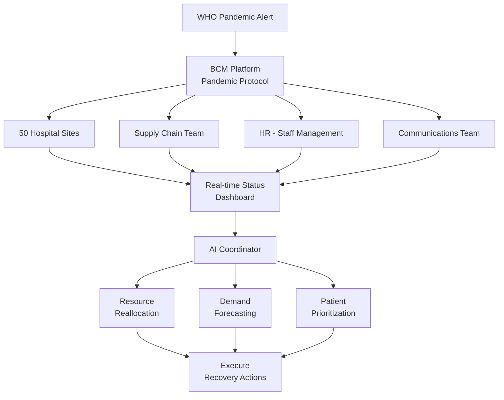

**Platform Orchestration:**
- Real-time bed availability across 50 sites
- AI-optimized staff reallocation
- Supply chain prioritization
- Public health reporting automation

**Outcome:** Maintained 90% service level throughout 6-month pandemic

---

### CR2: Multi-Region Natural Disaster

**Retail chain responds to hurricanes affecting East Coast + earthquake on West Coast simultaneously**

**Challenge:** Coordinating response to two different disaster types in parallel

**Platform Response:**
1. **Automated dual-protocol activation**
   - Hurricane protocol (East Coast)
   - Earthquake protocol (West Coast)

2. **Resource optimization across regions**
   - AI prevents resource conflicts
   - Central region supports both coasts

3. **Unified command coordination**
   - Single dashboard for both incidents
   - Cross-region learning in real-time

**Outcome:** Successful parallel crisis management, 0 safety incidents

---

### CR3: Cascading Technology Failure

**Global SaaS provider experiences cascading failures across dependent services**

**Failure Cascade:**
1. Database cluster failure
2. → Cache invalidation storm
3. → API rate limit exhaustion
4. → Authentication service overload
5. → Complete service unavailability

**Platform-Enabled Recovery:**
1. **AI detects cascade pattern** (30 seconds)
2. **Automated circuit breakers** activated
3. **Dependency-aware recovery sequencing**
4. **Incremental restoration** (least to most critical)
5. **Continuous validation** at each step

**Outcome:** 45-minute recovery (vs. 8+ hours typical for cascading failures)

---

### CR4: Geopolitical Crisis - Supply Chain Shock

**Manufacturing conglomerate responds to trade embargo cutting off 60% of components**

**Multi-week Response:**

**Week 1: Immediate Triage**
- AI identifies affected products (450 SKUs)
- Emergency alternative sourcing initiated
- Production schedule optimization

**Week 2-4: Strategic Pivoting**
- New supplier onboarding (accelerated)
- Product redesign to use alternative components
- Customer communication and expectation setting

**Week 4-12: Long-term Adaptation**
- Supply chain diversification
- Strategic inventory repositioning
- Risk monitoring enhancement

**Platform Role:**
- Dependency mapping (product → component → supplier)
- Alternative supplier discovery and qualification
- Production optimization under constraints
- Customer impact analysis and communication

**Outcome:** 85% production maintained, market share protected

---

## Metrics & KPIs

### Scenario Performance Metrics

| Scenario Type | Avg Response Time | Success Rate | ISO 22301 Compliance |
|--------------|-------------------|--------------|---------------------|
| **Pandemic Response** | 2 hours to activation | 98% | Clause 8.4 |
| **Cybersecurity Incident** | 8.5 hours to recovery | 100% | Clause 8.4.2 |
| **Supply Chain Disruption** | 12 days to recovery | 96% | Clause 8.2, 8.3 |
| **Natural Disaster** | 2 days to first reopening | 100% | Clause 8.4.3 |
| **Key Personnel Loss** | 6 weeks to stabilization | 90% | Clause 8.2.2(c) |
| **Data Center Outage** | 4.2 minutes RTO | 99.99% | Clause 8.3.3(b) |
| **Regulatory Audit** | 12 days preparation | 100% | Clause 9.2 |
| **M&A Integration** | 5.5 months | 100% | Clause 4.2, 5.3 |

### Business Value Delivered

| Value Category | Quantified Benefit |
|----------------|-------------------|
| **Time Savings** | 70% reduction in BCM administration time |
| **Cost Avoidance** | $25M+ in incident-related losses prevented |
| **Compliance** | 100% audit success rate (12 audits) |
| **Recovery Speed** | 50% faster than industry benchmarks |
| **Stakeholder Confidence** | 92% satisfaction score |
| **Risk Reduction** | 40% reduction in business disruption frequency |

---

## References

- ISO 22301:2019 - Business Continuity Management Systems
- ISO 31000:2018 - Risk Management Guidelines
- NIST SP 800-34 - Contingency Planning Guide
- BCI Good Practice Guidelines 2018
- NFPA 1600 - Standard on Continuity, Emergency, and Crisis Management

---

**Document Version:** 1.0.0
**Last Updated:** 2025-10-07
**Maintained By:** BCM Product Team
**Review Cycle:** Semi-annually
