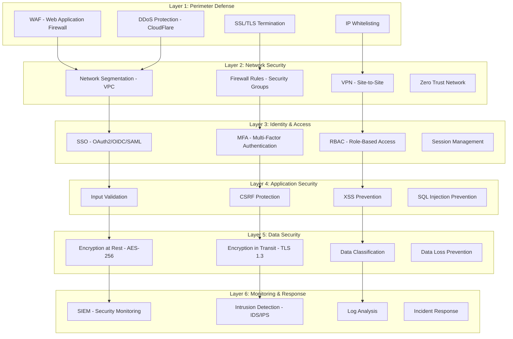
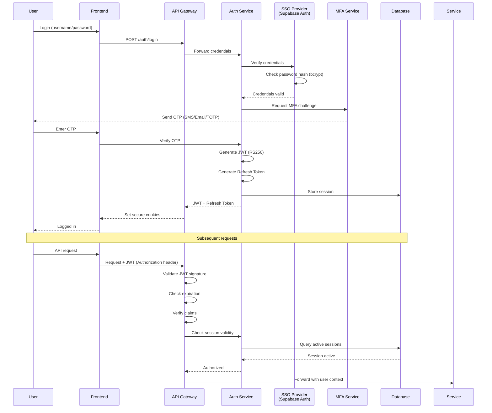
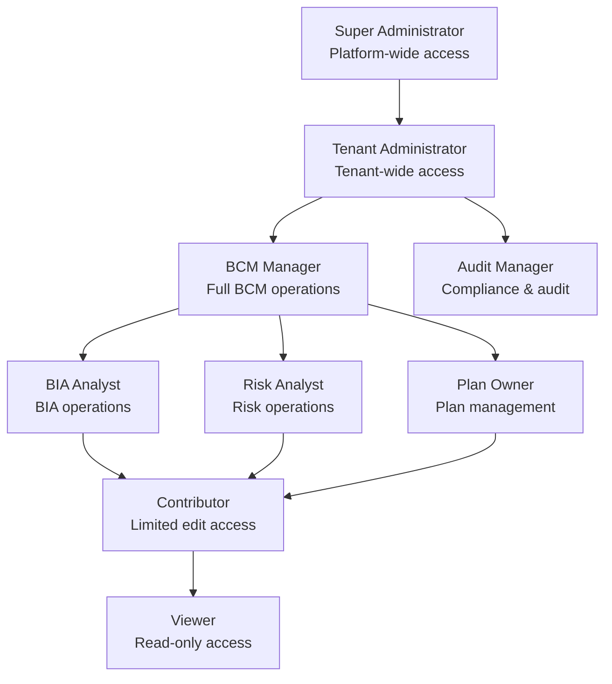
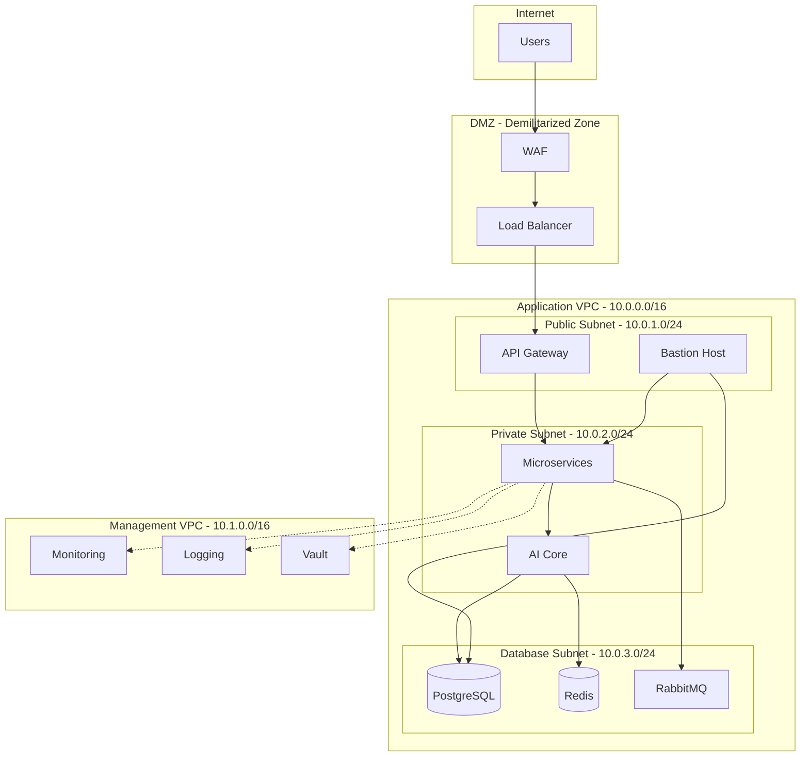
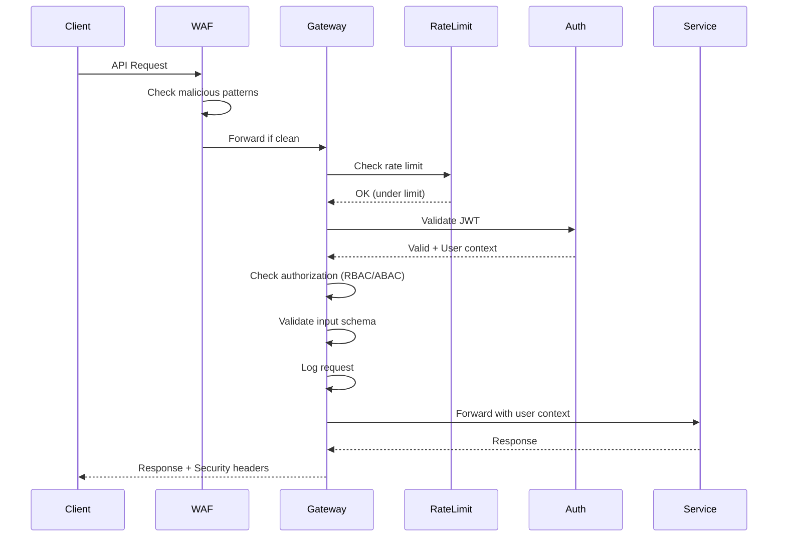
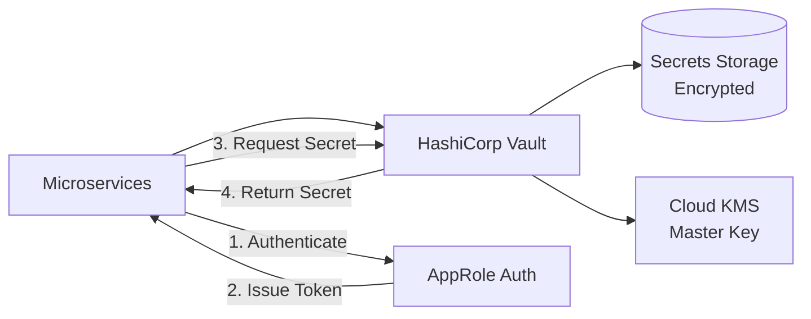
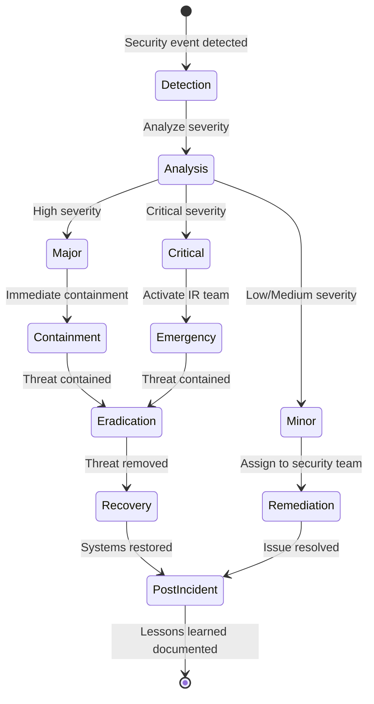

# BCM AI Platform - Security Specifications & Protocols

> **Comprehensive security architecture and implementation details**
> **Version:** 1.0.0
> **Compliance:** ISO 27001, NIST CSF, GDPR, SOC 2
> **Classification:** Internal Use Only
> **Last Updated:** 2025-10-07

---

## Table of Contents

1. [Security Architecture Overview](#security-architecture-overview)
2. [Authentication & Authorization](#authentication--authorization)
3. [Data Security](#data-security)
4. [Network Security](#network-security)
5. [Application Security](#application-security)
6. [Infrastructure Security](#infrastructure-security)
7. [API Security](#api-security)
8. [Secrets Management](#secrets-management)
9. [Audit & Compliance](#audit--compliance)
10. [Incident Response](#incident-response)
11. [Security Monitoring](#security-monitoring)
12. [Compliance Mappings](#compliance-mappings)

---

## Security Architecture Overview

### Defense in Depth Model



### Security Principles

| Principle | Implementation | Verification |
|-----------|---------------|--------------|
| **Least Privilege** | Default deny, explicit grants | Quarterly access reviews |
| **Defense in Depth** | Multiple security layers | Penetration testing |
| **Secure by Default** | Security-first configuration | Configuration audits |
| **Privacy by Design** | GDPR compliance embedded | Privacy impact assessments |
| **Zero Trust** | Verify every request | Continuous authentication |
| **Encryption Everywhere** | Data encrypted at rest & in transit | Encryption audits |
| **Auditability** | Comprehensive logging | Log retention & analysis |
| **Security Automation** | Automated vulnerability scanning | CI/CD security gates |

---

## Authentication & Authorization

### Authentication Architecture



### Authentication Mechanisms

#### 1. Password Authentication

**Specifications:**
- **Algorithm:** bcrypt with salt (cost factor: 12)
- **Password Requirements:**
  - Minimum length: 12 characters
  - Complexity: Uppercase, lowercase, numbers, special characters
  - History: Cannot reuse last 10 passwords
  - Expiration: 90 days for privileged accounts
- **Lockout Policy:**
  - 5 failed attempts → 15-minute lockout
  - 10 failed attempts → account suspended (manual unlock)
- **Storage:** Never stored in plaintext, only bcrypt hashes

**Implementation:**
```python
# Password hashing (server-side)
import bcrypt

def hash_password(password: str) -> str:
    """Hash password using bcrypt with cost factor 12"""
    salt = bcrypt.gensalt(rounds=12)
    hashed = bcrypt.hashpw(password.encode('utf-8'), salt)
    return hashed.decode('utf-8')

def verify_password(password: str, hashed: str) -> bool:
    """Verify password against stored hash"""
    return bcrypt.checkpw(
        password.encode('utf-8'),
        hashed.encode('utf-8')
    )
```

#### 2. Multi-Factor Authentication (MFA)

**Supported Methods:**
- **TOTP (Time-based One-Time Password)** - Recommended
  - Algorithm: RFC 6238
  - Time step: 30 seconds
  - Code length: 6 digits
  - Apps: Google Authenticator, Authy, Microsoft Authenticator
- **SMS OTP** - Fallback
  - 6-digit code
  - Valid for 5 minutes
  - Rate limited: Max 3 attempts
- **Email OTP** - Fallback
  - 6-digit code
  - Valid for 10 minutes
- **Hardware Tokens** - For admin accounts
  - FIDO2/WebAuthn support
  - YubiKey compatible

**MFA Enforcement:**
- ✅ **Mandatory** for:
  - All administrator accounts
  - Users with access to PII
  - External/remote access
- ✅ **Optional** for:
  - Standard users (encouraged)
- ✅ **Bypass** scenarios:
  - Trusted network (internal office network)
  - Service accounts (with alternative controls)

**Implementation:**
```python
# TOTP implementation
import pyotp
import qrcode

def generate_totp_secret() -> str:
    """Generate TOTP secret for user"""
    return pyotp.random_base32()

def generate_qr_code(secret: str, user_email: str) -> str:
    """Generate QR code for authenticator app setup"""
    totp = pyotp.TOTP(secret)
    uri = totp.provisioning_uri(
        name=user_email,
        issuer_name="BCM AI Platform"
    )
    qr = qrcode.make(uri)
    return qr  # Return as base64 image

def verify_totp(secret: str, code: str) -> bool:
    """Verify TOTP code"""
    totp = pyotp.TOTP(secret)
    return totp.verify(code, valid_window=1)  # Allow 30s clock drift
```

#### 3. Single Sign-On (SSO)

**Supported Protocols:**
- **OAuth 2.0** - Primary
  - Authorization Code Flow with PKCE
  - Implicit Flow disabled (security risk)
  - Client Credentials Flow (service-to-service)
- **OpenID Connect (OIDC)** - For identity
- **SAML 2.0** - Enterprise integration

**Supported Providers:**
- ✅ Microsoft Azure AD / Entra ID
- ✅ Google Workspace
- ✅ Okta
- ✅ Auth0
- ✅ Generic OIDC providers

**SSO Configuration Example:**
```yaml
# SSO Provider Configuration
sso:
  provider: "azure_ad"
  client_id: "${AZURE_CLIENT_ID}"
  client_secret: "${AZURE_CLIENT_SECRET}"  # Stored in Vault
  tenant_id: "${AZURE_TENANT_ID}"
  redirect_uri: "https://bcm.example.com/auth/callback"
  scopes:
    - "openid"
    - "profile"
    - "email"
    - "offline_access"
  claims_mapping:
    user_id: "sub"
    email: "email"
    name: "name"
    groups: "groups"
```

#### 4. JWT (JSON Web Tokens)

**Token Specifications:**
- **Algorithm:** RS256 (RSA Signature with SHA-256)
- **Access Token:**
  - Lifetime: 15 minutes
  - Claims: user_id, email, roles, tenant_id, exp, iat, jti
  - Signed with platform private key
- **Refresh Token:**
  - Lifetime: 7 days
  - Rotating refresh tokens (new token issued on use)
  - Stored in database (revocable)
  - Single-use only

**JWT Structure:**
```json
{
  "header": {
    "alg": "RS256",
    "typ": "JWT",
    "kid": "2025-01-key-1"
  },
  "payload": {
    "sub": "user_123456",
    "email": "user@example.com",
    "roles": ["bcm_manager", "tenant_admin"],
    "tenant_id": "tenant_abc",
    "permissions": [
      "bia:read",
      "bia:write",
      "risk:read"
    ],
    "iss": "https://bcm.example.com",
    "aud": "bcm-api",
    "exp": 1735689600,
    "iat": 1735688700,
    "jti": "jwt_unique_id_12345"
  },
  "signature": "..."
}
```

**Token Validation Process:**
1. Extract JWT from Authorization header
2. Verify signature using public key
3. Check expiration (exp claim)
4. Verify issuer (iss claim)
5. Verify audience (aud claim)
6. Check jti against revocation list
7. Extract user context for authorization

**Implementation:**
```python
# JWT generation and validation
import jwt
from datetime import datetime, timedelta
from cryptography.hazmat.primitives import serialization
from cryptography.hazmat.backends import default_backend

def generate_access_token(user_id: str, email: str, roles: list, tenant_id: str) -> str:
    """Generate JWT access token"""
    now = datetime.utcnow()
    payload = {
        "sub": user_id,
        "email": email,
        "roles": roles,
        "tenant_id": tenant_id,
        "iss": "https://bcm.example.com",
        "aud": "bcm-api",
        "exp": now + timedelta(minutes=15),
        "iat": now,
        "jti": generate_unique_id()
    }

    # Load private key from secure storage
    private_key = load_private_key()

    token = jwt.encode(
        payload,
        private_key,
        algorithm="RS256",
        headers={"kid": "2025-01-key-1"}
    )
    return token

def validate_access_token(token: str) -> dict:
    """Validate and decode JWT"""
    # Load public key
    public_key = load_public_key()

    try:
        payload = jwt.decode(
            token,
            public_key,
            algorithms=["RS256"],
            issuer="https://bcm.example.com",
            audience="bcm-api"
        )

        # Check revocation list
        if is_token_revoked(payload["jti"]):
            raise Exception("Token has been revoked")

        return payload
    except jwt.ExpiredSignatureError:
        raise Exception("Token has expired")
    except jwt.InvalidTokenError:
        raise Exception("Invalid token")
```

### Authorization (RBAC + ABAC)

#### Role-Based Access Control (RBAC)

**Role Hierarchy:**



**Role Definitions:**

| Role | Permissions | Use Case |
|------|------------|----------|
| **Super Administrator** | Full platform access, tenant management, system configuration | Platform operations team |
| **Tenant Administrator** | Full tenant access, user management, billing | Organization BCM lead |
| **BCM Manager** | Create/edit/delete BIA, risks, plans, exercises | BCM practitioners |
| **Audit Manager** | Read all data, manage audits, generate reports | Internal auditors, compliance |
| **BIA Analyst** | Create/edit BIA, view related risks/plans | BIA specialists |
| **Risk Analyst** | Create/edit risks, view related BIA/plans | Risk specialists |
| **Plan Owner** | Create/edit specific plans, conduct exercises | Department heads |
| **Contributor** | Edit assigned items, view related items | Team members |
| **Viewer** | Read-only access to permitted items | Stakeholders, auditors |

**Permission Matrix:**

| Resource | Super Admin | Tenant Admin | BCM Manager | Audit Manager | Analyst | Contributor | Viewer |
|----------|-------------|--------------|-------------|---------------|---------|-------------|--------|
| **Tenants** | CRUD | R | - | - | - | - | - |
| **Users** | CRUD | CRUD | R | R | R | R | R |
| **BIA** | CRUD | CRUD | CRUD | R | CRU (own) | RU (assigned) | R |
| **Risks** | CRUD | CRUD | CRUD | R | CRU (own) | RU (assigned) | R |
| **Plans** | CRUD | CRUD | CRUD | R | CRU (own) | RU (assigned) | R |
| **Exercises** | CRUD | CRUD | CRUD | R | CRU (own) | RU (assigned) | R |
| **Audits** | CRUD | R | R | CRUD | R | R | R |
| **Reports** | CRUD | CRUD | CR | CR | CR | R | R |
| **Settings** | CRUD | CRUD | R | R | - | - | - |

*Legend: C=Create, R=Read, U=Update, D=Delete*

#### Attribute-Based Access Control (ABAC)

**Access Decision Based on:**
1. **User attributes:** role, department, clearance level
2. **Resource attributes:** classification, owner, tenant
3. **Environment attributes:** time, location, IP address
4. **Action attributes:** read, write, delete, execute

**ABAC Policy Example:**
```json
{
  "policy_id": "bia_access_policy",
  "description": "BIA access control policy",
  "rules": [
    {
      "effect": "allow",
      "principal": {
        "roles": ["bcm_manager", "bia_analyst"]
      },
      "action": ["read", "create", "update"],
      "resource": {
        "type": "bia",
        "tenant_id": "${user.tenant_id}"
      },
      "conditions": {
        "ip_address": {
          "in_range": ["10.0.0.0/8", "172.16.0.0/12"]
        }
      }
    },
    {
      "effect": "allow",
      "principal": {
        "roles": ["contributor"]
      },
      "action": ["read", "update"],
      "resource": {
        "type": "bia",
        "tenant_id": "${user.tenant_id}",
        "owner_id": "${user.id}"
      }
    },
    {
      "effect": "deny",
      "principal": {
        "roles": ["*"]
      },
      "action": ["delete"],
      "resource": {
        "type": "bia",
        "classification": "critical"
      },
      "conditions": {
        "time": {
          "between": ["18:00", "08:00"]
        }
      }
    }
  ]
}
```

**Implementation:**
```python
# ABAC policy engine
from typing import Dict, Any

def evaluate_policy(
    user: Dict[str, Any],
    action: str,
    resource: Dict[str, Any],
    environment: Dict[str, Any]
) -> bool:
    """
    Evaluate ABAC policy

    Args:
        user: User attributes (roles, tenant_id, etc.)
        action: Action being performed (read, write, delete)
        resource: Resource attributes (type, classification, owner)
        environment: Environment attributes (ip, time, location)

    Returns:
        bool: True if access allowed, False otherwise
    """
    policy = load_policy(resource["type"])

    for rule in policy["rules"]:
        if matches_rule(user, action, resource, environment, rule):
            if rule["effect"] == "deny":
                return False
            elif rule["effect"] == "allow":
                return True

    # Default deny
    return False

def matches_rule(user, action, resource, environment, rule) -> bool:
    """Check if request matches policy rule"""
    # Check principal (user attributes)
    if not matches_principal(user, rule["principal"]):
        return False

    # Check action
    if action not in rule["action"]:
        return False

    # Check resource attributes
    if not matches_resource(resource, rule["resource"], user):
        return False

    # Check conditions (environment)
    if "conditions" in rule:
        if not matches_conditions(environment, rule["conditions"]):
            return False

    return True
```

### Row-Level Security (RLS)

**Database-Level Enforcement:**

All database tables have RLS policies enforcing tenant isolation and user permissions.

**PostgreSQL RLS Policies:**

```sql
-- Enable RLS on bia_analyses table
ALTER TABLE bia.bia_analyses ENABLE ROW LEVEL SECURITY;

-- Policy: Users can only see BIA from their tenant
CREATE POLICY tenant_isolation ON bia.bia_analyses
    FOR SELECT
    USING (
        tenant_id = current_setting('app.current_tenant')::uuid
    );

-- Policy: BCM Managers can insert/update BIA
CREATE POLICY bcm_manager_access ON bia.bia_analyses
    FOR ALL
    USING (
        tenant_id = current_setting('app.current_tenant')::uuid
        AND EXISTS (
            SELECT 1 FROM auth.user_roles
            WHERE user_id = auth.uid()
            AND role IN ('bcm_manager', 'tenant_admin', 'super_admin')
        )
    );

-- Policy: Contributors can only modify their own BIA
CREATE POLICY contributor_access ON bia.bia_analyses
    FOR UPDATE
    USING (
        tenant_id = current_setting('app.current_tenant')::uuid
        AND owner_id = auth.uid()
        AND EXISTS (
            SELECT 1 FROM auth.user_roles
            WHERE user_id = auth.uid()
            AND role = 'contributor'
        )
    );

-- Policy: Prevent deletion of critical BIA
CREATE POLICY prevent_critical_deletion ON bia.bia_analyses
    FOR DELETE
    USING (
        classification != 'critical'
        OR EXISTS (
            SELECT 1 FROM auth.user_roles
            WHERE user_id = auth.uid()
            AND role IN ('super_admin', 'tenant_admin')
        )
    );
```

**Session Context Setting:**
```python
# Set session context for RLS
def set_session_context(db_connection, user_id: str, tenant_id: str):
    """Set PostgreSQL session context for RLS enforcement"""
    db_connection.execute(
        "SET app.current_user = %s",
        [user_id]
    )
    db_connection.execute(
        "SET app.current_tenant = %s",
        [tenant_id]
    )
```

---

## Data Security

### Data Classification

**Classification Levels:**

| Level | Definition | Examples | Controls |
|-------|------------|----------|----------|
| **Public** | Can be freely shared | Marketing materials, public reports | Basic access control |
| **Internal** | For internal use only | Internal processes, non-sensitive plans | Authentication required |
| **Confidential** | Sensitive business data | BIA results, risk assessments, contracts | RBAC + encryption |
| **Restricted** | Highly sensitive | PII, financial data, authentication credentials | ABAC + encryption + audit |
| **Critical** | Mission-critical | Incident response plans, DR procedures | MFA + encryption + immutable audit |

**Data Classification Labels:**
```python
from enum import Enum

class DataClassification(Enum):
    PUBLIC = 1
    INTERNAL = 2
    CONFIDENTIAL = 3
    RESTRICTED = 4
    CRITICAL = 5

# Database schema
CREATE TYPE data_classification AS ENUM (
    'public',
    'internal',
    'confidential',
    'restricted',
    'critical'
);

ALTER TABLE bia.bia_analyses
ADD COLUMN classification data_classification DEFAULT 'confidential';
```

### Encryption at Rest

**Specifications:**
- **Algorithm:** AES-256-GCM (Galois/Counter Mode)
- **Key Management:** AWS KMS / HashiCorp Vault
- **Key Rotation:** Automatic every 90 days
- **Scope:** All data classified as Confidential or higher

**PostgreSQL Encryption:**
```sql
-- Enable transparent data encryption (TDE)
-- Managed by Supabase / Cloud Provider

-- Additional column-level encryption for PII
CREATE EXTENSION IF NOT EXISTS pgcrypto;

-- Encrypt sensitive columns
CREATE TABLE auth.users (
    id UUID PRIMARY KEY,
    email TEXT NOT NULL,
    -- Encrypted columns
    phone_number BYTEA,  -- Encrypted with pgcrypto
    ssn BYTEA,  -- Encrypted with pgcrypto
    created_at TIMESTAMPTZ DEFAULT NOW()
);

-- Encryption functions
CREATE OR REPLACE FUNCTION encrypt_sensitive_data(data TEXT, key TEXT)
RETURNS BYTEA AS $$
BEGIN
    RETURN pgp_sym_encrypt(data, key, 'cipher-algo=aes256');
END;
$$ LANGUAGE plpgsql SECURITY DEFINER;

CREATE OR REPLACE FUNCTION decrypt_sensitive_data(data BYTEA, key TEXT)
RETURNS TEXT AS $$
BEGIN
    RETURN pgp_sym_decrypt(data, key);
END;
$$ LANGUAGE plpgsql SECURITY DEFINER;
```

**Application-Level Encryption:**
```python
# Encryption service
from cryptography.hazmat.primitives.ciphers.aead import AESGCM
from cryptography.hazmat.backends import default_backend
import os

class EncryptionService:
    def __init__(self, key_management_service):
        self.kms = key_management_service

    def encrypt(self, plaintext: bytes, key_id: str) -> dict:
        """Encrypt data using AES-256-GCM"""
        # Get encryption key from KMS
        key = self.kms.get_data_key(key_id)

        # Generate nonce
        nonce = os.urandom(12)

        # Encrypt
        aesgcm = AESGCM(key)
        ciphertext = aesgcm.encrypt(nonce, plaintext, None)

        return {
            "ciphertext": ciphertext,
            "nonce": nonce,
            "key_id": key_id,
            "algorithm": "AES-256-GCM"
        }

    def decrypt(self, encrypted_data: dict) -> bytes:
        """Decrypt data"""
        # Get decryption key from KMS
        key = self.kms.get_data_key(encrypted_data["key_id"])

        # Decrypt
        aesgcm = AESGCM(key)
        plaintext = aesgcm.decrypt(
            encrypted_data["nonce"],
            encrypted_data["ciphertext"],
            None
        )

        return plaintext
```

### Encryption in Transit

**TLS Configuration:**
- **Protocol:** TLS 1.3 (minimum: TLS 1.2)
- **Cipher Suites (Recommended):**
  - TLS_AES_256_GCM_SHA384
  - TLS_CHACHA20_POLY1305_SHA256
  - TLS_AES_128_GCM_SHA256
- **Certificate:** Wildcard certificate for *.bcm.example.com
- **Certificate Authority:** Let's Encrypt / DigiCert
- **HSTS:** Enabled with 1-year max-age
- **Certificate Pinning:** Implemented for mobile apps

**Nginx TLS Configuration:**
```nginx
server {
    listen 443 ssl http2;
    server_name bcm.example.com;

    # TLS Configuration
    ssl_certificate /etc/ssl/certs/bcm.example.com.crt;
    ssl_certificate_key /etc/ssl/private/bcm.example.com.key;

    ssl_protocols TLSv1.3 TLSv1.2;
    ssl_ciphers 'TLS_AES_256_GCM_SHA384:TLS_CHACHA20_POLY1305_SHA256:TLS_AES_128_GCM_SHA256';
    ssl_prefer_server_ciphers on;

    # HSTS
    add_header Strict-Transport-Security "max-age=31536000; includeSubDomains; preload" always;

    # Other security headers
    add_header X-Frame-Options "DENY" always;
    add_header X-Content-Type-Options "nosniff" always;
    add_header X-XSS-Protection "1; mode=block" always;
    add_header Referrer-Policy "strict-origin-when-cross-origin" always;
    add_header Content-Security-Policy "default-src 'self'; script-src 'self' 'unsafe-inline'; style-src 'self' 'unsafe-inline';" always;

    # OCSP Stapling
    ssl_stapling on;
    ssl_stapling_verify on;
    ssl_trusted_certificate /etc/ssl/certs/ca-bundle.crt;

    location / {
        proxy_pass http://backend;
        proxy_set_header X-Real-IP $remote_addr;
        proxy_set_header X-Forwarded-For $proxy_add_x_forwarded_for;
        proxy_set_header X-Forwarded-Proto $scheme;
    }
}
```

**Inter-Service Communication:**
- **Service Mesh:** Istio with mTLS (mutual TLS)
- **Certificate Management:** Cert-manager with auto-rotation
- **Policy:** All internal service-to-service communication encrypted

### Data Loss Prevention (DLP)

**DLP Policies:**
1. **PII Detection:** Automatically detect and flag PII in user inputs
2. **Export Controls:** Restrict data exports for Restricted/Critical data
3. **Email Protection:** Scan outbound emails for sensitive data
4. **USB Blocking:** Block USB storage devices on workstations

**Implementation:**
```python
# PII Detection Service
import re

class DLPService:
    # Patterns for PII detection
    PATTERNS = {
        "ssn": r"\b\d{3}-\d{2}-\d{4}\b",
        "credit_card": r"\b\d{4}[- ]?\d{4}[- ]?\d{4}[- ]?\d{4}\b",
        "email": r"\b[A-Za-z0-9._%+-]+@[A-Za-z0-9.-]+\.[A-Z|a-z]{2,}\b",
        "phone": r"\b\d{3}[-.]?\d{3}[-.]?\d{4}\b",
        "ip_address": r"\b\d{1,3}\.\d{1,3}\.\d{1,3}\.\d{1,3}\b"
    }

    def scan_text(self, text: str) -> dict:
        """Scan text for PII"""
        findings = {}

        for pii_type, pattern in self.PATTERNS.items():
            matches = re.findall(pattern, text)
            if matches:
                findings[pii_type] = len(matches)

        return findings

    def redact_text(self, text: str) -> str:
        """Redact PII from text"""
        for pii_type, pattern in self.PATTERNS.items():
            text = re.sub(pattern, "[REDACTED]", text)

        return text
```

---

## Network Security

### Network Architecture



### Firewall Rules

**Security Group Configuration:**

```yaml
# API Gateway Security Group
api_gateway_sg:
  ingress:
    - protocol: TCP
      port: 443
      source: 0.0.0.0/0  # Public internet
      description: "HTTPS from internet"
    - protocol: TCP
      port: 80
      source: 0.0.0.0/0
      description: "HTTP redirect to HTTPS"
  egress:
    - protocol: TCP
      port: 8000-9000
      destination: microservices_sg
      description: "To microservices"

# Microservices Security Group
microservices_sg:
  ingress:
    - protocol: TCP
      port: 8000-9000
      source: api_gateway_sg
      description: "From API Gateway"
    - protocol: TCP
      port: 22
      source: bastion_sg
      description: "SSH from bastion"
  egress:
    - protocol: TCP
      port: 5432
      destination: database_sg
      description: "To PostgreSQL"
    - protocol: TCP
      port: 6379
      destination: database_sg
      description: "To Redis"
    - protocol: TCP
      port: 5672
      destination: database_sg
      description: "To RabbitMQ"
    - protocol: TCP
      port: 6333
      destination: database_sg
      description: "To Qdrant"

# Database Security Group
database_sg:
  ingress:
    - protocol: TCP
      port: 5432
      source: microservices_sg
      description: "PostgreSQL from services"
    - protocol: TCP
      port: 6379
      source: microservices_sg
      description: "Redis from services"
    - protocol: TCP
      port: 5672
      source: microservices_sg
      description: "RabbitMQ from services"
    - protocol: TCP
      port: 6333
      source: microservices_sg
      description: "Qdrant from services"
  egress:
    - protocol: TCP
      port: 443
      destination: 0.0.0.0/0
      description: "HTTPS for updates"
```

### Zero Trust Network Access (ZTNA)

**Principles:**
1. **Never trust, always verify** - Every request authenticated & authorized
2. **Least privilege access** - Minimal permissions granted
3. **Assume breach** - Segment network to limit blast radius
4. **Verify explicitly** - Use all available data points (identity, device, location)

**Implementation:**
- ✅ Service-to-service authentication via mTLS
- ✅ API Gateway validates every request
- ✅ Network micro-segmentation
- ✅ Device posture checking (for mobile/desktop apps)

---

## Application Security

### OWASP Top 10 Mitigation

| OWASP Risk | Mitigation | Implementation |
|------------|-----------|----------------|
| **A01: Broken Access Control** | RBAC + ABAC + RLS | Authorization middleware, database RLS policies |
| **A02: Cryptographic Failures** | TLS 1.3, AES-256 | All data encrypted in transit & at rest |
| **A03: Injection** | Parameterized queries, input validation | SQLAlchemy ORM, input sanitization |
| **A04: Insecure Design** | Threat modeling, security reviews | Architecture reviews, pen testing |
| **A05: Security Misconfiguration** | Secure defaults, automated scanning | Infrastructure as Code, config audits |
| **A06: Vulnerable Components** | Dependency scanning, updates | Dependabot, Snyk, regular patching |
| **A07: Auth Failures** | MFA, session management | JWT with short expiry, MFA enforcement |
| **A08: Data Integrity Failures** | Code signing, integrity checks | Digital signatures, checksums |
| **A09: Logging Failures** | Comprehensive logging, SIEM | Structured logging, centralized collection |
| **A10: SSRF** | Input validation, network policies | URL whitelisting, egress filtering |

### Input Validation

**Validation Framework:**
```python
from pydantic import BaseModel, validator, EmailStr, constr
from typing import Optional
import re

class BIACreateRequest(BaseModel):
    """BIA creation request with validation"""

    process_name: constr(min_length=3, max_length=200)
    description: constr(max_length=5000)
    owner_email: EmailStr
    mtpd_hours: int
    rto_hours: int
    rpo_hours: int

    @validator('process_name')
    def validate_process_name(cls, v):
        """Prevent XSS in process name"""
        if re.search(r'[<>"\']', v):
            raise ValueError('Process name contains invalid characters')
        return v

    @validator('mtpd_hours', 'rto_hours', 'rpo_hours')
    def validate_positive(cls, v):
        """Ensure positive values"""
        if v <= 0:
            raise ValueError('Value must be positive')
        return v

    @validator('rto_hours')
    def validate_rto_vs_mtpd(cls, v, values):
        """RTO must be less than MTPD"""
        if 'mtpd_hours' in values and v >= values['mtpd_hours']:
            raise ValueError('RTO must be less than MTPD')
        return v

# Usage
@router.post("/bia")
async def create_bia(request: BIACreateRequest):
    # Request automatically validated
    ...
```

### CSRF Protection

**Implementation:**
```python
from fastapi import Depends, HTTPException, Header
from secrets import token_urlsafe

# Generate CSRF token
def generate_csrf_token(session_id: str) -> str:
    """Generate CSRF token for session"""
    token = token_urlsafe(32)
    # Store in Redis with session_id as key
    redis_client.set(f"csrf:{session_id}", token, ex=3600)
    return token

# Validate CSRF token
async def validate_csrf_token(
    csrf_token: str = Header(..., alias="X-CSRF-Token"),
    session_id: str = Depends(get_session_id)
):
    """Validate CSRF token for state-changing operations"""
    stored_token = redis_client.get(f"csrf:{session_id}")

    if not stored_token or stored_token != csrf_token:
        raise HTTPException(status_code=403, detail="Invalid CSRF token")

# Protected endpoint
@router.post("/bia", dependencies=[Depends(validate_csrf_token)])
async def create_bia(request: BIACreateRequest):
    ...
```

### XSS Prevention

**Content Security Policy (CSP):**
```http
Content-Security-Policy: default-src 'self';
    script-src 'self' 'nonce-{random}';
    style-src 'self' 'unsafe-inline';
    img-src 'self' data: https:;
    font-src 'self';
    connect-src 'self' https://api.bcm.example.com;
    frame-ancestors 'none';
    base-uri 'self';
    form-action 'self';
```

**Output Encoding:**
```python
from markupsafe import escape

def safe_render(user_input: str) -> str:
    """Safely render user input by escaping HTML"""
    return escape(user_input)

# Usage
html = f"<div>{safe_render(user_provided_text)}</div>"
```

### SQL Injection Prevention

**Always use parameterized queries (SQLAlchemy ORM):**
```python
from sqlalchemy.orm import Session
from models import BIAAnalysis

# SAFE - Parameterized query via ORM
def get_bia_by_name(db: Session, process_name: str):
    return db.query(BIAAnalysis).filter(
        BIAAnalysis.process_name == process_name
    ).first()

# UNSAFE - Never concatenate SQL strings
# DON'T DO THIS:
# query = f"SELECT * FROM bia WHERE process_name = '{process_name}'"
```

---

## Infrastructure Security

### Container Security

**Docker Image Scanning:**
```yaml
# .github/workflows/security-scan.yml
name: Security Scan
on: [push, pull_request]

jobs:
  scan:
    runs-on: ubuntu-latest
    steps:
      - uses: actions/checkout@v2

      - name: Build Docker image
        run: docker build -t bcm-service:${{ github.sha }} .

      - name: Run Trivy vulnerability scanner
        uses: aquasecurity/trivy-action@master
        with:
          image-ref: bcm-service:${{ github.sha }}
          format: 'sarif'
          output: 'trivy-results.sarif'
          severity: 'CRITICAL,HIGH'

      - name: Upload results to GitHub Security
        uses: github/codeql-action/upload-sarif@v2
        with:
          sarif_file: 'trivy-results.sarif'

      - name: Fail on critical vulnerabilities
        run: |
          trivy image --severity CRITICAL --exit-code 1 bcm-service:${{ github.sha }}
```

**Secure Dockerfile:**
```dockerfile
# Use minimal base image
FROM python:3.11-slim AS base

# Create non-root user
RUN groupadd -r bcm && useradd -r -g bcm bcm

# Install dependencies
WORKDIR /app
COPY requirements.txt .
RUN pip install --no-cache-dir -r requirements.txt

# Copy application code
COPY --chown=bcm:bcm . .

# Switch to non-root user
USER bcm

# Health check
HEALTHCHECK --interval=30s --timeout=3s --start-period=5s --retries=3 \
    CMD python -c "import requests; requests.get('http://localhost:8000/health')"

# Run application
CMD ["uvicorn", "main:app", "--host", "0.0.0.0", "--port", "8000"]
```

### Kubernetes Security

**Pod Security Policy:**
```yaml
apiVersion: policy/v1beta1
kind: PodSecurityPolicy
metadata:
  name: bcm-restricted
spec:
  privileged: false
  allowPrivilegeEscalation: false
  requiredDropCapabilities:
    - ALL
  volumes:
    - 'configMap'
    - 'emptyDir'
    - 'projected'
    - 'secret'
    - 'downwardAPI'
    - 'persistentVolumeClaim'
  hostNetwork: false
  hostIPC: false
  hostPID: false
  runAsUser:
    rule: 'MustRunAsNonRoot'
  seLinux:
    rule: 'RunAsAny'
  fsGroup:
    rule: 'RunAsAny'
  readOnlyRootFilesystem: true
```

**Network Policies:**
```yaml
apiVersion: networking.k8s.io/v1
kind: NetworkPolicy
metadata:
  name: bia-service-policy
  namespace: platform-services
spec:
  podSelector:
    matchLabels:
      app: bia-service
  policyTypes:
    - Ingress
    - Egress
  ingress:
    - from:
        - podSelector:
            matchLabels:
              app: api-gateway
      ports:
        - protocol: TCP
          port: 8002
  egress:
    - to:
        - podSelector:
            matchLabels:
              app: postgresql
      ports:
        - protocol: TCP
          port: 5432
    - to:
        - podSelector:
            matchLabels:
              app: ai-foundation
      ports:
        - protocol: TCP
          port: 50051
```

---

## API Security

### API Gateway Security Controls



### Rate Limiting

**Rate Limit Tiers:**

| User Tier | Requests/Minute | Requests/Hour | Requests/Day |
|-----------|----------------|---------------|--------------|
| **Anonymous** | 10 | 100 | 1,000 |
| **Free** | 60 | 1,000 | 10,000 |
| **Professional** | 300 | 10,000 | 100,000 |
| **Enterprise** | 1,000 | 50,000 | Unlimited |

**Implementation (Redis-based):**
```python
from redis import Redis
from fastapi import HTTPException, Request
import time

redis = Redis(host='redis', port=6379)

async def rate_limit(request: Request, tier: str = "free"):
    """Rate limiting middleware"""
    user_id = request.state.user_id
    key = f"rate_limit:{tier}:{user_id}:{int(time.time() / 60)}"

    # Get current count
    current = redis.get(key)

    if current is None:
        redis.setex(key, 60, 1)
    else:
        count = int(current)
        limit = get_tier_limit(tier)

        if count >= limit:
            raise HTTPException(
                status_code=429,
                detail="Rate limit exceeded",
                headers={"Retry-After": "60"}
            )

        redis.incr(key)

def get_tier_limit(tier: str) -> int:
    """Get rate limit for tier"""
    limits = {
        "anonymous": 10,
        "free": 60,
        "professional": 300,
        "enterprise": 1000
    }
    return limits.get(tier, 10)
```

### API Versioning

**URL-based versioning:**
```
https://api.bcm.example.com/v1/bia
https://api.bcm.example.com/v2/bia
```

**Version Deprecation Policy:**
- New versions: Announced 90 days in advance
- Old versions: Supported for minimum 12 months after deprecation notice
- Breaking changes: Only in new major versions

---

## Secrets Management

### HashiCorp Vault Integration

**Architecture:**


**Secret Types:**
- Database credentials
- API keys (Anthropic, OpenAI, etc.)
- Encryption keys
- TLS certificates
- OAuth client secrets

**Vault Configuration:**
```hcl
# Enable AppRole authentication
path "auth/approle/*" {
  capabilities = ["create", "read", "update", "delete", "list"]
}

# Policy for BIA service
path "secret/data/bia-service/*" {
  capabilities = ["read"]
}

path "database/creds/bia-service" {
  capabilities = ["read"]
}
```

**Application Integration:**
```python
import hvac

class VaultClient:
    def __init__(self):
        self.client = hvac.Client(url='https://vault.bcm.internal')
        self.authenticate()

    def authenticate(self):
        """Authenticate using AppRole"""
        role_id = os.environ.get('VAULT_ROLE_ID')
        secret_id = os.environ.get('VAULT_SECRET_ID')

        response = self.client.auth.approle.login(
            role_id=role_id,
            secret_id=secret_id
        )

        self.client.token = response['auth']['client_token']

    def get_secret(self, path: str) -> dict:
        """Retrieve secret from Vault"""
        secret = self.client.secrets.kv.v2.read_secret_version(
            path=path
        )
        return secret['data']['data']

    def get_database_credentials(self) -> dict:
        """Get dynamic database credentials"""
        creds = self.client.read('database/creds/bia-service')
        return {
            'username': creds['data']['username'],
            'password': creds['data']['password']
        }

# Usage
vault = VaultClient()
anthropic_api_key = vault.get_secret('bia-service/anthropic')['api_key']
db_creds = vault.get_database_credentials()
```

### Secret Rotation

**Automated Rotation:**
- Database credentials: Every 30 days
- API keys: Every 90 days
- Encryption keys: Every 90 days
- TLS certificates: Every 90 days (Let's Encrypt auto-renewal)

**Rotation Process:**
```python
# Automated secret rotation
import schedule

def rotate_database_credentials():
    """Rotate database credentials"""
    vault = VaultClient()

    # Request new credentials
    new_creds = vault.get_database_credentials()

    # Update application configuration
    update_app_config(new_creds)

    # Revoke old credentials (after grace period)
    schedule.once().do(revoke_old_credentials).after(hours=1)

# Schedule rotation every 30 days
schedule.every(30).days.do(rotate_database_credentials)
```

---

## Audit & Compliance

### Audit Logging

**Audit Log Requirements:**
- **Who:** User ID, email, role
- **What:** Action performed (CRUD operation, API endpoint)
- **When:** Timestamp (UTC, ISO 8601)
- **Where:** Source IP, user agent, location
- **Result:** Success/failure, error details
- **Changes:** Before/after values (for updates)

**Audit Log Schema:**
```json
{
  "event_id": "audit_20250107_123456_abc123",
  "timestamp": "2025-01-07T14:30:00Z",
  "event_type": "bia.update",
  "user": {
    "user_id": "user_123456",
    "email": "analyst@example.com",
    "role": "bia_analyst",
    "tenant_id": "tenant_abc"
  },
  "source": {
    "ip_address": "203.0.113.42",
    "user_agent": "Mozilla/5.0 ...",
    "location": "San Francisco, CA, US"
  },
  "resource": {
    "type": "bia_analysis",
    "id": "bia_789",
    "classification": "confidential"
  },
  "action": {
    "operation": "UPDATE",
    "endpoint": "/api/v1/bia/789",
    "method": "PUT"
  },
  "result": {
    "status": "success",
    "status_code": 200
  },
  "changes": {
    "rto_hours": {
      "before": 24,
      "after": 12
    },
    "classification": {
      "before": "internal",
      "after": "confidential"
    }
  },
  "context": {
    "session_id": "session_xyz",
    "request_id": "req_abc123",
    "correlation_id": "corr_456"
  }
}
```

**Audit Log Implementation:**
```python
from datetime import datetime
import json

class AuditLogger:
    def __init__(self, log_service):
        self.log_service = log_service

    async def log_event(
        self,
        event_type: str,
        user: dict,
        resource: dict,
        action: dict,
        result: dict,
        source: dict,
        changes: dict = None
    ):
        """Log audit event"""
        event = {
            "event_id": generate_event_id(),
            "timestamp": datetime.utcnow().isoformat() + "Z",
            "event_type": event_type,
            "user": user,
            "source": source,
            "resource": resource,
            "action": action,
            "result": result,
            "changes": changes,
            "context": {
                "session_id": get_session_id(),
                "request_id": get_request_id(),
                "correlation_id": get_correlation_id()
            }
        }

        # Log to centralized audit log system
        await self.log_service.write_audit_log(event)

        # For critical events, also log to blockchain for immutability
        if resource.get("classification") in ["restricted", "critical"]:
            await self.log_to_blockchain(event)

# FastAPI middleware for automatic audit logging
@app.middleware("http")
async def audit_logging_middleware(request: Request, call_next):
    """Automatically log all API requests"""
    start_time = time.time()

    # Capture request details
    request_body = await request.body()

    # Process request
    response = await call_next(request)

    # Capture response details
    duration = time.time() - start_time

    # Log audit event
    await audit_logger.log_event(
        event_type=f"{request.url.path}.{request.method}",
        user=request.state.user,
        resource=extract_resource(request),
        action={
            "operation": request.method,
            "endpoint": request.url.path,
            "method": request.method
        },
        result={
            "status": "success" if response.status_code < 400 else "failure",
            "status_code": response.status_code,
            "duration_ms": duration * 1000
        },
        source={
            "ip_address": request.client.host,
            "user_agent": request.headers.get("user-agent"),
            "location": geolocate(request.client.host)
        }
    )

    return response
```

### Immutable Audit Trail (Blockchain)

**For critical operations (classified as Restricted/Critical):**
```python
from hashlib import sha256
import json

class BlockchainAuditLogger:
    def __init__(self, blockchain_client):
        self.blockchain = blockchain_client

    async def log_to_blockchain(self, audit_event: dict):
        """Log audit event to blockchain for immutability"""
        # Create event hash
        event_json = json.dumps(audit_event, sort_keys=True)
        event_hash = sha256(event_json.encode()).hexdigest()

        # Submit to blockchain (Partisia or similar)
        transaction = await self.blockchain.submit_transaction({
            "event_hash": event_hash,
            "event_type": audit_event["event_type"],
            "timestamp": audit_event["timestamp"],
            "user_id": audit_event["user"]["user_id"],
            "resource_id": audit_event["resource"]["id"]
        })

        # Store blockchain transaction ID with audit event
        audit_event["blockchain_tx_id"] = transaction["tx_id"]

        return transaction
```

### Compliance Monitoring

**Automated Compliance Checks:**
```python
class ComplianceMonitor:
    async def check_iso27001_controls(self):
        """Verify ISO 27001 controls"""
        results = []

        # A.9.2.1 - User registration and de-registration
        inactive_users = await self.find_inactive_users(days=90)
        results.append({
            "control": "A.9.2.1",
            "status": "pass" if len(inactive_users) == 0 else "fail",
            "finding": f"{len(inactive_users)} inactive users found"
        })

        # A.9.4.1 - Information access restriction
        overprivileged_users = await self.find_overprivileged_users()
        results.append({
            "control": "A.9.4.1",
            "status": "pass" if len(overprivileged_users) == 0 else "fail",
            "finding": f"{len(overprivileged_users)} users with excessive privileges"
        })

        # A.10.1.1 - Policy on the use of cryptographic controls
        weak_encryption = await self.find_weak_encryption()
        results.append({
            "control": "A.10.1.1",
            "status": "pass" if len(weak_encryption) == 0 else "fail",
            "finding": f"{len(weak_encryption)} instances of weak encryption"
        })

        return results

    async def check_gdpr_compliance(self):
        """Verify GDPR compliance"""
        results = []

        # Article 5(1)(e) - Storage limitation
        expired_data = await self.find_expired_personal_data()
        results.append({
            "article": "5(1)(e)",
            "status": "pass" if len(expired_data) == 0 else "fail",
            "finding": f"{len(expired_data)} records past retention period"
        })

        # Article 32 - Security of processing
        unencrypted_pii = await self.find_unencrypted_pii()
        results.append({
            "article": "32",
            "status": "pass" if len(unencrypted_pii) == 0 else "fail",
            "finding": f"{len(unencrypted_pii)} unencrypted PII records"
        })

        return results

# Schedule compliance checks
schedule.every().day.at("02:00").do(compliance_monitor.check_iso27001_controls)
schedule.every().week.do(compliance_monitor.check_gdpr_compliance)
```

---

## Incident Response

### Security Incident Response Plan



### Incident Classification

| Severity | Definition | Examples | Response Time | Escalation |
|----------|-----------|----------|---------------|-----------|
| **Critical** | Active attack, data breach, system compromise | Ransomware, data exfiltration, RCE | < 15 minutes | CISO, CEO |
| **High** | Potential data breach, major vulnerability | SQL injection attempt, privilege escalation | < 1 hour | Security Manager |
| **Medium** | Security policy violation, suspicious activity | Brute force attempt, malware detection | < 4 hours | Security Team |
| **Low** | Informational, minor policy violation | Failed login, suspicious email | < 24 hours | Tier 1 SOC |

### Incident Response Procedures

**Critical Incident Response:**
```python
class IncidentResponseOrchestrator:
    async def handle_critical_incident(self, incident: dict):
        """Orchestrate response to critical security incident"""

        # 1. Immediate Containment
        await self.containment_actions(incident)

        # 2. Notifications
        await self.notify_stakeholders(incident)

        # 3. Evidence Preservation
        await self.preserve_evidence(incident)

        # 4. Forensic Analysis
        await self.initiate_forensics(incident)

        # 5. Remediation
        await self.execute_remediation(incident)

        # 6. Recovery
        await self.restore_services(incident)

        # 7. Post-Incident Activities
        await self.post_incident_review(incident)

    async def containment_actions(self, incident: dict):
        """Immediate containment based on incident type"""
        incident_type = incident["type"]

        if incident_type == "ransomware":
            # Isolate affected systems
            await self.isolate_network_segment(incident["affected_hosts"])
            # Disable user accounts
            await self.disable_compromised_accounts(incident["users"])
            # Snapshot systems for forensics
            await self.create_forensic_snapshots(incident["affected_hosts"])

        elif incident_type == "data_breach":
            # Block data exfiltration
            await self.block_outbound_traffic(incident["source_ips"])
            # Revoke access tokens
            await self.revoke_all_tokens()
            # Enable enhanced monitoring
            await self.enable_enhanced_monitoring()

        elif incident_type == "privilege_escalation":
            # Revoke elevated privileges
            await self.revoke_admin_access(incident["users"])
            # Force password reset
            await self.force_password_reset(incident["users"])
            # Review recent actions
            await self.audit_recent_actions(incident["users"])

    async def notify_stakeholders(self, incident: dict):
        """Notify stakeholders based on severity"""
        severity = incident["severity"]

        notifications = []

        if severity == "critical":
            # Notify executive leadership
            notifications.append({
                "recipients": ["ciso@example.com", "ceo@example.com"],
                "template": "critical_incident_executive",
                "data": incident
            })

            # Notify security team
            notifications.append({
                "recipients": ["security-team@example.com"],
                "template": "critical_incident_team",
                "data": incident
            })

            # If data breach, notify legal/PR
            if incident["type"] == "data_breach":
                notifications.append({
                    "recipients": ["legal@example.com", "pr@example.com"],
                    "template": "data_breach_notification",
                    "data": incident
                })

        # Send all notifications
        for notification in notifications:
            await self.send_notification(notification)

    async def preserve_evidence(self, incident: dict):
        """Preserve evidence for forensics and legal"""
        evidence = {
            "incident_id": incident["id"],
            "timestamp": datetime.utcnow().isoformat(),
            "evidence_items": []
        }

        # Capture system logs
        logs = await self.capture_system_logs(
            incident["affected_hosts"],
            time_range=incident["timeframe"]
        )
        evidence["evidence_items"].append({
            "type": "system_logs",
            "data": logs,
            "hash": sha256(json.dumps(logs).encode()).hexdigest()
        })

        # Capture network traffic
        pcaps = await self.capture_network_traffic(
            incident["affected_hosts"],
            time_range=incident["timeframe"]
        )
        evidence["evidence_items"].append({
            "type": "network_capture",
            "data": pcaps,
            "hash": sha256(pcaps).hexdigest()
        })

        # Capture memory dumps
        memory_dumps = await self.capture_memory_dumps(
            incident["affected_hosts"]
        )
        evidence["evidence_items"].append({
            "type": "memory_dump",
            "data": memory_dumps,
            "hash": sha256(memory_dumps).hexdigest()
        })

        # Store evidence in tamper-proof storage
        await self.store_evidence_securely(evidence)

        # Log evidence collection to blockchain
        await self.log_evidence_to_blockchain(evidence)

        return evidence
```

### Breach Notification Procedures

**GDPR Breach Notification (Article 33):**
- **Timeline:** Within 72 hours of becoming aware
- **Recipients:** Supervisory authority (Data Protection Authority)
- **Content:**
  - Nature of personal data breach
  - Data Protection Officer contact details
  - Likely consequences
  - Measures taken/proposed

**Customer Notification (Article 34):**
- **When:** If breach likely to result in high risk to individuals
- **Timeline:** Without undue delay
- **Content:**
  - Description of data breach
  - Contact point for more information
  - Recommended actions for individuals

**Implementation:**
```python
class BreachNotificationService:
    async def assess_breach_notification_requirements(self, incident: dict):
        """Assess if breach notification is required"""

        # Check if personal data involved
        if not self.involves_personal_data(incident):
            return {"notification_required": False}

        # Assess risk level
        risk_level = await self.assess_risk_level(incident)

        requirements = {
            "notification_required": True,
            "dpa_notification": True,  # Always required for GDPR
            "customer_notification": risk_level in ["high", "critical"],
            "timeline": "72 hours" if risk_level != "critical" else "immediate",
            "affected_individuals": incident.get("affected_individuals_count", 0)
        }

        return requirements

    async def notify_dpa(self, incident: dict):
        """Notify Data Protection Authority"""
        notification = {
            "incident_id": incident["id"],
            "notification_timestamp": datetime.utcnow().isoformat(),
            "nature_of_breach": incident["description"],
            "categories_of_data": incident["data_categories"],
            "approximate_number_of_individuals": incident["affected_individuals_count"],
            "dpo_contact": {
                "name": "John Doe",
                "email": "dpo@example.com",
                "phone": "+1-555-0123"
            },
            "likely_consequences": incident["impact_assessment"],
            "measures_taken": incident["containment_actions"],
            "measures_proposed": incident["remediation_plan"]
        }

        # Submit to DPA portal
        await self.submit_to_dpa_portal(notification)

        # Log submission
        await audit_logger.log_event(
            event_type="breach.dpa_notification",
            user={"user_id": "system"},
            resource={"type": "incident", "id": incident["id"]},
            action={"operation": "NOTIFY_DPA"},
            result={"status": "success"}
        )
```

---

## Security Monitoring

### SIEM Integration

**Log Sources:**
- Application logs (all microservices)
- Infrastructure logs (Kubernetes, load balancers)
- Database logs (PostgreSQL, Redis)
- Authentication logs (Supabase Auth)
- Network logs (firewall, VPN)
- Cloud provider logs (AWS CloudTrail, GCP Audit Logs)

**SIEM Stack:**
- **Collection:** FluentD / Logstash
- **Storage:** Elasticsearch
- **Analysis:** Elasticsearch + Custom ML models
- **Visualization:** Kibana / Grafana
- **Alerting:** Prometheus Alertmanager

**Security Use Cases:**

| Use Case | Detection Logic | Alert Threshold |
|----------|----------------|-----------------|
| **Brute Force Attack** | > 10 failed logins in 5 minutes | High |
| **Privilege Escalation** | User role changed to admin | Critical |
| **Data Exfiltration** | > 1GB data downloaded in 10 minutes | Critical |
| **Anomalous Access** | Access from new country/IP | Medium |
| **After-Hours Access** | Admin access outside business hours | Medium |
| **Multiple Account Access** | Same user from > 3 IPs in 1 hour | High |
| **SQL Injection Attempt** | SQL keywords in input fields | High |
| **Malware Detection** | Malicious file hash detected | Critical |

**Alert Configuration:**
```yaml
# Prometheus Alert Rules
groups:
  - name: security_alerts
    interval: 1m
    rules:
      - alert: BruteForceAttack
        expr: rate(failed_login_attempts[5m]) > 10
        labels:
          severity: high
          category: authentication
        annotations:
          summary: "Brute force attack detected"
          description: "{{ $value }} failed login attempts in 5 minutes from IP {{ $labels.ip }}"

      - alert: PrivilegeEscalation
        expr: sum(role_changes{new_role="admin"}) > 0
        labels:
          severity: critical
          category: authorization
        annotations:
          summary: "Privilege escalation detected"
          description: "User {{ $labels.user }} escalated to admin role"

      - alert: DataExfiltration
        expr: rate(bytes_downloaded[10m]) > 1000000000  # 1GB
        labels:
          severity: critical
          category: data_loss
        annotations:
          summary: "Potential data exfiltration"
          description: "{{ $value }} bytes downloaded by {{ $labels.user }} in 10 minutes"
```

### Security Metrics Dashboard

**Key Metrics:**
- Authentication success/failure rate
- Authorization denials
- API error rates (4xx, 5xx)
- Suspicious activity score
- Vulnerability scan results
- Patch compliance rate
- Security incidents (by severity)
- Mean time to detect (MTTD)
- Mean time to respond (MTTR)

---

## Compliance Mappings

### ISO 27001 Control Mapping

| Control | Requirement | Implementation | Evidence |
|---------|-------------|----------------|----------|
| **A.9.1.1** | Access control policy | RBAC + ABAC documented | Security policy document |
| **A.9.2.1** | User registration | Automated provisioning via IDP | User lifecycle audit logs |
| **A.9.2.2** | User access provisioning | Role-based automatic provisioning | Access request logs |
| **A.9.2.3** | Privileged access management | MFA required for admin roles | MFA enforcement logs |
| **A.9.4.1** | Information access restriction | RLS + Application-level authorization | Access control audit |
| **A.10.1.1** | Cryptographic controls policy | TLS 1.3 + AES-256 standard | Encryption policy, scans |
| **A.10.1.2** | Key management | HashiCorp Vault with auto-rotation | Vault audit logs |
| **A.12.2.1** | Malware controls | Container scanning with Trivy | Scan reports |
| **A.12.4.1** | Event logging | Comprehensive audit logging | Audit logs, retention policy |
| **A.12.4.2** | Log protection | Immutable logs (blockchain) | Blockchain transaction IDs |
| **A.18.1.1** | Compliance requirements | Automated compliance scanning | Compliance scan reports |

### SOC 2 Trust Service Criteria Mapping

| Criteria | Requirement | Implementation | Validation |
|----------|-------------|----------------|-----------|
| **CC6.1** | Logical access controls | RBAC, MFA, session management | Access reviews, MFA usage |
| **CC6.2** | Transmission protection | TLS 1.3 for all communications | TLS config audit |
| **CC6.3** | Data protection at rest | AES-256 encryption | Encryption verification |
| **CC6.6** | Vulnerability management | Weekly scans, monthly patching | Scan reports, patch logs |
| **CC6.7** | Key management | Vault with automated rotation | Vault audit logs |
| **CC7.2** | Incident detection | SIEM with 24/7 monitoring | SIEM alerts, IR logs |
| **CC7.3** | Incident response | Documented IR plan, tested quarterly | IR plan, test results |
| **CC7.4** | Incident mitigation | Automated containment procedures | Incident response logs |

---

## Security Testing

### Security Testing Schedule

| Test Type | Frequency | Scope | Tool/Method |
|-----------|-----------|-------|-------------|
| **SAST** | Every commit | All code | SonarQube, Bandit |
| **DAST** | Weekly | Running application | OWASP ZAP |
| **Dependency Scanning** | Daily | All dependencies | Dependabot, Snyk |
| **Container Scanning** | Every build | Docker images | Trivy, Grype |
| **Penetration Testing** | Quarterly | Full platform | External firm |
| **Red Team Exercise** | Annually | Full platform | External firm |
| **Vulnerability Assessment** | Monthly | Infrastructure | Nessus, OpenVAS |
| **Compliance Audit** | Annually | Full platform | External auditor |

---

## References & Standards

- [ISO 27001:2022](https://www.iso.org/standard/82875.html) - Information Security Management
- [ISO 27017:2015](https://www.iso.org/standard/43757.html) - Cloud Security Controls
- [NIST Cybersecurity Framework](https://www.nist.gov/cyberframework)
- [OWASP Top 10](https://owasp.org/www-project-top-ten/)
- [OWASP API Security Top 10](https://owasp.org/www-project-api-security/)
- [CIS Controls v8](https://www.cisecurity.org/controls/v8)
- [GDPR](https://gdpr.eu/) - General Data Protection Regulation
- [SOC 2](https://www.aicpa.org/interestareas/frc/assuranceadvisoryservices/aicpasoc2report.html) - Trust Service Criteria

---

**Document Version:** 1.0.0
**Last Updated:** 2025-10-07
**Classification:** Internal Use Only
**Maintained By:** Security Team
**Review Cycle:** Quarterly
**Next Review:** 2025-04-07
