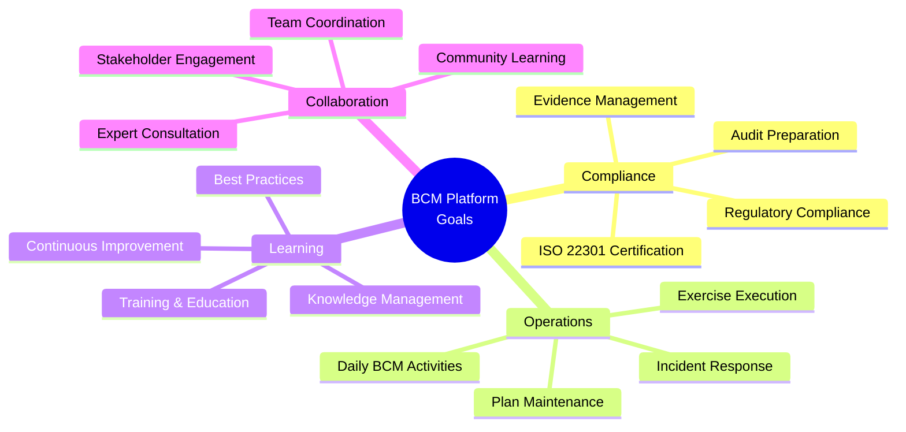
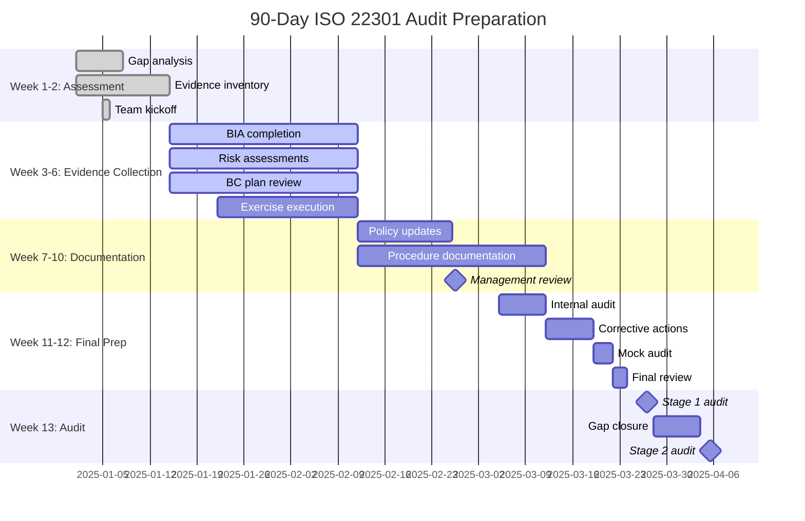
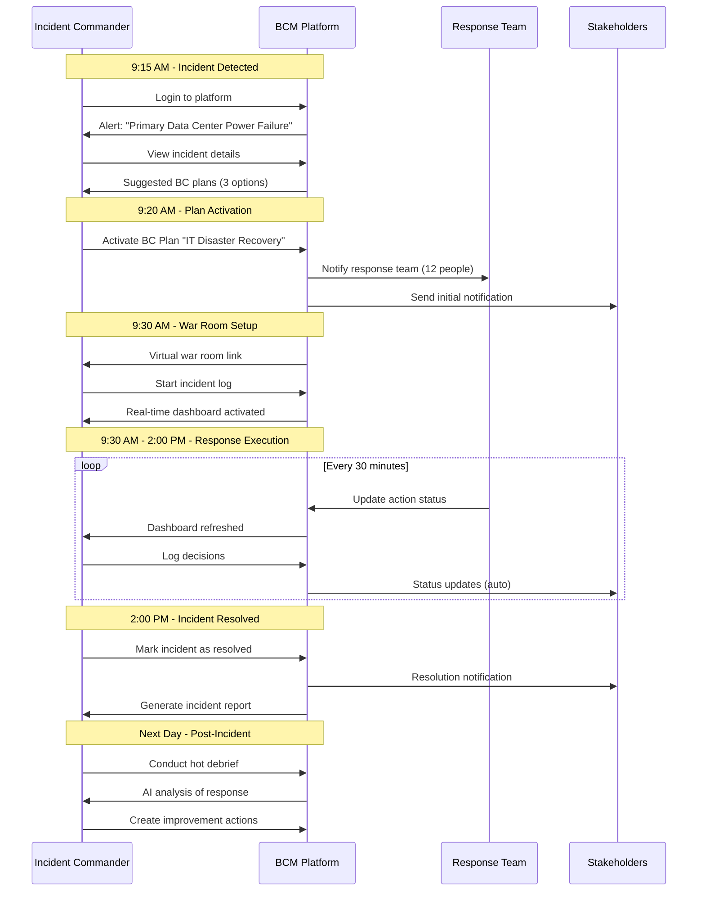
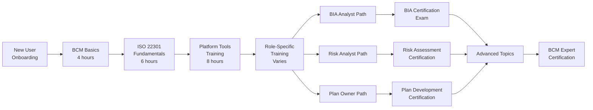
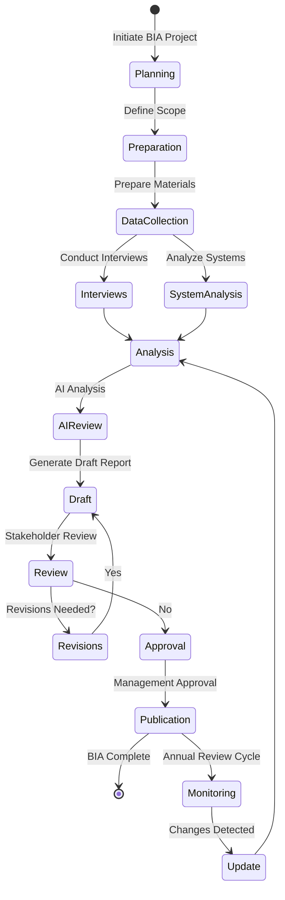
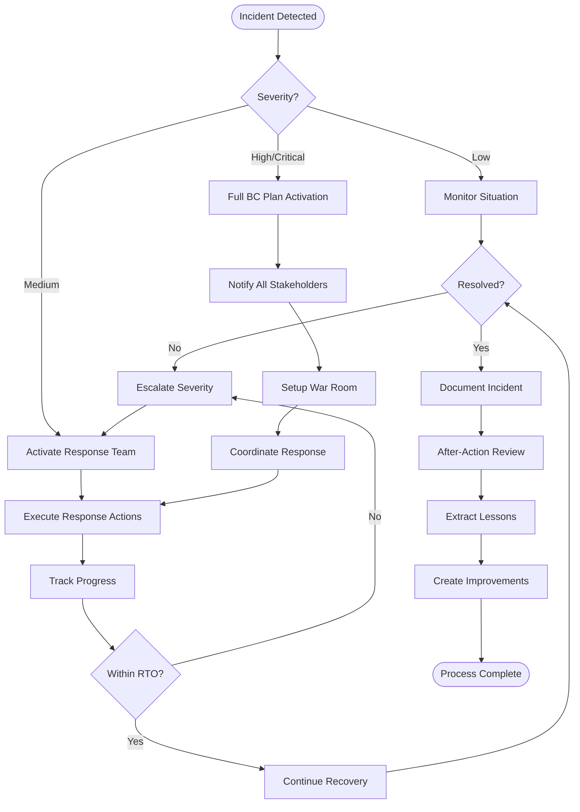

# BCM AI Platform - User Scenarios & Personal Dashboard

> **Comprehensive user scenarios and personal workspace design**
> **Version:** 1.0.0
> **Last Updated:** 2025-10-07

---

## Table of Contents

1. [Platform Goals Overview](#platform-goals-overview)
2. [Key User Scenarios](#key-user-scenarios)
3. [Personal Dashboard Design](#personal-dashboard-design)
4. [Workflow Processes](#workflow-processes)
5. [User Journey Maps](#user-journey-maps)
6. [Tools & Instruments](#tools--instruments)

---

## Platform Goals Overview

### Top-Level Platform Goals



### Goal Categories

| Goal Category | Description | Key Outcomes | Platform Modules |
|--------------|-------------|--------------|------------------|
| **Audit Preparation** | Prepare organization for ISO 22301 certification audit | 100% evidence collection, zero gaps | Governance, Compliance Scanner, Evidence Repository |
| **Ongoing Compliance** | Maintain continuous compliance with standards | Real-time compliance monitoring | Automated Compliance Checks, KPI Dashboard |
| **Incident Management** | Effectively respond to business disruptions | Fast activation, coordinated response | Incident Management, BC Plan Activation, Notifications |
| **Training & Awareness** | Educate staff on BCM responsibilities | 95%+ training completion | Learning System, Gamification, Assessments |
| **Continuous Improvement** | Enhance BCM program effectiveness | Systematic improvements from lessons learned | Improvement Tracker, Analytics, AI Recommendations |
| **Risk Management** | Identify and mitigate business continuity risks | Proactive risk treatment | Risk Assessment, AI Risk Intelligence, Treatment Planning |
| **Plan Management** | Create and maintain effective BC plans | Current, tested plans for all critical processes | Plan Generator, Plan Repository, Version Control |
| **Exercise Program** | Regularly test BC capabilities | All critical plans exercised annually | Exercise Planner, Scenario Library, AAR Generator |
| **Stakeholder Engagement** | Keep stakeholders informed and involved | High stakeholder confidence | Communication Hub, Stakeholder Portal, Dashboards |
| **Knowledge Management** | Capture and share BCM knowledge | Organizational BCM expertise documented | Knowledge Base, AI Document Generator, Lessons Learned |

---

## Key User Scenarios

### Scenario 1: Audit Preparation Journey

**User:** BCM Manager
**Goal:** Prepare organization for ISO 22301 certification audit in 90 days
**Platform Role:** Central audit preparation orchestrator

#### Timeline: 90-Day Audit Preparation



#### Daily Workflow

**Day 1: Platform Onboarding & Gap Analysis**

1. **Login to Personal Dashboard**
   - Welcome wizard appears for new audit preparation project
   - Platform performs automatic gap analysis
   - Generates 90-day project plan

2. **Review Gap Analysis Report**
   - Dashboard shows: 78% compliant, 22% gaps
   - Interactive clause-by-clause view (ISO 22301)
   - AI suggests priority actions

3. **Create Project Plan**
   - Platform auto-generates task list (150+ tasks)
   - Assigns tasks to team members
   - Sets up automated reminders

**Week 1-2: Evidence Collection Sprint**

*Morning Routine (30 minutes):*
1. Review overnight automated reports
2. Check task completion status
3. Review AI-flagged issues
4. Respond to team questions

*Core Activities:*
- **BIA Review:** Platform shows 45 processes need BIA update
  - Bulk assign to department managers
  - AI pre-populates 80% of data from systems
  - Managers review and approve

- **Risk Assessment:** Platform suggests 20 new risks based on industry trends
  - Review AI risk descriptions
  - Adjust likelihood/impact
  - Approve treatment plans

- **Evidence Collection:** Platform auto-collects 200+ evidence items
  - Review evidence completeness report
  - Flag items needing manual upload
  - Verify cross-references

**Week 6: Mid-Project Review**

*Dashboard View:*
- Progress: 65% complete
- Evidence: 180/292 collected (62%)
- At-risk items: 12 (flagged in red)
- Upcoming deadlines: 8 tasks this week

*Actions:*
1. Review at-risk items with AI recommendations
2. Reallocate resources to bottlenecks
3. Schedule management review meeting
4. Generate progress report for executives

**Week 12: Final Preparation**

*Checklist:*
- ✅ 292 evidence items collected
- ✅ Internal audit completed (2 minor findings, both closed)
- ✅ Mock audit passed
- ✅ Management review completed
- ✅ All team members trained
- ✅ Auditor access portal configured

*Audit Day Preparation:*
- Platform generates auditor welcome pack
- Evidence organized by ISO clause
- Cross-reference matrix auto-generated
- Presentation deck created from platform data

#### Personal Dashboard: Audit Preparation Mode

```
┌─────────────────────────────────────────────────────────────────┐
│ 🎯 ISO 22301 Audit Preparation - 12 days until Stage 1         │
├─────────────────────────────────────────────────────────────────┤
│                                                                 │
│ Progress Overview                                               │
│ ████████████████████████████░░░░ 92% Complete                  │
│                                                                 │
│ ┌─────────────────┐ ┌─────────────────┐ ┌─────────────────┐  │
│ │ Evidence        │ │ Tasks           │ │ Team            │  │
│ │ 292/292 ✅      │ │ 138/150 ✅      │ │ 12/12 Trained ✅│  │
│ │ 100% Complete   │ │ 92% Complete    │ │ 100% Ready      │  │
│ └─────────────────┘ └─────────────────┘ └─────────────────┘  │
│                                                                 │
│ 🚨 Action Items (12 remaining)                                 │
│ ─────────────────────────────────────────────────────────────  │
│ HIGH   Update BC Policy v3.0 signature         Due: Tomorrow   │
│ HIGH   Complete final management review        Due: 2 days     │
│ MED    Upload external audit report             Due: 5 days     │
│ MED    Verify auditor access credentials        Due: 7 days     │
│                                                                 │
│ 📊 Compliance Status by Clause                                 │
│ ─────────────────────────────────────────────────────────────  │
│ Clause 4: Context          ████████████████████ 100%           │
│ Clause 5: Leadership       ████████████████████ 100%           │
│ Clause 6: Planning         ███████████████████░  95%           │
│ Clause 7: Support          ████████████████████ 100%           │
│ Clause 8: Operation        ████████████████████ 100%           │
│ Clause 9: Performance      ████████████████████ 100%           │
│ Clause 10: Improvement     ████████████████░░░░  88%           │
│                                                                 │
│ 🤖 AI Insights                                                  │
│ ─────────────────────────────────────────────────────────────  │
│ • Clause 10.2 improvement actions: Consider adding 3 more      │
│   based on recent exercise findings                            │
│ • Evidence cross-referencing: 5 items could strengthen         │
│   multiple clauses - see recommendations                       │
│                                                                 │
│ [View Full Report] [Export Evidence Pack] [Schedule Meeting]   │
└─────────────────────────────────────────────────────────────────┘
```

---

### Scenario 2: Daily BCM Operations

**User:** BCM Manager
**Goal:** Maintain BCM program effectiveness through daily activities
**Platform Role:** Daily operations command center

#### Daily Workflow

**Morning Routine (15 minutes)**

```
┌─────────────────────────────────────────────────────────────────┐
│ 🌅 Good Morning, Alex! Tuesday, January 7, 2025                │
├─────────────────────────────────────────────────────────────────┤
│                                                                 │
│ 📌 Today's Priorities                                           │
│ ─────────────────────────────────────────────────────────────  │
│ 1. Review BIA for Finance dept (due today)                     │
│ 2. Approve updated BC plan for IT Operations                   │
│ 3. Prepare for quarterly exercise (tomorrow)                   │
│                                                                 │
│ 🔔 Notifications (3 new)                                        │
│ ─────────────────────────────────────────────────────────────  │
│ • Risk assessment completed by Sarah - needs your review       │
│ • BC plan "Customer Support" is due for annual review in 7 days│
│ • New compliance alert: ISO 22301:2024 draft published         │
│                                                                 │
│ 📊 Program Health                                               │
│ ─────────────────────────────────────────────────────────────  │
│ ┌──────────┐ ┌──────────┐ ┌──────────┐ ┌──────────┐          │
│ │ Plans    │ │ Exercises│ │ Training │ │ Incidents│          │
│ │ 48/50 ✅ │ │ 8/12 ✅  │ │ 96% ✅   │ │ 0 Active │          │
│ │ Current  │ │ On Track │ │ Complete │ │ 🎉       │          │
│ └──────────┘ └──────────┘ └──────────┘ └──────────┘          │
│                                                                 │
│ 🤖 AI Recommendations                                           │
│ ─────────────────────────────────────────────────────────────  │
│ • Consider scheduling exercise for "Payment Processing" -      │
│   not tested in 11 months                                      │
│ • 3 BC plans reference outdated system "Legacy CRM" -          │
│   suggest update following recent migration                    │
│                                                                 │
│ [Start Daily Tasks] [View Full Dashboard] [Check Inbox]        │
└─────────────────────────────────────────────────────────────────┘
```

**Weekly Review (Friday Afternoon)**

1. **Generate Weekly Report**
   - Platform auto-generates executive summary
   - Charts show week-over-week progress
   - Highlights: 12 tasks completed, 2 new risks identified, 1 exercise conducted

2. **Review KPIs**
   - All KPIs green except "Exercise Completion Rate" (yellow)
   - Drill down into yellow KPI to see details
   - Create action item to schedule 2 exercises next month

3. **Plan Next Week**
   - Review upcoming deadlines (8 items)
   - Allocate time for high-priority items
   - Schedule meetings as needed

---

### Scenario 3: Incident Response

**User:** Incident Commander
**Goal:** Coordinate effective response to business disruption
**Platform Role:** Incident command center

#### Incident Timeline



#### Incident Dashboard View

```
┌─────────────────────────────────────────────────────────────────┐
│ 🚨 ACTIVE INCIDENT: Primary Data Center Power Failure          │
│ Incident ID: INC-2025-0042 | Severity: CRITICAL | Status: Active│
├─────────────────────────────────────────────────────────────────┤
│                                                                 │
│ ⏱️ Timeline                                                     │
│ ─────────────────────────────────────────────────────────────  │
│ Detected:      9:15 AM  (14 minutes ago)                       │
│ Acknowledged:  9:16 AM  (13 minutes ago)                       │
│ Plan Activated: 9:20 AM  (9 minutes ago)                       │
│ Target RTO:    4 hours  (Est. resolution: 1:20 PM)             │
│                                                                 │
│ 👥 Response Team (12 members)                                   │
│ ─────────────────────────────────────────────────────────────  │
│ ✅ Incident Commander: Alex Chen (You)                         │
│ ✅ IT Manager: Sarah Johnson - Active                          │
│ ✅ DR Coordinator: Mike Williams - Active                      │
│ ⏳ Comms Lead: Lisa Davis - Preparing customer update          │
│ ... 8 more team members                                        │
│                                                                 │
│ 📋 Active Recovery Actions (18 total)                          │
│ ─────────────────────────────────────────────────────────────  │
│ ✅ Assess situation severity (Completed 9:16 AM)               │
│ ✅ Activate DR failover procedures (Completed 9:25 AM)         │
│ 🔄 Validate data integrity post-failover (In Progress)         │
│    Assigned to: Mike Williams | ETA: 10:00 AM                  │
│ ⏳ Resume customer-facing services (Pending)                    │
│    Assigned to: Sarah Johnson | ETA: 11:30 AM                  │
│                                                                 │
│ 💬 Stakeholder Communications (Auto-sending)                    │
│ ─────────────────────────────────────────────────────────────  │
│ ✅ Executive team notified (9:17 AM)                           │
│ ✅ Customer status page updated (9:22 AM)                      │
│ ⏳ Next customer update scheduled (10:00 AM)                   │
│                                                                 │
│ 📊 Impact Assessment                                            │
│ ─────────────────────────────────────────────────────────────  │
│ Affected Processes: 12 critical processes                      │
│ Estimated Financial Impact: $150k/hour                         │
│ Customers Impacted: ~1,200 unable to access services           │
│                                                                 │
│ 🤖 AI Recommendations                                           │
│ ─────────────────────────────────────────────────────────────  │
│ • Based on similar incidents, consider activating backup       │
│   communication channels (SMS alerts to VIP customers)         │
│ • Estimated recovery time: 3.5 hours (within RTO)              │
│                                                                 │
│ [Update Status] [Add Log Entry] [Send Communication]           │
│ [View Full Plan] [Conference Call] [Generate Report]           │
└─────────────────────────────────────────────────────────────────┘
```

---

### Scenario 4: Training & Certification

**User:** New BCM Team Member
**Goal:** Complete BCM training and certification
**Platform Role:** Learning management system

#### Learning Path



#### Learning Dashboard

```
┌─────────────────────────────────────────────────────────────────┐
│ 📚 My Learning Path - BCM Analyst Certification                │
├─────────────────────────────────────────────────────────────────┤
│                                                                 │
│ 🎯 Progress: 68% Complete                                       │
│ ████████████████████░░░░░░░░░░ 68%                             │
│                                                                 │
│ ✅ Completed Courses (4)                                        │
│ ─────────────────────────────────────────────────────────────  │
│ ✅ BCM Fundamentals (4h) - Score: 95%                          │
│ ✅ ISO 22301 Overview (6h) - Score: 88%                        │
│ ✅ Platform Basics (2h) - Score: 100%                          │
│ ✅ BIA Methodology (8h) - Score: 92%                           │
│                                                                 │
│ 🔄 Current Course                                               │
│ ─────────────────────────────────────────────────────────────  │
│ Risk Assessment Techniques                                      │
│ Progress: ████████░░░░░░░░░░░░ 40% (Module 4 of 10)           │
│ Time Spent: 4.5 hours | Est. Remaining: 6.5 hours              │
│ Next: Module 5 - Qualitative Risk Analysis                     │
│                                                                 │
│ [Continue Learning] [View Certificate]                         │
│                                                                 │
│ ⏳ Upcoming Courses (2)                                         │
│ ─────────────────────────────────────────────────────────────  │
│ • BC Strategy Development (6h) - Unlocks in 3 days             │
│ • Advanced Platform Features (4h) - Unlocks in 2 weeks         │
│                                                                 │
│ 🏆 Achievements                                                 │
│ ─────────────────────────────────────────────────────────────  │
│ 🥇 Quick Learner - Completed 4 courses in 2 weeks              │
│ 🌟 High Achiever - Average score above 90%                     │
│ 📖 Knowledge Seeker - 20 hours of learning                     │
│                                                                 │
│ 🎓 Certification Progress                                       │
│ ─────────────────────────────────────────────────────────────  │
│ Requirements for BCM Analyst Certification:                    │
│ ✅ Complete 8 core courses (6/8 done)                          │
│ ✅ Pass practice exams (3/3 passed)                            │
│ ⏳ Final certification exam (unlocks after course completion)  │
│                                                                 │
│ 🤖 AI Learning Coach Recommendations                            │
│ ─────────────────────────────────────────────────────────────  │
│ • You're excelling in BIA topics - consider BIA Specialist     │
│   certification path                                           │
│ • Your learning pace: 2 hours/day avg - on track to complete   │
│   certification in 3 weeks                                     │
│                                                                 │
│ [Continue Course] [Take Practice Exam] [View Learning Plan]    │
└─────────────────────────────────────────────────────────────────┘
```

---

### Scenario 5: Exercise Planning & Execution

**User:** Exercise Coordinator
**Goal:** Plan and execute quarterly BC exercise
**Platform Role:** Exercise management system

#### Exercise Workflow

**Phase 1: Planning (2 weeks before)**

1. **Select Exercise Type**
   - Platform suggests: Tabletop exercise for "Cyber Incident Response"
   - Based on: Last tested 10 months ago, high priority

2. **AI Scenario Generation**
   - Input: Target process, exercise type, participant roles
   - Output: Realistic ransomware scenario with 15 injects

3. **Schedule & Invite**
   - Platform checks team calendars
   - Suggests optimal time slot
   - Sends invitations with briefing materials

**Phase 2: Execution (Exercise Day)**

*Exercise Dashboard (Real-time):*
```
┌─────────────────────────────────────────────────────────────────┐
│ 🎯 LIVE EXERCISE: Cyber Incident Response Tabletop             │
│ Exercise ID: EX-2025-Q1-001 | Type: Tabletop | Status: Active  │
├─────────────────────────────────────────────────────────────────┤
│                                                                 │
│ ⏱️ Timeline: 10:00 AM - 1:30 PM (1 hour 15 minutes elapsed)   │
│ ████████████░░░░░░░░░░░░░░░░░░ 36% Complete                   │
│                                                                 │
│ 👥 Participants (8 present, 0 absent)                          │
│ ─────────────────────────────────────────────────────────────  │
│ ✅ All participants checked in                                 │
│                                                                 │
│ 📋 Scenario Progress                                            │
│ ─────────────────────────────────────────────────────────────  │
│ ✅ INJECT 1 (10:00): Ransomware detected on file server       │
│    Response: Team activated IR plan (2 min delay - GOOD)      │
│                                                                 │
│ ✅ INJECT 2 (10:30): Encryption spreading to backup systems   │
│    Response: Isolation procedures initiated (5 min delay - OK) │
│                                                                 │
│ 🔄 INJECT 3 (11:15): Ransom demand received ($500k Bitcoin)   │
│    Response: In progress...                                    │
│    Expected Actions:                                           │
│    - Notify executive leadership ⏳ (pending)                  │
│    - Contact law enforcement ⏳ (pending)                      │
│    - Assess data backup viability ✅ (completed)               │
│                                                                 │
│ ⏳ INJECT 4 (11:45): Media inquiry received (scheduled)        │
│                                                                 │
│ 📝 Observations (7 recorded)                                    │
│ ─────────────────────────────────────────────────────────────  │
│ ✅ STRENGTH: Quick detection and initial response              │
│ ✅ STRENGTH: Good communication within IT team                 │
│ ⚠️  WEAKNESS: Delayed executive notification (18 min)          │
│ ⚠️  WEAKNESS: Uncertainty about backup restore process         │
│ ❌ GAP: No procedure for media inquiries during cyber incident │
│ ❌ GAP: Contact list for law enforcement incomplete            │
│ 💡 OPPORTUNITY: Consider automated backup validation           │
│                                                                 │
│ 🤖 AI Observer Notes                                            │
│ ─────────────────────────────────────────────────────────────  │
│ • Team is performing well on technical response but showing    │
│   gaps in crisis communication                                 │
│ • Recommend adding communication protocol to BC plan           │
│                                                                 │
│ [Send Next Inject] [Add Observation] [Pause Exercise]          │
│ [View Full Plan] [End Exercise]                                │
└─────────────────────────────────────────────────────────────────┘
```

**Phase 3: After-Action Review (Same day)**

- Platform auto-generates draft AAR from observations
- AI summarizes strengths, weaknesses, gaps
- Creates improvement action items with priorities
- Schedules follow-up meeting

---

## Personal Dashboard Design

### Role-Based Dashboard Variants

#### 1. Executive Dashboard

**Focus:** High-level program health, strategic decisions

```
┌─────────────────────────────────────────────────────────────────┐
│ 👔 Executive BCM Dashboard                    January 7, 2025   │
├─────────────────────────────────────────────────────────────────┤
│                                                                 │
│ 📊 Program Health Score: 94/100 ✅ EXCELLENT                   │
│ ████████████████████████████████████░░░░ 94%                   │
│                                                                 │
│ Key Metrics (This Quarter)                                      │
│ ┌─────────────────┐ ┌─────────────────┐ ┌─────────────────┐  │
│ │ RTO Achievement │ │ Incidents       │ │ Compliance      │  │
│ │ 98% ✅          │ │ 2 (Both Resolved│ │ 100% ✅         │  │
│ │ Target: 95%     │ │ ✅)             │ │ ISO 22301 Ready │  │
│ └─────────────────┘ └─────────────────┘ └─────────────────┘  │
│                                                                 │
│ Strategic Initiatives                                           │
│ • ISO 22301 Certification: On track for Q2 2025 ✅             │
│ • AI Transformation: 75% complete                               │
│ • Supply Chain Resilience: 60% complete                        │
│                                                                 │
│ Recent Incidents & Response                                     │
│ • INC-2025-0041: Data center cooling failure                   │
│   Resolution: 3.2 hours (within RTO) ✅                         │
│ • INC-2025-0042: Power outage                                  │
│   Resolution: 4.1 hours (within RTO) ✅                         │
│                                                                 │
│ Investment Required                                             │
│ • Q2 Budget Request: $125k for backup infrastructure upgrade   │
│   ROI: Reduce RTO by 40%, prevent $2M potential losses         │
│                                                                 │
│ [View Full Report] [Schedule Review] [Download PDF]            │
└─────────────────────────────────────────────────────────────────┘
```

#### 2. BCM Manager Dashboard

**Focus:** Program operations, team coordination, compliance

```
┌─────────────────────────────────────────────────────────────────┐
│ 🎯 BCM Manager Dashboard                      January 7, 2025   │
├─────────────────────────────────────────────────────────────────┤
│                                                                 │
│ Today's Priorities (3)                                          │
│ 🔴 HIGH: Complete management review prep (Due: Tomorrow)        │
│ 🟡 MED:  Review 2 BC plan updates (Due: Friday)                │
│ 🟢 LOW:  Schedule Q2 exercise calendar (Due: Next week)        │
│                                                                 │
│ Team Workload                                                   │
│ Sarah (BIA): ████████████░░░░ 60% | 8 tasks, 2 overdue ⚠️      │
│ Mike (Risk): ████████████████░ 80% | 12 tasks, all on track ✅ │
│ Lisa (Plans): ███████████░░░░░ 55% | 6 tasks, 1 due today      │
│                                                                 │
│ Program Metrics                                                 │
│ ┌──────────┐ ┌──────────┐ ┌──────────┐ ┌──────────┐          │
│ │ BIA      │ │ Plans    │ │ Exercises│ │ Training │          │
│ │ 45/50 ✅ │ │ 48/50 ✅ │ │ 8/12 🟡  │ │ 96% ✅   │          │
│ └──────────┘ └──────────┘ └──────────┘ └──────────┘          │
│                                                                 │
│ Upcoming Deadlines (7 days)                                     │
│ • 3 BC plans due for annual review                             │
│ • 1 exercise scheduled (Cyber Incident Tabletop)               │
│ • Management review meeting (Thursday)                         │
│                                                                 │
│ AI Insights & Recommendations                                   │
│ • Risk trend: Cyber threats increasing - consider additional   │
│   exercises focused on ransomware response                     │
│ • Efficiency opportunity: 12 similar BC plans could be         │
│   templated to save 15 hours/month                             │
│                                                                 │
│ Quick Actions                                                   │
│ [Create BIA] [New Risk] [Schedule Exercise] [Generate Report]  │
└─────────────────────────────────────────────────────────────────┘
```

#### 3. BIA Analyst Dashboard

**Focus:** BIA execution, analysis, recommendations

```
┌─────────────────────────────────────────────────────────────────┐
│ 📊 BIA Analyst Dashboard                      January 7, 2025   │
├─────────────────────────────────────────────────────────────────┤
│                                                                 │
│ My BIA Projects (5 active)                                      │
│ ┌─────────────────────────────────────────────────────────────┐│
│ │ 🔄 Finance Department BIA                                   ││
│ │    Progress: ████████████████░░░░ 80%                      ││
│ │    12/15 processes analyzed | Due: Friday                   ││
│ │    [Continue] [AI Analysis] [Preview Report]                ││
│ └─────────────────────────────────────────────────────────────┘│
│                                                                 │
│ │ 🆕 HR Department BIA                                        ││
│ │    Progress: ████░░░░░░░░░░░░░░░░ 20%                      ││
│ │    3/8 processes analyzed | Due: Next week                  ││
│ │    [Continue] [View Template]                               ││
│ └─────────────────────────────────────────────────────────────┘│
│                                                                 │
│ Pending Approvals (2)                                           │
│ • "Customer Support BIA" - Awaiting BCM Manager approval       │
│ • "IT Operations BIA" - Awaiting Department Head review        │
│                                                                 │
│ AI-Powered Insights                                             │
│ • Finance process "Payroll" similar to "HR Payroll" -          │
│   consider using shared RTO/RPO (save 2 hours analysis)        │
│ • Suggested MTPD for "Account Reconciliation": 48 hours        │
│   (based on 25 similar processes)                              │
│                                                                 │
│ Knowledge Library (Quick Access)                                │
│ • BIA Methodology Guide                                        │
│ • Interview Question Templates                                 │
│ • Impact Analysis Calculator                                   │
│ • Industry Benchmarks Database                                 │
│                                                                 │
│ [New BIA] [View All] [Reports] [Help]                          │
└─────────────────────────────────────────────────────────────────┘
```

---

## Workflow Processes

### Process 1: BIA Lifecycle



### Process 2: Incident Response Workflow



---

## User Journey Maps

### Journey: From New User to Certified BCM Professional

```mermaid
journey
    title BCM Professional Certification Journey (12 weeks)
    section Week 1: Onboarding
        Account setup: 5: New User
        Platform tour: 4: New User
        First training module: 3: New User
    section Week 2-4: Foundation
        BCM fundamentals course: 4: Learner
        ISO 22301 overview: 4: Learner
        Practice exercises: 5: Learner
    section Week 5-8: Specialization
        BIA methodology training: 5: Analyst
        Real BIA project (mentored): 4: Analyst
        Risk assessment course: 4: Analyst
    section Week 9-10: Advanced
        Advanced topics: 4: Professional
        Capstone project: 3: Professional
    section Week 11: Certification
        Practice exams: 4: Candidate
        Final certification exam: 3: Candidate
    section Week 12: Certified
        Receive certification: 5: BCM Professional
        First solo project: 5: BCM Professional
```

---

## Tools & Instruments

### Personal Dashboard Tools

| Tool Category | Instruments | Purpose |
|--------------|-------------|---------|
| **Task Management** | To-do lists, Kanban boards, Calendar integration | Organize daily work |
| **Data Entry** | Forms, Wizards, Bulk import, AI pre-fill | Efficient data capture |
| **Analysis** | AI analysis, Charts, Heat maps, Dashboards | Understand data |
| **Collaboration** | Comments, Mentions, Shared workspaces, Notifications | Team coordination |
| **Reporting** | Report builder, Templates, Auto-generation, PDF export | Communication |
| **Learning** | Courses, Videos, Quizzes, Certifications | Skill development |
| **Monitoring** | Real-time dashboards, Alerts, KPI tracking | Program oversight |
| **Documentation** | Rich text editor, Templates, Version control | Knowledge capture |

### Navigation Structure

```
Personal Dashboard
├── Home (Overview)
├── My Work
│   ├── Tasks
│   ├── Projects
│   ├── Calendar
│   └── Notifications
├── BIA
│   ├── My BIA Projects
│   ├── Create New BIA
│   ├── Review Queue
│   └── Reports
├── Risk
│   ├── Risk Register
│   ├── Assessments
│   ├── Treatment Plans
│   └── Heat Map
├── Plans
│   ├── My Plans
│   ├── Plan Generator
│   ├── Plan Library
│   └── Version History
├── Exercises
│   ├── Schedule
│   ├── Scenarios
│   ├── Execute
│   └── After-Action Reviews
├── Incidents
│   ├── Active Incidents
│   ├── Incident History
│   ├── Response Playbooks
│   └── Analytics
├── Learning
│   ├── My Courses
│   ├── Certifications
│   ├── Learning Paths
│   └── Knowledge Base
├── Analytics
│   ├── Dashboards
│   ├── Reports
│   ├── KPIs
│   └── Trends
└── Settings
    ├── Profile
    ├── Preferences
    ├── Notifications
    └── Integrations
```

---

**Document Version:** 1.0.0
**Last Updated:** 2025-10-07
**Maintained By:** Product Team
**Review Cycle:** Quarterly
