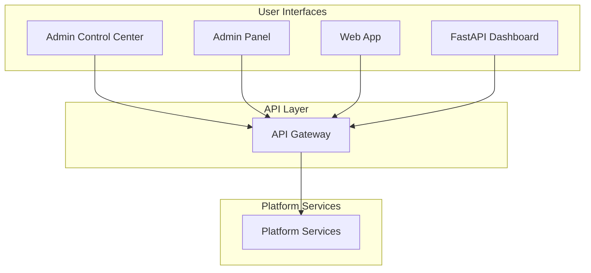

# Interface Layer

**Type**: User Interface Layer
**Domain**: Frontend Applications
**Status**: In Development
**Version**: 1.0.0-beta

## Overview

The Interface layer provides user-facing applications for the AI-Platform-ISO system. It implements web-based interfaces for system administration, business continuity management operations, and user workflows. All interfaces are built with modern web technologies and integrate with platform services via RESTful APIs.

## Applications

### Administrative Interfaces

| Application | Description | Technology | Status |
|-------------|-------------|------------|--------|
| [admin-control-center](./admin-control-center/README.md) | Main administrative control center | React + Vite | 🚧 In Development |
| [admin_panel](./admin_panel/README.md) | Administrative panel | React | 🚧 In Development |
| [fastapi-dashboard](./fastapi-dashboard/README.md) | FastAPI-based dashboard | React + FastAPI | 🚧 In Development |

### User Applications

| Application | Description | Technology | Status |
|-------------|-------------|------------|--------|
| [web-app](./web-app/README.md) | Main web application | React | 🚧 In Development |

### Infrastructure

| Component | Description | Status |
|-----------|-------------|--------|
| [api-gateway](./api-gateway/README.md) | Frontend API gateway | 🚧 In Development |

## Technology Stack

### Frontend

- **Framework**: React 18+
- **Build Tool**: Vite
- **Language**: TypeScript
- **State Management**: React Query, Zustand
- **UI Components**: Tailwind CSS, shadcn/ui
- **Routing**: React Router v6

### Backend Integration

- **API Client**: Axios
- **Authentication**: JWT tokens
- **Real-time**: WebSockets
- **Event Bus**: Server-Sent Events (SSE)

## Architecture



## Development Status

⚠️ **Note**: All interface applications are currently in active development.

### Completed Features
- ✅ Basic project structure
- ✅ Development environment setup
- ✅ API integration patterns
- ✅ Authentication flow

### In Progress
- 🚧 Core UI components
- 🚧 Business continuity workflows
- 🚧 Admin dashboards
- 🚧 Real-time monitoring

### Planned
- 📋 User management interface
- 📋 BIA workflow interface
- 📋 Risk management interface
- 📋 Compliance dashboard
- 📋 Reporting interface

## Development Setup

### Prerequisites

- Node.js 18+
- npm 9+ or yarn 1.22+
- Access to platform services

### Quick Start

```bash
cd interface/<application-name>

# Install dependencies
npm install

# Configure environment
cp .env.example .env
# Edit .env with API endpoints

# Start development server
npm run dev
```

### Environment Variables

```env
# API Configuration
VITE_API_URL=http://localhost:8000
VITE_WS_URL=ws://localhost:8000

# Authentication
VITE_AUTH_ENABLED=true

# Feature Flags
VITE_ENABLE_ANALYTICS=true
```

## Development

### Running Applications

```bash
# Admin Control Center
cd interface/admin-control-center
npm run dev

# Admin Panel
cd interface/admin_panel
npm run dev

# Web App
cd interface/web-app
npm run dev

# FastAPI Dashboard
cd interface/fastapi-dashboard
npm run dev
```

### Building for Production

```bash
# Build application
npm run build

# Preview production build
npm run preview
```

## Testing

```bash
# Run unit tests
npm run test

# Run E2E tests
npm run test:e2e

# Run with coverage
npm run test:coverage
```

## API Integration

All interfaces integrate with platform services:

```typescript
import axios from 'axios';

const api = axios.create({
  baseURL: import.meta.env.VITE_API_URL,
  headers: {
    'Content-Type': 'application/json'
  }
});

// Authenticated request
api.interceptors.request.use((config) => {
  const token = localStorage.getItem('token');
  if (token) {
    config.headers.Authorization = `Bearer ${token}`;
  }
  return config;
});
```

## Standards Compliance

Interface development follows:

- **WCAG 2.1 Level AA** - Web accessibility
- **ISO 9241-210** - Human-centered design
- **Material Design** - UI/UX principles
- **React Best Practices** - Component patterns

## Related Components

- [Platform Services](../platform-services/README.md) - Backend services
- [Infrastructure](../infrastructure/README.md) - Platform infrastructure
- [Intelligent Core](../intelligent-core/README.md) - AI capabilities

## License

Proprietary - AI-Platform-ISO

---

**Last Updated**: 2025-10-08
**Maintainer**: Frontend Team
**Status**: 🚧 In Active Development
