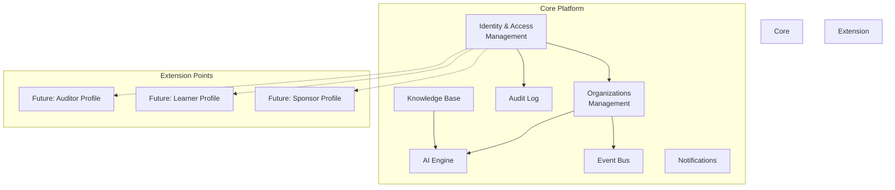

# Core Platform - Software Requirements Specification (SRS)

**Version:** 1.0
**Date:** 2025-10-09
**Status:** Draft

---

## 1. Introduction

### 1.1 Purpose
Данный документ описывает **Core Platform** - базовое ядро AI-платформы ISO 22301, которое обеспечивает:
- Identity & Access Management
- Organizations (Digital Twin foundation)
- AI Engine integration
- Event Bus (для коммуникации между модулями)
- Shared services (notifications, audit log, knowledge base)

Core Platform служит **фундаментом** для всех модулей и Digital Twins.

### 1.2 Scope
**В scope:**
- User management (registration, authentication, roles)
- Organization CRUD (базовая структура)
- AI Engine (Claude API integration)
- Event Bus (pub/sub система)
- Audit Log (все действия пользователей)
- Knowledge Base (ISO standards, best practices)

**Вне scope:**
- Конкретные модули (Gap Analysis, BIA, Risk) - отдельные SRS
- User-specific features (Learning Academy, Auditor Toolkit) - V2/V3/V4

### 1.3 Definitions

| Term | Definition |
|------|------------|
| Core Platform | Базовое ядро платформы с shared services |
| Digital Twin | Цифровая копия (Organization, Professional, Learner, Sponsor) |
| Extension Point | Место в архитектуре, где можно добавить новый функционал без рефакторинга |
| RLS | Row-Level Security (политики доступа на уровне строк БД) |
| Event Bus | Система обмена сообщениями между модулями |

### 1.4 User Roles (MVP)

**MVP поддерживает 1 роль:**
- **Specialist** - BCM специалист, владелец организации

**Extension points для V2+:**
- **Auditor** - консультант с портфелем клиентов
- **Learner** - учащийся без организации
- **Sponsor** - донор/инвестор

---

## 2. Core Platform Components



---

## 3. Functional Requirements - Identity & Access Management

### FR-IAM-001: User Registration
**Description:** Пользователь может зарегистрироваться на платформе.

**Inputs:**
- Email (string, valid email format)
- Password (string, min 8 chars, 1 uppercase, 1 number)
- Full name (string)
- Role (enum: 'specialist' в MVP, 'auditor'/'learner'/'sponsor' в V2+)

**Processing:**
1. Validate email format
2. Check email uniqueness
3. Hash password (bcrypt)
4. Create user in Supabase Auth
5. Create user profile in `users` table
6. Send email verification link

**Outputs:**
- User object (id, email, created_at)
- JWT token
- Redirect to onboarding

**Acceptance Criteria:**
```gherkin
GIVEN valid email and password
WHEN user submits registration form
THEN account is created in <2 seconds
  AND verification email is sent
  AND user is redirected to onboarding
```

**Priority:** P0 (Must Have)
**Extension Point:** В V2+ добавить регистрацию через OAuth (Google, Microsoft)

---

### FR-IAM-002: User Login
**Description:** Пользователь может войти в систему.

**Inputs:**
- Email
- Password

**Processing:**
1. Verify credentials via Supabase Auth
2. Generate JWT token
3. Load user profile
4. Determine role → redirect to appropriate dashboard

**Outputs:**
- JWT token (expires in 7 days)
- User profile
- Redirect to dashboard

**Acceptance Criteria:**
```gherkin
GIVEN valid credentials
WHEN user logs in
THEN JWT token is generated
  AND user is redirected to dashboard
  AND session persists for 7 days
```

**Priority:** P0

---

### FR-IAM-003: Role-Based Access Control (RBAC)
**Description:** Система проверяет permissions на основе роли пользователя.

**MVP Roles:**
- `specialist` - полный доступ к своей организации

**V2+ Extension Point:**
- `auditor` - доступ к портфелю клиентов
- `learner` - доступ к курсам и sandbox
- `sponsor` - доступ к портфелю грантов

**Processing:**
1. Extract role from JWT token
2. Check permission via RLS policies
3. Allow/deny access

**Acceptance Criteria:**
```gherkin
GIVEN user with role 'specialist'
WHEN user accesses /organizations/{other_org_id}
THEN request is denied (403 Forbidden)

GIVEN user with role 'specialist'
WHEN user accesses /organizations/{own_org_id}
THEN request is allowed
```

**Priority:** P0
**Extension Point:** Таблица `role_permissions` для гибкой настройки прав

---

### FR-IAM-004: Password Reset
**Description:** Пользователь может сбросить пароль.

**Inputs:**
- Email

**Processing:**
1. Check if email exists
2. Generate reset token (expires in 1 hour)
3. Send reset email
4. User clicks link → enters new password

**Outputs:**
- Reset email sent
- Password updated

**Priority:** P1 (Should Have)

---

### FR-IAM-005: User Profile Management
**Description:** Пользователь может обновить свой профиль.

**Inputs:**
- Full name
- Phone (optional)
- Job title (optional)
- Avatar (optional)

**Processing:**
1. Validate inputs
2. Update `users` table
3. Return updated profile

**Priority:** P2 (Nice to Have)

---

## 4. Functional Requirements - Organizations Management

### FR-ORG-001: Create Organization
**Description:** Specialist создаёт свою организацию (Digital Twin foundation).

**Inputs:**
- Organization name (string, required)
- Industry (enum: Healthcare, Finance, Manufacturing, Government, Other)
- Size (integer: number of employees)
- Country (string)
- Description (text, optional)

**Processing:**
1. Validate user role = 'specialist'
2. Check: user can own only 1 organization (MVP constraint)
3. Create record in `organizations` table
4. Create entry in `organization_members` (user = owner)
5. Publish event: `OrganizationCreated`
6. AI suggests initial structure based on industry

**Outputs:**
- Organization object (id, name, created_at)
- Initial structure suggestions from AI

**Acceptance Criteria:**
```gherkin
GIVEN user is specialist without organization
WHEN user creates organization
THEN organization is created
  AND user becomes owner
  AND OrganizationCreated event is published
  AND AI suggests industry-specific structure
```

**Priority:** P0
**Extension Point:** В V2 auditor может создать организацию для клиента (1:N)

---

### FR-ORG-002: Get Organization Details
**Description:** Получить детали организации (Digital Twin).

**Inputs:**
- Organization ID (UUID)

**Processing:**
1. Check user has access (owner or auditor client)
2. Load organization + structure + stats

**Outputs:**
```json
{
  "id": "uuid",
  "name": "City Hospital",
  "industry": "Healthcare",
  "size": 450,
  "created_at": "2025-01-15T10:00:00Z",
  "structure": {
    "departments_count": 12,
    "processes_count": 47,
    "assets_count": 156
  },
  "bcm_maturity": {
    "overall_score": 45,
    "gap_analysis_status": "completed",
    "bia_status": "in_progress",
    "risk_assessment_status": "not_started"
  },
  "compliance": {
    "iso_22301_coverage": 65
  }
}
```

**Priority:** P0

---

### FR-ORG-003: Update Organization
**Description:** Обновить информацию об организации.

**Inputs:**
- Organization ID
- Fields to update (name, industry, size, description)

**Processing:**
1. Validate access (only owner)
2. Update fields
3. Publish event: `OrganizationUpdated`

**Priority:** P1

---

### FR-ORG-004: Organization Structure - Departments
**Description:** Управление отделами организации.

**Endpoints:**
- `GET /organizations/{org_id}/departments` - список отделов
- `POST /organizations/{org_id}/departments` - создать отдел
- `PATCH /organizations/{org_id}/departments/{dept_id}` - обновить отдел

**Processing:**
1. CRUD операции с таблицей `organization_departments`
2. Каждое изменение логируется в `audit_log`

**Priority:** P1
**Extension Point:** В модуле BIA отделы привязываются к процессам

---

### FR-ORG-005: Organization Structure - Processes
**Description:** Управление бизнес-процессами организации.

**Endpoints:**
- `GET /organizations/{org_id}/processes` - список процессов
- `POST /organizations/{org_id}/processes` - создать процесс
- `PATCH /organizations/{org_id}/processes/{proc_id}` - обновить процесс

**Processing:**
1. CRUD операции с таблицей `organization_processes`
2. AI предлагает типичные процессы для индустрии

**Acceptance Criteria:**
```gherkin
GIVEN organization in Healthcare industry
WHEN user requests process suggestions
THEN AI returns ["Patient Admission", "Emergency Care", "Surgery", "Billing"]
  AND user can add processes with 1 click
```

**Priority:** P0 (нужно для BIA модуля)
**Extension Point:** Модуль BIA обогащает процессы (RTO, RPO, criticality)

---

### FR-ORG-006: Organization Structure - Assets
**Description:** Управление активами организации.

**Types:**
- IT systems
- Facilities
- Key suppliers
- Personnel

**Endpoints:**
- `GET /organizations/{org_id}/assets`
- `POST /organizations/{org_id}/assets`

**Priority:** P2 (Nice to Have в MVP)
**Extension Point:** Модуль Risk Assessment привязывает риски к активам

---

## 5. Functional Requirements - AI Engine

### FR-AI-001: AI Prompt Execution
**Description:** Централизованный сервис для вызова Claude API.

**Inputs:**
- Prompt template name (string)
- Variables (JSON object)
- Model (default: "claude-3-5-sonnet-20241022")
- Max tokens (default: 4096)

**Processing:**
1. Load prompt template from `ai_prompts` table
2. Substitute variables into template
3. Call Anthropic API
4. Log request/response to `ai_logs`
5. Return response

**Outputs:**
- AI response (text or JSON)
- Tokens used
- Execution time

**Example:**
```javascript
// Prompt template: "generate_processes_for_industry"
const response = await aiEngine.execute({
  template: "generate_processes_for_industry",
  variables: {
    industry: "Healthcare",
    size: 450
  }
});

// AI returns:
// [
//   {"name": "Patient Admission", "criticality": "critical"},
//   {"name": "Emergency Care", "criticality": "critical"},
//   ...
// ]
```

**Acceptance Criteria:**
```gherkin
GIVEN valid prompt template and variables
WHEN AI engine executes prompt
THEN Claude API is called
  AND response is returned in <5 seconds
  AND request is logged to ai_logs
```

**Priority:** P0

---

### FR-AI-002: Prompt Templates Management
**Description:** Управление шаблонами промптов для AI.

**Storage:**
Таблица `ai_prompts`:
```sql
CREATE TABLE ai_prompts (
  id UUID PRIMARY KEY,
  name VARCHAR(255) UNIQUE,
  template TEXT,
  variables JSONB, -- {industry: "string", size: "number"}
  category VARCHAR(100),
  version INTEGER,
  created_at TIMESTAMP
);
```

**MVP Prompts:**
- `generate_processes_for_industry` - предложить процессы
- `analyze_gap_analysis_answers` - проанализировать Gap Analysis
- `calculate_bia_rto` - рассчитать RTO для процесса
- `generate_risk_recommendations` - рекомендации по рискам

**Priority:** P0
**Extension Point:** В V2+ добавить prompt marketplace (пользователи делятся промптами)

---

### FR-AI-003: AI Context Management
**Description:** AI запоминает контекст организации для персонализации.

**Context includes:**
- Industry
- Size
- Country
- Completed assessments
- Historical decisions

**Processing:**
1. Load organization context
2. Inject into system prompt
3. AI даёт персонализированные ответы

**Example:**
```
System Prompt:
You are a BCM assistant for a Healthcare organization with 450 employees.
The organization has completed Gap Analysis (score: 45/100).
They are now working on BIA.
Provide recommendations specific to healthcare industry.
```

**Priority:** P1

---

## 6. Functional Requirements - Event Bus

### FR-EVENT-001: Event Publishing
**Description:** Модули публикуют события в Event Bus.

**Event Structure:**
```json
{
  "event_id": "uuid",
  "event_type": "OrganizationCreated",
  "source": "organizations-service",
  "timestamp": "2025-10-09T14:00:00Z",
  "data": {
    "organization_id": "uuid",
    "created_by": "user_id"
  }
}
```

**MVP Events:**
- `OrganizationCreated`
- `OrganizationUpdated`
- `GapAnalysisCompleted`
- `BIACompleted`
- `RiskAssessmentCompleted`

**Processing:**
1. Validate event schema
2. Store in `events` table
3. Notify subscribers

**Priority:** P1
**Extension Point:** В V2+ добавить external webhooks (уведомлять внешние системы)

---

### FR-EVENT-002: Event Subscription
**Description:** Модули подписываются на события.

**Example:**
```javascript
// Module: BIA subscribes to OrganizationCreated
eventBus.subscribe('OrganizationCreated', async (event) => {
  const orgId = event.data.organization_id;
  // Auto-create initial BIA structure
  await createInitialBIA(orgId);
});
```

**Priority:** P1

---

## 7. Functional Requirements - Audit Log

### FR-AUDIT-001: Log All Actions
**Description:** Все действия пользователей логируются.

**Logged Actions:**
- User registration/login
- Organization CRUD
- Module actions (Gap Analysis, BIA, Risk)
- Settings changes

**Log Structure:**
```json
{
  "id": "uuid",
  "timestamp": "2025-10-09T14:00:00Z",
  "user_id": "uuid",
  "organization_id": "uuid",
  "action": "organization.created",
  "resource_type": "organization",
  "resource_id": "uuid",
  "ip_address": "192.168.1.1",
  "user_agent": "Mozilla/5.0...",
  "changes": {
    "before": null,
    "after": {"name": "City Hospital"}
  }
}
```

**Priority:** P1 (required for compliance)

---

### FR-AUDIT-002: Audit Log Query
**Description:** Пользователь может просматривать audit log.

**Filters:**
- Date range
- User
- Action type
- Resource type

**Priority:** P2 (admin feature)

---

## 8. Functional Requirements - Knowledge Base

### FR-KB-001: ISO Standards Library
**Description:** База знаний с ISO 22301 и другими стандартами.

**Content:**
- ISO 22301:2019 clauses
- NIST SP 800-34 guidelines
- WHO BCM for healthcare
- BSI standards

**Storage:**
```sql
CREATE TABLE kb_standards (
  id UUID PRIMARY KEY,
  standard_name VARCHAR(100), -- 'ISO 22301'
  clause VARCHAR(50), -- '8.2.3'
  title TEXT,
  description TEXT,
  requirements JSONB,
  guidance TEXT
);
```

**Priority:** P1 (нужно для Gap Analysis и Compliance)

---

### FR-KB-002: Best Practices & Case Studies
**Description:** База кейсов из реальных внедрений.

**Content:**
- Industry-specific cases
- Success stories
- Common pitfalls
- Templates

**Priority:** P2
**Extension Point:** В V3 (Learning) кейсы используются как учебный материал

---

### FR-KB-003: AI Training Data
**Description:** Knowledge Base используется для обучения/контекста AI.

**Processing:**
1. AI запрос упоминает "ISO 22301 clause 8.2"
2. Load relevant content from KB
3. Inject into AI context
4. AI даёт ответ с ссылками на стандарт

**Priority:** P1

---

## 9. Functional Requirements - Notifications

### FR-NOTIF-001: In-App Notifications
**Description:** Пользователь получает уведомления в приложении.

**Types:**
- Info (синий)
- Success (зелёный)
- Warning (оранжевый)
- Error (красный)

**Examples:**
- "Gap Analysis completed" (success)
- "BIA analysis needs attention" (warning)
- "Your organization profile is incomplete" (info)

**Priority:** P1

---

### FR-NOTIF-002: Email Notifications
**Description:** Критические уведомления отправляются на email.

**Examples:**
- "Welcome to AI Platform ISO"
- "Your BIA report is ready"
- "Compliance audit scheduled for Dec 15"

**Priority:** P2
**Extension Point:** В V2+ добавить настройки уведомлений (частота, каналы)

---

## 10. Non-Functional Requirements

### NFR-CORE-001: Performance
- API response time: <500ms (p95)
- Database queries: <100ms
- AI requests: <5 seconds

### NFR-CORE-002: Scalability
- Support 10,000+ organizations
- Support 50,000+ users
- Handle 100 req/sec

### NFR-CORE-003: Security
- All passwords hashed (bcrypt, cost 12)
- JWT tokens expire in 7 days
- HTTPS only
- RLS policies on all tables
- Audit log immutable (no deletes)

### NFR-CORE-004: Availability
- Uptime: 99.9%
- Supabase handles backups (daily)
- RTO: 4 hours
- RPO: 24 hours

### NFR-CORE-005: Data Privacy
- GDPR compliant
- User can export data
- User can delete account (soft delete)
- PII encrypted at rest (Supabase)

---

## 11. Extension Points (для V2+)

### EP-001: Multi-Role Support
**Current (MVP):** User has 1 role (specialist)
**V2+:** User can have multiple roles (specialist + auditor)

**Database change:**
```sql
-- V2: Add role junction table
CREATE TABLE user_roles (
  user_id UUID REFERENCES users(id),
  role VARCHAR(50),
  PRIMARY KEY (user_id, role)
);
```

---

### EP-002: Auditor Portfolio
**Current:** Not supported
**V2:** Auditor can manage multiple client organizations

**Database change:**
```sql
-- V2: Add auditor clients
CREATE TABLE auditor_clients (
  auditor_id UUID,
  organization_id UUID,
  contract_type VARCHAR(50),
  status VARCHAR(50)
);
```

---

### EP-003: Learning Academy
**Current:** Not supported
**V3:** Learner can take courses without organization

**Database change:**
```sql
-- V3: Add learning tables
CREATE TABLE learner_profiles (...);
CREATE TABLE courses (...);
CREATE TABLE learning_progress (...);
```

---

### EP-004: Sponsor Impact Tracking
**Current:** Not supported
**V4:** Sponsor can track grants and impact

**Database change:**
```sql
-- V4: Add sponsor tables
CREATE TABLE sponsor_profiles (...);
CREATE TABLE grants (...);
```

---

## 12. Dependencies

### Internal Dependencies
- Supabase (PostgreSQL, Auth, Storage)
- Anthropic Claude API

### External Dependencies (V2+)
- Email service (Resend or SendGrid)
- File storage (Supabase Storage)
- PDF generation (Puppeteer)

---

## 13. Acceptance Criteria (Overall)

### Core Platform считается готовым когда:
```gherkin
GIVEN new user visits platform
WHEN user registers as specialist
THEN account is created
  AND user can create organization
  AND AI suggests industry-specific processes
  AND all actions are logged to audit_log
  AND user can access organization dashboard

GIVEN organization exists
WHEN modules publish events (GapAnalysisCompleted, BIACompleted)
THEN events are stored in event bus
  AND subscribers are notified
  AND audit log records event
```

---

## 14. Out of Scope (будет в модулях)

- Gap Analysis logic → `SRS_GAP_ANALYSIS_MODULE.md`
- BIA logic → `SRS_BIA_MODULE.md` ✅
- Risk Assessment logic → `SRS_RISK_MODULE.md`
- Planning logic → `SRS_PLANNING_MODULE.md`
- UI wireframes → отдельный документ

---

## 15. Next Steps

После утверждения Core Platform SRS:
1. Создать `SRS_GAP_ANALYSIS_MODULE.md`
2. Создать `SRS_RISK_MODULE.md`
3. Объединить всё в `UNIFIED_DATABASE_SCHEMA.sql`
4. Объединить всё в `UNIFIED_API_SPECIFICATION.yaml`
5. UI wireframes для MVP

---

**End of Core Platform SRS**
