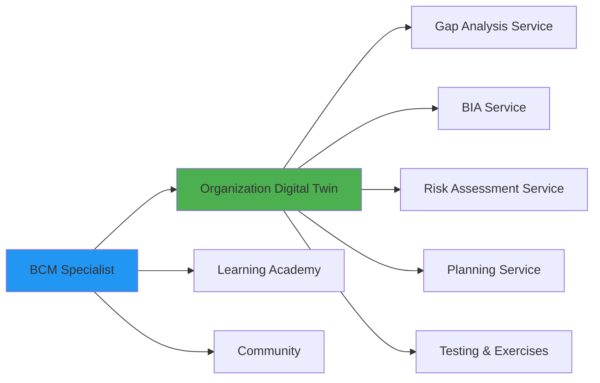
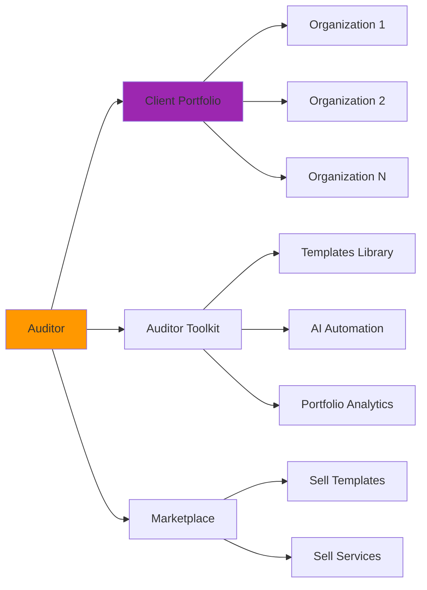

# Платформа: Центры влияния и архитектура от ядра

## Концепция

Вместо модулей строим от **центров влияния** → к пользователям → к их потребностям.

---

## 1. Центры влияния (Core Entities)

### Центр #1: Организация (Digital Twin)
**Сущность:** Цифровая копия организации

**Что содержит:**
- Структура (departments, locations, employees)
- Бизнес-процессы (критические функции)
- Активы (IT systems, физические ресурсы)
- Документация (policies, procedures, plans)
- Метрики (RTO, RPO, финансовые показатели)
- История (incidents, changes, compliance status)

**Связи:**
- Принадлежит → BCM Specialist (owner)
- Обслуживается → Auditor/Consultant (многие аудиторы могут работать с одной организацией)
- Генерирует → Services/Assessments (Gap Analysis, BIA, Risk Assessment...)

---

### Центр #2: Специалист (BCM Professional)
**Сущность:** Человек, строящий BCM в организации

**Что содержит:**
- Профиль (опыт, компетенции, сертификаты)
- Организация (может быть только ОДНА активная)
- Прогресс обучения (курсы, достижения)
- История действий (что делал на платформе)

**Связи:**
- Владеет → Organization (1:1 или 1:N если несколько ролей)
- Учится → Learning Academy
- Общается → Community
- Использует → Tools/Services (BIA, Gap Analysis, Planning...)

---

### Центр #3: Аудитор/Консультант (Auditor)
**Сущность:** Профессионал, работающий с множеством организаций

**Что содержит:**
- Профиль (специализация, клиенты, статистика)
- Портфель организаций (может обслуживать много)
- Инструменты автоматизации (шаблоны, чек-листы, AI ассистенты)
- Аналитика по портфелю (сравнение клиентов)

**Связи:**
- Обслуживает → Organizations (1:N)
- Использует → Auditor Toolkit
- Продаёт → Services (white-label консалтинг)
- Зарабатывает → Marketplace (продажа шаблонов)

---

### Центр #4: Знания (Knowledge Base)
**Сущность:** Коллективная база знаний

**Что содержит:**
- ISO 22301 стандарты
- Best practices из реальных кейсов
- Шаблоны документов
- Сценарии инцидентов
- AI training data (для персонализации)

**Связи:**
- Используется → AI Engine (для генерации рекомендаций)
- Пополняется → Community (crowdsourced cases)
- Продаётся → Marketplace (премиум контент)

---

## 2. Пользователи и их потребности

### User Type 1: BCM Specialist
**Job to be Done:**
1. Понять текущее состояние (Gap Analysis)
2. Провести BIA
3. Оценить риски
4. Создать планы
5. Тестировать и улучшать

**Как платформа закрывает:**


**Сервисы строятся вокруг Organization:**
- `/organizations/{org_id}/gap-analysis` ← создать Gap Analysis для этой орг
- `/organizations/{org_id}/bia` ← создать BIA для этой орг
- `/organizations/{org_id}/risks` ← оценить риски этой орг
- `/organizations/{org_id}/plans` ← планы этой орг

**Дополнительно для Specialist:**
- `/learning/courses` ← учиться
- `/community/discussions` ← общаться

---

### User Type 2: Auditor/Consultant
**Job to be Done:**
1. Управлять портфелем клиентов (много организаций)
2. Быстро проводить аудиты (автоматизация)
3. Сравнивать клиентов между собой
4. Генерировать отчёты для клиентов
5. Продавать свои услуги/шаблоны

**Как платформа закрывает:**


**Сервисы для Auditor:**
- `/auditor/portfolio` ← список всех клиентов
- `/auditor/portfolio/compare` ← сравнить клиентов
- `/auditor/templates` ← мои шаблоны
- `/auditor/analytics` ← аналитика по портфелю
- `/marketplace/my-products` ← что я продаю

**Auditor работает с теми же services, но для РАЗНЫХ организаций:**
- `/organizations/{client1_id}/audit` ← провести аудит клиента 1
- `/organizations/{client2_id}/audit` ← провести аудит клиента 2

---

### User Type 3: Sponsor/Donor (дополнительно)
**Job to be Done:**
1. Финансировать внедрение BCM в целевых организациях
2. Отслеживать прогресс грантов
3. Видеть ROI (сколько организаций защищено)

**Сервисы:**
- `/sponsor/grants` ← мои гранты
- `/sponsor/organizations` ← организации, которые я финансирую
- `/sponsor/impact-report` ← отчёт о воздействии

---

## 3. Архитектура от ядра наружу

```
┌─────────────────────────────────────────────────────┐
│              CORE: Organization Digital Twin        │
│  (структура, процессы, активы, документы, метрики) │
└─────────────────────────────────────────────────────┘
                        ↓
┌─────────────────────────────────────────────────────┐
│           SERVICES (работают с Organization)        │
│                                                     │
│  ┌────────────┐ ┌────────────┐ ┌────────────┐    │
│  │    Gap     │ │    BIA     │ │    Risk    │    │
│  │  Analysis  │ │  Service   │ │ Assessment │    │
│  └────────────┘ └────────────┘ └────────────┘    │
│                                                     │
│  ┌────────────┐ ┌────────────┐ ┌────────────┐    │
│  │  Planning  │ │   Testing  │ │ Compliance │    │
│  │  Service   │ │  Service   │ │  Service   │    │
│  └────────────┘ └────────────┘ └────────────┘    │
└─────────────────────────────────────────────────────┘
                        ↓
┌─────────────────────────────────────────────────────┐
│              USER-SPECIFIC FEATURES                 │
│                                                     │
│  ┌─────────────────┐  ┌─────────────────┐         │
│  │   Specialist    │  │    Auditor      │         │
│  │   Features      │  │    Toolkit      │         │
│  ├─────────────────┤  ├─────────────────┤         │
│  │ • Learning      │  │ • Portfolio     │         │
│  │ • Community     │  │ • Templates     │         │
│  │ • Achievements  │  │ • Analytics     │         │
│  └─────────────────┘  └─────────────────┘         │
└─────────────────────────────────────────────────────┘
                        ↓
┌─────────────────────────────────────────────────────┐
│              SHARED INFRASTRUCTURE                  │
│  (Auth, AI Engine, Knowledge Base, Marketplace)    │
└─────────────────────────────────────────────────────┘
```

---

## 4. Единая база данных (схема от ядра)

### Core Tables (Organizations)
```sql
-- Центральная сущность
organizations (
  id, name, industry, size, structure_json,
  created_at, status
)

organization_processes (
  id, organization_id, name, criticality,
  rto, rpo, dependencies_json
)

organization_assets (
  id, organization_id, type, name, value
)

organization_documents (
  id, organization_id, type, content, version
)
```

### Service Tables (Assessments)
Все сервисы работают с `organization_id`:
```sql
gap_analyses (
  id, organization_id, status, score, findings_json
)

bia_analyses (
  id, organization_id, status, compliance_score
)

risk_assessments (
  id, organization_id, status, risk_matrix_json
)

bcm_plans (
  id, organization_id, plan_type, content
)
```

### User Tables
```sql
users (
  id, email, role (specialist|auditor|sponsor)
)

-- Specialist: 1 organization (owner)
organization_members (
  user_id, organization_id, role (owner|member)
)

-- Auditor: many organizations (clients)
auditor_clients (
  auditor_id, organization_id, contract_start, status
)

-- Learning (для specialists)
user_progress (
  user_id, course_id, completion_percentage
)

-- Marketplace (для auditors)
marketplace_products (
  seller_id, product_type, price, downloads_count
)
```

---

## 5. Единое API (группировка от ядра)

### Group 1: Organization Core
```yaml
/organizations
  GET    / - список организаций (для auditor покажет портфель)
  POST   / - создать организацию
  GET    /{org_id} - детали организации (digital twin)
  PATCH  /{org_id} - обновить

/organizations/{org_id}/structure
  GET    /departments
  GET    /processes
  GET    /assets
  GET    /documents
```

### Group 2: Services (привязаны к org_id)
```yaml
/organizations/{org_id}/gap-analysis
  POST   / - запустить Gap Analysis
  GET    / - результаты

/organizations/{org_id}/bia
  POST   / - создать BIA
  GET    / - список BIA
  GET    /{bia_id} - детали BIA

/organizations/{org_id}/risks
/organizations/{org_id}/plans
/organizations/{org_id}/exercises
```

### Group 3: User-Specific Features
```yaml
# Для Specialist
/learning
  GET /courses
  POST /enroll

/community
  GET /discussions
  POST /ask-question

# Для Auditor
/auditor/portfolio
  GET / - все клиенты
  GET /compare - сравнить клиентов
  GET /analytics - аналитика

/auditor/templates
  GET / - мои шаблоны
  POST / - создать шаблон

# Для всех
/marketplace
  GET /products
  POST /purchase
```

---

## 6. Единый UI (навигация от роли пользователя)

### Specialist View
```
Dashboard
├── My Organization (digital twin)
│   ├── Overview (здоровье системы BCM)
│   ├── Structure (departments, processes, assets)
│   └── Documents
│
├── Assessments (сервисы для моей орг)
│   ├── Gap Analysis
│   ├── BIA
│   ├── Risk Assessment
│   └── Compliance Check
│
├── Planning
│   ├── BCP Plans
│   ├── DRP Plans
│   └── Procedures
│
├── Testing & Exercises
│
├── Learning Academy
└── Community
```

### Auditor View
```
Dashboard
├── Client Portfolio (все организации)
│   ├── Client 1 → (та же структура что у Specialist)
│   ├── Client 2 → (та же структура)
│   └── Client N → (та же структура)
│
├── Portfolio Analytics
│   ├── Compare Clients
│   ├── Maturity Overview
│   └── Risk Heat Map
│
├── Auditor Toolkit
│   ├── Templates Library
│   ├── Automation Rules
│   └── Report Generator
│
└── Marketplace (мои продукты)
```

---

## 7. Что ещё может быть центром влияния?

### Возможные дополнительные центры:

**Центр #5: Инцидент (Incident)**
- Если платформа используется в реальном времени
- Организация → Инцидент происходит → активируются планы
- Все действия привязаны к инциденту

**Центр #6: Регуляторы (Compliance Framework)**
- ISO 22301, NIST, WHO, BSI
- Организация может выбрать несколько стандартов
- Все сервисы проверяют compliance с выбранными стандартами

**Центр #7: Индустрия (Industry Vertical)**
- Healthcare, Finance, Manufacturing
- Knowledge Base фильтруется по индустрии
- AI рекомендации учитывают специфику индустрии

---

## 8. Преимущества такого подхода

✅ **Единая кодовая база** - не 7 отдельных проектов, а одна платформа

✅ **Переиспользование** - Gap Analysis и BIA используют одни и те же `organization_processes`

✅ **Масштабируемость** - Auditor может работать с 100 клиентами, данные изолированы по `organization_id`

✅ **Простая интеграция** - все сервисы говорят на одном языке (Organization Digital Twin)

✅ **Единая аутентификация** - role-based access (specialist видит свою орг, auditor - портфель)

---

## 9. Следующие шаги

Вместо "доделать BIA до конца" предлагаю:

**Phase 1: Core Design (Organizations)**
1. SRS для Organization Digital Twin
2. Database Schema для Organizations + shared tables
3. API для /organizations endpoints

**Phase 2: Services Design (BIA, Gap Analysis, Risk...)**
1. SRS для каждого сервиса (но все привязаны к organization_id)
2. Добавить service tables в единую схему
3. API для /organizations/{org_id}/{service} endpoints

**Phase 3: User-Specific Features**
1. Learning Academy (для specialists)
2. Auditor Toolkit (для auditors)
3. Marketplace (для всех)

**Phase 4: Implementation**
- Backend: одно FastAPI приложение
- Frontend: одно Next.js приложение с role-based routing
- Database: одна Supabase база

---

## Вопрос к вам

Согласны с таким подходом? Начинаем с **Organization Digital Twin** как центрального ядра?
