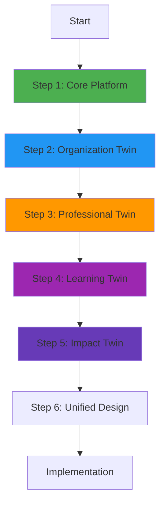
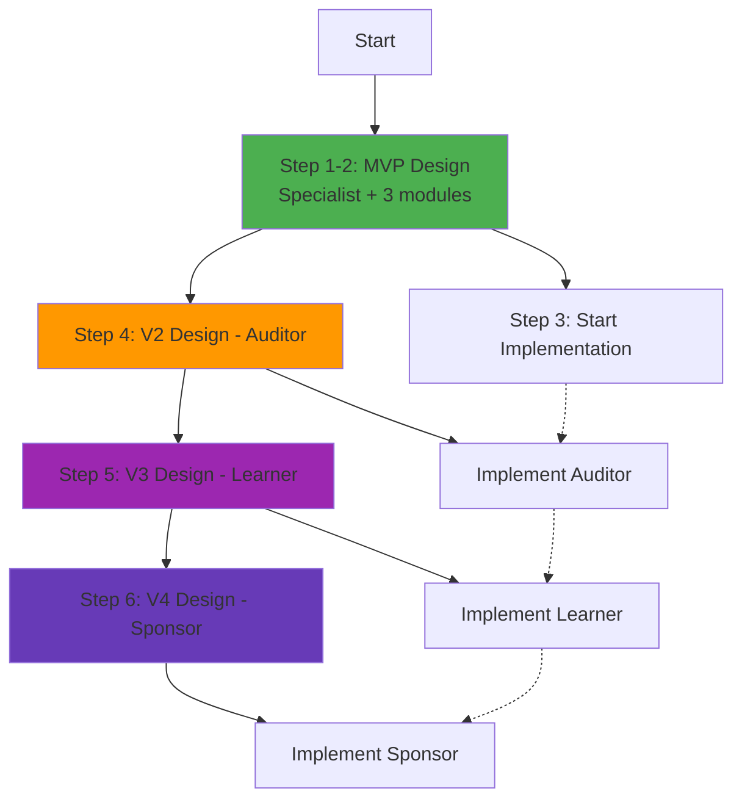
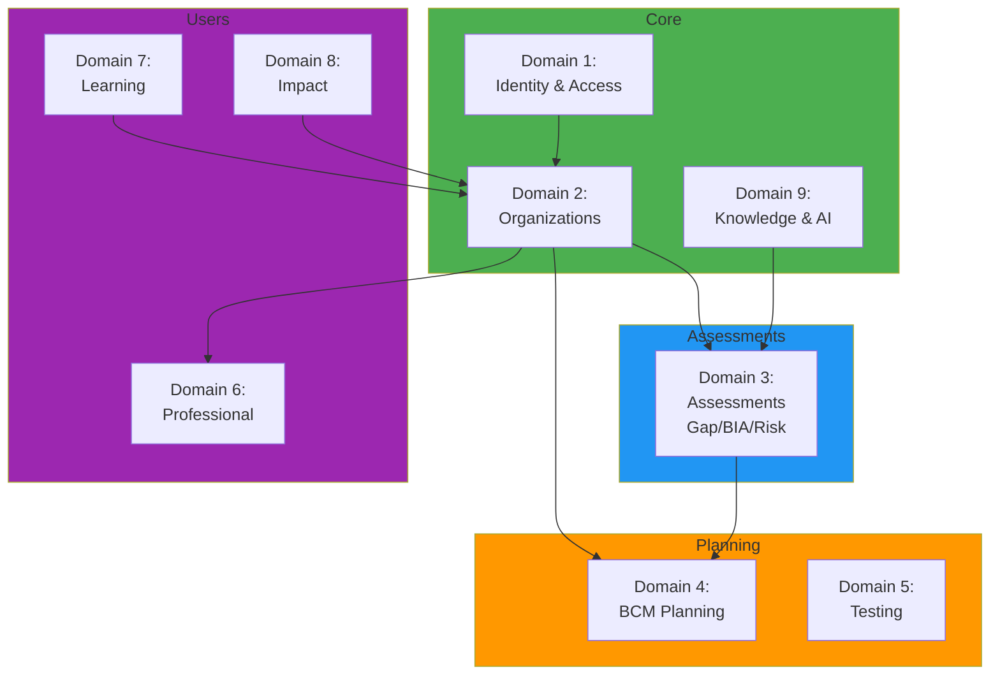

# Стратегии проектирования платформы: 3 варианта

## Текущая ситуация

**Уже есть:**
- ✅ SRS_BIA_MODULE.md
- ✅ BIA_DATABASE_SCHEMA.sql
- ✅ BIA_API_SPECIFICATION.yaml

**Нужно спроектировать:**
- 4 Digital Twins (Organization, Professional, Learner, Sponsor)
- 7+ модулей (Gap Analysis, BIA, Risk, Planning, Compliance, Testing, Response)
- User-specific features (Learning Academy, Auditor Toolkit, Marketplace)
- Единая платформа (не 7 отдельных проектов)

---

## Вариант 1: Core-First (от ядра к периферии)

### Философия
Сначала строим **единое ядро** (shared core), потом навешиваем модули и features.

### Последовательность

#### Step 1: Core Platform (2-3 недели проектирования)
```
1.1 Core Data Model
    ├── Organizations (digital twin core)
    ├── Users & Roles (specialist, auditor, learner, sponsor)
    ├── Audit Log (все действия)
    └── Knowledge Base (ISO standards, cases)

1.2 Core Services
    ├── Auth & Authorization (RLS policies)
    ├── AI Engine (Claude API integration)
    ├── Event Bus (события между модулями)
    └── Notification System

1.3 Core API
    ├── /auth/*
    ├── /organizations/*
    ├── /users/*
    └── /knowledge/*
```

**Deliverables:**
- `CORE_PLATFORM_SRS.md`
- `CORE_DATABASE_SCHEMA.sql`
- `CORE_API_SPECIFICATION.yaml`

#### Step 2: Organization Digital Twin (1-2 недели)
```
2.1 Organization Structure
    ├── Departments
    ├── Processes
    ├── Assets
    └── Documents

2.2 Organization Modules (Services)
    ├── Gap Analysis
    ├── BIA (уже есть SRS)
    ├── Risk Assessment
    ├── Planning
    ├── Compliance
    ├── Testing
    └── Response

2.3 Organization API
    └── /organizations/{org_id}/*
```

**Deliverables:**
- `ORGANIZATION_DIGITAL_TWIN_SRS.md`
- `ORGANIZATION_DATABASE_SCHEMA.sql` (extends core)
- `ORGANIZATION_API_SPECIFICATION.yaml` (extends core)
- SRS для каждого модуля (Gap, Risk, Planning...)

#### Step 3: Professional Digital Twin (1 неделя)
```
3.1 Auditor Profile
3.2 Portfolio Management
3.3 Toolkit & Templates
3.4 Marketplace
```

**Deliverables:**
- `PROFESSIONAL_DIGITAL_TWIN_SRS.md`
- `AUDITOR_DATABASE_SCHEMA.sql` (extends core)
- `AUDITOR_API_SPECIFICATION.yaml`

#### Step 4: Learning Digital Twin (1 неделя)
```
4.1 Learning Journey
4.2 Courses & Progress
4.3 Sandbox Mode
4.4 Community
```

**Deliverables:**
- `LEARNING_DIGITAL_TWIN_SRS.md`
- `LEARNING_DATABASE_SCHEMA.sql` (extends core)
- `LEARNING_API_SPECIFICATION.yaml`

#### Step 5: Impact Digital Twin (3-5 дней)
```
5.1 Sponsor Profile
5.2 Grant Management
5.3 Impact Tracking
```

**Deliverables:**
- `IMPACT_DIGITAL_TWIN_SRS.md`
- `SPONSOR_DATABASE_SCHEMA.sql` (extends core)
- `SPONSOR_API_SPECIFICATION.yaml`

#### Step 6: Unified Design (3-5 дней)
```
6.1 Merge all schemas → UNIFIED_DATABASE_SCHEMA.sql
6.2 Merge all APIs → UNIFIED_API_SPECIFICATION.yaml
6.3 UI Wireframes для всех ролей
6.4 Implementation Roadmap
```

### Преимущества ✅
- Единая архитектура с самого начала
- Нет дублирования кода/схем
- Все модули говорят на одном языке
- Легко добавить новый модуль потом

### Недостатки ❌
- Долго до первого результата (5-6 недель проектирования)
- Нельзя начать разработку параллельно
- Риск over-engineering (слишком абстрактное ядро)

### Диаграмма процесса


### Пример итогового результата
```
docs/design/
├── 01_CORE_PLATFORM_SRS.md
├── 02_ORGANIZATION_DIGITAL_TWIN_SRS.md
├── 03_PROFESSIONAL_DIGITAL_TWIN_SRS.md
├── 04_LEARNING_DIGITAL_TWIN_SRS.md
├── 05_IMPACT_DIGITAL_TWIN_SRS.md
├── UNIFIED_DATABASE_SCHEMA.sql
├── UNIFIED_API_SPECIFICATION.yaml
└── UI_WIREFRAMES.md
```

---

## Вариант 2: MVP-First (быстрый старт с минимумом)

### Философия
Быстро спроектировать **минимальную версию** для одного пользователя (Specialist), запустить разработку, потом добавлять остальные Digital Twins.

### Последовательность

#### Step 1: MVP Scope (1 день)
Определить MVP = **Specialist + Organization Digital Twin + 3 модуля**

**MVP включает:**
- User: Specialist только
- Organization Digital Twin (минимальный)
- Модули: Gap Analysis, BIA, Risk Assessment (3 самых важных)
- NO: Auditor, Learner, Sponsor, Marketplace, Learning Academy

#### Step 2: MVP Design (1 неделя)
```
2.1 MVP SRS
    ├── Users (только specialist role)
    ├── Organizations (базовая структура)
    ├── Gap Analysis (полный)
    ├── BIA (уже есть)
    └── Risk Assessment (полный)

2.2 MVP Database Schema
    ├── users
    ├── organizations
    ├── gap_analyses
    ├── bia_analyses (уже есть)
    └── risk_assessments

2.3 MVP API
    ├── /auth
    ├── /organizations/{org_id}
    ├── /organizations/{org_id}/gap-analysis
    ├── /organizations/{org_id}/bia
    └── /organizations/{org_id}/risks
```

**Deliverables:**
- `MVP_SRS.md` (все 3 модуля в одном документе)
- `MVP_DATABASE_SCHEMA.sql`
- `MVP_API_SPECIFICATION.yaml`
- `MVP_UI_WIREFRAMES.md`

#### Step 3: Start Implementation (параллельно с проектированием V2)
Разработка начинается через 1 неделю, пока проектируется остальное.

#### Step 4: V2 Design - Add Auditor (1 неделя)
```
4.1 Extend для Auditor
    ├── auditor_profiles
    ├── auditor_clients
    └── /auditor/* endpoints

4.2 Minimal Toolkit
    └── Templates library (без marketplace пока)
```

**Deliverables:**
- `V2_AUDITOR_EXTENSION_SRS.md`
- `V2_DATABASE_SCHEMA.sql` (extends MVP)
- `V2_API_SPECIFICATION.yaml` (extends MVP)

#### Step 5: V3 Design - Add Learner (1 неделя)
```
5.1 Extend для Learner
    ├── learner_profiles
    ├── learning_progress
    ├── courses
    └── /learning/* endpoints
```

**Deliverables:**
- `V3_LEARNING_EXTENSION_SRS.md`
- `V3_DATABASE_SCHEMA.sql`
- `V3_API_SPECIFICATION.yaml`

#### Step 6: V4 Design - Add Sponsor + Full Features (1 неделя)
```
6.1 Sponsor
6.2 Marketplace
6.3 Advanced features
```

### Преимущества ✅
- Быстрый старт разработки (через 1 неделю)
- Можно тестировать MVP с реальными пользователями
- Меньше риск over-engineering
- Iterative approach (получаем feedback раньше)

### Недостатки ❌
- Может потребоваться рефакторинг при добавлении новых Digital Twins
- Риск технического долга (если не спланировать расширение заранее)
- Сложнее учесть все требования сразу

### Диаграмма процесса


### Timeline
```
Week 1: MVP Design
Week 2: MVP Implementation starts → V2 Design (Auditor)
Week 3: MVP Implementation continues → V3 Design (Learner)
Week 4: MVP Implementation continues → V4 Design (Sponsor)
Week 5: MVP Launch → Start V2 Implementation
```

---

## Вариант 3: Domain-Driven Design (по доменам)

### Философия
Разделить платформу на **bounded contexts** (домены), проектировать и реализовывать параллельно.

### Bounded Contexts (Домены)

#### Domain 1: Identity & Access Management
```
Ответственность:
- Регистрация пользователей
- Аутентификация (Supabase Auth)
- Роли (specialist, auditor, learner, sponsor)
- Permissions (RLS policies)

Entities:
- User
- Role
- Permission
- Session
```

#### Domain 2: Organization Management
```
Ответственность:
- CRUD организаций
- Структура (departments, processes, assets)
- Organization lifecycle

Entities:
- Organization
- Department
- Process
- Asset
- Document
```

#### Domain 3: Assessment Services
```
Ответственность:
- Gap Analysis
- BIA
- Risk Assessment
- Compliance Check

Entities:
- Assessment (базовый класс)
- GapAnalysis extends Assessment
- BIAAnalysis extends Assessment
- RiskAssessment extends Assessment
```

#### Domain 4: BCM Planning
```
Ответственность:
- Plan creation (BCP, DRP, IRP)
- Plan versioning
- Plan activation

Entities:
- Plan
- Procedure
- Action
- Resource
```

#### Domain 5: Testing & Exercises
```
Ответственность:
- Exercise planning
- Simulation execution
- Results tracking

Entities:
- Exercise
- Scenario
- Participant
- Result
```

#### Domain 6: Professional Services
```
Ответственность:
- Auditor toolkit
- Portfolio management
- Templates
- Marketplace

Entities:
- AuditorProfile
- ClientRelationship
- Template
- MarketplaceProduct
```

#### Domain 7: Learning & Community
```
Ответственность:
- Courses
- Learning paths
- Sandbox mode
- Community discussions

Entities:
- Course
- LearningPath
- LearnerProfile
- Discussion
```

#### Domain 8: Impact & Sponsorship
```
Ответственность:
- Grant management
- Impact tracking
- ROI reporting

Entities:
- SponsorProfile
- Grant
- Milestone
- ImpactReport
```

#### Domain 9: Knowledge & AI
```
Ответственность:
- ISO standards library
- Case studies
- AI prompts
- Recommendations

Entities:
- Standard
- CaseStudy
- AIPrompt
- Recommendation
```

### Последовательность

#### Phase 1: Core Domains (параллельно, 1-2 недели)
```
Team A: Domain 1 (Identity) + Domain 2 (Organizations)
Team B: Domain 3 (Assessments) - Gap, BIA, Risk
Team C: Domain 9 (Knowledge & AI)
```

**Deliverables каждого домена:**
- `DOMAIN_X_SRS.md`
- `DOMAIN_X_DATABASE_SCHEMA.sql`
- `DOMAIN_X_API_SPECIFICATION.yaml`
- `DOMAIN_X_EVENTS.md` (какие события публикует домен)

#### Phase 2: User-Specific Domains (параллельно, 1-2 недели)
```
Team A: Domain 6 (Professional Services)
Team B: Domain 7 (Learning)
Team C: Domain 8 (Impact)
```

#### Phase 3: Advanced Domains (последовательно, 1 неделя каждый)
```
Domain 4: BCM Planning
Domain 5: Testing & Exercises
```

#### Phase 4: Integration (1 неделя)
```
- Event-driven communication между доменами
- Unified API Gateway
- UI orchestration
```

### Преимущества ✅
- Параллельная разработка (3 команды могут работать одновременно)
- Чёткое разделение ответственности
- Легко масштабировать (добавить новый домен)
- Каждый домен = микросервис (если нужно)

### Недостатки ❌
- Сложнее координировать между командами
- Требуется продуманная event-driven архитектура
- Риск конфликтов на границах доменов
- Нужна команда (не 1 человек)

### Диаграмма доменов


### Domain Events (пример)
```yaml
# Domain 2: Organizations publishes
OrganizationCreated:
  organization_id: uuid
  created_by: user_id
  timestamp: datetime

# Domain 3: Assessments subscribes
→ Creates initial Gap Analysis for new org

# Domain 7: Learning subscribes
→ Creates sandbox organization for learner
```

---

## Сравнение вариантов

| Критерий | Вариант 1: Core-First | Вариант 2: MVP-First | Вариант 3: DDD |
|----------|----------------------|---------------------|----------------|
| **Время до старта разработки** | 5-6 недель | 1 неделя | 2-3 недели |
| **Полнота проектирования** | 100% с самого начала | Итеративно (MVP → V2 → V3) | 100% по доменам |
| **Риск технического долга** | Низкий | Средний | Низкий |
| **Сложность координации** | Низкая (1 человек) | Низкая | Высокая (нужна команда) |
| **Гибкость** | Средняя | Высокая | Высокая |
| **Параллельная разработка** | Нет | Частично | Да (3+ команды) |
| **Подходит для MVP** | Нет | ✅ Да | Нет |
| **Подходит для enterprise** | ✅ Да | Нет | ✅ Да |
| **Простота понимания** | Средняя | ✅ Высокая | Низкая |
| **Риск over-engineering** | Высокий | Низкий | Средний |

---

## Рекомендация

### Если работаете один/малая команда → **Вариант 2: MVP-First**

**Обоснование:**
- Быстро получите результат (1 неделя проектирования)
- Можете начать разработку параллельно с проектированием V2
- Меньше риск потратить время на ненужное
- Получите feedback от пользователей раньше

**План действий:**
```
Day 1: Определить MVP scope
Days 2-7: Спроектировать MVP (Specialist + Gap/BIA/Risk)
Week 2: Начать разработку MVP + проектировать V2 (Auditor)
Week 3: Продолжить разработку + проектировать V3 (Learner)
Week 4-5: Доделать MVP, запустить с пользователями
Week 6+: Реализовать V2, V3, V4 на основе feedback
```

### Если есть команда 3+ человек → **Вариант 3: Domain-Driven Design**

**Обоснование:**
- Команды могут работать параллельно
- Чёткое разделение ответственности
- Легко масштируется

### Если нужна идеальная архитектура с самого начала → **Вариант 1: Core-First**

**Обоснование:**
- Единая архитектура без технического долга
- Все продумано заранее
- Но долго до первого результата

---

## Гибридный вариант (мой совет)

**Взять лучшее из Варианта 1 и 2:**

### Week 1: Core + MVP
```
1. Спроектировать Core (users, organizations, auth)
2. Спроектировать MVP модули (Gap, BIA, Risk)
3. НО спланировать extension points для будущих Digital Twins
```

### Week 2-4: Implementation MVP
```
Начать разработку MVP
```

### Week 5: Design V2 Extensions
```
Спроектировать Auditor, Learner, Sponsor
НО использовать Core, который уже продуман
```

**Результат:**
- Быстрый старт (1 неделя)
- Чистая архитектура (Core спланирован заранее)
- Нет технического долга (extension points заложены)

---

## Следующий шаг

**Какой вариант выбираем?**

1. **Вариант 2 (MVP-First)** - быстрый старт
2. **Вариант 1 (Core-First)** - идеальная архитектура
3. **Вариант 3 (DDD)** - параллельная разработка
4. **Гибридный** - Core + MVP + extension points

Или хотите обсудить детали какого-то варианта?
