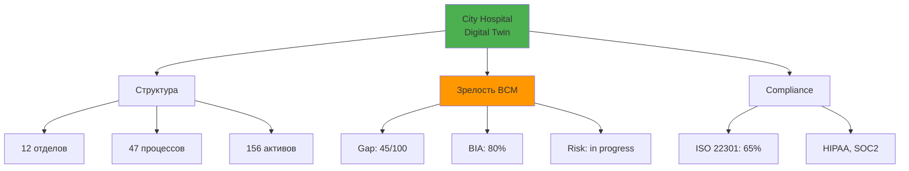
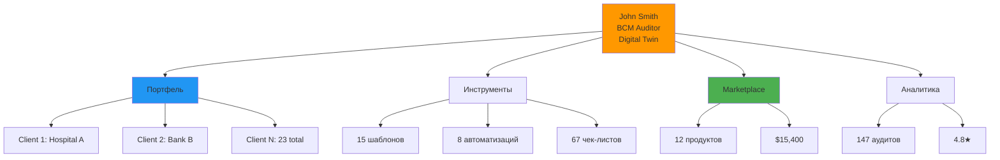
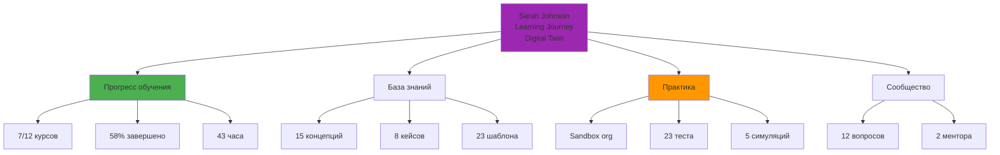
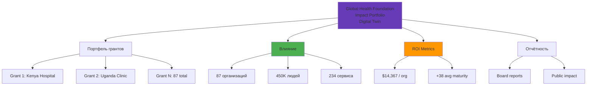

# Архитектура: 3 Цифровые Копии (Digital Twins)

## Концепция

У каждого типа пользователя **СВОЙ центр влияния** и **СВОЯ цифровая копия**:

1. **BCM Specialist** → Цифровая копия **Организации**
2. **Auditor/Consultant** → Цифровая копия **Себя как профессионала**
3. **Учащийся (Стремящийся)** → Цифровая копия **Своего прогресса обучения**
4. **Донор/Инвестор** → Цифровая копия **Портфеля инвестиций**

---

## Digital Twin #1: Организация (для BCM Specialist)

### Центр влияния: Organization Digital Twin

**Пользователь:** BCM Manager, директор по безопасности, владелец бизнеса

**Проблема/Потребность:**
- Нужно построить систему BCM в своей организации
- Понять текущее состояние
- Оценить риски
- Создать планы
- Выполнить требования ISO 22301

**Цифровая копия содержит:**
```json
{
  "organization": {
    "profile": {
      "name": "City Hospital",
      "industry": "Healthcare",
      "size": 450,
      "locations": 3,
      "revenue": 25000000
    },
    "structure": {
      "departments": [
        {"name": "Emergency Care", "employees": 120, "critical": true},
        {"name": "Surgery", "employees": 80, "critical": true},
        {"name": "Billing", "employees": 25, "critical": false}
      ],
      "processes": [
        {
          "name": "Patient Admission",
          "criticality": "critical",
          "rto": 4,
          "rpo": 0,
          "dependencies": ["Electronic Health Records", "Registration System"]
        }
      ]
    },
    "assets": {
      "it_systems": [...],
      "facilities": [...],
      "key_suppliers": [...]
    },
    "bcm_maturity": {
      "gap_analysis_score": 45,
      "bia_completion": 80,
      "risk_assessment_status": "in_progress",
      "plans_coverage": 60,
      "last_exercise": "2024-09-15"
    },
    "compliance": {
      "iso_22301": {"status": "in_progress", "coverage": 65},
      "regulatory": ["HIPAA", "SOC2"]
    }
  }
}
```

**Модули работают С организацией:**
```
/organizations/{org_id}
  /gap-analysis       ← анализ пробелов ЭТОЙ организации
  /bia                ← BIA ЭТОЙ организации
  /risks              ← риски ЭТОЙ организации
  /plans              ← планы ЭТОЙ организации
  /exercises          ← учения ЭТОЙ организации
  /compliance         ← соответствие ЭТОЙ организации
```

**Визуализация Digital Twin:**


**Как наполняется цифровая копия:**
1. **Wizard при онбординге:**
   - "Расскажите о вашей организации" (industry, size)
   - "Какие у вас критические процессы?" (AI предлагает типичные для индустрии)
   - "Какие у вас IT системы?" (интеграция с ERP/AD)

2. **Gap Analysis (первый модуль):**
   - Автоматически создаёт структуру организации
   - Определяет текущую зрелость BCM

3. **BIA (второй модуль):**
   - Детализирует процессы
   - Добавляет зависимости
   - Рассчитывает RTO/RPO

4. **Далее каждый модуль обогащает копию**

---

## Digital Twin #2: Профессионал (для Auditor/Consultant)

### Центр влияния: Professional Digital Twin

**Пользователь:** Аудитор, консультант по BCM, фрилансер

**Проблема/Потребность:**
- Нужны **клиенты** (заказы)
- Нужны **готовые материалы** (шаблоны, чек-листы)
- Нужны **кейсы** для демонстрации экспертизы
- Нужна **автоматизация** рутины (аудиты, отчёты)
- Организации клиентов - это **инструмент работы**, а не центр влияния

**Цифровая копия содержит:**
```json
{
  "professional": {
    "profile": {
      "name": "John Smith",
      "role": "BCM Auditor",
      "certifications": ["CBCP", "ISO 22301 Lead Auditor"],
      "specialization": ["Healthcare", "Financial Services"],
      "years_experience": 12,
      "languages": ["en", "de"]
    },
    "portfolio": {
      "clients_count": 23,
      "active_projects": 5,
      "completed_audits": 147,
      "average_rating": 4.8,
      "clients": [
        {
          "organization_id": "...",
          "name": "Client Hospital A",
          "contract_type": "annual_audit",
          "next_audit": "2025-03-15",
          "status": "active"
        }
      ]
    },
    "toolkit": {
      "templates": [
        {"name": "Healthcare BIA Template", "uses": 45, "revenue": 2250},
        {"name": "Gap Analysis Checklist", "uses": 89, "revenue": 0}
      ],
      "automations": [
        {"name": "Auto-generate Audit Report", "saves_hours": 8}
      ]
    },
    "marketplace": {
      "products_sold": 12,
      "total_revenue": 15400,
      "rating": 4.9
    },
    "analytics": {
      "clients_by_maturity": {
        "beginner": 8,
        "intermediate": 12,
        "advanced": 3
      },
      "revenue_by_service": {
        "audit": 45000,
        "consulting": 28000,
        "marketplace": 15400
      }
    }
  }
}
```

**Модули работают С профессионалом:**
```
/auditor/{auditor_id}
  /portfolio              ← МОИ клиенты
  /portfolio/compare      ← сравнить клиентов между собой
  /toolkit                ← МОИ инструменты
  /toolkit/templates      ← МОИ шаблоны
  /marketplace            ← ЧТО Я продаю
  /analytics              ← МОЯ статистика
  /leads                  ← новые заказы для МЕНЯ

# Работа с клиентом - это вложенный контекст
/auditor/{auditor_id}/clients/{org_id}
  /audit                  ← провести аудит ЭТОГО клиента
  /report                 ← сгенерировать отчёт для ЭТОГО клиента
```

**Визуализация Digital Twin:**


**Как наполняется цифровая копия:**
1. **Онбординг:**
   - "Какие у вас сертификаты?"
   - "В каких индустриях работаете?"
   - "Импортировать клиентов из LinkedIn/CRM?"

2. **Добавление клиентов:**
   - Создать организацию клиента → провести аудит → данные сохраняются в портфеле

3. **Создание toolkit:**
   - После каждого проекта: "Сохранить как шаблон?"
   - AI предлагает автоматизации на основе повторяющихся действий

4. **Marketplace:**
   - Опубликовать шаблон → получать статистику продаж

---

## Digital Twin #3: Учащийся (для Стремящегося специалиста)

### Центр влияния: Learning Journey Digital Twin

**Пользователь:** Студент, начинающий специалист, HR менеджер, который хочет стать BCM

**Проблема/Потребность:**
- **Быстро понять тему** (что такое BCM, ISO 22301)
- **Ориентироваться** (с чего начать, что важно)
- **Иметь материалы** (статьи, видео, шпаргалки)
- **Иметь кейсы** (как это делают другие)
- Организация НЕ НУЖНА (пока учится)
- Организация появится **в конце обучения** (создать тестовую или начать работу)

**Цифровая копия содержит:**
```json
{
  "learner": {
    "profile": {
      "name": "Sarah Johnson",
      "role": "Aspiring BCM Professional",
      "current_job": "HR Manager",
      "goal": "Become BCM Specialist",
      "target_certification": "CBCP"
    },
    "learning_journey": {
      "started_at": "2025-01-15",
      "current_level": "intermediate",
      "progress": {
        "total_courses": 12,
        "completed_courses": 7,
        "completion_percentage": 58,
        "hours_learned": 43
      },
      "path": [
        {"module": "BCM Basics", "status": "completed", "score": 95},
        {"module": "ISO 22301 Fundamentals", "status": "completed", "score": 88},
        {"module": "BIA Deep Dive", "status": "in_progress", "progress": 60},
        {"module": "Risk Assessment", "status": "not_started"},
        {"module": "Plan Development", "status": "locked"}
      ]
    },
    "knowledge": {
      "concepts_mastered": [
        {"name": "RTO", "confidence": 95},
        {"name": "RPO", "confidence": 90},
        {"name": "BIA Process", "confidence": 75}
      ],
      "case_studies_reviewed": [
        {"title": "Hospital BCM Implementation", "industry": "Healthcare"},
        {"title": "Bank Disaster Recovery", "industry": "Finance"}
      ],
      "templates_accessed": [
        "BIA Questionnaire Sample",
        "Gap Analysis Checklist"
      ]
    },
    "practice": {
      "sandbox_organizations": [
        {
          "name": "Practice Hospital",
          "type": "sandbox",
          "modules_tried": ["gap_analysis", "bia"]
        }
      ],
      "quizzes_taken": 23,
      "quizzes_passed": 19,
      "simulations_completed": 5
    },
    "community": {
      "questions_asked": 12,
      "answers_received": 45,
      "discussions_participated": 8,
      "mentors_connected": 2
    },
    "achievements": {
      "badges": ["First Course", "BIA Expert", "Community Helper"],
      "certificates": [],
      "next_milestone": "Complete 10 courses → Earn CBCP Preparation Badge"
    }
  }
}
```

**Модули работают С обучением:**
```
/learning/{learner_id}
  /courses                ← МОИ курсы
  /progress               ← МОЙ прогресс
  /case-studies           ← кейсы для изучения
  /templates              ← шаблоны для изучения (не для работы)
  /sandbox                ← тестовая организация для практики
  /community              ← общение с другими учащимися
  /achievements           ← МОИ достижения

# Sandbox organization (не реальная)
/learning/{learner_id}/sandbox/{org_id}
  /gap-analysis           ← попробовать Gap Analysis (учебный режим)
  /bia                    ← попробовать BIA (с подсказками)
```

**Визуализация Digital Twin:**


**Как наполняется цифровая копия:**
1. **Онбординг:**
   - "Кто вы сейчас?" (текущая роль)
   - "Кем хотите стать?" (цель)
   - "Какой у вас опыт в BCM?" (определить стартовый уровень)

2. **AI рекомендует learning path:**
   - Beginner: "Начните с BCM Basics → ISO 22301 Fundamentals"
   - Intermediate: "У вас уже есть опыт, можете сразу в BIA Deep Dive"

3. **Каждое действие обновляет копию:**
   - Прошёл курс → progress +1
   - Прочитал кейс → knowledge +1
   - Задал вопрос в community → community +1

4. **Sandbox organization:**
   - "Хотите попрактиковаться? Создайте тестовую организацию"
   - Доступны ВСЕ модули, но в учебном режиме (с подсказками)

5. **Выпуск:**
   - Прошёл 10+ курсов → получил сертификат → "Готовы создать реальную организацию?"
   - Переход из Learner → Specialist (с реальной организацией)

---

## Digital Twin #4: Донор/Инвестор (для Спонсора)

### Центр влияния: Impact Portfolio Digital Twin

**Пользователь:** Фонд, инвестор, правительственная программа, корпоративный спонсор

**Проблема/Потребность:**
- **Видеть влияние** (сколько организаций защищено)
- **Отслеживать гранты** (на что потрачены деньги)
- **Оценивать ROI** (какой эффект от инвестиций)
- **Выбирать получателей** (какие организации финансировать)
- Организации - это **портфель инвестиций**, а не центр влияния

**Цифровая копия содержит:**
```json
{
  "sponsor": {
    "profile": {
      "name": "Global Health Foundation",
      "type": "NGO",
      "focus_area": "Healthcare resilience in developing countries",
      "budget_annual": 5000000
    },
    "portfolio": {
      "grants_issued": 87,
      "active_grants": 34,
      "total_invested": 12500000,
      "organizations_supported": [
        {
          "organization_id": "...",
          "name": "Rural Hospital Kenya",
          "grant_amount": 50000,
          "grant_purpose": "Implement BCM system",
          "start_date": "2024-06-01",
          "status": "in_progress",
          "milestones": [
            {"name": "Gap Analysis", "status": "completed", "date": "2024-07-15"},
            {"name": "BIA", "status": "in_progress", "progress": 60},
            {"name": "Plan Development", "status": "not_started"}
          ],
          "current_maturity": 45
        }
      ]
    },
    "impact": {
      "organizations_protected": 87,
      "people_covered": 450000,
      "critical_services_secured": 234,
      "average_maturity_improvement": 38,
      "roi_metrics": {
        "cost_per_organization": 14367,
        "maturity_gain_per_dollar": 0.0026
      }
    },
    "reporting": {
      "last_report_date": "2025-09-30",
      "next_report_due": "2025-12-31",
      "report_format": "Executive Summary + Detailed Impact Analysis"
    }
  }
}
```

**Модули работают С портфелем инвестиций:**
```
/sponsor/{sponsor_id}
  /portfolio              ← МОИ гранты
  /impact                 ← МОЁ влияние
  /analytics              ← МОЯ статистика
  /reports                ← МОИ отчёты для board
  /applications           ← заявки на гранты

# Мониторинг организации-получателя
/sponsor/{sponsor_id}/grantees/{org_id}
  /milestones             ← прогресс по грантовым milestone
  /maturity               ← текущая зрелость BCM
  /compliance             ← соответствие условиям гранта
  /impact                 ← какое влияние достигнуто
```

**Визуализация Digital Twin:**


**Как наполняется цифровая копия:**
1. **Онбординг:**
   - "Какова ваша миссия?"
   - "Какой у вас бюджет?"
   - "Какие критерии для выбора получателей?"

2. **Выдача гранта:**
   - Организация подаёт заявку → спонсор одобряет → организация получает доступ к платформе
   - Грант привязывается к организации

3. **Мониторинг прогресса:**
   - Организация завершает Gap Analysis → milestone completed → уведомление спонсору
   - Каждый модуль обновляет maturity score → спонсор видит прогресс

4. **Автоматические отчёты:**
   - Квартальный отчёт: "34 активных гранта, средний прогресс 65%, 12 организаций достигли advanced maturity"
   - AI генерирует impact story для публичных отчётов

---

## Сравнение 4 Digital Twins

| Аспект | Organization Twin | Professional Twin | Learner Twin | Sponsor Twin |
|--------|------------------|-------------------|--------------|--------------|
| **Владелец** | BCM Specialist | Auditor/Consultant | Учащийся | Донор/Инвестор |
| **Центр влияния** | Организация | Профессионал (себя) | Учебный прогресс | Портфель грантов |
| **Главная метрика** | BCM Maturity (0-100) | Portfolio Revenue + Client Count | Learning Progress (%) | Impact (orgs protected) |
| **Главная потребность** | Построить BCM систему | Получить клиентов | Быстро научиться | Видеть влияние |
| **Связь с организациями** | 1:1 (своя орг) | 1:N (портфель клиентов) | 0:1 (sandbox → реальная) | 1:N (получатели грантов) |
| **Модули** | Gap, BIA, Risk, Plans | Toolkit, Templates, Portfolio Analytics | Courses, Case Studies, Sandbox | Impact Tracking, ROI Reports |
| **Dashboard** | BCM Health Status | Client Portfolio + Revenue | Learning Path + Progress | Impact Map + Milestones |

---

## Единая платформа с 4 режимами

### Архитектура базы данных

```sql
-- Users (общая таблица)
CREATE TABLE users (
  id UUID PRIMARY KEY,
  email VARCHAR(255),
  role VARCHAR(50) -- 'specialist', 'auditor', 'learner', 'sponsor'
);

-- Digital Twin #1: Organizations
CREATE TABLE organizations (
  id UUID PRIMARY KEY,
  owner_id UUID REFERENCES users(id), -- specialist
  name VARCHAR(255),
  industry VARCHAR(100),
  maturity_score INTEGER -- 0-100
);

-- Digital Twin #2: Auditor Profiles
CREATE TABLE auditor_profiles (
  id UUID PRIMARY KEY,
  user_id UUID REFERENCES users(id),
  certifications JSONB,
  specialization JSONB,
  total_clients INTEGER,
  total_revenue DECIMAL
);

CREATE TABLE auditor_clients (
  auditor_id UUID REFERENCES auditor_profiles(id),
  organization_id UUID REFERENCES organizations(id),
  contract_type VARCHAR(50),
  status VARCHAR(50)
);

-- Digital Twin #3: Learner Profiles
CREATE TABLE learner_profiles (
  id UUID PRIMARY KEY,
  user_id UUID REFERENCES users(id),
  current_level VARCHAR(50), -- 'beginner', 'intermediate', 'advanced'
  goal VARCHAR(255),
  progress_percentage INTEGER
);

CREATE TABLE learning_progress (
  learner_id UUID REFERENCES learner_profiles(id),
  course_id UUID,
  status VARCHAR(50), -- 'not_started', 'in_progress', 'completed'
  score INTEGER
);

-- Digital Twin #4: Sponsor Profiles
CREATE TABLE sponsor_profiles (
  id UUID PRIMARY KEY,
  user_id UUID REFERENCES users(id),
  organization_name VARCHAR(255),
  budget_annual DECIMAL,
  focus_area TEXT
);

CREATE TABLE grants (
  id UUID PRIMARY KEY,
  sponsor_id UUID REFERENCES sponsor_profiles(id),
  organization_id UUID REFERENCES organizations(id),
  amount DECIMAL,
  status VARCHAR(50),
  milestones JSONB
);
```

### API Routing по ролям

```yaml
# При логине определяем роль → перенаправляем на нужный dashboard

# Specialist → Organization-centric
GET /organizations/{org_id}
GET /organizations/{org_id}/gap-analysis
GET /organizations/{org_id}/bia

# Auditor → Professional-centric
GET /auditor/profile
GET /auditor/portfolio
GET /auditor/clients/{org_id}/audit

# Learner → Learning-centric
GET /learning/profile
GET /learning/courses
GET /learning/sandbox/{org_id}

# Sponsor → Impact-centric
GET /sponsor/profile
GET /sponsor/portfolio
GET /sponsor/grantees/{org_id}/progress
```

### UI Navigation по ролям

#### Specialist Dashboard
```
┌─────────────────────────────────────────┐
│ My Organization: City Hospital          │
│ ┌────────┐ ┌────────┐ ┌────────┐       │
│ │  Gap   │ │  BIA   │ │  Risk  │       │
│ │  45%   │ │  80%   │ │  In    │       │
│ │        │ │        │ │Progress│       │
│ └────────┘ └────────┘ └────────┘       │
│                                         │
│ Recent Activity:                        │
│ • BIA analysis updated                  │
│ • 3 new findings                        │
│ • Exercise scheduled for Dec 15         │
└─────────────────────────────────────────┘
```

#### Auditor Dashboard
```
┌─────────────────────────────────────────┐
│ My Portfolio: 23 Clients                │
│ ┌────────┐ ┌────────┐ ┌────────┐       │
│ │Client A│ │Client B│ │Client C│       │
│ │ Next:  │ │ Next:  │ │ Next:  │       │
│ │Dec 15  │ │Jan 10  │ │Feb 5   │       │
│ └────────┘ └────────┘ └────────┘       │
│                                         │
│ Marketplace Revenue: $15,400            │
│ • Healthcare BIA Template: 45 sales     │
│ • Gap Analysis Checklist: 89 downloads  │
└─────────────────────────────────────────┘
```

#### Learner Dashboard
```
┌─────────────────────────────────────────┐
│ My Learning Journey: 58% Complete       │
│ ┌────────────────────────────────────┐  │
│ │ Current: BIA Deep Dive (60%)       │  │
│ │ Next: Risk Assessment              │  │
│ └────────────────────────────────────┘  │
│                                         │
│ Practice Sandbox:                       │
│ • Practice Hospital (sandbox)           │
│ • Try Gap Analysis →                    │
│ • Try BIA →                             │
└─────────────────────────────────────────┘
```

#### Sponsor Dashboard
```
┌─────────────────────────────────────────┐
│ Impact Portfolio: 87 Organizations      │
│ ┌────────────────────────────────────┐  │
│ │ 450,000 people protected           │  │
│ │ 234 critical services secured      │  │
│ │ +38 avg maturity improvement       │  │
│ └────────────────────────────────────┘  │
│                                         │
│ Active Grants: 34                       │
│ • Kenya Hospital: 60% complete          │
│ • Uganda Clinic: 80% complete           │
└─────────────────────────────────────────┘
```

---

## Переходы между ролями

### Learner → Specialist
```
Learner completes 10 courses
  ↓
Platform: "Готовы применить знания на практике?"
  ↓
Create Real Organization (переход из sandbox)
  ↓
Role changes to 'specialist'
  ↓
Learner Digital Twin сохраняется (history)
Organization Digital Twin создаётся
```

### Specialist → Auditor
```
Specialist builds successful BCM system
  ↓
Platform: "Хотите помогать другим? Станьте аудитором"
  ↓
Enable Auditor Mode
  ↓
Role adds 'auditor' (может быть обе роли)
Auditor Digital Twin создаётся
  ↓
Can manage own org + client portfolio
```

---

## Следующие шаги

Теперь понятно, что нужно проектировать **4 Digital Twins**, а не просто "модули BIA, Gap Analysis...".

**Предлагаю порядок проектирования:**

### Phase 1: Organization Digital Twin (центр для Specialist)
1. ✅ SRS_BIA_MODULE.md (уже есть)
2. ⏳ SRS_GAP_ANALYSIS_MODULE.md
3. ⏳ SRS_RISK_MODULE.md
4. ⏳ SRS_PLANNING_MODULE.md
5. ⏳ Unified Database Schema (organizations + modules)
6. ⏳ Unified API (organizations-centric)

### Phase 2: Professional Digital Twin (центр для Auditor)
1. ⏳ SRS_AUDITOR_TOOLKIT.md
2. ⏳ SRS_PORTFOLIO_MANAGEMENT.md
3. ⏳ SRS_MARKETPLACE.md
4. ⏳ Add auditor tables to schema
5. ⏳ Add auditor endpoints to API

### Phase 3: Learning Digital Twin (центр для Learner)
1. ⏳ SRS_LEARNING_ACADEMY.md
2. ⏳ SRS_SANDBOX_MODE.md
3. ⏳ SRS_COMMUNITY.md
4. ⏳ Add learner tables to schema
5. ⏳ Add learning endpoints to API

### Phase 4: Impact Digital Twin (центр для Sponsor)
1. ⏳ SRS_IMPACT_TRACKING.md
2. ⏳ SRS_GRANT_MANAGEMENT.md
3. ⏳ Add sponsor tables to schema
4. ⏳ Add sponsor endpoints to API

**Вопрос:** Начинаем с Organization Digital Twin? Или сначала определим **общую core модель** для всех 4 twins?
