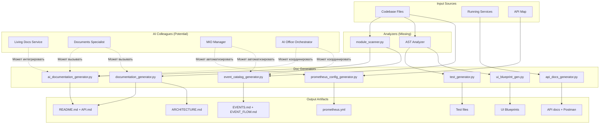

# 📚 Инструменты документации - Полный анализ

**Дата**: 2025-10-08
**Местоположение**: `/infrastructure/tools/doc-generators/`
**Количество инструментов**: 7

---

## 🎯 Обзор системы документации

Платформа AI-Platform-ISO имеет **автоматизированную систему генерации документации**, состоящую из 7 специализированных инструментов, которые работают **независимо** и могут быть **интегрированы с AI коллегами** для проактивной генерации.

---

## 📦 Список инструментов

### 1️⃣ **AI Documentation Generator** (`ai_documentation_generator.py`)

**Размер**: 21KB (553 строки)
**Тип**: **AI-powered** (использует Claude API)
**Статус**: ✅ Executable

#### Что делает:
Интеллектуальная генерация документации с использованием AI для создания качественных описаний, примеров и объяснений.

#### Основные возможности:

```python
class AIDocumentationGenerator:
    """
    Комбинирует:
    - module_scanner.py отчёты (структура, метрики)
    - AI-генерация описаний (Claude)
    - Классификация и извлечение концепций

    Результат: Качественная документация с AI-сгенерированными описаниями
    """
```

**Функции**:
1. **Классификация модулей** - 6 типов:
   - `ai_module` - AI/ML компоненты
   - `orchestration` - Оркестраторы workflow
   - `api_service` - REST API сервисы
   - `data_service` - Database/Storage
   - `integration` - Интеграции
   - `foundation` - Базовые модули

2. **AI-генерация описаний**:
   ```python
   async def generate_ai_description(module_name, classification, scan_data):
       # Использует Claude 3.5 Sonnet для генерации
       # 2-3 предложения, профессиональный стиль
       prompt = f"""Ты технический писатель для BCM платформы.
       Модуль: {module_name}
       Тип: {classification['type']}
       Напиши краткое техническое описание..."""
   ```

3. **AI-генерация примеров кода**:
   ```python
   async def generate_ai_usage_examples(module_name, endpoints):
       # Генерирует Python код (10-15 строк)
       # С комментариями на русском
       # Обработка ошибок included
   ```

4. **Генерация README.md**:
   - Автоматическая таблица метрик (LOC, классы, функции, endpoints)
   - API секция с группировкой по методам
   - Архитектура (топ-5 классов)
   - Использование (AI-generated примеры)
   - Зависимости (internal/external)

#### Использование:

```bash
# С AI-генерацией (требует ANTHROPIC_API_KEY)
export ANTHROPIC_API_KEY="your-key"
python3 infrastructure/tools/doc-generators/ai_documentation_generator.py --module ai-foundation --ai

# Без AI (использует шаблоны)
python3 infrastructure/tools/doc-generators/ai_documentation_generator.py --module ai-foundation

# Полная генерация для всех модулей с AI
python3 infrastructure/tools/doc-generators/ai_documentation_generator.py --full --ai
```

#### Выходные файлы:
- `{module}/README.md` - AI-powered документация
- Footer: `🤖 AI-powered` или `📝 Template-based`

---

### 2️⃣ **Documentation Generator** (`documentation_generator.py`)

**Размер**: 24KB (634 строки, executable)
**Тип**: **Template-based** (без AI)
**Статус**: ✅ Executable

#### Что делает:
Классический генератор документации на основе шаблонов. Читает результаты `module_scanner.py` и генерирует:
- README.md для каждого модуля
- API.md (если есть endpoints)
- ARCHITECTURE.md на уровне слоёв (intelligent-core, platform-services)

#### Основные возможности:

1. **Генерация README.md**:
   ```python
   def generate_module_readme(scan_data, module_path):
       # Обзор (метрики)
       # API endpoints (группировка по методам)
       # Architecture (ключевые компоненты)
       # Dependencies (internal/external/infrastructure)
       # Usage (примеры использования)
       # Configuration (config files)
   ```

2. **Генерация API.md**:
   ```python
   def generate_module_api_doc(scan_data):
       # Группировка endpoints по ресурсам
       # Детальное описание каждого endpoint:
       #   - Method + Path
       #   - Parameters (таблица)
       #   - Request Body (JSON schema)
       #   - Responses (по статус-кодам)
       #   - Примеры запросов (curl)
   ```

3. **Генерация ARCHITECTURE.md** (на уровне слоя):
   ```python
   def generate_layer_architecture(layer_name, modules_data):
       # Статистика слоя (модули, endpoints, классы, LOC)
       # Таблица модулей
       # Mermaid граф зависимостей
       # Детальное описание каждого модуля
       # Roadmap
   ```

4. **Определение типа модуля** (эвристика):
   ```python
   def _detect_module_type(scan_data):
       if endpoints: return "🌐 API Service"
       elif 'orchestrat' in name: return "🎯 Orchestrator"
       elif 'ai' in name: return "🤖 AI Module"
       elif 'foundation' in name: return "🏗️ Foundation Layer"
       elif len(classes) > 10: return "📚 Library"
       else: return "🔧 Utility Module"
   ```

#### Использование:

```bash
# Генерировать для одного модуля
python3 infrastructure/tools/doc-generators/documentation_generator.py --module ai-foundation

# Генерировать для всех модулей
python3 infrastructure/tools/doc-generators/documentation_generator.py --all

# Генерировать архитектурные документы по слоям
python3 infrastructure/tools/doc-generators/documentation_generator.py --architecture

# Полная генерация (модули + архитектура)
python3 infrastructure/tools/doc-generators/documentation_generator.py --full
```

#### Выходные файлы:
- `{module}/README.md`
- `{module}/API.md` (если есть endpoints)
- `{layer}/ARCHITECTURE.md` (intelligent-core, platform-services)

---

### 3️⃣ **Event Catalog Generator** (`event_catalog_generator.py`)

**Размер**: 13KB (366 строк, executable)
**Тип**: **Static analysis**
**Статус**: ✅ Executable

#### Что делает:
Сканирует кодовую базу и автоматически генерирует каталог событий (Event-Driven Architecture documentation).

#### Основные возможности:

1. **Сканирование событий**:
   ```python
   def scan_codebase():
       # Сканирует: intelligent-core, platform-services, shared
       # Находит publishers и subscribers
       # Группирует по доменам (event.domain.action)
   ```

2. **Паттерны поиска**:
   ```python
   # Publishers:
   - eventbus.publish("event.type", {...})
   - await publish_event("event.type", ...)
   - EventPublisher.publish("event.type", ...)
   - self.publish("event.type", ...)

   # Subscribers:
   - eventbus.subscribe("event.type", handler)
   - @event_handler("event.type")
   - .on("event.type", handler)
   ```

3. **Генерация отчётов**:
   - **Markdown** (`EVENTS.md`) - Каталог всех событий с publishers/subscribers
   - **JSON** (`events_catalog.json`) - Машиночитаемый формат
   - **Mermaid** (`EVENT_FLOW.md`) - Граф потоков событий

4. **Анализ orphaned events**:
   ```python
   def analyze_orphaned_events():
       # События без publishers (⚠️ dead subscriptions)
       # События без subscribers (⚠️ никто не слушает)
   ```

#### Использование:

```bash
# Запустить генерацию
python3 infrastructure/tools/doc-generators/event_catalog_generator.py
```

#### Выходные файлы:
- `infrastructure/events/EVENTS.md` - Markdown каталог
- `infrastructure/events/events_catalog.json` - JSON каталог
- `infrastructure/events/EVENT_FLOW.md` - Mermaid диаграмма
- `infrastructure/events/asyncapi.yaml` - AsyncAPI спецификация

---

### 4️⃣ **API Docs Generator** (`api_docs_generator.py`)

**Размер**: 10KB (235 строк)
**Тип**: **Runtime introspection** (OpenAPI)
**Статус**: Non-executable (script)

#### Что делает:
Генерирует документацию из OpenAPI спецификаций запущенных сервисов.

#### Основные возможности:

1. **Fetch OpenAPI specs**:
   ```python
   async def fetch_openapi_specs():
       # Подключается к запущенным сервисам:
       services = {
           'validation': 8022,
           'documents': 8024,
           'governance': 8020,
           'incident': 8025
       }
       # Получает http://localhost:{port}/openapi.json
   ```

2. **Генерация Markdown docs**:
   ```python
   def generate_markdown_docs():
       # Группировка по тегам
       # Детальное описание каждого endpoint:
       #   - Parameters (таблица)
       #   - Request Body (JSON schema)
       #   - Responses (по статус-кодам)
   ```

3. **Генерация Postman collection**:
   ```python
   def generate_postman_collection():
       # Полная Postman коллекция для импорта
       # Группировка по сервисам
       # Variables: {{base_url}}
   ```

#### Использование:

```bash
# Требует запущенных сервисов!
cd platform-services/validation-service && python main.py &
cd platform-services/documents-service && python main.py &

# Генерация
python3 infrastructure/tools/doc-generators/api_docs_generator.py
```

#### Выходные файлы:
- `docs/api/{service}.md` - Markdown для каждого сервиса
- `docs/api/README.md` - Индекс всех сервисов
- `docs/api/postman_collection.json` - Postman коллекция

---

### 5️⃣ **Prometheus Config Generator** (`prometheus_config_generator.py`)

**Размер**: 11KB (344 строки)
**Тип**: **Configuration generator**
**Статус**: Non-executable

#### Что делает:
Автоматически генерирует `prometheus.yml` конфигурацию на основе API map. Обнаруживает все сервисы с `/health` и `/metrics` endpoints.

#### Основные возможности:

1. **Извлечение сервисов из API map**:
   ```python
   def extract_services_from_api_map(api_map):
       # Сканирует http_apis
       # Определяет service name из file path
       # Проверяет наличие /health и /metrics
   ```

2. **Известные порты** (hardcoded):
   ```python
   KNOWN_PORTS = {
       'planning-service': 8011,
       'bia-service': 8012,
       # ... 40+ сервисов
       'prometheus': 9090,
       'grafana': 3000,
   }
   ```

3. **Генерация Prometheus config**:
   ```python
   def generate_prometheus_config(services):
       scrape_configs = []
       for service_name, service_data in services.items():
           scrape_config = {
               'job_name': service_name,
               'scrape_interval': '15s',
               'static_configs': [{
                   'targets': [f'{service_name}:{port}'],
                   'labels': {
                       'has_health': 'true',
                       'has_metrics': 'true'
                   }
               }]
           }
   ```

4. **Service Discovery config**:
   ```python
   def generate_service_discovery_config(services):
       # File-based service discovery
       # sd_configs/services.json
   ```

#### Использование:

```bash
# Генерация (требует api_map.json)
python3 infrastructure/tools/doc-generators/prometheus_config_generator.py
```

#### Выходные файлы:
- `infrastructure/observability/config/prometheus/prometheus-auto.yml`
- `infrastructure/observability/config/prometheus/sd_configs/services.json`
- `infrastructure/observability/config/prometheus/services-inventory.json`

---

### 6️⃣ **Test Generator** (`test_generator.py`)

**Размер**: 10KB (345 строк)
**Тип**: **Code generator** (Jinja2 templates)
**Статус**: Non-executable

#### Что делает:
Автоматическая генерация тестов на основе AST анализа.

#### Основные возможности:

1. **Генерация pytest тестов**:
   ```python
   def _generate_service_tests(service_name, endpoints):
       # Для каждого endpoint:
       @pytest.mark.asyncio
       async def test_{function}(client):
           response = await client.{method}("{path}")
           assert response.status_code in [200, 201, 204]
   ```

2. **Генерация Tavern scenarios** (YAML):
   ```yaml
   test_name: {service}_api_test_suite
   stages:
     - name: Test GET /api/resource
       request:
         url: "{base_url}/api/resource"
         method: GET
       response:
         status_code: 200
   ```

3. **Генерация unit тестов**:
   ```python
   def generate_unit_tests():
       # Для сервисных классов
       class Test{ClassName}:
           @pytest.fixture
           def instance(self):
               return {ClassName}(mock_repository)

           @pytest.mark.asyncio
           async def test_{method}(self, instance):
               # TODO: Add test implementation
   ```

4. **Конфигурационные файлы**:
   - `pytest.ini`
   - `conftest.py`
   - `requirements-test.txt`

#### Использование:

```bash
# Генерация (требует ast_analysis.json)
python3 infrastructure/tools/doc-generators/test_generator.py
```

#### Выходные файлы:
- `tests/generated/test_{service}_api.py` - API integration tests
- `tests/generated/test_{service}_unit.py` - Unit tests
- `tests/generated/tavern_test_{service}.yaml` - Tavern scenarios
- `tests/pytest.ini`
- `tests/generated/conftest.py`
- `tests/requirements-test.txt`

---

### 7️⃣ **UI Blueprint Generator** (`ui_blueprint_gen.py`)

**Размер**: 14KB (357 строк)
**Тип**: **UI specification generator**
**Статус**: Non-executable

#### Что делает:
Генерация схем UI на основе API endpoints. Создаёт HTML blueprints и JSON спецификации для фронтенд разработки.

#### Основные возможности:

1. **Классификация операций**:
   ```python
   # Из endpoints автоматически определяет:
   - List Screen (GET /resource)
   - Create Screen (POST /resource)
   - Detail Screen (GET /resource/{id})
   - Edit Screen (PUT /resource/{id})
   - Delete Action (DELETE /resource/{id})
   - Custom Actions (остальные endpoints)
   ```

2. **Генерация screen specs**:
   ```python
   screens = [
       {
           'name': 'Resource List',
           'type': 'list',
           'components': [
               {'type': 'table', 'data_source': '/api/resource'},
               {'type': 'search_bar'},
               {'type': 'filters'},
               {'type': 'pagination'},
               {'type': 'button', 'action': 'create'}
           ]
       }
   ]
   ```

3. **Генерация HTML blueprints**:
   ```html
   <!-- Визуальные схемы с компонентами -->
   📋 List Screen
     📊 Data Table
     🔍 Search Bar
     🔧 Filters
     📄 Pagination
     ➕ Create Button

   ➕ Create Screen
     📝 Form
     💾 Submit Button
     ❌ Cancel Button
   ```

4. **JSON спецификации**:
   ```json
   {
       "service": "Documents",
       "resources": {
           "documents": {
               "screens": [
                   {
                       "name": "Documents List",
                       "type": "list",
                       "components": [...]
                   }
               ]
           }
       }
   }
   ```

#### Использование:

```bash
# Генерация (требует ast_analysis.json)
python3 infrastructure/tools/doc-generators/ui_blueprint_gen.py
```

#### Выходные файлы:
- `docs/ui/{service}_blueprint.html` - HTML визуализация
- `docs/ui/{service}_spec.json` - JSON спецификация
- `docs/ui/index.html` - Навигация по всем blueprints

---

## 🔗 Интеграция с AI коллегами

### Текущий статус: **Не интегрировано**

Инструменты работают **standalone** и запускаются **вручную**. Однако, есть потенциал для интеграции:

### Потенциальные интеграции:

#### 1. **Living Docs Service** (`intelligent-core/living-docs/`)

```python
# living-docs/services/documentation_evolution_engine.py
class DocumentationEvolutionEngine:
    """
    Может интегрировать:
    - ai_documentation_generator для AI-powered docs
    - documentation_generator для structure docs
    - event_catalog_generator для event documentation
    """

    async def auto_generate_docs(self, module_name: str):
        # Вызывать doc generators автоматически
        # При изменении кода (git hooks)
        # При деплое новой версии
```

#### 2. **Documents Specialist** (`expertise-center/domains/bcm/tactical_assistants/documents_specialist.py`)

```python
# Documents Specialist может запускать генераторы
class DocumentsSpecialist:
    async def generate_module_documentation(self, module_path):
        # 1. Вызвать module_scanner
        # 2. Вызвать ai_documentation_generator --ai
        # 3. Вызвать api_docs_generator (если API service)
        # 4. Вызвать test_generator
        # 5. Вызвать ui_blueprint_gen (если есть UI)
```

#### 3. **MIO Manager** (`devops-ai/mio-manager/`)

```python
# MIO Manager (Monitoring, Intelligence, Orchestration)
# Может автоматизировать:
# - Prometheus config generation при добавлении новых сервисов
# - Event catalog обновление при изменении eventbus логики
# - Test generation для новых endpoints

from infrastructure.tools.doc-generators.prometheus_config_generator import main as gen_prometheus
from infrastructure.tools.doc-generators.event_catalog_generator import EventCatalogGenerator

class MIOManager:
    async def on_service_deployed(self, service_name: str):
        # Auto-update Prometheus config
        gen_prometheus()

        # Auto-update Event catalog
        catalog = EventCatalogGenerator("/Users/MD/AI-Platform-ISO")
        catalog.scan_codebase()
        catalog.generate_markdown_report("infrastructure/events/EVENTS.md")
```

#### 4. **AI Office Orchestrator** (`infrastructure/AI-office-infrastructure/orchestrator/`)

```python
# Unified Orchestrator может координировать генерацию документации
class UnifiedOrchestrator:
    async def orchestrate_documentation_update(self):
        tasks = [
            {'tool': 'ai_documentation_generator', 'args': ['--full', '--ai']},
            {'tool': 'event_catalog_generator', 'args': []},
            {'tool': 'prometheus_config_generator', 'args': []},
            {'tool': 'test_generator', 'args': []},
            {'tool': 'ui_blueprint_gen', 'args': []}
        ]

        for task in tasks:
            await self.add_task_to_queue(
                task_id=f"doc-gen-{task['tool']}",
                task_type="documentation_generation",
                base_priority=TaskPriority.NORMAL
            )
```

---

## 🤖 Автоматизация - Рекомендации

### Сценарий 1: **CI/CD Integration** (Git hooks)

```bash
# .github/workflows/auto-docs.yml
name: Auto-generate Documentation

on:
  push:
    branches: [main]
    paths:
      - 'intelligent-core/**'
      - 'platform-services/**'

jobs:
  generate-docs:
    runs-on: ubuntu-latest
    steps:
      - name: Generate AI Documentation
        env:
          ANTHROPIC_API_KEY: ${{ secrets.ANTHROPIC_API_KEY }}
        run: |
          python3 infrastructure/tools/doc-generators/ai_documentation_generator.py --full --ai

      - name: Generate Event Catalog
        run: |
          python3 infrastructure/tools/doc-generators/event_catalog_generator.py

      - name: Commit generated docs
        run: |
          git add .
          git commit -m "chore: auto-update documentation [skip ci]"
          git push
```

### Сценарий 2: **Scheduled Jobs** (Cron)

```bash
# Ежедневное обновление документации
0 2 * * * cd /Users/MD/AI-Platform-ISO && python3 infrastructure/tools/doc-generators/ai_documentation_generator.py --full --ai

# Еженедельное обновление event catalog
0 3 * * 1 cd /Users/MD/AI-Platform-ISO && python3 infrastructure/tools/doc-generators/event_catalog_generator.py
```

### Сценарий 3: **API Endpoint** (On-demand)

```python
# intelligence/api/routes.py
@router.post("/api/v1/documentation/generate")
async def trigger_documentation_generation(
    module: str,
    use_ai: bool = True,
    generators: List[str] = ["ai_docs", "events", "tests"]
):
    """Trigger documentation generation via API"""

    results = {}

    if "ai_docs" in generators:
        # Запустить ai_documentation_generator
        subprocess.run([
            "python3",
            "infrastructure/tools/doc-generators/ai_documentation_generator.py",
            "--module", module,
            "--ai" if use_ai else ""
        ])
        results["ai_docs"] = "success"

    if "events" in generators:
        # Запустить event_catalog_generator
        subprocess.run([
            "python3",
            "infrastructure/tools/doc-generators/event_catalog_generator.py"
        ])
        results["events"] = "success"

    return {"status": "completed", "results": results}
```

---

## 📊 Зависимости инструментов

### Input Dependencies (что требуется):

| Инструмент | Требует | Источник |
|-----------|---------|----------|
| `ai_documentation_generator.py` | `{module}_scan.json` | `module_scanner.py` |
| | `ANTHROPIC_API_KEY` (optional) | Environment variable |
| `documentation_generator.py` | `{module}_scan.json` | `module_scanner.py` |
| `event_catalog_generator.py` | Codebase access | File system |
| `api_docs_generator.py` | Running services | HTTP endpoints |
| `prometheus_config_generator.py` | `api_map.json` | `tools/reports/api_map.json` |
| `test_generator.py` | `ast_analysis.json` | AST analyzer |
| `ui_blueprint_gen.py` | `ast_analysis.json` | AST analyzer |

### Missing Tools (не найдены в репозитории):

- ❌ `module_scanner.py` - Не найден! (Но на него ссылаются)
- ❌ AST analyzer - Не найден! (Но генерирует `ast_analysis.json`)

**Рекомендация**: Создать эти недостающие инструменты или найти их в других директориях.

---

## 🎯 Workflow диаграмма



---

## 💡 Рекомендации по интеграции

### Приоритет 1: **Living Docs Service** (Высокий)

**Почему**: Living Docs уже существует и предназначен для эволюции документации.

**Что интегрировать**:
1. `ai_documentation_generator.py` - для AI-powered docs
2. `event_catalog_generator.py` - для event documentation
3. `api_docs_generator.py` - для API docs

**Как**:
```python
# living-docs/services/documentation_evolution_engine.py

async def auto_update_documentation(self, trigger: str):
    """
    trigger: 'code_change' | 'deploy' | 'manual'
    """

    # 1. Генерировать AI docs для изменённых модулей
    changed_modules = await self.detect_changed_modules()
    for module in changed_modules:
        await self.run_ai_documentation_generator(module)

    # 2. Обновить event catalog
    await self.run_event_catalog_generator()

    # 3. Обновить API docs (если сервисы запущены)
    if await self.check_services_running():
        await self.run_api_docs_generator()

    # 4. Уведомить пользователей об обновлении
    await self.notify_documentation_updated()
```

### Приоритет 2: **MIO Manager** (Средний)

**Почему**: MIO Manager отвечает за мониторинг и автоматизацию.

**Что интегрировать**:
1. `prometheus_config_generator.py` - авто-обновление Prometheus config
2. `event_catalog_generator.py` - мониторинг event flows

**Как**:
```python
# mio-manager/scheduler/automation_jobs.py

@scheduler.scheduled_job('cron', hour=2, minute=0)
async def update_prometheus_config():
    """Ежедневное обновление Prometheus конфигурации"""
    from infrastructure.tools.doc-generators.prometheus_config_generator import main
    main()

    # Перезапустить Prometheus
    await restart_prometheus()

@scheduler.scheduled_job('cron', day_of_week='mon', hour=3)
async def update_event_catalog():
    """Еженедельное обновление event catalog"""
    from infrastructure.tools.doc-generators.event_catalog_generator import EventCatalogGenerator

    generator = EventCatalogGenerator("/Users/MD/AI-Platform-ISO")
    generator.scan_codebase()
    generator.generate_markdown_report("infrastructure/events/EVENTS.md")
    generator.generate_json_report("infrastructure/events/events_catalog.json")
```

### Приоритет 3: **Documents Specialist** (Средний)

**Почему**: Documents Specialist может вызывать генераторы по запросу пользователя.

**Что интегрировать**:
Все 7 инструментов - как toolkit.

**Как**:
```python
# expertise-center/domains/bcm/tactical_assistants/documents_specialist.py

class DocumentsSpecialist:

    async def handle_user_request(self, request: str):
        """
        User: "Обнови документацию для модуля ai-foundation"
        User: "Сгенерируй event catalog"
        User: "Создай тесты для validation-service"
        """

        if "документацию" in request and "модуль" in request:
            module = self.extract_module_name(request)
            await self.generate_documentation(module, use_ai=True)

        elif "event catalog" in request:
            await self.generate_event_catalog()

        elif "тесты" in request:
            service = self.extract_service_name(request)
            await self.generate_tests(service)
```

---

## 📝 Итоги

### Что работает ✅:
1. **7 генераторов документации** готовы к использованию
2. **AI-powered генерация** через Claude API (ai_documentation_generator)
3. **Template-based генерация** для быстрой документации
4. **Event catalog** для Event-Driven Architecture
5. **Prometheus config** автоматическая генерация
6. **Test generation** для API и unit тестов
7. **UI blueprints** для фронтенд разработки

### Что не работает ❌:
1. **Автоматизация** - все инструменты запускаются вручную
2. **Интеграция с AI коллегами** - нет связи
3. **Missing dependencies** - `module_scanner.py`, AST analyzer

### Что нужно сделать 🔨:
1. **Создать missing tools** (`module_scanner.py`, AST analyzer)
2. **Интегрировать с Living Docs Service** (приоритет 1)
3. **Интегрировать с MIO Manager** для автоматизации
4. **Добавить API endpoints** для on-demand генерации
5. **Настроить CI/CD** для авто-обновления документации

---

**Версия**: 1.0
**Дата**: 2025-10-08
**Автор**: AI Assistant
**Статус**: 📚 ANALYSIS COMPLETE
