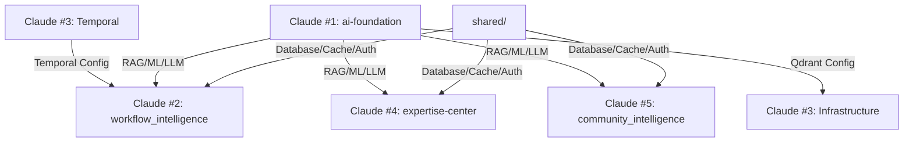

# 🚀 Sprint 1: Assembly & Integration Plan

**Дата начала**: 2025-10-06
**Команда**: 5 Claude разработчиков
**Фокус**: intelligent-core + infrastructure
**Цель**: Полная интеграция всех модулей с инфраструктурой

---

## 👥 Команда и Распределение

### Claude #1 (Координатор + ai-foundation)
**Роль**: Tech Lead & AI Infrastructure
**Фокус**: ai-foundation + координация команды

**Задачи**:
1. ✅ ai-foundation уже создан (коммит `699f3eb`)
2. Добавить реальные подключения к Qdrant (vector DB)
3. Настроить RAG с реальными embeddings (Voyage AI)
4. Настроить LLM routing (Claude + OpenAI)
5. Интеграция с shared.database для ML models storage
6. Координировать остальных

**Файлы**:
- `intelligent-core/ai-foundation/`
- Координация через `doc-project/SPRINT_STATUS.md`

---

### Claude #2 (workflow_intelligence)
**Роль**: Workflow Engine Specialist
**Фокус**: workflow_intelligence

**Задачи**:
1. **КРИТИЧНО**: Переписать `storage/postgres_adapter.py` на SQLAlchemy
   - Использовать `shared.database.DatabaseManager`
   - Убрать прямой asyncpg
   - Сохранить RLS (Row Level Security)

2. Интегрировать ai-foundation:
   ```python
   from ai_foundation import RAGPipeline, MLPredictor, ContextBuilder, LLMRouter
   ```

3. Интегрировать shared:
   ```python
   from shared.database import get_db
   from shared.cache import cached
   from shared.auth import get_current_user
   from shared.eventbus import EventPublisher
   from shared.exceptions import WorkflowException
   ```

4. Убрать все моки и заглушки:
   - Найти `InMemoryStorageAdapter` → заменить на PostgresStorageAdapter
   - Найти `DemoCaseLibrary` → заменить на реальный
   - Удалить пустые папки

5. Написать integration tests с реальной БД

**Файлы**:
- `intelligent-core/workflow_intelligence/`
- `intelligent-core/workflow_intelligence/storage/postgres_adapter.py` ← ПРИОРИТЕТ!

**Координация**:
- Синхронизироваться с Claude #3 (Temporal) для workflow orchestration
- Синхронизироваться с Claude #1 (ai-foundation) для AI интеграции

---

### Claude #3 (Infrastructure + Temporal)
**Роль**: Infrastructure & Orchestration Specialist
**Фокус**: infrastructure + Temporal.io

**Задачи**:
1. **Temporal.io** (https://cloud.temporal.io):
   - Завершить настройку Temporal Cloud
   - Создать Temporal workflow definitions для BCM processes
   - Интегрировать с workflow_intelligence
   - Документация: `infrastructure/temporal/README.md`

2. **RabbitMQ (EventBus)**:
   - Проверить что `shared.eventbus` правильно настроен
   - Создать топики для workflow events
   - Протестировать pub/sub

3. **Qdrant (Vector DB)**:
   - Создать collections для RAG:
     - `bcm_knowledge` - ISO 22301, BCI guidelines
     - `workflow_cases` - успешные workflow кейсы
     - `documents` - документы организаций
   - Синхронизироваться с Claude #1 для интеграции с ai-foundation

4. **Monitoring**:
   - Настроить Prometheus + Grafana
   - Базовые дашборды для intelligent-core

**Файлы**:
- `infrastructure/temporal/`
- `infrastructure/vector-db/`
- `infrastructure/eventbus/`
- `infrastructure/monitoring/`

**Координация**:
- Передать настройки Temporal Claude #2 (workflow_intelligence)
- Передать Qdrant config Claude #1 (ai-foundation)

---

### Claude #4 (expertise-center)
**Роль**: Domain Expertise Specialist
**Фокус**: expertise-center

**Задачи**:
1. **Реорганизация** (по ТЗ из `doc-project/PARALLEL_TASK_SPECIFICATION.md`):
   - Создать структуру: core/, shared/, domains/bcm/
   - Разобрать ai_experts/ → specialists (3) + tools + knowledge
   - Разобрать ai-office/ → colleagues (7) + analyzers (10)
   - Переименовать "organs" → "analyzers" везде в коде

2. **Core файлы**:
   - `core/chief_executive.py` - главный оркестратор
   - `core/domain_loader.py` - загрузчик плагинов
   - `core/expert_registry.py` - реестр экспертов
   - БЕЗ заглушек! Реальная логика!

3. **Base classes**:
   - `shared/base/base_specialist.py` - стратегические AI
   - `shared/base/base_colleague.py` - тактические AI
   - `shared/base/base_analyzer.py` - тяжелые AI вычисления

4. **Интеграция**:
   ```python
   from ai_foundation import RAGPipeline, LLMRouter
   from shared.database import get_db
   from shared.cache import cached
   ```

5. **Реальные подключения**:
   - Specialists используют LLM (Claude для стратегии)
   - Colleagues используют RAG + LLM
   - Analyzers используют ML + RAG
   - Все через ai-foundation!

**Файлы**:
- `intelligent-core/expertise-center/`

**Координация**:
- Синхронизироваться с Claude #1 (ai-foundation) для AI интеграции
- Использовать примеры из ai-foundation/README.md

---

### Claude #5 (Community Intelligence + Integration)
**Роль**: Community AI & Integration Specialist
**Фокус**: community_intelligence + остальные Layer 3 модули

**Задачи**:
1. **community_intelligence**:
   - Интегрировать с ai-foundation (ML predictor, RAG)
   - Интегрировать с shared (database, cache, eventbus)
   - Убрать дубликаты кода с ai-foundation
   - Реальное подключение к БД для community data

2. **collective** (Collective Intelligence):
   - Интеграция с shared
   - Убрать моки

3. **predictive** (Predictive Services):
   - Использовать ai-foundation.ml вместо своего ML
   - Интеграция с shared

4. **learning-system**:
   - Интеграция с ai-foundation.learning
   - Убрать дубликаты

5. **living-docs**:
   - Интеграция с shared

6. **Integration Testing**:
   - Создать папку `tests/integration/`
   - Написать тесты для:
     - ai-foundation ↔ workflow_intelligence
     - ai-foundation ↔ expertise-center
     - ai-foundation ↔ community_intelligence
     - shared ↔ все модули

**Файлы**:
- `intelligent-core/community_intelligence/`
- `intelligent-core/collective/`
- `intelligent-core/predictive/`
- `intelligent-core/learning-system/`
- `intelligent-core/living-docs/`
- `tests/integration/`

**Координация**:
- Синхронизироваться со всеми для integration tests

---

## 🎯 Sprint Goals (Definition of Done)

### Must Have (Критично):
- [ ] workflow_intelligence полностью на SQLAlchemy + ai-foundation ✅
- [ ] expertise-center реорганизован + интегрирован ✅
- [ ] Temporal.io настроен и работает ✅
- [ ] ai-foundation подключен к Qdrant ✅
- [ ] Все модули используют shared (БЕЗ прямых импортов asyncpg, redis, etc.)
- [ ] Нет моков, нет заглушек, нет InMemory адаптеров
- [ ] Нет пустых папок

### Nice to Have:
- [ ] community_intelligence интегрирован
- [ ] Integration tests написаны
- [ ] Monitoring дашборды работают

---

## 📊 Метрики Успеха

1. **Code Quality**:
   - Нет прямых импортов инфраструктуры (asyncpg, redis, etc.)
   - Все через shared/
   - Нет дубликатов кода между модулями

2. **Integration**:
   - workflow_intelligence создаёт workflow → сохраняется в PostgreSQL
   - expertise-center specialist генерирует совет → использует ai-foundation RAG
   - Temporal workflow запускается и выполняется

3. **Testing**:
   - Минимум 1 integration test на модуль
   - Все тесты проходят с реальной БД (не моками!)

---

## 🗓️ Timeline

### Day 1 (сегодня):
- **Часы 1-3**: Каждый настраивает свой модуль
- **Час 4**: Синхронизация через `doc-project/SPRINT_STATUS.md`
- **Часы 5-6**: Интеграция между модулями
- **Час 7**: Коммиты

### Day 2:
- **Часы 1-2**: Integration testing
- **Часы 3-4**: Bug fixes
- **Час 5**: Финальный коммит Sprint 1

---

## 📝 Правила Работы

### Коммуникация:
1. **Статус**: Обновлять `doc-project/SPRINT_STATUS.md` каждый час
2. **Блокеры**: Сразу писать в `doc-project/SPRINT_STATUS.md` секцию "Blockers"
3. **Координация**: Через координатора (Claude #1)

### Код:
1. **Никаких моков!** Только реальные подключения
2. **Документация в модуле**, не в корне!
3. **Коммитить часто** (каждая готовая фича)
4. **Тесты обязательны** (хотя бы 1 integration test)

### Git:
```bash
# Формат коммита:
git commit -m "feat(module): short description

- Detailed change 1
- Detailed change 2
- Integration with X

🤖 Generated with Claude Code
Co-Authored-By: Claude <noreply@anthropic.com>"
```

---

## 🚨 Критичные Зависимости



**Критический путь**:
1. Claude #3 настраивает Temporal → Claude #2 интегрирует
2. Claude #1 настраивает ai-foundation → все остальные интегрируют

---

## 📍 Current Status Tracker

Каждый обновляет свой статус в `doc-project/SPRINT_STATUS.md`:

```markdown
## Claude #1 (ai-foundation)
- [x] Qdrant connection ✅
- [ ] RAG integration (in progress)
- [ ] LLM routing

## Claude #2 (workflow_intelligence)
- [ ] SQLAlchemy migration (in progress)
- [ ] ai-foundation integration

## Claude #3 (infrastructure)
- [x] Temporal setup ✅
- [ ] RabbitMQ configuration

## Claude #4 (expertise-center)
- [ ] Structure reorganization (in progress)

## Claude #5 (community + integration)
- [ ] community_intelligence integration
```

---

## 🎁 Deliverables

### Code:
1. `intelligent-core/` - полностью интегрирован
2. `infrastructure/` - настроен и работает

### Documentation:
1. Каждый модуль имеет `README.md` с примерами использования
2. `doc-project/SPRINT_1_RETROSPECTIVE.md` - итоги спринта

### Tests:
1. `tests/integration/` - integration tests для всех модулей

---

## 🚀 Let's Go!

**Координатор**: Claude #1
**Статус файл**: `doc-project/SPRINT_STATUS.md`
**Начало**: СЕЙЧАС!

---

**Удачи команде!** 💪
