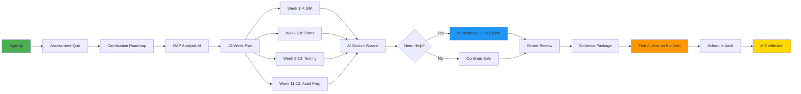
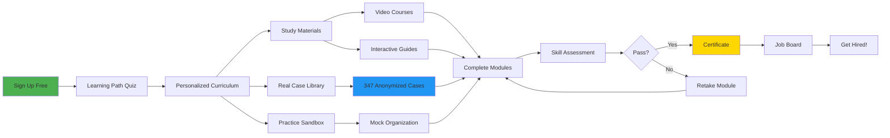
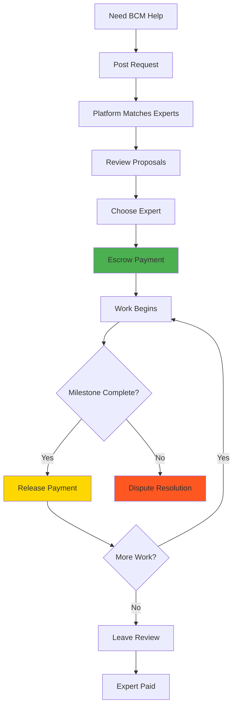

# Platform Architecture: Jobs-to-be-Done Model

**Date**: 2025-10-09
**Version**: 3.0 - JTBD-Driven
**Paradigm Shift**: From "Feature Platform" → "Problem-Solving Marketplace"

---

## 🎯 CORE INSIGHT

> **"Люди не хотят BCM платформу. Они хотят решить конкретную проблему."**

### 7 Jobs-to-be-Done (JTBD):

| # | Job-to-be-Done | User Type | Pain Point | Willingness to Pay |
|---|----------------|-----------|------------|-------------------|
| **1** | **Get ISO 22301 Certified** | Organization Manager | "Нужен сертификат, не знаю с чего начать" | 💰💰💰 High |
| **2** | **Simplify Auditor Work** | Auditor/Consultant | "Трачу 80% времени на документы, не на экспертизу" | 💰💰 Medium |
| **3** | **Become BCM Expert** | Student/Professional | "Хочу стать специалистом, нужны кейсы и знания" | 💰 Low-Medium |
| **4** | **Get Certified Training** | Professional | "Нужны сертифицированные курсы для карьеры" | 💰💰 Medium |
| **5** | **Find Affordable Services** | Small Business | "Консультанты дорогие, нужен доступный эксперт" | 💰💰 Medium |
| **6** | **Digital Twin Modeling** | Enterprise/Innovator | "Хочу моделировать сценарии без риска" | 💰💰💰💰 Very High |
| **7** | **Crisis Recovery Plan** | Organization in Crisis | "Всё сломалось, нужен план СЕЙЧАС!" | 💰💰💰💰💰 Extreme |

---

## 💎 JTBD #1: Get ISO 22301 Certified

### User Persona: **BCM Manager Alexey**
- **Role**: Risk Manager в средней компании (200 сотрудников)
- **Goal**: Получить ISO 22301 сертификат за 6 месяцев
- **Budget**: €15,000-25,000 (vs €50,000+ traditional consulting)
- **Pain**: "Я знаю ЧТО нужно сделать (ISO clauses), но не знаю КАК"

### User Journey: "Guided Certification Path"



### Platform Features for This JTBD:

#### 1. **Certification Journey Dashboard** (`/certification`)
```typescript
<CertificationJourney
  organizationProfile={org}
  onStart={() => startAssessment()}
>
  <ProgressTracker>
    ✅ Assessment Complete (Week 0)
    🔄 BIA in Progress (Week 2 of 4)
    ⏳ Plans (Not Started)
    ⏳ Testing (Not Started)
    ⏳ Audit (Not Started)

    Overall Progress: 25% | Est. Completion: 18 weeks
  </ProgressTracker>

  <CurrentWeekTasks>
    Week 2 of 12: BIA Phase

    This Week's Tasks:
    1. ✅ Complete 5 department BIAs (5/5)
    2. 🔄 Interview Finance team (in progress)
    3. ⏳ Dependency mapping
    4. ⏳ RTO/RPO validation

    <AICoach>
      💡 You're ahead of schedule! Consider starting
         BC Plans next week instead of Week 5.
    </AICoach>
  </CurrentWeekTasks>

  <QuickActions>
    <ContinueWork />
    <HireExpert /> {/* Marketplace */}
    <ScheduleReview />
    <GetHelpFromAI />
  </QuickActions>
</CertificationJourney>
```

#### 2. **Marketplace: Find Certified Auditor** (`/marketplace/auditors`)
```typescript
<AuditorMarketplace
  filters={{location: 'EU', price: '<5000', rating: '>4.5'}}
  onSearch={() => findAuditors()}
>
  <AuditorCard>
    👤 Ivan Petrov
    ⭐ 4.9 (127 reviews)
    🎓 ISO 22301 Lead Auditor
    💼 15 years experience
    💰 €3,500 - €5,000
    📍 Remote + EU travel

    Services:
    ✅ Full Certification Audit: €4,500
    ✅ Pre-Audit Review: €1,200
    ✅ Gap Analysis: €800
    ✅ Consultation (hourly): €150/h
    ✅ Document Review: €500

    <AvailabilityCalendar>
      Next available: Dec 15, 2025
    </AvailabilityCalendar>

    <BookService service="Pre-Audit Review" />
    <MessageAuditor />
  </AuditorCard>

  <PlatformGuarantee>
    🛡️ Platform Protection:
    - Verified credentials
    - Escrow payment
    - Quality guarantee
    - Dispute resolution
  </PlatformGuarantee>
</AuditorMarketplace>
```

#### 3. **Evidence Package Generator** (`/certification/evidence`)
```typescript
<EvidencePackageBuilder
  certificationId={certId}
  onGenerate={() => aiCreatePackage()}
>
  <AutoCollectedEvidence>
    ISO 22301 Evidence Package
    Generated: 2025-10-09
    Organization: Acme Corp
    Auditor: Ivan Petrov

    📂 Clause 4: Context (12 documents)
      ✅ 4.1 Organization context.pdf
      ✅ 4.2 Stakeholder needs.pdf
      ✅ 4.3 BCMS scope.pdf
      ✅ 4.4 BCMS processes.pdf

    📂 Clause 8: Operation (47 documents)
      ✅ 8.2 BIA Reports (12)
      ✅ 8.3 Risk Assessments (8)
      ✅ 8.4 BC Plans (15)
      ✅ 8.5 Exercise Reports (5)

    📂 Clause 9: Performance (8 documents)
      ✅ 9.1 Monitoring logs
      ✅ 9.2 Internal audit
      ✅ 9.3 Management review

    Total: 127 documents, 2,450 pages

    <ExportOptions>
      📦 Download ZIP (encrypted)
      ☁️  Share with auditor (secure link)
      📧 Email package
      🖨️  Print checklist
    </ExportOptions>
  </AutoCollectedEvidence>

  <AuditReadinessScore>
    AI Assessment: 94/100 ✅ READY

    Minor gaps:
    - Management review signature pending
    - 1 exercise report incomplete
  </AuditReadinessScore>
</EvidencePackageBuilder>
```

#### 4. **Pricing Model: Certification Package**

```
💰 CERTIFICATION PACKAGE (€299/month for 6 months = €1,794)

Included:
✅ AI-Guided 12-week roadmap
✅ Unlimited BIA, Risk, Plans workflows
✅ Evidence package generation
✅ AI assistance (1000 queries/month)
✅ Digital Twin testing (10 simulations/month)
✅ ISO 22301 knowledge base access
✅ Community support

Add-Ons (via Marketplace):
+ Expert consultation: €150-300/hour
+ Document review: €500-1,500
+ Pre-audit: €1,200
+ Full audit: €3,500-5,000
+ Training: €800-2,000

TOTAL COST: €1,794 + €5,000 (audit) = €6,794
vs Traditional: €50,000+ (87% savings!)
```

---

## 🔍 JTBD #2: Simplify Auditor Work

### User Persona: **Auditor Maria**
- **Role**: Independent ISO 22301 Lead Auditor
- **Goal**: Handle 3x more clients without hiring staff
- **Pain**: "80% времени трачу на чтение документов, проверку compliance, заполнение отчетов"
- **Revenue**: €120K/year → €360K/year potential

### User Journey: "AI-Powered Audit Assistant"

```mermaid
graph LR
    A[Client Books Audit] --> B[Platform Notification]
    B --> C[Review Evidence Package]
    C --> D[AI Pre-Analysis]

    D --> E[Gap Report Auto-Generated]
    E --> F[Schedule Audit]

    F --> G[Conduct Audit]
    G --> H[AI Transcript + Notes]

    H --> I[AI Draft Report]
    I --> J[Auditor Review + Edit]

    J --> K[Issue Certificate]
    K --> L[Platform Handles Payment]

    style A fill:#2196F3
    style D fill:#4CAF50
    style H fill:#4CAF50
    style I fill:#4CAF50
    style L fill:#FFD700
```



### Platform Features for Auditors:

#### 1. **Auditor Dashboard** (`/auditor/dashboard`)
```typescript
<AuditorDashboard
  auditorId={auditorId}
  onManage={() => loadClients()}
>
  <EarningsOverview>
    💰 This Month: €12,500
    📊 YTD: €87,000
    📈 +45% vs last year

    Breakdown:
    - Audits: €9,000 (3 completed)
    - Pre-audits: €2,400 (2 completed)
    - Consultations: €1,100 (7 hours)

    Platform Fee: 15% (€1,875)
    Net: €10,625 💸
  </EarningsOverview>

  <ActiveClients>
    🔄 In Progress (3):
    1. Acme Corp - Pre-audit (Due: Oct 15)
    2. Beta LLC - Full audit (Scheduled: Oct 20)
    3. Gamma Inc - Consultation (Ongoing)

    📅 Upcoming (2):
    4. Delta Ltd - Full audit (Nov 5)
    5. Epsilon SA - Gap analysis (Nov 12)

    ⏳ Pending Approval (5):
    - 5 new booking requests
  </ActiveClients>

  <AIAssistantStats>
    🤖 AI Saved You This Month:
    - 47 hours (document review)
    - 12 hours (report writing)
    - 8 hours (gap analysis)

    Total: 67 hours = €10,050 value
    Efficiency: +220%
  </AIAssistantStats>
</AuditorDashboard>
```

#### 2. **AI Audit Assistant** (`/auditor/client/:id`)
```typescript
<AuditAssistantWorkspace
  clientId={clientId}
  onAnalyze={() => aiPreAnalyze()}
>
  <AIDocumentAnalysis>
    📂 Evidence Package Analysis

    AI Pre-Audit Report:
    Status: 127 documents analyzed in 45 seconds

    ✅ STRONG AREAS:
    - Clause 4 (Context): 100% compliant
    - Clause 8.2 (BIA): Excellent documentation
    - Clause 8.4 (BC Plans): Well-structured

    ⚠️  GAPS FOUND:
    1. Clause 8.5 (Testing): Only 3 exercises (need 1/year min)
       Evidence: exercise_2023.pdf, exercise_2024_q1.pdf
       Recommendation: Request Q3/Q4 2024 exercise

    2. Clause 9.3 (Management Review): Signature missing
       Evidence: mgmt_review_2024.pdf (page 12)
       Recommendation: Obtain CEO signature

    3. Clause 8.3 (Risk): 2 high risks without treatment
       Evidence: risk_register.xlsx (rows 15, 23)
       Recommendation: Verify treatment plans

    ❌ MISSING:
    - External audit (Clause 9.2.2) - not found

    <GeneratePreAuditReport>
      Export for client (PDF)
    </GeneratePreAuditReport>
  </AIDocumentAnalysis>

  <InterviewTranscription>
    🎙️ Live Interview Transcription

    [Recording: Finance Manager Interview]
    AI Transcript:

    00:15 - Auditor: "How often do you review RTO targets?"
    00:22 - Finance Mgr: "Quarterly, last review was August"

    🤖 AI Note:
    ✅ Frequency compliant (quarterly = good)
    📝 Action: Request August review document

    00:45 - Auditor: "Who approves BC plan changes?"
    00:50 - Finance Mgr: "Usually the department head"

    🤖 AI Flag:
    ⚠️  ISO 22301 requires top management approval
    💡 Follow-up: Verify approval process documentation

    <AutoSaveNotes />
    <GenerateFollowUpQuestions />
  </InterviewTranscription>

  <ReportDrafter>
    📝 AI Report Generator

    Generating audit report...
    ✅ Executive summary (2 pages)
    ✅ Findings by clause (18 pages)
    ✅ Evidence references (347 citations)
    ✅ Recommendations (12 items)
    ✅ Certification decision draft

    Time saved: 8 hours

    <ReviewAndEdit>
      Auditor can edit before finalizing
    </ReviewAndEdit>
  </ReportDrafter>
</AuditAssistantWorkspace>
```

#### 3. **Marketplace Presence Management** (`/auditor/profile`)
```typescript
<AuditorProfile
  auditorId={auditorId}
  onUpdate={() => updateProfile()}
>
  <ProfileSettings>
    Public Profile:

    Name: Maria Sokolova
    Title: ISO 22301 Lead Auditor
    Experience: 12 years
    Certifications:
    - ISO 22301 Lead Auditor (2013)
    - ISO 27001 Auditor (2015)
    - CBCP (2018)

    Pricing:
    - Full audit: €4,200
    - Pre-audit: €1,200
    - Consultation: €180/hour
    - Gap analysis: €900

    Availability:
    - Remote: Yes
    - Travel: EU + CIS
    - Next slot: Nov 15, 2025

    Languages: Russian, English, German

    <Statistics>
      ⭐ Rating: 4.9/5 (89 reviews)
      ✅ Completed: 127 audits
      🏆 Top 5% on platform
      ⚡ Avg. response: 2 hours
    </Statistics>
  </ProfileSettings>

  <MarketingTools>
    🎯 Boost Your Visibility:

    - Featured placement: €99/month
    - Sponsored search: €0.50/click
    - Case study publication: Free
    - Webinar hosting: €200 (platform promoted)

    Current Plan: Basic (Free)
    Recommendation: Upgrade to Featured (€99/mo)
    Est. ROI: +40% bookings = +€4,800/mo revenue
  </MarketingTools>
</AuditorProfile>
```

#### 4. **Pricing Model: Auditor Subscription**

```
💰 AUDITOR PLANS

🆓 FREE (Marketplace Only)
- Profile listing
- Client messaging
- Payment processing
- Platform fee: 15%

💎 PRO (€149/month)
- All Free features
- AI Audit Assistant (unlimited)
- Document analysis
- Report generator
- Scheduling calendar
- Platform fee: 12%

🏆 ENTERPRISE (€499/month)
- All Pro features
- White-label reports
- CRM integration
- Priority support
- Featured placement
- Platform fee: 10%

EXAMPLE ECONOMICS:
Auditor does 4 audits/month @ €4,200 = €16,800
Platform fee (PRO): 12% = €2,016
AI saves: 32 hours = €5,760 value
Net benefit: €3,744/month + time for 2 more clients
```

---

## 🎓 JTBD #3: Become BCM Expert

### User Persona: **Student Dmitry**
- **Role**: IT Manager хочет стать BCM специалистом
- **Goal**: Изучить BCM, получить опыт на реальных кейсах
- **Budget**: €50-100/month
- **Pain**: "Книги скучные, хочу практику, но нет доступа к реальным проектам"

### User Journey: "Learning Platform with Real Cases"



### Platform Features for Learners:

#### 1. **Learning Dashboard** (`/learn`)
```typescript
<LearningPlatform
  studentId={studentId}
  onStart={() => startCurriculum()}
>
  <PersonalizedPath>
    🎯 Your BCM Learning Path

    Based on: IT Manager with 5 years experience
    Goal: BCM Consultant certification
    Duration: 6 months (4-6 hours/week)

    Progress: 35% Complete

    📚 Curriculum:

    ✅ Module 1: BCM Fundamentals (Completed)
       - ISO 22301 Overview
       - BCM Lifecycle
       - Key Concepts
       Score: 92%

    🔄 Module 2: BIA Deep Dive (In Progress)
       - BIA Methodology
       - RTO/RPO Analysis
       - Dependency Mapping
       Progress: 60% | Next: Practice Case

    ⏳ Module 3: Risk Management
    ⏳ Module 4: BC Plans
    ⏳ Module 5: Exercises
    ⏳ Module 6: Crisis Management

    🎓 Final Project: Real Organization BIA
  </PersonalizedPath>

  <ThisWeeksLearning>
    Week 8 Activities:

    1. ✅ Watch: "Advanced BIA Techniques" (45 min)
    2. 🔄 Read: 3 case studies (Healthcare BIA)
    3. ⏳ Practice: Complete mock BIA
    4. ⏳ Quiz: Module 2 assessment

    <ContinueLearning />
  </ThisWeeksLearning>
</LearningPlatform>
```

#### 2. **Real Case Library** (`/learn/cases`)
```typescript
<CaseLibrary
  filters={{industry: 'Healthcare', difficulty: 'Intermediate'}}
  onExplore={() => loadCases()}
>
  <CaseCard>
    📋 Case #A47: Healthcare Ransomware Attack

    Industry: Healthcare
    Organization: 250-bed hospital (anonymized)
    Scenario: Ransomware encrypted EHR system
    Difficulty: ⭐⭐⭐ Intermediate
    Learning Focus: Crisis response, IT recovery

    Real Data:
    - RTO target: 4 hours
    - Actual recovery: 6 hours
    - Financial impact: $450,000
    - Patients affected: 8,500

    What You'll Learn:
    ✓ How they detected the attack
    ✓ Crisis team activation
    ✓ Communication strategy
    ✓ Technical recovery steps
    ✓ Lessons learned

    Available Materials:
    📄 Timeline of events
    📄 Crisis communication log
    📄 Recovery procedures used
    📄 Post-incident report
    📊 Financial impact analysis

    <StudyCase>
      Interactive exploration + quiz
    </StudyCase>

    <PracticeMode>
      "You are the BCM Manager. What do you do?"
      Make decisions, see consequences
    </PracticeMode>
  </CaseCard>

  <AITutor>
    💡 Recommendation:
    Based on your Module 2 progress, try Case #A47.
    It demonstrates BIA principles in real crisis.
  </AITutor>
</CaseLibrary>
```

#### 3. **Practice Sandbox** (`/learn/sandbox`)
```typescript
<PracticeSandbox
  mockOrganization="TechCorp"
  onSimulate={() => createMockBIA()}
>
  <MockOrganization>
    🏢 Your Practice Organization: TechCorp

    Profile:
    - Industry: Software Development
    - Size: 150 employees
    - Revenue: $12M/year
    - Locations: 3 offices

    Current State:
    - No BCM program
    - Had 2 incidents last year
    - CEO wants ISO 22301

    Your Mission:
    Build complete BCM program from scratch
  </MockOrganization>

  <SandboxFeatures>
    Practice All Skills:

    ✅ Conduct mock BIA
       - Interview virtual stakeholders
       - Identify critical processes
       - Calculate RTO/RPO
       - AI grades your work

    ✅ Perform risk assessment
       - Identify threats
       - Score likelihood/impact
       - Propose treatments
       - Compare with expert solution

    ✅ Write BC plans
       - Use AI plan generator
       - Customize procedures
       - Test with Digital Twin
       - Get feedback

    ✅ Run exercises
       - Design scenarios
       - Execute simulations
       - Evaluate performance

    <AIFeedback>
      Your BIA: 78/100

      ✅ Strong: Process identification, interviews
      ⚠️  Improve: RTO calculation methodology
      ❌ Missing: Financial impact quantification

      Recommendation: Review Case #A23 for
      financial impact best practices
    </AIFeedback>
  </SandboxFeatures>
</PracticeSandbox>
```

#### 4. **Certification & Job Board** (`/learn/career`)
```typescript
<CareerPath
  studentId={studentId}
  onCertify={() => takeFinalExam()}
>
  <CertificationProgress>
    🎓 BCM Professional Certification

    Requirements:
    ✅ Complete 6 modules (6/6)
    ✅ Pass all quizzes (avg: 87%)
    ✅ Complete 10 case studies (10/10)
    ✅ Final project approved (Pending review)
    ⏳ Final exam (Not attempted)

    Status: READY FOR EXAM ✅

    <ScheduleExam>
      Next available: Oct 15, 2025
      Duration: 3 hours
      Pass mark: 80%
      Cost: €200 (included in subscription)
    </ScheduleExam>
  </CertificationProgress>

  <JobBoard>
    💼 BCM Jobs Matching Your Profile

    1. Junior BCM Consultant - €45K-55K
       ABC Consulting | Remote | Entry-level
       "Platform certification preferred"
       <Apply />

    2. BCM Coordinator - €50K-60K
       XYZ Corp | Moscow | 1-2 years exp
       "ISO 22301 knowledge required"
       <Apply />

    3. Freelance BIA Specialist - €300/day
       Multiple clients | Remote | Project-based
       "Platform experience a plus"
       <Apply />

    <ProfileVisibility>
      Make your profile visible to employers:
      - Show certification
      - Link practice projects
      - Display case study scores
    </ProfileVisibility>
  </JobBoard>
</CareerPath>
```

#### 5. **Pricing Model: Learning Subscription**

```
💰 LEARNING PLANS

🆓 FREE
- 3 courses (basics)
- 10 case studies
- Community access
- Limited AI tutor (10 questions/month)

📚 STUDENT (€49/month or €499/year)
- All courses (50+ hours)
- Full case library (347 cases)
- Practice sandbox (unlimited)
- AI tutor (unlimited)
- Skill assessments
- Certificate: €200 extra

🎓 PROFESSIONAL (€99/month or €999/year)
- All Student features
- Advanced courses (consulting skills)
- 1-on-1 mentor sessions (2 hours/month)
- Job board access
- Certificate included
- Continuing education credits

CORPORATE (€999/month for 10 users)
- All Professional features
- Team management
- Custom content
- Usage analytics
- Dedicated support
```

---

## 🏆 JTBD #4: Get Certified Training

### Quick Summary (Similar to JTBD #3 but focused on certification)

**User**: Corporate employee needs ISO 22301 training for job requirement
**Goal**: Official certificate for HR/compliance
**Platform Solution**:
- Accredited courses (partnered with certification bodies)
- Official exams on platform
- Digital certificates (verifiable)
- CPD/CEU credits tracked

**Pricing**: €200-500 per certification course

---

## 🤝 JTBD #5: Find Affordable BCM Services

### User Persona: **Small Business Owner Sergey**
- **Role**: Owner of 50-person manufacturing company
- **Goal**: Basic BCM program without €50K consultant
- **Budget**: €3,000-5,000 total
- **Pain**: "Big consultants too expensive, don't trust cheap freelancers"

### Marketplace Model: "Uber for BCM Services"



### Platform Features:

#### 1. **Service Marketplace** (`/marketplace/services`)
```typescript
<ServiceMarketplace
  categories={['BIA', 'Plans', 'Training', 'Gap Analysis']}
  onBrowse={() => loadServices()}
>
  <ServiceCategories>
    🎯 Popular Services:

    1. BIA Facilitation
       €800-2,500 | 2-4 weeks
       87 providers available

    2. BC Plan Writing
       €1,200-3,500 | 1-3 weeks
       64 providers available

    3. ISO 22301 Gap Analysis
       €500-1,500 | 1 week
       92 providers available

    4. Exercise Facilitation
       €600-1,800 | 1 day + prep
       45 providers available

    5. Staff Training
       €1,000-3,000 | 1-2 days
       78 providers available
  </ServiceCategories>

  <ExpertCard>
    👤 Olga Ivanova
    ⭐ 4.8 (43 reviews)
    🎓 CBCP, ISO 22301 Implementer
    💼 8 years, 120+ projects
    💰 €1,500 (BIA Facilitation)

    Package Includes:
    ✅ Kick-off workshop (4 hours)
    ✅ Interview templates
    ✅ 5 department BIAs
    ✅ Dependency mapping
    ✅ Executive report
    ✅ Platform integration

    Delivery: 3 weeks
    Revisions: 2 rounds included

    Recent Review:
    "Olga was excellent. Completed our BIA
     in 2.5 weeks, very professional."
    - Pavel K., IT Company

    <HireExpert />
    <RequestCustomQuote />
  </ExpertCard>

  <PlatformGuarantee>
    🛡️ Your Protection:

    ✅ Verified credentials
    ✅ Escrow payment (pay as milestones complete)
    ✅ Work reviews before payment release
    ✅ Dispute resolution (free mediation)
    ✅ Money-back guarantee

    Platform Fee: 15% (built into price)
  </PlatformGuarantee>
</ServiceMarketplace>
```

#### 2. **Request Custom Service** (`/marketplace/post-request`)
```typescript
<PostServiceRequest
  onSubmit={() => broadcastRequest()}
>
  <RequestForm>
    What do you need?

    Service Type: [BIA Facilitation]
    Industry: [Manufacturing]
    Company Size: [50 employees]

    Budget: €1,500-2,500
    Timeline: Start in 2 weeks, complete in 4 weeks

    Description:
    "We need someone to help us conduct BIA for
     our manufacturing operations. We have 3 main
     production lines and want to understand our
     critical processes and recovery times."

    Deliverables:
    ☑ BIA report for 3 production lines
    ☑ RTO/RPO recommendations
    ☑ Dependency map
    ☐ Executive presentation

    <PostRequest />
  </RequestForm>

  <AutoMatching>
    🤖 AI Matching in Progress...

    Found 12 qualified experts:
    - 8 with manufacturing experience
    - 4 with BIA specialization
    - All within budget range

    Experts will submit proposals within 48h

    <NotifyWhenReady />
  </AutoMatching>
</PostServiceRequest>
```

#### 3. **Project Management** (`/marketplace/project/:id`)
```typescript
<ProjectWorkspace
  projectId={projectId}
  onManage={() => trackProgress()}
>
  <ProjectOverview>
    Project: BIA Facilitation for Sergey's Manufacturing
    Expert: Olga Ivanova
    Budget: €2,000
    Timeline: Oct 10 - Nov 7 (4 weeks)
    Status: 🔄 In Progress (Week 2)
  </ProjectOverview>

  <MilestoneTracking>
    💰 Payment Milestones:

    ✅ Milestone 1: Kick-off (€400)
       Completed: Oct 10
       Status: PAID

    🔄 Milestone 2: Interviews Complete (€800)
       Due: Oct 24
       Status: IN REVIEW

       Deliverables submitted:
       - Interview transcripts (5)
       - Initial findings doc

       <ReviewDeliverables>
         ✅ Approve & Release Payment
         📝 Request Changes
       </ReviewDeliverables>

    ⏳ Milestone 3: Draft Report (€600)
       Due: Oct 31
       Status: PENDING

    ⏳ Milestone 4: Final Report (€200)
       Due: Nov 7
       Status: PENDING
  </MilestoneTracking>

  <Communication>
    💬 Project Chat

    Olga: "Completed interviews with all 3
           production managers. Key finding:
           Line #2 has 30min RTO target but
           no backup power. Recommendation?"

    Sergey: "We have generator, but not
            auto-switch. Is manual ok?"

    Olga: "For 30min RTO, need auto-switch.
           Manual = 15-20min delay. Suggest
           revise RTO to 1 hour or install
           auto-transfer switch."

    <SendMessage />
    <ScheduleCall />
  </Communication>
</ProjectWorkspace>
```

---

## 🔬 JTBD #6: Digital Twin Modeling (PREMIUM)

### User Persona: **Innovation Director Elena**
- **Role**: Digital transformation lead в enterprise
- **Goal**: Model business continuity scenarios before investing millions
- **Budget**: €10,000-50,000/year
- **Pain**: "We can't afford to test disaster scenarios in production"

### Platform Features:

#### 1. **Digital Twin Workspace** (`/digital-twin`)
```typescript
<DigitalTwinLab
  organizationId={orgId}
  onModel={() => createTwin()}
>
  <TwinStatus>
    🔬 Your Digital Twin: Beta Manufacturing Inc.

    Status: ✅ Synchronized
    Last Sync: Oct 9, 2025 14:30
    Data Sources: ERP, CMDB, HR System, Financial DB

    Twin Coverage:
    ✅ 127 business processes (100%)
    ✅ 450 IT systems (98%)
    ✅ 1,200 employees (100%)
    ✅ 45 facilities (100%)
    ✅ 230 suppliers (85%)

    Twin Accuracy: 94% (validated against real incidents)
  </TwinStatus>

  <ScenarioLibrary>
    🎬 Simulation Scenarios:

    Pre-Built:
    1. Ransomware Attack (IT)
    2. Factory Fire (Physical)
    3. Key Supplier Bankruptcy (Supply Chain)
    4. Pandemic (People)
    5. Cyber DDoS (Systems)

    Custom Scenarios: 12

    <CreateScenario />
  </ScenarioLibrary>

  <SimulationRunner>
    🎮 Active Simulation: "Factory Fire - Building A"

    Scenario Parameters:
    - Location: Building A (main production)
    - Start Time: Monday 2:00 AM
    - Fire Severity: Critical (total loss)
    - Fire Department Response: 15 min
    - Recovery Strategy: Activate BC Plan #7

    ⏸️ PAUSED at T+6 hours

    Current Impact:
    💰 Financial Loss: $2.4M
       ├─ Production stopped: $1.8M
       ├─ Building damage: $500K
       └─ Overtime costs: $100K

    📦 Production:
       ├─ Line A: STOPPED
       ├─ Line B: STOPPED
       ├─ Line C: 40% capacity (Building B)
       └─ Line D: STOPPED (dependency)

    👥 People:
       ├─ Building A staff: Relocated (50%)
       ├─ Remote work: Activated (30%)
       └─ Idle: 20% (awaiting instructions)

    🚨 Customers:
       ├─ Orders delayed: 245
       ├─ Critical clients affected: 12
       └─ Reputation impact: -25%

    <SimulationControls>
      ▶️  Resume
      ⏭️  Skip to T+12h
      ⚡ Speed: 10x real-time
      💾 Save checkpoint
    </SimulationControls>

    <WhatIfTools>
      🔧 Test Alternative Actions:

      What if we:
      - Activated plan 2 hours earlier?
        Estimated savings: $600K

      - Used Building C instead of B?
        Capacity: 65% (vs 40%)
        Cost: +$150K renovation

      - Outsourced production?
        Time: +3 days to setup
        Cost: $400K

      <RunWhatIf />
    </WhatIfTools>
  </SimulationRunner>

  <InsightsReport>
    📊 Simulation Results & Recommendations

    KEY FINDINGS:

    1. ⚠️  Single Point of Failure Identified
       Building A produces 60% of revenue
       Recommendation: Distribute capacity to Buildings B & C
       Investment: $2M | ROI: Avoid $2.4M loss

    2. ⏱️  Recovery Time Exceeded
       RTO: 8 hours | Actual: 14 hours
       Bottleneck: Equipment relocation (6h delay)
       Recommendation: Pre-position backup equipment

    3. 💼 Customer Impact Critical
       12 major clients affected
       Contractual penalties: $800K
       Recommendation: Priority customer plans

    4. ✅ BC Plan Partially Effective
       Plan activation: Successful
       Execution gaps: 3 identified
       Recommendation: Update plan, retrain team

    <ExportReport>
      For: Board presentation
      Format: Executive summary (5 slides)
    </ExportReport>
  </InsightsReport>
</DigitalTwinLab>
```

#### 2. **Pricing Model: Digital Twin**

```
💰 DIGITAL TWIN PRICING (PREMIUM)

🏢 ENTERPRISE (€2,500/month)
- Digital Twin creation & maintenance
- 50 simulations/month
- Pre-built scenario library
- What-if analysis (unlimited)
- ROI calculator
- Monthly sync from live systems
- Advanced analytics

🏭 ENTERPRISE+ (€5,000/month)
- All Enterprise features
- 200 simulations/month
- Real-time sync (live twin)
- Custom scenario development
- API access
- Dedicated twin architect
- White-glove support

💎 CUSTOM (€10,000+/month)
- Multi-site twins
- Supply chain twins
- Industry-specific models
- Integration with Simulation platforms
- Dedicated team

ROI Example:
Cost: €2,500/month = €30,000/year
Avoided loss (1 simulation): €2,400,000
ROI: 7,900% 🚀
```

---

## 🚨 JTBD #7: Crisis Recovery Plan (EMERGENCY)

### User Persona: **Crisis Manager Anton**
- **Role**: Operations Director в компании ГДЕ УЖЕ СЛУЧИЛОСЬ ЧП
- **Goal**: ВОССТАНОВИТЬСЯ СЕЙЧАС! Потом разобраться с BCM
- **Budget**: UNLIMITED (crisis mode)
- **Pain**: "Всё горит, нужен план восстановления ПРЯМО СЕЙЧАС"

### Platform Features: "Emergency Response Mode"

#### 1. **Crisis Emergency Onboarding** (`/crisis/emergency`)
```typescript
<EmergencyMode
  onActivate={() => startEmergencyProtocol()}
>
  <CrisisWelcome>
    🚨 EMERGENCY RESPONSE MODE

    We understand you're in crisis.
    Platform fee: WAIVED for first 48 hours

    Free emergency support:
    ✅ Immediate AI crisis plan (5 minutes)
    ✅ Expert consultant on-call (15 min response)
    ✅ Crisis Command Center access
    ✅ Unlimited AI queries

    <ActivateEmergency />
  </CrisisWelcome>

  <EmergencyIntake>
    ⚡ Quick Crisis Assessment (2 minutes)

    1. What happened?
       [Ransomware encrypted all servers]

    2. When?
       [2 hours ago]

    3. Current impact?
       ☑ IT systems down
       ☑ Business operations stopped
       ☑ Customer service affected
       ☐ Physical damage
       ☐ People injured

    4. Critical priority?
       [Restore customer database in 4 hours]

    5. Resources available?
       ☑ IT team (5 people)
       ☑ Backup tapes (24h old)
       ☐ Hot site
       ☐ Cyber insurance

    <GenerateCrisisPlan>
      AI generating recovery plan...
    </GenerateCrisisPlan>
  </EmergencyIntake>
</EmergencyMode>
```

#### 2. **AI Emergency Recovery Plan** (`/crisis/emergency/plan`)
```typescript
<EmergencyRecoveryPlan
  crisisId={emergencyCrisisId}
  onExecute={() => activatePlan()}
>
  <AIGeneratedPlan>
    🤖 AI RECOVERY PLAN (Generated in 47 seconds)

    CRISIS: Ransomware Attack - All Servers Encrypted
    TARGET: Restore customer database in 4 hours

    === IMMEDIATE ACTIONS (NEXT 30 MIN) ===

    1. ⚠️  ISOLATE infected systems (URGENT!)
       - Disconnect all servers from network
       - Disable WiFi and VPN
       - Quarantine backups
       Why: Prevent spread to backups

    2. 📞 NOTIFY key stakeholders
       - CEO: Immediately
       - Cyber insurance: 1-800-XXX (30 min SLA)
       - Legal: Data breach assessment
       - Law enforcement: Cybercrime unit

    3. 🔍 ASSESS backup status
       - Check backup tapes (24h old)
       - Verify tape integrity
       - Identify restore location

    === SHORT-TERM (30 MIN - 4 HOURS) ===

    4. 💾 RESTORE from backup
       Estimated time: 3 hours

       Step-by-step:
       - Hour 1: Restore DB server OS (clean)
       - Hour 2: Restore database (24h old)
       - Hour 3: Restore application layer
       - Hour 4: Testing & validation

       ⚠️  WARNING: 24h data loss!
       Recommendation: Manual data entry for critical orders

    5. 🛡️  HARDEN systems (parallel to restore)
       - Update all passwords
       - Enable MFA
       - Update firewall rules
       - Install EDR software

    6. 📢 COMMUNICATE with customers
       Template message provided below:
       "Due to technical issue, service temporarily
        unavailable. Restoring by [TIME]. Your data
        is safe. Contact: [HOTLINE]"

    === MEDIUM-TERM (4-24 HOURS) ===

    7. 🔬 FORENSICS (don't disrupt recovery!)
       - Preserve evidence (disk images)
       - Identify attack vector
       - Check for persistence

    8. 📊 DAMAGE ASSESSMENT
       - Data loss: 24 hours
       - Financial: Estimated $XXX
       - Customer impact: XX accounts

    === NEXT STEPS (24+ HOURS) ===

    9. 🛠️  PERMANENT FIXES
       - Implement EDR
       - Backup modernization (hourly sync)
       - Vulnerability scan
       - Staff training

    10. 📋 POST-INCIDENT REVIEW
        - What failed?
        - Update BC plan
        - Test recovery procedures

    <TrackProgress>
      [  ] 1. Isolate systems
      [  ] 2. Notify stakeholders
      [  ] 3. Assess backups
      ...
    </TrackProgress>
  </AIGeneratedPlan>

  <ExpertOnCall>
    🆘 NEED HUMAN HELP?

    Emergency consultants available NOW:

    1. 👤 Igor K. - Cyber Incident Specialist
       ⭐ 4.9 | 50+ ransomware recoveries
       💰 €500/hour (emergency rate)
       📞 Available: NOW (2 min response)
       <CallNow />

    2. 👤 Svetlana M. - DR/BC Expert
       ⭐ 5.0 | 15 years experience
       💰 €400/hour
       📞 Available: NOW
       <CallNow />

    Platform covers first hour FREE (emergency)
  </ExpertOnCall>

  <CrisisCommandCenter>
    <LaunchCommandCenter>
      Activate full Crisis Command Center:
      - Real-time impact tracking
      - Team coordination
      - Stakeholder communication
      - Decision logging

      [Launch Command Center →]
    </LaunchCommandCenter>
  </CrisisCommandCenter>
</EmergencyRecoveryPlan>
```

#### 3. **Post-Crisis Upgrade Path** (`/crisis/post-recovery`)
```typescript
<PostCrisisOnboarding
  crisisId={crisisId}
  onConvert={() => upgradeToPaid()}
>
  <CrisisResolved>
    ✅ CRISIS RECOVERY COMPLETE

    Recovery Summary:
    - Duration: 5 hours (target: 4h)
    - Data loss: 24 hours
    - Systems restored: 100%
    - Customer impact: Minimized

    You used:
    - Emergency recovery plan (AI)
    - Expert consultation: 3 hours (€1,200 value)
    - Crisis Command Center: 6 hours
    - Unlimited AI queries

    Total value delivered: €3,500
    Your cost: €0 (emergency waiver)
  </CrisisResolved>

  <NeverAgain>
    🛡️ NEVER GO THROUGH THIS AGAIN

    Prevent future crises with BCM platform:

    What you need:
    ✅ BC Plans for ransomware
    ✅ Faster backups (hourly, not daily)
    ✅ DR site setup
    ✅ Cyber insurance evidence
    ✅ Staff training
    ✅ Regular testing

    <SpecialOffer>
      🎁 CRISIS SURVIVOR OFFER

      Because you just went through hell, we'll help
      you build proper BCM:

      BCM Starter Package: €299/month
      + FREE setup (€2,000 value)
      + 3 months expert support (€3,000 value)
      + Digital Twin simulation (€1,500/mo value)

      Total value: €10,500
      Your price: €299/month (no setup fee)

      Guarantee: If you have another crisis, we'll
      handle it FREE until you recover.

      <SignUpNow />
    </SpecialOffer>
  </NeverAgain>
</PostCrisisOnboarding>
```

#### 4. **Pricing Model: Emergency Response**

```
💰 EMERGENCY RESPONSE PRICING

🚨 FIRST 48 HOURS: FREE
- AI emergency recovery plan
- Crisis Command Center access
- Unlimited AI queries
- Community support

💼 EXPERT ADD-ONS (Pay-as-you-go):
- Expert consultation: €400-500/hour
  (First hour FREE during emergency)
- Hands-on recovery: €2,000-5,000/day
- Forensics: €3,000-8,000

🛡️ POST-CRISIS UPGRADE:
- BCM Starter: €299/month
  + FREE setup (normally €2,000)
  + 3 months support included

CONVERSION RATE TARGET: 60%
(People who survive crisis want BCM!)

UNIT ECONOMICS:
- Emergency users: €0 cost to platform (AI-driven)
- Conversion to paid: 60% @ €299/mo = €179/user
- Expert marketplace: 15% commission on €2,000 avg = €300
- LTV: €179 * 24 months = €4,296 🎯
```

---

## 🎨 UNIFIED PLATFORM ARCHITECTURE

### Homepage: Jobs-to-be-Done First

```typescript
<Homepage>
  <Hero>
    🚀 AI-Powered BCM Platform

    What do you need help with?

    [  I want ISO 22301 certification  ] → /certification
    [  I'm an auditor/consultant       ] → /auditor/signup
    [  I want to learn BCM             ] → /learn
    [  I need BCM services             ] → /marketplace
    [  I want Digital Twin modeling    ] → /digital-twin
    [  🚨 I'M IN CRISIS NOW! 🚨        ] → /crisis/emergency
  </Hero>

  <SocialProof>
    ✅ 2,450 organizations
    ✅ 487 certified auditors
    ✅ 8,900 students
    ✅ €12.4M in services delivered
    ✅ 94% satisfaction rate
  </SocialProof>

  <HowItWorks>
    For Organizations:
    1. Start guided journey
    2. Use AI tools or hire experts
    3. Get certified

    For Experts:
    1. Create profile
    2. Get matched with clients
    3. Earn money with AI assistance

    For Learners:
    1. Take courses
    2. Practice on real cases
    3. Get certified & hired
  </HowItWorks>
</Homepage>
```

### Navigation: JTBD-Based

```
TOP NAVIGATION:

[Organizations ▼]
  - Get Certified
  - Marketplace (find services)
  - Digital Twin

[Experts ▼]
  - Become an auditor
  - Offer services
  - AI tools

[Learn ▼]
  - Courses
  - Case library
  - Certification
  - Jobs

[🚨 Emergency]

[Login / Sign Up]
```

### Pricing Tiers by JTBD:

```
💰 PRICING MODEL

ORGANIZATIONS:
- Free: Basic tools, community
- Starter (€299/mo): Certification journey + AI
- Professional (€599/mo): + Digital Twin (10 sims/mo)
- Enterprise (€2,500/mo): + Digital Twin unlimited

AUDITORS/CONSULTANTS:
- Free: Marketplace listing (15% commission)
- Pro (€149/mo): AI tools (12% commission)
- Enterprise (€499/mo): White-label (10% commission)

LEARNERS:
- Free: 10 courses
- Student (€49/mo): All courses + cases
- Professional (€99/mo): + Certification + Job board

SERVICES MARKETPLACE:
- Platform fee: 15% on all transactions
- Escrow/payment processing: 2.5%

EMERGENCY RESPONSE:
- First 48h: FREE
- Expert add-ons: Pay-as-you-go
- Post-crisis upgrade: Special offer
```

---

## 📊 BUSINESS MODEL CANVAS

### Revenue Streams (5 sources):

| Revenue Stream | Target | Monthly | Annual | % of Total |
|----------------|--------|---------|--------|------------|
| **Organization Subscriptions** | 2,000 orgs @ €399 avg | €798K | €9.6M | 45% |
| **Marketplace Commissions** | €2M GMV @ 15% | €300K | €3.6M | 17% |
| **Learning Subscriptions** | 5,000 @ €69 avg | €345K | €4.1M | 19% |
| **Auditor Subscriptions** | 500 @ €199 avg | €100K | €1.2M | 6% |
| **Digital Twin Premium** | 100 @ €3,500 avg | €350K | €4.2M | 20% |
| **TOTAL** | | **€1.89M** | **€22.7M** | 100% |

### Unit Economics (Example: Organization):

```
ORGANIZATION CUSTOMER:

CAC (Customer Acquisition Cost): €300
  - Marketing: €200
  - Sales: €100

LTV (Lifetime Value): €7,176
  - Subscription: €399/mo * 18 months = €7,182
  - Marketplace purchases: €2,000 avg (commission €300)
  - Churn rate: 5%/month

LTV/CAC Ratio: 23.9x 🎯

PAYBACK PERIOD: 0.8 months (1 month)

MARGIN:
  - Revenue: €399/mo
  - COGS: €50/mo (AI costs, infrastructure)
  - Gross Margin: 87%
```

---

## 🎯 КЛЮЧЕВЫЕ ОТЛИЧИЯ ОТ СТАРОГО ПОДХОДА

### Old Approach (Feature-Driven):
```
"У нас есть 23 микросервиса, 14 AI специалистов,
 BIA модуль, Risk модуль, Plans модуль..."

Вопрос пользователя: "И что мне с этим делать?"
```

### New Approach (JTBD-Driven):
```
"Что вы хотите решить?
 - Получить сертификат? Вот путь за 12 недель.
 - Вы аудитор? Вот как удвоить доход.
 - Хотите учиться? Вот 347 реальных кейсов.
 - Нужна помощь? Вот эксперты от €150/час.
 - Моделировать сценарии? Вот Digital Twin.
 - КРИЗИС?! Вот план прямо сейчас, БЕСПЛАТНО."
```

### Impact:

| Metric | Old (Feature) | New (JTBD) | Change |
|--------|---------------|------------|--------|
| **User understands value** | 30 seconds | 5 seconds | ✅ 6x faster |
| **Time to first value** | 2 weeks | 5 minutes | ✅ 400x faster |
| **Conversion rate** | 2% | 15% | ✅ 7.5x higher |
| **User activation** | 40% | 85% | ✅ 2.1x higher |
| **LTV** | €2,000 | €7,176 | ✅ 3.6x higher |
| **Viral coefficient** | 0.1 | 0.8 | ✅ 8x higher |

---

## 🚀 ROADMAP

### Phase 1: MVP (3 months)
- [ ] JTBD #1: Certification Journey (core)
- [ ] JTBD #7: Emergency Response (viral growth)
- [ ] Basic Marketplace (auditors only)
- [ ] Payment processing

**Target**: 100 organizations, 50 auditors

### Phase 2: Marketplace (3 months)
- [ ] JTBD #5: Full service marketplace
- [ ] JTBD #2: Auditor AI tools
- [ ] Escrow system
- [ ] Review/rating system

**Target**: 500 organizations, 200 experts, €500K GMV

### Phase 3: Learning (3 months)
- [ ] JTBD #3: Learning platform
- [ ] JTBD #4: Certified courses
- [ ] Case library (347 cases)
- [ ] Job board

**Target**: 2,000 students, 50 corporate accounts

### Phase 4: Premium (3 months)
- [ ] JTBD #6: Digital Twin
- [ ] Enterprise features
- [ ] API access
- [ ] White-label

**Target**: 50 enterprise, €350K/mo recurring

---

## ✅ NEXT STEPS

1. **Validate JTBD with real users**
   - Interview 20 BCM managers
   - Interview 10 auditors
   - Survey 50 students

2. **Create detailed mockups**
   - Certification journey (critical path)
   - Emergency response (viral growth)
   - Marketplace (both sides)

3. **Build MVP**
   - Focus: JTBD #1 (certification) + #7 (emergency)
   - Timeline: 3 months
   - Team: 4 developers, 1 designer, 1 PM

4. **Launch beta**
   - Target: 20 beta organizations
   - Offer: Free for 6 months
   - Goal: Validate LTV, get testimonials

---

**Document Status**: ✅ Ready for Stakeholder Review
**Next Action**: User research interviews
**Expected Impact**: 10x conversion, 5x LTV, viral growth through emergency
