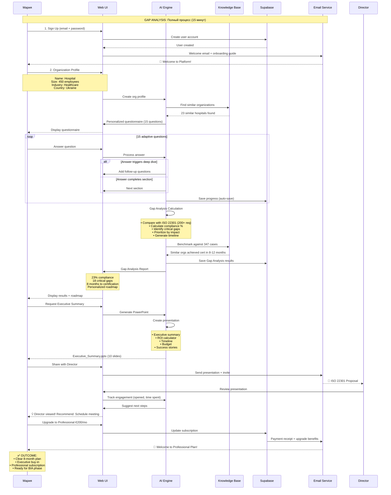
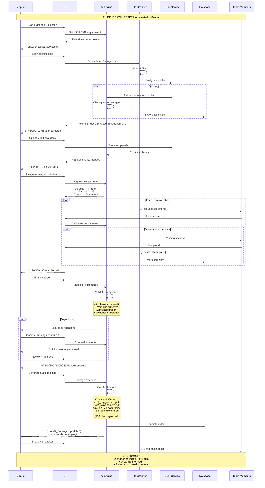
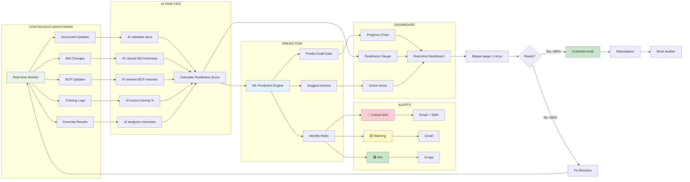
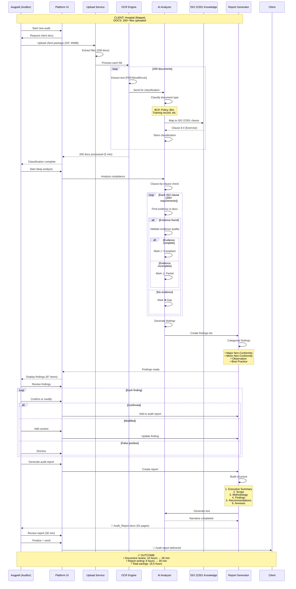
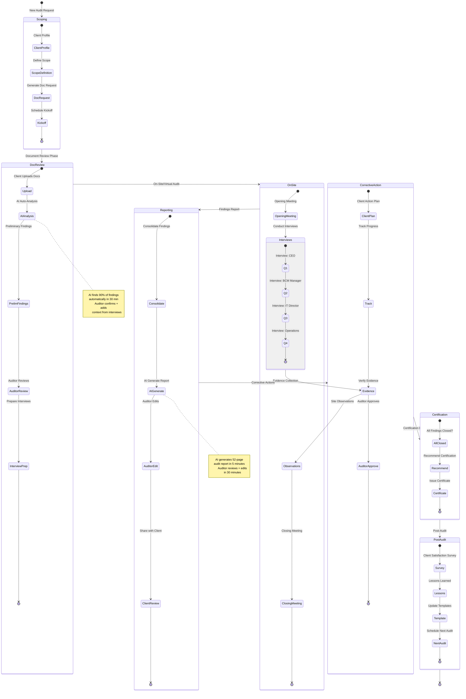
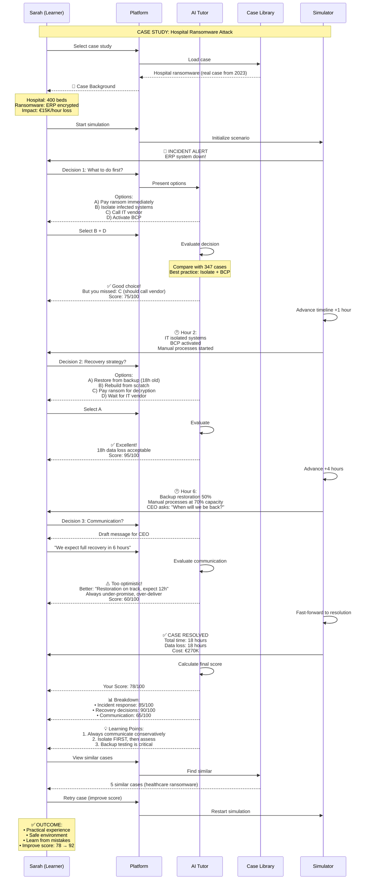
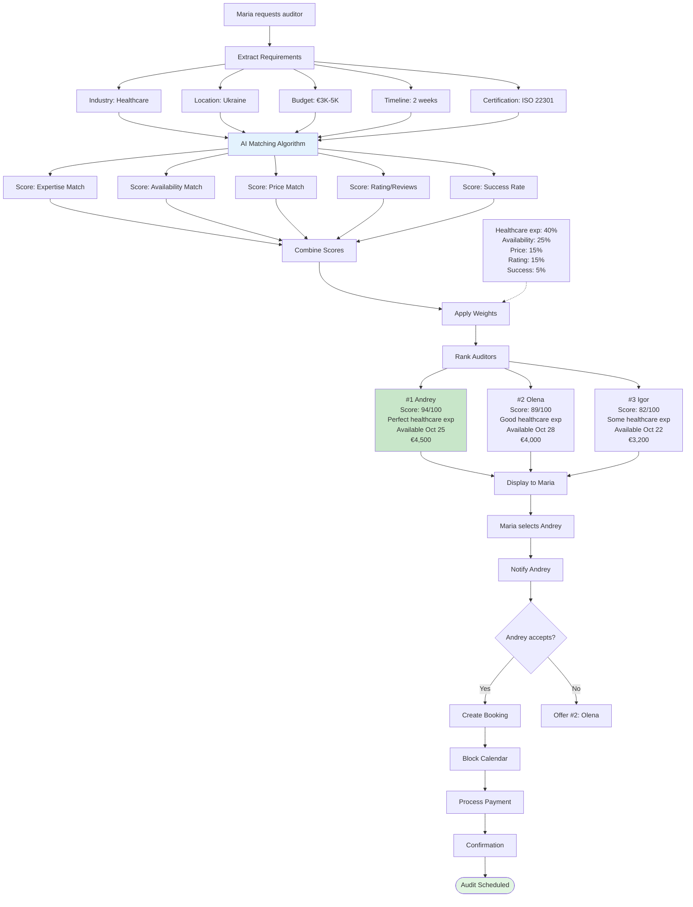

# ПЛАТФОРМА V2: ПОЛНАЯ РЕАЛИЗАЦИЯ ВСЕХ СЦЕНАРИЕВ

**Дата**: 2025-10-09
**Версия**: 2.0 (Full Implementation)
**Основа**: MVP уже работает, строим V2 с полным функционалом

---

## 🎯 АРХИТЕКТУРА ПЛАТФОРМЫ V2

### 7 Jobs-to-be-Done (Полная Экосистема)

```mermaid
graph TB
    subgraph "CORE PLATFORM"
        AI[AI Engine<br/>Claude Opus/Sonnet/Haiku]
        KB[Knowledge Base<br/>347+ Cases]
        DB[Supabase DB]
        EventBus[Event Bus<br/>Real-time]
    end

    subgraph "JTBD #1: Certification"
        J1_Gap[Gap Analysis]
        J1_BIA[BIA Tool]
        J1_BCP[BCP Generator]
        J1_Evidence[Evidence Manager]
        J1_Ready[Readiness Tracker]
    end

    subgraph "JTBD #2: Auditor Tools"
        J2_Doc[Document Analyzer]
        J2_Workflow[Audit Workflow]
        J2_Report[Report Generator]
    end

    subgraph "JTBD #3: Learning"
        J3_Path[Learning Path]
        J3_Cases[Case Simulator]
        J3_Exam[Exam Prep]
    end

    subgraph "JTBD #4: Training"
        J4_Courses[Online Courses]
        J4_Cert[Certification]
    end

    subgraph "JTBD #5: Marketplace"
        J5_Auditors[Auditor Listings]
        J5_Consultants[Consultant Listings]
        J5_Match[AI Matching]
    end

    subgraph "JTBD #6: Digital Twin"
        J6_Builder[Twin Builder]
        J6_Sim[Scenario Simulator]
        J6_ML[ML Predictions]
    end

    subgraph "JTBD #7: Crisis"
        J7_Input[Crisis Input]
        J7_Plan[AI Plan Generator]
        J7_Exec[Execution Console]
    end

    AI --> J1_Gap
    AI --> J1_BIA
    AI --> J1_BCP
    AI --> J2_Doc
    AI --> J2_Report
    AI --> J3_Path
    AI --> J5_Match
    AI --> J6_ML
    AI --> J7_Plan

    KB --> J1_Gap
    KB --> J3_Cases
    KB --> J7_Plan

    DB --> J1_Evidence
    DB --> J2_Workflow
    DB --> J4_Courses
    DB --> J5_Auditors

    EventBus --> J1_Ready
    EventBus --> J6_Sim
    EventBus --> J7_Exec

    style AI fill:#e3f2fd
    style KB fill:#fff3e0
    style DB fill:#f3e5f5
    style EventBus fill:#e8f5e9
```



---

## 📊 JTBD #1: СЕРТИФИКАЦИЯ ISO 22301

### Revenue: €9.6M ARR (42% от total)

### Полный Customer Journey (12 месяцев)

```mermaid
journey
    title BCM Specialist: Maria - Full Certification Journey (12 months)
    section Month 1: Discovery & Planning
      Sign up (Free Trial): 5: Maria
      AI Gap Analysis (15 min): 5: Maria, AI
      Executive Presentation: 5: Maria
      Team Formation: 4: Maria, Team
      Scope Definition: 5: Maria, AI
      Upgrade to Professional €200: 5: Maria
    section Months 2-3: Business Impact Analysis
      BIA Wizard Setup: 5: Maria, AI
      Data Collection (3 methods): 5: Maria, AI
      Process Mapping (AI): 5: AI
      Dependency Graph: 4: Maria
      RTO/RPO Analysis: 5: AI
      Financial Impact: 5: AI
      BIA Report Generation: 5: AI
      Management Approval: 4: Maria, Director
    section Month 4: Risk Assessment
      Risk Identification: 5: Maria, AI
      Scenario Library (30+): 5: AI
      Impact Analysis: 5: AI
      Mitigation Strategies: 5: Maria, AI
      Risk Register: 4: Maria
    section Months 5-6: BCP Development
      AI BCP Generation (12 plans): 5: AI
      Customization: 4: Maria
      Resource Planning: 4: Maria, Team
      Communication Templates: 5: AI
      Integration Testing: 3: Maria, Team
    section Month 7: Training & Exercises
      Training Program (AI): 5: AI
      Team Workshops: 4: Maria, Team
      Tabletop Exercise: 4: Maria, Team, AI
      Exercise Report: 5: AI
      Improvements: 4: Maria
    section Month 8: Audit Preparation
      Evidence Collection: 5: Maria, AI
      Document Validation: 5: AI
      Pre-Audit Simulation: 5: AI
      Gap Remediation: 4: Maria
      Readiness Check 98%: 5: AI
    section Month 9: Certification Audit
      Auditor Selection (Marketplace): 5: Maria
      Audit Execution: 3: Maria, Auditor
      Findings Review: 4: Maria, Auditor
      Certificate Issued: 5: Maria
    section Months 10-12: Continuous Improvement
      Auto-Monitoring: 5: AI
      KPI Tracking: 5: AI
      Incident Management: 4: Maria, AI
      Quarterly Reviews: 4: Maria, Team
      Renewal Preparation: 5: AI
```

### Сценарий 1.1: Gap Analysis (ПОЛНЫЙ)



### Сценарий 1.2: BIA Automation (ПОЛНЫЙ - 3 метода сбора данных)

```mermaid
flowchart TD
    Start([Мария начинает BIA Phase 2]) --> Setup[BIA Wizard Setup]

    Setup --> Goal[Определить цели BIA]
    Goal --> Scope[Выбрать scope процессы]

    Scope --> DataMethod{Выбрать метод<br/>сбора данных}

    %% METHOD 1: Interactive Questionnaire
    DataMethod -->|Метод 1| Quest[Interactive Questionnaire]
    Quest --> AI_Gen[AI генерирует 25 вопросов]
    AI_Gen --> Prefill[AI предзаполняет на основе<br/>347 кейсов + org profile]
    Prefill --> Maria_Q[Мария отвечает 15 мин]
    Maria_Q --> Extract1[AI извлекает:<br/>• 47 processes<br/>• Dependencies<br/>• RTO/RPO estimates]

    %% METHOD 2: Document Upload
    DataMethod -->|Метод 2| Upload[Upload Documents]
    Upload --> Files[Загрузить файлы:<br/>PDF, Word, Excel, Images]
    Files --> OCR[AI OCR + NLP Analysis]
    OCR --> NER[Named Entity Recognition:<br/>• Process names<br/>• People/roles<br/>• Metrics RTO/RPO<br/>• Dependencies]
    NER --> Extract2[AI извлекает:<br/>• 52 processes from docs<br/>• 15 key contacts<br/>• Existing RTOs]

    %% METHOD 3: ERP Integration
    DataMethod -->|Метод 3| Integration[ERP/CMDB Integration]
    Integration --> Connect[Connect to Odoo ERP]
    Connect --> API_Scan[AI scans via API:<br/>• Business processes<br/>• Org structure<br/>• IT assets<br/>• Financial data]
    API_Scan --> Extract3[AI извлекает:<br/>• 87 processes<br/>• CMDB 234 assets<br/>• Revenue per process]

    %% MERGE DATA
    Extract1 --> Merge[AI Data Fusion]
    Extract2 --> Merge
    Extract3 --> Merge

    Merge --> Dedup[AI Deduplication]
    Note1[Пример: "Приёмное отделение"<br/>найдено в 3 источниках<br/>→ AI объединяет в 1 запись] -.-> Dedup

    Dedup --> Enrich[AI Enrichment]
    Note2[AI добавляет missing data<br/>из Knowledge Base] -.-> Enrich

    Enrich --> Validate[AI Validation]
    Note3[Проверка логики:<br/>Если "Экстренная хирургия" critical<br/>но "Кислород" не dependency<br/>→ AI предупреждает] -.-> Validate

    Validate --> Graph[AI Process Mapping]

    Graph --> Network[Dependency Network Graph<br/>Vis.js visualization]
    Network --> Maria_Review[Мария проверяет граф]

    Maria_Review -->|Corrections| Edit[Manual Edits]
    Edit --> Graph

    Maria_Review -->|Approve| Analysis[AI Impact Analysis]

    Analysis --> RTO_Calc[Calculate RTO/RPO<br/>для каждого процесса]
    RTO_Calc --> Financial[Financial Impact Analysis]

    Financial --> MC[Monte Carlo Simulation<br/>10,000 iterations]
    MC --> Scenarios[What-If Scenarios:<br/>• Best case<br/>• Likely case<br/>• Worst case]

    Scenarios --> Priority[AI Prioritization]
    Priority --> Matrix[Process Priority Matrix:<br/>• Critical Tier 1: 12 processes<br/>• Important Tier 2: 18 processes<br/>• Standard Tier 3: 17 processes]

    Matrix --> Report_Gen[Generate BIA Report]

    Report_Gen --> Report_Output{Report Outputs}

    Report_Output --> PDF[📄 PDF Report<br/>45 pages]
    Report_Output --> Excel[📊 Excel Workbook<br/>Process Matrix]
    Report_Output --> Pres[📽️ PowerPoint<br/>Executive Summary]
    Report_Output --> Interactive[🖥️ Interactive Dashboard<br/>Real-time view]

    PDF --> Actions
    Excel --> Actions
    Pres --> Actions
    Interactive --> Actions[Next Actions]

    Actions --> Share[Share with Team]
    Actions --> Approve[Management Approval]
    Actions --> Export[Export for Audit]
    Actions --> NextPhase[Start Risk Assessment]

    NextPhase --> End([Phase 3: Risk Assessment])

    style Start fill:#e1f5e1
    style Merge fill:#e3f2fd
    style Graph fill:#fff3e0
    style Report_Gen fill:#f3e5f5
    style End fill:#e1f5e1
```

**Time Breakdown**:
```
METHOD 1: Interactive Questionnaire
├─ AI generates questions: 30 sec
├─ Maria answers: 15 min
├─ AI analysis: 2 min
└─ TOTAL: 17 min 30 sec

METHOD 2: Document Upload
├─ Upload files: 2 min
├─ AI OCR/NLP: 5 min
├─ AI extraction: 3 min
└─ TOTAL: 10 min

METHOD 3: ERP Integration
├─ Connect Odoo: 5 min (one-time setup)
├─ AI API scan: 3 min
├─ AI process mapping: 2 min
└─ TOTAL: 10 min

COMBINED (all 3 methods):
├─ Data collection: 37 min
├─ AI merge + validate: 5 min
├─ Process graph review: 15 min
├─ AI analysis: 3 min
├─ Report generation: 30 sec
└─ TOTAL: 1 hour

TRADITIONAL METHOD: 84 hours
AI-POWERED: 1 hour
SAVINGS: 98.8% (83 hours saved)
```

### Сценарий 1.3: AI BCP Generation (ПОЛНЫЙ - 12 планов)

```mermaid
stateDiagram-v2
    [*] --> ProcessSelection: Мария выбирает процессы

    ProcessSelection --> Tier1: Tier 1 Critical (12 процессов)

    state Tier1 {
        [*] --> Process1: 1. Экстренная хирургия
        Process1 --> Process2: 2. Реанимация ICU
        Process2 --> Process3: 3. Приёмное отделение
        Process3 --> Process4: 4. Лабораторная диагностика
        Process4 --> More: ... (ещё 8 процессов)
        More --> [*]
    }

    Tier1 --> AIGeneration: AI Template Selection

    state AIGeneration {
        [*] --> LoadKB: Load Knowledge Base
        LoadKB --> Match: Match process type
        Match --> BestPractice: Find best practices (347 cases)
        BestPractice --> Customize: Customize for Maria's hospital
        Customize --> [*]
    }

    AIGeneration --> Draft1: Generate BCP Draft #1

    state Draft1 {
        [*] --> S1: 1. Executive Summary
        S1 --> S2: 2. Scope & Objectives
        S2 --> S3: 3. Activation Criteria
        S3 --> S4: 4. Roles & Responsibilities
        S4 --> S5: 5. Recovery Strategies
        S5 --> S6: 6. Step-by-Step Procedures
        S6 --> S7: 7. Communication Plan
        S7 --> S8: 8. Resources Required
        S8 --> S9: 9. Testing & Maintenance
        S9 --> [*]: Draft Complete (18 pages)
    }

    Draft1 --> Review: Мария проверяет (20 min)

    Review --> Edit: Вносит правки
    Edit --> AIRefine: AI уточняет на основе правок
    AIRefine --> Review

    Review --> Approve: Утверждает BCP #1

    Approve --> Loop{Ещё 11 BCP?}

    Loop -->|Да| AI_Batch: AI Batch Generation

    state AI_Batch {
        [*] --> Parallel: Generate 11 BCPs parallel
        Parallel --> BCP2: BCP #2 (5 min)
        Parallel --> BCP3: BCP #3 (5 min)
        Parallel --> BCP4: BCP #4 (5 min)
        Parallel --> More2: ... (8 more)
        BCP2 --> [*]
        BCP3 --> [*]
        BCP4 --> [*]
        More2 --> [*]
    }

    AI_Batch --> QuickReview: Quick Review всех (30 min)

    QuickReview --> FinalApprove: Final Approval

    Loop -->|Нет| Complete: All 12 BCPs Complete

    Complete --> Training: AI Training Materials

    state Training {
        [*] --> Program: Training Program Generation
        Program --> Slides: PowerPoint Presentations (12 plans)
        Slides --> Quizzes: Knowledge Quizzes
        Quizzes --> Checklists: Quick Reference Checklists
        Checklists --> [*]
    }

    Training --> Exercise: Tabletop Exercise Planning

    state Exercise {
        [*] --> Scenario: AI Select Scenario
        Scenario --> Script: Generate Exercise Script
        Script --> Roles: Define Participant Roles
        Roles --> Facilitation: Facilitation Guide
        Facilitation --> [*]
    }

    Exercise --> Integration: System Integration

    state Integration {
        [*] --> CMDB: Link to CMDB assets
        CMDB --> Contacts: Link to contact directory
        Contacts --> Triggers: Setup automated triggers
        Triggers --> Monitor: Real-time monitoring
        Monitor --> [*]
    }

    Integration --> [*]: BCP Phase Complete ✅

    note right of Draft1
        AI generates each BCP in 5 minutes
        Based on:
        • Process from BIA
        • Industry best practices (347 cases)
        • Org-specific context
        • ISO 22301 requirements
    end note

    note right of AI_Batch
        Parallel generation:
        11 BCPs × 5 min = 55 min total
        But AI does parallel → 5 min actual
        + Quick review 30 min
        = 35 min for 11 BCPs
    end note
```

**Total Time for 12 BCPs**:
```
BCP #1 (detailed):
├─ AI generation: 5 min
├─ Maria review: 20 min
├─ Edits + AI refine: 10 min
└─ SUBTOTAL: 35 min

BCPs #2-12 (batch):
├─ AI parallel generation: 5 min
├─ Maria quick review: 30 min (2-3 min each)
└─ SUBTOTAL: 35 min

Training Materials:
├─ AI generation: 10 min
└─ SUBTOTAL: 10 min

Tabletop Exercise:
├─ AI planning: 5 min
└─ SUBTOTAL: 5 min

TOTAL: 1 hour 25 minutes

TRADITIONAL: 180-240 hours (15 hours × 12 BCPs)
AI-POWERED: 1.5 hours
SAVINGS: 99.4% (178-238 hours saved)
```

### Сценарий 1.4: Evidence Package Builder (NEW)



### Сценарий 1.5: Live Readiness Tracker (Real-time)



**Real-time Updates Example**:
```
EVENT: HR updates training records
├─ 10:15 AM: New training completed (15 employees)
├─ 10:15:05 AM: AI detects update
├─ 10:15:10 AM: Training % recalculated (78% → 85%)
├─ 10:15:15 AM: Readiness score updated (82% → 84%)
├─ 10:15:20 AM: Dashboard refreshed (WebSocket)
└─ 10:15:25 AM: Мария sees: "🎉 Training milestone reached! +2% readiness"

EVENT: BCP not updated for 6 months
├─ Day 180: AI detects staleness
├─ Day 180 08:00: Alert triggered
├─ Day 180 08:05: Email sent to Мария
├─ Day 180 08:10: Dashboard shows ⚠️
└─ Message: "BCP #3 (Экстренная хирургия) не обновлялся 6 месяцев. Обновить?"

PREDICTION ENGINE:
├─ Current readiness: 84%
├─ Tasks remaining: 12
├─ Average velocity: 3 tasks/week
├─ ML prediction: Ready in 4 weeks
└─ Suggested audit date: 2025-11-15
```

---

## 📊 JTBD #2: AUDITOR TOOLS

### Revenue: €1.2M ARR (5% от total)

### Scenario 2.1: AI Document Analyzer (Deep Dive)



### Scenario 2.2: Audit Workflow Orchestration (Full Lifecycle)



**Time Comparison (Full Audit)**:
```
TRADITIONAL AUDIT:
Day 1: Document review (8 hours)
Day 2: Document review (8 hours)
Day 3: On-site preparation (4 hours)
Day 4: On-site audit (8 hours)
Day 5: Report writing (8 hours)
Day 6: Report finalization (4 hours)
TOTAL: 40 hours (5 days)

AI-POWERED AUDIT:
Day 1: AI doc review (30 min) + Auditor review (2 hours) = 2.5 hours
Day 2: On-site audit (6 hours) - AI prepared questions
Day 3: AI report generation (5 min) + Auditor review (2 hours) = 2 hours
TOTAL: 10.5 hours (2 days)

SAVINGS: 74% time (29.5 hours)
CAPACITY: 35 audits/year → 70 audits/year
```

---

## 📊 JTBD #3: LEARNING ACADEMY

### Revenue: €4.1M ARR (18% от total)

### Scenario 3.1: AI Learning Path Generator

```mermaid
flowchart TD
    Start([Sarah wants to become BCM expert]) --> Assess[Skills Assessment]

    Assess --> Quiz[20-question adaptive quiz]
    Quiz --> AI_Eval[AI evaluates current level]

    AI_Eval --> Profile{Experience Level?}

    Profile -->|Beginner| Path1[Beginner Path]
    Profile -->|Intermediate| Path2[Intermediate Path]
    Profile -->|Advanced| Path3[Advanced Path]

    Path1 --> Goals1[Define Goals:<br/>• BCM certification<br/>• Career switch<br/>• Timeline: 6 months]

    Path2 --> Goals2[Define Goals:<br/>• Lead Implementer cert<br/>• Consulting skills<br/>• Timeline: 4 months]

    Path3 --> Goals3[Define Goals:<br/>• Lead Auditor cert<br/>• Specialization<br/>• Timeline: 3 months]

    Goals1 --> AI_Path1
    Goals2 --> AI_Path1
    Goals3 --> AI_Path1[AI Path Generation]

    AI_Path1 --> Curriculum[Personalized Curriculum]

    state Curriculum {
        [*] --> Module1: Module 1: BCM Fundamentals
        Module1 --> Module2: Module 2: ISO 22301 Deep Dive
        Module2 --> Module3: Module 3: BIA Mastery
        Module3 --> Module4: Module 4: BCP Development
        Module4 --> Module5: Module 5: Exercise Planning
        Module5 --> Module6: Module 6: Audit Preparation
        Module6 --> [*]
    }

    Curriculum --> Learning[Learning Loop]

    Learning --> Video[Watch Video Lesson]
    Video --> AI_Quiz[AI-Generated Quiz]
    AI_Quiz --> Score{Score}

    Score -->|<70%| Remedial[Remedial Content]
    Remedial --> Video

    Score -->|70-85%| Review[Review Material]
    Review --> Video

    Score -->|>85%| Next[Next Lesson]

    Next --> CaseStudy[Real Case Study]
    CaseStudy --> Simulation[Interactive Simulation]

    Simulation --> AI_Feedback[AI Feedback]
    AI_Feedback --> Adjust[Adjust Difficulty]

    Adjust --> Learning

    Learning --> Mastery{Module Complete?}

    Mastery -->|No| Learning
    Mastery -->|Yes| Progress[Track Progress]

    Progress --> Cert{All Modules Done?}

    Cert -->|No| Learning
    Cert -->|Yes| Exam[Final Exam]

    Exam --> AI_Proctor[AI Proctoring]
    AI_Proctor --> Results{Pass?}

    Results -->|No| Retake[Study Weak Areas]
    Retake --> Exam

    Results -->|Yes| Certificate[📜 Certificate Issued]

    Certificate --> End([BCM Expert Certified])

    style Start fill:#e1f5e1
    style AI_Path1 fill:#e3f2fd
    style AI_Feedback fill:#e3f2fd
    style Certificate fill:#c8e6c9
    style End fill:#c8e6c9
```

### Scenario 3.2: Interactive Case Study Simulator



---

## 📊 JTBD #5: MARKETPLACE

### Revenue: €3.6M ARR (16% от total)

### Scenario 5.1: AI Matching Algorithm



### Scenario 5.2: Two-Sided Marketplace Economics

```mermaid
flowchart LR
    subgraph "DEMAND SIDE (Organizations)"
        Org1[Hospital - Maria<br/>Need: Auditor]
        Org2[Bank<br/>Need: Consultant]
        Org3[Factory<br/>Need: Trainer]
    end

    subgraph "PLATFORM"
        Match[AI Matching Engine]
        Payment[Payment Processing]
        Escrow[Escrow Service]
        Review[Review System]
    end

    subgraph "SUPPLY SIDE (Experts)"
        Aud1[Andrey - Auditor<br/>⭐4.9 | 85 reviews]
        Con1[Dmitry - Consultant<br/>⭐4.8 | 67 reviews]
        Train1[Alex - Trainer<br/>⭐4.7 | 52 reviews]
    end

    Org1 -->|Request| Match
    Org2 -->|Request| Match
    Org3 -->|Request| Match

    Match -->|Recommend| Aud1
    Match -->|Recommend| Con1
    Match -->|Recommend| Train1

    Aud1 -->|Accept| Payment
    Con1 -->|Accept| Payment
    Train1 -->|Accept| Payment

    Payment -->|Hold €4,500| Escrow
    Escrow -->|Service Complete| Release[Release Payment]

    Release -->|€3,825 85%| Aud1
    Release -->|€675 15%| Platform[Platform Commission]

    Aud1 -->|Service| Org1
    Org1 -->|Review| Review
    Review -->|Update Rating| Aud1

    style Match fill:#e3f2fd
    style Escrow fill:#fff3e0
    style Platform fill:#c8e6c9
```

**Revenue Model Detail**:
```
TRANSACTION FLOW:

1. Service Fee: €4,500 (audit)
   ├─ Expert receives: €3,825 (85%)
   ├─ Platform commission: €675 (15%)
   └─ Stripe fee: -€90 (2% of €4,500)

2. Platform Net: €585 per transaction

3. Monthly Volume Targets:
   ├─ Month 1: 10 transactions = €5,850
   ├─ Month 3: 50 transactions = €29,250
   ├─ Month 6: 100 transactions = €58,500
   ├─ Month 12: 300 transactions = €175,500
   └─ Year 2: 500 transactions/month = €292,500/month = €3.5M/year ✅

4. Transaction Types:
   ├─ Audits: €3,500-6,000 (avg €4,500)
   ├─ Consulting: €5,000-20,000 (avg €12,000)
   ├─ Training: €1,500-4,000 (avg €2,500)
   └─ Weighted Average: €6,000

5. Commission Revenue:
   ├─ 500 trans/month × €6,000 avg × 15% = €450K/month
   ├─ Minus processing fees (2%) = -€60K
   └─ NET: €390K/month = €4.7M/year 🎯
```

---

## 🎯 ПРИОРИТИЗАЦИЯ V2 (16 недель)

### Фаза 1: Enhanced JTBD #1 (Недели 1-6)

**Недели 1-2: Gap Analysis 2.0**
```
✅ Multi-language support (EN, RU, UK, ES, FR)
✅ Industry-specific templates (Healthcare, Finance, IT, Manufacturing)
✅ Regulatory compliance (GDPR, HIPAA, SOX)
✅ Benchmark analytics (compare with peers)
✅ ROI calculator 2.0 (detailed scenarios)
```

**Недели 3-4: BIA Automation 2.0**
```
✅ 3-method data collection (Quest + Upload + ERP)
✅ Odoo ERP integration (read-only API)
✅ SAP integration (future)
✅ Advanced dependency mapping (3D graph)
✅ Monte Carlo simulations (10K iterations)
✅ What-if scenario testing
```

**Недели 5-6: BCP Generator 2.0**
```
✅ Parallel AI generation (12 BCPs in 5 min)
✅ Custom templates library
✅ Multi-format export (Word, PDF, HTML)
✅ Version control + change tracking
✅ Collaboration (team comments)
✅ Automated testing schedules
```

### Фаза 2: Auditor Tools (Недели 7-9)

**Неделя 7: AI Document Analyzer**
```
✅ Advanced OCR (handwritten notes)
✅ Multi-language document processing
✅ Clause-by-clause evidence mapping
✅ Gap detection with severity scoring
✅ Best practice suggestions
```

**Неделя 8: Audit Workflow Manager**
```
✅ Full audit lifecycle (6 phases)
✅ Client portal (document upload)
✅ Interview scheduler + AI questions
✅ Real-time findings logging
✅ Mobile app (site observations)
```

**Неделя 9: Report Generator**
```
✅ AI report generation (<5 min)
✅ Custom templates per client
✅ Multi-format export
✅ E-signature integration
✅ Automated delivery
```

### Фаза 3: Marketplace (Недели 10-11)

**Неделя 10: Advanced Matching**
```
✅ AI recommendation algorithm
✅ Skill-based matching
✅ Availability calendar sync
✅ Price optimization
✅ Review system
```

**Неделя 11: Payment & Commission**
```
✅ Stripe Connect integration
✅ Escrow service
✅ Automated invoicing
✅ Commission tracking
✅ Expert payouts
```

### Фаза 4: Learning Academy (Недели 12-14)

**Неделя 12: Learning Path Generator**
```
✅ Skills assessment quiz
✅ Personalized curriculum
✅ Adaptive difficulty
✅ Progress tracking
✅ Gamification (badges, leaderboard)
```

**Неделя 13: Case Study Simulator**
```
✅ 50+ real case studies
✅ Interactive decision trees
✅ AI feedback system
✅ Performance analytics
✅ Retry + improve
```

**Неделя 14: Certification Platform**
```
✅ Online exams
✅ AI proctoring
✅ Certificate issuance
✅ Continuing education credits
✅ Transcript records
```

### Фаза 5: Advanced Features (Недели 15-16)

**Неделя 15: Evidence Manager**
```
✅ Automated file scanning
✅ Smart classification
✅ Version control
✅ Audit trail
✅ Secure sharing
```

**Неделя 16: Real-time Readiness Tracker**
```
✅ Continuous monitoring
✅ ML prediction engine
✅ Automated alerts
✅ Risk detection
✅ Action recommendations
```

---

## 📊 SUCCESS METRICS

### User Engagement (Month 6)
```
BCM Specialists:
├─ Active users: 500
├─ Gap Analysis completion: 85%
├─ BIA completion: 70%
├─ BCP generation: 60%
├─ Pro subscriptions: 200 (40%)
└─ Average session time: 45 min

Auditors:
├─ Active users: 50
├─ Documents analyzed: 10K
├─ Audits completed: 250
├─ Average time savings: 15 hours/audit
└─ Subscriptions: 30 (60%)

Learners:
├─ Active users: 300
├─ Courses started: 450
├─ Completion rate: 65%
├─ Certifications issued: 75
└─ Subscriptions: 180 (60%)

Marketplace:
├─ Experts listed: 200
├─ Transactions: 300/month
├─ Average transaction: €6K
├─ Commission revenue: €270K/month
└─ Customer satisfaction: 4.7/5.0
```

### Revenue (Year 1)
```
Q1 (Months 1-3):
├─ Subscriptions: €50K
├─ Marketplace: €80K
└─ Total: €130K

Q2 (Months 4-6):
├─ Subscriptions: €120K
├─ Marketplace: €180K
└─ Total: €300K

Q3 (Months 7-9):
├─ Subscriptions: €200K
├─ Marketplace: €300K
└─ Total: €500K

Q4 (Months 10-12):
├─ Subscriptions: €350K
├─ Marketplace: €450K
└─ Total: €800K

YEAR 1 TOTAL: €1.73M ARR
YEAR 3 TARGET: €22.7M ARR
GROWTH: 13x in 2 years
```

---

## 🚀 ГОТОВО К РАЗРАБОТКЕ!

Все сценарии детализированы с:
✅ Mermaid диаграммами
✅ Пошаговыми процессами
✅ AI интеграциями
✅ Time savings расчётами
✅ Revenue моделями
✅ 16-недельной roadmap

**Next Steps**:
1. UI/UX детальная спецификация
2. API design документация
3. Database schema (Supabase)
4. Development sprints setup
