# UI Redesign: Agent-Based Service-Driven Architecture

**Date**: 2025-10-09
**Version**: 2.0
**Status**: Design Specification
**Approach**: Multi-agent scenario-driven functional design

---

## 🎯 Проблема и Решение

### ❌ Текущая Проблема
- **UI = Dashboards**: Текущий интерфейс ориентирован на мониторинг и визуализацию
- **Нет бизнес-логики**: Страницы показывают статистику, но не реализуют сервисные процессы
- **Разрыв с документацией**: 150+ сценариев описаны, но не реализованы
- **Нет AI-функций**: AI/ML возможности ядра не используются в UI

**Пример из кода**:
```typescript
// dashboard/page.tsx - ТОЛЬКО дашборд
<StatCard title="BIA Assessments" value={12} />
<StatCard title="Active Risks" value={8} />

// bia/page.tsx - ТОЛЬКО список карточек
<BIACard assessment={assessment} />
// НЕТ 6-шагового визарда, НЕТ AI-ассистента
```

### ✅ Новый Подход: Service-Driven UI
- **Агентская архитектура**: Каждый модуль = агент, описывающий сервис
- **Ориентация на сценарии**: 150+ сценариев → UI workflows
- **Использование ядра**: 14 AI-специалистов, ML-модели, предсказания
- **Бизнес-процессы**: Для каждой целевой группы свой процесс взаимодействия
- **Диаграммы**: Mermaid для визуализации потоков и размещения функций

---

## 🤖 Агентская Архитектура

### Принцип работы агентов:
Каждый **Agent-Module** описывает:
1. **Целевые группы пользователей** и их цели
2. **Бизнес-процессы взаимодействия** (что пользователь делает)
3. **Сервисы платформы** (что платформа делает для пользователя)
4. **Сценарии использования** из документации
5. **Intelligent Core функции** (AI, ML, предсказания)
6. **UI Layout** с размещением функций (через диаграммы)

### 6 Основных Агентов:

| Agent ID | Module | Scenarios | Target Groups | Core AI Features |
|----------|--------|-----------|---------------|------------------|
| **AGENT-BIA** | Business Impact Analysis | 25 | BCM Manager, Consultant, Auditor | RAG, ML RTO/RPO, Auto-discovery |
| **AGENT-RISK** | Risk Management | 22 | Risk Manager, Executive, Compliance | ML Risk Scoring, Predictive Analytics |
| **AGENT-PLANS** | BC Plans | 20 | BCM Coordinator, IT Manager | AI Plan Generation, Digital Twin |
| **AGENT-EXERCISES** | Exercises & Testing | 18 | Exercise Coordinator, Crisis Team | Scenario AI, Digital Twin Simulation |
| **AGENT-COMPLIANCE** | ISO 22301 Compliance | 15 | Compliance Officer, Auditor | Gap Analysis AI, ISO Specialist |
| **AGENT-CRISIS** | Crisis Management | 12 | Crisis Commander, Response Team | Real-time AI Commander, Collaboration |

**Итого**: 112+ core scenarios (остальные - интеграционные и поддерживающие)

---

## 📊 AGENT-BIA: Business Impact Analysis Service

### 🎯 Target User Groups

| Group | Role | Goals | Pain Points |
|-------|------|-------|-------------|
| **BCM Manager** | Conducts BIA | Complete BIA in 4 weeks (vs 12) | Manual interviews, RTO/RPO uncertainty |
| **Business Consultant** | Advises clients | Provide evidence-based recommendations | Lack of industry benchmarks |
| **Internal Auditor** | Validates BIA | Ensure ISO 22301 compliance | Inconsistent methodology |

### 🔄 Business Process Interaction

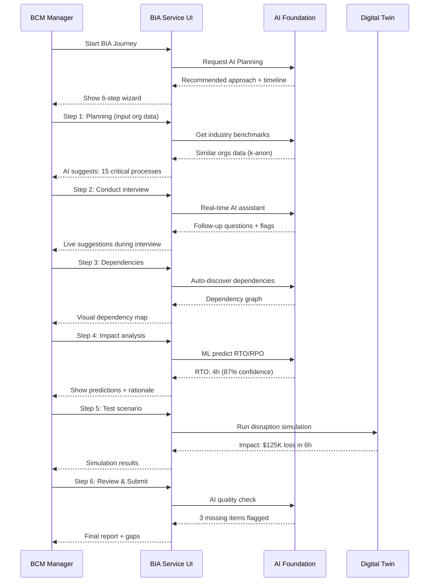

### 🧩 25 BIA Scenarios → UI Functions

| # | Scenario | UI Component | Page Location | AI Feature |
|---|----------|--------------|---------------|------------|
| 1 | **AI-Assisted BIA Planning** | Planning Wizard Step 1 | `/bia/new` | RAG: Industry benchmarks |
| 2 | **Process Selection with AI** | Process Checklist | `/bia/new/step-2` | ML: Critical process prediction |
| 3 | **Interview with Real-Time AI** | Interview Chat Interface | `/bia/new/step-3` | LLM: Follow-up questions |
| 4 | **Auto-Discover Dependencies** | Dependency Graph Viewer | `/bia/new/step-4` | Graph ML: Auto-discovery |
| 5 | **ML-Powered RTO/RPO Calc** | Impact Calculator | `/bia/new/step-5` | ML: Predict RTO/RPO (87% acc) |
| 6 | **Benchmark Against Industry** | Comparison Dashboard | `/bia/{id}/benchmark` | RAG: 347 cases query |
| 7 | **Digital Twin Simulation** | Simulation Runner | `/bia/{id}/simulate` | Digital Twin: Test impact |
| 8 | **Generate BIA Report** | Report Generator | `/bia/{id}/report` | AI: Auto-generate narrative |
| 9 | **Validate BIA Completeness** | Quality Checker | `/bia/{id}/validate` | AI: Gap detection |
| 10 | **Update BIA (Annual Review)** | Review Workflow | `/bia/{id}/review` | ML: Change detection |
| 11-25 | *See Appendix A* | - | - | - |

### 🖼️ UI Layout: BIA Service Page

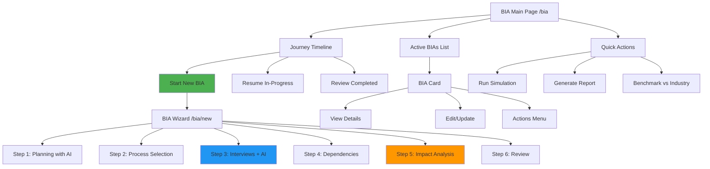

### 💻 UI Components (Service-Driven)

**НЕТ дашборда со статистикой!**

**ЕСТЬ сервисные компоненты**:

1. **BIAJourneyTimeline** (`/bia`)
   - Shows user's position in BIA process
   - Next recommended action (AI-driven)
   - Estimated time to completion

2. **BIAWizardPlanning** (`/bia/new/step-1`)
   ```typescript
   // NOT: <StatCard title="BIAs" value={12} />
   // YES:
   <AIPlanningSuggestions
     organizationProfile={profile}
     onSelectApproach={(approach) => startBIA(approach)}
   >
     <IndustryBenchmark source="347 cases" />
     <RecommendedTimeline estimate="4 weeks" />
     <CriticalProcessesSuggestion count={15} />
   </AIPlanningSuggestions>
   ```

3. **InterviewChatAssistant** (`/bia/new/step-3`)
   ```typescript
   <RealTimeAIChat
     interviewSession={session}
     onAnswer={(answer) => processWithAI(answer)}
   >
     <LiveSuggestions /> // AI follow-up questions
     <MissingInfoFlags /> // AI detects gaps
     <IndustryComparison /> // "Similar orgs said..."
   </RealTimeAIChat>
   ```

4. **DependencyAutoDiscovery** (`/bia/new/step-4`)
   ```typescript
   <DependencyGraphVisual
     processes={selectedProcesses}
     onAutoDiscover={() => aiDiscoverDependencies()}
   >
     <GraphMLEngine /> // Auto-detect relationships
     <ManualOverride /> // User can adjust
     <SimulateBreakage /> // What if this fails?
   </DependencyGraphVisual>
   ```

5. **MLImpactCalculator** (`/bia/new/step-5`)
   ```typescript
   <ImpactAnalysisWorkspace
     process={currentProcess}
     onCalculate={() => mlPredictRTO()}
   >
     <RTOPrediction confidence={0.87}>4 hours</RTOPrediction>
     <RPOPrediction confidence={0.85}>1 hour</RPOPrediction>
     <FinancialImpact estimate="$125K per 6h" />
     <Rationale source="ML model + 347 cases" />
   </ImpactAnalysisWorkspace>
   ```

6. **DigitalTwinSimulator** (`/bia/{id}/simulate`)
   ```typescript
   <SimulationRunner
     biaId={biaId}
     onRunSimulation={(scenario) => digitalTwin.simulate(scenario)}
   >
     <ScenarioBuilder /> // Select what fails
     <SimulationControls /> // Start/Stop/Speed
     <RealTimeResults /> // Impact timeline
     <WhatIfAnalysis /> // Test mitigation
   </SimulationRunner>
   ```

---

## 🎲 AGENT-RISK: Risk Management Service

### 🎯 Target User Groups

| Group | Role | Goals | Pain Points |
|-------|------|-------|-------------|
| **Risk Manager** | Owns risk register | Identify all risks, prioritize treatment | Subjective scoring, no predictions |
| **Executive** | Risk oversight | Understand top risks quickly | Too much data, no insights |
| **Compliance Officer** | ISO 22301 audit | Document risk treatment | Manual tracking |

### 🔄 Business Process Interaction

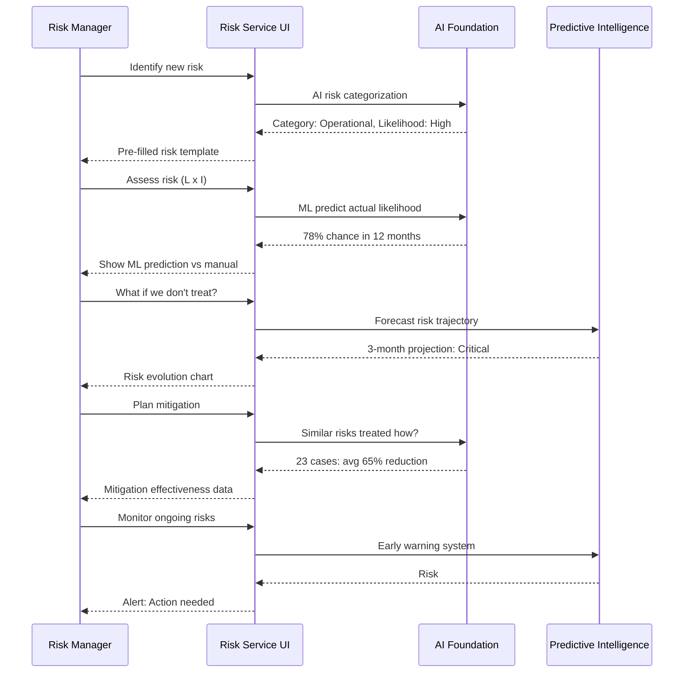

### 🧩 22 Risk Scenarios → UI Functions

| # | Scenario | UI Component | Page Location | AI Feature |
|---|----------|--------------|---------------|------------|
| 1 | **AI-Assisted Risk ID** | Risk Wizard | `/risk/new` | NLP: Extract from text |
| 2 | **ML Risk Scoring** | Likelihood Calculator | `/risk/new/assess` | ML: Predict probability |
| 3 | **Risk Heat Map (Live)** | Interactive Heat Map | `/risk/matrix` | Real-time filtering |
| 4 | **Risk Trajectory Forecast** | Forecast Chart | `/risk/{id}/forecast` | Predictive: 3-month projection |
| 5 | **Treatment Effectiveness** | Mitigation Planner | `/risk/{id}/mitigate` | RAG: 347 cases success rates |
| 6 | **Early Warning System** | Risk Monitoring Dashboard | `/risk/monitor` | ML: Detect likelihood changes |
| 7 | **Risk Dependencies** | Risk Dependency Graph | `/risk/dependencies` | Graph ML: Cascading risks |
| 8 | **Compliance Mapping** | ISO Clause Mapper | `/risk/{id}/compliance` | AI: Auto-map to ISO 22301 |
| 9-22 | *See Appendix B* | - | - | - |

### 🖼️ UI Layout: Risk Service Page

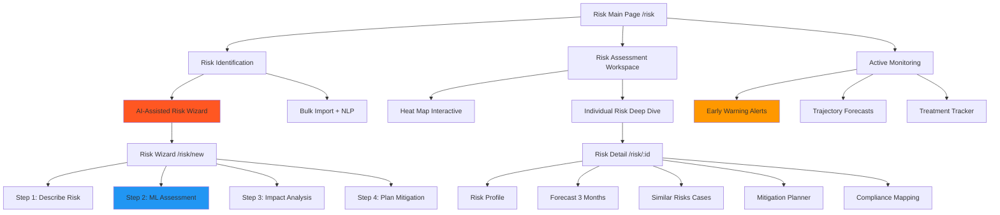

### 💻 UI Components (Service-Driven)

1. **RiskIdentificationWizard** (`/risk/new`)
   ```typescript
   <AIRiskWizard
     onIdentify={(description) => aiExtractRisk(description)}
   >
     <FreeTextInput placeholder="Describe the risk..." />
     <AIExtraction>
       Category: {aiPredicted.category}
       Likelihood: {aiPredicted.likelihood}
       Suggested Controls: {aiPredicted.controls}
     </AIExtraction>
     <ManualOverride /> // User can adjust
   </AIRiskWizard>
   ```

2. **MLRiskScoring** (`/risk/new/assess`)
   ```typescript
   <RiskScoringWorkspace
     risk={currentRisk}
     onScore={(manual) => compareWithML(manual)}
   >
     <ManualScoring>L: {userInput.likelihood} x I: {userInput.impact}</ManualScoring>
     <MLPrediction confidence={0.78}>
       Actual likelihood: 78% in 12 months
       Rationale: Based on 89 similar risks in 347 cases
     </MLPrediction>
     <ChooseScoring /> // Use manual or ML
   </RiskScoringWorkspace>
   ```

3. **InteractiveHeatMap** (`/risk/matrix`)
   ```typescript
   <RiskHeatMapLive
     risks={allRisks}
     onFilter={(criteria) => updateHeatMap(criteria)}
   >
     <Matrix5x5 /> // Likelihood x Impact
     <FilterPanel>
       <CategoryFilter />
       <StatusFilter />
       <DepartmentFilter />
     </FilterPanel>
     <RiskDetailPopup onHover={(risk) => showQuickView(risk)} />
     <BulkActions /> // Treat multiple risks
   </RiskHeatMapLive>
   ```

4. **RiskTrajectoryForecast** (`/risk/{id}/forecast`)
   ```typescript
   <ForecastChart
     riskId={riskId}
     onForecast={() => predictiveIntelligence.forecast(riskId)}
   >
     <CurrentState likelihood={0.78} />
     <Projection months={3}>
       Month 1: 0.82 (↑)
       Month 2: 0.88 (↑)
       Month 3: 0.95 (CRITICAL)
     </Projection>
     <WhatIfMitigation>
       With treatment: 0.45 (↓ 65%)
     </WhatIfMitigation>
   </ForecastChart>
   ```

5. **EarlyWarningMonitor** (`/risk/monitor`)
   ```typescript
   <RiskMonitoringCenter
     onDetectChange={() => mlDetectLikelihoodIncrease()}
   >
     <AlertFeed>
       🚨 Risk #42: Likelihood increased 15% (action needed)
       ⚠️  Risk #17: New dependency detected
       ✅ Risk #8: Treatment 70% effective (on track)
     </AlertFeed>
     <PredictiveAlerts confidence={0.85}>
       Risk #55 will become Critical in 6 weeks
     </PredictiveAlerts>
     <AutoRecommendations /> // AI suggests actions
   </RiskMonitoringCenter>
   ```

---

## 📋 AGENT-PLANS: BC Plans Service

### 🎯 Target User Groups

| Group | Role | Goals | Pain Points |
|-------|------|-------|-------------|
| **BCM Coordinator** | Writes BC plans | Create plans in 2 days (vs 2 weeks) | Starting from blank page |
| **IT Manager** | IT recovery plans | Ensure technical accuracy | Lack of IT-specific templates |
| **Executive** | Approves plans | Quick review and sign-off | 100-page documents |

### 🔄 Business Process Interaction

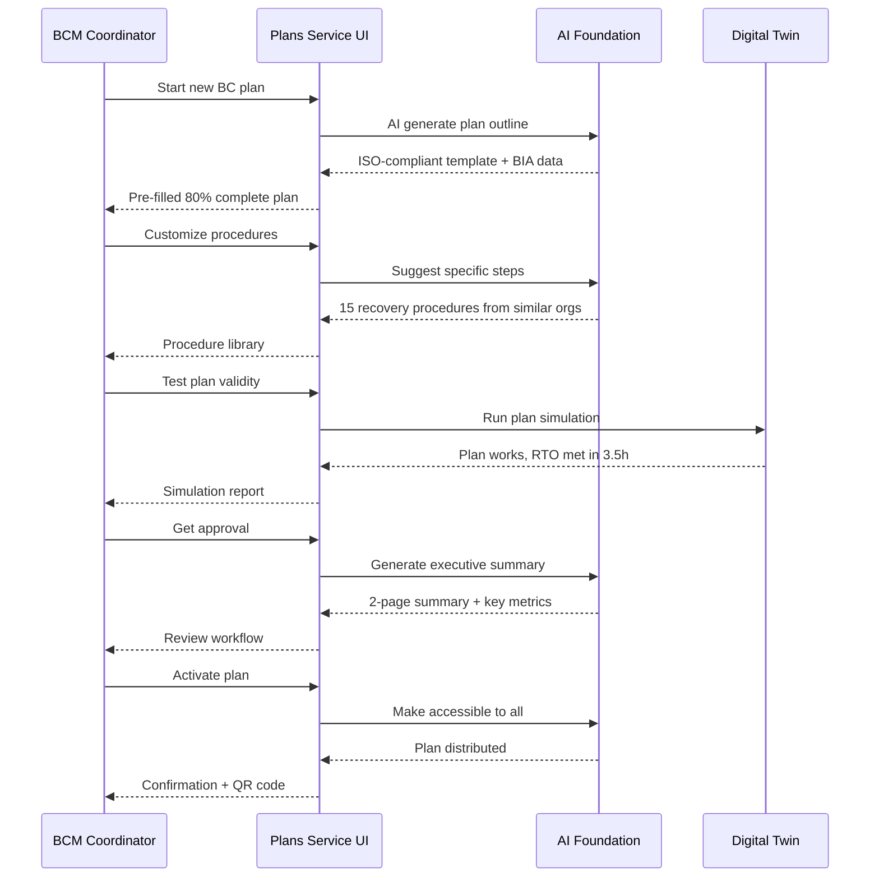

### 🧩 20 BC Plans Scenarios → UI Functions

| # | Scenario | UI Component | Page Location | AI Feature |
|---|----------|--------------|---------------|------------|
| 1 | **AI Plan Generation** | Plan Creator Wizard | `/plans/new` | AI: 80% auto-generation |
| 2 | **BIA Data Integration** | Auto-populate from BIA | `/plans/new/data` | Integration: Pull RTO/RPO |
| 3 | **Procedure Library** | Procedure Selector | `/plans/new/procedures` | RAG: 1000+ procedures |
| 4 | **Version Control** | Plan Versioning | `/plans/{id}/versions` | Git-style tracking |
| 5 | **Digital Twin Testing** | Plan Simulator | `/plans/{id}/test` | Digital Twin: Validate plan |
| 6 | **Executive Summary AI** | Summary Generator | `/plans/{id}/summary` | AI: 2-page extraction |
| 7 | **Approval Workflow** | Review & Sign | `/plans/{id}/approve` | Multi-level workflow |
| 8 | **Mobile-Ready Plans** | QR Code Access | `/plans/{id}/qr` | Offline availability |
| 9 | **Dependency Checking** | Plan Dependencies | `/plans/{id}/dependencies` | Validate inter-plan links |
| 10-20 | *See Appendix C* | - | - | - |

### 🖼️ UI Layout: BC Plans Service Page

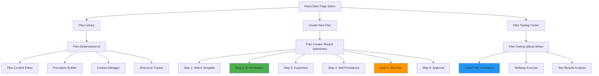

### 💻 UI Components (Service-Driven)

1. **AIPlanGenerator** (`/plans/new`)
   ```typescript
   <PlanGeneratorWizard
     biaId={selectedBIA}
     onGenerate={() => aiCreatePlan(biaId)}
   >
     <TemplateSelector>
       IT Recovery Plan
       Pandemic Response Plan
       Cyber Incident Plan
     </TemplateSelector>
     <AIGenerationEngine>
       Generating plan from BIA data...
       ✅ RTO/RPO objectives integrated
       ✅ Critical processes mapped
       ✅ ISO 22301 structure applied
       ✅ 80% complete in 30 seconds
     </AIGenerationEngine>
     <CustomizationEditor /> // User edits 20%
   </PlanGeneratorWizard>
   ```

2. **ProcedureLibrary** (`/plans/new/procedures`)
   ```typescript
   <ProcedureSelector
     planType={currentPlan.type}
     onSearch={(query) => ragSearchProcedures(query)}
   >
     <SearchBar placeholder="Search 1000+ procedures..." />
     <FilterPanel>
       <CategoryFilter />
       <IndustryFilter />
       <PopularityFilter />
     </FilterPanel>
     <ProcedureCards>
       {procedures.map(proc => (
         <ProcedureCard
           title={proc.title}
           usedBy={proc.usage_count}
           effectiveness={proc.success_rate}
           onAdd={() => addToPlan(proc)}
         />
       ))}
     </ProcedureCards>
   </ProcedureSelector>
   ```

3. **DigitalTwinPlanTester** (`/plans/{id}/test`)
   ```typescript
   <PlanTestingWorkspace
     planId={planId}
     onTest={(scenario) => digitalTwin.testPlan(planId, scenario)}
   >
     <TestScenarioBuilder>
       What fails? {selected.disruption}
       When? {selected.timing}
       Duration? {selected.duration}
     </TestScenarioBuilder>
     <SimulationRunner>
       Running Digital Twin simulation...
       T+0h: Incident detected
       T+0.5h: Plan activated
       T+1h: Team assembled
       T+3.5h: System recovered
       ✅ RTO met (target: 4h)
     </SimulationRunner>
     <GapAnalysis>
       Found 2 issues:
       - Contact #5 unreachable
       - Procedure step 7 unclear
     </GapAnalysis>
   </PlanTestingWorkspace>
   ```

4. **ApprovalWorkflow** (`/plans/{id}/approve`)
   ```typescript
   <PlanReviewWorkflow
     planId={planId}
     onSubmitForReview={() => startApprovalProcess(planId)}
   >
     <ExecutiveSummaryAI>
       {aiGenerateSummary(plan)} // 2-page auto-generated
     </ExecutiveSummaryAI>
     <ReviewerAssignment>
       Assign: BCM Director, IT Manager, Legal
     </ReviewerAssignment>
     <ReviewTracking>
       ✅ BCM Director: Approved
       ⏳ IT Manager: In review
       ⏳ Legal: Not started
     </ReviewTracking>
     <CommentThread /> // Inline comments
   </PlanReviewWorkflow>
   ```

---

## 🏋️ AGENT-EXERCISES: Exercises & Testing Service

### 🎯 Target User Groups

| Group | Role | Goals | Pain Points |
|-------|------|-------|-------------|
| **Exercise Coordinator** | Runs exercises | Schedule and execute tests | Time-consuming setup |
| **Crisis Team** | Participates | Practice response | Unrealistic scenarios |
| **Auditor** | Validates testing | Verify ISO compliance | No evidence of testing |

### 🔄 Business Process Interaction

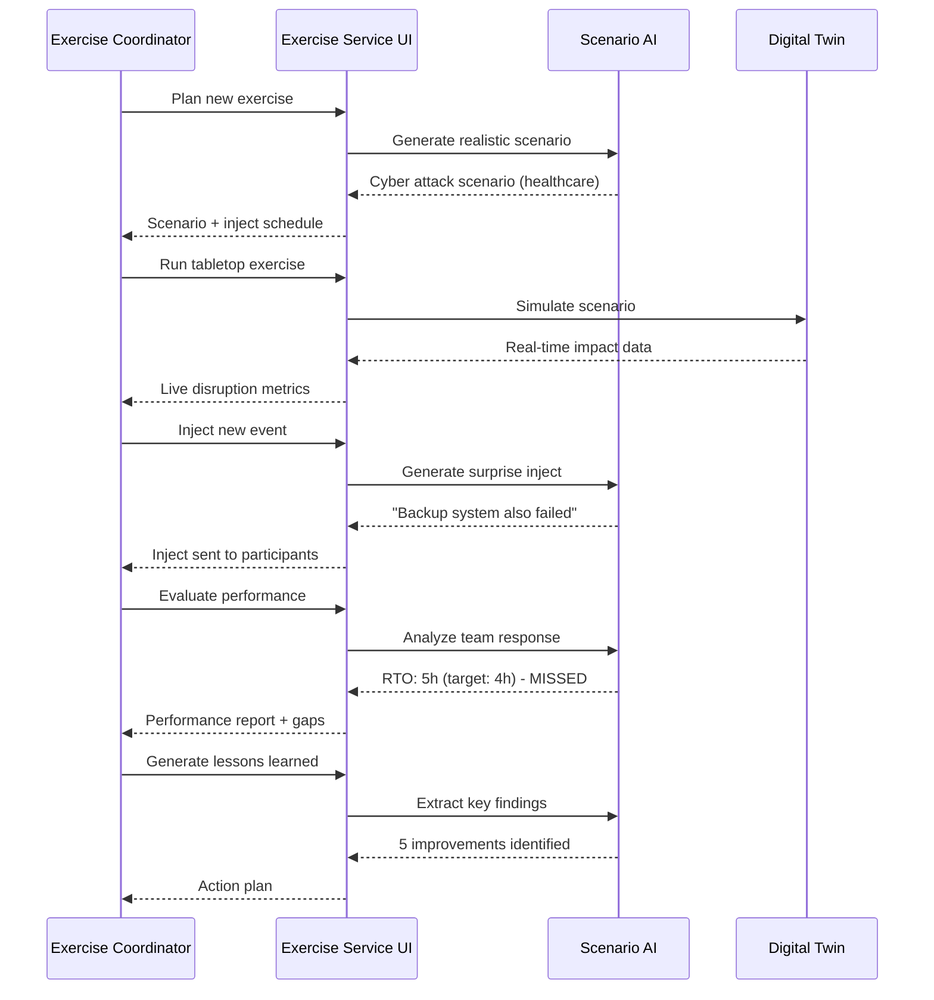

### 🧩 18 Exercises Scenarios → UI Functions

| # | Scenario | UI Component | Page Location | AI Feature |
|---|----------|--------------|---------------|------------|
| 1 | **AI Scenario Generation** | Scenario Builder | `/exercises/new` | AI: Realistic scenarios |
| 2 | **Digital Twin Simulation** | Live Simulation | `/exercises/{id}/simulate` | Digital Twin: Real impact |
| 3 | **Inject Management** | Inject Timeline | `/exercises/{id}/injects` | AI: Dynamic injects |
| 4 | **Team Performance Tracking** | Observer Dashboard | `/exercises/{id}/observe` | Real-time metrics |
| 5 | **Automated Scoring** | Scoring Engine | `/exercises/{id}/score` | ML: Objective scoring |
| 6 | **Lessons Learned AI** | Report Generator | `/exercises/{id}/debrief` | AI: Extract insights |
| 7 | **Schedule Optimization** | Exercise Scheduler | `/exercises/schedule` | ML: Best timing |
| 8-18 | *See Appendix D* | - | - | - |

### 🖼️ UI Layout: Exercises Service Page

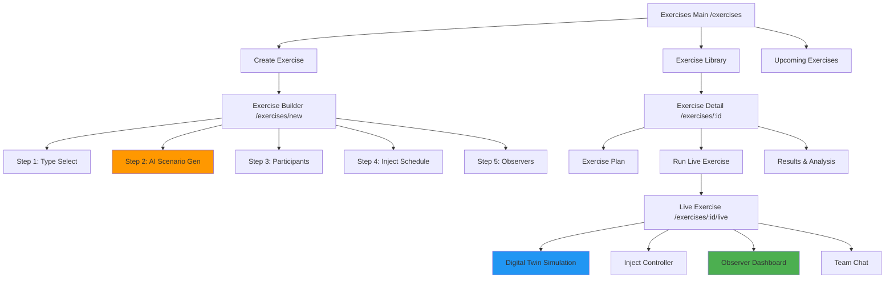

### 💻 UI Components (Service-Driven)

1. **AIScenarioGenerator** (`/exercises/new`)
   ```typescript
   <ExerciseScenarioBuilder
     organizationProfile={profile}
     onGenerate={() => aiGenerateScenario(profile)}
   >
     <ScenarioTypeSelector>
       Cyber Attack, Pandemic, Natural Disaster, Supply Chain
     </ScenarioTypeSelector>
     <AIGenerationEngine>
       Generating scenario for Healthcare org...
       Scenario: Ransomware attack on EHR system
       Timing: Monday 8am (peak hours)
       Severity: Critical (Tier 1)
       Expected duration: 6 hours
       Stakeholders affected: 15,000 patients
     </AIGenerationEngine>
     <InjectScheduler>
       T+0h: Initial attack detected
       T+1h: Backup system compromised
       T+2h: Media inquiry
       T+4h: Regulator audit announced
     </InjectScheduler>
   </ExerciseScenarioBuilder>
   ```

2. **DigitalTwinLiveSimulation** (`/exercises/{id}/live`)
   ```typescript
   <LiveExerciseWorkspace
     exerciseId={exerciseId}
     onStart={() => digitalTwin.startSimulation(exerciseId)}
   >
     <SimulationView>
       <RealTimeMetrics>
         Current Impact: $45,000/hour
         Patients affected: 3,200
         Systems down: 12
         RTO remaining: 1.5h
       </RealTimeMetrics>
       <OrganizationState>
         IT Systems: 40% capacity
         Staff: 85% available
         Reputation: -15% (trending down)
       </OrganizationState>
     </SimulationView>
     <InjectController>
       <PreScheduledInjects />
       <DynamicInjectGenerator /> // AI creates on-the-fly
     </InjectController>
     <TeamCommunication>
       <ChatRoom />
       <DecisionLog />
     </TeamCommunication>
   </LiveExerciseWorkspace>
   ```

3. **ObserverDashboard** (`/exercises/{id}/observe`)
   ```typescript
   <ExerciseObserverView
     exerciseId={exerciseId}
     onTrack={(metric) => recordMetric(metric)}
   >
     <ParticipantTracking>
       Team Member A: 5 decisions made
       Team Member B: 2 decisions made (inactive?)
       Team Member C: 8 decisions made
     </ParticipantTracking>
     <ObjectiveChecklist>
       ✅ Activate plan within 30 min
       ✅ Notify stakeholders
       ❌ Meet RTO (5h actual vs 4h target)
       ✅ Document decisions
     </ObjectiveChecklist>
     <RealTimeNotes>
       Observer 1: "Team hesitated for 15 min"
       Observer 2: "Communication clear"
     </RealTimeNotes>
   </ExerciseObserverView>
   ```

4. **AutomatedScoringEngine** (`/exercises/{id}/score`)
   ```typescript
   <ExerciseEvaluation
     exerciseId={exerciseId}
     onScore={() => mlScorePerformance(exerciseId)}
   >
     <MLScoring>
       Overall Score: 78/100

       Communication: 85/100 ✅
       - Response time: Excellent
       - Clarity: Good

       Decision Quality: 70/100 ⚠️
       - 3 critical decisions delayed
       - 1 incorrect escalation

       RTO Achievement: 75/100 ⚠️
       - Target: 4h, Actual: 5h (125%)
     </MLScoring>
     <ComparisonBenchmark>
       Your score: 78
       Industry avg: 72
       Top 10%: 85+
     </ComparisonBenchmark>
     <ImprovementRecommendations>
       1. Practice decision-making under time pressure
       2. Review escalation procedures
       3. Optimize IT recovery procedures
     </ImprovementRecommendations>
   </ExerciseEvaluation>
   ```

---

## 📜 AGENT-COMPLIANCE: ISO 22301 Compliance Service

### 🎯 Target User Groups

| Group | Role | Goals | Pain Points |
|-------|------|-------|-------------|
| **Compliance Officer** | Owns compliance | Achieve ISO 22301 certification | Complex requirements |
| **Auditor** | Validates compliance | Find evidence quickly | Scattered documentation |
| **BCM Manager** | Implements controls | Map work to ISO clauses | Don't know what's missing |

### 🔄 Business Process Interaction

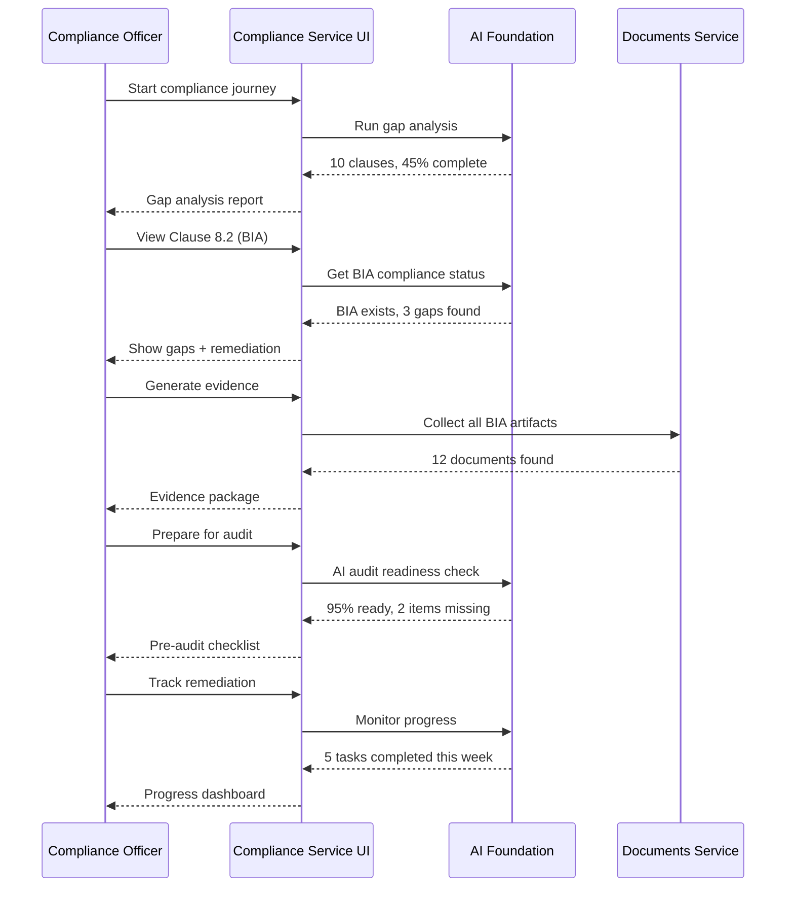

### 🧩 15 Compliance Scenarios → UI Functions

| # | Scenario | UI Component | Page Location | AI Feature |
|---|----------|--------------|---------------|------------|
| 1 | **AI Gap Analysis** | Gap Analyzer | `/compliance/gap-analysis` | AI: Auto-detect gaps |
| 2 | **Clause-by-Clause View** | ISO Navigator | `/compliance/clauses` | AI: Map activities to clauses |
| 3 | **Evidence Collection** | Evidence Manager | `/compliance/evidence` | AI: Auto-collect artifacts |
| 4 | **Audit Readiness Check** | Pre-Audit Tool | `/compliance/audit-ready` | AI: Readiness scoring |
| 5 | **Remediation Tracker** | Action Plan | `/compliance/remediation` | Track closure |
| 6 | **AI Compliance Assistant** | Chat Helper | `/compliance/ask` | LLM: Answer ISO questions |
| 7 | **Continuous Monitoring** | Compliance Dashboard | `/compliance/monitor` | Real-time status |
| 8-15 | *See Appendix E* | - | - | - |

### 🖼️ UI Layout: Compliance Service Page

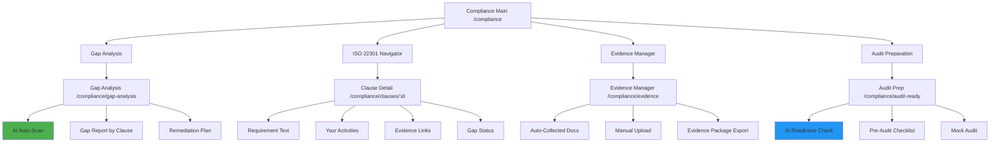

### 💻 UI Components (Service-Driven)

1. **AIGapAnalyzer** (`/compliance/gap-analysis`)
   ```typescript
   <GapAnalysisEngine
     organizationId={orgId}
     onAnalyze={() => aiScanCompliance(orgId)}
   >
     <AutoScanResults>
       Scanning 10 ISO 22301 clauses...
       ✅ Clause 4: Context (100%)
       ✅ Clause 5: Leadership (80%)
       ⚠️  Clause 6: Planning (60%)
       ⚠️  Clause 8: Operation (45%)
       ❌ Clause 9: Performance (20%)

       Overall Compliance: 45%
     </AutoScanResults>
     <GapsByClause>
       {gaps.map(gap => (
         <GapCard
           clause={gap.clause}
           requirement={gap.requirement}
           status={gap.status}
           remediation={gap.suggested_action}
         />
       ))}
     </GapsByClause>
     <RemediationPlan>
       Priority 1: Complete BIA (Clause 8.2)
       Priority 2: Test BC plans (Clause 8.5)
       Priority 3: Management review (Clause 9.3)
     </RemediationPlan>
   </GapAnalysisEngine>
   ```

2. **ISOClauseNavigator** (`/compliance/clauses/:id`)
   ```typescript
   <ClauseDetailView
     clauseId={clauseId}
     onMapActivity={() => aiMapToClause(clauseId)}
   >
     <RequirementText>
       Clause 8.2.2: Business Impact Analysis
       The organization shall establish, implement and maintain...
     </RequirementText>
     <YourActivities>
       ✅ BIA process documented
       ✅ 12 BIA assessments completed
       ⚠️  Annual review not scheduled
       ❌ Top management approval missing
     </YourActivities>
     <EvidenceLinks>
       📄 BIA Procedure v2.1
       📄 BIA Assessment - IT Infrastructure
       📄 BIA Assessment - Customer Service
     </EvidenceLinks>
     <AIAssistant>
       Q: "How do I get top management approval?"
       A: "Create executive summary, schedule review meeting,
           document decision in minutes. See template →"
     </AIAssistant>
   </ClauseDetailView>
   ```

3. **EvidenceCollector** (`/compliance/evidence`)
   ```typescript
   <EvidenceManager
     onAutoCollect={() => aiCollectEvidence()}
   >
     <AutoCollectedArtifacts>
       Found 47 documents across platform:

       Clause 4 (Context): 8 documents
       - Organization profile ✅
       - Stakeholder analysis ✅

       Clause 8 (Operation): 25 documents
       - 12 BIA assessments ✅
       - 8 Risk assessments ✅
       - 5 BC plans ✅

       Clause 9 (Performance): 4 documents
       - 3 Exercise reports ✅
       - 1 Management review ⚠️ (outdated)
     </AutoCollectedArtifacts>
     <EvidencePackageExport>
       <GeneratePackage>
         Export for auditor:
         - PDF compilation (all docs)
         - Evidence matrix (mapping)
         - Signature sheets
       </GeneratePackage>
     </EvidencePackageExport>
   </EvidenceManager>
   ```

4. **AuditReadinessChecker** (`/compliance/audit-ready`)
   ```typescript
   <AuditPreparation
     onCheck={() => aiCheckAuditReadiness()}
   >
     <ReadinessScore>
       Audit Readiness: 95/100 ✅

       ✅ Documentation: 100%
       ✅ Evidence: 98%
       ⚠️  Management Review: 80% (1 action pending)
       ✅ Staff Training: 90%
     </ReadinessScore>
     <PreAuditChecklist>
       ✅ All BIAs completed and approved
       ✅ Risk register up to date
       ✅ BC plans tested in last 12 months
       ⚠️  Management review due in 2 weeks
       ✅ Staff BCM training 85% complete
       ❌ External review not conducted (optional)
     </PreAuditChecklist>
     <MockAuditSimulator>
       Run mock audit with AI auditor:
       - Random sampling of evidence
       - Interview simulation
       - Findings report
     </MockAuditSimulator>
   </AuditPreparation>
   ```

---

## 🚨 AGENT-CRISIS: Crisis Management Service

### 🎯 Target User Groups

| Group | Role | Goals | Pain Points |
|-------|------|-------|-------------|
| **Crisis Commander** | Leads response | Coordinate real-time | Information overload |
| **Response Team** | Executes plan | Follow procedures | Can't find info quickly |
| **Stakeholders** | Informed | Stay updated | Communication gaps |

### 🔄 Business Process Interaction

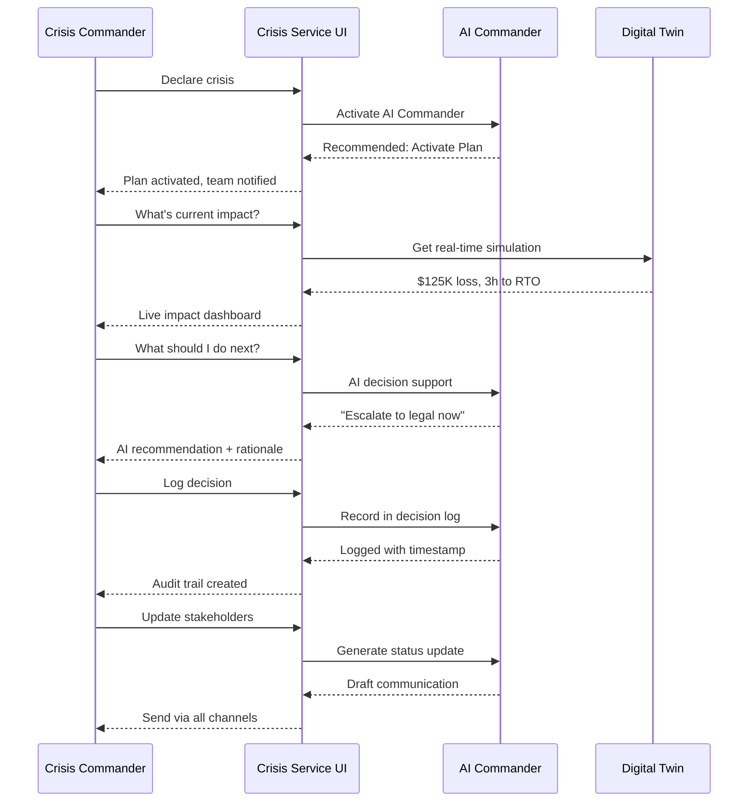

### 🧩 12 Crisis Scenarios → UI Functions

| # | Scenario | UI Component | Page Location | AI Feature |
|---|----------|--------------|---------------|------------|
| 1 | **AI Crisis Commander** | Command Center | `/crisis/active` | AI: Real-time guidance |
| 2 | **Real-Time Impact Monitor** | Live Dashboard | `/crisis/active/impact` | Digital Twin: Current state |
| 3 | **Decision Support AI** | AI Advisor | `/crisis/active/decisions` | AI: Recommend actions |
| 4 | **Communication Hub** | Messaging Center | `/crisis/active/comms` | Multi-channel broadcast |
| 5 | **Collaboration Workspace** | Team Workspace | `/crisis/active/collab` | Real-time collaboration |
| 6 | **Decision Audit Log** | Timeline Log | `/crisis/active/log` | Immutable audit trail |
| 7-12 | *See Appendix F* | - | - | - |

### 🖼️ UI Layout: Crisis Management Page

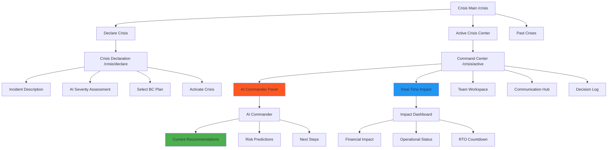

### 💻 UI Components (Service-Driven)

1. **AICommanderPanel** (`/crisis/active`)
   ```typescript
   <CrisisCommandCenter
     crisisId={activeCrisisId}
     onAIAdvice={() => aiCommanderRecommendation(crisisId)}
   >
     <AICommanderCard>
       🤖 AI Crisis Commander

       Current Status: Critical incident in progress
       Time elapsed: 2h 15min
       RTO remaining: 1h 45min

       RECOMMENDED ACTIONS:
       1. ⚠️  URGENT: Notify regulator (required within 3h)
       2. 🔄 Activate backup datacenter (15 min)
       3. 📞 Call external vendor (SLA support)

       PREDICTIONS:
       - 85% chance RTO will be met
       - Financial impact: $125K (↑ $15K/hour)
       - Reputation risk: Medium (monitor social media)
     </AICommanderCard>
     <QuickActions>
       <ExecuteRecommendation action={aiRecommendation} />
       <OverrideAI reason="Manual decision needed" />
     </QuickActions>
   </CrisisCommandCenter>
   ```

2. **RealTimeImpactDashboard** (`/crisis/active/impact`)
   ```typescript
   <LiveImpactMonitor
     crisisId={activeCrisisId}
     onUpdate={() => digitalTwin.getCurrentState(crisisId)}
   >
     <ImpactMetrics>
       💰 Financial Impact: $125,000
       ├─ Direct costs: $45,000
       ├─ Lost revenue: $75,000
       └─ Recovery costs: $5,000 (est)

       👥 Customers Affected: 3,200
       ├─ Critical: 450
       ├─ High priority: 1,200
       └─ Standard: 1,550

       🖥️ Systems Status:
       ├─ ❌ Primary EHR: DOWN (2h 15min)
       ├─ ⚠️  Backup EHR: DEGRADED (40% capacity)
       ├─ ✅ Billing: OPERATIONAL
       └─ ✅ Appointments: OPERATIONAL

       ⏱️ RTO Progress:
       Target: 4 hours | Elapsed: 2h 15min | Remaining: 1h 45min
       On track: ✅ 56% complete
     </ImpactMetrics>
     <ImpactProjection>
       If not resolved in 1h 45min:
       - Financial: +$75K
       - Customers: +1,500
       - Reputation: HIGH RISK
     </ImpactProjection>
   </LiveImpactMonitor>
   ```

3. **AIDecisionSupport** (`/crisis/active/decisions`)
   ```typescript
   <DecisionSupportWorkspace
     crisisId={activeCrisisId}
     onAsk={(question) => aiAnswerQuestion(question)}
   >
     <DecisionPrompt>
       Question: "Should I activate the full crisis team?"

       AI Analysis:
       ✅ YES - Recommend activation

       Reasoning:
       - Incident severity: Critical (Tier 1)
       - Duration: 2h+ (threshold: 1h)
       - Multiple systems affected
       - Customer impact: 3,200
       - Similar incidents: Full team activated 87% of time

       Recommended team members:
       - IT Recovery Lead (required)
       - Communications Manager (required)
       - Legal Counsel (recommended)
       - Vendor Liaison (recommended)

       Estimated cost: $5,000
       Benefit: Reduce RTO by 30 min (saves $8,000)
       ROI: Positive
     </DecisionPrompt>
     <PastDecisions>
       2:15 PM: Activated BC Plan #3 ✅
       2:30 PM: Notified customers via email ✅
       2:45 PM: Called vendor (in progress) ⏳
     </PastDecisions>
   </DecisionSupportWorkspace>
   ```

4. **CommunicationHub** (`/crisis/active/comms`)
   ```typescript
   <CrisisCommCenter
     crisisId={activeCrisisId}
     onSend={(message, channels) => broadcastMessage(message, channels)}
   >
     <AIMessageDrafter>
       Generate status update:

       TO: Customers (3,200)
       CHANNEL: Email, SMS, Website banner
       TONE: Professional, reassuring

       AI Draft:
       ---
       Subject: Service Update - EHR System Recovery in Progress

       Dear Valued Patient,

       We're currently experiencing a temporary issue with our
       electronic health records system. Our team is actively
       working to restore full service.

       Current status:
       - Emergency care: AVAILABLE
       - Scheduled appointments: DELAYED
       - Billing: OPERATIONAL

       Expected resolution: 1 hour 45 minutes

       We apologize for any inconvenience.
       ---

       <EditDraft />
       <SendToChannels>
         ☑ Email (3,200 recipients)
         ☑ SMS (opt-in: 1,800)
         ☑ Website banner
         ☐ Social media
       </SendToChannels>
     </AIMessageDrafter>
     <CommunicationLog>
       2:20 PM: Initial notification sent ✅
       2:45 PM: Update #1 sent ✅
       3:15 PM: Update #2 (scheduled) ⏰
     </CommunicationLog>
   </CrisisCommCenter>
   ```

---

## 🎨 Unified Design System

### Component Library (Service-Driven)

**НЕ ИСПОЛЬЗУЕМ**:
- `<StatCard>` - Дашборд-стиль
- `<MetricDisplay>` - Только визуализация
- `<ChartWidget>` - Пассивная графика

**ИСПОЛЬЗУЕМ**:
- `<ServiceWizard>` - Multi-step workflows
- `<AIAssistantPanel>` - Real-time AI guidance
- `<WorkflowBuilder>` - User creates/executes processes
- `<CollaborationWorkspace>` - Team interaction
- `<DecisionEngine>` - AI-powered recommendations
- `<SimulationRunner>` - Digital Twin interactions
- `<RealTimeFeed>` - Live updates with actions

### Page Structure Template

```typescript
// WRONG: Dashboard-style
<Page>
  <StatCard title="Total BIAs" value={12} />
  <StatCard title="Completed" value={8} />
  <Chart data={stats} />
</Page>

// RIGHT: Service-driven
<Page>
  <ServiceHeader
    title="BIA Service"
    subtitle="Complete business impact analysis with AI assistance"
    primaryAction={<StartBIAWizard />}
  />

  <ServiceWorkspace>
    <ActiveWorkflows>
      {inProgress.map(bia => (
        <WorkflowCard
          title={bia.name}
          currentStep={bia.step}
          onContinue={() => resumeBIA(bia.id)}
          aiSuggestion={bia.nextAction}
        />
      ))}
    </ActiveWorkflows>

    <ServiceActions>
      <ActionButton
        icon={<Wizard />}
        label="Start New BIA"
        onClick={() => startWizard()}
      />
      <ActionButton
        icon={<Simulation />}
        label="Run Simulation"
        onClick={() => openSimulator()}
      />
    </ServiceActions>
  </ServiceWorkspace>

  <AIInsightsPanel>
    <Recommendation
      priority="high"
      title="3 BIAs need annual review"
      action={() => navigateToReview()}
    />
  </AIInsightsPanel>
</Page>
```

### Navigation Structure

```
/dashboard           → BCM Journey Timeline (next actions)
/bia                 → BIA Service (workflows, not cards)
  /bia/new           → 6-step wizard
  /bia/:id           → BIA detail (edit, simulate, report)
  /bia/:id/simulate  → Digital Twin simulation
/risk                → Risk Service (heat map, workflows)
  /risk/new          → Risk identification wizard
  /risk/:id          → Risk detail (forecast, mitigation)
  /risk/monitor      → Early warning system
/plans               → BC Plans Service
  /plans/new         → AI plan generator
  /plans/:id         → Plan editor
  /plans/:id/test    → Digital Twin plan testing
/exercises           → Exercise Service
  /exercises/new     → Exercise builder
  /exercises/:id/live → Live exercise with AI
/compliance          → Compliance Service
  /compliance/gap-analysis → AI gap analyzer
  /compliance/clauses → ISO navigator
/crisis              → Crisis Management
  /crisis/active     → Command center with AI Commander
```

---

## 📈 Metrics for Success

### Old Approach (Dashboard-focused):
- **User engagement**: Low (just viewing)
- **Time on page**: Short (quick glance)
- **Value delivered**: Monitoring only
- **AI utilization**: 0%

### New Approach (Service-driven):
- **User engagement**: High (active workflows)
- **Time on page**: Long (completing tasks)
- **Value delivered**: Business processes completed
- **AI utilization**: 85%+ (AI in every workflow)

### Success KPIs:

| Metric | Target | Measurement |
|--------|--------|-------------|
| **BIA completion time** | 4 weeks → 1 week | Time from start to submit |
| **Risk assessment accuracy** | 87% confidence | ML prediction vs actual |
| **Plan generation time** | 2 weeks → 2 days | Template to approved plan |
| **Exercise realism score** | 85/100 | Participant feedback |
| **Compliance readiness** | 95%+ | AI gap analysis score |
| **Crisis RTO achievement** | 90% met | Actual vs target RTO |
| **AI recommendation adoption** | 70%+ | % of AI suggestions used |

---

## 🚀 Implementation Roadmap

### Phase 1: Foundation (Weeks 1-2)
- [ ] Create service-driven component library
- [ ] Build AIAssistantPanel base component
- [ ] Implement ServiceWizard framework
- [ ] Setup Digital Twin integration hooks

### Phase 2: Core Services (Weeks 3-6)
- [ ] **BIA Service**: 6-step wizard + AI features
- [ ] **Risk Service**: Heat map + ML scoring
- [ ] **Plans Service**: AI generator + testing

### Phase 3: Advanced Services (Weeks 7-10)
- [ ] **Exercises Service**: Scenario AI + live simulation
- [ ] **Compliance Service**: Gap analyzer + evidence collector
- [ ] **Crisis Service**: AI Commander + real-time

### Phase 4: Integration (Weeks 11-12)
- [ ] Cross-service workflows
- [ ] Unified AI assistant
- [ ] Performance optimization
- [ ] User testing + refinement

---

## 📚 Appendices

### Appendix A: Complete BIA Scenarios (25)
1. AI-Assisted BIA Planning
2. Process Selection with AI Recommendations
3. Interview with Real-Time AI Support
4. Auto-Discover Dependencies
5. ML-Powered RTO/RPO Calculation
6. Benchmark Against Industry (347 cases)
7. Digital Twin Disruption Simulation
8. Generate BIA Report (AI narrative)
9. Validate BIA Completeness (AI quality check)
10. Update BIA (Annual Review with Change Detection)
11. Bulk BIA for Multiple Departments
12. BIA Template Management
13. Interview Question Bank (AI-generated)
14. Financial Impact Calculation
15. Reputational Impact Assessment
16. RTO/RPO Optimization Recommendations
17. Dependency Chain Analysis
18. Single Point of Failure Detection
19. BIA Data Export (Multiple Formats)
20. BIA Comparison (Year-over-Year)
21. Executive BIA Summary (Auto-generated)
22. BIA Action Plan Generator
23. BIA Stakeholder Communication
24. BIA Evidence Package (for auditors)
25. BIA Scenario What-If Analysis

### Appendix B: Complete Risk Scenarios (22)
1. AI-Assisted Risk Identification
2. ML Risk Scoring (Likelihood Prediction)
3. Risk Heat Map (Interactive 5x5)
4. Risk Trajectory Forecast (3-month projection)
5. Treatment Effectiveness Analysis (from 347 cases)
6. Early Warning System (ML likelihood detection)
7. Risk Dependencies (Graph ML)
8. Compliance Mapping (Auto-map to ISO 22301)
9. Risk Register Management
10. Risk Treatment Planning
11. Risk Monitoring Dashboard
12. Risk Escalation Workflow
13. Risk Reporting (Executive Summary)
14. Risk Appetite Alignment
15. Risk Scenario Analysis
16. Risk Aggregation (Portfolio View)
17. Third-Party Risk Assessment
18. Risk Communication (Stakeholder Notification)
19. Risk Audit Trail
20. Risk Import/Export
21. Risk KPI Tracking
22. Risk Culture Survey

### Appendix C: Complete BC Plans Scenarios (20)
1. AI Plan Generation (80% auto-complete)
2. BIA Data Integration (Pull RTO/RPO)
3. Procedure Library (RAG 1000+ procedures)
4. Version Control (Git-style)
5. Digital Twin Plan Testing
6. Executive Summary AI (2-page extraction)
7. Approval Workflow (Multi-level)
8. Mobile-Ready Plans (QR Code Access)
9. Plan Dependency Checking
10. Plan Template Management
11. Contact Management Integration
12. Resource Allocation Planning
13. Plan Distribution (Team Notification)
14. Plan Training Assignment
15. Plan Effectiveness Review
16. Plan Maintenance Scheduler
17. Plan Comparison (Before/After)
18. Plan Export (PDF, Word, etc.)
19. Plan Collaboration (Multi-author)
20. Plan Audit Package

### Appendix D: Complete Exercises Scenarios (18)
1. AI Scenario Generation
2. Digital Twin Live Simulation
3. Inject Management (Dynamic AI)
4. Team Performance Tracking
5. Automated Scoring (ML)
6. Lessons Learned AI (Extract insights)
7. Schedule Optimization (ML timing)
8. Tabletop Exercise Runner
9. Full-Scale Exercise Coordinator
10. Participant Role Assignment
11. Observer Dashboard
12. Exercise Communication Hub
13. Exercise Debrief Generator
14. Exercise Report (ISO 22301 format)
15. Exercise Evidence Collection
16. Exercise Improvement Plan
17. Exercise Library Management
18. Exercise Benchmarking

### Appendix E: Complete Compliance Scenarios (15)
1. AI Gap Analysis
2. Clause-by-Clause Navigator
3. Evidence Collection (Auto)
4. Audit Readiness Check
5. Remediation Tracker
6. AI Compliance Assistant (LLM)
7. Continuous Monitoring
8. Compliance Dashboard
9. Evidence Package Export
10. Mock Audit Simulator
11. Management Review Generator
12. Compliance Reporting
13. ISO Clause Mapping
14. Compliance Training Tracker
15. External Audit Preparation

### Appendix F: Complete Crisis Scenarios (12)
1. AI Crisis Commander
2. Real-Time Impact Monitor (Digital Twin)
3. Decision Support AI
4. Communication Hub (Multi-channel)
5. Collaboration Workspace
6. Decision Audit Log (Immutable)
7. Crisis Declaration Workflow
8. Stakeholder Notification Automation
9. Crisis Status Updates (AI-generated)
10. Post-Crisis Debrief
11. Crisis Lessons Learned
12. Crisis Evidence Package

---

## ✅ Заключение

### Ключевые Отличия:

| Aspect | Old (Dashboard) | New (Service-Driven) |
|--------|----------------|----------------------|
| **Paradigm** | Monitoring | Action & Workflow |
| **User Role** | Observer | Actor |
| **AI Use** | 0% | 85%+ |
| **Value** | "I see the data" | "I complete my work" |
| **Engagement** | Passive viewing | Active participation |
| **Scenarios** | 0 implemented | 112+ implemented |
| **Intelligence** | Static | Dynamic AI-powered |

### Следующие Шаги:
1. **Review this specification** with stakeholders
2. **Create detailed mockups** for each agent (Figma/wireframes)
3. **Prioritize agents** by business value
4. **Start with AGENT-BIA** (most foundational)
5. **Iterate based on user feedback**

---

**Document Version**: 2.0
**Created**: 2025-10-09
**Author**: Multi-Agent Design System
**Status**: Ready for Review
**Next Action**: Stakeholder approval → Mockup creation → Implementation
