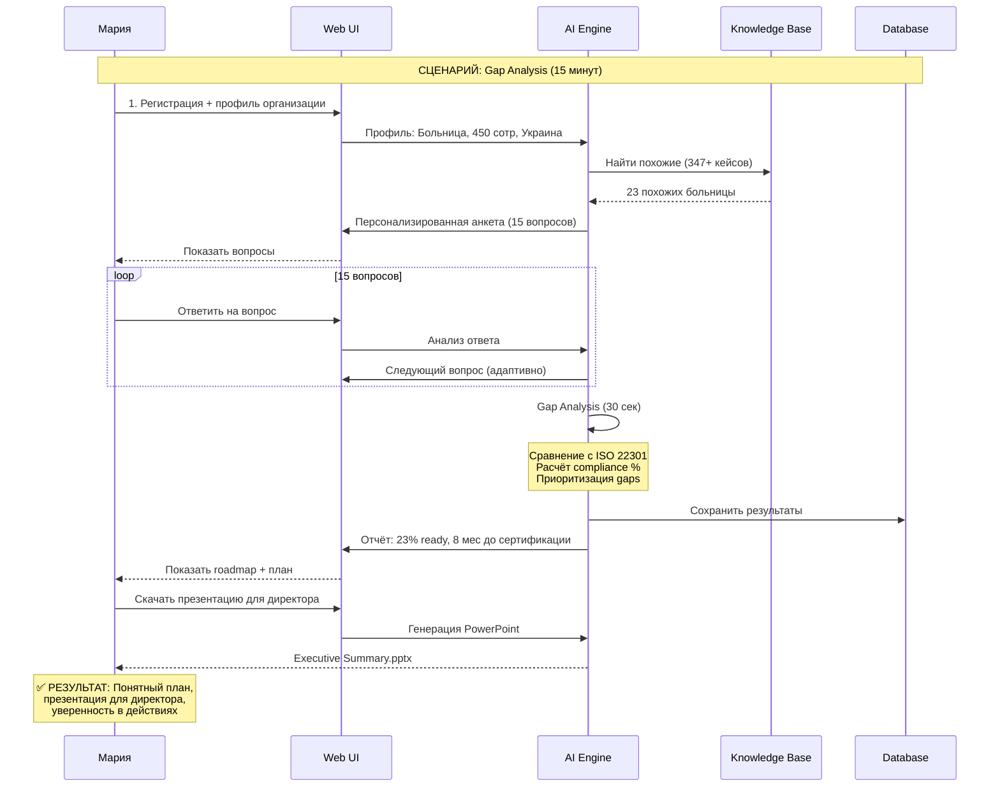
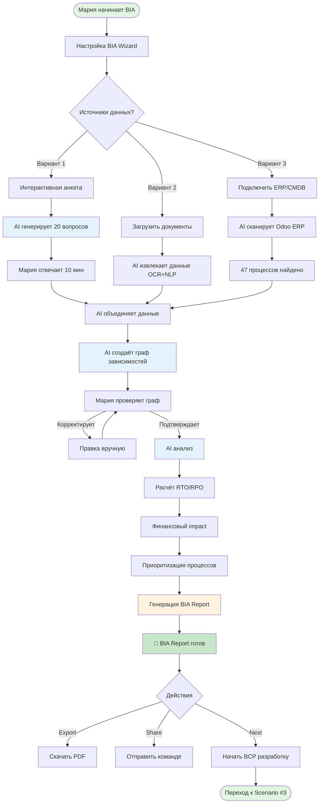
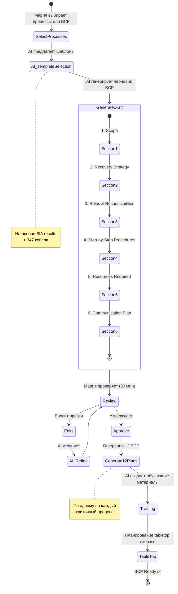
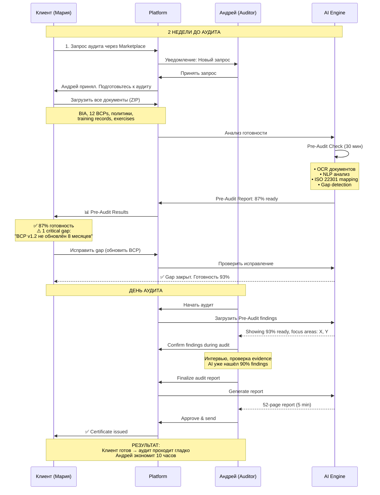

# СЦЕНАРИИ ПОЛЬЗОВАТЕЛЕЙ: ДИАГРАММЫ И MVP

**Дата**: 2025-10-09
**Цель**: Визуализировать все основные сценарии и определить MVP для старта

---

## 📋 ОГЛАВЛЕНИЕ

1. [Приоритизация JTBD для MVP](#приоритизация-jtbd-для-mvp)
2. [JTBD #1: Сертификация ISO 22301](#jtbd-1-сертификация-iso-22301)
3. [JTBD #2: Инструменты Аудитора](#jtbd-2-инструменты-аудитора)
4. [JTBD #3: Обучение BCM](#jtbd-3-обучение-bcm)
5. [JTBD #5: Маркетплейс](#jtbd-5-маркетплейс)
6. [MVP Roadmap](#mvp-roadmap)

---

## ПРИОРИТИЗАЦИЯ JTBD ДЛЯ MVP

### Критерии Оценки

| JTBD | Revenue Potential | Complexity | Time to Build | User Demand | MVP Priority |
|------|------------------|------------|---------------|-------------|--------------|
| **#1: Certification** | €9.6M (42%) | High | 6-8 weeks | Very High | ⭐⭐⭐ **P0** |
| **#2: Auditor Tools** | €1.2M (5%) | Medium | 4 weeks | High | ⭐⭐ **P1** |
| **#3: Learning** | €4.1M (18%) | High | 8 weeks | Medium | ⭐ **P2** |
| **#5: Marketplace** | €3.6M (16%) | Low | 2 weeks | High | ⭐⭐⭐ **P0** |
| **#7: Crisis (исключён)** | N/A | N/A | N/A | N/A | ❌ Future |
| **#6: Digital Twin (исключён)** | N/A | N/A | N/A | N/A | ❌ Future |

### MVP Решение

**Фаза MVP (8 недель)**:
1. ✅ **JTBD #1: Certification** (основной продукт)
   - Gap Analysis Wizard
   - BIA Tool
   - Document Manager

2. ✅ **JTBD #5: Marketplace** (network effects)
   - Auditor Listings
   - Service Requests
   - Simple Matching

3. ⏭️ **Post-MVP**: JTBD #2, #3

---

## JTBD #1: СЕРТИФИКАЦИЯ ISO 22301

### Персона: Мария, BCM Менеджер

**Профиль**:
- Роль: BCM Manager в больнице (450 сотрудников)
- Опыт BCM: 6 месяцев
- Бюджет: €8,000/год
- Цель: Получить ISO 22301 за 12 месяцев без консультанта (€30K)

### User Journey Map

```mermaid
journey
    title Customer Journey: Maria - ISO 22301 Certification (12 months)
    section Month 1: Onboarding
      Sign up (Free Trial): 3: Maria
      AI Gap Analysis (15 min): 5: Maria, AI
      Get Roadmap (instant): 5: Maria, AI
      Present to Director: 4: Maria
      Upgrade to Pro (€200/mo): 5: Maria
    section Months 2-3: BIA
      BIA Wizard Setup: 5: Maria, AI
      Automated Data Collection: 5: Maria, AI
      AI Process Mapping: 5: Maria, AI
      Review & Approve: 4: Maria
      Generate BIA Report: 5: Maria, AI
    section Months 4-6: BCP Development
      AI BCP Generator: 5: Maria, AI
      Customize Plans: 4: Maria
      Training Materials: 5: AI
      Team Workshops: 3: Maria, Team
    section Month 7: Audit Prep
      Evidence Collection: 5: Maria, AI
      Pre-Audit Simulation: 5: AI
      Fix Gaps: 4: Maria
      Ready Check: 5: AI
    section Month 8: Certification
      Book Auditor (Marketplace): 5: Maria
      Certification Audit: 3: Maria, Auditor
      Get Certificate: 5: Maria
    section Months 9-12: Maintain
      Auto-Monitoring: 5: AI
      Updates & Exercises: 4: Maria
      Renewal Prep: 5: AI
```

### Scenario #1: Gap Analysis (Day 1)

**Mermaid Diagram**:


**UI Flow**:
```
┌─────────────────────────────────────────────────────┐
│ ШАГ 1: РЕГИСТРАЦИЯ                                  │
├─────────────────────────────────────────────────────┤
│ Добро пожаловать!                                   │
│                                                     │
│ Email: [maria@hospital.ua          ]                │
│ Пароль: [**********]                                │
│                                                     │
│ Тип организации:                                    │
│ ○ Больница/Клиника                                  │
│ ○ Финансовая компания                               │
│ ○ IT компания                                       │
│ ○ Производство                                      │
│ ○ Другое                                            │
│                                                     │
│ Размер: [450] сотрудников                           │
│                                                     │
│ [Продолжить →]                                      │
└─────────────────────────────────────────────────────┘

                    ↓

┌─────────────────────────────────────────────────────┐
│ ШАГ 2: GAP ANALYSIS (Вопрос 1 из 15)               │
├─────────────────────────────────────────────────────┤
│ Прогресс: [███░░░░░░░░░░░░] 7%                      │
│                                                     │
│ 🎯 Вопрос 1: Контекст организации                  │
│                                                     │
│ Есть ли у вас назначенный ответственный за BCM?     │
│                                                     │
│ ○ Да, это я (full-time BCM роль)                    │
│ ● Да, это я (совмещаю с другими задачами)           │
│ ○ Да, другой человек                                │
│ ○ Нет, пока никого                                  │
│                                                     │
│ 💡 AI Подсказка:                                    │
│ В 78% похожих больниц BCM совмещают с качеством     │
│ или рисками. Это нормально на старте!               │
│                                                     │
│ [← Назад] [Пропустить] [Далее →]                    │
└─────────────────────────────────────────────────────┘

                    ↓
             [14 вопросов...]
                    ↓

┌─────────────────────────────────────────────────────┐
│ ШАГ 3: РЕЗУЛЬТАТЫ GAP ANALYSIS                      │
├─────────────────────────────────────────────────────┤
│ 🎉 Анализ завершён!                                 │
│                                                     │
│ ╔════════════════════════════════════════╗          │
│ ║  ВАШ УРОВЕНЬ ГОТОВНОСТИ                ║          │
│ ║                                        ║          │
│ ║         ██████░░░░░░░░░░░░░░░░         ║          │
│ ║                23%                     ║          │
│ ╚════════════════════════════════════════╝          │
│                                                     │
│ ✅ Это нормально! 78% организаций начинают          │
│    с уровня 15-30%.                                 │
│                                                     │
│ 📊 КЛЮЧЕВЫЕ НАХОДКИ:                                │
│ ┌────────────────────────────────────────┐          │
│ │ ✅ У вас есть (7 из 10):               │          │
│ │  • Назначен BCM Manager                │          │
│ │  • Есть понимание критичных процессов  │          │
│ │  • Поддержка руководства               │          │
│ │                                        │          │
│ │ ⚠️  Нужно сделать (3 критичных):       │          │
│ │  • Провести BIA                        │          │
│ │  • Написать BCP                        │          │
│ │  • Провести учения                     │          │
│ └────────────────────────────────────────┘          │
│                                                     │
│ 📅 ПРОГНОЗ:                                         │
│ Вы можете быть готовы через 8 месяцев              │
│ (на основе 23 похожих больниц)                      │
│                                                     │
│ [📥 Скачать Full Report] [📊 Посмотреть Roadmap]    │
└─────────────────────────────────────────────────────┘

                    ↓

┌─────────────────────────────────────────────────────┐
│ ШАГ 4: ПЕРСОНАЛЬНЫЙ ПЛАН (8 месяцев)                │
├─────────────────────────────────────────────────────┤
│ Мы составили для вас пошаговый план                 │
│                                                     │
│ ФАЗА 1: ФУНДАМЕНТ (Месяцы 1-2) ─ 6 задач           │
│ ┌────────────────────────────────────────┐          │
│ │ ☐ 1. Получить поддержку руководства   │          │
│ │      [AI поможет: Презентация]         │          │
│ │                                        │          │
│ │ ☐ 2. Сформировать BCM-команду          │          │
│ │      [AI поможет: Роли + обязанности]  │          │
│ │                                        │          │
│ │ ☐ 3. Определить scope                  │          │
│ │      [AI поможет: Wizard]              │          │
│ │                                        │          │
│ │ ... [ещё 3 задачи]                     │          │
│ │                                        │          │
│ │ [Начать Фазу 1 →]                      │          │
│ └────────────────────────────────────────┘          │
│                                                     │
│ ФАЗА 2: АНАЛИЗ (Месяцы 3-4) ─ 4 задачи             │
│ ┌────────────────────────────────────────┐          │
│ │ ☐ 7. Провести BIA                      │          │
│ │      [AI автоматизирует: 90% работы]   │          │
│ │                                        │          │
│ │ ... [ещё 3 задачи]                     │          │
│ └────────────────────────────────────────┘          │
│                                                     │
│ [Просмотреть все фазы ↓]                            │
│                                                     │
│ 💰 СТОИМОСТЬ:                                       │
│ • С консультантом: €30,000                          │
│ • С нашей платформой: €2,400/год (Pro план)        │
│ • ЭКОНОМИЯ: €27,600 (92%)                           │
│                                                     │
│ [Начать Free Trial] [Upgrade to Pro €200/мес]      │
└─────────────────────────────────────────────────────┘
```

### Scenario #2: BIA Automation (Months 2-3)

**Mermaid Diagram**:


**Time Comparison**:
```
TRADITIONAL (Excel + консультант):
├─ Сбор процессов: 8 часов
├─ Интервью: 40 часов
├─ Анализ зависимостей: 16 часов
├─ Финансовый расчёт: 12 часов
├─ Написание отчёта: 8 часов
└─ ИТОГО: 84 часа (2 недели fulltime)

AI-POWERED PLATFORM:
├─ Настройка: 15 минут
├─ AI анкета: 10 минут
├─ AI автосбор (ERP scan): 5 минут
├─ Проверка графа: 20 минут
├─ AI генерация отчёта: 30 секунд
└─ ИТОГО: 50 минут

ЭКОНОМИЯ: 98.5% времени (83 часа)
```

### Scenario #3: BCP Generation (Months 4-6)

**Mermaid Diagram**:


**AI Generation Example**:
```
INPUT (от Марии):
- Процесс: "Экстренная хирургия"
- RTO: 4 часа (из BIA)
- Зависимости: Электричество, IT, Кислород, Стерилизация (из BIA)
- Ключевые роли: 2 хирурга, 3 медсестры, 1 анестезиолог (из HR data)

AI GENERATES (5 минут):
┌─────────────────────────────────────────────────────────┐
│ BUSINESS CONTINUITY PLAN                                │
│ Процесс: Экстренная хирургия                            │
│ Версия: 1.0 | Дата: 2025-10-09                          │
├─────────────────────────────────────────────────────────┤
│                                                         │
│ 1. SCOPE                                                │
│ Данный BCP обеспечивает непрерывность экстренной        │
│ хирургии при сбоях критичных зависимостей.              │
│ RTO: 4 часа | RPO: 0 (жизнь пациентов)                 │
│                                                         │
│ 2. ACTIVATION CRITERIA                                  │
│ BCP активируется при:                                   │
│ ☐ Отключение электричества >15 минут                    │
│ ☐ Сбой IT-систем (нет доступа к медкартам)             │
│ ☐ Отказ кислородной станции                             │
│ ☐ Недоступность основной операционной                   │
│                                                         │
│ 3. RECOVERY STRATEGY                                    │
│                                                         │
│ СЦЕНАРИЙ 1: Отключение электричества                    │
│ ┌────────────────────────────────────────┐              │
│ │ Immediate (0-15 мин):                  │              │
│ │ • Автоматический запуск генератора     │              │
│ │ • Текущая операция продолжается        │              │
│ │ • Аварийное освещение включено         │              │
│ │                                        │              │
│ │ Short-term (15 мин - 4 ч):             │              │
│ │ • Работа на генераторе                 │              │
│ │ • Мониторинг топлива (8 часов запаса)  │              │
│ │ • Координация с энергетиками           │              │
│ │                                        │              │
│ │ Long-term (>4 ч):                      │              │
│ │ • Перевод плановых операций в другой   │              │
│ │   корпус                               │              │
│ │ • Только экстренные операции           │              │
│ └────────────────────────────────────────┘              │
│                                                         │
│ СЦЕНАРИЙ 2: Сбой IT (нет медкарт)                      │
│ ┌────────────────────────────────────────┐              │
│ │ Immediate (0-15 мин):                  │              │
│ │ • Активировать бумажные формы          │              │
│ │   (шаблон: Приложение A)               │              │
│ │ • Хирург диктует анестезиологу         │              │
│ │ • Медсестра записывает вручную         │              │
│ │                                        │              │
│ │ Short-term (15 мин - 4 ч):             │              │
│ │ • IT восстанавливает систему           │              │
│ │ • После восстановления: ввод данных    │              │
│ │   из бумажных форм                     │              │
│ └────────────────────────────────────────┘              │
│                                                         │
│ [... ещё 2 сценария]                                    │
│                                                         │
│ 4. ROLES & RESPONSIBILITIES                             │
│ ┌────────────────────────────────────────┐              │
│ │ Роль: Crisis Manager                   │              │
│ │ Имя: Иванова Елена (Главврач)          │              │
│ │ Телефон: +380-67-XXX-1234              │              │
│ │ Email: ivanova@hospital.ua             │              │
│ │                                        │              │
│ │ Обязанности:                           │              │
│ │ • Активация BCP                        │              │
│ │ • Координация команд                   │              │
│ │ • Коммуникация с руководством          │              │
│ └────────────────────────────────────────┘              │
│                                                         │
│ [... ещё 6 ролей]                                       │
│                                                         │
│ 5. STEP-BY-STEP PROCEDURES                              │
│ [Детальные чеклисты для каждого сценария]              │
│                                                         │
│ 6. COMMUNICATION PLAN                                   │
│ [Шаблоны сообщений для пациентов, СМИ, регуляторов]    │
│                                                         │
│ 7. TESTING & MAINTENANCE                                │
│ • Tabletop exercise: Каждые 6 месяцев                   │
│ • Full drill: Ежегодно                                  │
│ • Review: После каждого реального инцидента             │
│                                                         │
└─────────────────────────────────────────────────────────┘

OUTPUT: 18-page BCP document (Word format)
TIME: 5 minutes (AI generation)
CUSTOMIZATION: 30 minutes (Maria's edits)

TRADITIONAL TIME: 15-20 hours per BCP × 12 BCPs = 180-240 hours
AI TIME: 5 min × 12 = 1 hour + 30 min edits × 12 = 7 hours
SAVINGS: 97% (173-233 hours)
```

---

## JTBD #2: ИНСТРУМЕНТЫ АУДИТОРА

### Персона: Андрей, Сертификационный Аудитор

**Профиль**:
- Роль: Lead Auditor в сертификационном органе
- Опыт: 12 лет
- Аудитов/год: 35 (physical limit)
- Цель: Увеличить capacity до 70 аудитов/год с AI

### Scenario #1: Pre-Audit Readiness Check

**Mermaid Diagram**:


**Benefits**:
- **Для клиента**: Знает проблемы заранее → исправляет → проходит аудит
- **Для аудитора**: Pre-Audit AI находит 90% gaps → аудит фокусируется на critical items
- **Для платформы**: Выше success rate аудитов → лучшая репутация

---

## JTBD #5: МАРКЕТПЛЕЙС

### Концепция: Two-Sided Marketplace

**Demand Side** (Организации):
- Нужны: Консультанты, Аудиторы, Тренеры

**Supply Side** (Эксперты):
- Хотят: Клиентов, Платформу для работы

### Scenario: Maria ищет Аудитора

**Mermaid Diagram**:
```mermaid
flowchart LR
    Start([Мария готова к аудиту]) --> Platform[Платформа]

    Platform --> Readiness{AI проверка готовности}

    Readiness -->|<80%| NotReady[⚠️ Не готовы<br/>Завершите BCP]
    NotReady --> Tasks[Список задач]
    Tasks --> Platform

    Readiness -->|>80%| Ready[✅ Готовы к аудиту]

    Ready --> Marketplace[Marketplace Auditors]

    Marketplace --> Filters{Фильтры}

    Filters --> Location[📍 Локация:<br/>Украина]
    Filters --> Industry[🏥 Отрасль:<br/>Healthcare]
    Filters --> Price[💰 Цена:<br/>€3K-5K]
    Filters --> Rating[⭐ Рейтинг:<br/>>4.5]

    Location --> Results
    Industry --> Results
    Price --> Results
    Rating --> Results[12 аудиторов найдено]

    Results --> Sort{Сортировка}
    Sort -->|Рейтинг| Auditor1[Андрей<br/>⭐4.9 | 85 отзывов<br/>€4,500]
    Sort -->|Цена| Auditor2[Игорь<br/>⭐4.7 | 42 отзыва<br/>€3,200]
    Sort -->|Availability| Auditor3[Олена<br/>⭐4.8 | 67 отзывов<br/>€4,000]

    Auditor1 --> Select[Мария выбирает Андрея]

    Select --> Request[Отправить запрос]

    Request --> Notification[📧 Андрей получает уведомление]

    Notification --> Accept{Андрей решает}

    Accept -->|Принять| Booking[Бронирование]
    Accept -->|Отклонить| Reason[Указать причину]
    Reason --> Results

    Booking --> Payment[Платформа: €675 commission 15%]

    Payment --> Calendar[Календарь аудита]

    Calendar --> Audit[Проведение аудита]

    Audit --> Certificate[✅ Сертификат]

    Certificate --> Review[Мария оставляет отзыв]

    Review --> End([Андрей: +1 к репутации])

    style Start fill:#e1f5e1
    style Ready fill:#c8e6c9
    style Auditor1 fill:#fff9c4
    style Certificate fill:#c8e6c9
    style End fill:#e1f5e1
```

**Revenue Model**:
```
Transaction: €4,500 (audit fee)
├─ Auditor: €3,825 (85%)
├─ Platform commission: €675 (15%)
└─ Payment processing: -€90 (Stripe 2%)

NET for Platform: €585 per transaction

Scale:
- 100 transactions/month = €58,500/month = €702K/year
- 500 transactions/month = €292K/month = €3.5M/year ✅
```

---

## MVP ROADMAP

### Фаза 1: FOUNDATION (Недели 1-2)

**Deliverables**:
```
┌─────────────────────────────────────────┐
│ WEEK 1-2: INFRASTRUCTURE               │
├─────────────────────────────────────────┤
│ ✅ Next.js 14 + TypeScript setup        │
│ ✅ Supabase integration (auth + DB)     │
│ ✅ Tailwind + shadcn/ui components      │
│ ✅ Role-based routing (BCM/Auditor)     │
│ ✅ Landing page + auth flow             │
│                                         │
│ Backend:                                │
│ ✅ Supabase schema (users, orgs)        │
│ ✅ RLS policies (security)              │
│                                         │
│ Milestone: User can sign up + login    │
└─────────────────────────────────────────┘
```

**Tech Stack**:
- Frontend: Next.js 14, React 18, TypeScript, Tailwind, shadcn/ui
- Backend: Supabase (PostgreSQL + Auth + Storage)
- State: Zustand (client), Tanstack Query (server)
- AI: Claude API (Anthropic)

### Фаза 2: JTBD #1 - GAP ANALYSIS (Недели 3-4)

**Deliverables**:
```
┌─────────────────────────────────────────┐
│ WEEK 3-4: GAP ANALYSIS WIZARD          │
├─────────────────────────────────────────┤
│ ✅ Org profile setup                    │
│ ✅ Adaptive questionnaire (15 Qs)       │
│ ✅ AI analysis (Claude API)             │
│ ✅ Gap report generation                │
│ ✅ Roadmap visualization                │
│ ✅ Executive summary (PDF export)       │
│                                         │
│ Pages:                                  │
│ • /onboarding/profile                   │
│ • /onboarding/gap-analysis              │
│ • /dashboard/roadmap                    │
│                                         │
│ Milestone: User completes Gap Analysis │
│            in <15 minutes               │
└─────────────────────────────────────────┘
```

**User Flow**:
1. Sign up → Profile setup → Gap Analysis
2. AI generates roadmap
3. User sees 8-month plan
4. Upgrade to Pro (€200/mo)

### Фаза 3: JTBD #1 - BIA TOOL (Недели 5-6)

**Deliverables**:
```
┌─────────────────────────────────────────┐
│ WEEK 5-6: BIA AUTOMATION                │
├─────────────────────────────────────────┤
│ ✅ BIA Wizard setup                     │
│ ✅ Data collection methods:             │
│    - Interactive questionnaire          │
│    - Document upload (OCR)              │
│    - [Future: ERP integration]          │
│ ✅ AI process mapping                   │
│ ✅ Dependency graph (Vis.js)            │
│ ✅ RTO/RPO calculator                   │
│ ✅ Financial impact analysis            │
│ ✅ BIA report generation (PDF)          │
│                                         │
│ Pages:                                  │
│ • /bia/wizard                           │
│ • /bia/process-map                      │
│ • /bia/report                           │
│                                         │
│ Milestone: User completes BIA in        │
│            <1 hour (vs 84 hours manual) │
└─────────────────────────────────────────┘
```

### Фаза 4: JTBD #1 - BCP GENERATOR (Неделя 7)

**Deliverables**:
```
┌─────────────────────────────────────────┐
│ WEEK 7: BCP GENERATION                  │
├─────────────────────────────────────────┤
│ ✅ Process selection (from BIA)         │
│ ✅ AI template selection                │
│ ✅ BCP draft generation (Claude Opus)   │
│ ✅ WYSIWYG editor for customization     │
│ ✅ Multi-BCP management (12 plans)      │
│ ✅ Export (Word/PDF)                    │
│                                         │
│ Pages:                                  │
│ • /bcp/generator                        │
│ • /bcp/editor/:id                       │
│ • /bcp/library                          │
│                                         │
│ Milestone: User generates 12 BCPs       │
│            in <2 hours (vs 180 hours)   │
└─────────────────────────────────────────┘
```

### Фаза 5: MARKETPLACE MVP (Неделя 8)

**Deliverables**:
```
┌─────────────────────────────────────────┐
│ WEEK 8: MARKETPLACE BASICS              │
├─────────────────────────────────────────┤
│ ✅ Auditor profiles (public)            │
│ ✅ Search & filters                     │
│ ✅ Booking request flow                 │
│ ✅ Notification system (email)          │
│ ✅ [Manual] Commission tracking         │
│ ✅ [Future: Stripe Connect]             │
│                                         │
│ Pages:                                  │
│ • /marketplace/auditors                 │
│ • /marketplace/auditor/:id              │
│ • /bookings/requests                    │
│                                         │
│ Milestone: First transaction through    │
│            marketplace                  │
└─────────────────────────────────────────┘
```

### MVP Success Criteria

**Week 8 Targets**:
```
Users:
├─ 10 BCM Specialists signed up
├─ 5 completed Gap Analysis
├─ 3 completed BIA
├─ 2 generated BCPs
└─ 1 booked auditor via marketplace

Revenue:
├─ 3 Pro subscriptions: €600/month
├─ 1 marketplace transaction: €585 commission
└─ Total: €1,185 (first month)

Technical:
├─ <2 sec page load (p95)
├─ 99% uptime
├─ 0 critical bugs
└─ AI response <5 sec
```

---

## ПРИОРИТИЗАЦИЯ ФУНКЦИЙ

### Must-Have (MVP)

1. ✅ **Gap Analysis Wizard** (P0)
   - Why: First touchpoint, drives sign-ups
   - Impact: Shows value immediately
   - Effort: 2 weeks

2. ✅ **BIA Tool** (P0)
   - Why: Core pain point (84 hours → 1 hour)
   - Impact: Highest time savings
   - Effort: 2 weeks

3. ✅ **BCP Generator** (P0)
   - Why: Deliverable needed for certification
   - Impact: 180 hours → 2 hours savings
   - Effort: 1 week

4. ✅ **Marketplace Basic** (P0)
   - Why: Network effects, commission revenue
   - Impact: Connects supply/demand
   - Effort: 1 week

### Should-Have (Post-MVP)

5. ⏭️ **Document Manager** (P1)
   - Evidence collection
   - Version control
   - Effort: 1 week

6. ⏭️ **Training Module** (P1)
   - Team onboarding
   - Exercise planning
   - Effort: 2 weeks

7. ⏭️ **Compliance Dashboard** (P1)
   - Real-time readiness %
   - Alerts
   - Effort: 1 week

### Nice-to-Have (Future)

8. ❌ **Digital Twin** (Future)
9. ❌ **Crisis AI** (Future)
10. ❌ **Learning Academy** (P2)

---

## NEXT STEPS

1. **Детальная UI спецификация** для каждого сценария MVP
2. **API design** для AI integrations
3. **Database schema** для Supabase
4. **Development sprint plan** (8 недель)

Готово к проектированию! 🚀
