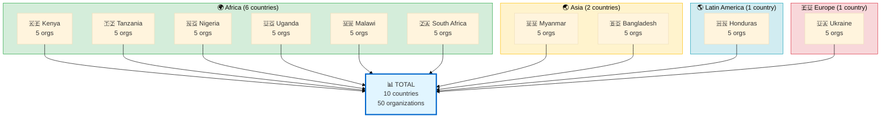
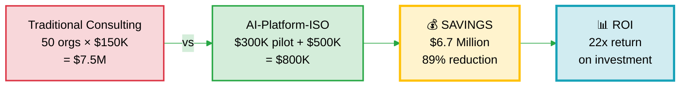
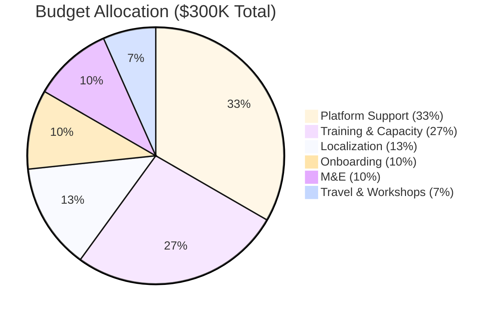
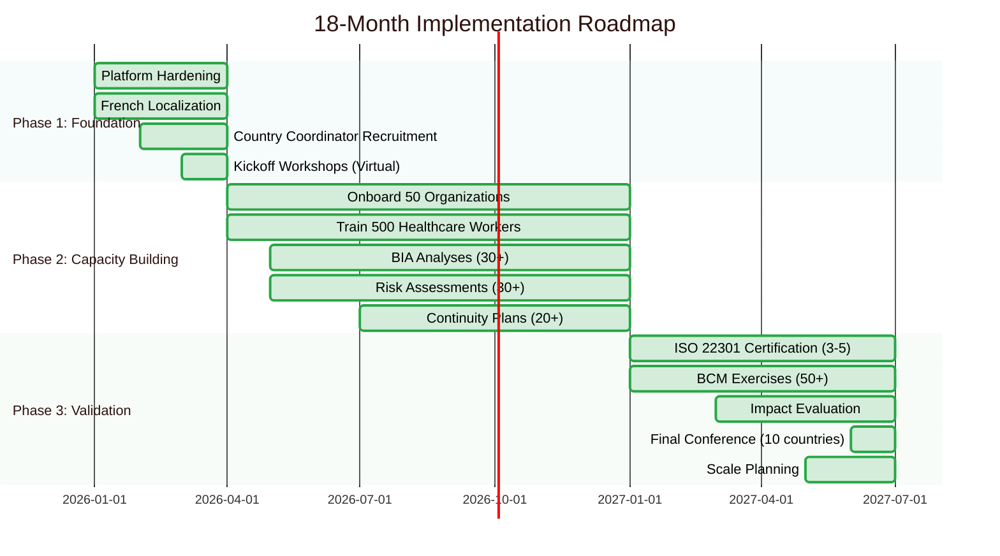

# GLOBAL FUND PARTNERSHIP PROPOSAL (SHORT)
**AI-Platform-ISO: 10-Country BCM Pilot**

**Request:** $300,000 | **Timeline:** 18 months | **Impact:** 50 organizations, $1.2M savings

---

## Who We Are

AI-Platform-ISO is the world's first AI-powered Business Continuity Management (BCM) platform designed for healthcare organizations in LMICs. We help hospitals and clinics build resilience against pandemics, disasters, cyberattacks, and conflicts—at 93% lower cost than traditional consulting ($150K → $10K per organization).

**Platform:**
- 356,679 lines of code, 40+ microservices, 81% ISO 22301 compliant
- 26 AI specialists (virtual BCM consultants available 24/7)
- 347+ healthcare case library (peer learning, privacy-preserving)
- Built through human-AI partnership (proof: 20x productivity gain)

---

## What We're Asking

**$300,000 for 10-country pilot over 18 months**

**Countries:** Kenya, Tanzania, Nigeria, Uganda, Malawi, South Africa, Myanmar, Bangladesh, Honduras, Ukraine

**Pilot structure:**
- 5 organizations per country (50 total)
- 18-month implementation (Foundation → Capacity → Validation)
- Localization (English + French for West Africa)
- M&E framework (quarterly reporting)

---

## What Global Fund Gets

### 1. Risk Mitigation for Grant Programs

**Problem:** Grant-funded health programs fail due to operational disruptions (pandemics, conflicts, disasters)

**Solution:** Implementing countries have continuity plans → programs resilient → better ROI on grants

**Example:** Hospital with BCM plan maintained 80% operations during COVID-19 vs. 40% for unprepared facilities

### 2. Massive Cost Savings

**Traditional BCM consulting:** 50 orgs × $150K = **$7.5 million**

**AI-Platform-ISO:** $300K pilot + 50 orgs × $10K = **$800K**

**Savings: $6.7 million (89% reduction)**

**Per-organization cost:** $6K (platform share) vs. $150K traditional = **96% savings**

### 3. Capacity Building in Implementing Countries

- 50 staff trained per country (500 total across 10 countries)
- In-country BCM expertise developed (vs. external consultant dependency)
- Peer learning networks established (community intelligence)
- Knowledge retention (case library grows with each use)

### 4. Measurable Impact

**Quantitative outcomes (18 months):**
- 50 healthcare organizations using platform
- 500+ healthcare workers trained in BCM
- 30+ BIA analyses completed
- 20+ continuity plans created
- 50+ BCM exercises conducted
- 3-5 ISO 22301 certifications achieved

**Qualitative outcomes:**
- Grant recipients demonstrate continuity readiness
- Programs resilient to operational disruptions
- Best practices shared across implementing countries
- Global Fund brand association with innovation

### 5. Proof of Concept for Scale

**Success = pathway to 1,000+ organizations**

If 10-country pilot succeeds:
- Scale to all Global Fund implementing countries (100+)
- National health ministry partnerships (1,000+ facilities)
- Model replicable for other health interventions

---

## Budget Breakdown ($300K)

| Category | Amount | Details |
|----------|--------|---------|
| **Platform support** | $100K | 50 orgs × $2K (AI API, infrastructure, maintenance) |
| **Training & capacity building** | $80K | 500 workers × $160 (materials, workshops, certification) |
| **Localization** | $40K | French translation, cultural adaptation |
| **Onboarding** | $30K | Country coordinators, technical support |
| **M&E** | $30K | Impact evaluation, reporting, case studies |
| **Travel & workshops** | $20K | Kickoff meetings, country visits, final conference |

**Cost per country:** $30K (vs. $750K for traditional BCM consulting for 5 orgs)

**Savings per country:** $720K

---

## Implementation Timeline (18 Months)

### Phase 1: Foundation (Months 1-3)
- Platform hardening (security, governance)
- Localization (French for West Africa)
- Country coordinator recruitment (10 countries)
- Kickoff workshops (virtual)

### Phase 2: Capacity Building (Months 4-12)
- Onboard 5 organizations per country (50 total)
- Train 50 healthcare workers per country (500 total)
- BIA analyses (30+ completed)
- Risk assessments (30+ completed)
- Continuity plans (20+ created)

### Phase 3: Validation (Months 13-18)
- ISO 22301 certification support (3-5 orgs)
- BCM exercises (50+ drills/simulations)
- Impact evaluation (midline + endline)
- Final conference (10 countries, share best practices)
- Scale planning (pathway to 100+ countries)

---

## Success Metrics

### Output Metrics
- 50 organizations onboarded (10 per country)
- 500 healthcare workers trained
- 30+ BIA analyses, 20+ continuity plans, 50+ exercises
- 3-5 ISO certifications achieved

### Outcome Metrics
- User satisfaction: NPS >50
- Knowledge retention: 80% workers demonstrate BCM competency
- Platform utilization: 70% monthly active users

### Impact Metrics
- Service continuity: Facilities maintain 80%+ operations during incidents
- Cost-effectiveness: $6K per org vs. $150K traditional (96% savings)
- Peer learning: 100+ case contributions to community library

---

## Why Global Fund Should Lead This

### 1. Strategic Alignment
- Health systems strengthening (core Global Fund priority)
- Grant program resilience (risk mitigation)
- Implementing country capacity (BCM expertise in-country)

### 2. Network & Reach
- 100+ implementing countries (built-in distribution)
- Existing relationships with health ministries
- Credibility signal (Global Fund endorsement = adoption accelerator)

### 3. Innovation Leadership
- First AI-powered BCM for global health
- Human-AI partnership proof of concept
- Replicable model (BCM today, other sectors tomorrow)

### 4. Impact Multiplier
- $300K investment → $6.7M savings (22x ROI)
- 50 orgs pilot → 1,000+ orgs scale (20x multiplication)
- 10 countries → 100+ countries (10x reach)

---

## Risk Mitigation

| Risk | Mitigation |
|------|------------|
| Low adoption | Free for LMICs, extensive training, national ministry endorsement |
| Technical failures | 79/100 security score, 30-day remediation plan, Big 3 validation |
| Language barriers | French localization (West Africa), Spanish/Portuguese (Year 2) |
| Internet connectivity | Offline mode, mobile PWA, low-bandwidth optimization |
| Sustainability | Diversified funding (Gates $450K, Anthropic $150K, cost-recovery revenue) |

---

## Partnership Structure

**Global Fund contribution:** $300K (30% of 3-year budget)

**Co-funding:**
- Gates Foundation: $450K (45%) - core operations
- Anthropic: $150K (15%) - API subsidy
- Cost-recovery: $50K (5%) - mid-size NGOs
- Others: $50K (5%) - individual donors

**Governance:**
- Quarterly steering committee (Global Fund + project team + country coordinators)
- Annual impact review (external evaluator)
- Transparent reporting (public dashboard)

---

## Next Steps

### Week 1-2: Review & Discussion
- Global Fund reviews proposal
- Request clarifications (if needed)
- Schedule full proposal presentation

### Month 1: Partnership Agreement
- Finalize country selection (10 countries)
- Sign MOU (Memorandum of Understanding)
- Establish steering committee

### Month 2-3: Pilot Preparation
- Platform hardening (security, governance)
- Localization (French)
- Country coordinator recruitment

### Month 4: Pilot Launch
- Kickoff workshops (10 countries)
- First organizations onboarded
- Training begins

### Month 18: Evaluation & Scale Planning
- Final impact report
- Scale decision (100+ countries?)
- Long-term partnership discussion

---

## Contact & Documentation

**Project Lead:** MD
**Email:** partnerships@ai-platform-iso.org
**Demo:** demo@ai-platform-iso.org

**Supporting Documents:**
- Full proposal: FUNDING_PROPOSAL_GLOBAL_FUND.md (19KB)
- Platform overview: PLATFORM_OVERVIEW.md (2 pages)
- Demo script: PLATFORM_DEMO_SCRIPT_5MIN.md
- Security audit: SECURITY_AUDIT_REPORT_2025-10-19.md
- Executive dashboard: EXECUTIVE_DASHBOARD_2025.md

---

## Key Takeaways

✅ **$300K investment → $6.7M savings** (22x ROI)

✅ **50 organizations with BCM** in 10 implementing countries

✅ **Risk mitigation** for Global Fund grant programs

✅ **Innovation leadership** (first AI-powered BCM for global health)

✅ **Proof of concept** for scale to 1,000+ organizations

**This is not just a pilot. This is proof that AI can democratize BCM expertise and strengthen health systems at unprecedented scale.**

---

**Status:** ✅ READY FOR SUBMISSION
**Date:** October 19, 2025

**Let's build resilient health systems together.** 🤝🏥
