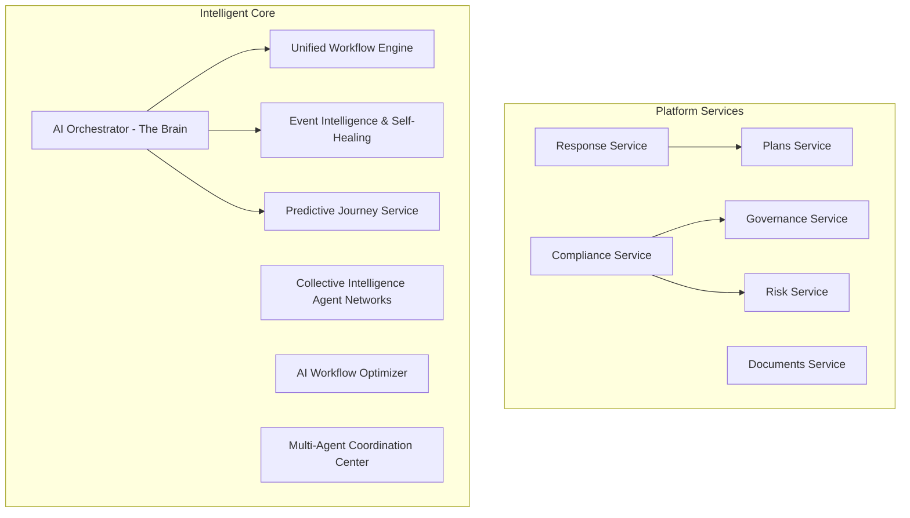

```mermaid
graph TB
    %% AI Platform ISO - Service Architecture

    subgraph Platform Services
        compliance-service["Compliance Service"]
        governance-service["Governance Service"]
        plans_service["Plans Service"]
        risk-service["Risk Service"]
        response-service["Response Service"]
        documents-service["Documents Service"]
    end

    subgraph Intelligent Core
        workflow-engine["Unified Workflow Engine"]
        predictive["Predictive Journey Service"]
        collective["Collective Intelligence Agent Networks"]
        ai_workflow_optimizer["AI Workflow Optimizer"]
        event_intelligence["Event Intelligence & Self-Healing"]
        ai-orchestration["AI Orchestrator - The Brain"]
        coordination-center["Multi-Agent Coordination Center"]
    end

    %% Key Dependencies
    ai-orchestration --> workflow-engine
    ai-orchestration --> event_intelligence
    ai-orchestration --> predictive
    response-service --> plans_service
    compliance-service --> governance-service
    compliance-service --> risk-service
```