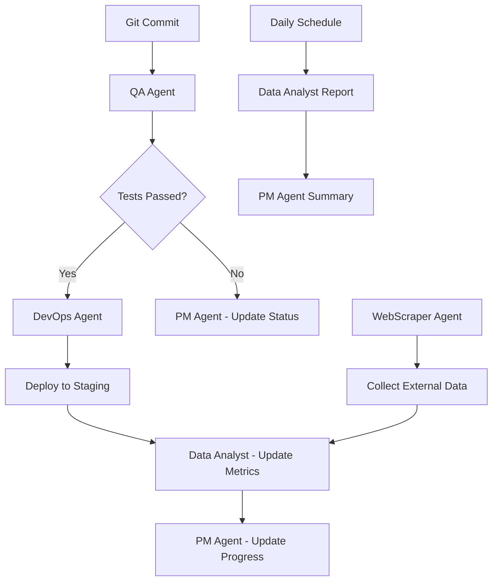

# Agent Coordination System

## Огляд системи координації агентів

Digital Office тепер включає 5 автономних агентів, які працюють координовано для забезпечення повного життєвого циклу розробки програмного забезпечення.

## Створені агенти

### 1. **WebScraper Agent** (Integration)
- **Локація**: `src/agents/integration/web-scraper/`
- **Функціонал**: Парсинг веб-сайтів, збирання даних
- **Розклад**: Кожні 60 хвилин за замовчуванням

### 2. **Senior Data Analyst Agent** (Analytics)
- **Локація**: `src/agents/analytics/senior-data-analyst/`
- **Функціонал**: Аналіз проектів, генерація звітів, метрики
- **Розклад**: Кожні 6 годин за замовчуванням

### 3. **Senior DevOps Engineer Agent** (Automation)
- **Локація**: `src/agents/automation/senior-devops-engineer/`
- **Функціонал**: Деплой, моніторинг інфраструктури, backup
- **Розклад**: Кожні 60 хвилин за замовчуванням

### 4. **Senior Project Manager Agent** (Automation)
- **Локація**: `src/agents/automation/senior-project-manager/`
- **Функціонал**: Управління проектами, планування, звітність
- **Розклад**: Щоденно за замовчуванням

### 5. **QA Engineer Agent** (Automation)
- **Локація**: `src/agents/automation/qa-engineer/`
- **Функціонал**: Автоматизоване тестування, якість коду
- **Розклад**: Кожні 30 хвилин за замовчуванням

## Потік координації між агентами

### Development Lifecycle Flow



### Event-Driven Coordination

#### **1. Code Commit Flow**
```
Git Commit → QA Agent (run tests) → DevOps Agent (deploy) → Data Analyst (metrics) → PM Agent (status update)
```

#### **2. Deployment Flow**
```
DevOps Agent (deploy.started) → QA Agent (deployment tests) → PM Agent (milestone update)
```

#### **3. Quality Gate Flow**
```
QA Agent (quality.gate.failed) → PM Agent (risk assessment) → DevOps Agent (rollback)
```

#### **4. Reporting Flow**
```
Data Analyst (generate report) → PM Agent (project status) → All Agents (performance metrics)
```

## Події EventBus координації

### Публіковані події

| Agent | Подія | Опис |
|-------|-------|------|
| **QA** | `qa.tests.completed` | Тести завершено |
| **QA** | `qa.quality.gate.failed` | Quality gate не пройдено |
| **DevOps** | `deployment.completed` | Деплой завершено |
| **DevOps** | `infrastructure.alert` | Алерт інфраструктури |
| **PM** | `project.completed` | Проект завершено |
| **PM** | `risk.identified` | Виявлено ризики |
| **DataAnalyst** | `analysis.completed` | Аналіз завершено |
| **DataAnalyst** | `alert.threshold` | Перевищено поріг |
| **WebScraper** | `scraper.completed` | Скрапінг завершено |

### Слухані події

| Agent | Слухає | Реакція |
|-------|--------|---------|
| **QA** | `git.commit` | Запускає тести |
| **DevOps** | `qa.tests.passed` | Починає деплой |
| **PM** | `deployment.completed` | Оновлює milestone |
| **DataAnalyst** | `qa.tests.completed` | Оновлює метрики |
| **All** | `project.updated` | Синхронізують дані |

## Координаційні сценарії

### 1. **Feature Development Cycle**
```typescript
// Повний цикл розробки feature
1. PM Agent створює проект та задачі
2. Git commit тригерить QA Agent
3. QA запускає тести та аналіз якості
4. При проходженні тестів → DevOps деплоїть
5. Data Analyst збирає метрики
6. PM Agent оновлює прогрес проекту
7. WebScraper може зібрати зовнішні дані про конкурентів
```

### 2. **Incident Response**
```typescript
// Обробка інциденту
1. DevOps виявляє проблему в інфраструктурі
2. Автоматичний rollback
3. QA запускає emergency тести
4. PM створює incident task
5. Data Analyst аналізує impact
6. Всі агенти отримують alert
```

### 3. **Release Planning**
```typescript
// Планування релізу
1. PM аналізує готовність features
2. QA перевіряє якість всіх компонентів
3. Data Analyst надає метрики стабільності
4. DevOps підготовує production деплой
5. WebScraper може зібрати feedback користувачів
```

## Конфігурація координації

### Глобальні налаштування EventBus
```json
{
  "eventBus": {
    "maxHistorySize": 1000,
    "debugMode": false,
    "persistEvents": true
  },
  "coordination": {
    "enableCrossAgentNotifications": true,
    "conflictResolution": "priority-based",
    "maxConcurrentAgents": 3
  }
}
```

### Пріоритети агентів
```json
{
  "agentPriorities": {
    "qa-engineer": 100,           // Найвища - безпека
    "senior-devops-engineer": 90, // Висока - стабільність
    "senior-data-analyst": 70,    // Середня - аналітика
    "senior-project-manager": 60, // Середня - планування
    "web-scraper": 30             // Низька - допоміжна
  }
}
```

## Моніторинг координації

### Dashboard метрики
- **Agent Health**: Статус всіх агентів
- **Event Flow**: Потік подій між агентами
- **Coordination Conflicts**: Конфлікти в координації
- **Performance Metrics**: Продуктивність системи

### Алертинг
- Агент не відповідає > 5 хвилин
- Event loop заблоковано
- Критичні помилки координації
- Перевищення resource quotas

## Розширення системи

### Додавання нового агента
1. Створити агент, що наслідує `BaseAgent`
2. Визначити події, які він публікує/слухає
3. Додати до координаційної схеми
4. Оновити пріоритети та конфігурацію
5. Протестувати інтеграцію з існуючими агентами

### Best Practices координації
- **Loose Coupling**: Агенти комунікують тільки через EventBus
- **Idempotency**: Операції можна виконувати кілька разів безпечно
- **Circuit Breaker**: Автоматичне відключення при помилках
- **Graceful Degradation**: Система працює навіть при відмові агентів

## Тестування координації

### Integration Tests
```typescript
// Тестування потоку commit → test → deploy
test('Full development cycle coordination', async () => {
  // Simulate git commit
  await eventBus.publish('git.commit', 'test', commitData);

  // Verify QA agent responds
  await waitFor('qa.tests.completed');

  // Verify DevOps deployment
  await waitFor('deployment.completed');

  // Verify metrics update
  await waitFor('analysis.completed');
});
```

## Команди Claude для управління

Всі агенти доступні через префікси:
- `senior-data-analyst:analyze_project`
- `senior-devops-engineer:deploy_application`
- `senior-project-manager:create_project`
- `qa-engineer:run_test_suite`
- `web-scraper:add_scraping_target`

Також доступні hub команди:
- `list_agents` - список всіх агентів
- `agent_status` - статус конкретного агента
- `enable_agent/disable_agent` - управління агентами