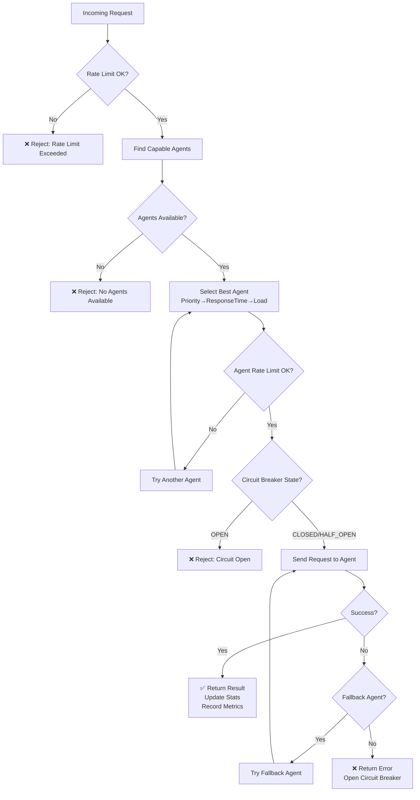
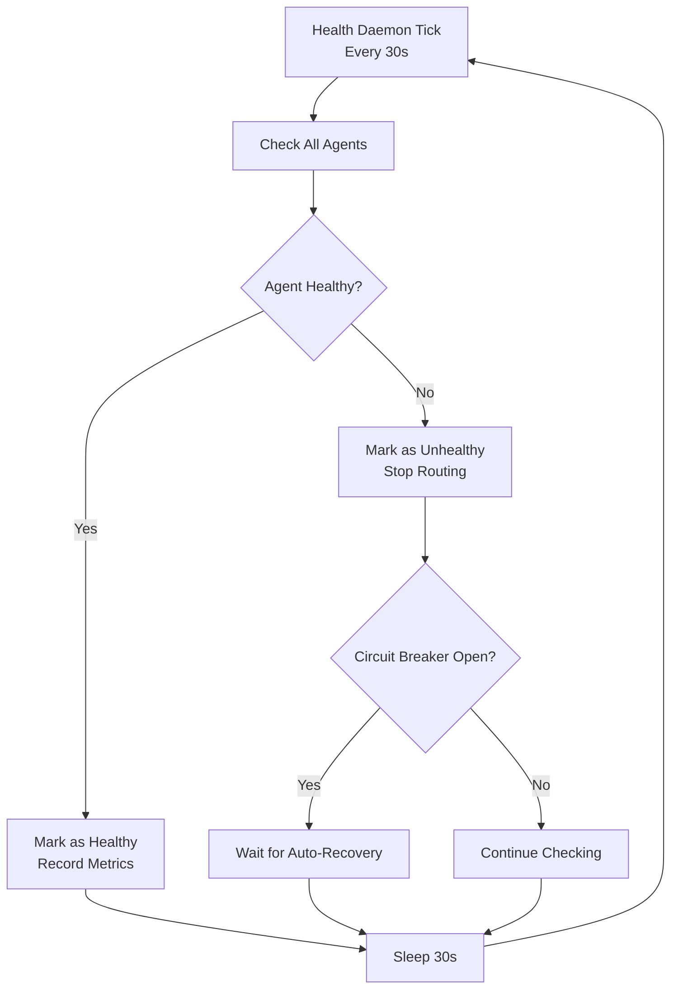
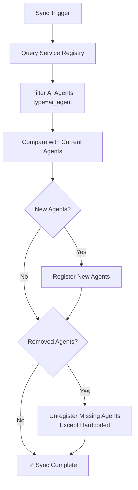

# AI Agent Router - Workflow Specification (Должностные Инструкции)

**Версия**: 2.1
**Дата**: 2025-10-07
**Статус**: Production-Ready

---

## 🎯 Роль и Ответственность

### Основная Роль
**AI Agent Router** - это **центральный нервный узел** для всех AI запросов в платформе.

### Должностные Обязанности

#### 1. Routing (Маршрутизация) 🚦
**Задача**: Направить каждый AI запрос к правильному агенту

**Процесс**:
1. Получить запрос с указанием capability (bia, pdca, document, compliance, etc.)
2. Найти всех здоровых агентов с этой capability
3. Выбрать лучшего агента (приоритет → response time → load)
4. Проверить rate limit
5. Отправить запрос через Circuit Breaker
6. Вернуть результат

**SLA**:
- Время роутинга: < 100ms
- Success rate: > 99%
- Availability: 99.9%

#### 2. Load Balancing (Балансировка Нагрузки) ⚖️
**Задача**: Равномерно распределить нагрузку между агентами

**Алгоритм**:
```python
def select_agent(agents):
    # 1. Приоритет (ниже = лучше)
    # 2. Средний response time (ниже = быстрее)
    # 3. Текущая нагрузка (ниже = свободнее)
    return sorted(agents, key=score)[0]
```

**Метрики**:
- Track last 100 response times per agent
- Update average response time continuously
- Monitor current load per agent

#### 3. Health Monitoring (Мониторинг Здоровья) 💚
**Задача**: Отслеживать здоровье всех агентов

**Процесс**:
- **Автоматические проверки**: Каждые 30 секунд
- **Health endpoint**: GET /health на каждом агенте
- **Критерии healthy**: status_code == 200 AND response_time < 5s
- **Action при unhealthy**: Mark as unhealthy → не роутить запросы → попытка восстановления

**Восстановление**:
1. Агент помечается как unhealthy
2. Circuit breaker открывается
3. Health daemon продолжает проверки
4. При восстановлении агента → circuit breaker закрывается → агент снова получает запросы

#### 4. Protection (Защита) 🛡️
**Задачи**: Защитить систему от сбоев и перегрузок

##### Circuit Breaker
**Когда открывается**:
- 5 последовательных сбоев
- Timeout > 30s

**Поведение**:
- CLOSED: Все запросы проходят
- OPEN: Запросы блокируются, exponential backoff (1s → 2s → 4s → ... → 300s max)
- HALF_OPEN: Разрешено 3 тестовых запроса

**Recovery**:
- 2 успешных запроса в HALF_OPEN → переход в CLOSED
- 1 неудача в HALF_OPEN → обратно в OPEN

##### Rate Limiting
**Global Limit**: 1000 requests/minute (по умолчанию)
**Per-Agent Limit**: Опционально, configurable

**Алгоритм**: Token Bucket
- Токены добавляются со скоростью rate/per
- Каждый запрос забирает 1 токен
- Если токенов нет → отклонить запрос

#### 5. Observability (Наблюдаемость) 📊
**Задача**: Дать полную видимость работы роутера

##### Prometheus Metrics (18+)
**Request Metrics**:
- `ai_router_requests_total` - Всего запросов
- `ai_router_request_duration_seconds` - Длительность
- `ai_router_fallback_total` - Fallback попытки
- `ai_router_errors_total` - Ошибки

**Agent Metrics**:
- `ai_router_agent_health` - Здоровье агентов (1/0)
- `ai_router_agent_response_time_seconds` - Время ответа
- `ai_router_agent_load` - Текущая нагрузка

**Circuit Breaker Metrics**:
- `ai_router_circuit_breaker_state` - Состояние (0=closed, 1=open, 2=half_open)
- `ai_router_circuit_breaker_failures_total` - Количество сбоев

**Capability Metrics**:
- `ai_router_capability_requests_total` - Запросы по capability
- `ai_router_capability_success_rate` - Success rate

##### Logs
**Что логировать**:
- ✅ Успешные запросы (DEBUG level)
- ⚠️ Fallback попытки (WARNING level)
- ❌ Ошибки (ERROR level)
- 🔄 Health check результаты (INFO level)
- 📊 Circuit breaker state changes (WARNING level)

##### Redis Analytics
**Что хранить**:
- Last 1000 requests (timestamp, capability, agent, status, duration)
- Request distribution по агентам
- Success/failure rates

#### 6. Service Discovery (Обнаружение Сервисов) 🔍
**Задача**: Автоматически обнаруживать новые агенты

**Процесс**:
1. Синхронизация с Service Registry (по требованию)
2. Обнаружение новых AI агентов (metadata: type=ai_agent)
3. Автоматическая регистрация (name, role, endpoint, capabilities, priority)
4. Удаление отключенных агентов (кроме hardcoded)

**Metadata Format**:
```python
{
    "type": "ai_agent",
    "role": "processor",  # orchestrator, processor, assistant, specialist, bridge
    "capabilities": ["bia", "document"],
    "priority": 5
}
```

---

## 📋 Workflow Диаграмма

### Main Request Flow



### Health Check Flow



### Service Discovery Flow



---

## 🔄 Integration with Temporal

### Temporal Workflow для Agent Router

**Цель**: Автоматизировать операции agent-router через Temporal

**Workflows**:

#### 1. Health Monitoring Workflow
```python
@workflow.defn
class AgentHealthMonitoringWorkflow:
    """
    Долгосрочный workflow для мониторинга здоровья агентов

    Что делает:
    - Каждые 30 секунд проверяет всех агентов
    - При сбоях пытается восстановить
    - Отправляет уведомления при критических проблемах
    """

    @workflow.run
    async def run(self, check_interval: int = 30):
        while True:
            # Health check
            await workflow.execute_activity(
                check_all_agents,
                start_to_close_timeout=timedelta(seconds=60)
            )

            # Sleep
            await asyncio.sleep(check_interval)
```

#### 2. Circuit Breaker Reset Workflow
```python
@workflow.defn
class CircuitBreakerResetWorkflow:
    """
    Автоматический reset circuit breakers при восстановлении

    Что делает:
    - Отслеживает OPEN circuit breakers
    - Периодически проверяет агента
    - При восстановлении → reset circuit breaker
    """

    @workflow.run
    async def run(self, agent_name: str):
        while True:
            # Check if agent recovered
            is_healthy = await workflow.execute_activity(
                check_agent_health,
                args=[agent_name],
                start_to_close_timeout=timedelta(seconds=10)
            )

            if is_healthy:
                # Reset circuit breaker
                await workflow.execute_activity(
                    reset_circuit_breaker,
                    args=[agent_name]
                )
                break

            # Exponential backoff
            await asyncio.sleep(backoff_time)
```

#### 3. Service Discovery Sync Workflow
```python
@workflow.defn
class ServiceDiscoverySyncWorkflow:
    """
    Периодическая синхронизация с Service Registry

    Что делает:
    - Каждые 5 минут синхронизируется с registry
    - Обнаруживает новые агенты
    - Удаляет отключенные агенты
    """

    @workflow.run
    async def run(self, sync_interval: int = 300):
        while True:
            # Sync with registry
            await workflow.execute_activity(
                sync_with_service_registry,
                start_to_close_timeout=timedelta(seconds=30)
            )

            # Sleep
            await asyncio.sleep(sync_interval)
```

#### 4. Metrics Export Workflow
```python
@workflow.defn
class MetricsExportWorkflow:
    """
    Периодический экспорт метрик

    Что делает:
    - Каждую минуту экспортирует метрики
    - Aggregates statistics
    - Push to Prometheus Pushgateway (опционально)
    """

    @workflow.run
    async def run(self):
        while True:
            # Export metrics
            await workflow.execute_activity(
                export_metrics,
                start_to_close_timeout=timedelta(seconds=10)
            )

            await asyncio.sleep(60)
```

---

## 🚀 Deployment & Automation

### GitHub Actions CI/CD

**Location**: `.github/workflows/agent-router-ci.yml`

```yaml
name: AI Agent Router CI/CD

on:
  push:
    branches: [main]
    paths:
      - 'infrastructure/AI-office-infrastructure/agent-router/**'
  pull_request:
    branches: [main]

jobs:
  test:
    runs-on: ubuntu-latest
    steps:
      - uses: actions/checkout@v3
      - uses: actions/setup-python@v4
        with:
          python-version: '3.11'

      - name: Install dependencies
        run: |
          cd infrastructure/AI-office-infrastructure/agent-router
          pip install -r requirements.txt
          pip install pytest pytest-asyncio

      - name: Run tests
        run: |
          cd infrastructure/AI-office-infrastructure/agent-router
          pytest tests/ -v

  build:
    needs: test
    runs-on: ubuntu-latest
    steps:
      - uses: actions/checkout@v3

      - name: Build Docker image
        run: |
          docker build -t ai-agent-router:${{ github.sha }} \
            -f infrastructure/AI-office-infrastructure/agent-router/Dockerfile .

      - name: Push to registry
        run: |
          # Push to your registry

  deploy:
    needs: build
    runs-on: ubuntu-latest
    if: github.ref == 'refs/heads/main'
    steps:
      - name: Deploy to production
        run: |
          # Deploy logic
```

### Docker Compose для Development

**Location**: `agent-router/docker-compose.yml`

```yaml
version: '3.8'

services:
  agent-router-metrics:
    build:
      context: .
      dockerfile: Dockerfile.metrics
    ports:
      - "9090:9090"
    environment:
      - REDIS_URL=redis://redis:6379/0
    depends_on:
      - redis
    restart: unless-stopped

  redis:
    image: redis:7-alpine
    ports:
      - "6379:6379"
    restart: unless-stopped

  prometheus:
    image: prom/prometheus:latest
    ports:
      - "9091:9090"
    volumes:
      - ./prometheus.yml:/etc/prometheus/prometheus.yml
    restart: unless-stopped

  grafana:
    image: grafana/grafana:latest
    ports:
      - "3000:3000"
    environment:
      - GF_SECURITY_ADMIN_PASSWORD=admin
    restart: unless-stopped
```

---

## 📊 SLIs/SLOs/SLAs

### Service Level Indicators (SLIs)

1. **Request Success Rate**
   - Metric: `ai_router_requests_total{status="success"}` / total
   - Target: > 99%

2. **Request Latency (p95)**
   - Metric: `ai_router_request_duration_seconds{quantile="0.95"}`
   - Target: < 500ms

3. **Agent Availability**
   - Metric: `ai_router_agent_health`
   - Target: > 95% of agents healthy

4. **Circuit Breaker Trips**
   - Metric: `ai_router_circuit_breaker_state{state="open"}`
   - Target: < 1% of time

### Service Level Objectives (SLOs)

- **Availability**: 99.9% uptime
- **Latency**: 95% of requests < 500ms
- **Error Rate**: < 1% of requests
- **Recovery Time**: Circuit breaker recovery < 5 minutes

### Service Level Agreements (SLAs)

- **Response Time**: 99% of requests within 1 second
- **Uptime**: 99.5% monthly uptime
- **Data Loss**: Zero request loss (best effort)

---

## 🎯 Success Metrics

### Operational Metrics
- Requests routed per day
- Average response time
- Circuit breaker trips per week
- Agent failures per week

### Business Metrics
- AI capability utilization (which capabilities used most)
- Agent efficiency (response time vs load)
- Cost optimization (routing efficiency)
- Developer satisfaction (ease of integration)

---

## 📚 Должностные Инструкции - Краткая Версия

### ЧТО делает Agent Router:
1. ✅ Роутит AI запросы к правильным агентам
2. ✅ Балансирует нагрузку между агентами
3. ✅ Мониторит здоровье всех агентов
4. ✅ Защищает от перегрузок (Rate Limiting)
5. ✅ Защищает от каскадных сбоев (Circuit Breaker)
6. ✅ Экспортирует метрики для мониторинга
7. ✅ Автоматически обнаруживает новые агенты
8. ✅ Логирует все операции для аналитики

### КАК работает:
1. Получает запрос с capability
2. Находит подходящих агентов
3. Выбирает лучшего (priority → response time → load)
4. Проверяет rate limits
5. Отправляет через circuit breaker
6. При ошибке пробует fallback агента
7. Логирует результат + метрики

### КОГДА вызывается:
- Через MIO Manager: `route_ai_request(capability, data)`
- Напрямую: `router.route_request(capability, data)`
- Health checks: Автоматически каждые 30s
- Service discovery: По требованию или автоматически (Temporal)

### КУДА отчитывается:
- **Prometheus**: `/metrics` endpoint (порт 9090)
- **Redis**: Request history (last 1000)
- **Logs**: Structured logging
- **MIO Manager**: Analytics API

---

**Статус**: ✅ Workflow specification complete!
