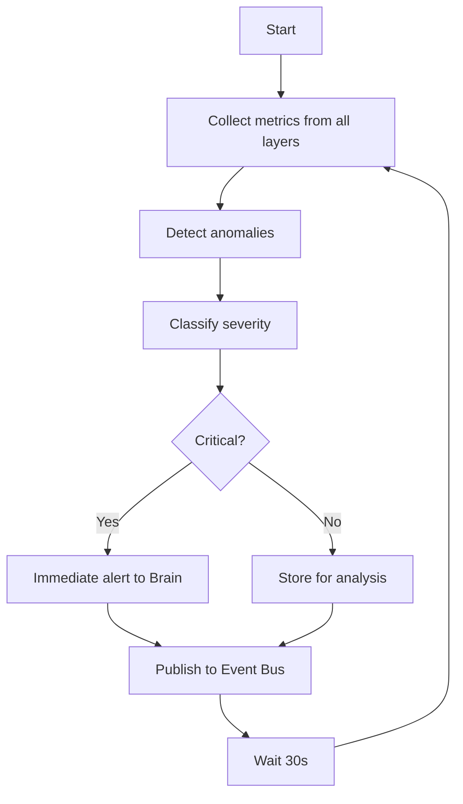
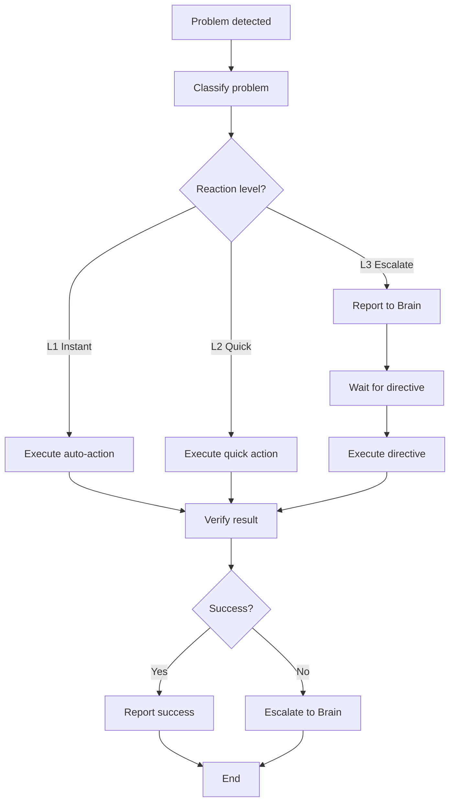
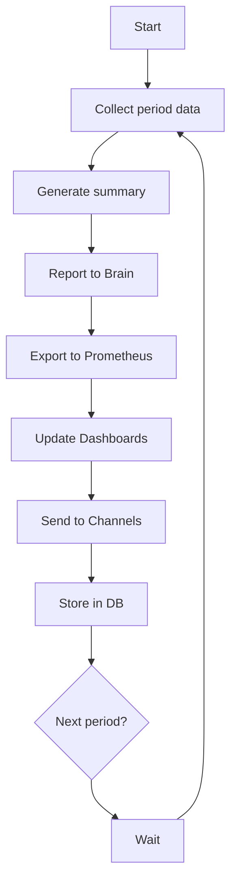
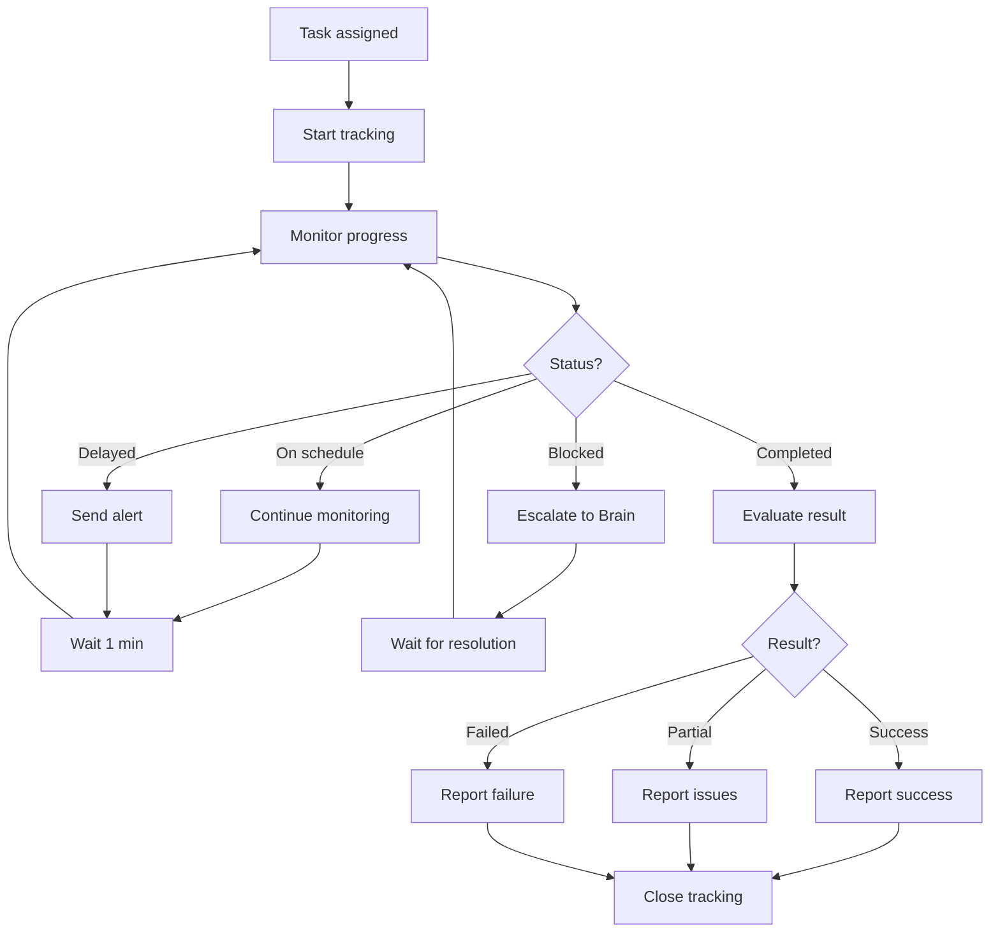

# 👁️ MIO Manager v2.0 - Workflow Specification (Должностные Инструкции)

**Версия**: 2.0
**Дата**: 2025-10-07
**Статус**: Production-Ready Foundation

---

## 🎯 Должность и Роль

### Официальное Название:
**"Platform Observability, Rapid Reaction & Comprehensive Reporting Manager"**

### Сокращённо:
**"Platform Eyes"** (Глаза Платформы)

### Метафора:
**Глаза + Нервная Система** организма (НЕ мозг!)

### Расположение в Иерархии:
```
intelligent-core/
├── workflow_intelligence/     ← 🧠 BOSS (мозг - принимает стратегические решения)
│
├── orchestration/
│   ├── coordination-center/   ← 🎯 PEER/BOSS (координирует задачи)
│   ├── bcm-orchestrator/      ← 🤲 PEER (выполняют задачи)
│   └── ai-orchestration/      ← 🤲 PEER (выполняют задачи)
│
infrastructure/
└── mio-manager/               ← 👁️ YOU (глаза - наблюдаешь, реагируешь, докладываешь)
```

---

## 📋 Должностные Обязанности (5 Categories)

---

### 1. 👁️ System-Wide Observation (Системное Наблюдение)

**Задача**: Видеть ВСЁ что происходит в платформе

#### Обязанности:

**A. Layer Monitoring (Мониторинг Слоёв)**
- Infrastructure Layer:
  - Docker containers health
  - Redis, PostgreSQL, Temporal status
  - Network, disk, CPU, memory

- Platform Services Layer:
  - API Gateway, Auth, Monitoring services
  - Requests rate, latency, errors

- Intelligent-Core Layer:
  - workflow_intelligence, orchestration, expertise-center
  - AI requests, model latency, accuracy

**B. Module Monitoring (Мониторинг Модулей)**
- Каждый сервис индивидуально
- Каждый микросервис
- Каждый критичный компонент

**C. KPI Tracking (Отслеживание КПИ)**
- System-wide performance metrics
- Business metrics (if applicable)
- Quality metrics
- User experience metrics

**D. Anomaly Detection (Детекция Аномалий)**
- Statistical anomalies (deviation from baseline)
- Pattern-based anomalies (unusual behaviors)
- Predictive anomalies (будущие проблемы)

#### SLAs:
- **Detection Latency**: <5 seconds от события до обнаружения
- **Coverage**: 100% всех критичных компонентов
- **False Positive Rate**: <5%
- **Uptime**: 99.9% (наблюдение НЕ останавливается)

#### Метрики:
```prometheus
mio_observation_coverage_percentage 100.0
mio_detection_latency_seconds{p95} 3.2
mio_false_positives_total 12
mio_observation_uptime_seconds 2592000
```

---

### 2. ⚡ Rapid Automated Reaction (Быстрое Автоматическое Реагирование)

**Задача**: Быстро реагировать на типовые ситуации

#### Уровни Реагирования:

**Level 1: Instant Reflex (<10 секунд)**

**Автономные Действия** (MIO делает САМ):
- Service restart (до 3 попыток)
- Disk cleanup (при >90% usage)
- Memory garbage collection
- Cache cleanup
- Temporary file removal

**Условия**:
- Известная проблема
- Проверенное решение
- Низкий risk

**Действие**:
```python
if service_down and restart_attempts < 3:
    action = "restart_service"
    execute(action)
    report_to_brain(action, level="info")
```

**SLA**: <10 секунд от обнаружения до действия

---

**Level 2: Quick Response (<1 минута)**

**Быстрые Действия** (MIO делает САМ по правилам):
- Resource scaling (добавить/убрать nodes)
- Circuit breaker activation
- Rate limiting adjustment
- Preventive actions (на основе predictions)
- Alert escalation

**Условия**:
- Правило существует
- Medium risk
- Обратимое действие

**Действие**:
```python
if predicted_load_spike_in_1h and current_capacity < 80%:
    action = "scale_up_preventively"
    execute(action)
    report_to_brain(action, level="info")
```

**SLA**: <1 минута от обнаружения до действия

---

**Level 3: Escalation to Brain (<30 секунд)**

**Эскалация к Мозгу** (НЕ принимает решение сам):
- Complex problems
- Unknown patterns
- High risk situations
- Critical decisions
- Strategic changes

**Условия**:
- Сложная ситуация
- Нет готового правила
- Требуется анализ

**Действие**:
```python
if complex_problem or unknown_pattern or critical_severity:
    report = {
        "problem": {...},
        "severity": "high",
        "context": {...},
        "recommendations": [option_A, option_B, option_C],
        "asking_for": "decision"
    }
    escalate_to_brain(report)

    # ЖДЁТ решения от мозга
    directive = await wait_for_brain_decision()

    # ВЫПОЛНЯЕТ указание мозга
    execute_directive(directive)

    # КОНТРОЛИРУЕТ выполнение
    monitor_execution(directive.task_id)

    # ДОКЛАДЫВАЕТ результат
    report_result_to_brain(directive.task_id, result)
```

**SLA**: <30 секунд до эскалации

---

#### Метрики Реагирования:
```prometheus
mio_reactions_total{level="L1_instant"} 234
mio_reactions_total{level="L2_quick"} 89
mio_escalations_total{level="L3_brain"} 12

mio_reaction_latency_seconds{level="L1",p95} 8.5
mio_reaction_latency_seconds{level="L2",p95} 45.0
mio_escalation_latency_seconds{p95} 15.0

mio_auto_resolution_rate 0.72  # 72% решил сам
```

---

### 3. 📢 Comprehensive Reporting (Всесторонняя Отчётность)

**Задача**: Докладывать нужное нужным

#### Направления Отчётности:

**A. Upward Reporting (Вверх - к Мозгу)**

**Кому**: workflow_intelligence (Brain)

**Что докладывать**:
- **Critical problems** - сразу (real-time)
- **Recommendations** - для сложных проблем
- **System state** - каждый час (summary)
- **KPIs and metrics** - ежедневно (daily report)
- **Patterns discovered** - при обнаружении
- **Action results** - после каждого действия

**Формат**:
```python
# Critical problem
await brain_client.report_problem({
    "type": "service_down",
    "service": "unified_ai",
    "severity": "high",
    "context": {...},
    "recommendations": [...]
})

# Regular metrics
await brain_client.report_metrics({
    "system_health": 0.95,
    "performance": {...},
    "incidents": [...]
})
```

**SLA**:
- Critical: <10 секунд
- Metrics: Real-time stream
- Reports: Hourly/Daily as scheduled

---

**B. Horizontal Reporting (Горизонтально - к Системам)**

**Кому**: Prometheus, Grafana, Event Bus, Other Services

**Что публиковать**:
- **Prometheus metrics** - real-time (каждую секунду)
- **Events to Event Bus** - каждое важное событие
- **Dashboard updates** - real-time
- **System status** - continuously

**Формат**:
```python
# Prometheus
mio_service_health{service="unified_ai"} 1
mio_requests_total{service="unified_ai",status="success"} 12340

# Event Bus
await event_bus.publish("system.service_down", {
    "service": "unified_ai",
    "timestamp": "...",
    "context": {...}
})
```

**SLA**: <1 секунда latency для real-time данных

---

**C. Alert Management (Управление Алертами)**

**Кому**: Teams (Slack, Email, SMS, Webhook)

**Типы алертов**:
- **Critical** - immediate action required
- **High** - action needed soon
- **Medium** - for awareness
- **Low** - informational

**Каналы**:
- Slack (real-time)
- Email (for records)
- SMS (critical only)
- Webhook (для внешних систем)
- Dashboard (always visible)

**Эскалация**:
- Critical: immediate → если не отреагировали за 5 мин → эскалировать
- High: 15 мин → эскалировать
- Medium: 1 час → эскалировать

**SLA**:
- Critical alert: <10 секунд
- Escalation: according to schedule

---

**D. External Reporting (Внешняя Отчётность)**

**Кому**: External systems via API

**Что предоставлять**:
- REST API для запроса статуса
- Webhooks для событий
- Reports export (JSON, CSV)

---

#### Метрики Отчётности:
```prometheus
mio_reports_sent_total{destination="brain"} 1234
mio_reports_sent_total{destination="prometheus"} 999999
mio_alerts_sent_total{severity="critical"} 23
mio_escalations_total 5

mio_report_latency_seconds{destination="brain",p95} 2.1
mio_alert_latency_seconds{severity="critical",p95} 5.2
```

---

### 4. 👁️ Execution Control (Контроль Выполнения)

**Задача**: Контролировать выполнение задач до конца

#### Что Контролируем:

**A. Own Actions (Свои Действия)**
- Tracking результата каждого Level 1-2 action
- Проверка что проблема действительно решена
- Rollback если не помогло

**Пример**:
```python
# After restart service
action_result = await verify_service_health("unified_ai")
if not action_result.success:
    await rollback_action(action_id)
    await escalate_to_brain("Restart failed, need help")
```

---

**B. Delegated Tasks (Задачи от Мозга/Координации)**
- Tracking задач полученных от Brain/Coordination
- Мониторинг прогресса
- Эскалация при проблемах
- Оценка результата

**Жизненный Цикл Задачи**:
```
1. Received from Brain/Coordination
   ↓
2. Start tracking (task_id, expected_completion)
   ↓
3. Monitor progress (every 1 minute)
   ├─ On schedule? Continue
   ├─ Delayed? Alert
   └─ Blocked? Escalate to Brain
   ↓
4. Task completed
   ↓
5. Evaluate result
   ├─ Success? Report success
   ├─ Partial? Report partial + issues
   └─ Failed? Report failure + root cause
   ↓
6. Close tracking
```

**SLA**:
- Progress check frequency: Every 1 minute
- Escalation на задержку: Если delay > 20% от expected time
- Result evaluation: Within 5 minutes after completion

---

#### Метрики Контроля:
```prometheus
mio_tasks_tracked_total 456
mio_tasks_completed_total 450
mio_tasks_escalated_total 6

mio_task_tracking_accuracy 1.0  # 100%
mio_progress_check_frequency_seconds 60
mio_result_evaluation_latency_seconds{p95} 180
```

---

### 5. 📚 Continuous Learning (Непрерывное Обучение)

**Задача**: Учиться на опыте и улучшаться

#### Что Отслеживаем:

**A. Reaction Effectiveness (Эффективность Реакций)**
- Какие Level 1-2 actions сработали?
- Какие не сработали?
- Сколько попыток потребовалось?
- Как быстро решили проблему?

**Метрики**:
```python
{
    "action": "restart_service",
    "success_rate": 0.95,  # 95%
    "avg_attempts": 1.2,
    "avg_resolution_time": 8.5  # seconds
}
```

---

**B. Pattern Recognition (Распознавание Паттернов)**
- Повторяющиеся проблемы
- Корреляции между событиями
- Сезонные паттерны
- Аномальные паттерны

**Действие**:
```python
if pattern_detected("service_down_after_deployment"):
    await brain_client.report_pattern({
        "pattern": "deployment_causes_issues",
        "frequency": 8,  # из 10 deployments
        "recommendation": "add pre-deployment health check"
    })
```

---

**C. Rules Improvement (Улучшение Правил)**
- На основе effectiveness data
- Добавление новых Level 1-2 rules
- Удаление неэффективных rules
- Оптимизация существующих

**Процесс**:
1. Analyze effectiveness data weekly
2. Propose new/updated rules
3. Submit to Brain for approval
4. Apply approved rules

---

**D. Feedback to Brain (Обратная Связь Мозгу)**
- Результаты действий
- Найденные паттерны
- Предложения по улучшению
- Данные для обучения AI моделей

---

#### Метрики Обучения:
```prometheus
mio_patterns_discovered_total 23
mio_rules_added_total 5
mio_rules_removed_total 2
mio_effectiveness_improvement_rate 0.15  # +15% за период
```

---

## 🔄 4 Core Temporal Workflows

### Workflow 1: ObservationWorkflow

**Цель**: Непрерывное наблюдение за системой

**Частота**: Каждые 30 секунд

**Процесс**:


**Outputs**:
- Events to Event Bus
- Metrics to Prometheus
- Alerts (if needed)

---

### Workflow 2: ReactionWorkflow

**Цель**: Автоматическое реагирование на проблемы

**Триггер**: On problem detection event

**Процесс**:


**Decision Logic**:
```python
def classify_reaction_level(problem):
    if is_known_issue(problem) and low_risk(problem):
        return "L1_instant"
    elif has_rule(problem) and medium_risk(problem):
        return "L2_quick"
    else:
        return "L3_escalate"
```

---

### Workflow 3: ReportingWorkflow

**Цель**: Регулярная отчётность во все каналы

**Частота**:
- Metrics: Real-time (streaming)
- Summary: Hourly
- Reports: Daily

**Процесс**:


**Report Structure**:
```python
{
    "period": "2025-10-07 10:00-11:00",
    "system_health": 0.98,
    "incidents": [
        {"type": "service_down", "count": 2, "resolved": 2},
        {"type": "high_cpu", "count": 5, "resolved": 5}
    ],
    "auto_actions": {
        "L1": 23,
        "L2": 8,
        "L3": 2
    },
    "performance": {
        "avg_response_time": 45,  # ms
        "requests_total": 123456
    }
}
```

---

### Workflow 4: ControlWorkflow

**Цель**: Контроль выполнения задач от Brain/Coordination

**Триггер**: On task assignment

**Процесс**:


**Tracking Data**:
```python
{
    "task_id": "task-123",
    "assigned_by": "coordination_center",
    "assigned_at": "2025-10-07T10:00:00Z",
    "expected_completion": "2025-10-07T10:30:00Z",
    "actual_completion": "2025-10-07T10:28:00Z",
    "progress_checks": 28,
    "issues_encountered": 0,
    "result": "success",
    "evaluation": {
        "quality": "high",
        "on_time": true,
        "metrics_improved": true
    }
}
```

---

## 📊 SLIs / SLOs / SLAs

### Service Level Indicators (SLIs)

**Observation SLIs**:
- Detection latency
- Coverage percentage
- False positive rate
- Observation uptime

**Reaction SLIs**:
- Reaction latency by level
- Auto-resolution rate
- Action success rate

**Reporting SLIs**:
- Report latency
- Alert delivery time
- Metrics freshness

**Control SLIs**:
- Task tracking accuracy
- Progress check frequency
- Escalation timeliness

---

### Service Level Objectives (SLOs)

| Metric | Target | Measurement |
|--------|--------|-------------|
| Detection Latency (p95) | <5s | 95% of detections within 5s |
| Observation Coverage | 100% | All critical components monitored |
| L1 Reaction Latency (p95) | <10s | 95% of L1 actions within 10s |
| L2 Reaction Latency (p95) | <60s | 95% of L2 actions within 60s |
| L3 Escalation Latency (p95) | <30s | 95% of escalations within 30s |
| Auto-Resolution Rate | >70% | At least 70% resolved without Brain |
| Critical Alert Latency (p95) | <10s | 95% of critical alerts within 10s |
| Metrics Freshness | <1s | Prometheus metrics lag <1s |
| Task Tracking Accuracy | 100% | All tasks tracked correctly |
| Observation Uptime | 99.9% | Observability available 99.9% of time |

---

### Service Level Agreements (SLAs)

**Tier 1 (Critical)**:
- Detection of critical issues: <5s (guaranteed)
- Critical alerts: <10s (guaranteed)
- L3 escalation: <30s (guaranteed)

**Tier 2 (High Priority)**:
- L1 reactions: <10s (best effort)
- L2 reactions: <60s (best effort)
- Task tracking: 100% (guaranteed)

**Tier 3 (Normal)**:
- Observation coverage: 100% (guaranteed)
- Reporting frequency: As scheduled (guaranteed)
- Learning updates: Weekly (best effort)

---

## 🔗 Integration Points

### With Workflow Intelligence (Brain)

**Client**: `integrations/workflow_intelligence_client.py`

**APIs**:
- `POST /api/problems` - Report problems
- `POST /api/decisions/request` - Ask for decisions
- `PUT /api/tasks/{id}/status` - Update task status
- `POST /api/recommendations` - Send recommendations
- `POST /api/metrics` - Send metrics
- `POST /api/patterns` - Report discovered patterns

---

### With Coordination Center

**Client**: `integrations/coordination_center_client.py`

**APIs**:
- `GET /api/tasks/assigned` - Get assigned tasks
- `PUT /api/tasks/{id}/progress` - Report progress
- `POST /api/tasks/{id}/escalate` - Escalate issues

---

### With Predictive Service

**Client**: `integrations/predictive_client.py`

**APIs**:
- `GET /api/predictions` - Get predictions
- `WS /api/predictions/stream` - Real-time predictions
- `POST /api/predictions/feedback` - Send feedback

---

### With Event Bus

**Integration**: Direct event publishing/subscribing

**Events Published**:
- `system.problem.*` - All problems detected
- `system.action.*` - All actions taken
- `system.metric.*` - Critical metrics changes

**Events Subscribed**:
- `brain.directive.*` - Directives from Brain
- `coordination.task.*` - Task assignments
- `predictive.prediction.*` - Predictions

---

## 🎯 Success Metrics

### MIO Manager считается успешным если:

**Observation**:
- ✅ 100% coverage всех критичных компонентов
- ✅ <5s detection latency (p95)
- ✅ <5% false positive rate
- ✅ 99.9% uptime

**Reaction**:
- ✅ >70% problems auto-resolved (L1+L2)
- ✅ <10s reaction time для L1 (p95)
- ✅ <60s reaction time для L2 (p95)
- ✅ <30s escalation time для L3 (p95)

**Reporting**:
- ✅ <10s critical alert latency (p95)
- ✅ <1s metrics freshness
- ✅ 100% report delivery success
- ✅ 0 missed escalations

**Control**:
- ✅ 100% task tracking accuracy
- ✅ Every 1 min progress checks
- ✅ <5 min result evaluation latency

**Learning**:
- ✅ Weekly effectiveness analysis
- ✅ Monthly rules improvement
- ✅ Patterns discovered and reported
- ✅ +10% effectiveness improvement per quarter

---

## 🚀 Deployment & Operations

### Deployment Model:
- **Container**: Docker
- **Orchestration**: Docker Compose / Kubernetes
- **Scaling**: Horizontal (multiple MIO instances possible)
- **HA**: Active-Active with shared Redis

### Resource Requirements:
- **CPU**: 2 cores minimum
- **Memory**: 4GB minimum
- **Disk**: 10GB for logs
- **Network**: Low latency to all monitored services

### Dependencies:
- Redis (for state/analytics)
- Event Bus (for communication)
- Prometheus (for metrics)
- Temporal (for workflows)

---

## 📚 For Context Continuation

**This specification defines**:
- ✅ Role of MIO Manager (Platform Eyes, not Brain)
- ✅ 5 duty categories with clear SLAs
- ✅ 3-level reaction model (L1/L2/L3)
- ✅ 4 core workflows (Observation, Reaction, Reporting, Control)
- ✅ Integration points with intelligent-core
- ✅ Success metrics and SLOs

**Next steps**:
- Implement reaction rules engine
- Create 4 Temporal workflows
- Build integration clients
- Implement monitoring layer

---

**Status**: ✅ Foundation Complete - Ready for Implementation

**Principle**: MIO = Eyes, Not Brain. Intelligence emerges from the whole system!
