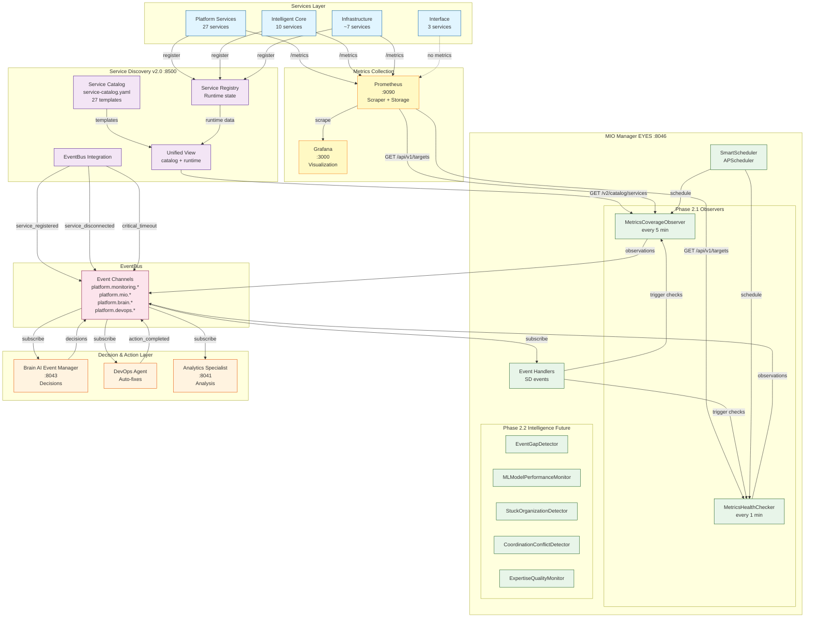
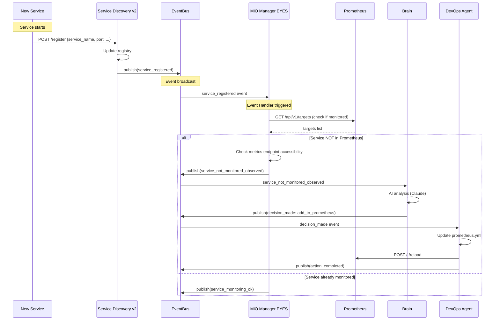
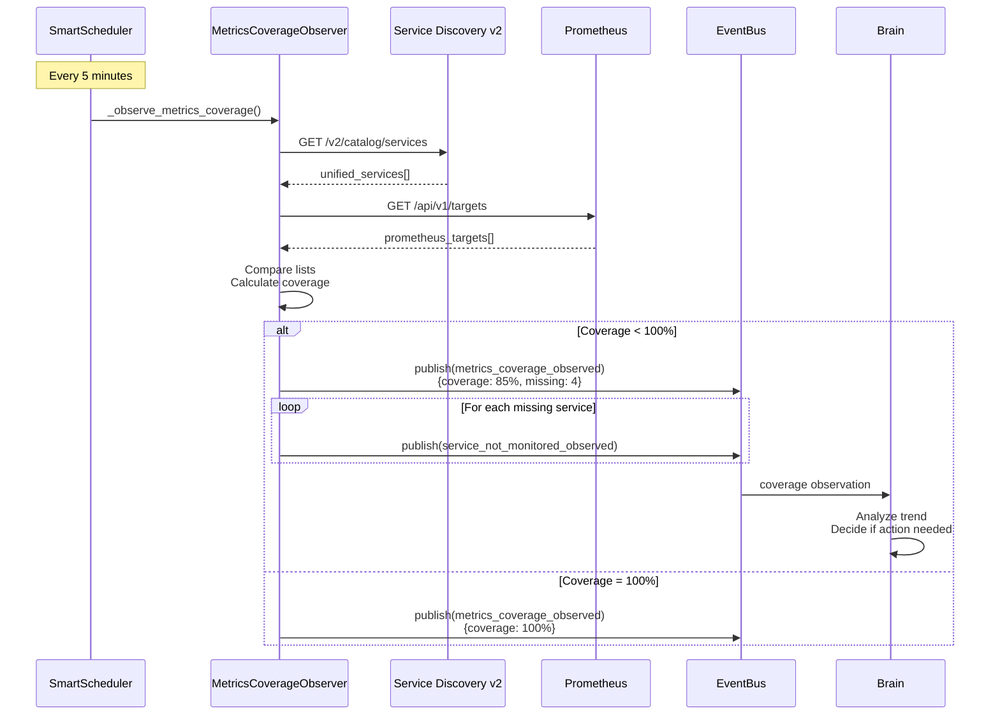
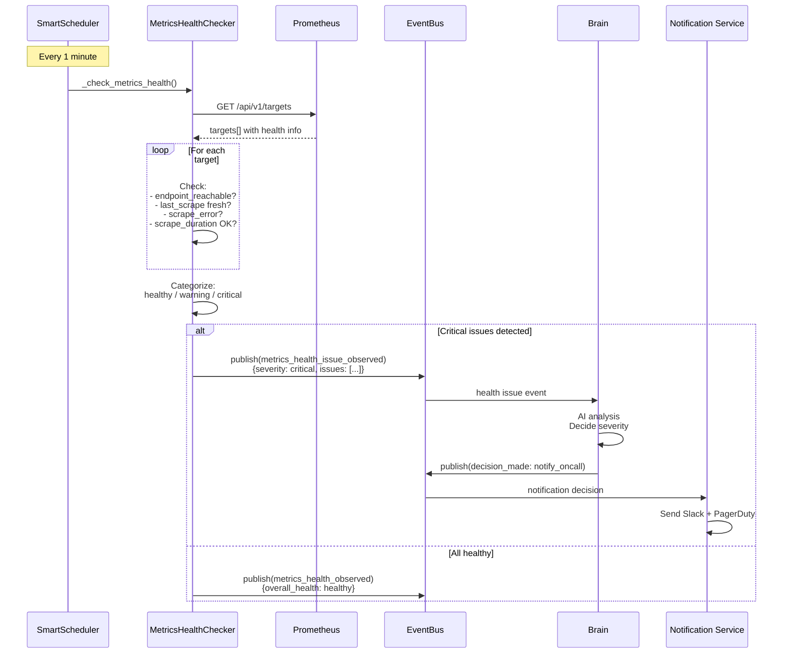

# Диаграмма архитектуры системы мониторинга

**Version**: 2.0
**Date**: October 11, 2025

## Full System Architecture



## Event Flow Diagrams

### 1. New Service Registration Flow



### 2. Metrics Coverage Observation Cycle



### 3. Metrics Health Check Cycle



## Component Interaction Matrix

| Component | Produces Events | Consumes Events | External APIs |
|-----------|----------------|-----------------|---------------|
| **Service Discovery v2** | service_registered<br/>service_disconnected<br/>critical_timeout | - | - |
| **MIO Manager** | metrics_coverage_observed<br/>service_not_monitored_observed<br/>metrics_health_observed<br/>metrics_health_issue_observed | service_registered<br/>service_disconnected<br/>critical_timeout | Prometheus API<br/>SD v2 API |
| **Brain** | decision_made | platform.mio.*<br/>platform.monitoring.* | Anthropic AI API |
| **DevOps Agent** | action_completed | decision_made | Prometheus reload<br/>Docker API<br/>Git API |
| **Analytics** | - | All events | PostgreSQL |
| **Notification** | - | decision_made (notify) | Slack API<br/>PagerDuty API |

## Technology Stack

### MIO Manager (EYES)
```python
# Core framework
fastapi              # Web framework
uvicorn[standard]    # ASGI server
pydantic             # Data validation

# Scheduling
apscheduler          # Job scheduling

# HTTP clients
httpx                # Async HTTP client

# Event infrastructure
redis                # EventBus backend
asyncpg              # PostgreSQL for persistence

# Metrics
prometheus-client    # Prometheus exporter
```

### Service Discovery v2.0
```python
fastapi
pydantic
pydantic-settings
sqlalchemy           # ORM
asyncpg              # PostgreSQL driver
redis                # Registry cache
httpx                # Service health checks
pyyaml               # Catalog loading
```

### Prometheus
```yaml
# Time-series database
prometheus:2.x

# Exporters
node-exporter        # System metrics
postgres-exporter    # PostgreSQL metrics
custom exporters     # Service-specific
```

## Data Models

### UnifiedService (Service Discovery)
```python
@dataclass
class UnifiedService:
    # From catalog (static)
    name: str
    type: str
    business_process: str
    kpis: List[str]
    expected_port: Optional[int]
    metrics_endpoint: Optional[str]
    health_endpoint: Optional[str]

    # From runtime (dynamic)
    runtime_status: ServiceStatus
    registration_status: RegistrationStatus
    orchestrator: Optional[str]
    actual_port: Optional[int]
    health_status: Optional[str]
    last_seen: Optional[datetime]
```

### MetricsCoverageObservation (MIO)
```python
@dataclass
class MetricsCoverageObservation:
    timestamp: datetime
    coverage_percentage: float
    total_registered_services: int
    monitored_services: int
    not_monitored_services: int
    unknown_services: int
    not_monitored_list: List[str]
    unknown_list: List[str]
    recommendation: str
```

### MetricsHealthObservation (MIO)
```python
@dataclass
class MetricsHealthObservation:
    timestamp: datetime
    total_services: int
    healthy_services: int
    warning_services: int
    critical_services: int
    unreachable_services: int
    service_healths: List[ServiceMetricsHealth]
    overall_health: str  # healthy/degraded/critical
    critical_issues: List[str]
    recommendation: str
```

## Configuration

### MIO Manager Settings
```python
# config.py
class Settings(BaseSettings):
    # Service info
    SERVICE_NAME: str = "mio-manager"
    SERVICE_PORT: int = 8046

    # External services
    PROMETHEUS_URL: str = "http://prometheus:9090"
    SERVICE_DISCOVERY_URL: str = "http://service-discovery:8500"
    EVENTBUS_URL: str = "http://eventbus:3001"

    # Observation intervals
    COVERAGE_CHECK_INTERVAL_MINUTES: int = 5
    HEALTH_CHECK_INTERVAL_MINUTES: int = 1

    # Thresholds
    SCRAPE_FRESHNESS_THRESHOLD_SECONDS: int = 120
    CRITICAL_COVERAGE_THRESHOLD_PERCENT: float = 80.0
```

### Service Discovery Settings
```python
class Settings(BaseSettings):
    # Catalog
    CATALOG_PATH: str = "/app/service-catalog/service-catalog.yaml"
    CATALOG_VERSION: str = "2.0.0"

    # Registry
    REGISTRY_REDIS_URL: str = "redis://redis:6379/0"
    HEARTBEAT_TIMEOUT_SECONDS: int = 60

    # EventBus
    EVENTBUS_URL: str = "http://eventbus:3001"
    PUBLISH_EVENTS: bool = True
```

## Deployment

### Docker Compose Services
```yaml
version: '3.8'

services:
  prometheus:
    image: prom/prometheus:latest
    ports:
      - "9090:9090"
    volumes:
      - ./prometheus.yml:/etc/prometheus/prometheus.yml
      - prometheus-data:/prometheus

  grafana:
    image: grafana/grafana:latest
    ports:
      - "3000:3000"
    depends_on:
      - prometheus

  service-discovery:
    build: ./service-discovery
    ports:
      - "8500:8500"
    environment:
      - EVENTBUS_URL=http://eventbus:3001
    depends_on:
      - redis
      - postgres
      - eventbus

  mio-manager:
    build: ./mio-manager
    ports:
      - "8046:8046"
    environment:
      - PROMETHEUS_URL=http://prometheus:9090
      - SERVICE_DISCOVERY_URL=http://service-discovery:8500
      - EVENTBUS_URL=http://eventbus:3001
    depends_on:
      - prometheus
      - service-discovery
      - eventbus

  redis:
    image: redis:7-alpine
    ports:
      - "6379:6379"

  postgres:
    image: postgres:15-alpine
    environment:
      - POSTGRES_DB=ai_platform
      - POSTGRES_USER=platform
      - POSTGRES_PASSWORD=secret
```

## Monitoring Dashboards

### Grafana Dashboards

#### 1. Platform Overview
- Total services (from Service Discovery)
- Service health distribution
- Metrics coverage percentage
- EventBus activity

#### 2. MIO Manager Dashboard
- Observation cycles status
- Coverage trend (last 24h)
- Health issues detected
- Events published rate

#### 3. Service Discovery Dashboard
- Registered services
- Missing services alert
- Unknown services alert
- Registration events rate

## Alerts & Rules

### Prometheus Alert Rules
```yaml
groups:
  - name: monitoring_coverage
    rules:
      - alert: LowMetricsCoverage
        expr: mio_metrics_coverage_percentage < 90
        for: 10m
        labels:
          severity: warning
        annotations:
          summary: "Low metrics coverage: {{ $value }}%"

      - alert: CriticalMetricsCoverage
        expr: mio_metrics_coverage_percentage < 80
        for: 5m
        labels:
          severity: critical
        annotations:
          summary: "CRITICAL: Metrics coverage below 80%"

  - name: service_health
    rules:
      - alert: ServiceMetricsUnhealthy
        expr: mio_unhealthy_services_count > 0
        for: 2m
        labels:
          severity: warning
        annotations:
          summary: "{{ $value }} services have unhealthy metrics"

      - alert: ServiceMetricsUnreachable
        expr: mio_unreachable_endpoints_count > 0
        for: 1m
        labels:
          severity: critical
        annotations:
          summary: "{{ $value }} metrics endpoints unreachable"
```

---

**Last Updated**: October 11, 2025
**Diagram Version**: 2.0
**Mermaid Compatible**: ✅ Yes
