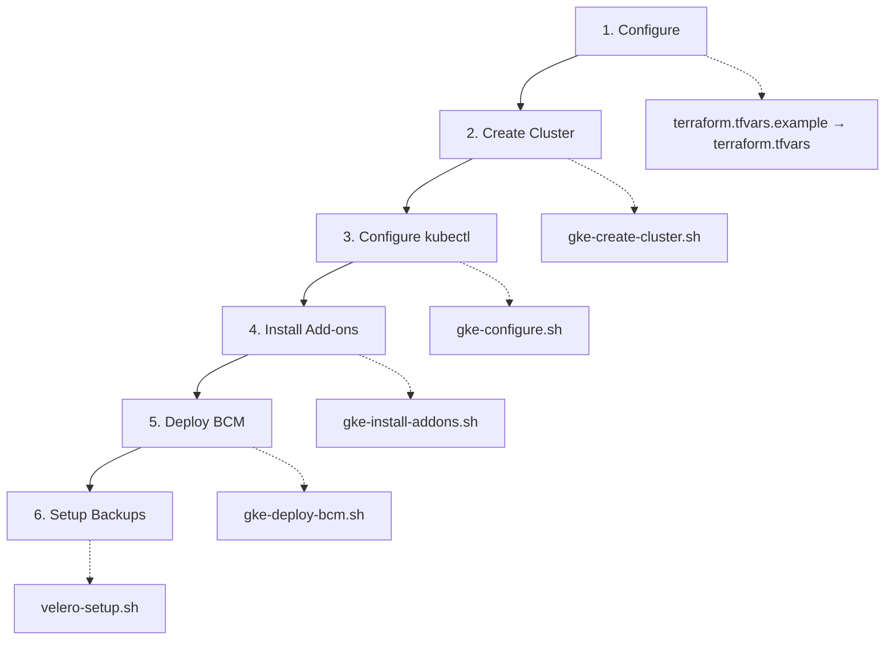

# GKE Deployment - File Index

Complete index of all files in the GKE deployment directory.

## Quick Navigation

- **New to GKE?** Start with [QUICK_START.md](QUICK_START.md)
- **Need detailed info?** See [README.md](README.md)
- **Production deployment?** Use [DEPLOYMENT_CHECKLIST.md](DEPLOYMENT_CHECKLIST.md)
- **Command reference?** Check [GCLOUD_COMMANDS_REFERENCE.md](GCLOUD_COMMANDS_REFERENCE.md)

## File Structure

```
infrastructure/deployment/gke/
├── README.md                      # Main documentation (20KB)
├── QUICK_START.md                 # 5-minute quick start guide
├── DEPLOYMENT_CHECKLIST.md        # Production deployment checklist
├── GCLOUD_COMMANDS_REFERENCE.md   # Complete gcloud command reference
├── INDEX.md                       # This file - navigation guide
├── .gitignore                     # Git ignore rules
├── terraform.tfvars.example       # Configuration template
├── gke-create-cluster.sh          # Script 1: Create GKE cluster
├── gke-configure.sh               # Script 2: Configure kubectl
├── gke-install-addons.sh          # Script 3: Install Istio & addons
├── gke-deploy-bcm.sh              # Script 4: Deploy BCM platform
└── velero-setup.sh                # Script 5: Setup Velero backups
```

## Documentation Files

### 1. README.md
**Size**: ~20KB | **Type**: Primary Documentation

**Contains**:
- Complete deployment guide
- Prerequisites and setup
- Detailed step-by-step instructions
- Velero backup setup
- Monitoring and operations
- Troubleshooting guide
- Security best practices
- Cost optimization tips
- Official documentation references

**Use when**: You need comprehensive documentation

---

### 2. QUICK_START.md
**Size**: ~5KB | **Type**: Quick Reference

**Contains**:
- 5-minute setup guide
- Step-by-step deployment
- Common commands
- Quick troubleshooting
- Clean up instructions

**Use when**: You want to deploy quickly with minimal reading

---

### 3. DEPLOYMENT_CHECKLIST.md
**Size**: ~10KB | **Type**: Checklist

**Contains**:
- Pre-deployment checklist
- Deployment phase checklist
- Post-deployment verification
- Security hardening checklist
- Production readiness checklist
- Ongoing operations schedule
- Rollback plan
- Sign-off section

**Use when**: Doing production deployment or audit

---

### 4. GCLOUD_COMMANDS_REFERENCE.md
**Size**: ~16KB | **Type**: Command Reference

**Contains**:
- All gcloud commands used
- Complete syntax and parameters
- Official documentation links
- Examples for each command
- Common flag patterns
- Output formatting options

**Use when**: You need exact gcloud command syntax

---

### 5. INDEX.md
**Size**: ~2KB | **Type**: Navigation

**Contains**:
- This file
- Quick navigation guide
- File descriptions
- Deployment workflow
- FAQ

**Use when**: You need to navigate the documentation

---

## Script Files

### 1. gke-create-cluster.sh
**Type**: Executable Shell Script | **Lines**: ~60

**Purpose**: Create GKE Autopilot cluster

**What it does**:
- Sets GCP project
- Enables required APIs
- Creates Autopilot cluster with:
  - Private nodes and endpoint
  - Cloud Operations (monitoring/logging)
  - Auto-repair and auto-upgrade
  - Production-ready configuration

**Prerequisites**:
- gcloud CLI installed
- Authenticated to GCP
- terraform.tfvars configured

**Runs**: ~10-15 minutes

**Official References**:
- https://cloud.google.com/sdk/gcloud/reference/container/clusters/create-auto
- https://cloud.google.com/kubernetes-engine/docs/how-to/creating-an-autopilot-cluster

---

### 2. gke-configure.sh
**Type**: Executable Shell Script | **Lines**: ~50

**Purpose**: Configure kubectl access to cluster

**What it does**:
- Installs gke-gcloud-auth-plugin (if needed)
- Fetches cluster credentials
- Configures kubectl context
- Verifies connection

**Prerequisites**:
- Cluster created (run gke-create-cluster.sh first)
- kubectl installed

**Runs**: ~1 minute

**Official References**:
- https://cloud.google.com/sdk/gcloud/reference/container/clusters/get-credentials
- https://cloud.google.com/kubernetes-engine/docs/how-to/cluster-access-for-kubectl

---

### 3. gke-install-addons.sh
**Type**: Executable Shell Script | **Lines**: ~100

**Purpose**: Install Istio and verify monitoring

**What it does**:
- Downloads Istio
- Installs Istio service mesh
- Enables sidecar injection
- Verifies Cloud Operations
- Optionally installs Kubernetes Dashboard

**Prerequisites**:
- Cluster created and kubectl configured
- Internet connectivity for Istio download

**Runs**: ~5 minutes

**Official References**:
- https://istio.io/latest/docs/setup/getting-started/
- https://cloud.google.com/kubernetes-engine/docs/tutorials/secure-services-istio

---

### 4. gke-deploy-bcm.sh
**Type**: Executable Shell Script | **Lines**: ~150

**Purpose**: Deploy BCM Platform to GKE

**What it does**:
- Creates BCM namespace
- Enables Istio injection for namespace
- Creates secrets and ConfigMaps
- Deploys Kubernetes manifests
- Exposes services via LoadBalancer
- Verifies deployment

**Prerequisites**:
- Cluster created with Istio installed
- Kubernetes manifests ready (or uses example)

**Runs**: ~2-5 minutes

**Official References**:
- https://kubernetes.io/docs/concepts/workloads/controllers/deployment/
- https://cloud.google.com/kubernetes-engine/docs/how-to/deploying-workloads

---

### 5. velero-setup.sh
**Type**: Executable Shell Script | **Lines**: ~150

**Purpose**: Setup Velero backup system

**What it does**:
- Creates GCS bucket
- Creates service account
- Creates custom IAM role
- Binds permissions
- Installs Velero in cluster
- Creates backup schedule

**Prerequisites**:
- Cluster created and kubectl configured
- Velero CLI installed
- Storage admin permissions

**Runs**: ~5 minutes

**Official References**:
- https://velero.io/docs/main/gcp-config/
- https://github.com/vmware-tanzu/velero-plugin-for-gcp

---

## Configuration Files

### terraform.tfvars.example
**Type**: Configuration Template | **Lines**: ~80

**Purpose**: Configuration template for deployment

**Contains**:
- GCP project settings
- Cluster configuration
- Network settings
- BCM platform settings
- Velero backup configuration
- Labels and tags

**Usage**:
```bash
cp terraform.tfvars.example terraform.tfvars
nano terraform.tfvars  # Edit with your values
```

**Required fields**:
- `project_id` - Your GCP Project ID

**Optional fields**:
- All others have sensible defaults

---

### .gitignore
**Type**: Git Ignore File | **Lines**: ~20

**Purpose**: Prevent committing sensitive files

**Ignores**:
- terraform.tfvars (contains project ID)
- credentials-*.json (service account keys)
- *.key, *.pem (private keys)
- istio-*/ (downloaded Istio)
- .env files
- Temporary and OS files

---

## Deployment Workflow

### Standard Workflow



### Quick Start Workflow

1. **Read** [QUICK_START.md](QUICK_START.md) (2 min)
2. **Configure** terraform.tfvars (2 min)
3. **Run** scripts in order (25-30 min total)
4. **Verify** deployment (5 min)

### Production Workflow

1. **Read** [README.md](README.md) (30 min)
2. **Review** [DEPLOYMENT_CHECKLIST.md](DEPLOYMENT_CHECKLIST.md) (15 min)
3. **Configure** terraform.tfvars (10 min)
4. **Execute** deployment with checklist (60 min)
5. **Complete** post-deployment tasks (30 min)
6. **Test** disaster recovery (30 min)

---

## Frequently Asked Questions

### Q: Which file should I read first?
**A**: If you're new to GKE, start with [QUICK_START.md](QUICK_START.md). For production deployments, read [README.md](README.md).

### Q: How do I customize the deployment?
**A**: Copy `terraform.tfvars.example` to `terraform.tfvars` and edit the values.

### Q: What if something fails?
**A**: Check the Troubleshooting section in [README.md](README.md) and the rollback plan in [DEPLOYMENT_CHECKLIST.md](DEPLOYMENT_CHECKLIST.md).

### Q: Where are the official gcloud commands?
**A**: All commands with official references are in [GCLOUD_COMMANDS_REFERENCE.md](GCLOUD_COMMANDS_REFERENCE.md).

### Q: Can I run the scripts out of order?
**A**: No, scripts must be run in order: create-cluster → configure → install-addons → deploy-bcm → velero-setup.

### Q: Do I need to edit the scripts?
**A**: No, all configuration is in `terraform.tfvars`. Scripts are ready to use as-is.

### Q: How much will this cost?
**A**: See the Cost Optimization section in [README.md](README.md). Estimate using the [GCP Pricing Calculator](https://cloud.google.com/products/calculator).

### Q: Is this production-ready?
**A**: Yes, but complete the [DEPLOYMENT_CHECKLIST.md](DEPLOYMENT_CHECKLIST.md) for full production readiness.

### Q: Where can I get help?
**A**: See the Support section in [README.md](README.md) or check official GKE documentation.

### Q: How do I update the cluster?
**A**: GKE Autopilot auto-updates. See the Operations section in [README.md](README.md).

---

## Official Documentation References

All scripts and documentation are based on official Google Cloud SDK documentation:

### Primary Sources
- **GKE Docs**: https://cloud.google.com/kubernetes-engine/docs
- **gcloud Reference**: https://cloud.google.com/sdk/gcloud/reference
- **Istio Docs**: https://istio.io/latest/docs
- **Velero Docs**: https://velero.io/docs

### Key Commands
- **create-auto**: https://cloud.google.com/sdk/gcloud/reference/container/clusters/create-auto
- **get-credentials**: https://cloud.google.com/sdk/gcloud/reference/container/clusters/get-credentials
- **services enable**: https://cloud.google.com/sdk/gcloud/reference/services/enable

---

## Script Execution Order

```
START
  ↓
[1] cp terraform.tfvars.example terraform.tfvars
  ↓ (edit configuration)
  ↓
[2] ./gke-create-cluster.sh
  ↓ (wait 10-15 min)
  ↓
[3] ./gke-configure.sh
  ↓ (verify: kubectl get nodes)
  ↓
[4] ./gke-install-addons.sh
  ↓ (verify: kubectl get pods -n istio-system)
  ↓
[5] ./gke-deploy-bcm.sh
  ↓ (verify: kubectl get pods -n bcm-platform)
  ↓
[6] ./velero-setup.sh
  ↓ (verify: velero backup get)
  ↓
COMPLETE
```

---

## File Sizes Summary

| File | Type | Size | Lines |
|------|------|------|-------|
| README.md | Doc | 20KB | 600+ |
| QUICK_START.md | Doc | 5KB | 150+ |
| DEPLOYMENT_CHECKLIST.md | Doc | 10KB | 300+ |
| GCLOUD_COMMANDS_REFERENCE.md | Doc | 16KB | 500+ |
| INDEX.md | Doc | 2KB | 100+ |
| gke-create-cluster.sh | Script | 3KB | 60 |
| gke-configure.sh | Script | 2KB | 50 |
| gke-install-addons.sh | Script | 5KB | 100 |
| gke-deploy-bcm.sh | Script | 7KB | 150 |
| velero-setup.sh | Script | 8KB | 150 |
| terraform.tfvars.example | Config | 3KB | 80 |
| .gitignore | Config | 1KB | 20 |

**Total**: ~82KB of documentation and scripts

---

## Updates and Maintenance

- **Last Updated**: October 21, 2025
- **GKE Version**: Compatible with all current versions
- **Tested SDK Version**: Google Cloud SDK 500.0.0+
- **Istio Version**: 1.20.2
- **Velero Plugin Version**: v1.9.0

**To update**:
- Check for latest Istio version: https://github.com/istio/istio/releases
- Check for latest Velero plugin: https://github.com/vmware-tanzu/velero-plugin-for-gcp/releases
- Update version numbers in scripts and terraform.tfvars.example

---

## License and Attribution

- Scripts based on official Google Cloud SDK documentation
- Follows Google Cloud best practices
- Istio configuration from official Istio documentation
- Velero setup from official Velero documentation

All official documentation and tools are property of their respective owners.

---

**Need help?** Start with [QUICK_START.md](QUICK_START.md) or check the Troubleshooting section in [README.md](README.md).
