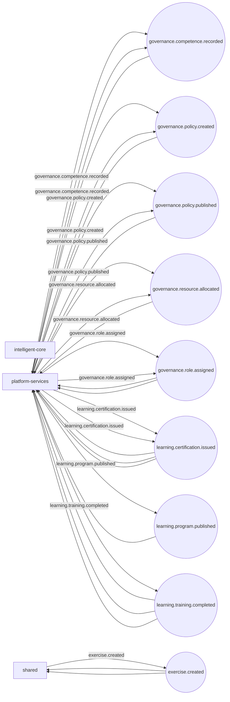

```mermaid
graph LR
    intelligent_core[intelligent-core]
    platform_services[platform-services]
    shared[shared]

    shared -->|exercise.created| exercise_created((exercise.created))
    exercise_created --> shared
    exercise_created --> shared

    platform_services -->|governance.competence.recorded| governance_competence_recorded((governance.competence.recorded))
    platform_services -->|governance.competence.recorded| governance_competence_recorded((governance.competence.recorded))
    governance_competence_recorded --> platform_services

    platform_services -->|governance.policy.created| governance_policy_created((governance.policy.created))
    platform_services -->|governance.policy.created| governance_policy_created((governance.policy.created))
    governance_policy_created --> platform_services

    platform_services -->|governance.policy.published| governance_policy_published((governance.policy.published))
    platform_services -->|governance.policy.published| governance_policy_published((governance.policy.published))
    governance_policy_published --> platform_services

    platform_services -->|governance.resource.allocated| governance_resource_allocated((governance.resource.allocated))
    platform_services -->|governance.resource.allocated| governance_resource_allocated((governance.resource.allocated))
    governance_resource_allocated --> platform_services

    platform_services -->|governance.role.assigned| governance_role_assigned((governance.role.assigned))
    platform_services -->|governance.role.assigned| governance_role_assigned((governance.role.assigned))
    governance_role_assigned --> platform_services
    governance_role_assigned --> platform_services

    platform_services -->|learning.certification.issued| learning_certification_issued((learning.certification.issued))
    platform_services -->|learning.certification.issued| learning_certification_issued((learning.certification.issued))
    learning_certification_issued --> platform_services
    learning_certification_issued --> platform_services
    learning_certification_issued --> platform_services

    platform_services -->|learning.program.published| learning_program_published((learning.program.published))
    learning_program_published --> platform_services

    platform_services -->|learning.training.completed| learning_training_completed((learning.training.completed))
    learning_training_completed --> platform_services
    learning_training_completed --> platform_services
    learning_training_completed --> platform_services

```
