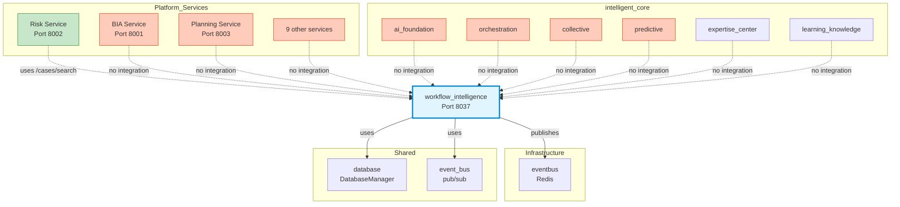

# workflow_intelligence: Current Dependency Map

**Date:** 2025-10-22
**Type:** As-Is Analysis (No Recommendations)
**Scope:** What exists RIGHT NOW

---

## 1. VISUAL DEPENDENCY GRAPH

```
                    AI-Platform-ISO
                          │
         ┌────────────────┼────────────────┐
         │                │                │
         ▼                ▼                ▼
   infrastructure/    shared/      intelligent_core/
    (Layer 1)       (Layer 2)        (Layer 3)
         │                │                │
         └────────────────┴────────────────┘
                          │
                          ▼
              ┌───────────────────────┐
              │ workflow_intelligence │
              │     (Port 8037)       │
              └───────────┬───────────┘
                          │
          ┌───────────────┼───────────────┐
          │               │               │
          ▼               ▼               ▼
    infrastructure/   shared/        (nothing else)
     eventbus/      database/
                    event_bus/
```

---

## 2. DEPENDENCY TABLE (Current State)

### 2.1 workflow_intelligence → Other Modules

| Target Module | Import Statement | File Location | Purpose |
|--------------|------------------|---------------|---------|
| **infrastructure.eventbus** | `from infrastructure.eventbus import Event, EventPriority, create_eventbus` | `integration/eventbus_publisher.py:25` | Publish workflow events to platform EventBus |
| **shared.database** | `from shared.database import DatabaseManager` | `storage/postgres_adapter.py:20` | PostgreSQL connection, RLS context |
| **shared.event_bus** | `from shared.event_bus import init_event_bus, get_event_bus, publish_event, subscribe_to` | `main.py:7` | FastAPI app event initialization |

**Total Dependencies: 3**

### 2.2 Other Modules → workflow_intelligence

| Source Module | Import Statement | File Location | Purpose |
|--------------|------------------|---------------|---------|
| **platform_services/bcm_domain/services/risk_service** | `from intelligent_core.workflow_intelligence import CaseQuery, TimeRange, WorkflowRecommendation` | `api/workflow_ai.py` | Get case-based recommendations for risk assessments |

**Total Dependents: 1**

---

## 3. DATA FLOW (As Implemented)

### Flow 1: Event Publishing

```
workflow_intelligence
    │
    ├─ integration/eventbus_publisher.py
    │       │
    │       └─ WorkflowEventPublisher
    │              │
    │              └─ publishes to infrastructure/eventbus
    │                      │
    │                      └─ Redis EventBus
    │                             │
    │                             └─ ❓ No known subscribers
```

**Events Published:**
- `workflow.state_changed`
- `workflow.action.{action_type}`
- `workflow.validation_failed`
- `workflow.milestone_reached`
- `workflow.checkpoint_validated`

**Known Subscribers:** None found in codebase

### Flow 2: Database Storage

```
workflow_intelligence
    │
    ├─ storage/postgres_adapter.py
    │       │
    │       └─ PostgresStorageAdapter
    │              │
    │              └─ uses shared/database/DatabaseManager
    │                      │
    │                      └─ PostgreSQL (bcm_platform DB)
    │                             │
    │                             └─ workflow_intelligence schema
    │                                    ├─ workflow_contexts
    │                                    ├─ workflow_cases
    │                                    ├─ benchmarks
    │                                    └─ ml_predictions
```

**RLS (Row Level Security):** Enabled, isolates by tenant_id

### Flow 3: API Request-Response

```
Risk Service (Port 8002)
    │
    └─ HTTP GET /api/v1/workflow-ai/recommendations
           │
           └─ workflow_intelligence (Port 8037)
                  │
                  └─ GET /cases/search
                         │
                         └─ Returns: Similar cases, benchmarks
```

**API Endpoints Used by External Services:**
- `/cases/search` - Search similar cases
- (No other endpoints used externally)

---

## 4. FILE-LEVEL DEPENDENCY MAP

### 4.1 Files WITH External Dependencies

| File | Imports | Purpose |
|------|---------|---------|
| `integration/eventbus_publisher.py` | `infrastructure.eventbus` | Bridges state machine events to platform EventBus |
| `storage/postgres_adapter.py` | `shared.database` | PostgreSQL storage using shared DatabaseManager |
| `storage/rls_context.py` | `shared.database` (in docstring) | RLS context management |
| `main.py` | `shared.event_bus` | FastAPI app with event bus integration |
| `__init__.py` | `shared.database` (in docstring) | Module initialization helper |

**Total: 5 files with external dependencies**

### 4.2 Files WITHOUT External Dependencies

All other 115 Python files in workflow_intelligence are self-contained or import only from within workflow_intelligence.

**Total: 115 files self-contained**

---

## 5. LAYER ARCHITECTURE (Current Reality)

```
┌─────────────────────────────────────────────────┐
│ Layer 4: platform_services/                    │
│                                                 │
│ ┌─────────────────────────────────────────┐   │
│ │ Risk Service (Port 8002)                │   │
│ │   ↓ uses (partial)                      │   │
│ │ workflow_intelligence                   │   │
│ └─────────────────────────────────────────┘   │
│                                                 │
│ BIA Service, Planning, Training, etc.          │
│ ↓ NO integration with workflow_intelligence    │
└─────────────────────────────────────────────────┘
                         │
                         ▼
┌─────────────────────────────────────────────────┐
│ Layer 3: intelligent_core/                      │
│                                                 │
│ ┌─────────────────────────────────────────┐   │
│ │ workflow_intelligence (Port 8037)       │   │
│ │   ↓ uses                                │   │
│ │   - infrastructure.eventbus             │   │
│ │   - shared.database                     │   │
│ │   - shared.event_bus                    │   │
│ │                                         │   │
│ │   ↓ does NOT use                        │   │
│ │   - ai_foundation                       │   │
│ │   - orchestration                       │   │
│ │   - collective                          │   │
│ │   - predictive                          │   │
│ │   - expertise_center                    │   │
│ │   - learning_knowledge                  │   │
│ │   - (any other intelligent_core module) │   │
│ └─────────────────────────────────────────┘   │
│                                                 │
│ Other modules:                                  │
│ - ai_foundation: NOT connected to wf_intel     │
│ - orchestration: NOT connected to wf_intel     │
│ - collective: Duplicate case library! ⚠️       │
│ - predictive: NOT connected to wf_intel        │
└─────────────────────────────────────────────────┘
                         │
                         ▼
┌─────────────────────────────────────────────────┐
│ Layer 2: shared/                                │
│                                                 │
│ ✓ database/ - Used by workflow_intelligence    │
│ ✓ event_bus/ - Used by workflow_intelligence   │
│                                                 │
│ NOT used by workflow_intelligence:              │
│ - auth/, audit/, cache/, middleware/,          │
│   monitoring/, models/, validators/, utils/    │
└─────────────────────────────────────────────────┘
                         │
                         ▼
┌─────────────────────────────────────────────────┐
│ Layer 1: infrastructure/                        │
│                                                 │
│ ✓ eventbus/ - Used by workflow_intelligence    │
│                                                 │
│ NOT used by workflow_intelligence:              │
│ - database/, observability/, security/,        │
│   gateway/, kubernetes/, deployment/,          │
│   terraform/, policy_engine/, etc.             │
└─────────────────────────────────────────────────┘
```

---

## 6. INTEGRATION COVERAGE MATRIX

### 6.1 intelligent_core Module Integration

| Module | workflow_intelligence uses it? | It uses workflow_intelligence? |
|--------|-------------------------------|-------------------------------|
| **ai_foundation/** | ❌ No | ❌ No |
| **orchestration/** | ❌ No | ❌ No |
| **expertise_center/** | ❌ No | ❌ No |
| **predictive/** | ❌ No | ❌ No |
| **collective/** | ❌ No | ❌ No |
| **learning_knowledge/** | ❌ No | ❌ No |
| **event_intelligence/** | ❌ No | ❌ No |
| **community_intelligence/** | ❌ No | ❌ No |
| **scenario_intelligence/** | ❌ No | ❌ No |
| **ai_workflow_optimizer/** | ❌ No | ❌ No |
| **workflow_engine/** | ❌ No | ❌ No |
| **system_bcm_service/** | ❌ No | ❌ No |

**Integration Score: 0/12 = 0%**

### 6.2 platform_services Integration

| Service | Port | Uses workflow_intelligence? | Integration Level |
|---------|------|----------------------------|-------------------|
| **Risk Service** | 8002 | ✅ Yes | Partial (1 endpoint) |
| **BIA Service** | 8001 | ❌ No | None |
| **Planning Service** | 8003 | ❌ No | None |
| **Plans Service** | 8004 | ❌ No | None |
| **Governance Service** | 8005 | ❌ No | None |
| **Compliance Service** | 8010 | ❌ No | None |
| **Training Service** | 8007 | ❌ No | None |
| **Exercise Service** | 8008 | ❌ No | None |
| **Audit Service** | 8011 | ❌ No | None |
| **Resource Service** | 8012 | ❌ No | None |
| **Communication Service** | 8013 | ❌ No | None |
| **Vendor Service** | 8014 | ❌ No | None |

**Integration Score: 1/12 = 8.3%**

### 6.3 shared/ Module Usage

| Module | Used by workflow_intelligence? | How? |
|--------|-------------------------------|------|
| **database/** | ✅ Yes | DatabaseManager in storage/postgres_adapter.py |
| **event_bus/** | ✅ Yes | Event pub/sub in main.py |
| **auth/** | ❌ No | - |
| **audit/** | ❌ No | - |
| **cache/** | ❌ No | - |
| **monitoring/** | ❌ No | - |
| **middleware/** | ❌ No | - |
| **exceptions/** | ❌ No | - |
| **models/** | ❌ No | - |
| **validators/** | ❌ No | - |
| **utils/** | ❌ No | - |
| **history/** | ❌ No | - |
| **integrations/** | ❌ No | - |
| **service_client/** | ❌ No | - |
| **orchestration-patterns/** | ❌ No | - |

**Integration Score: 2/16 = 12.5%**

### 6.4 infrastructure/ Module Usage

| Module | Used by workflow_intelligence? | How? |
|--------|-------------------------------|------|
| **eventbus/** | ✅ Yes | Event publishing via integration/eventbus_publisher.py |
| **database/** | ❌ No | Uses shared/database instead |
| **observability/** | ❌ No | - |
| **security/** | ❌ No | - |
| **gateway/** | ❌ No | - |
| **kubernetes/** | ❌ No | - |
| **deployment/** | ❌ No | - |
| **terraform/** | ❌ No | - |
| **policy_engine/** | ❌ No | - |
| **decision_center/** | ❌ No | - |

**Integration Score: 1/10 = 10%**

---

## 7. API SURFACE

### 7.1 Exposed Endpoints (Port 8037)

```python
# From main.py analysis:

# Health & Info
GET  /health              # Health check
GET  /metrics             # Prometheus metrics
GET  /info                # Service info

# Case Library
POST /cases/add           # Add case
GET  /cases/{case_id}     # Get case
POST /cases/search        # Search cases (USED by Risk Service)
POST /cases/bulk          # Bulk operations

# Workflow Analysis
POST /analyze             # Analyze workflow
POST /recommend           # Get recommendations

# Governance
POST /governance/validate              # Validate workflow
GET  /governance/summary               # Governance health
GET  /governance/goals                 # Goals status
GET  /governance/rules                 # Rules catalog
GET  /governance/optimization-suggestions  # Optimization tips

# PDCA
GET /pdca/status                      # PDCA status
GET /pdca/cycles                      # List cycles
GET /pdca/cycles/{workflow_id}        # Get cycle
GET /pdca/benchmarks/{module}         # Get benchmarks
GET /pdca/patterns                    # Patterns
GET /pdca/lessons                     # Lessons learned
GET /pdca/statistics                  # Statistics
```

**Total Endpoints: ~28**

**External Usage: 1 endpoint by 1 service**

### 7.2 Consumed Endpoints

workflow_intelligence does NOT call other services' APIs.

**Consumed Endpoints: 0**

---

## 8. DATABASE SCHEMA

### 8.1 Tables Created

```sql
-- Schema: workflow_intelligence

1. workflow_contexts
   - id, workflow_id, module, tenant_id, context (JSONB)
   - RLS enabled
   - Stores current workflow state

2. workflow_cases
   - id, case_id, module, tenant_id
   - org_industry, org_size, org_maturity
   - journey (JSONB), metrics, patterns
   - embedding (vector[1536])
   - RLS enabled
   - Stores completed workflows for learning

3. benchmarks
   - id, module, industry, org_size
   - avg_duration_days, success_rate
   - common_challenges (JSONB), best_practices (JSONB)
   - Aggregated statistics

4. ml_predictions
   - id, workflow_id, tenant_id
   - success_probability, estimated_duration_days
   - risk_level, risk_factors (JSONB)
   - RLS enabled
   - ML predictions storage
```

**Isolation:** All tables use RLS (Row Level Security) by tenant_id

### 8.2 Database Usage by Other Modules

**Other modules accessing workflow_intelligence schema:** None found

---

## 9. EVENT CATALOG

### 9.1 Events Published

| Event Type | Source | Data | Priority |
|-----------|--------|------|----------|
| `workflow.state_changed` | workflow-engine | workflow_id, from_state, to_state, context | NORMAL |
| `workflow.action.{action_type}` | workflow-engine | workflow_id, action | NORMAL |
| `workflow.validation_failed` | workflow-engine | workflow_id, errors | HIGH |
| `workflow.milestone_reached` | workflow-engine | workflow_id, milestone | HIGH |
| `workflow.checkpoint_validated` | workflow-engine | workflow_id, checkpoint, passed, violations | HIGH/NORMAL |

**Total Event Types: 5 families**

### 9.2 Events Subscribed

**None found in codebase**

### 9.3 Event Flow Status

```
workflow_intelligence → publishes events
    ↓
infrastructure/eventbus (Redis)
    ↓
❓ Subscribers: UNKNOWN (none found in code analysis)
```

**Status: One-way event publishing, no consumers detected**

---

## 10. CODE STATISTICS

### 10.1 Module Size

```
Total Files: 120 Python files
Total Lines: 34,546 LOC
Total Components: 22

Breakdown by component:
├── core/                 ~3,500 LOC
├── governance/           ~4,200 LOC
├── case_library/         ~2,800 LOC
├── ai/                   ~1,200 LOC
├── ml/                   ~800 LOC
├── storage/              ~1,500 LOC
├── temporal_workflows/   ~5,600 LOC
├── integration/          ~600 LOC
├── monitoring/           ~400 LOC
├── infrastructure/       ~3,800 LOC
├── api/                  ~50 LOC (mostly empty)
├── audit/                ~800 LOC
├── auth/                 ~500 LOC
├── compliance/           ~300 LOC
├── schemas/              ~200 LOC
├── workflows/            ~1,200 LOC
├── test_processes/       ~1,500 LOC
├── production_modules/   ~2,400 LOC
├── examples/             ~800 LOC
├── metrics/              ~600 LOC
├── main.py               ~1,048 LOC
└── other                 ~1,668 LOC
```

### 10.2 Import Analysis

**External imports found:**
- `infrastructure.eventbus`: 1 file
- `shared.database`: 3 files
- `shared.event_bus`: 1 file

**Self-contained imports:** 115 files

**Ratio: 95.8% self-contained, 4.2% external dependencies**

---

## 11. SUMMARY FACTS

### What workflow_intelligence IS:

✅ **Port:** 8037
✅ **Size:** 34,546 LOC, 120 files, 22 components
✅ **Database:** workflow_intelligence schema (4 tables, RLS enabled)
✅ **API:** 28 endpoints exposed
✅ **Events:** Publishes 5 event types to infrastructure/eventbus
✅ **Dependencies:** 3 external (infrastructure.eventbus, shared.database, shared.event_bus)
✅ **External Users:** 1 service (Risk Service, partial)

### What workflow_intelligence IS NOT:

❌ **NOT integrated** with other intelligent_core modules (0/12)
❌ **NOT used** by most platform services (1/12 = 8%)
❌ **NOT using** ai_foundation (no LLM integration)
❌ **NOT using** orchestration (no saga coordination)
❌ **NOT using** collective (duplicate case library exists)
❌ **NOT using** predictive (ML models are stubs)
❌ **NOT consuming** events (only publishing)
❌ **NOT calling** other service APIs

### Integration Status:

| Category | Score | Status |
|----------|-------|--------|
| **Infrastructure Integration** | 10% | ⚠️ Minimal (only eventbus) |
| **Shared Libraries Integration** | 12.5% | ⚠️ Minimal (only database, event_bus) |
| **intelligent_core Integration** | 0% | ❌ None |
| **Platform Services Integration** | 8% | ❌ Critical (1/12) |
| **Overall Integration Health** | 7.6% | 🔴 ISOLATED |

---

## 12. DEPENDENCY GRAPH (Mermaid)



Legend:
- 🟦 Blue: workflow_intelligence (target of analysis)
- 🟩 Green: Integrated (solid line)
- 🟧 Orange: Not integrated (dashed line)

---

**This is the current state. Nothing more, nothing less.**

**Created by: MD + Claude** 🤝
