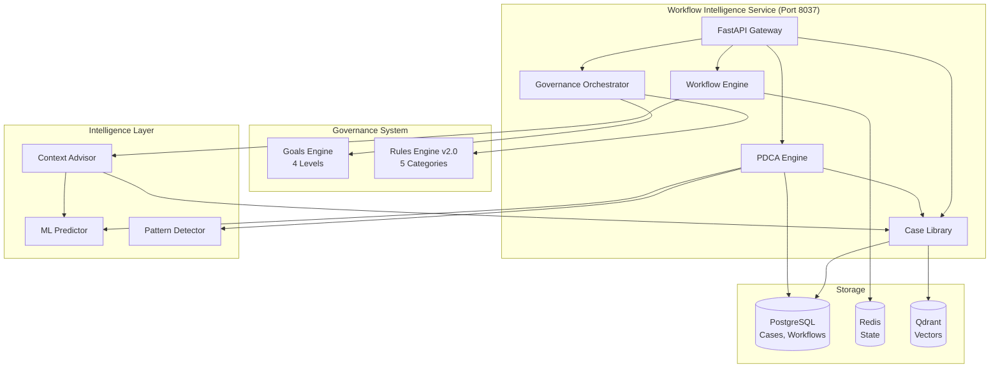

# Workflow Intelligence Engine

**Version**: 1.0.0
**Port**: 8037
**Status**: ✅ Production Ready
**Type**: Self-Learning Workflow Engine with Managed Autonomy

---

## 📋 Table of Contents

- [Overview](#overview)
- [Key Features](#key-features)
- [Architecture](#architecture)
- [Installation](#installation)
- [Quick Start](#quick-start)
- [API Reference](#api-reference)
- [Integration Guide](#integration-guide)
- [Governance System](#governance-system)
- [PDCA Integration](#pdca-integration)
- [Performance Metrics](#performance-metrics)
- [Development](#development)
- [Related Documentation](#related-documentation)

---

## 🎯 Overview

**Workflow Intelligence** is a self-learning workflow orchestration engine that combines:
- **Goals Engine**: Positive optimization targets (User, System, Component, Platform levels)
- **Rules Engine v2.0**: Multi-level governance (Constitution, Compliance, Organization, Best Practice, ML)
- **PDCA Integration**: Continuous improvement cycles (Plan-Do-Check-Act)
- **Case Library**: Learning from successful workflow executions
- **AI-Powered Analysis**: ML recommendations and predictions
- **Temporal Workflows**: Durable workflow execution

### What Makes It Intelligent?

1. **Self-Learning**: Learns from every workflow execution via Case Library
2. **Context-Aware**: AI Advisor understands organizational context
3. **Proactive**: Predicts risks and suggests optimizations before problems occur
4. **Governed**: Rules Engine ensures compliance and best practices
5. **Self-Monitoring**: "Eats its own dog food" - validates itself every 60 seconds

---

## ✨ Key Features

### 🎯 Governance System v2.0

**Goals Engine** - Positive optimization targets:
- User-level: BIA completion time, quality scores
- System-level: Response time, ML accuracy
- Component-level: AI Foundation, Orchestration performance
- Platform-level: MTTR, user satisfaction

**Rules Engine v2.0** - Multi-category governance:
- **Constitution**: Unchangeable platform principles (cannot override)
- **Compliance**: ISO 22301, NIST standards (override with justification)
- **Organization**: Corporate policies (configurable)
- **Best Practice**: Learned from Case Library (suggestions)
- **ML-Driven**: Adaptive rules from ML analysis (dynamic)

### 🔄 PDCA Integration

Continuous improvement through Plan-Do-Check-Act cycles:
- **PLAN**: Get recommendations from Case Library + benchmarks
- **DO**: Execute workflow with instrumentation
- **CHECK**: Compare actual vs expected results, detect deviations
- **ACT**: Learn from execution, update Case Library, discover patterns

### 📚 Case Library

Learns from workflow executions:
- Stores successful workflow cases
- Provides similarity-based recommendations
- Calculates industry benchmarks
- Enables ML pattern detection

### 🤖 AI Components

- **Context Advisor**: Provides context-aware recommendations
- **ML Predictor**: Predicts workflow outcomes and risks
- **Pattern Detector**: Discovers patterns in workflow executions

### ⏱️ Temporal Workflows

Durable workflow execution for:
- BIA workflows
- Risk assessment workflows
- Compliance workflows
- Custom business processes

---

## 🏗️ Architecture



### Component Structure

```
workflow_intelligence/
├── core/                   # Workflow Engine, State Machine
├── governance/             # Goals + Rules Engines v2.0
├── case_library/           # Case management and learning
├── ai/                     # AI components (Context Advisor)
├── ml/                     # ML models and predictors
├── storage/                # Storage adapters (Postgres, Redis)
├── temporal_workflows/     # Temporal workflow definitions
├── api/                    # API routes
├── monitoring/             # Metrics and monitoring
└── main.py                 # FastAPI service (Port 8037)
```

---

## 📦 Installation

### Prerequisites

```bash
Python 3.11+
PostgreSQL 14+ (for case storage)
Redis 7+ (for state management)
Qdrant (optional, for semantic search)
Temporal Server (optional, for durable workflows)
```

### Install Module

```bash
cd /Users/MD/AI-Platform-ISO/intelligent_core/workflow_intelligence

# Install in development mode
pip install -e .

# Or install from requirements
pip install -r requirements.txt
```

### Dependencies

```
# Core
fastapi>=0.104.0
pydantic>=2.0.0
uvicorn

# Database
sqlalchemy>=2.0.0
asyncpg>=0.28.0
alembic>=1.12.0

# Testing
pytest>=7.4.0
pytest-asyncio>=0.21.0
```

---

## 🚀 Quick Start

### Standalone Service

```bash
# Start Workflow Intelligence service
cd /Users/MD/AI-Platform-ISO/intelligent_core/workflow_intelligence
python main.py

# Service starts on http://localhost:8037
# Swagger UI: http://localhost:8037/docs
```

### Integration with Your Module

```python
from workflow_intelligence import initialize
from shared.database import get_db_manager

# Initialize with your state machine
db_manager = get_db_manager()
workflow_engine, context_advisor = await initialize(
    module="bia",
    existing_state_machine=YourStateMachine,
    db_manager=db_manager,
    vector_db_client=qdrant_client  # optional
)

# Use in your workflow
async def execute_workflow(workflow_data):
    # Get AI recommendations
    recommendations = await context_advisor.get_recommendations(workflow_data)

    # Execute with governance validation
    decision = await workflow_engine.validate_governance(workflow_data)

    if decision.decision_type == "allow":
        result = await workflow_engine.execute(workflow_data)
        return result
    else:
        # Handle governance block/warning
        return {"error": decision.rationale}
```

---

## 📡 API Reference

### Health & Info

```bash
GET /health              # Health check
GET /metrics             # Prometheus metrics
GET /info                # Service information
```

### Case Library

```bash
POST /cases/add          # Add case to library
GET  /cases/{case_id}    # Get case by ID
POST /cases/search       # Search similar cases
POST /cases/bulk         # Bulk operations
```

**Example: Add Case**
```python
import httpx

async with httpx.AsyncClient() as client:
    response = await client.post(
        "http://localhost:8037/cases/add",
        json={
            "case_data": {
                "workflow_id": "bia_123",
                "duration_seconds": 180,
                "quality_score": 95.0,
                "success": True
            },
            "module": "bia",
            "source": "production",
            "metadata": {
                "industry": "finance",
                "organization_size": "medium"
            }
        }
    )
    print(response.json())
    # {"case_id": "uuid", "status": "success"}
```

### Workflow Analysis

```bash
POST /analyze            # Analyze workflow with ML
POST /recommend          # Get ML recommendations
```

**Example: Analyze Workflow**
```python
response = await client.post(
    "http://localhost:8037/analyze",
    json={
        "workflow_id": "bia_456",
        "workflow_data": {
            "processes": 12,
            "rto_hours": 4,
            "complexity": "medium"
        },
        "context": {
            "industry": "healthcare",
            "urgency": "high"
        }
    }
)
# Returns: analysis, recommendations, confidence score
```

### Governance Endpoints

```bash
POST /governance/validate                  # Validate workflow
GET  /governance/summary                   # Governance health
GET  /governance/goals                     # Goals status
GET  /governance/rules                     # Rules catalog
GET  /governance/optimization-suggestions  # Optimization tips
```

**Example: Validate Workflow**
```python
response = await client.post(
    "http://localhost:8037/governance/validate",
    json={
        "workflow_id": "bia_789",
        "workflow_data": {
            "processes": ["sales", "hr"],
            "rto_hours": 4,
            "financial_impact": 50000
        },
        "current_stage": "assess_impact",
        "start_time": "2025-10-21T10:00:00Z"
    }
)

decision = response.json()
# {
#   "decision_type": "allow" | "block" | "warn" | "suggest_optimization",
#   "rationale": "Explanation...",
#   "actions_to_take": [...],
#   "rule_violations": [...],
#   "optimization_suggestions": [...]
# }
```

### PDCA Endpoints

```bash
GET /pdca/status                     # PDCA system status
GET /pdca/cycles?module=bia          # List PDCA cycles
GET /pdca/cycles/{workflow_id}       # Get cycle details
GET /pdca/benchmarks/{module}        # Get benchmarks
GET /pdca/patterns                   # Detected patterns
GET /pdca/lessons                    # Lessons learned
GET /pdca/statistics                 # PDCA statistics
```

**Example: Get PDCA Cycle**
```python
response = await client.get(
    "http://localhost:8037/pdca/cycles/bia_123"
)

cycle = response.json()
# {
#   "plan": {
#     "recommendations": [...],
#     "expected_duration": 180,
#     "benchmarks": {...}
#   },
#   "do": {
#     "actual_duration": 175,
#     "execution_data": {...}
#   },
#   "check": {
#     "quality_score": 92.5,
#     "deviations": [...]
#   },
#   "act": {
#     "lessons_learned": [...],
#     "patterns_discovered": [...],
#     "improvements": [...]
#   }
# }
```

---

## 🔧 Integration Guide

### Integration Pattern 1: Event-Driven

```python
from shared.event_bus import get_event_bus, subscribe_to

@subscribe_to("workflow.*.completed")
async def handle_workflow_completion(event):
    """Automatically learn from completed workflows"""
    workflow_data = event.data

    # Add to case library
    await client.post(
        "http://localhost:8037/cases/add",
        json={
            "case_data": workflow_data,
            "module": event.data.get("module"),
            "source": "auto"
        }
    )
```

### Integration Pattern 2: Direct Integration

```python
from workflow_intelligence import WorkflowEngine, ContextAdvisor
from workflow_intelligence.governance import GovernanceOrchestrator

# Initialize
workflow_engine = WorkflowEngine(
    module="bia",
    state_machine=BIAStateMachine,
    storage_adapter=postgres_adapter
)

context_advisor = ContextAdvisor(
    workflow_engine=workflow_engine,
    case_library=case_repository
)

# Use in your service
async def execute_bia(bia_data):
    # 1. Get recommendations
    recommendations = await context_advisor.get_recommendations(
        query={
            "module": "bia",
            "industry": bia_data.industry,
            "organization_size": bia_data.org_size
        }
    )

    # 2. Execute workflow with recommendations
    result = await workflow_engine.execute(
        workflow_data=bia_data,
        recommendations=recommendations
    )

    # 3. PDCA cycle automatically runs in background

    return result
```

### Integration Pattern 3: Governance Gateway

```python
from fastapi import FastAPI, HTTPException

app = FastAPI()

@app.post("/bia/execute")
async def execute_bia_with_governance(bia_request):
    # Validate with governance first
    governance_response = await client.post(
        "http://localhost:8037/governance/validate",
        json={
            "workflow_id": bia_request.id,
            "workflow_data": bia_request.dict(),
            "current_stage": "start"
        }
    )

    decision = governance_response.json()

    if decision["decision_type"] == "block":
        raise HTTPException(
            status_code=403,
            detail=f"Governance blocked: {decision['rationale']}"
        )

    if decision["decision_type"] == "warn":
        # Log warning but proceed
        logger.warning(f"Governance warning: {decision['rationale']}")

    # Execute workflow
    result = await execute_bia_workflow(bia_request)

    return result
```

---

## 🎯 Governance System

### Goals Engine (4 Levels)

**User Goals:**
```yaml
- BIA completion time < 15 minutes
- Quality score > 85%
- User satisfaction > 90%
```

**System Goals:**
```yaml
- Response time < 200ms
- ML accuracy > 85%
- Workflow success rate > 95%
```

**Component Goals:**
```yaml
- AI Foundation availability > 99.5%
- Orchestration throughput > 100 req/min
```

**Platform Goals:**
```yaml
- MTTR < 30 minutes
- Overall platform health > 95%
```

### Rules Engine v2.0 (5 Categories)

**1. Constitution Rules** (Cannot Override)
```python
- Data privacy must be preserved
- Audit trails required for all workflows
- No data deletion without retention policy
```

**2. Compliance Rules** (Override with Justification)
```python
- RTO must be documented (ISO 22301)
- Risk assessments required (NIST)
- BCM Plan review every 6 months (ISO 22301)
```

**3. Organization Rules** (Configurable)
```python
- Approval required for critical processes
- Maximum workflow duration: 30 minutes
- Quality score threshold: 70%
```

**4. Best Practice Rules** (Suggestions from Case Library)
```python
- Financial sector: RTO < 4 hours (based on 150 cases)
- Healthcare: 24/7 availability required (based on 89 cases)
```

**5. ML-Driven Rules** (Adaptive)
```python
- Workflows with >10 processes take 15% longer (ML model, 92% accuracy)
- Morning executions 20% faster (pattern detected)
```

### Using Governance in Code

```python
# Get governance summary
response = await client.get("http://localhost:8037/governance/summary")
summary = response.json()
# {
#   "goals_status": {
#     "achieved": 12,
#     "on_track": 5,
#     "at_risk": 2,
#     "behind": 1
#   },
#   "rules_compliance": {
#     "violations": 3,
#     "warnings": 7
#   },
#   "governance_maturity_score": 87.5
# }

# Get optimization suggestions
response = await client.get("http://localhost:8037/governance/optimization-suggestions")
suggestions = response.json()
# Returns suggestions for goals at risk
```

---

## 🔄 PDCA Integration

### PDCA Cycle Flow

```
┌─────────────────────────────────────────────────────┐
│                    PLAN PHASE                        │
│  - Get recommendations from Case Library             │
│  - Calculate benchmarks (avg, median, p95)           │
│  - Set expected outcomes                             │
└────────────────────┬────────────────────────────────┘
                     │
                     ▼
┌─────────────────────────────────────────────────────┐
│                     DO PHASE                         │
│  - Execute workflow with instrumentation             │
│  - Collect execution metrics                         │
│  - Track actual vs expected                          │
└────────────────────┬────────────────────────────────┘
                     │
                     ▼
┌─────────────────────────────────────────────────────┐
│                   CHECK PHASE                        │
│  - Compare actual vs expected results                │
│  - Calculate quality score                           │
│  - Detect deviations and anomalies                   │
└────────────────────┬────────────────────────────────┘
                     │
                     ▼
┌─────────────────────────────────────────────────────┐
│                    ACT PHASE                         │
│  - Extract lessons learned                           │
│  - Update Case Library                               │
│  - Discover patterns with ML                         │
│  - Generate improvement recommendations              │
└─────────────────────────────────────────────────────┘
```

### Example: PDCA Cycle

```python
# Workflow completes → PDCA cycle triggered automatically

# Later, retrieve PDCA data
cycle = await client.get(f"/pdca/cycles/{workflow_id}")

# Use lessons for next workflow
lessons = await client.get("/pdca/lessons?module=bia&min_quality=80")

# Apply lessons to new workflow
new_workflow_data = apply_lessons(workflow_data, lessons)
```

---

## 📊 Performance Metrics

### KPIs (from KPI.yaml)

| Metric | Target | Prometheus Metric |
|--------|--------|-------------------|
| **Predictions Made** | >100/day | `workflow_intelligence_predictions_total` |
| **Prediction Accuracy** | >85% | `workflow_intelligence_accuracy` |
| **Processing Time** | <2s | `workflow_intelligence_processing_time_seconds` |
| **Model Confidence** | >0.8 | `workflow_intelligence_confidence` |
| **Workflows Completed** | >1000/month | `workflows_completed_total` |
| **Success Rate** | >95% | `workflow_success_rate` |

### Monitoring

```bash
# Prometheus metrics endpoint
curl http://localhost:8037/metrics

# Grafana Dashboard
# Location: dashboards/workflow_intelligence.json

# Alert Rules
# Location: alerts/workflow_intelligence.yaml
```

---

## 👨‍💻 Development

### Project Structure

```
workflow_intelligence/
├── ai/                    # AI components
│   └── context_advisor.py
├── api/                   # API routes
├── audit/                 # Audit logging
├── auth/                  # Authentication
├── case_library/          # Case management
│   ├── models.py
│   ├── repository.py
│   └── collector.py
├── compliance/            # Compliance checks
├── core/                  # Core engine
│   ├── workflow_engine.py
│   ├── state_machine.py
│   └── pdca_rules.py
├── docs/                  # Documentation (20+ files)
├── examples/              # Example code
├── governance/            # Governance v2.0
│   ├── goals_engine.py
│   ├── rules_engine_v2.py
│   └── governance_orchestrator.py
├── integration/           # External integrations
├── metrics/               # Metrics collection
│   ├── pdca_metrics.py
│   └── process_metrics.py
├── ml/                    # ML models
├── monitoring/            # Monitoring tools
├── production_modules/    # Production modules
├── schemas/               # Data schemas
├── storage/               # Storage adapters
│   ├── postgres_adapter.py
│   └── __init__.py
├── temporal_sample/       # Temporal samples
├── temporal_workflows/    # Temporal workflows
│   ├── bia_workflow.py
│   ├── risk_workflow.py
│   └── coordination_workflow.py
├── test_processes/        # Test processes
├── workflows/             # Workflow definitions
├── main.py               # FastAPI service
├── __init__.py           # Module exports
├── requirements.txt      # Dependencies
├── setup.py              # Package setup
├── KPI.yaml              # KPI definitions
└── README.md             # This file
```

### Running Tests

```bash
# Run all tests
pytest

# Run with coverage
pytest --cov=. --cov-report=html

# Run specific test
pytest tests/test_governance.py -v

# Run async tests
pytest -v --asyncio-mode=auto
```

### Code Quality

```bash
# Format code
black .

# Lint
flake8 .

# Type checking
mypy .
```

---

## 📚 Related Documentation

### Internal Documentation (docs/)

- `API.md` - API specification
- `ARCHITECTURE_COMPLIANCE_CHECK.md` - Architecture validation
- `GOALS_AND_RULES_IMPLEMENTATION.md` - Governance implementation
- `PDCA_IMPLEMENTATION.md` - PDCA system details
- `TEMPORAL_CLOUD_INTEGRATION.md` - Temporal integration guide
- `INSTRUMENTATION_COMPLETE_GUIDE.md` - Instrumentation guide

### External References

- [ISO 22301:2019](https://www.iso.org/standard/75106.html) - Business Continuity Management
- [Temporal.io Documentation](https://docs.temporal.io/) - Workflow orchestration
- [FastAPI Documentation](https://fastapi.tiangolo.com/) - API framework

---

## 🔍 Troubleshooting

### Service Won't Start

```bash
# Check port availability
lsof -i :8037

# Check dependencies
pip install -r requirements.txt

# Check environment variables
echo $DATABASE_URL
echo $REDIS_URL
```

### Governance Not Initialized

```bash
# Check goals.yaml exists
ls governance/goals.yaml

# Check logs
tail -f logs/workflow_intelligence.log
```

### PDCA Not Working

```bash
# Check PDCA status
curl http://localhost:8037/pdca/status

# Verify EventBus connection
# PDCA requires Redis for EventBus
```

---

## 🤝 Contributing

See main [CONTRIBUTING.md](../../CONTRIBUTING.md) for guidelines.

---

## 📄 License

**Proprietary** - AI-Platform-ISO
© 2025 Company Name. All rights reserved.

---

## 📞 Support

- **Documentation**: `/docs/` directory
- **Issues**: Internal GitLab
- **Slack**: #workflow-intelligence channel
- **Email**: workflow-team@company.com

---

**Last Updated**: 2025-10-21
**Maintainer**: Workflow Intelligence Team
**Version**: 1.0.0
**Status**: ✅ Production Ready

**Documentation Compliance**: ISO/IEC/IEEE 26514:2022 ✓
