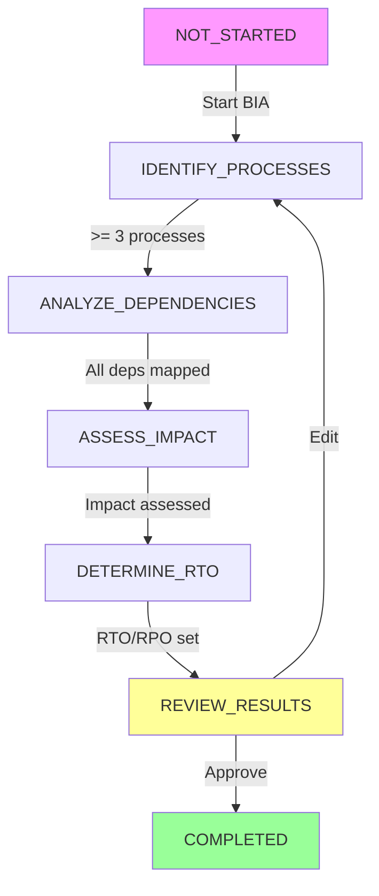

# BIA Module - Complete Implementation Roadmap

**Проект:** AI-Platform-ISO - Unified Frontend
**Модуль:** Business Impact Analysis (BIA)
**Дата:** 2025-10-18
**Статус:** Architecture Phase

---

## 📖 СОДЕРЖАНИЕ

1. [Введение](#введение)
2. [Архитектура Backend](#архитектура-backend)
3. [Архитектура Frontend](#архитектура-frontend)
4. [Компонентная Структура](#компонентная-структура)
5. [API Integration Layer](#api-integration-layer)
6. [State Management](#state-management)
7. [BIA Wizard Flow](#bia-wizard-flow)
8. [AI Integration](#ai-integration)
9. [План Реализации](#план-реализации)
10. [Testing Strategy](#testing-strategy)

---

## ВВЕДЕНИЕ

### Цель
Создать полнофункциональный веб-интерфейс для модуля Business Impact Analysis с полной интеграцией:
- ✅ BIA Service (port 8012) - CRUD операции
- ✅ BIA Specialist AI - RAG-powered эксперт
- ✅ Workflow Intelligence - Stage-based валидация
- ✅ System BCM Service - Platform monitoring
- ✅ Scenario Intelligence - AI-Assisted workflows

### Принципы
1. **NO MOCKS** - только реальные данные из API
2. **Workflow-driven** - следуем BIA Workflow Engine stages
3. **AI-powered** - интеграция с BIA Specialist AI
4. **Component-based** - модульная архитектура
5. **Type-safe** - полная типизация TypeScript

---

## АРХИТЕКТУРА BACKEND

### 1. BIA Service (port 8012)

**Технологии:** FastAPI, PostgreSQL, Redis, Pydantic

**Основные возможности:**
- CRUD для BIA процессов
- Bulk операции (create/update/delete/validate)
- AI-powered RTO suggestions
- ISO 22301 compliance validation
- Event publishing (EventBus)
- Multi-tenancy с RLS
- Audit logging

**Data Models:**

```python
class BIAProcess:
    id: int
    tenant_id: str
    name: str
    description: str
    department: str
    process_owner: str

    # Criticality
    criticality: CriticalityLevel  # low, minor, moderate, high, critical
    criticality_score: int  # 1-5
    who_tier: WHOTier  # tier_1, tier_2, tier_3, tier_4 (healthcare)

    # Time Objectives
    rto_hours: int  # Recovery Time Objective
    rpo_hours: int  # Recovery Point Objective
    mtpd_hours: int  # Maximum Tolerable Period of Disruption

    # Impact Assessment
    financial_impact: Dict[str, float]  # {1_hour: 5000, 4_hours: 20000, ...}
    operational_impact: Dict[str, str]
    reputational_impact: ReputationalImpact
    regulatory_impact: RegulatoryImpact
    patient_safety_impact: PatientSafetyImpact

    # Dependencies
    dependencies: List[Dependency]
    upstream_processes: List[str]
    downstream_processes: List[str]
    critical_suppliers: List[Dict]

    # Resources
    personnel_requirements: Dict
    facility_requirements: Dict
    technology_requirements: Dict

    # Recovery
    recovery_strategies: List[Dict]
    alternative_procedures: List[str]
    workaround_capacity: float  # 0-100%

    # AI Analysis
    ai_suggested_rto: float
    ai_confidence: float
    ai_recommendations: str

    # Status
    status: ProcessStatus  # draft, in_progress, completed
    created_at: datetime
    updated_at: datetime
```

**Ключевые Endpoints:**

```typescript
// CRUD
GET    /api/bia/processes?tenant_id={}&criticality={}&status={}
GET    /api/bia/processes/{id}?tenant_id={}
POST   /api/bia/processes
PUT    /api/bia/processes/{id}?tenant_id={}
DELETE /api/bia/processes/{id}?tenant_id={}

// Actions
POST   /api/bia/processes/{id}/complete?tenant_id={}

// AI Features
POST   /api/bia/ai/suggest-rto

// Reporting
GET    /api/bia/reports/summary?tenant_id={}

// Bulk Operations
POST   /api/bia/processes/bulk
PUT    /api/bia/processes/bulk/update?tenant_id={}
DELETE /api/bia/processes/bulk/delete?tenant_id={}
POST   /api/bia/processes/bulk/validate
```

**Business Rules (Validators):**
1. RTO >= RPO
2. MTPD >= RTO
3. Financial impact timeline must increase over time
4. No self-dependencies (circular)
5. Critical processes need recovery strategies
6. WHO tier consistency (healthcare)
7. Minimum staff requirements by criticality

### 2. BIA Specialist AI

**Локация:** `/intelligent_core/expertise_center/ai_office/ВСМ-colleagues/bia_specialist/`

**Возможности:**
- Process criticality analysis
- RTO/RPO determination with reasoning
- Impact calculation over time
- Dependency mapping
- Complete BIA report generation
- Industry benchmarking

**API Methods:**

```python
async def analyze_process_criticality(
    process_data: Dict[str, Any],
    tenant_id: str
) -> Dict[str, Any]:
    """
    Returns:
        - Criticality tier (1-4)
        - Recommended RTO/RPO
        - MTD/MTPD estimation
        - Impact analysis (1h, 4h, 24h, 7d)
        - Key dependencies
        - Resource requirements
    """

async def conduct_bia(
    organization_data: Dict[str, Any],
    tenant_id: str
) -> Dict[str, Any]:
    """
    Returns complete BIA report including:
        - Critical process identification
        - RTO/RPO matrix
        - Impact assessment summary
        - Dependency highlights
        - Resource requirements
        - Recovery sequence
    """

async def map_dependencies(
    process_data: Dict[str, Any]
) -> Dict[str, Any]:
    """
    Returns:
        - Upstream dependencies
        - Downstream dependencies
        - Internal dependencies
        - External dependencies
        - Single points of failure
        - Mitigation strategies
    """

async def calculate_impact_over_time(
    process_data: Dict[str, Any]
) -> Dict[str, Any]:
    """
    Returns impact curve:
        - 1 hour, 4 hours, 24 hours
        - 3 days, 1 week, 1 month
        - Financial, operational, reputational
        - Point of no return (MTD)
    """
```

### 3. Workflow Intelligence

**Локация:** `/intelligent_core/workflow_intelligence/workflows/bia_workflow.py`

**BIA Workflow Stages:**

```python
class BIAStage:
    NOT_STARTED = "not_started"
    IDENTIFY_PROCESSES = "identify_processes"
    ANALYZE_DEPENDENCIES = "analyze_dependencies"
    ASSESS_IMPACT = "assess_impact"
    DETERMINE_RTO = "determine_rto"
    REVIEW_RESULTS = "review_results"
    COMPLETED = "completed"
```

**Stage Validators:**
- **identify_processes**: min 3 processes, each with name/description/owner/tier
- **analyze_dependencies**: Tier 1 processes need >= 2 dependencies
- **assess_impact**: All impact types assessed (financial, operational, reputational, regulatory)
- **determine_rto**: RTO defined, tier-appropriate (Tier 1 < 4h, Tier 2 < 24h)
- **review_results**: All previous validators pass

**Transitions:**
```
NOT_STARTED → IDENTIFY_PROCESSES
IDENTIFY_PROCESSES → ANALYZE_DEPENDENCIES (when >= 3 processes)
ANALYZE_DEPENDENCIES → ASSESS_IMPACT
ASSESS_IMPACT → DETERMINE_RTO
DETERMINE_RTO → REVIEW_RESULTS
REVIEW_RESULTS → COMPLETED (or back to IDENTIFY_PROCESSES for corrections)
```

### 4. System BCM Service (port 8050)

**Возможности:**
- Platform health monitoring
- Auto-recovery procedures
- BCM cycle execution
- Pattern detection
- Learning from incidents

**Relevant для BIA:**
- Real-time platform health data
- Actual RTO/RPO from incidents
- Recovery procedure effectiveness
- Resource availability

---

## АРХИТЕКТУРА FRONTEND

### Technology Stack

**Core:**
- Next.js 14 (App Router)
- TypeScript (strict mode)
- React 18

**Styling:**
- Tailwind CSS
- shadcn/ui components
- Lucide React icons

**State Management:**
- React Query (TanStack Query) - server state
- Zustand - client state
- Context API - workflow state

**Forms:**
- React Hook Form
- Zod validation

**Visualization:**
- React Flow (dependency graphs)
- Recharts (impact charts)
- Mermaid (diagrams)

**Real-time:**
- WebSocket (EventBus integration)
- Server-Sent Events

### Directory Structure

```
frontend/src/
├── types/
│   ├── bia.ts ✅                    # BIA data types
│   └── workflow.ts                  # Workflow types
│
├── lib/
│   ├── api/
│   │   ├── bia-client.ts ✅         # BIA Service client
│   │   ├── ai-client.ts             # AI Specialist client
│   │   └── bcm-client.ts            # System BCM client
│   │
│   ├── validation/
│   │   ├── bia-schemas.ts           # Zod schemas
│   │   └── business-rules.ts        # Business validators
│   │
│   └── utils/
│       ├── format.ts                # Formatters
│       └── calculations.ts          # RTO/RPO helpers
│
├── hooks/
│   ├── bia/
│   │   ├── useBIAProcesses.ts       # List processes
│   │   ├── useBIAProcess.ts         # Single process CRUD
│   │   ├── useCreateBIAProcess.ts   # Create mutation
│   │   ├── useUpdateBIAProcess.ts   # Update mutation
│   │   ├── useDeleteBIAProcess.ts   # Delete mutation
│   │   ├── useAISuggestion.ts       # AI RTO suggestions
│   │   └── useBIASummary.ts         # Summary report
│   │
│   ├── workflow/
│   │   ├── useBIAWorkflow.ts        # Workflow state machine
│   │   └── useWorkflowValidation.ts # Stage validators
│   │
│   └── useWebSocket.ts              # EventBus connection
│
├── components/
│   ├── bia/
│   │   ├── BIAWizard/
│   │   │   ├── BIAWizard.tsx              # Main wizard component
│   │   │   ├── WizardStep.tsx             # Step wrapper
│   │   │   ├── StepIdentifyProcesses.tsx  # Stage 1
│   │   │   ├── StepAnalyzeDependencies.tsx # Stage 2
│   │   │   ├── StepAssessImpact.tsx       # Stage 3
│   │   │   ├── StepDetermineRTO.tsx       # Stage 4
│   │   │   └── StepReview.tsx             # Stage 5
│   │   │
│   │   ├── forms/
│   │   │   ├── ProcessForm.tsx            # Create/Edit process
│   │   │   ├── DependencyForm.tsx         # Add dependency
│   │   │   ├── ImpactForm.tsx             # Assess impact
│   │   │   └── RTOForm.tsx                # Set RTO/RPO/MTPD
│   │   │
│   │   ├── display/
│   │   │   ├── ProcessCard.tsx            # Process preview
│   │   │   ├── ProcessList.tsx            # List view
│   │   │   ├── ProcessTable.tsx           # Table view
│   │   │   └── ProcessDetails.tsx         # Full details
│   │   │
│   │   ├── analysis/
│   │   │   ├── AIAssistant.tsx            # Chat with BIA Specialist
│   │   │   ├── RTOCalculator.tsx          # RTO/RPO calculator
│   │   │   ├── ImpactChart.tsx            # Impact over time
│   │   │   ├── CriticalityMatrix.tsx      # Criticality grid
│   │   │   └── DependencyGraph.tsx        # React Flow graph
│   │   │
│   │   ├── compliance/
│   │   │   ├── ISO22301Checker.tsx        # Compliance status
│   │   │   ├── ValidationStatus.tsx       # Validator results
│   │   │   └── ComplianceReport.tsx       # Report generator
│   │   │
│   │   └── shared/
│   │       ├── CriticalityBadge.tsx       # Criticality display
│   │       ├── StatusBadge.tsx            # Process status
│   │       ├── WHOTierBadge.tsx           # WHO tier (healthcare)
│   │       └── ProgressIndicator.tsx      # Workflow progress
│   │
│   └── layout/
│       └── (existing components)
│
└── app/(platform)/bia/
    ├── page.tsx                      # Main BIA page
    ├── [processId]/
    │   └── page.tsx                  # Process details
    └── wizard/
        └── page.tsx                  # BIA Wizard
```

---

## КОМПОНЕНТНАЯ СТРУКТУРА

### 1. BIAWizard Component

**Purpose:** Step-by-step BIA creation following Workflow Intelligence stages

**Props:**
```typescript
interface BIAWizardProps {
  initialData?: Partial<BIAProcess>;
  onComplete: (process: BIAProcess) => void;
  onCancel: () => void;
}
```

**State:**
```typescript
interface WizardState {
  currentStage: BIAStage;
  processData: Partial<BIAProcess>;
  validationErrors: Record<string, string[]>;
  aiSuggestions: AIRTOSuggestion | null;
  isLoading: boolean;
}
```

**Stages:**

1. **IdentifyProcesses** (Stage 1):
   - Process name, description
   - Department, owner
   - Industry, geographical scope
   - Initial criticality estimate

2. **AnalyzeDependencies** (Stage 2):
   - Upstream dependencies
   - Downstream dependencies
   - Critical suppliers
   - Technology dependencies
   - Single points of failure

3. **AssessImpact** (Stage 3):
   - Financial impact curve (1h, 4h, 24h, 3d, 7d, 30d)
   - Operational impact
   - Reputational impact
   - Regulatory impact
   - Patient safety impact (healthcare)

4. **DetermineRTO** (Stage 4):
   - RTO (Recovery Time Objective)
   - RPO (Recovery Point Objective)
   - MTPD (Maximum Tolerable Period)
   - AI suggestions display
   - Rationale/justification
   - Recovery strategies
   - Alternative procedures

5. **Review** (Stage 5):
   - Complete process summary
   - Validation status
   - ISO 22301 compliance check
   - AI recommendations summary
   - Approve/Edit/Cancel

**Navigation:**
```typescript
const navigation = {
  canGoNext: () => validateCurrentStage(),
  canGoBack: () => currentStage !== BIAStage.IDENTIFY_PROCESSES,
  goNext: () => advanceStage(),
  goBack: () => previousStage(),
  goToStage: (stage: BIAStage) => jumpToStage(stage),
};
```

### 2. ProcessForm Component

**Purpose:** Create/edit BIA process with full validation

**Features:**
- React Hook Form integration
- Zod schema validation
- Real-time business rule checks
- AI suggestion integration
- Auto-save draft
- Multi-step form

**Validation:**
```typescript
const biaProcessSchema = z.object({
  name: z.string().min(3, "Name must be at least 3 characters"),
  description: z.string().min(20, "Description must be at least 20 characters"),
  criticality: z.enum(["low", "minor", "moderate", "high", "critical"]),
  rto_hours: z.number().min(0),
  rpo_hours: z.number().min(0),
  mtpd_hours: z.number().min(0),
}).refine(data => data.rto_hours >= data.rpo_hours, {
  message: "RTO must be >= RPO",
  path: ["rto_hours"]
}).refine(data => data.mtpd_hours >= data.rto_hours, {
  message: "MTPD must be >= RTO",
  path: ["mtpd_hours"]
});
```

### 3. AIAssistant Component

**Purpose:** Interactive chat with BIA Specialist AI

**Features:**
- Real-time AI suggestions
- Criticality analysis
- Impact calculation help
- Dependency recommendations
- RTO/RPO guidance
- Chat history

**Integration:**
```typescript
const AIAssistant = ({ processData }: { processData: Partial<BIAProcess> }) => {
  const [messages, setMessages] = useState<Message[]>([]);
  const { mutate: getAnalysis } = useAISuggestion();

  const askAI = async (question: string) => {
    // Call BIA Specialist AI via API
    const response = await getAnalysis({
      process_data: processData,
      question: question
    });

    setMessages([...messages, {
      role: 'assistant',
      content: response.analysis,
      suggestions: response.recommendations
    }]);
  };

  return <ChatInterface messages={messages} onSend={askAI} />;
};
```

### 4. DependencyGraph Component

**Purpose:** Visual dependency mapping using React Flow

**Features:**
- Interactive node graph
- Upstream/downstream visualization
- Criticality-based node styling
- Single point of failure highlighting
- Circular dependency detection
- Zoom/pan controls

**Node Types:**
```typescript
const nodeTypes = {
  process: ProcessNode,        // BIA process
  dependency: DependencyNode,  // External dependency
  supplier: SupplierNode,      // Critical supplier
  technology: TechnologyNode,  // Tech dependency
};
```

### 5. ImpactChart Component

**Purpose:** Time-based impact visualization

**Features:**
- Multi-line chart (financial, operational, reputational)
- Time periods: 1h, 4h, 24h, 3d, 7d, 30d
- MTD marker
- RTO threshold line
- Interactive tooltips
- Responsive design

**Data:**
```typescript
interface ImpactData {
  timepoint: string;
  financial: number;
  operational: number;
  reputational: number;
  regulatory: number;
}
```

---

## API INTEGRATION LAYER

### React Query Hooks

**1. useBIAProcesses**

```typescript
export function useBIAProcesses(params: {
  tenant_id: string;
  criticality?: CriticalityLevel;
  status?: ProcessStatus;
}) {
  return useQuery({
    queryKey: ['bia', 'processes', params],
    queryFn: () => biaAPI.listProcesses(params),
    staleTime: 5 * 60 * 1000, // 5 minutes
    gcTime: 10 * 60 * 1000,   // 10 minutes
  });
}
```

**2. useBIAProcess**

```typescript
export function useBIAProcess(id: number, tenant_id: string) {
  return useQuery({
    queryKey: ['bia', 'process', id, tenant_id],
    queryFn: () => biaAPI.getProcess(id, tenant_id),
    enabled: !!id,
  });
}
```

**3. useCreateBIAProcess**

```typescript
export function useCreateBIAProcess() {
  const queryClient = useQueryClient();

  return useMutation({
    mutationFn: (data: BIAProcessCreate) => biaAPI.createProcess(data),
    onSuccess: (newProcess) => {
      // Invalidate list
      queryClient.invalidateQueries({ queryKey: ['bia', 'processes'] });

      // Add to cache
      queryClient.setQueryData(
        ['bia', 'process', newProcess.id, newProcess.tenant_id],
        newProcess
      );
    },
  });
}
```

**4. useAISuggestion**

```typescript
export function useAISuggestion() {
  return useMutation({
    mutationFn: (params: {
      name: string;
      industry: string;
      criticality: CriticalityLevel;
      financial_impact: Record<string, number>;
      staff_count?: number;
    }) => biaAPI.getAISuggestion(params),
  });
}
```

---

## STATE MANAGEMENT

### 1. Zustand Store (Client State)

```typescript
interface BIAStore {
  // Wizard state
  wizardStage: BIAStage;
  wizardData: Partial<BIAProcess>;
  setWizardStage: (stage: BIAStage) => void;
  updateWizardData: (data: Partial<BIAProcess>) => void;
  resetWizard: () => void;

  // UI state
  selectedProcessId: number | null;
  viewMode: 'list' | 'grid' | 'table';
  filters: BIAFilters;
  setFilters: (filters: BIAFilters) => void;

  // AI state
  aiSuggestions: AIRTOSuggestion | null;
  setAISuggestions: (suggestions: AIRTOSuggestion) => void;
}

export const useBIAStore = create<BIAStore>((set) => ({
  wizardStage: BIAStage.NOT_STARTED,
  wizardData: {},
  setWizardStage: (stage) => set({ wizardStage: stage }),
  updateWizardData: (data) => set((state) => ({
    wizardData: { ...state.wizardData, ...data }
  })),
  resetWizard: () => set({
    wizardStage: BIAStage.NOT_STARTED,
    wizardData: {}
  }),

  selectedProcessId: null,
  viewMode: 'list',
  filters: {},
  setFilters: (filters) => set({ filters }),

  aiSuggestions: null,
  setAISuggestions: (suggestions) => set({ aiSuggestions: suggestions }),
}));
```

### 2. React Query (Server State)

- Automatic caching
- Background refetching
- Optimistic updates
- Error handling
- Loading states

### 3. Workflow Context

```typescript
interface WorkflowContextValue {
  currentStage: BIAStage;
  canAdvance: boolean;
  validationErrors: Record<string, string[]>;
  advanceStage: () => Promise<boolean>;
  goBack: () => void;
  jumpToStage: (stage: BIAStage) => Promise<boolean>;
}

const WorkflowContext = createContext<WorkflowContextValue | null>(null);

export const useWorkflow = () => {
  const context = useContext(WorkflowContext);
  if (!context) throw new Error('useWorkflow must be used within WorkflowProvider');
  return context;
};
```

---

## BIA WIZARD FLOW

### Stage Progression



### Validation Matrix

| Stage | Required Data | Validators | Can Advance? |
|-------|--------------|------------|--------------|
| NOT_STARTED | - | - | Always |
| IDENTIFY_PROCESSES | >= 3 processes with name/description/owner/tier | _validate_processes, _validate_process_quality | When all valid |
| ANALYZE_DEPENDENCIES | Tier 1 processes have >= 2 deps | _validate_dependencies | When all valid |
| ASSESS_IMPACT | All impact types assessed | _validate_impacts, _validate_impact_completeness | When complete |
| DETERMINE_RTO | RTO/RPO/MTPD set with rationale | _validate_rto, _validate_rto_rationale | When valid |
| REVIEW_RESULTS | All stages validated | _validate_complete_bia | When pass |
| COMPLETED | - | - | Final state |

### Auto-Save Strategy

```typescript
const AutoSaveWizard = ({ processId }: { processId?: number }) => {
  const wizardData = useBIAStore(state => state.wizardData);
  const { mutate: updateProcess } = useUpdateBIAProcess();

  // Auto-save every 30 seconds
  useEffect(() => {
    const interval = setInterval(() => {
      if (processId && wizardData) {
        updateProcess({
          id: processId,
          tenant_id: wizardData.tenant_id!,
          updates: wizardData
        });
      }
    }, 30000);

    return () => clearInterval(interval);
  }, [processId, wizardData, updateProcess]);

  return <BIAWizard />;
};
```

---

## AI INTEGRATION

### 1. RTO Suggestion Flow

```typescript
const StepDetermineRTO = () => {
  const wizardData = useBIAStore(state => state.wizardData);
  const { mutate: getAISuggestion, data: suggestion, isLoading } = useAISuggestion();

  const requestSuggestion = () => {
    getAISuggestion({
      name: wizardData.name!,
      industry: wizardData.industry!,
      criticality: wizardData.criticality!,
      financial_impact: wizardData.financial_impact!,
      staff_count: wizardData.staff_count
    });
  };

  return (
    <div>
      <RTOForm initialData={wizardData} />

      <button onClick={requestSuggestion} disabled={isLoading}>
        Get AI Suggestion
      </button>

      {suggestion && (
        <AISuggestionCard
          suggestion={suggestion}
          onAccept={(values) => {
            updateWizardData({
              rto_hours: values.suggested_rto_hours,
              rpo_hours: values.suggested_rpo_hours,
              mtpd_hours: values.suggested_mtpd_hours,
              ai_suggested_rto: values.suggested_rto_hours,
              ai_confidence: values.confidence,
              ai_recommendations: values.reasoning
            });
          }}
        />
      )}
    </div>
  );
};
```

### 2. Process Analysis

```typescript
const ProcessAnalysisPanel = ({ processId }: { processId: number }) => {
  const { data: process } = useBIAProcess(processId, tenant_id);
  const [analysis, setAnalysis] = useState<string>('');

  const analyzeProcess = async () => {
    const response = await fetch(`${AI_OFFICE_URL}/api/v1/analyze/process`, {
      method: 'POST',
      body: JSON.stringify({
        process_data: process,
        analysis_type: 'criticality'
      })
    });

    const result = await response.json();
    setAnalysis(result.analysis);
  };

  return (
    <div>
      <button onClick={analyzeProcess}>Analyze with AI</button>
      {analysis && <MarkdownRenderer content={analysis} />}
    </div>
  );
};
```

### 3. Dependency Suggestions

```typescript
const DependencyMapper = ({ processId }: { processId: number }) => {
  const { data: process } = useBIAProcess(processId, tenant_id);
  const [suggestedDeps, setSuggestedDeps] = useState<string[]>([]);

  useEffect(() => {
    if (process) {
      // Call BIA Specialist AI for dependency suggestions
      fetch(`${AI_OFFICE_URL}/api/v1/analyze/dependencies`, {
        method: 'POST',
        body: JSON.stringify({ process_data: process })
      })
        .then(res => res.json())
        .then(data => setSuggestedDeps(data.suggested_dependencies));
    }
  }, [process]);

  return (
    <div>
      <DependencyGraph processId={processId} />

      {suggestedDeps.length > 0 && (
        <SuggestionPanel
          title="AI Suggested Dependencies"
          suggestions={suggestedDeps}
          onAdd={(dep) => addDependency(processId, dep)}
        />
      )}
    </div>
  );
};
```

---

## ПЛАН РЕАЛИЗАЦИИ

### Week 1: Foundation (CURRENT)
- [x] Study backend stack
- [x] Create TypeScript types
- [x] Create API client
- [x] Create CONTEXT_MEMO.md
- [ ] Create BIA_IMPLEMENTATION_ROADMAP.md (this file)
- [ ] Design component architecture

### Week 2: React Query Hooks
- [ ] useBIAProcesses (list with filters)
- [ ] useBIAProcess (single CRUD)
- [ ] useCreateBIAProcess (mutation)
- [ ] useUpdateBIAProcess (mutation)
- [ ] useDeleteBIAProcess (mutation)
- [ ] useAISuggestion (AI integration)
- [ ] useBIASummary (reporting)
- [ ] Unit tests for hooks

### Week 3: Core Components (Part 1)
- [ ] ProcessForm (create/edit with validation)
- [ ] ProcessCard (preview display)
- [ ] ProcessList (list view)
- [ ] ProcessTable (table view)
- [ ] CriticalityBadge
- [ ] StatusBadge
- [ ] WHOTierBadge

### Week 4: Core Components (Part 2)
- [ ] ImpactForm (impact assessment)
- [ ] ImpactChart (time-based visualization)
- [ ] RTOForm (RTO/RPO/MTPD)
- [ ] RTOCalculator (interactive calculator)
- [ ] CriticalityMatrix

### Week 5: Wizard Components
- [ ] BIAWizard (main component)
- [ ] WizardStep (wrapper)
- [ ] StepIdentifyProcesses
- [ ] StepAnalyzeDependencies
- [ ] StepAssessImpact
- [ ] StepDetermineRTO
- [ ] StepReview
- [ ] ProgressIndicator

### Week 6: Advanced Features
- [ ] DependencyGraph (React Flow)
- [ ] AIAssistant (chat interface)
- [ ] ComplianceChecker (ISO 22301)
- [ ] ValidationStatus
- [ ] ComplianceReport

### Week 7: Main Page & Integration
- [ ] bia/page.tsx (main page)
- [ ] bia/wizard/page.tsx (wizard page)
- [ ] bia/[processId]/page.tsx (details page)
- [ ] Navigation integration
- [ ] EventBus WebSocket connection

### Week 8: Testing & Polish
- [ ] Component tests (Jest + RTL)
- [ ] Integration tests
- [ ] E2E tests (Playwright)
- [ ] Performance optimization
- [ ] Accessibility audit
- [ ] Documentation

---

## TESTING STRATEGY

### Unit Tests (Jest + React Testing Library)

**Components:**
```typescript
describe('ProcessForm', () => {
  it('validates RTO >= RPO', () => {
    render(<ProcessForm />);

    fireEvent.change(screen.getByLabelText('RTO'), { target: { value: '2' } });
    fireEvent.change(screen.getByLabelText('RPO'), { target: { value: '4' } });

    expect(screen.getByText('RTO must be >= RPO')).toBeInTheDocument();
  });

  it('shows AI suggestion when requested', async () => {
    const { mutate } = useAISuggestion();
    render(<ProcessForm />);

    fireEvent.click(screen.getByText('Get AI Suggestion'));

    await waitFor(() => {
      expect(screen.getByText(/Suggested RTO/)).toBeInTheDocument();
    });
  });
});
```

**Hooks:**
```typescript
describe('useBIAProcesses', () => {
  it('fetches processes with filters', async () => {
    const { result } = renderHook(() => useBIAProcesses({
      tenant_id: 'test',
      criticality: 'high'
    }));

    await waitFor(() => {
      expect(result.current.isSuccess).toBe(true);
      expect(result.current.data).toHaveLength(5);
    });
  });
});
```

### Integration Tests

**BIA Wizard Flow:**
```typescript
describe('BIA Wizard Integration', () => {
  it('completes full BIA workflow', async () => {
    render(<BIAWizard />);

    // Stage 1: Identify Processes
    await fillProcessInfo();
    fireEvent.click(screen.getByText('Next'));

    // Stage 2: Analyze Dependencies
    await addDependencies();
    fireEvent.click(screen.getByText('Next'));

    // Stage 3: Assess Impact
    await assessImpact();
    fireEvent.click(screen.getByText('Next'));

    // Stage 4: Determine RTO
    await setRTO();
    fireEvent.click(screen.getByText('Next'));

    // Stage 5: Review
    expect(screen.getByText('Review & Complete')).toBeInTheDocument();
    fireEvent.click(screen.getByText('Complete BIA'));

    await waitFor(() => {
      expect(mockCreateProcess).toHaveBeenCalled();
    });
  });
});
```

### E2E Tests (Playwright)

```typescript
test('user creates BIA process with AI assistance', async ({ page }) => {
  await page.goto('/bia/wizard');

  // Fill process info
  await page.fill('[name="name"]', 'Payment Processing');
  await page.fill('[name="description"]', 'Core payment system...');
  await page.selectOption('[name="criticality"]', 'high');

  // Request AI suggestion
  await page.click('text=Get AI Suggestion');
  await page.waitForSelector('text=Suggested RTO');

  // Accept AI suggestion
  await page.click('text=Accept Suggestion');

  // Complete wizard
  await page.click('text=Next');
  await page.click('text=Next');
  await page.click('text=Complete BIA');

  // Verify creation
  await expect(page).toHaveURL(/\/bia\/\d+/);
  await expect(page.locator('h1')).toContainText('Payment Processing');
});
```

---

## ПРИЛОЖЕНИЯ

### A. Zod Schemas

```typescript
export const biaProcessCreateSchema = z.object({
  tenant_id: z.string().uuid(),
  name: z.string().min(3).max(200),
  description: z.string().min(20).max(2000),
  department: z.string().optional(),
  process_owner: z.string().optional(),
  criticality: z.enum(['low', 'minor', 'moderate', 'high', 'critical']),
  industry: z.enum(['healthcare', 'financial', 'manufacturing', ...]),
  rto_hours: z.number().int().min(0),
  rpo_hours: z.number().int().min(0),
  mtpd_hours: z.number().int().min(0),
  financial_impact: z.record(z.string(), z.number()).optional(),
  dependencies: z.array(dependencySchema).optional(),
  // ... other fields
}).refine(data => data.rto_hours >= data.rpo_hours, {
  message: "RTO must be >= RPO",
  path: ["rto_hours"]
}).refine(data => data.mtpd_hours >= data.rto_hours, {
  message: "MTPD must be >= RTO",
  path: ["mtpd_hours"]
});
```

### B. API Error Handling

```typescript
class BIAAPIError extends Error {
  constructor(
    message: string,
    public status: number,
    public response?: any
  ) {
    super(message);
    this.name = 'BIAAPIError';
  }
}

// Usage in hooks
export function useCreateBIAProcess() {
  return useMutation({
    mutationFn: biaAPI.createProcess,
    onError: (error: BIAAPIError) => {
      if (error.status === 422) {
        toast.error('Validation error', {
          description: error.response?.detail
        });
      } else if (error.status === 403) {
        toast.error('Permission denied');
      } else {
        toast.error('Failed to create process');
      }
    }
  });
}
```

### C. Performance Optimization

**1. Code Splitting:**
```typescript
const DependencyGraph = dynamic(() => import('@/components/bia/analysis/DependencyGraph'), {
  loading: () => <Skeleton className="h-96" />,
  ssr: false
});
```

**2. Memoization:**
```typescript
const ProcessList = memo(({ processes }: { processes: BIAProcess[] }) => {
  const sortedProcesses = useMemo(() => {
    return [...processes].sort((a, b) =>
      b.criticality_score - a.criticality_score
    );
  }, [processes]);

  return <>{sortedProcesses.map(p => <ProcessCard key={p.id} process={p} />)}</>;
});
```

**3. Virtual Scrolling:**
```typescript
import { useVirtualizer } from '@tanstack/react-virtual';

const ProcessTable = ({ processes }: { processes: BIAProcess[] }) => {
  const parentRef = useRef<HTMLDivElement>(null);

  const virtualizer = useVirtualizer({
    count: processes.length,
    getScrollElement: () => parentRef.current,
    estimateSize: () => 60,
  });

  return (
    <div ref={parentRef} style={{ height: '600px', overflow: 'auto' }}>
      <div style={{ height: `${virtualizer.getTotalSize()}px` }}>
        {virtualizer.getVirtualItems().map(item => (
          <ProcessRow key={item.key} process={processes[item.index]} />
        ))}
      </div>
    </div>
  );
};
```

---

**Документ актуален на:** 2025-10-18
**Следующее обновление:** После завершения Week 2

**Статус:** Architecture Phase Complete ✅
**Следующий шаг:** Week 2 - React Query Hooks Implementation
