# 🏗️ Полная архитектура сервисов BCM Platform - Анализ и унификация

## 📊 Текущая архитектура (84+ компонентов)

```mermaid
graph TB
    subgraph "🎯 PRESENTATION LAYER"
        UI1[Admin Panel<br/>React:3001]
        UI2[Web Portal<br/>Vue:3000]
        UI3[BCM Platform<br/>Next.js:3002]
        UI4[Marketplace<br/>:3004]
        UI5[Digital Twin Platform]
        UI6[Grafana<br/>:3003]
    end

    subgraph "🔐 API GATEWAY LAYER"
        GW1[Traefik<br/>:80/443]
        GW2[API Gateway<br/>:8777]
        GW3[Database Gateway<br/>:8888]
        GW4[CRM Bridge<br/>:8778]
        GW5[Module Validator<br/>:5001]
    end

    subgraph "🧠 AI/ML SERVICES"
        AI1[AI Orchestrator<br/>:8000]
        AI2[AI Control Center<br/>:8200]
        AI3[BIA Engine<br/>:8082]
        AI4[Document Processor<br/>:8083]
        AI5[Compliance Checker<br/>:8084]
        AI6[PDCA Assistant<br/>:8010]
        AI7[Unified AI Service<br/>:8090]
        AI8[Scenario Orchestrator<br/>:8085]
        AI9[Model Runner<br/>:8088]
        AI10[AI Consultant]
        AI11[AI Workflow Optimizer]
        AI12[Process Mining]
        AI13[Knowledge Base]
        AI14[Template Library]
    end

    subgraph "💼 CORE BUSINESS SERVICES"
        ODOO[Odoo 18.0<br/>:8069]
        BCM1[bcm_core]
        BCM2[bcm_risk_management]
        BCM3[bcm_bia]
        BCM4[bcm_plans]
        BCM5[bcm_incident]
        BCM6[bcm_exercise]
        BCM7[bcm_audit]
        BCM8[bcm_training]
        BCM9[bcm_reporting]
        BCM10[bcm_digital_twin_core]
    end

    subgraph "🔄 INTEGRATION SERVICES"
        INT1[EventBus<br/>:8001]
        INT2[Notification Service<br/>:8002]
        INT3[BPMN Service<br/>:8005]
        INT4[LMS Adapter<br/>:8006]
        INT5[TheHive Adapter<br/>:8007]
        INT6[Grafana Adapter<br/>:8008]
        INT7[Simulation Adapter<br/>:8012]
        INT8[Exercise Simulators<br/>:8094]
        INT9[MCP Server<br/>:8087]
        INT10[Deployer<br/>:8009]
    end

    subgraph "🗄️ DATA LAYER"
        DB1[PostgreSQL<br/>:5432]
        DB2[Redis<br/>:6379]
        DB3[RabbitMQ<br/>:5672]
        DB4[Model Cache]
        DB5[MinIO Storage]
        DB6[Elasticsearch]
    end

    subgraph "🔒 SECURITY & AUTH"
        AUTH1[Keycloak<br/>:8080]
        AUTH2[Vault Secrets]
        AUTH3[OAuth2 Proxy]
    end

    subgraph "📊 MONITORING"
        MON1[Prometheus<br/>:9090]
        MON2[Monitoring Service<br/>:8779]
        MON3[Jaeger Tracing]
        MON4[ELK Stack]
    end

    %% Core connections
    UI1 --> GW1
    UI2 --> GW1
    UI3 --> GW1
    UI4 --> GW1
    UI5 --> GW1
    UI6 --> MON1

    GW1 --> GW2
    GW2 --> ODOO
    GW2 --> AI1
    GW3 --> DB1

    ODOO --> DB1
    ODOO --> INT1

    AI1 --> AI2
    AI1 --> AI3
    AI1 --> AI4
    AI1 --> AI5

    INT1 --> DB3
    INT2 --> DB3

    AUTH1 --> DB1
    MON1 --> DB2

    style ODOO fill:#2563eb,color:#fff
    style AI1 fill:#8b5cf6,color:#fff
    style DB1 fill:#059669,color:#fff
    style GW1 fill:#dc2626,color:#fff
```



## 🎯 Анализ текущих проблем

### 1. **Дублирование функциональности**
```
┌─────────────────────────────────────────────────────────┐
│ ДУБЛИРУЮЩИЕСЯ СЕРВИСЫ                                    │
├─────────────────────────────────────────────────────────┤
│ • document_processor (3 версии в разных директориях)     │
│ • notification_service (2 версии)                        │
│ • simulation/simulators (4 разных сервиса)               │
│ • admin_panel/admin_panel3 (2 версии)                    │
│ • web_portal/web_portal_enhanced (2 версии)             │
│ • Несколько AI сервисов с похожим функционалом          │
└─────────────────────────────────────────────────────────┘
```

### 2. **Распределение по директориям**
```
services/       - 35 сервисов (смешанные типы)
backend/        - 10 адаптеров и сервисов
integrations/   - 12 интеграционных компонентов
api/            - 8 API endpoints
ai_services/    - 3 AI сервиса
frontend/       - 7 UI приложений
```

### 3. **Отсутствие единого подхода**
- Разные технологии для похожих задач (Python/Node.js/Go)
- Нет единого API стандарта
- Разные подходы к конфигурации
- Дублирование логики между сервисами

## 🚀 НОВАЯ УНИФИЦИРОВАННАЯ АРХИТЕКТУРА

### Предлагаемая структура директорий:

```
ISO-22301/
├── platform/
│   ├── core/              # Ядро платформы
│   │   ├── odoo/          # Odoo 18.0 + BCM модули
│   │   ├── api-gateway/   # Единый API Gateway
│   │   └── auth/          # Централизованная авторизация
│   │
│   ├── services/          # Бизнес-сервисы
│   │   ├── bcm/          # BCM-специфичные сервисы
│   │   ├── ai/           # AI/ML сервисы
│   │   └── workflow/     # Workflow и процессы
│   │
│   ├── integrations/      # Внешние интеграции
│   │   ├── enterprise/   # SAP, MS365, ServiceNow
│   │   ├── security/     # TheHive, SIEM
│   │   └── communication/# Slack, Teams, Email
│   │
│   ├── infrastructure/    # Инфраструктура
│   │   ├── databases/    # PostgreSQL, Redis, MinIO
│   │   ├── messaging/    # RabbitMQ, Kafka
│   │   └── monitoring/   # Prometheus, Grafana, ELK
│   │
│   └── frontend/          # UI приложения
│       ├── admin/        # Единая админка
│       ├── portal/       # Единый портал
│       └── mobile/       # Мобильные приложения
```

## 📦 План консолидации сервисов

### Фаза 1: Унификация дублирующихся сервисов

#### 1.1 Document Processing
```yaml
Текущие:
  - document_processor (services/)
  - document_processor (backend/)
  - document_management (services/)

Новый единый сервис:
  name: unified-document-service
  port: 8083
  features:
    - OCR и распознавание
    - NLP анализ
    - Версионирование
    - Полнотекстовый поиск
    - Интеграция с MinIO
```

#### 1.2 Notification & Communication
```yaml
Текущие:
  - notification_service
  - eventbus
  - mailhog

Новый единый сервис:
  name: unified-communication-hub
  port: 8002
  features:
    - Multi-channel delivery (Email, SMS, Push, Webhook)
    - Event-driven messaging
    - Template management
    - Delivery tracking
```

#### 1.3 AI Services Consolidation
```yaml
Текущие (15 сервисов):
  Группа 1 - Core AI:
    - ai_orchestrator
    - ai_control_center
    - unified_ai_service

  Группа 2 - BCM AI:
    - bia_engine
    - compliance_checker
    - pdca_assistant

  Группа 3 - Analytics AI:
    - process_mining_service
    - ai_workflow_optimizer
    - scenario_orchestrator

Новая структура (5 сервисов):
  1. ai-orchestrator:      # Центральный координатор
     port: 8000

  2. bcm-ai-engine:        # BCM-специфичный AI
     port: 8082
     includes: [BIA, Risk, Compliance, PDCA]

  3. analytics-ai-service: # Аналитика и оптимизация
     port: 8085
     includes: [Process Mining, Workflow Optimization]

  4. document-ai-service:  # Работа с документами
     port: 8083
     includes: [NLP, OCR, Knowledge Extraction]

  5. predictive-ai-service:# Предиктивная аналитика
     port: 8087
     includes: [Scenario Generation, Forecasting]
```

#### 1.4 Frontend Consolidation
```yaml
Текущие:
  - admin_panel (React)
  - admin_panel3 (?)
  - web_portal (Vue.js)
  - web_portal_enhanced (Vue.js)
  - unified-bcm-platform (Next.js)
  - bcm-marketplace
  - digital-twin-platform

Новая структура (3 приложения):
  1. bcm-admin-portal:     # Единый админ-портал
     framework: Next.js 14
     port: 3000
     features:
       - Dashboard
       - System Management
       - User Management
       - Monitoring

  2. bcm-user-portal:      # Портал для пользователей
     framework: Next.js 14
     port: 3001
     features:
       - Personal Dashboard
       - Training
       - Incidents
       - Reports

  3. bcm-mobile-app:       # Мобильное приложение
     framework: React Native
     features:
       - Emergency Response
       - Notifications
       - Quick Actions
```

### Фаза 2: Стандартизация API и коммуникаций

#### 2.1 Единый API Gateway
```yaml
name: bcm-api-gateway
port: 8080
features:
  - Routing to all services
  - Authentication/Authorization
  - Rate limiting
  - Caching
  - API versioning
  - OpenAPI documentation
technology: Kong/Traefik
```

#### 2.2 Service Mesh
```yaml
name: bcm-service-mesh
technology: Istio
features:
  - Service discovery
  - Load balancing
  - Circuit breaking
  - Distributed tracing
  - mTLS between services
```

### Фаза 3: Оптимизация Data Layer

#### 3.1 Unified Data Platform
```yaml
Primary Database:
  - PostgreSQL 15 (Master-Slave)
  - Автоматический backup
  - Point-in-time recovery

Cache Layer:
  - Redis Cluster
  - Session management
  - Query caching

Object Storage:
  - MinIO cluster
  - S3-compatible API
  - Versioning

Search Engine:
  - Elasticsearch cluster
  - Full-text search
  - Log aggregation

Message Queue:
  - RabbitMQ cluster
  - Event streaming
  - Dead letter queues
```

## 🎯 Кастомная сборка Odoo

### BCM Edition Components:

```yaml
Core Modules:
  Required:
    - base
    - web
    - mail

  BCM Critical (8 модулей):
    - bcm_base
    - bcm_core
    - bcm_context
    - bcm_risk_management
    - bcm_bia
    - bcm_plans
    - bcm_incident
    - bcm_governance

  BCM Professional (7 модулей):
    - bcm_exercise
    - bcm_audit
    - bcm_training
    - bcm_reporting
    - bcm_kpi
    - bcm_templates
    - bcm_community

  BCM Enterprise (13 модулей):
    - bcm_digital_twin_core
    - bcm_ai_consultant
    - bcm_ai_control
    - bcm_ai_twin_orchestrator
    - bcm_corporate_twin
    - bcm_intelligent_base
    - bcm_scenario_hub
    - bcm_digital_copy_manager
    - bcm_admin_website
    - bcm_portal
    - bcm_clients
    - bcm_incident_management
    - bcm_intelligent_base
```

### Deployment Configurations:

#### 1. Starter Edition (для малых организаций)
```yaml
modules: [Core + BCM Critical]
services: 5-7 микросервисов
resources: 4 CPU, 8GB RAM
database: PostgreSQL single instance
```

#### 2. Professional Edition (для средних организаций)
```yaml
modules: [Core + BCM Critical + BCM Professional]
services: 15-20 микросервисов
resources: 8 CPU, 16GB RAM
database: PostgreSQL with replica
```

#### 3. Enterprise Edition (для крупных организаций)
```yaml
modules: [All BCM modules]
services: 30+ микросервисов
resources: 16+ CPU, 32GB+ RAM
database: PostgreSQL cluster
features: AI, Digital Twin, Advanced Analytics
```

## 📊 Метрики оптимизации

### До унификации:
- **84+ компонентов**
- **Дублирование ~30%**
- **Разные технологии**
- **Сложность управления: Высокая**

### После унификации:
- **~45 компонентов** (-45%)
- **Дублирование 0%**
- **Стандартизированный стек**
- **Сложность управления: Средняя**

### Выигрыш:
- 🚀 **Производительность**: +40% (меньше overhead)
- 💰 **Ресурсы**: -35% (RAM/CPU)
- 🛠️ **Maintenance**: -50% effort
- 🔒 **Security**: Единая точка контроля
- 📈 **Scalability**: Горизонтальное масштабирование

## 🗺️ Roadmap унификации

### Q1 2025: Подготовка
- [ ] Детальный аудит всех сервисов
- [ ] Создание migration plan
- [ ] Setup CI/CD pipeline
- [ ] Подготовка документации

### Q2 2025: Фаза 1 - Core Services
- [ ] Унификация document services
- [ ] Консолидация notification services
- [ ] Создание unified API gateway
- [ ] Migration BCM core modules

### Q3 2025: Фаза 2 - AI Services
- [ ] Объединение AI сервисов
- [ ] Создание AI orchestration layer
- [ ] Оптимизация ML pipelines
- [ ] Integration testing

### Q4 2025: Фаза 3 - Frontend & Monitoring
- [ ] Унификация frontend приложений
- [ ] Setup monitoring stack
- [ ] Performance optimization
- [ ] Production deployment

## 💡 Ключевые принципы новой архитектуры

1. **Domain-Driven Design**: Группировка по бизнес-доменам
2. **Microservices Pattern**: Независимые, масштабируемые сервисы
3. **API-First**: Все взаимодействие через API
4. **Cloud-Native**: Контейнеризация и оркестрация
5. **Event-Driven**: Асинхронная коммуникация
6. **Security by Design**: Встроенная безопасность
7. **Observability**: Полная наблюдаемость системы
8. **GitOps**: Infrastructure as Code

## 🔄 Стратегия миграции

### Принципы:
- **Постепенная миграция** без остановки production
- **Backward compatibility** на период миграции
- **Feature flags** для переключения между версиями
- **Canary deployments** для тестирования
- **Rollback strategy** на каждом этапе

### Приоритеты:
1. Критические бизнес-сервисы
2. Сервисы с высокой нагрузкой
3. Дублирующиеся сервисы
4. Legacy компоненты
5. UI приложения

## 📝 Следующие шаги

1. **Валидация архитектуры** с командой
2. **Создание POC** для ключевых компонентов
3. **Разработка детального migration plan**
4. **Setup development environment**
5. **Начало поэтапной миграции**

---

*Документ подготовлен: 2025-01-29*
*Статус: Draft для обсуждения*