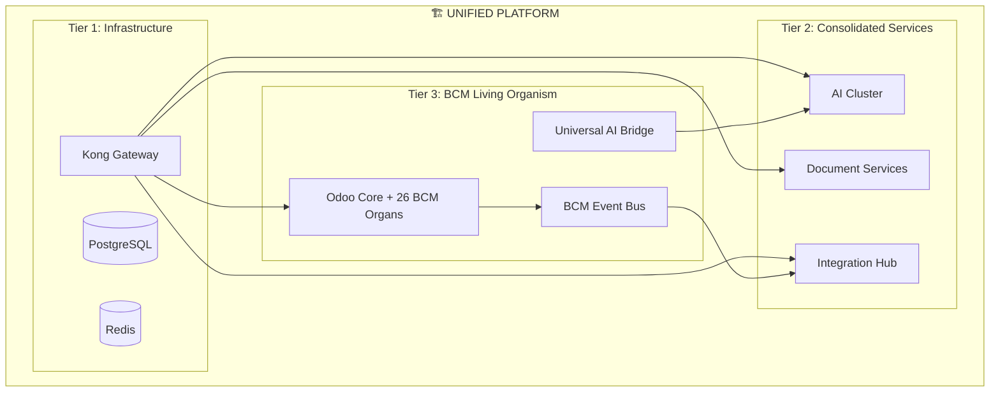

# 🏗️ Комплексная стратегия группирования архитектуры ISO-22301

## 📊 ТЕКУЩЕЕ СОСТОЯНИЕ - ХАОТИЧНАЯ АРХИТЕКТУРА

### **8 папок с дублированием функций:**

```
/document_processor      # Обработка документов
/backend                 # 12 сервисов (auth, eventbus, bpmn, etc.)
/services               # 34 микросервиса (AI, документы, мониторинг)
/ai_services            # Базовый AI (1 файл)
/supabase              # База данных + auth
/adapters              # Адаптеры к внешним системам
/integrations          # 14 интеграций (exercise, governance, mcp)
/api                   # API Gateway + WebSocket
```

### **Проблемы текущей архитектуры:**
- ❌ **Дублирование**: document_processor в 3 местах
- ❌ **AI разбросан**: ai_services + services/ai* + services/ai_*
- ❌ **Event Bus дублирован**: backend/eventbus + adapters/event_bus_adapter
- ❌ **API Gateway множественный**: api/ + services/unified_api_gateway
- ❌ **Нет единой стратегии развертывания**

## 🎯 НОВАЯ UNIFIED ARCHITECTURE

### **Tier 1: Infrastructure Layer**
```
/platform/
├── core/
│   ├── odoo-18.0/           # Stable Core - BCM modules
│   ├── postgres/            # Database
│   └── redis/               # Cache
├── gateway/
│   ├── kong/                # API Gateway (unified)
│   └── nginx/               # Load Balancer
└── monitoring/
    ├── grafana/
    ├── prometheus/
    └── logging/
```

### **Tier 2: Business Services**
```
/platform/services/
├── ai-cluster/              # Consolidated AI Services
│   ├── orchestrator/        # ai_orchestrator + ai_control_center
│   ├── consultant/          # ai-consultant + ai_workflow_optimizer
│   └── analytics/           # AI analytics engine
├── document-services/       # Unified Document Processing
│   ├── processor/           # document_processor consolidation
│   ├── storage/             # Document storage
│   └── search/              # Document search
├── integration-hub/         # All External Integrations
│   ├── thehive/            # Security integration
│   ├── moodle/             # LMS integration
│   └── governance/         # Governance systems
└── notification-center/     # Unified Notifications
    ├── email/
    ├── slack/
    └── webhooks/
```

### **Tier 3: BCM Application Layer**
```
/platform/core/odoo-18.0/addons/
├── bcm_core/               # Core BCM functionality
├── bcm_ai_bridge/          # Universal AI Bridge
├── bcm_project_management/ # Project Management (living organ)
├── bcm_risk_management/    # Risk Management (living organ)
├── bcm_incident_management/# Incident Management (living organ)
└── ... (22 more BCM modules as living organs)
```

## 🚀 MIGRATION STRATEGY

### **PHASE 1: Consolidate AI Services (Week 1)**
```bash
# Создать AI Cluster
mkdir -p /platform/services/ai-cluster/

# Consolidate AI services:
services/ai_orchestrator     → ai-cluster/orchestrator/
services/ai_control_center   → ai-cluster/orchestrator/
services/ai-consultant       → ai-cluster/consultant/
services/ai_workflow_optimizer → ai-cluster/consultant/
ai_services/                 → ai-cluster/analytics/
services/ai/                 → ai-cluster/analytics/
```

### **PHASE 2: Unify Document Processing (Week 1)**
```bash
# Создать Document Services
mkdir -p /platform/services/document-services/

# Consolidate document processing:
document_processor/          → document-services/processor/
services/document_processor/ → document-services/processor/
services/document_management/→ document-services/storage/
backend/document_processor/  → document-services/processor/
```

### **PHASE 3: Consolidate Event Bus & API (Week 1)**
```bash
# Unified Event System
backend/eventbus/           → platform/core/bcm_event_bus/ (Odoo module)
adapters/event_bus_adapter.py → platform/services/integration-hub/

# Unified API Gateway
api/                        → platform/gateway/kong/
services/unified_api_gateway/→ platform/gateway/kong/
```

### **PHASE 4: Create Integration Hub (Week 2)**
```bash
# Consolidate all integrations
mkdir -p /platform/services/integration-hub/

integrations/thehive/       → integration-hub/thehive/
integrations/moodle/        → integration-hub/moodle/
integrations/governance/    → integration-hub/governance/
adapters/thehive/          → integration-hub/thehive/
backend/lms_adapter/       → integration-hub/moodle/
```

## 🧬 ORGANISM ARCHITECTURE INTEGRATION

### **BCM Living Organism в Unified Platform:**



## 📋 MICROSERVICES → ODOO MODULES BRIDGE

### **Мост взаимодействия:**

```python
# platform/core/odoo-18.0/addons/bcm_microservices_bridge/

class BCMMicroservicesBridge(models.Model):
    _name = 'bcm.microservices.bridge'

    # Service Discovery
    def discover_platform_services(self):
        services = {
            'ai_cluster': 'http://ai-cluster:8000',
            'document_services': 'http://document-services:8001',
            'integration_hub': 'http://integration-hub:8002',
        }
        return services

    # Call external microservices
    def call_microservice(self, service_name, endpoint, data):
        service_url = self.discover_platform_services()[service_name]
        response = requests.post(f"{service_url}{endpoint}", json=data)
        return response.json()

    # Convert microservice to Odoo module
    def migrate_microservice_to_module(self, service_name):
        # Logic to wrap microservice as Odoo module
        pass
```

## 🔄 CONVERSION PLAN: Microservices → Odoo Modules

### **Priority Services for Conversion:**

1. **ai_orchestrator** → **bcm_ai_orchestrator** (Odoo module)
2. **notification_service** → **bcm_notification** (Odoo module)
3. **monitoring_service** → **bcm_monitoring** (Odoo module)
4. **process_mining_service** → **bcm_process_mining** (Odoo module)

### **Conversion Template:**
```python
# services/ai_orchestrator/main.py →
# platform/core/odoo-18.0/addons/bcm_ai_orchestrator/models/ai_orchestrator.py

class BCMAIOrchestrator(models.Model):
    _name = 'bcm.ai.orchestrator'
    _description = 'AI Orchestration within Odoo'

    # Migrate existing microservice logic
    def orchestrate_ai_workflow(self, workflow_data):
        # Original microservice logic here
        pass

    # Add Odoo-specific features
    def create_ai_workflow_record(self, workflow_result):
        # Save to Odoo database
        pass
```

## 📊 РЕЗУЛЬТАТ UNIFIED ARCHITECTURE

### **ДО оптимизации:**
```
8 раздельных папок
60+ микросервисов
Множественное дублирование
Нет единой стратегии
```

### **ПОСЛЕ оптимизации:**
```
🏗️ Unified Platform Structure:
├── Infrastructure (3 components)
├── Business Services (4 clusters)
└── BCM Living Organism (26 organs + bridges)

Total: ~35 organized components (вместо 60+ хаотичных)
```

## 🎖️ ПРЕИМУЩЕСТВА НОВОЙ АРХИТЕКТУРЫ

### **1. Structural Benefits:**
- ✅ **Elimination of Duplication** - document processing in 1 place
- ✅ **Logical Grouping** - AI services in ai-cluster
- ✅ **Clear Hierarchy** - Infrastructure → Services → BCM Organism
- ✅ **Unified Deployment** - single docker-compose strategy

### **2. Integration Benefits:**
- ✅ **Single Event Bus** - BCM Event Bus in Odoo
- ✅ **Universal AI Bridge** - connects to consolidated AI cluster
- ✅ **Microservices Bridge** - seamless integration with external services
- ✅ **Living Organism** - 26 BCM modules as reactive organs

### **3. Operational Benefits:**
- ✅ **Reduced Complexity** - 35 vs 60+ components
- ✅ **Easier Maintenance** - logical structure
- ✅ **Better Scalability** - service clusters can scale independently
- ✅ **Unified Monitoring** - single monitoring stack

## 🚀 IMMEDIATE NEXT STEPS

### **1. Create Platform Structure**
```bash
mkdir -p /platform/{core,services,gateway,monitoring}
mkdir -p /platform/services/{ai-cluster,document-services,integration-hub}
```

### **2. Start with AI Cluster Consolidation**
```bash
# Move and merge AI services
mv services/ai_orchestrator platform/services/ai-cluster/orchestrator/
mv services/ai_control_center platform/services/ai-cluster/orchestrator/
```

### **3. Create Microservices Bridge**
```bash
# Create bridge module in Odoo
mkdir -p platform/core/odoo-18.0/addons/bcm_microservices_bridge/
```

### **4. Deploy Unified Architecture**
```bash
# Single deployment command for entire platform
docker-compose -f platform/docker-compose.unified.yml up -d
```

**Готов начать с любого этапа! Какой приоритет выбираешь?** 🎯