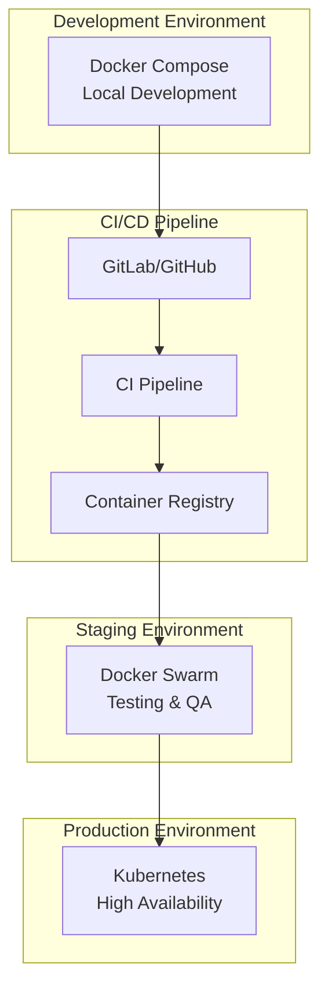

# 🚀 Стратегия развертывания и оркестрации BCM Platform

## 📋 Оглавление
1. [Текущие проблемы](#текущие-проблемы)
2. [Стратегии оркестрации](#стратегии-оркестрации)
3. [Рекомендуемое решение](#рекомендуемое-решение)
4. [Практическая реализация](#практическая-реализация)
5. [Автоматизация и CI/CD](#автоматизация-и-cicd)

---

## 🔴 Текущие проблемы

```yaml
Проблемы запуска:
  - 92+ сервисов в разных docker-compose файлах
  - Нет единой точки запуска
  - Сложные зависимости между сервисами
  - Отсутствие health checks
  - Нет автоматического порядка запуска

Проблемы взаимодействия:
  - Hardcoded URLs и порты
  - Отсутствие service discovery
  - Нет единого API gateway
  - Разные протоколы коммуникации
  - Отсутствие circuit breakers
```

---

## 🎯 Стратегии оркестрации

### Вариант 1: DOCKER COMPOSE ORCHESTRATION (Простой)

```yaml
# docker-compose.unified.yml
version: '3.9'

x-common-variables: &common-variables
  POSTGRES_HOST: postgres
  REDIS_HOST: redis
  RABBITMQ_HOST: rabbitmq

x-healthcheck-defaults: &healthcheck-defaults
  interval: 30s
  timeout: 10s
  retries: 3
  start_period: 40s

services:
  # Layer 1: Databases (запускаются первыми)
  postgres:
    image: postgres:15
    healthcheck:
      <<: *healthcheck-defaults
      test: ["CMD-SHELL", "pg_isready -U postgres"]
    networks:
      - bcm-network

  redis:
    image: redis:7-alpine
    healthcheck:
      <<: *healthcheck-defaults
      test: ["CMD", "redis-cli", "ping"]
    networks:
      - bcm-network

  rabbitmq:
    image: rabbitmq:3-management
    healthcheck:
      <<: *healthcheck-defaults
      test: ["CMD", "rabbitmq-diagnostics", "ping"]
    networks:
      - bcm-network

  # Layer 2: Core Services
  odoo:
    build: ./core/odoo-18.0
    depends_on:
      postgres:
        condition: service_healthy
      redis:
        condition: service_healthy
    environment:
      <<: *common-variables
    healthcheck:
      <<: *healthcheck-defaults
      test: ["CMD", "curl", "-f", "http://localhost:8069/web/health"]
    networks:
      - bcm-network

  # Layer 3: API Gateway
  api-gateway:
    build: ./services/api-gateway
    depends_on:
      odoo:
        condition: service_healthy
    environment:
      <<: *common-variables
    networks:
      - bcm-network

  # Layer 4: Business Services
  ai-orchestrator:
    build: ./services/ai-orchestrator
    depends_on:
      api-gateway:
        condition: service_healthy
    environment:
      <<: *common-variables
    networks:
      - bcm-network

networks:
  bcm-network:
    driver: bridge
    ipam:
      config:
        - subnet: 172.20.0.0/16
```

**Управление через Makefile:**
```makefile
# Makefile
.PHONY: all start stop restart status logs clean

# Запуск всей платформы
start:
	@echo "🚀 Starting BCM Platform..."
	@docker-compose -f docker-compose.unified.yml up -d --build
	@echo "⏳ Waiting for services to be healthy..."
	@./scripts/wait-for-healthy.sh
	@echo "✅ Platform is running!"

# Запуск только core сервисов
start-core:
	@docker-compose -f docker-compose.unified.yml up -d \
		postgres redis rabbitmq odoo api-gateway

# Запуск с мониторингом
start-with-monitoring:
	@docker-compose -f docker-compose.unified.yml \
		-f docker-compose.monitoring.yml up -d

# Остановка
stop:
	@echo "🛑 Stopping BCM Platform..."
	@docker-compose -f docker-compose.unified.yml down

# Статус
status:
	@echo "📊 BCM Platform Status:"
	@docker-compose -f docker-compose.unified.yml ps
	@echo "\n🔍 Health Status:"
	@./scripts/check-health.sh

# Логи
logs:
	@docker-compose -f docker-compose.unified.yml logs -f

# Полная очистка
clean:
	@docker-compose -f docker-compose.unified.yml down -v
	@docker system prune -af
```

---

### Вариант 2: KUBERNETES ORCHESTRATION (Production-ready)

```yaml
# k8s/namespace.yaml
apiVersion: v1
kind: Namespace
metadata:
  name: bcm-platform

---
# k8s/configmap.yaml
apiVersion: v1
kind: ConfigMap
metadata:
  name: bcm-config
  namespace: bcm-platform
data:
  POSTGRES_HOST: "postgres-service"
  REDIS_HOST: "redis-service"
  RABBITMQ_HOST: "rabbitmq-service"
  API_GATEWAY_URL: "http://api-gateway-service:8080"

---
# k8s/postgres-statefulset.yaml
apiVersion: apps/v1
kind: StatefulSet
metadata:
  name: postgres
  namespace: bcm-platform
spec:
  serviceName: postgres-service
  replicas: 1
  selector:
    matchLabels:
      app: postgres
  template:
    metadata:
      labels:
        app: postgres
    spec:
      containers:
      - name: postgres
        image: postgres:15
        env:
        - name: POSTGRES_PASSWORD
          valueFrom:
            secretKeyRef:
              name: db-secret
              key: password
        ports:
        - containerPort: 5432
        volumeMounts:
        - name: postgres-storage
          mountPath: /var/lib/postgresql/data
        livenessProbe:
          exec:
            command:
            - pg_isready
            - -U
            - postgres
          initialDelaySeconds: 30
          periodSeconds: 10
        readinessProbe:
          exec:
            command:
            - pg_isready
            - -U
            - postgres
          initialDelaySeconds: 5
          periodSeconds: 5
  volumeClaimTemplates:
  - metadata:
      name: postgres-storage
    spec:
      accessModes: ["ReadWriteOnce"]
      resources:
        requests:
          storage: 10Gi

---
# k8s/odoo-deployment.yaml
apiVersion: apps/v1
kind: Deployment
metadata:
  name: odoo
  namespace: bcm-platform
spec:
  replicas: 3
  selector:
    matchLabels:
      app: odoo
  template:
    metadata:
      labels:
        app: odoo
    spec:
      initContainers:
      - name: wait-for-db
        image: busybox:1.35
        command: ['sh', '-c', 'until nc -z postgres-service 5432; do sleep 1; done']
      containers:
      - name: odoo
        image: bcm-platform/odoo:latest
        envFrom:
        - configMapRef:
            name: bcm-config
        ports:
        - containerPort: 8069
        livenessProbe:
          httpGet:
            path: /web/health
            port: 8069
          initialDelaySeconds: 60
          periodSeconds: 30
        readinessProbe:
          httpGet:
            path: /web/health
            port: 8069
          initialDelaySeconds: 30
          periodSeconds: 10
        resources:
          requests:
            memory: "1Gi"
            cpu: "500m"
          limits:
            memory: "2Gi"
            cpu: "1000m"
```

**Helm Chart для упрощения:**
```yaml
# helm/bcm-platform/values.yaml
global:
  namespace: bcm-platform
  image:
    registry: docker.io/bcm-platform
    tag: latest
    pullPolicy: IfNotPresent

databases:
  postgres:
    enabled: true
    replicas: 1
    storage: 10Gi
  redis:
    enabled: true
    replicas: 1
  rabbitmq:
    enabled: true
    replicas: 1

core:
  odoo:
    enabled: true
    replicas: 3
    autoscaling:
      enabled: true
      minReplicas: 2
      maxReplicas: 10
      targetCPUUtilization: 70

services:
  ai-orchestrator:
    enabled: true
    replicas: 2
  api-gateway:
    enabled: true
    replicas: 2

monitoring:
  prometheus:
    enabled: true
  grafana:
    enabled: true
  jaeger:
    enabled: true
```

**Запуск через Helm:**
```bash
# Установка
helm install bcm-platform ./helm/bcm-platform \
  --namespace bcm-platform \
  --create-namespace

# Обновление
helm upgrade bcm-platform ./helm/bcm-platform

# Удаление
helm uninstall bcm-platform
```

---

### Вариант 3: DOCKER SWARM (Компромиссный)

```yaml
# docker-stack.yml
version: '3.9'

services:
  postgres:
    image: postgres:15
    deploy:
      replicas: 1
      placement:
        constraints:
          - node.role == manager
      restart_policy:
        condition: any
        delay: 5s
    environment:
      POSTGRES_PASSWORD_FILE: /run/secrets/db_password
    secrets:
      - db_password
    volumes:
      - postgres_data:/var/lib/postgresql/data
    networks:
      - bcm_overlay

  odoo:
    image: bcm-platform/odoo:latest
    deploy:
      replicas: 3
      update_config:
        parallelism: 1
        delay: 10s
      restart_policy:
        condition: on-failure
    depends_on:
      - postgres
    networks:
      - bcm_overlay

  ai-orchestrator:
    image: bcm-platform/ai-orchestrator:latest
    deploy:
      replicas: 2
      placement:
        preferences:
          - spread: node.id
    networks:
      - bcm_overlay

networks:
  bcm_overlay:
    driver: overlay
    attachable: true

volumes:
  postgres_data:

secrets:
  db_password:
    external: true
```

**Управление Swarm:**
```bash
# Инициализация Swarm
docker swarm init

# Deploy stack
docker stack deploy -c docker-stack.yml bcm

# Масштабирование
docker service scale bcm_odoo=5

# Мониторинг
docker service ls
docker stack ps bcm
```

---

## 🏆 Рекомендуемое решение: HYBRID ORCHESTRATION

### Архитектура развертывания:



### Unified Orchestration Framework:

```yaml
# orchestration-config.yaml
environments:
  development:
    type: docker-compose
    config: ./docker/docker-compose.dev.yml
    features:
      hot-reload: true
      debug: true
      mock-services: true

  staging:
    type: docker-swarm
    config: ./swarm/docker-stack.staging.yml
    features:
      replicas: 2
      monitoring: true
      load-testing: true

  production:
    type: kubernetes
    config: ./k8s/production/
    features:
      high-availability: true
      auto-scaling: true
      disaster-recovery: true
      multi-region: true
```

---

## 📦 Практическая реализация

### 1. Service Discovery и Registry

```yaml
# consul-service-registry.yml
version: '3.9'

services:
  consul:
    image: consul:latest
    ports:
      - "8500:8500"
      - "8600:8600/udp"
    command: agent -server -ui -bootstrap-expect=1 -client=0.0.0.0
    volumes:
      - consul_data:/consul/data

  registrator:
    image: gliderlabs/registrator:latest
    command: -internal consul://consul:8500
    volumes:
      - /var/run/docker.sock:/tmp/docker.sock
    depends_on:
      - consul

  # Все сервисы автоматически регистрируются
  odoo:
    image: bcm-platform/odoo
    environment:
      SERVICE_NAME: odoo
      SERVICE_TAGS: core,business
    # Consul DNS: odoo.service.consul
```

### 2. API Gateway с Kong

```yaml
# kong-gateway.yml
version: '3.9'

services:
  kong-database:
    image: postgres:15
    environment:
      POSTGRES_DB: kong
      POSTGRES_USER: kong
      POSTGRES_PASSWORD: kongpass

  kong-migration:
    image: kong:3.0
    command: kong migrations bootstrap
    depends_on:
      - kong-database
    environment:
      KONG_DATABASE: postgres
      KONG_PG_HOST: kong-database

  kong:
    image: kong:3.0
    depends_on:
      - kong-migration
    environment:
      KONG_DATABASE: postgres
      KONG_PG_HOST: kong-database
      KONG_PROXY_ACCESS_LOG: /dev/stdout
      KONG_ADMIN_ACCESS_LOG: /dev/stdout
      KONG_PROXY_ERROR_LOG: /dev/stderr
      KONG_ADMIN_ERROR_LOG: /dev/stderr
      KONG_ADMIN_LISTEN: 0.0.0.0:8001
    ports:
      - "8000:8000"  # Proxy
      - "8001:8001"  # Admin API
      - "8443:8443"  # Proxy SSL
      - "8444:8444"  # Admin SSL

  konga:
    image: pantsel/konga
    ports:
      - "1337:1337"
    environment:
      NODE_ENV: production
      TOKEN_SECRET: km1GUr4RkcQD7DewhJPNXrCuZwcKmqjb
```

### 3. Service Mesh с Istio

```bash
# Установка Istio
curl -L https://istio.io/downloadIstio | sh -
istioctl install --set profile=demo -y

# Включение sidecar injection
kubectl label namespace bcm-platform istio-injection=enabled

# Применение конфигурации
kubectl apply -f istio-config.yaml
```

```yaml
# istio-config.yaml
apiVersion: networking.istio.io/v1alpha3
kind: VirtualService
metadata:
  name: bcm-routing
spec:
  hosts:
  - bcm-platform.local
  http:
  - match:
    - uri:
        prefix: "/api/v1/odoo"
    route:
    - destination:
        host: odoo-service
        port:
          number: 8069
  - match:
    - uri:
        prefix: "/api/v1/ai"
    route:
    - destination:
        host: ai-orchestrator-service
        port:
          number: 8000
      weight: 80
    - destination:
        host: ai-orchestrator-canary
        port:
          number: 8000
      weight: 20  # Canary deployment

---
apiVersion: networking.istio.io/v1alpha3
kind: DestinationRule
metadata:
  name: circuit-breaker
spec:
  host: odoo-service
  trafficPolicy:
    outlierDetection:
      consecutiveErrors: 5
      interval: 30s
      baseEjectionTime: 30s
```

---

## 🔧 Скрипты управления

### Master Control Script

```bash
#!/bin/bash
# bcm-platform-control.sh

set -e

# Configuration
ENVIRONMENT=${BCM_ENV:-development}
ACTION=${1:-help}

# Colors for output
RED='\033[0;31m'
GREEN='\033[0;32m'
BLUE='\033[0;34m'
NC='\033[0m'

# Functions
log_info() {
    echo -e "${BLUE}[INFO]${NC} $1"
}

log_success() {
    echo -e "${GREEN}[SUCCESS]${NC} $1"
}

log_error() {
    echo -e "${RED}[ERROR]${NC} $1"
}

# Check prerequisites
check_prerequisites() {
    log_info "Checking prerequisites..."

    # Check Docker
    if ! command -v docker &> /dev/null; then
        log_error "Docker is not installed"
        exit 1
    fi

    # Check environment-specific tools
    case $ENVIRONMENT in
        development)
            if ! command -v docker-compose &> /dev/null; then
                log_error "Docker Compose is not installed"
                exit 1
            fi
            ;;
        staging)
            if ! docker info | grep -q "Swarm: active"; then
                log_error "Docker Swarm is not initialized"
                exit 1
            fi
            ;;
        production)
            if ! command -v kubectl &> /dev/null; then
                log_error "kubectl is not installed"
                exit 1
            fi
            ;;
    esac

    log_success "Prerequisites check passed"
}

# Start platform
start_platform() {
    log_info "Starting BCM Platform in $ENVIRONMENT environment..."

    case $ENVIRONMENT in
        development)
            docker-compose -f docker-compose.unified.yml up -d
            ;;
        staging)
            docker stack deploy -c docker-stack.yml bcm
            ;;
        production)
            kubectl apply -k k8s/overlays/production/
            ;;
    esac

    wait_for_health
    log_success "BCM Platform started successfully"
}

# Stop platform
stop_platform() {
    log_info "Stopping BCM Platform..."

    case $ENVIRONMENT in
        development)
            docker-compose -f docker-compose.unified.yml down
            ;;
        staging)
            docker stack rm bcm
            ;;
        production)
            kubectl delete -k k8s/overlays/production/
            ;;
    esac

    log_success "BCM Platform stopped"
}

# Check health
wait_for_health() {
    log_info "Waiting for services to be healthy..."

    local max_attempts=60
    local attempt=0

    while [ $attempt -lt $max_attempts ]; do
        if check_health; then
            log_success "All services are healthy"
            return 0
        fi

        echo -n "."
        sleep 5
        attempt=$((attempt + 1))
    done

    log_error "Services did not become healthy in time"
    return 1
}

check_health() {
    case $ENVIRONMENT in
        development)
            docker-compose -f docker-compose.unified.yml ps | grep -q "unhealthy" && return 1
            ;;
        staging)
            docker service ls | grep -q "0/" && return 1
            ;;
        production)
            kubectl get pods -n bcm-platform | grep -q "0/1" && return 1
            ;;
    esac

    return 0
}

# Show status
show_status() {
    log_info "BCM Platform Status ($ENVIRONMENT):"

    case $ENVIRONMENT in
        development)
            docker-compose -f docker-compose.unified.yml ps
            ;;
        staging)
            docker service ls
            docker stack ps bcm
            ;;
        production)
            kubectl get all -n bcm-platform
            ;;
    esac
}

# Main
main() {
    case $ACTION in
        start)
            check_prerequisites
            start_platform
            ;;
        stop)
            stop_platform
            ;;
        restart)
            stop_platform
            sleep 5
            start_platform
            ;;
        status)
            show_status
            ;;
        health)
            check_health && log_success "All services healthy" || log_error "Some services unhealthy"
            ;;
        logs)
            case $ENVIRONMENT in
                development)
                    docker-compose -f docker-compose.unified.yml logs -f ${2:-}
                    ;;
                staging)
                    docker service logs -f ${2:-}
                    ;;
                production)
                    kubectl logs -f -n bcm-platform ${2:-}
                    ;;
            esac
            ;;
        scale)
            SERVICE=$2
            REPLICAS=$3
            case $ENVIRONMENT in
                staging)
                    docker service scale bcm_${SERVICE}=${REPLICAS}
                    ;;
                production)
                    kubectl scale deployment ${SERVICE} --replicas=${REPLICAS} -n bcm-platform
                    ;;
                *)
                    log_error "Scaling not supported in $ENVIRONMENT"
                    ;;
            esac
            ;;
        help|*)
            echo "Usage: $0 {start|stop|restart|status|health|logs|scale} [options]"
            echo ""
            echo "Environment: BCM_ENV={development|staging|production}"
            echo ""
            echo "Examples:"
            echo "  BCM_ENV=development $0 start"
            echo "  BCM_ENV=production $0 status"
            echo "  $0 logs odoo"
            echo "  $0 scale odoo 5"
            ;;
    esac
}

main
```

---

## 🚦 Service Dependencies & Startup Order

```yaml
# startup-order.yaml
startup_groups:
  # Group 1: Infrastructure (запускается первым)
  infrastructure:
    parallel: true
    services:
      - postgres
      - redis
      - rabbitmq
      - consul
    health_check: required
    timeout: 120s

  # Group 2: Core Services
  core:
    parallel: false
    depends_on: infrastructure
    services:
      - keycloak     # Auth first
      - odoo         # Then business logic
      - api-gateway  # Then gateway
    health_check: required
    timeout: 180s

  # Group 3: Business Services
  business:
    parallel: true
    depends_on: core
    services:
      - ai-orchestrator
      - bia-engine
      - risk-assessment
      - notification-service
    health_check: optional
    timeout: 120s

  # Group 4: Integration Services
  integrations:
    parallel: true
    depends_on: business
    services:
      - thehive-adapter
      - lms-adapter
      - simulation-engine
    health_check: optional
    timeout: 60s

  # Group 5: Frontend
  frontend:
    parallel: true
    depends_on: business
    services:
      - admin-portal
      - user-portal
      - mobile-backend
    health_check: optional
    timeout: 60s

  # Group 6: Monitoring
  monitoring:
    parallel: true
    depends_on: core
    services:
      - prometheus
      - grafana
      - jaeger
    health_check: optional
    timeout: 60s
```

### Smart Startup Script:

```python
#!/usr/bin/env python3
# smart-startup.py

import yaml
import subprocess
import time
import concurrent.futures
from typing import List, Dict
import sys

class PlatformOrchestrator:
    def __init__(self, config_file='startup-order.yaml'):
        with open(config_file, 'r') as f:
            self.config = yaml.safe_load(f)
        self.startup_groups = self.config['startup_groups']

    def start_service(self, service: str) -> bool:
        """Start a single service"""
        print(f"🚀 Starting {service}...")
        try:
            subprocess.run([
                'docker-compose',
                '-f', 'docker-compose.unified.yml',
                'up', '-d', service
            ], check=True)
            return self.wait_for_health(service)
        except subprocess.CalledProcessError:
            print(f"❌ Failed to start {service}")
            return False

    def wait_for_health(self, service: str, timeout: int = 60) -> bool:
        """Wait for service to be healthy"""
        start_time = time.time()
        while time.time() - start_time < timeout:
            result = subprocess.run([
                'docker-compose',
                '-f', 'docker-compose.unified.yml',
                'ps', service
            ], capture_output=True, text=True)

            if 'healthy' in result.stdout or 'running' in result.stdout:
                print(f"✅ {service} is healthy")
                return True

            time.sleep(5)

        print(f"⚠️ {service} health check timeout")
        return False

    def start_group(self, group_name: str) -> bool:
        """Start a group of services"""
        group = self.startup_groups[group_name]
        services = group['services']
        parallel = group.get('parallel', False)

        print(f"\n📦 Starting group: {group_name}")

        if parallel:
            # Start services in parallel
            with concurrent.futures.ThreadPoolExecutor(max_workers=len(services)) as executor:
                futures = {executor.submit(self.start_service, svc): svc for svc in services}
                results = []
                for future in concurrent.futures.as_completed(futures):
                    results.append(future.result())
                return all(results)
        else:
            # Start services sequentially
            for service in services:
                if not self.start_service(service):
                    if group.get('health_check') == 'required':
                        return False
            return True

    def start_platform(self):
        """Start the entire platform"""
        print("🎯 Starting BCM Platform with smart orchestration...")

        started_groups = []

        for group_name, group_config in self.startup_groups.items():
            # Check dependencies
            depends_on = group_config.get('depends_on', [])
            if isinstance(depends_on, str):
                depends_on = [depends_on]

            for dep in depends_on:
                if dep not in started_groups:
                    print(f"⏳ Waiting for dependency: {dep}")
                    # Dependencies should already be started

            # Start the group
            if self.start_group(group_name):
                started_groups.append(group_name)
                print(f"✅ Group {group_name} started successfully")
            else:
                print(f"❌ Failed to start group {group_name}")
                if group_config.get('health_check') == 'required':
                    print("🛑 Stopping platform startup due to required service failure")
                    return False

        print("\n🎉 BCM Platform started successfully!")
        return True

    def stop_platform(self):
        """Stop the platform in reverse order"""
        print("🛑 Stopping BCM Platform...")

        # Stop in reverse order
        groups = list(reversed(list(self.startup_groups.keys())))

        for group_name in groups:
            group = self.startup_groups[group_name]
            services = group['services']

            print(f"📦 Stopping group: {group_name}")
            for service in services:
                subprocess.run([
                    'docker-compose',
                    '-f', 'docker-compose.unified.yml',
                    'stop', service
                ])

        print("✅ Platform stopped")

if __name__ == "__main__":
    orchestrator = PlatformOrchestrator()

    if len(sys.argv) > 1:
        action = sys.argv[1]
        if action == 'start':
            orchestrator.start_platform()
        elif action == 'stop':
            orchestrator.stop_platform()
        else:
            print(f"Unknown action: {action}")
    else:
        orchestrator.start_platform()
```

---

## 🔄 Автоматизация и CI/CD

### GitLab CI/CD Pipeline:

```yaml
# .gitlab-ci.yml
stages:
  - build
  - test
  - staging
  - production

variables:
  DOCKER_REGISTRY: registry.gitlab.com/bcm-platform
  DOCKER_DRIVER: overlay2
  KUBERNETES_NAMESPACE: bcm-platform

# Build stage
build:
  stage: build
  image: docker:latest
  services:
    - docker:dind
  script:
    - docker login -u $CI_REGISTRY_USER -p $CI_REGISTRY_PASSWORD $CI_REGISTRY
    - docker build -t $CI_REGISTRY_IMAGE:$CI_COMMIT_SHA .
    - docker push $CI_REGISTRY_IMAGE:$CI_COMMIT_SHA
  only:
    - main
    - develop

# Test stage
test:
  stage: test
  image: $CI_REGISTRY_IMAGE:$CI_COMMIT_SHA
  script:
    - python -m pytest tests/
    - python -m coverage run -m pytest
    - python -m coverage report
  coverage: '/TOTAL.*\s+(\d+)%/'

# Deploy to staging
deploy-staging:
  stage: staging
  image: docker:latest
  script:
    - docker stack deploy -c docker-stack.staging.yml bcm-staging
  environment:
    name: staging
    url: https://staging.bcm-platform.com
  only:
    - develop

# Deploy to production
deploy-production:
  stage: production
  image: bitnami/kubectl:latest
  script:
    - kubectl config use-context production
    - kubectl set image deployment/odoo odoo=$CI_REGISTRY_IMAGE:$CI_COMMIT_SHA -n $KUBERNETES_NAMESPACE
    - kubectl rollout status deployment/odoo -n $KUBERNETES_NAMESPACE
  environment:
    name: production
    url: https://bcm-platform.com
  only:
    - main
  when: manual
```

---

## 📊 Monitoring & Observability

### Unified Monitoring Stack:

```yaml
# monitoring-stack.yml
version: '3.9'

services:
  prometheus:
    image: prom/prometheus:latest
    volumes:
      - ./prometheus.yml:/etc/prometheus/prometheus.yml
      - prometheus_data:/prometheus
    command:
      - '--config.file=/etc/prometheus/prometheus.yml'
      - '--storage.tsdb.path=/prometheus'
    ports:
      - "9090:9090"

  grafana:
    image: grafana/grafana:latest
    volumes:
      - grafana_data:/var/lib/grafana
      - ./grafana/dashboards:/etc/grafana/provisioning/dashboards
    environment:
      - GF_SECURITY_ADMIN_PASSWORD=admin
      - GF_INSTALL_PLUGINS=redis-datasource
    ports:
      - "3003:3000"

  loki:
    image: grafana/loki:latest
    ports:
      - "3100:3100"
    volumes:
      - loki_data:/loki

  promtail:
    image: grafana/promtail:latest
    volumes:
      - /var/log:/var/log
      - /var/run/docker.sock:/var/run/docker.sock
      - ./promtail.yml:/etc/promtail/config.yml
    command: -config.file=/etc/promtail/config.yml

  jaeger:
    image: jaegertracing/all-in-one:latest
    environment:
      - COLLECTOR_OTLP_ENABLED=true
    ports:
      - "5775:5775/udp"
      - "6831:6831/udp"
      - "6832:6832/udp"
      - "5778:5778"
      - "16686:16686"
      - "14268:14268"
      - "14250:14250"
      - "9411:9411"

volumes:
  prometheus_data:
  grafana_data:
  loki_data:
```

---

## 🎯 Итоговые рекомендации

### Для вашего проекта я рекомендую:

1. **Development**: Docker Compose с smart orchestration
2. **Staging**: Docker Swarm для простоты
3. **Production**: Kubernetes для масштабируемости

### Ключевые компоненты решения:

```yaml
Orchestration:
  - Smart startup с учетом зависимостей
  - Health checks на всех уровнях
  - Graceful shutdown
  - Auto-recovery при сбоях

Service Discovery:
  - Consul для регистрации сервисов
  - DNS-based discovery
  - Dynamic configuration

API Management:
  - Kong Gateway для роутинга
  - Rate limiting и caching
  - API versioning

Observability:
  - Prometheus + Grafana для метрик
  - Loki для логов
  - Jaeger для трассировки
  - Unified dashboards

Automation:
  - GitLab CI/CD pipeline
  - Automated testing
  - Blue-green deployments
  - Rollback capabilities
```

### Quick Start:

```bash
# Clone repository
git clone https://github.com/bcm-platform/orchestration

# Start development environment
make dev-start

# Start staging environment
make staging-deploy

# Start production environment
make prod-deploy
```

---

*Документ подготовлен: 2025-01-29*
*Версия: 1.0*
*Статус: Ready for implementation*