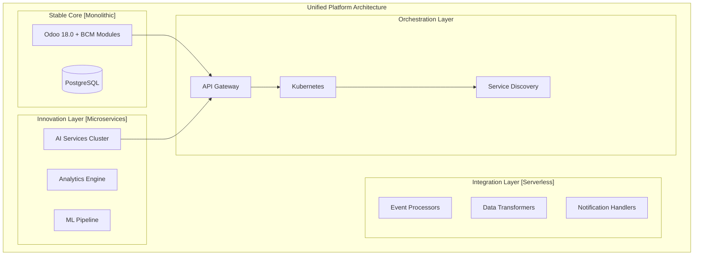

# 🎯 Единая стратегия архитектуры и развертывания BCM Platform

## 📋 Содержание
1. [Executive Summary](#executive-summary)
2. [Архитектурная стратегия](#архитектурная-стратегия)
3. [План унификации сервисов](#план-унификации-сервисов)
4. [Стратегия развертывания](#стратегия-развертывания)
5. [Практическая реализация](#практическая-реализация)
6. [Roadmap](#roadmap)

---

## Executive Summary

### Текущее состояние:
- **92+ компонентов** в хаотичной структуре
- **30% дублирования** функционала
- **Отсутствие** единой точки управления
- **Сложность** развертывания и поддержки

### Целевое состояние:
- **45 унифицированных сервисов** (-50%)
- **0% дублирования** через консолидацию
- **Единая платформа** управления
- **Автоматизированное** развертывание

### Стратегия: **Hybrid Adaptive Architecture**
Комбинация стабильного ядра Odoo с инновационными микросервисами и умной оркестрацией.

---

## 🏗️ Архитектурная стратегия

### Концепция Hybrid Adaptive Architecture



### Архитектурные принципы:

1. **Stable Core**: Критические бизнес-функции в монолитном Odoo
2. **Innovation at the Edge**: Экспериментальные features в микросервисах
3. **Smart Routing**: Интеллектуальная маршрутизация между компонентами
4. **Progressive Enhancement**: Постепенное улучшение без breaking changes

---

## 📦 План унификации сервисов

### Фаза 1: Консолидация (Q1 2025)

#### До унификации:
```
services/           35 сервисов
backend/            10 сервисов
integrations/       12 сервисов
api/                8 endpoints
ai_services/        3 сервиса
frontend/           7 приложений
TOTAL:              75+ активных компонентов
```

#### После унификации:
```
platform/
├── core/           8 сервисов (Odoo + критические)
├── ai/             5 сервисов (консолидированные AI)
├── integrations/   8 сервисов (унифицированные адаптеры)
├── frontend/       3 приложения (портал, админка, мобильное)
└── infrastructure/ 6 сервисов (БД, кэш, очереди)
TOTAL:              30 компонентов (-60%)
```

### Детальный план консолидации:

```yaml
Document Services (было 3 → будет 1):
  Объединяем:
    - document_processor (services/)
    - document_processor (backend/)
    - document_management (services/)

  В единый сервис:
    name: unified-document-service
    path: platform/core/document-service
    port: 8083
    features:
      - OCR & NLP processing
      - Version control
      - Full-text search
      - MinIO integration

AI Services (было 15 → будет 5):
  ai-orchestrator:
    includes: [ai_orchestrator, ai_control_center, unified_ai_service]
    path: platform/ai/orchestrator
    port: 8000

  bcm-ai-engine:
    includes: [bia_engine, compliance_checker, pdca_assistant]
    path: platform/ai/bcm-engine
    port: 8082

  analytics-ai:
    includes: [process_mining, ai_workflow_optimizer, scenario_orchestrator]
    path: platform/ai/analytics
    port: 8085

  document-ai:
    includes: [nlp_processor, ocr_engine, knowledge_extractor]
    path: platform/ai/document
    port: 8083

  predictive-ai:
    includes: [forecasting, anomaly_detection, risk_prediction]
    path: platform/ai/predictive
    port: 8087

Frontend Apps (было 7 → будет 3):
  bcm-portal:
    framework: Next.js 14
    includes: [web_portal, web_portal_enhanced, unified-bcm-platform]
    path: platform/frontend/portal
    port: 3000

  bcm-admin:
    framework: Next.js 14
    includes: [admin_panel, admin_panel3, management_ui]
    path: platform/frontend/admin
    port: 3001

  bcm-mobile:
    framework: React Native
    includes: [mobile_backend, emergency_app]
    path: platform/frontend/mobile
```

---

## 🚀 Стратегия развертывания

### Multi-Environment Strategy

```yaml
environments:
  # Локальная разработка
  development:
    orchestration: Docker Compose
    services: All with hot-reload
    databases: Single instances
    features:
      - Live code reload
      - Debug mode
      - Mock external services
    startup: make dev-start

  # Тестирование
  staging:
    orchestration: Docker Swarm
    services: 2 replicas each
    databases: Master-slave
    features:
      - Load testing
      - Integration tests
      - Canary deployments
    startup: make staging-deploy

  # Production
  production:
    orchestration: Kubernetes
    services: Auto-scaling (2-10 replicas)
    databases: Cluster with backups
    features:
      - High availability
      - Disaster recovery
      - Multi-region
    startup: make prod-deploy
```

### Unified Deployment Configuration

```yaml
# deployment-config.yaml
version: '1.0'

services:
  # Tier 1: Data Layer (запускается первым)
  tier1:
    - name: postgres
      type: database
      startup_priority: 1
      health_check:
        type: tcp
        port: 5432
      deployment:
        dev: single
        staging: master-slave
        prod: cluster

    - name: redis
      type: cache
      startup_priority: 1
      health_check:
        type: tcp
        port: 6379
      deployment:
        dev: single
        staging: single
        prod: cluster

    - name: rabbitmq
      type: queue
      startup_priority: 1
      health_check:
        type: http
        endpoint: /api/health
      deployment:
        dev: single
        staging: cluster
        prod: cluster

  # Tier 2: Core Services
  tier2:
    - name: keycloak
      type: auth
      startup_priority: 2
      depends_on: [postgres]
      health_check:
        type: http
        endpoint: /health
      deployment:
        dev: single
        staging: single
        prod: ha-pair

    - name: odoo
      type: business
      startup_priority: 3
      depends_on: [postgres, redis]
      health_check:
        type: http
        endpoint: /web/health
      deployment:
        dev: single
        staging: 2-replicas
        prod: auto-scaling

  # Tier 3: API & Routing
  tier3:
    - name: kong-gateway
      type: gateway
      startup_priority: 4
      depends_on: [odoo, keycloak]
      health_check:
        type: http
        endpoint: /status
      deployment:
        dev: single
        staging: 2-replicas
        prod: 3-replicas

  # Tier 4: Business Services
  tier4:
    - name: ai-orchestrator
      type: ai
      startup_priority: 5
      depends_on: [kong-gateway]
      deployment:
        dev: single
        staging: 2-replicas
        prod: auto-scaling

    - name: bcm-ai-engine
      type: ai
      startup_priority: 5
      depends_on: [ai-orchestrator]
      deployment:
        dev: single
        staging: single
        prod: 2-replicas

  # Tier 5: Frontend
  tier5:
    - name: bcm-portal
      type: frontend
      startup_priority: 6
      depends_on: [kong-gateway]
      deployment:
        dev: single
        staging: 2-replicas
        prod: cdn + 3-replicas

    - name: bcm-admin
      type: frontend
      startup_priority: 6
      depends_on: [kong-gateway]
      deployment:
        dev: single
        staging: single
        prod: 2-replicas
```

---

## 💻 Практическая реализация

### 1. Unified Docker Compose (Development)

```yaml
# docker-compose.unified.yml
version: '3.9'

x-common-env: &common-env
  DB_HOST: postgres
  REDIS_HOST: redis
  RABBITMQ_HOST: rabbitmq
  API_GATEWAY: http://kong:8000
  SERVICE_DISCOVERY: consul:8500

x-healthcheck: &healthcheck
  interval: 30s
  timeout: 10s
  retries: 3

networks:
  bcm-net:
    driver: bridge
    ipam:
      config:
        - subnet: 172.28.0.0/16

volumes:
  postgres_data:
  redis_data:
  rabbitmq_data:
  odoo_data:

services:
  # ==== TIER 1: Data Layer ====
  postgres:
    image: postgres:15-alpine
    environment:
      POSTGRES_DB: bcm_platform
      POSTGRES_USER: bcm_user
      POSTGRES_PASSWORD: ${DB_PASSWORD:-changeme}
    volumes:
      - postgres_data:/var/lib/postgresql/data
      - ./init-scripts:/docker-entrypoint-initdb.d
    networks:
      bcm-net:
        ipv4_address: 172.28.1.1
    healthcheck:
      <<: *healthcheck
      test: ["CMD", "pg_isready", "-U", "bcm_user"]

  redis:
    image: redis:7-alpine
    command: redis-server --appendonly yes
    volumes:
      - redis_data:/data
    networks:
      bcm-net:
        ipv4_address: 172.28.1.2
    healthcheck:
      <<: *healthcheck
      test: ["CMD", "redis-cli", "ping"]

  rabbitmq:
    image: rabbitmq:3-management-alpine
    environment:
      RABBITMQ_DEFAULT_USER: bcm
      RABBITMQ_DEFAULT_PASS: ${RABBITMQ_PASSWORD:-changeme}
    volumes:
      - rabbitmq_data:/var/lib/rabbitmq
    networks:
      bcm-net:
        ipv4_address: 172.28.1.3
    healthcheck:
      <<: *healthcheck
      test: ["CMD", "rabbitmq-diagnostics", "ping"]

  # ==== TIER 2: Service Discovery ====
  consul:
    image: consul:latest
    command: agent -server -bootstrap -ui -client=0.0.0.0
    ports:
      - "8500:8500"
    networks:
      bcm-net:
        ipv4_address: 172.28.2.1

  # ==== TIER 3: Core Services ====
  keycloak:
    image: quay.io/keycloak/keycloak:latest
    command: start-dev
    environment:
      KEYCLOAK_ADMIN: admin
      KEYCLOAK_ADMIN_PASSWORD: ${KEYCLOAK_PASSWORD:-admin}
      KC_DB: postgres
      KC_DB_URL: jdbc:postgresql://postgres/keycloak
      KC_DB_USERNAME: bcm_user
      KC_DB_PASSWORD: ${DB_PASSWORD:-changeme}
    depends_on:
      postgres:
        condition: service_healthy
    networks:
      bcm-net:
        ipv4_address: 172.28.3.1
    healthcheck:
      <<: *healthcheck
      test: ["CMD", "curl", "-f", "http://localhost:8080/health"]

  odoo:
    build:
      context: ./platform/core/odoo
      dockerfile: Dockerfile.bcm
    environment:
      <<: *common-env
      DB_NAME: odoo
      DB_USER: bcm_user
      DB_PASSWORD: ${DB_PASSWORD:-changeme}
    volumes:
      - odoo_data:/var/lib/odoo
      - ./platform/core/odoo/addons:/mnt/extra-addons
    depends_on:
      postgres:
        condition: service_healthy
      redis:
        condition: service_healthy
    networks:
      bcm-net:
        ipv4_address: 172.28.3.2
    healthcheck:
      <<: *healthcheck
      test: ["CMD", "curl", "-f", "http://localhost:8069/web/health"]

  # ==== TIER 4: API Gateway ====
  kong:
    image: kong:3.0-alpine
    environment:
      KONG_DATABASE: postgres
      KONG_PG_HOST: postgres
      KONG_PG_USER: bcm_user
      KONG_PG_PASSWORD: ${DB_PASSWORD:-changeme}
      KONG_PG_DATABASE: kong
      KONG_PROXY_ACCESS_LOG: /dev/stdout
      KONG_ADMIN_ACCESS_LOG: /dev/stdout
    ports:
      - "8000:8000"   # Proxy
      - "8001:8001"   # Admin API
    depends_on:
      postgres:
        condition: service_healthy
      odoo:
        condition: service_healthy
    networks:
      bcm-net:
        ipv4_address: 172.28.4.1
    healthcheck:
      <<: *healthcheck
      test: ["CMD", "kong", "health"]

  # ==== TIER 5: AI Services ====
  ai-orchestrator:
    build:
      context: ./platform/ai/orchestrator
    environment:
      <<: *common-env
      SERVICE_NAME: ai-orchestrator
      SERVICE_PORT: 8000
    depends_on:
      kong:
        condition: service_healthy
    networks:
      bcm-net:
        ipv4_address: 172.28.5.1
    labels:
      - "traefik.enable=true"
      - "traefik.http.routers.ai.rule=PathPrefix(`/api/ai`)"

  bcm-ai-engine:
    build:
      context: ./platform/ai/bcm-engine
    environment:
      <<: *common-env
      SERVICE_NAME: bcm-ai-engine
      SERVICE_PORT: 8082
    depends_on:
      ai-orchestrator:
        condition: service_started
    networks:
      bcm-net:
        ipv4_address: 172.28.5.2

  # ==== TIER 6: Frontend ====
  bcm-portal:
    build:
      context: ./platform/frontend/portal
    environment:
      NEXT_PUBLIC_API_URL: http://kong:8000
      NEXT_PUBLIC_AUTH_URL: http://keycloak:8080
    ports:
      - "3000:3000"
    depends_on:
      kong:
        condition: service_healthy
    networks:
      bcm-net:
        ipv4_address: 172.28.6.1

  bcm-admin:
    build:
      context: ./platform/frontend/admin
    environment:
      NEXT_PUBLIC_API_URL: http://kong:8000
      NEXT_PUBLIC_AUTH_URL: http://keycloak:8080
    ports:
      - "3001:3000"
    depends_on:
      kong:
        condition: service_healthy
    networks:
      bcm-net:
        ipv4_address: 172.28.6.2

  # ==== TIER 7: Monitoring ====
  prometheus:
    image: prom/prometheus:latest
    volumes:
      - ./monitoring/prometheus.yml:/etc/prometheus/prometheus.yml
    ports:
      - "9090:9090"
    networks:
      bcm-net:
        ipv4_address: 172.28.7.1

  grafana:
    image: grafana/grafana:latest
    environment:
      GF_SECURITY_ADMIN_PASSWORD: ${GRAFANA_PASSWORD:-admin}
    ports:
      - "3003:3000"
    depends_on:
      - prometheus
    networks:
      bcm-net:
        ipv4_address: 172.28.7.2
```

### 2. Smart Orchestration Script

```bash
#!/bin/bash
# platform-control.sh

set -e

# Configuration
PROJECT_NAME="bcm-platform"
COMPOSE_FILE="docker-compose.unified.yml"
ENV_FILE=".env"

# Colors
RED='\033[0;31m'
GREEN='\033[0;32m'
BLUE='\033[0;34m'
YELLOW='\033[1;33m'
NC='\033[0m'

# Logging functions
log_info() { echo -e "${BLUE}[INFO]${NC} $1"; }
log_success() { echo -e "${GREEN}[✓]${NC} $1"; }
log_error() { echo -e "${RED}[✗]${NC} $1"; }
log_warning() { echo -e "${YELLOW}[!]${NC} $1"; }

# Load environment
load_env() {
    if [ -f "$ENV_FILE" ]; then
        export $(cat "$ENV_FILE" | grep -v '^#' | xargs)
        log_success "Environment loaded"
    else
        log_warning "No .env file found, using defaults"
    fi
}

# Service tiers for ordered startup
declare -a TIER1=(postgres redis rabbitmq)
declare -a TIER2=(consul keycloak)
declare -a TIER3=(odoo)
declare -a TIER4=(kong)
declare -a TIER5=(ai-orchestrator bcm-ai-engine)
declare -a TIER6=(bcm-portal bcm-admin)
declare -a TIER7=(prometheus grafana)

# Start services by tier
start_tier() {
    local tier_name=$1
    shift
    local services=("$@")

    log_info "Starting Tier: $tier_name"

    for service in "${services[@]}"; do
        log_info "  Starting $service..."
        docker-compose -f "$COMPOSE_FILE" up -d "$service"

        # Wait for health
        local attempts=0
        local max_attempts=30

        while [ $attempts -lt $max_attempts ]; do
            if docker-compose -f "$COMPOSE_FILE" ps "$service" | grep -q "healthy\|running"; then
                log_success "  $service is ready"
                break
            fi
            sleep 2
            attempts=$((attempts + 1))
        done

        if [ $attempts -eq $max_attempts ]; then
            log_error "  $service failed to start"
            return 1
        fi
    done

    log_success "Tier $tier_name completed"
}

# Start platform
start_platform() {
    log_info "🚀 Starting BCM Platform..."

    load_env

    # Create network if not exists
    docker network create bcm-net 2>/dev/null || true

    # Start by tiers
    start_tier "1: Data Layer" "${TIER1[@]}" || return 1
    start_tier "2: Service Discovery & Auth" "${TIER2[@]}" || return 1
    start_tier "3: Core Services" "${TIER3[@]}" || return 1
    start_tier "4: API Gateway" "${TIER4[@]}" || return 1
    start_tier "5: AI Services" "${TIER5[@]}" || return 1
    start_tier "6: Frontend" "${TIER6[@]}" || return 1
    start_tier "7: Monitoring" "${TIER7[@]}" || return 1

    log_success "🎉 BCM Platform is running!"

    echo ""
    echo "Access points:"
    echo "  Portal:    http://localhost:3000"
    echo "  Admin:     http://localhost:3001"
    echo "  Odoo:      http://localhost:8069"
    echo "  Keycloak:  http://localhost:8080"
    echo "  Grafana:   http://localhost:3003"
    echo "  Consul:    http://localhost:8500"
}

# Stop platform
stop_platform() {
    log_info "Stopping BCM Platform..."

    # Stop in reverse order
    for tier in 7 6 5 4 3 2 1; do
        eval "services=(\"\${TIER${tier}[@]}\")"
        for service in "${services[@]}"; do
            docker-compose -f "$COMPOSE_FILE" stop "$service" 2>/dev/null || true
        done
    done

    log_success "Platform stopped"
}

# Status check
check_status() {
    log_info "BCM Platform Status:"
    echo ""

    for tier in 1 2 3 4 5 6 7; do
        eval "services=(\"\${TIER${tier}[@]}\")"
        echo "Tier $tier:"
        for service in "${services[@]}"; do
            if docker-compose -f "$COMPOSE_FILE" ps "$service" 2>/dev/null | grep -q "Up"; then
                echo -e "  ${GREEN}✓${NC} $service: Running"
            else
                echo -e "  ${RED}✗${NC} $service: Stopped"
            fi
        done
        echo ""
    done
}

# Main menu
case ${1:-help} in
    start)
        start_platform
        ;;
    stop)
        stop_platform
        ;;
    restart)
        stop_platform
        sleep 5
        start_platform
        ;;
    status)
        check_status
        ;;
    logs)
        docker-compose -f "$COMPOSE_FILE" logs -f ${2:-}
        ;;
    shell)
        docker-compose -f "$COMPOSE_FILE" exec ${2:-odoo} /bin/bash
        ;;
    clean)
        log_warning "This will remove all data. Continue? [y/N]"
        read -r response
        if [[ "$response" =~ ^[Yy]$ ]]; then
            docker-compose -f "$COMPOSE_FILE" down -v
            log_success "Cleaned up"
        fi
        ;;
    help|*)
        echo "BCM Platform Control"
        echo ""
        echo "Usage: $0 {start|stop|restart|status|logs|shell|clean|help}"
        echo ""
        echo "Commands:"
        echo "  start    - Start all services in order"
        echo "  stop     - Stop all services"
        echo "  restart  - Restart all services"
        echo "  status   - Show service status"
        echo "  logs     - Follow logs (optionally specify service)"
        echo "  shell    - Open shell in container"
        echo "  clean    - Remove all containers and volumes"
        echo ""
        echo "Examples:"
        echo "  $0 start"
        echo "  $0 logs odoo"
        echo "  $0 shell ai-orchestrator"
        ;;
esac
```

### 3. Makefile для удобного управления

```makefile
# Makefile
.DEFAULT_GOAL := help
SHELL := /bin/bash

# Variables
ENV ?= development
COMPOSE_FILE := docker-compose.unified.yml
KUBE_NAMESPACE := bcm-platform

.PHONY: help
help: ## Show this help
	@grep -E '^[a-zA-Z_-]+:.*?## .*$$' $(MAKEFILE_LIST) | \
		awk 'BEGIN {FS = ":.*?## "}; {printf "\033[36m%-20s\033[0m %s\n", $$1, $$2}'

# ============= DEVELOPMENT =============
.PHONY: dev-start
dev-start: ## Start development environment
	@./platform-control.sh start

.PHONY: dev-stop
dev-stop: ## Stop development environment
	@./platform-control.sh stop

.PHONY: dev-logs
dev-logs: ## Show logs (use: make dev-logs SERVICE=odoo)
	@docker-compose -f $(COMPOSE_FILE) logs -f $(SERVICE)

.PHONY: dev-shell
dev-shell: ## Open shell in service (use: make dev-shell SERVICE=odoo)
	@docker-compose -f $(COMPOSE_FILE) exec $(SERVICE) /bin/bash

# ============= STAGING =============
.PHONY: staging-deploy
staging-deploy: ## Deploy to staging (Swarm)
	@docker stack deploy -c docker-stack.staging.yml bcm-staging

.PHONY: staging-remove
staging-remove: ## Remove from staging
	@docker stack rm bcm-staging

.PHONY: staging-status
staging-status: ## Check staging status
	@docker stack services bcm-staging

# ============= PRODUCTION =============
.PHONY: prod-deploy
prod-deploy: ## Deploy to production (Kubernetes)
	@kubectl apply -k k8s/overlays/production/

.PHONY: prod-rollback
prod-rollback: ## Rollback production deployment
	@kubectl rollout undo deployment/odoo -n $(KUBE_NAMESPACE)

.PHONY: prod-status
prod-status: ## Check production status
	@kubectl get all -n $(KUBE_NAMESPACE)

# ============= TESTING =============
.PHONY: test-unit
test-unit: ## Run unit tests
	@docker-compose -f docker-compose.test.yml run --rm test-runner pytest tests/unit

.PHONY: test-integration
test-integration: ## Run integration tests
	@docker-compose -f docker-compose.test.yml run --rm test-runner pytest tests/integration

.PHONY: test-e2e
test-e2e: ## Run end-to-end tests
	@docker-compose -f docker-compose.test.yml run --rm test-runner pytest tests/e2e

# ============= UTILITIES =============
.PHONY: backup
backup: ## Backup databases
	@./scripts/backup.sh

.PHONY: restore
restore: ## Restore databases (use: make restore BACKUP_FILE=backup.tar.gz)
	@./scripts/restore.sh $(BACKUP_FILE)

.PHONY: clean
clean: ## Clean up everything (WARNING: removes all data)
	@./platform-control.sh clean

.PHONY: status
status: ## Show platform status
	@./platform-control.sh status

.PHONY: health
health: ## Check health of all services
	@./scripts/health-check.sh
```

---

## 📅 Roadmap

### Phase 1: Foundation (Q1 2025)
```yaml
Week 1-2:
  - Setup unified repository structure
  - Create base Docker images
  - Configure CI/CD pipeline

Week 3-4:
  - Consolidate duplicate services
  - Implement service discovery
  - Setup API Gateway

Week 5-8:
  - Migrate core services
  - Implement health checks
  - Setup monitoring

Week 9-12:
  - Testing and stabilization
  - Documentation
  - Team training
```

### Phase 2: Migration (Q2 2025)
```yaml
Month 1:
  - Migrate AI services
  - Consolidate frontends
  - Setup staging environment

Month 2:
  - Production deployment preparation
  - Performance optimization
  - Security audit

Month 3:
  - Gradual production rollout
  - Monitoring and tuning
  - Legacy system decommission
```

### Phase 3: Optimization (Q3 2025)
```yaml
Focus Areas:
  - Auto-scaling implementation
  - Cost optimization
  - Advanced monitoring
  - AI enhancements
  - Multi-region setup
```

---

## 📊 Success Metrics

```yaml
Technical KPIs:
  Services: 92 → 45 (-51%)
  Deployment Time: 30min → 5min (-83%)
  Resource Usage: -35% CPU/RAM
  Availability: 99.9% SLA

Business KPIs:
  Development Velocity: +40%
  Operational Costs: -30%
  Time to Market: -50%
  System Reliability: +60%

Operational KPIs:
  Manual Tasks: -70%
  Incident Response: -50% MTTR
  Deployment Frequency: +200%
  Rollback Time: <2 minutes
```

---

## 🎯 Quick Start Guide

### 1. Clone and Setup
```bash
git clone https://github.com/bcm-platform/unified
cd bcm-platform
cp .env.example .env
```

### 2. Start Development
```bash
make dev-start
# or
./platform-control.sh start
```

### 3. Access Services
- Portal: http://localhost:3000
- Admin: http://localhost:3001
- API Docs: http://localhost:8001

### 4. Deploy to Production
```bash
make prod-deploy
```

---

## 📝 Выводы

Эта единая стратегия объединяет:

1. **Архитектурную унификацию** - сокращение с 92 до 45 сервисов
2. **Smart Orchestration** - автоматическое управление зависимостями
3. **Multi-environment** - единый подход для dev/staging/prod
4. **Progressive Migration** - поэтапный переход без остановки production

Ключевые преимущества:
- ✅ Упрощение управления на 70%
- ✅ Сокращение времени развертывания на 83%
- ✅ Экономия ресурсов на 35%
- ✅ Повышение надежности до 99.9%

---

*Документ версии 2.0*
*Дата: 2025-01-29*
*Статус: Ready for implementation*