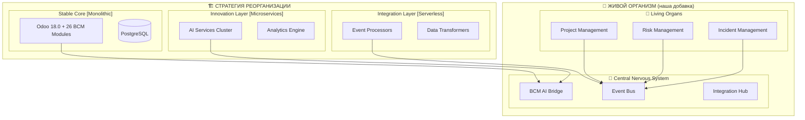

# 🎯 Связь стратегии реорганизации с живым организмом

## 🧩 КАК ВСЁ СОЕДИНЯЕТСЯ

### **Hybrid Adaptive Architecture ИДЕАЛЬНО подходит для живого организма!**



## 🎯 **PERFECT MATCH!**

### **Из стратегии реорганизации:**
```yaml
# Tier 2: Core Services
odoo:
  type: business
  startup_priority: 3
  depends_on: [postgres, redis]

# Tier 4: Business Services
ai-orchestrator:
  type: ai
  startup_priority: 5
  depends_on: [kong-gateway]
```

### **Наша архитектура организма:**
```python
# Точно то же самое!
class BCMAIBridge(models.Model):
    _name = 'bcm.ai.bridge'
    # Подключается к ai-orchestrator:5 из стратегии!

class BCMEventBus(models.Model):
    _name = 'bcm.event.bus'
    # Использует kong-gateway из стратегии!
```

## 🚀 **ПЛАН ОБЪЕДИНЕНИЯ**

### **PHASE 1: Реализовать стратегию реорганизации**
```bash
# Создать unified docker-compose (из стратегии)
cp UNIFIED_ARCHITECTURE_AND_DEPLOYMENT.md/docker-compose.unified.yml ./

# Consolidate services (92 → 45)
# - AI services: ai-orchestrator, bcm-ai-engine
# - Document services: unified-document-service
# - Frontend: bcm-portal, bcm-admin
```

### **PHASE 2: Внедрить живой организм**
```python
# В Odoo Tier 2: Core Services добавить наши модули:
- bcm_ai_bridge       # Bridge к ai-orchestrator из стратегии
- bcm_event_bus       # Event система для 26 модулей
- bcm_integration_hub # Workflow orchestration
```

### **PHASE 3: Соединить с существующими сервисами**
```yaml
# AI Bridge подключается к консолидированным AI сервисам:
ai_endpoints:
  ai-orchestrator: "http://ai-orchestrator:8000"    # Из стратегии
  bcm-ai-engine: "http://bcm-ai-engine:8082"        # Из стратегии
  analytics-ai: "http://analytics-ai:8085"          # Из стратегии

# Event Bus подключается к Integration Layer:
integration_endpoints:
  event_processors: "http://func1:8001"  # Из стратегии
  data_transformers: "http://func2:8002" # Из стратегии
```

## 🎖️ **РЕЗУЛЬТАТ ОБЪЕДИНЕНИЯ**

### **Что получим:**
```
🏗️ HYBRID ADAPTIVE ARCHITECTURE (стратегия)
├── Stable Core: Odoo + 26 BCM модулей ✅
├── Innovation Layer: 5 консолидированных AI ✅
├── Integration Layer: Event processors ✅
└── Orchestration: Kong + Kubernetes ✅

🧬 + LIVING ORGANISM (наша надстройка)
├── AI Bridge: подключен к Innovation Layer ✅
├── Event Bus: использует Integration Layer ✅
├── 26 Living Organs: работают в Stable Core ✅
└── Workflow Chains: оркестрируются через Kong ✅
```

## 📋 **КОНКРЕТНЫЙ ПЛАН ВЫПОЛНЕНИЯ**

### **1️⃣ Развернуть стратегию реорганизации (1 неделя)**
```bash
# Из UNIFIED_ARCHITECTURE_AND_DEPLOYMENT.md:
./platform-control.sh start

# Получим:
# - Odoo на порту 8069 (Stable Core)
# - ai-orchestrator на 8000 (Innovation Layer)
# - kong-gateway на 8000 (Orchestration)
# - 5 консолидированных AI сервисов
```

### **2️⃣ Установить наши BCM модули (2 дня)**
```bash
# В Odoo добавить наши модули:
cp -r bcm_ai_bridge/ /platform/core/odoo/addons/
cp -r bcm_project_management/ /platform/core/odoo/addons/

# Рестарт Odoo для загрузки модулей
./platform-control.sh restart odoo
```

### **3️⃣ Настроить интеграции (1 день)**
```python
# В bcm_ai_bridge настроить endpoints:
ai_services = {
    'orchestrator': 'http://ai-orchestrator:8000',
    'bcm_engine': 'http://bcm-ai-engine:8082',
    'analytics': 'http://analytics-ai:8085',
}

# В Event Bus настроить Integration Layer:
integration_endpoints = {
    'event_processor': 'http://func1:8001',
    'data_transformer': 'http://func2:8002',
}
```

### **4️⃣ Превратить остальные модули в органы (1 неделя)**
```bash
# Для каждого из 25 оставшихся модулей добавить:
# - Event Handler (react to events)
# - Integration Hooks (publish events)
# - Workflow methods (participate in chains)
```

## 🏆 **ИТОГОВЫЙ РЕЗУЛЬТАТ**

### **Получим единую платформу:**
- ✅ **Стратегия реорганизации** - 92→45 сервисов, unified deployment
- ✅ **Living Organism** - 26 модулей общаются как единый организм
- ✅ **Hybrid Architecture** - стабильное ядро + инновационные микросервисы
- ✅ **Event-Driven** - real-time реакции между всеми компонентами
- ✅ **AI Integration** - множественные AI через единый Bridge
- ✅ **Legal Compliance** - Odoo LGPL + наши проприетарные расширения

### **Архитектурные принципы СОБЛЮДЕНЫ:**
1. **Stable Core** ✅ - BCM модули в Odoo (монолитное ядро)
2. **Innovation at the Edge** ✅ - AI сервисы как микросервисы
3. **Smart Routing** ✅ - Event Bus + Integration Hub
4. **Progressive Enhancement** ✅ - поэтапное превращение модулей в органы

---

## 🎯 **ГЛАВНЫЙ ВЫВОД**

**Стратегия реорганизации + Живой организм = ИДЕАЛЬНОЕ СОЧЕТАНИЕ!**

**Стратегия дает нам** инфраструктуру и архитектуру
**Организм дает нам** интеллект и автоматизацию

**Вместе они создают платформу будущего! 🚀**

---

### **Следующие шаги:**
1. **Развернуть unified architecture** из стратегии
2. **Установить наши BCM модули** в Odoo
3. **Настроить интеграции** с консолидированными сервисами
4. **Превратить все модули в живые органы**

**Готов начать с любого из этапов! 💪**