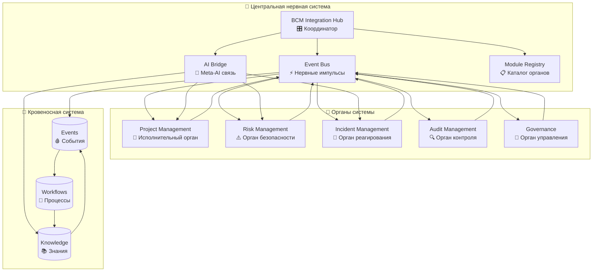

# 🧬 BCM Organism Architecture - От модулей к единому организму

## 🎯 Концепция превращения

Вы спрашивали: **"как он с ругими конектиться как из модуля превратиться в 'орган'"**

Вот полная архитектура превращения изолированных модулей в единый интеллектуальный организм:

## 🧠 Архитектура "Живого организма"



## 🔧 Механизм превращения

### 1. **Event-Driven Нервная система**

```python
# ❌ ДО: Изолированный модуль
def create_project(self, vals):
    project = super().create(vals)
    return project  # Никто не знает о создании проекта

# ✅ ПОСЛЕ: Орган организма
def create(self, vals):
    project = super().create(vals)

    # 🚨 ПУБЛИКУЕМ СОБЫТИЕ - организм узнает о новом проекте
    if project.bcm_type:
        project._publish_integration_event('project_created', {
            'project_id': project.id,
            'bcm_type': project.bcm_type,
            'criticality_level': project.criticality_level,
        })

    return project
```

### 2. **Реактивные хуки - органы реагируют друг на друга**

```python
# Project Management АВТОМАТИЧЕСКИ реагирует на события других органов:

@api.model
def handle_event(self, event_type, event_data, source_module):

    # 🔥 Risk обнаружил критический риск → Project создает проект митигации
    if event_type == 'risk_identified' and event_data['level'] == 'critical':
        return self._create_mitigation_project(event_data)

    # 🚨 Incident произошел → Project создает план восстановления
    elif event_type == 'incident_created' and event_data['severity'] == 'high':
        return self._create_recovery_project(event_data)

    # 🔍 Audit нашел нарушение → Project создает корректирующие действия
    elif event_type == 'audit_finding_created':
        return self._create_corrective_action_project(event_data)
```

### 3. **Интеллектуальная координация через Hub**

```python
# 🧠 Integration Hub координирует реакции всего организма

def coordinate_intelligent_response(self, trigger_event, context):
    """
    Одно событие активирует ВЕСЬ организм:
    Project становится критичным → Hub координирует реакцию ВСЕХ органов
    """

    coordination_strategies = {
        'critical_project_health': {
            'primary_responders': ['bcm_incident_management'],    # 🚨 Первичный отклик
            'secondary_responders': ['bcm_risk_management'],      # ⚠️ Вторичная поддержка
            'information_recipients': ['bcm_audit', 'bcm_governance'], # 📢 Информирование
        }
    }

    # Все органы получают команды одновременно!
    for module in primary_responders:
        self._coordinate_primary_response(module, trigger_event, context)
```

## 🌊 Workflow Chain Reactions - Цепные реакции

### Пример: "Risk → Project → Incident → Audit" Chain

```python
# 1️⃣ Risk Management обнаружил критический риск
risk_event = event_bus.publish_event('risk_identified', {
    'risk_level': 'critical',
    'category': 'technical',
    'description': 'Critical infrastructure vulnerability'
})

# 2️⃣ Project Management АВТОМАТИЧЕСКИ создает проект митигации
def _handle_risk_identified(self, event_data, source_module):
    project = self.env['project.project'].create({
        'name': f"Risk Mitigation: {event_data['description']}",
        'bcm_type': 'improvement',
        'criticality_level': 'high',
        'source_risk_id': event_data['risk_id'],
    })

    # 🔄 ПУБЛИКУЕМ НОВОЕ СОБЫТИЕ - цепная реакция продолжается
    self._publish_integration_event('project_created', {...})

# 3️⃣ Если проект становится критичным → Incident Management активируется
def _on_health_status_changed(self, old_health_status):
    if self.health_status == 'critical':
        self._trigger_critical_health_response()  # Активирует весь организм!

# 4️⃣ Integration Hub координирует отклик всех органов
def coordinate_intelligent_response(self, 'critical_project_health', context):
    # Incident Management создает инцидент
    # Risk Management обновляет риски
    # Audit получает уведомление для проверки
    # Governance получает эскалацию
```

## 🧬 Анатомия "Живого модуля"

### Стандартный Odoo модуль (мертвый):
```python
class DeadModule(models.Model):
    def create(self, vals):
        return super().create(vals)  # Создает и забывает

    def some_action(self):
        self.do_something()  # Делает что-то в изоляции
        return True  # Никого не уведомляет
```

### BCM "Живой орган":
```python
class LivingOrgan(models.Model):

    # 🧬 1. РОЖДЕНИЕ - уведомляет организм
    def create(self, vals):
        record = super().create(vals)
        self._publish_integration_event('entity_created', {...})
        return record

    # 💓 2. ЖИЗНЕДЕЯТЕЛЬНОСТЬ - реагирует на окружение
    def write(self, vals):
        old_state = self.important_field
        result = super().write(vals)
        if self.important_field != old_state:
            self._on_state_changed(old_state)  # Организм узнает об изменении
        return result

    # 🔄 3. РЕАКЦИИ - обрабатывает сигналы от других органов
    @api.model
    def handle_event(self, event_type, event_data, source_module):
        if event_type in self.supported_events:
            return self._react_to_event(event_type, event_data)

    # 🧠 4. ИНТЕЛЛЕКТ - использует общую нервную систему
    def make_intelligent_decision(self, context):
        # Запрашивает у Meta-AI через Bridge
        ai_advice = self.env['bcm.ai.bridge'].request_analysis('decision_type', context)
        return self._apply_ai_decision(ai_advice)

    # 🌊 5. WORKFLOW УЧАСТИЕ - выполняет роль в общих процессах
    def execute_workflow_step(self, workflow_id, step_action, step_data):
        return self._workflow_handlers[step_action](workflow_id, step_data)
```

## 🎛️ Control Panel - панель управления организмом

Integration Hub предоставляет единую точку управления:

```python
# 🎯 Оркестрация комплексных workflow
hub.orchestrate_workflow('comprehensive_risk_management', initial_data, 'bcm_risk_management')

# 🧠 Интеллектуальная координация при критичных событиях
hub.coordinate_intelligent_response('critical_project_health', context)

# 📊 Мониторинг здоровья всего организма
health_report = hub.get_integration_health_dashboard()
```

## 🔗 Реальные примеры взаимодействия

### Сценарий 1: "Обнаружен критический риск"
```
1️⃣ Risk Management: "Обнаружен критический риск в ИТ-инфраструктуре"
   ↓ (публикует событие 'risk_identified')

2️⃣ Project Management: "Создаю проект митигации риска"
   ↓ (публикует событие 'project_created')

3️⃣ Incident Management: "Подготавливаю план реагирования на случай реализации риска"
   ↓ (публикует событие 'response_plan_prepared')

4️⃣ Audit: "Планирую проверку мер по митигации риска"
   ↓ (публикует событие 'audit_scheduled')

5️⃣ Governance: "Уведомляю руководство о критическом риске"
```

### Сценарий 2: "Проект восстановления стал критичным"
```
1️⃣ Project Management: health_status → 'critical'
   ↓ (публикует 'project_health_changed')

2️⃣ Integration Hub: "Координирую критический отклик всего организма"
   ↓ (запускает coordinate_intelligent_response)

3️⃣ Incident Management: "Создаю инцидент - проект восстановления под угрозой!"
4️⃣ Risk Management: "Повышаю уровень связанных рисков"
5️⃣ Governance: "Эскалирую на executive level"
6️⃣ Audit: "Фиксирую для compliance отчета"

ВСЕ ОДНОВРЕМЕННО! 🚀
```

## 🌟 Результат трансформации

### ❌ Было (изолированные модули):
- Project Management живет сам по себе
- Risk Management не знает о проектах митигации
- Incident Management создает планы в вакууме
- Audit не видит общей картины
- Governance получает разрозненную информацию

### ✅ Стало (единый организм):
- **Один риск** → автоматически создает проект митигации + план реагирования + аудиторскую проверку
- **Один критичный проект** → мгновенно активирует весь организм
- **Один инцидент** → координированный отклик всех органов
- **Одно решение Meta-AI** → влияет на все модули одновременно
- **Одно событие** → цепная реакция по всему организму

## 🚀 Ключевые технологии превращения

1. **Event Bus** - нервная система (сообщения между органами)
2. **Integration Hub** - мозг (координация и оркестрация)
3. **AI Bridge** - интеллект (обучение и советы)
4. **Module Registry** - память (кто где и что умеет)
5. **Workflow Chains** - рефлексы (автоматические реакции)
6. **Event Handlers** - рецепторы (прием сигналов)
7. **Integration Hooks** - синапсы (передача сигналов)

## 📋 Результат для бизнеса

**BCM Project Management** теперь не просто модуль управления проектами, а:

🎯 **Исполнительный орган BCM организма** который:
- Автоматически создает проекты в ответ на риски, инциденты, аудиторские находки
- Координирует свои действия с другими органами
- Учится на опыте всего организма через Meta-AI
- Мгновенно активирует другие органы при критических ситуациях
- Участвует в комплексных workflow между модулями

Это и есть превращение **"модуля в орган"** - от изолированного компонента к интегрированной части единого интеллектуального организма! 🧬✨