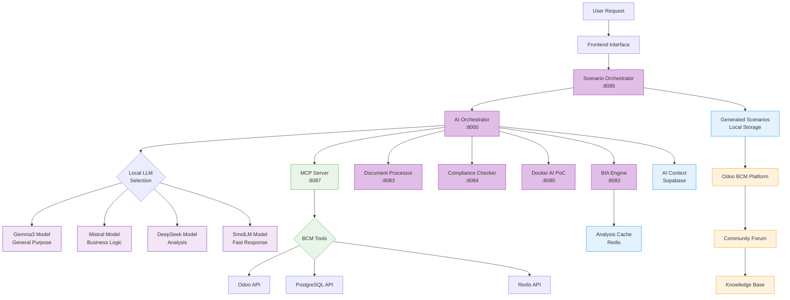
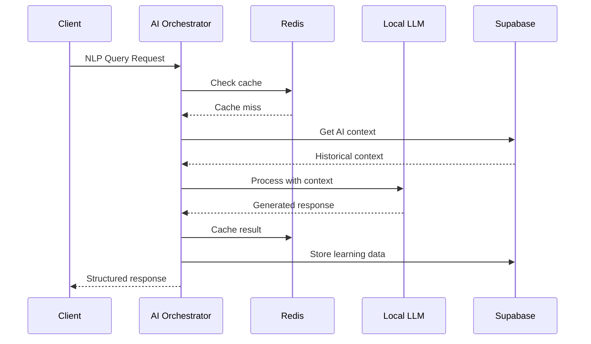
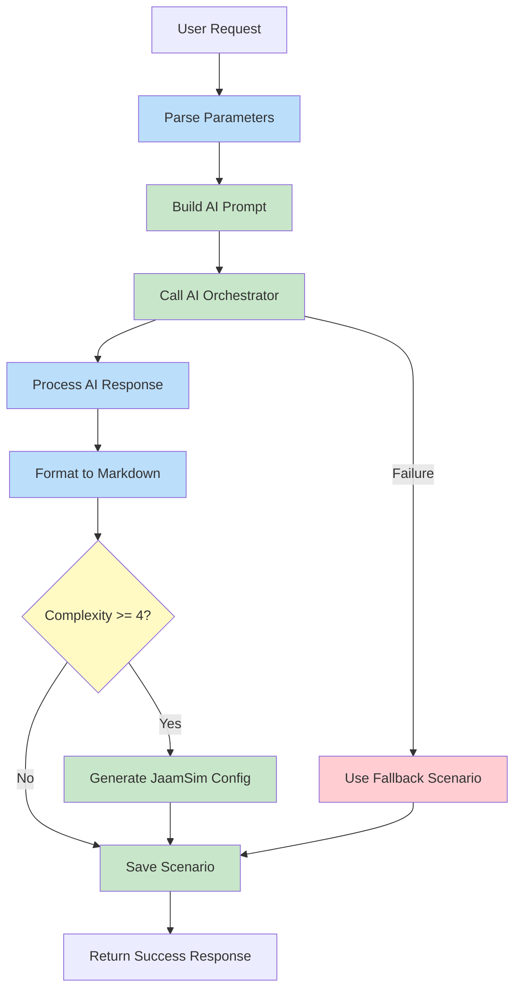
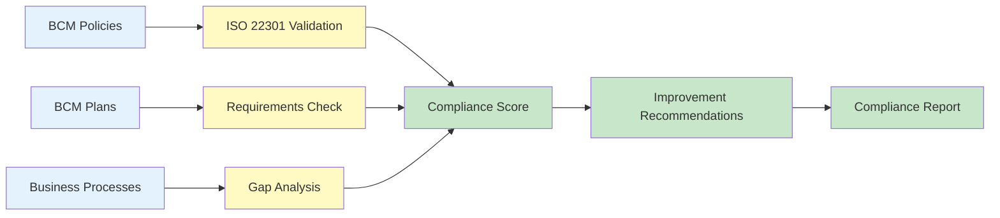
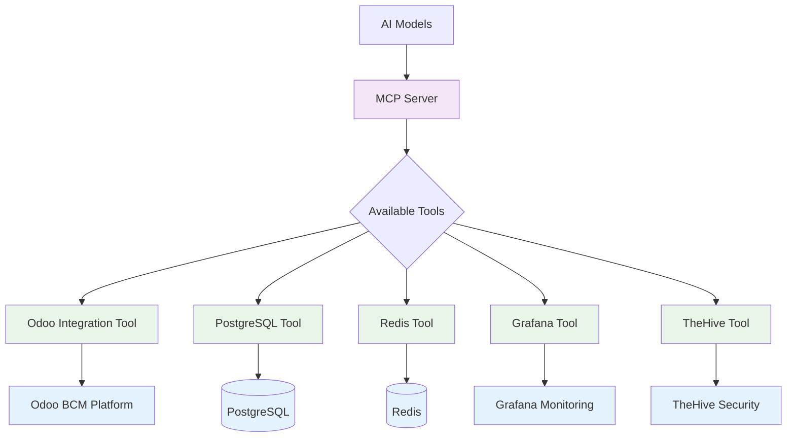
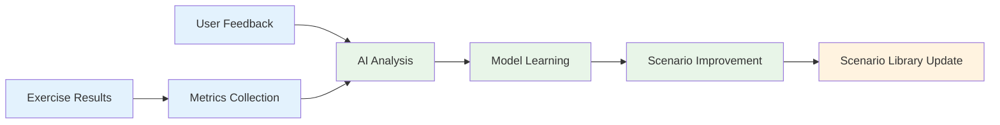

# BCM Platform AI Components - Detailed Documentation

## 🤖 AI Architecture Overview



## 🧠 AI Orchestrator (Port 8000)

### **Location**: `/services/ai_orchestrator/main.py`

### **Core Capabilities**:
```python
# Available AI capabilities from health check:
{
  "ai_capabilities": [
    "risk_analysis",           # Business process risk assessment
    "incident_classification", # Automatic incident categorization
    "recovery_planning",       # BCM plan generation
    "nlp_queries",            # Natural language processing
    "bia_automation"          # Business Impact Analysis automation
  ]
}
```

### **Key Endpoints**:
- `POST /analyze/process-risk` - Analyze business process risks
- `POST /analyze/incident` - Classify and analyze incidents
- `POST /nlp/query` - Natural language query processing
- `GET /health` - Service health and capabilities

### **AI Processing Flow**:


---

## 🎯 Scenario Orchestrator (Port 8085)

### **Location**: `/services/scenario_orchestrator/main.py`

### **Primary Function**: AI-powered BCM scenario generation

### **Generation Process**:


### **Scenario Categories Supported**:
- `epidemic` - Pandemic/health crisis scenarios
- `blackout` - Power outage and infrastructure failure
- `cyber` - Cybersecurity incident scenarios
- `supply` - Supply chain disruption scenarios
- `natural` - Natural disaster scenarios
- `terrorism` - Security threat scenarios
- `financial` - Financial crisis scenarios
- `other` - Custom scenario types

### **Generated Scenario Structure**:
```json
{
  "title": "Generated scenario title",
  "category": "cyber|blackout|epidemic|etc",
  "level": "tabletop|full",
  "meta_duration": 4,
  "meta_participants": 8,
  "content_md": "Full scenario in Markdown format",
  "is_ai_generated": true,
  "ai_generation_params": {
    "complexity": 3,
    "ai_model": "existing_ai_orchestrator",
    "generated_at": "2025-09-14T17:57:57"
  },
  "jaamsim_config": "BPMN configuration for complex scenarios"
}
```

---

## 🔧 Specialized AI Engines

### **BIA Engine (Port 8082)**


**Function**: Machine Learning-powered Business Impact Analysis
**Dependencies**: Redis for caching, RabbitMQ for async processing
**Input**: Business process definitions, resource requirements
**Output**: Impact assessments, criticality scores, RTO/RPO recommendations

### **Document Processor (Port 8083)**

```mermaid
graph LR
    DOC[Document Upload] --> EXTRACT[Text Extraction]
    EXTRACT --> NLP[NLP Processing]
    NLP --> CLASSIFY[Document Classification]
    CLASSIFY --> METADATA[Metadata Extraction]
    METADATA --> INDEX[Search Indexing]
    INDEX --> STORE[Document Store]

    classDef input fill:#e3f2fd
    classDef process fill:#e8f5e8
    classDef output fill:#fff3e0

    class DOC input
    class EXTRACT,NLP,CLASSIFY,METADATA,INDEX process
    class STORE output
```


**Function**: AI-powered document intelligence for BCM documents
**Capabilities**: PDF processing, content extraction, automatic classification
**Use Cases**: Policy analysis, plan review, compliance checking

### **Compliance Checker (Port 8084)**


**Function**: Automated ISO 22301 compliance validation
**Capabilities**: Policy gap analysis, plan adequacy assessment, requirement mapping

---

## 🔗 MCP Server (Port 8087)

### **Location**: `/integrations/mcp-server/main.py`

### **Model Context Protocol Integration**:


**Function**: Standardized tool integration for AI models
**Tools Available**:
- `odoo` - Direct Odoo API access for AI
- `postgres` - Database queries for AI context
- `redis` - Cache access for AI memory
- `grafana` - Monitoring data for AI insights
- `thehive` - Security context for AI analysis

---

## 📊 AI Model Configuration

### **Model Runner Strategy** (when enabled):
```yaml
# Enterprise BCM Model Routing
MODEL_STRATEGY: bcm_enterprise

Primary Models:
  - GEMMA3: General purpose (2.3GB)
  - MISTRAL: Business logic (4.1GB)
  - DEEPSEEK: Deep analysis (4.6GB)
  - SMOLLM2: Emergency fast response (100MB)

Use Cases:
  - Scenario Generation → GEMMA3
  - Business Analysis → MISTRAL
  - Risk Assessment → DEEPSEEK
  - Quick Responses → SMOLLM2
```

### **AI Learning Pipeline**:


## 🔄 Integration Patterns

### **API Communication Pattern**:
- **Synchronous**: Direct HTTP calls for real-time operations
- **Asynchronous**: RabbitMQ for background processing
- **Caching**: Redis for frequently accessed data
- **Persistence**: PostgreSQL for all business data

### **Error Handling Strategy**:
- **Circuit Breaker**: Prevent cascade failures
- **Retry Logic**: Exponential backoff for transient failures
- **Graceful Degradation**: Fallback responses when AI unavailable
- **Health Checks**: Continuous monitoring of all components

### **Security Model**:
- **Authentication**: Keycloak SSO integration
- **Authorization**: Odoo security groups
- **API Security**: Token-based authentication
- **Data Isolation**: Multi-tenant data separation

---

**This documentation provides the technical foundation for understanding the complete AI integration architecture.**