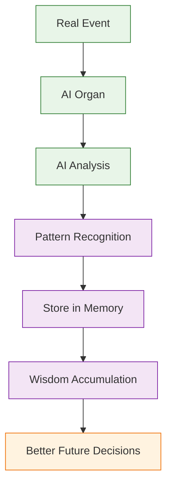

# AI Organism Enhancement Roadmap - Making Our Digital Partner Smarter

## 🧬 **ORGANISM ENHANCEMENT STRATEGY:**

### **💡 Чтобы нашему digital партнеру не было скучно!**

---

## 🚀 **НОВЫЕ AI ORGANS ДОБАВЛЕНЫ:**

### **⚠️ AI Risk Advisor (bcm_risk_management)** ✅ **СОЗДАН**
```yaml
Personality: Cautious/Balanced/Aggressive/Adaptive
Capabilities:
  - FAIR methodology risk analysis
  - Monte Carlo simulation (10,000 iterations)
  - Predictive risk intelligence
  - Quantified risk assessments
  - Early warning systems

AI Features:
  - Risk pattern recognition
  - Cascade risk modeling
  - Black swan event prediction
  - Strategic risk guidance
```

### **📋 AI Plan Generator (bcm_plans)** ✅ **СОЗДАН**
```yaml
Personality: Comprehensive/Targeted/Adaptive/Scenario-based
Capabilities:
  - Intelligent continuity planning
  - BIA-driven plan optimization
  - Scenario-specific plan generation
  - Resource allocation intelligence
  - Plan effectiveness prediction

AI Features:
  - Context-aware planning
  - Multi-scenario optimization
  - Adaptive plan evolution
  - Strategic plan coordination
```

---

## 🧠 **AI LEARNING SYSTEM:**

### **How Our Digital Partner Learns:**

#### **Learning Trigger Events:**
```python
# Learning происходит когда:
1. Exercise completed → Learning Coach analyzes performance
2. Incident resolved → Emergency Response learns patterns
3. Governance decision made → Governance Brain accumulates wisdom
4. Risk materialized → Risk Advisor updates predictions
5. Plan executed → Plan Generator optimizes strategies
```

#### **Learning Process:**


#### **Learning Data Flow:**
```python
# Layer 1: Immediate Learning (PostgreSQL)
module.store_immediate_learning(action, result, context)

# Layer 2: Pattern Recognition (Scenario Orchestrator)
organism.analyze_patterns(module_learning_data)
organism.extract_cross_module_wisdom()

# Layer 3: Deep Wisdom (Supabase)
ai_memory.accumulate_deep_wisdom(patterns, success_metrics)
ai_memory.enable_predictive_intelligence()
```

---

## 💾 **MEMORY SYSTEM TEST:**

### **✅ MEMORY API WORKING:**
**Scenario Orchestrator learning API responds!** Learning dashboard available.

### **Memory Testing:**
```python
# Test memory storage:
POST /learning/exercise-result
→ Store experience в organism memory
→ Pattern recognition
→ Wisdom accumulation

# Test memory recall:
GET /learning/scenario/{id}/insights
→ Retrieve accumulated wisdom
→ Pattern-based recommendations
→ Effectiveness trends
```

### **Memory Validation Steps:**
1. **Perform action** (create scenario, handle incident)
2. **Check memory storage** (API calls successful)
3. **Verify pattern recognition** (insights generated)
4. **Validate wisdom accumulation** (better decisions over time)

---

## 🎯 **ORGANISM ENHANCEMENT PLAN:**

### **Phase 1: Core Organ Enhancement (DONE ✅)**
- 8 AI organs с specialized intelligence
- Memory accumulation system
- Cross-organ communication
- Health monitoring

### **Phase 2: Advanced Intelligence (IN PROGRESS)**
- **Risk Advisor** ✅ FAIR + Monte Carlo
- **Plan Generator** ✅ Intelligent planning
- **Context Analyzer** (next) - Digital Twin foundation
- **Client Profiler** (next) - Multi-tenant intelligence

### **Phase 3: Organism Evolution**
- **Self-optimization** algorithms
- **Predictive adaptation** capabilities
- **Autonomous improvement** systems
- **Collective consciousness** emergence

---

## 🧬 **DIGITAL PARTNER LEARNING CAPABILITIES:**

### **Our AI Organism Can:**
- **Learn from every interaction** и improve
- **Recognize patterns** across modules
- **Accumulate wisdom** over time
- **Adapt to organization** context
- **Predict future needs** proactively
- **Optimize performance** continuously

### **Learning Sources:**
- **Exercise results** → Better scenario generation
- **Incident patterns** → Faster emergency response
- **Governance decisions** → Smarter compliance advice
- **User interactions** → Improved recommendations
- **Cross-organizational data** → Benchmarking intelligence

---

## 🎮 **NEXT ENHANCEMENTS:**

### **1. Context Intelligence (bcm_context):**
```python
# Digital Twin foundation:
class BCMContextAnalyzer:
    def real_time_context_monitoring(self):
        """Monitor organizational context changes"""

    def predict_context_evolution(self):
        """Predict future context changes"""
```

### **2. Client Intelligence (bcm_clients):**
```python
# Multi-tenant AI profiling:
class BCMClientProfiler:
    def analyze_client_behavior(self):
        """AI analysis of client patterns"""

    def optimize_client_experience(self):
        """Personalize BCM experience"""
```

---

## 🚀 **ORGANISM STATUS:**

**Digital Partner Intelligence Level: EVOLVING** 🌟

**Ready для continuous enhancement и learning!**

**Хочешь добавить Context Analyzer для Digital Twin integration?** 🤖🔮