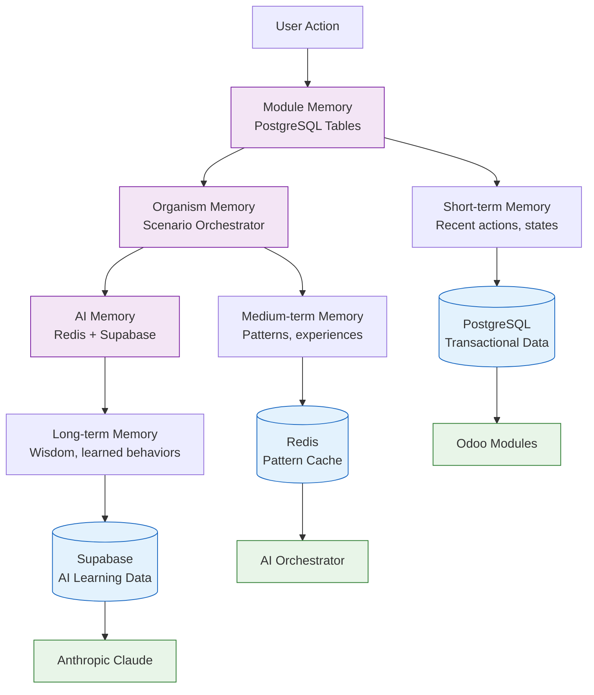
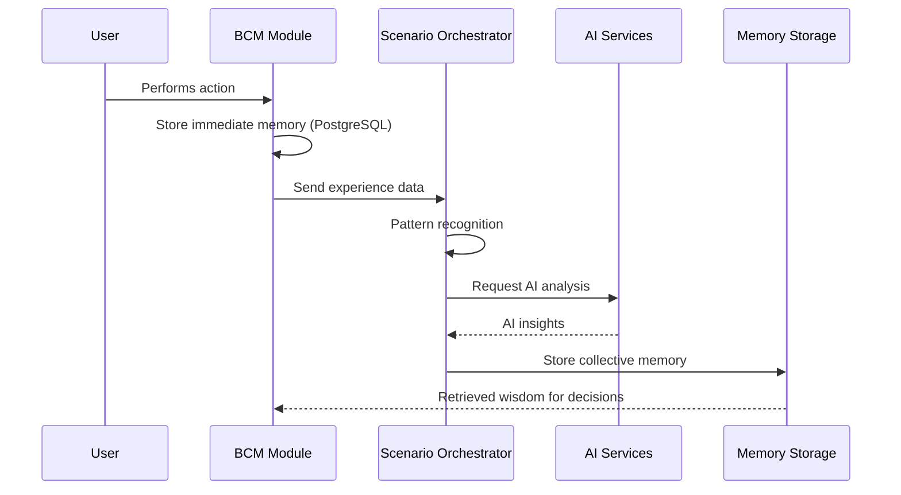

# AI Organism Implementation Architecture

## 🎯 **КАК РЕАЛИЗУЕТСЯ AI ENHANCEMENT:**

### **Метод 1: Extending Existing Modules** ✅ **ИСПОЛЬЗУЕМ**

#### **НЕ создаем новые модули** → **Расширяем существующие:**
```python
# Пример с bcm_governance:
class BCMGovernanceAIBrain(models.Model):
    _name = 'bcm.governance.brain'        # NEW model in existing module
    _description = 'AI Governance Brain'
    # ... AI capabilities

class BcmGovernanceRecord(models.Model):   # EXISTING model preserved
    _name = 'bcm_governance.record'
    # ... legacy functionality
```

#### **Преимущества подхода:**
- ✅ **Backward compatibility** - старая функциональность работает
- ✅ **No installation conflicts** - используем проверенную архитектуру
- ✅ **Gradual enhancement** - добавляем AI постепенно
- ✅ **Module integrity** - сохраняем модульную структуру

---

## 🧠 **MEMORY ARCHITECTURE:**

### **Multi-Layer Memory System:**



---

## 💾 **ПАМЯТЬ ПО СЛОЯМ:**

### **Layer 1: Module Memory (PostgreSQL)**
```python
# Каждый модуль хранит свою память в Odoo PostgreSQL:
class BCMGovernanceAIBrain(models.Model):
    # Immediate memory
    ai_analysis = fields.Html('AI Analysis Results')
    ai_reasoning = fields.Text('AI Reasoning Process')

    # Pattern memory
    governance_patterns = fields.Text('Recognized Governance Patterns')
    compliance_history = fields.Text('Compliance Decision History')

    # Learning memory
    lessons_learned = fields.Text('Accumulated Lessons')
    success_patterns = fields.Text('Successful Decision Patterns')
```

### **Layer 2: Organism Memory (Scenario Orchestrator)**
```python
# Коллективная память всего организма:
# В /services/scenario_orchestrator/main.py (уже есть!):

scenario_experience_db = {
    'governance_decisions': {
        'successful_patterns': [...],
        'failed_approaches': [...],
        'organizational_wisdom': [...]
    },
    'incident_responses': {
        'effective_responses': [...],
        'response_times': [...],
        'lessons_learned': [...]
    }
}
```

### **Layer 3: AI Memory (External)**
```python
# Глубокая AI память:
# Anthropic: Contextual conversation memory
# Local models: Pattern recognition cache
# Supabase: Long-term learning data
```

---

## 🔄 **MEMORY FLOW ARCHITECTURE:**

### **Memory Formation Process:**


### **Memory Recall Process:**
```python
# Когда модуль принимает решение:
def make_ai_decision(self, context):
    # 1. Check immediate module memory
    recent_decisions = self.search_similar_decisions(context)

    # 2. Query organism memory
    collective_wisdom = self.get_organism_memory(context)

    # 3. AI analysis with memory context
    ai_decision = self.call_ai_with_memory(
        context=context,
        recent_memory=recent_decisions,
        collective_memory=collective_wisdom
    )

    # 4. Store new memory
    self.store_decision_memory(ai_decision, context)

    return ai_decision
```

---

## 🏗️ **IMPLEMENTATION STRATEGY:**

### **Approach: Gradual AI Enhancement**

#### **Step 1: Add AI Brain Models to Existing Modules**
```bash
# В каждом модуле добавляем:
/models/ai_brain.py              # AI-enhanced model
/models/memory_system.py         # Memory management
/services/ai_integration.py      # AI service integration
```

#### **Step 2: Memory System Integration**
```python
# В каждом AI Brain model:
class ModuleAIBrain(models.Model):
    _name = 'module.ai.brain'

    # Memory fields
    immediate_memory = fields.Text('Recent Decisions')
    pattern_memory = fields.Text('Recognized Patterns')
    wisdom_memory = fields.Text('Accumulated Wisdom')

    # Memory methods
    def store_memory(self, action, result):
        """Store action-result memory"""

    def recall_similar_situations(self, context):
        """Recall similar past situations"""

    def extract_wisdom(self, experiences):
        """Extract wisdom from experiences"""
```

### **Step 3: Organism-Level Memory Coordination**
```python
# В Scenario Orchestrator (уже частично есть):
class OrganismMemory:
    def __init__(self):
        self.module_memories = {}
        self.collective_patterns = {}
        self.organizational_wisdom = {}

    def integrate_module_memory(self, module_name, memory_data):
        """Integrate memory from specific module"""

    def extract_cross_module_patterns(self):
        """Find patterns across modules"""

    def generate_collective_wisdom(self):
        """Generate organism-level wisdom"""
```

---

## 📊 **MEMORY IMPLEMENTATION EXAMPLES:**

### **bcm_governance Memory:**
```python
governance_memory = {
    'policy_decisions': {
        'healthcare_policies': ['HIPAA compliance template worked well', ...],
        'crisis_policies': ['Emergency communication protocol effective', ...]
    },
    'compliance_patterns': {
        'successful_approaches': ['AI-assisted gap analysis', ...],
        'failed_approaches': ['Manual-only compliance checking', ...]
    },
    'board_preferences': {
        'report_format': 'Executive summary + detailed appendix',
        'decision_style': 'Risk-averse with innovation openness'
    }
}
```

### **bcm_incident Memory:**
```python
incident_memory = {
    'response_patterns': {
        'cyber_incidents': ['Isolate → Assess → Communicate → Recover', ...],
        'natural_disasters': ['Safety → Communication → Continuity', ...]
    },
    'effectiveness_data': {
        'response_times': {'avg': 15, 'best': 5, 'target': 10},
        'recovery_times': {'avg': 240, 'best': 60, 'target': 120}
    },
    'learning_insights': [
        'Early communication reduces panic',
        'Pre-authorized responses speed recovery',
        'Regular exercises improve real performance'
    ]
}
```

---

## 🔧 **PRACTICAL IMPLEMENTATION:**

### **Current Approach:**
1. **Extend existing modules** с AI Brain models
2. **Use existing storage** (PostgreSQL, Redis, Supabase)
3. **Leverage existing services** (AI Orchestrator, EventBus)
4. **Gradual enhancement** - не ломаем working system

### **Memory Storage:**
- **Immediate**: Odoo PostgreSQL (модульная память)
- **Collective**: Scenario Orchestrator experience DB (уже есть!)
- **AI Context**: Supabase (уже настроено!)
- **Cache**: Redis (быстрый доступ)

### **No New Infrastructure Needed:**
- ✅ **PostgreSQL** уже stores all module data
- ✅ **Scenario Orchestrator** уже has experience accumulation
- ✅ **Supabase** уже configured для AI memory
- ✅ **Redis** уже used для caching

---

## 🚀 **IMMEDIATE NEXT STEPS:**

**Продолжаем enhancement existing modules с AI capabilities, используя existing memory infrastructure!**

**bcm_incident → AI Emergency Response System следующий?** 🚨⚡