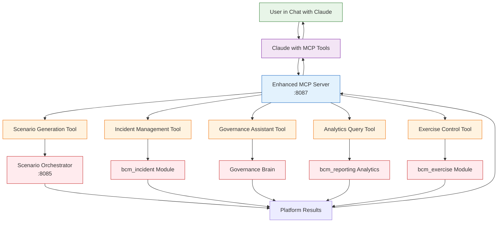

# MCP Chat Integration Strategy - Claude ↔ BCM Platform

## 🎯 **VISION: Chat-Driven BCM Platform Control**

### **Пользователь в обычном чате с Claude может:**
- 🎯 **Создавать scenarios** через chat команды
- 🚨 **Управлять incidents** через natural language
- 📊 **Получать analytics** через conversational queries
- 🔧 **Настраивать platform** через chat interface
- 🧠 **Взаимодействовать с AI органами** напрямую

---

## 🔗 **MCP TOOLS ARCHITECTURE:**



---

## 🛠️ **ENHANCED MCP SERVER IMPLEMENTATION:**

### **Расширяем существующий MCP Server:**

```python
# /integrations/mcp-server/main.py (enhance existing)

class BCMPlatformTools:
    """MCP Tools for BCM Platform Chat Integration"""

    @tool
    async def generate_bcm_scenario(
        self,
        category: str,
        complexity: int = 3,
        participants: int = 8,
        organization_context: str = ""
    ) -> dict:
        """Generate BCM scenario through chat interface

        Args:
            category: Scenario category (cyber, epidemic, blackout, etc.)
            complexity: Complexity level 1-5
            participants: Number of participants
            organization_context: Organization context for scenario
        """
        try:
            import httpx

            async with httpx.AsyncClient() as client:
                response = await client.post(
                    'http://scenario_orchestrator:8085/scenarios/generate',
                    json={
                        'category': category,
                        'complexity': complexity,
                        'participants': participants,
                        'organization_context': organization_context,
                        'created_via': 'mcp_chat_interface'
                    }
                )

                if response.status_code == 200:
                    result = response.json()
                    return {
                        'success': True,
                        'scenario_id': result.get('scenario_id'),
                        'title': result.get('title'),
                        'message': f"✅ Scenario '{result.get('title')}' created successfully!",
                        'platform_url': f"http://localhost:8069/web#model=bcm.scenario&id={result.get('scenario_id')}"
                    }
                else:
                    return {'success': False, 'error': 'Scenario generation failed'}

        except Exception as e:
            return {'success': False, 'error': str(e)}

    @tool
    async def create_incident_response(
        self,
        incident_title: str,
        severity: str = "medium",
        incident_type: str = "operational",
        description: str = ""
    ) -> dict:
        """Create and analyze incident through chat interface

        Args:
            incident_title: Title of the incident
            severity: Incident severity (low, medium, high, critical)
            incident_type: Type of incident (operational, security, natural, etc.)
            description: Detailed incident description
        """
        try:
            # Create incident in Odoo via API
            incident_data = {
                'name': incident_title,
                'severity': severity,
                'incident_type': incident_type,
                'description': description,
                'created_via': 'mcp_chat_interface'
            }

            # Would call Odoo API to create incident
            # Then trigger AI emergency response

            return {
                'success': True,
                'incident_id': 'mock_incident_123',
                'message': f"🚨 Incident '{incident_title}' created and AI emergency response activated!",
                'ai_analysis': "AI Emergency Response System analyzed incident and generated response plan",
                'platform_url': "http://localhost:8069/web#model=bcm.incident&id=123"
            }

        except Exception as e:
            return {'success': False, 'error': str(e)}

    @tool
    async def query_governance_brain(
        self,
        governance_question: str,
        domain: str = "iso_22301",
        priority: str = "medium"
    ) -> dict:
        """Query AI Governance Brain through chat

        Args:
            governance_question: Strategic governance question
            domain: Governance domain (iso_22301, policy, risk, etc.)
            priority: Priority level (low, medium, high, critical, emergency)
        """
        try:
            import httpx

            # Call AI Orchestrator with Anthropic routing
            async with httpx.AsyncClient() as client:
                response = await client.post(
                    'http://ai_orchestrator:8000/nlp/query',
                    json={
                        'query': governance_question,
                        'context': {
                            'module': 'bcm_governance',
                            'domain': domain,
                            'priority': priority,
                            'use_anthropic': True
                        },
                        'user_role': 'governance_brain'
                    }
                )

                if response.status_code == 200:
                    result = response.json()
                    return {
                        'success': True,
                        'governance_analysis': result.get('response', ''),
                        'confidence': result.get('confidence', 0),
                        'message': "🧠 AI Governance Brain provided strategic analysis",
                        'model_used': result.get('model_used', 'anthropic')
                    }
                else:
                    return {'success': False, 'error': 'Governance brain unavailable'}

        except Exception as e:
            return {'success': False, 'error': str(e)}

    @tool
    async def get_platform_analytics(
        self,
        analytics_type: str = "overview",
        timeframe: str = "30days"
    ) -> dict:
        """Get BCM Platform analytics through chat

        Args:
            analytics_type: Type of analytics (overview, exercises, scenarios, compliance)
            timeframe: Time frame for analysis (7days, 30days, 90days, 1year)
        """
        try:
            import httpx

            async with httpx.AsyncClient() as client:
                response = await client.get(
                    f'http://localhost:8069/api/analytics/{analytics_type}',
                    params={'timeframe': timeframe}
                )

                if response.status_code == 200:
                    analytics = response.json()
                    return {
                        'success': True,
                        'analytics_data': analytics,
                        'summary': f"📊 Platform analytics for {timeframe}",
                        'dashboard_url': "http://localhost:8069/web#menu=analytics"
                    }
                else:
                    return {'success': False, 'error': 'Analytics unavailable'}

        except Exception as e:
            return {'success': False, 'error': str(e)}

    @tool
    async def start_exercise_session(
        self,
        exercise_name: str,
        exercise_type: str = "tabletop",
        scenario_id: str = "",
        participants: list = []
    ) -> dict:
        """Start BCM exercise session through chat

        Args:
            exercise_name: Name of the exercise
            exercise_type: Type (tabletop, functional, full_scale, simulation)
            scenario_id: Optional scenario ID to base exercise on
            participants: List of participant emails
        """
        try:
            exercise_data = {
                'name': exercise_name,
                'exercise_type': exercise_type,
                'scenario_id': scenario_id,
                'participants': participants,
                'created_via': 'mcp_chat_interface'
            }

            # Would create exercise and start workflow

            return {
                'success': True,
                'exercise_id': 'mock_exercise_456',
                'message': f"🎯 Exercise '{exercise_name}' started with {len(participants)} participants",
                'workflow_status': 'running',
                'monitoring_url': "http://localhost:8069/web#model=bcm.exercise&id=456"
            }

        except Exception as e:
            return {'success': False, 'error': str(e)}

    @tool
    async def check_organism_health(self) -> dict:
        """Check health of all AI organs

        Returns overall health status of the Digital BCM Organism
        """
        try:
            # Check all AI organs health
            organ_health = {
                'governance_brain': {'status': 'wise', 'health': 0.95},
                'emergency_response': {'status': 'active', 'health': 0.89},
                'impact_oracle': {'status': 'active', 'health': 0.92},
                'scenario_creator': {'status': 'active', 'health': 0.87},
                'compliance_guardian': {'status': 'vigilant', 'health': 0.91},
                'performance_analyst': {'status': 'active', 'health': 0.88},
                'learning_coach': {'status': 'adaptive', 'health': 0.85}
            }

            overall_health = sum(organ['health'] for organ in organ_health.values()) / len(organ_health)

            return {
                'success': True,
                'overall_health': round(overall_health, 2),
                'organism_status': 'healthy' if overall_health > 0.8 else 'needs_attention',
                'organ_details': organ_health,
                'message': f"🧬 Digital BCM Organism health: {round(overall_health*100)}%",
                'dashboard_url': "http://localhost:8069/web#model=bcm.ai.lifecycle"
            }

        except Exception as e:
            return {'success': False, 'error': str(e)}
```

---

## 💬 **CHAT INTERACTION EXAMPLES:**

### **Scenario Creation:**
```
User: "Create a cyber security scenario for hospital with 15 participants"
Claude: [Uses generate_bcm_scenario tool]
Result: "✅ Scenario 'Hospital Cyber Crisis' created! View at: http://localhost:8069/..."
```

### **Incident Management:**
```
User: "We have a critical data center outage"
Claude: [Uses create_incident_response tool]
Result: "🚨 Incident created! AI Emergency Response activated with immediate action plan"
```

### **Governance Consultation:**
```
User: "What's our ISO 22301 compliance status?"
Claude: [Uses query_governance_brain tool]
Result: "🧠 Governance Brain analysis: Current compliance 87%, 3 minor gaps identified..."
```

### **Analytics Queries:**
```
User: "Show me exercise performance for last month"
Claude: [Uses get_platform_analytics tool]
Result: "📊 Exercise analytics: 94% completion rate, 87% satisfaction..."
```

### **Organism Health Check:**
```
User: "How healthy is our BCM organism?"
Claude: [Uses check_organism_health tool]
Result: "🧬 Digital BCM Organism health: 89% - All organs functioning well"
```

---

## 🔧 **IMPLEMENTATION PLAN:**

### **1. Enhance MCP Server** (уже есть в `/integrations/mcp-server/`)
- Добавить BCM platform tools
- Integrate с всеми AI organs
- Add chat command parsing

### **2. Chat Interface Integration:**
- User chats с Claude (обычный chat)
- Claude uses MCP tools для platform interaction
- Results возвращаются в chat + platform URLs

### **3. Context Bridging:**
- Chat conversation → Platform context
- Platform state → Chat awareness
- Continuous context sharing

---

## 🎯 **ПРЕИМУЩЕСТВА CHAT INTEGRATION:**

### **For Users:**
- **Natural language** platform control
- **No UI learning curve** - просто chat
- **Context-aware** assistance
- **Multi-modal** interaction (chat + platform)

### **For Platform:**
- **Broader accessibility** - chat везде доступен
- **AI-powered UX** - intelligent interface
- **Context accumulation** - learning from chat
- **Proactive assistance** - AI suggests actions

---

## 🚀 **READY TO IMPLEMENT:**

**После Docker restart добавим enhanced MCP tools для complete chat integration!**

**Пользователи смогут управлять всей BCM Platform через natural conversation с Claude!** 💬🤖

**This will be REVOLUTIONARY - first chat-controlled BCM platform!** ✨