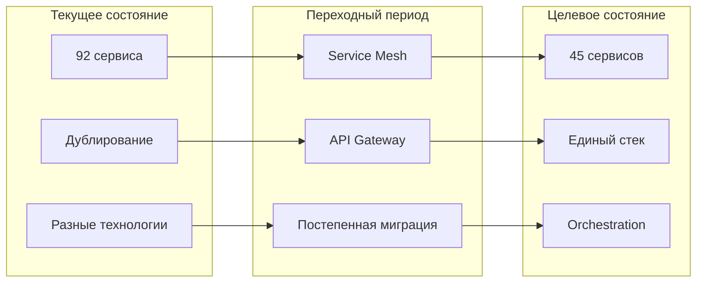
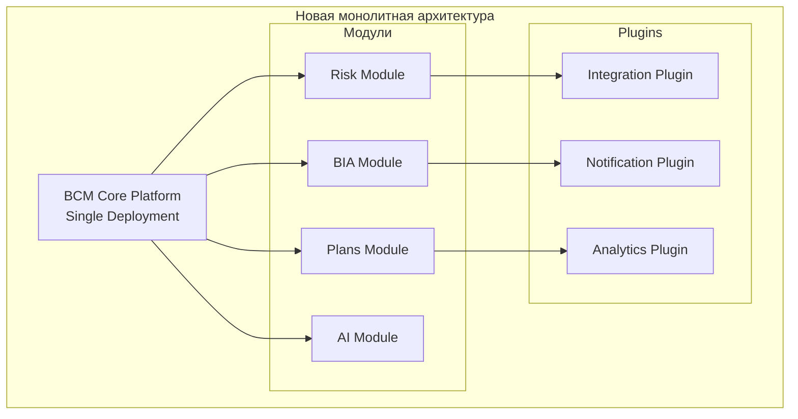
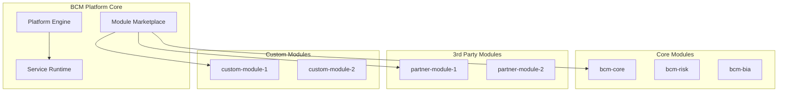
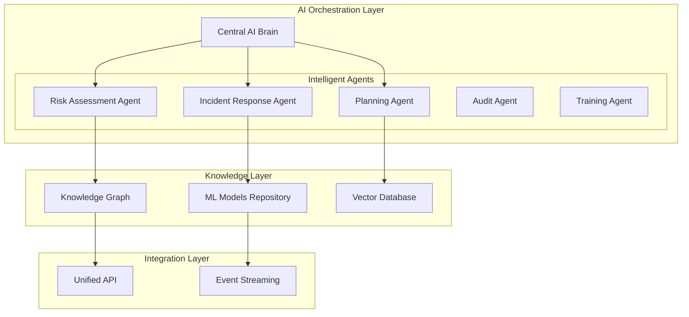
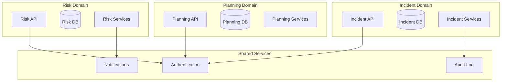
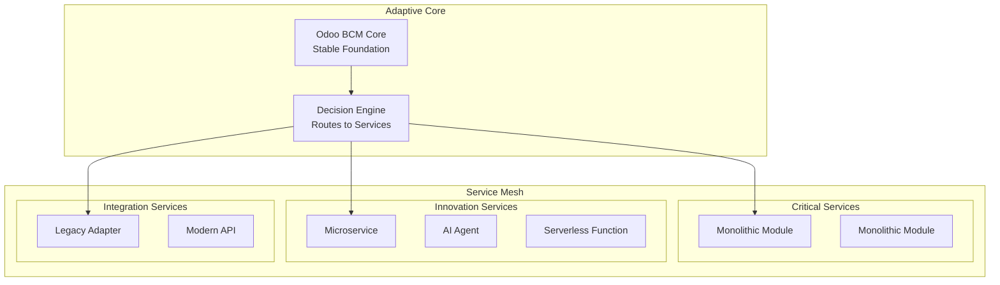

# 🎯 Сравнение архитектурных стратегий для BCM Platform

## 📊 Обзор текущей ситуации

**Проблемы:**
- 92+ разрозненных компонентов
- 30% дублирования функционала
- Нет единого технологического стандарта
- Сложность управления и высокие затраты на поддержку
- Отсутствие единой стратегии развития

## 🔄 Стратегия 1: ПОСТЕПЕННАЯ УНИФИКАЦИЯ (мой выбор)

### Концепция:
Эволюционный подход с поэтапной консолидацией сервисов без остановки production.



### Преимущества:
✅ Минимальные риски для production
✅ Возможность откатов на каждом этапе
✅ Постепенное обучение команды
✅ Распределение затрат во времени
✅ Сохранение работоспособности системы

### Недостатки:
❌ Долгий период миграции (12 месяцев)
❌ Необходимость поддержки двух версий
❌ Более высокая общая стоимость
❌ Риск "застрять" на полпути

### Timeline:
- Q1 2025: Подготовка и планирование
- Q2 2025: Core services (25% миграции)
- Q3 2025: AI services (50% миграции)
- Q4 2025: Frontend и финализация (100%)

---

## ⚡ Стратегия 2: РАДИКАЛЬНЫЙ РЕФАКТОРИНГ

### Концепция:
Полная переработка архитектуры "с нуля" с использованием современных практик.



### Архитектура:
```yaml
Единая платформа:
  - Монолитное ядро на Python/Django
  - Модульная архитектура с плагинами
  - Единая база данных PostgreSQL
  - Встроенный workflow engine
  - Native AI integration
```

### Преимущества:
✅ Чистая, современная архитектура
✅ Максимальная производительность
✅ Простота развертывания (один артефакт)
✅ Единый технологический стек
✅ Низкие операционные расходы

### Недостатки:
❌ Высокие риски (полная переработка)
❌ Необходима остановка production
❌ Большие единовременные затраты
❌ Потеря части функционала на время разработки
❌ Необходимость переобучения всей команды

### Timeline:
- 6 месяцев разработки параллельно
- 2 недели миграции данных
- 1 месяц стабилизации

---

## 🌊 Стратегия 3: ПЛАТФОРМЕННЫЙ ПОДХОД (Platform-as-a-Service)

### Концепция:
Создание единой платформы с маркетплейсом модулей и сервисов.



### Архитектура:
```yaml
Platform Core:
  - Kubernetes-native platform
  - Multi-tenant by design
  - Module SDK для разработчиков
  - API-first architecture
  - Built-in billing и licensing

Module Types:
  - Core modules (поддерживаются платформой)
  - Certified modules (от партнеров)
  - Community modules (open source)
  - Custom modules (клиентские)

Deployment Models:
  - SaaS (полностью управляемый)
  - On-premise (self-hosted)
  - Hybrid (core в облаке, данные on-premise)
```

### Преимущества:
✅ Экосистема партнеров и разработчиков
✅ Гибкость и расширяемость
✅ Возможность монетизации
✅ Multi-tenant архитектура
✅ Быстрое добавление новых функций

### Недостатки:
❌ Сложность разработки платформы
❌ Необходимость поддержки SDK
❌ Высокие начальные инвестиции
❌ Зависимость от экосистемы
❌ Сложность версионирования

---

## 🔮 Стратегия 4: AI-FIRST ARCHITECTURE

### Концепция:
Полная переориентация на AI-driven архитектуру с автономными агентами.



### Архитектура:
```yaml
AI Components:
  - Central AI Orchestrator (GPT-4/Claude integration)
  - Specialized AI agents for each domain
  - Self-learning and adaptation
  - Autonomous decision making
  - Predictive operations

Data Architecture:
  - Knowledge Graph (Neo4j)
  - Vector embeddings (Pinecone/Weaviate)
  - Time-series predictions
  - Real-time analytics

Human Interface:
  - Natural language interface
  - Voice commands
  - Conversational UI
  - Proactive recommendations
```

### Преимущества:
✅ Cutting-edge технология
✅ Автоматизация 80%+ операций
✅ Самообучение и адаптация
✅ Предиктивные возможности
✅ Минимальное участие человека

### Недостатки:
❌ Очень высокая сложность
❌ Зависимость от AI провайдеров
❌ Высокие затраты на AI (API costs)
❌ Сложность отладки и контроля
❌ Регуляторные риски

---

## 🏗️ Стратегия 5: DOMAIN-DRIVEN MICROSERVICES

### Концепция:
Строгое разделение по бизнес-доменам с bounded contexts.



### Архитектура:
```yaml
Domain Structure:
  Risk Management Domain:
    - Risk Assessment Service
    - Risk Registry Service
    - Risk Analytics Service
    - Dedicated Risk Database

  Business Impact Domain:
    - BIA Engine Service
    - Dependency Mapping Service
    - Critical Process Service
    - Dedicated BIA Database

  Incident Management Domain:
    - Incident Tracker Service
    - Crisis Management Service
    - Communication Service
    - Dedicated Incident Database

Communication:
  - Event-driven (Domain Events)
  - Eventual consistency
  - Saga pattern for transactions
  - CQRS for read/write separation
```

### Преимущества:
✅ Четкие границы ответственности
✅ Независимое развитие доменов
✅ Масштабируемость по доменам
✅ Изоляция сбоев
✅ Возможность разных технологий

### Недостатки:
❌ Сложность распределенных транзакций
❌ Дублирование данных между доменами
❌ Сложность отладки
❌ Overhead на коммуникации
❌ Необходимость DDD экспертизы

---

## 🔀 Стратегия 6: HYBRID ADAPTIVE ARCHITECTURE

### Концепция:
Гибридный подход с адаптивной архитектурой, комбинирующий лучшее из всех стратегий.



### Архитектура:
```yaml
Core Layer (Monolithic):
  - Критические BCM функции
  - Odoo-based для стабильности
  - Транзакционная целостность

Innovation Layer (Microservices):
  - AI/ML сервисы
  - Экспериментальные features
  - Быстрая итерация

Serverless Layer:
  - Event processors
  - Batch jobs
  - Интеграции

Adaptive Router:
  - Intelligent routing
  - Load balancing
  - Circuit breaking
  - A/B testing

Deployment Strategy:
  - Core: Traditional deployment
  - Innovation: Kubernetes
  - Serverless: AWS Lambda/Cloud Functions
  - Edge: CDN + Edge Workers
```

### Преимущества:
✅ Баланс стабильности и инноваций
✅ Постепенная модернизация
✅ Оптимальное использование ресурсов
✅ Гибкость выбора технологий
✅ Risk mitigation

### Недостатки:
❌ Сложность управления разными парадигмами
❌ Необходимость широкой экспертизы
❌ Потенциальная несогласованность
❌ Сложность мониторинга

---

## 📊 Сравнительная таблица стратегий

| Критерий | Унификация | Рефакторинг | Platform | AI-First | DDD | Hybrid |
|----------|------------|-------------|----------|----------|-----|--------|
| **Риски** | Низкие | Высокие | Средние | Высокие | Средние | Низкие |
| **Время реализации** | 12 мес | 8 мес | 18 мес | 24 мес | 15 мес | 9 мес |
| **Стоимость** | $$ | $$$ | $$$$ | $$$$$ | $$$ | $$ |
| **Сложность** | Средняя | Высокая | Очень высокая | Экстремальная | Высокая | Средняя |
| **Гибкость** | Средняя | Низкая | Высокая | Высокая | Высокая | Очень высокая |
| **Производительность** | Хорошая | Отличная | Хорошая | Переменная | Хорошая | Хорошая |
| **Масштабируемость** | Хорошая | Средняя | Отличная | Отличная | Отличная | Отличная |
| **Инновационность** | Средняя | Низкая | Высокая | Очень высокая | Средняя | Высокая |
| **Поддержка** | Средняя | Простая | Сложная | Очень сложная | Сложная | Средняя |

---

## 🎯 МОЯ ФИНАЛЬНАЯ РЕКОМЕНДАЦИЯ

### Оптимальная стратегия: **HYBRID ADAPTIVE с элементами УНИФИКАЦИИ**

Почему именно этот подход:

1. **Прагматичность**: Использует существующую инфраструктуру Odoo как стабильную основу
2. **Гибкость**: Позволяет экспериментировать с новыми технологиями без риска для core
3. **Эволюция**: Постепенный переход от legacy к modern без революций
4. **Баланс**: Оптимальное соотношение риск/выгода/стоимость

### Реализация в 3 этапа:

#### Этап 1: Стабилизация (3 месяца)
```yaml
Цели:
  - Унификация дублирующихся сервисов
  - Создание Service Mesh
  - Внедрение единого API Gateway

Результат:
  - Сокращение сервисов до 60
  - Единая точка входа
  - Базовый мониторинг
```

#### Этап 2: Модернизация (6 месяцев)
```yaml
Цели:
  - Выделение Innovation Layer
  - Внедрение AI сервисов
  - Serverless для интеграций

Результат:
  - Гибридная архитектура
  - AI-enhanced operations
  - Автоматизация 50% процессов
```

#### Этап 3: Оптимизация (3 месяца)
```yaml
Цели:
  - Fine-tuning производительности
  - Автоматическое масштабирование
  - Self-healing capabilities

Результат:
  - Оптимизированная платформа
  - 99.9% availability
  - Готовность к росту
```

### Ключевые метрики успеха:

```yaml
Technical KPIs:
  - Сокращение компонентов: 92 → 45 (-51%)
  - Снижение дублирования: 30% → 0%
  - Улучшение производительности: +40%
  - Сокращение ресурсов: -35% CPU/RAM

Business KPIs:
  - Time to market: -50%
  - Operational costs: -40%
  - System reliability: 99.9%
  - Team productivity: +60%

Risk Metrics:
  - Rollback capability: 100%
  - Gradual migration: Yes
  - Production impact: Minimal
  - Technical debt: -70%
```

---

## 💡 Альтернативное видение: FUTURE-PROOF ARCHITECTURE

### Если смотреть на 5 лет вперед:

```yaml
2025-2026: Foundation
  - Hybrid architecture
  - Service consolidation
  - AI integration

2027-2028: Evolution
  - Autonomous operations
  - Self-optimizing systems
  - Quantum-ready encryption

2029-2030: Revolution
  - Full AI autonomy
  - Predictive everything
  - Zero-touch operations
```

### Технологии будущего для BCM:

1. **Quantum Computing** для risk calculations
2. **Blockchain** для immutable audit trails
3. **Digital Twins** для scenario simulation
4. **Edge Computing** для distributed resilience
5. **6G Networks** для ultra-low latency
6. **Brain-Computer Interfaces** для crisis management

---

## 📝 Выводы

### Почему я выбрал стратегию постепенной унификации:

1. ✅ **Минимальные риски** для текущего production
2. ✅ **Реалистичные сроки** и бюджет
3. ✅ **Постепенное обучение** команды
4. ✅ **Возможность корректировки** курса
5. ✅ **Сохранение бизнес-ценности** на всех этапах

### Но если вы готовы к большим рискам:

- **AI-First** - если хотите быть на передовой технологий
- **Platform Approach** - если планируете экосистему партнеров
- **Radical Refactoring** - если нужна максимальная производительность

### Мой совет:

Начните с **Hybrid Adaptive Architecture** с постепенной унификацией. Это даст:
- Быстрые результаты (quick wins)
- Возможность экспериментов
- Контролируемые риски
- Пространство для роста

После стабилизации можно будет двигаться к более амбициозным целям.

---

*Документ подготовлен: 2025-01-29*
*Автор: Architecture Team*
*Статус: Рекомендация для обсуждения*