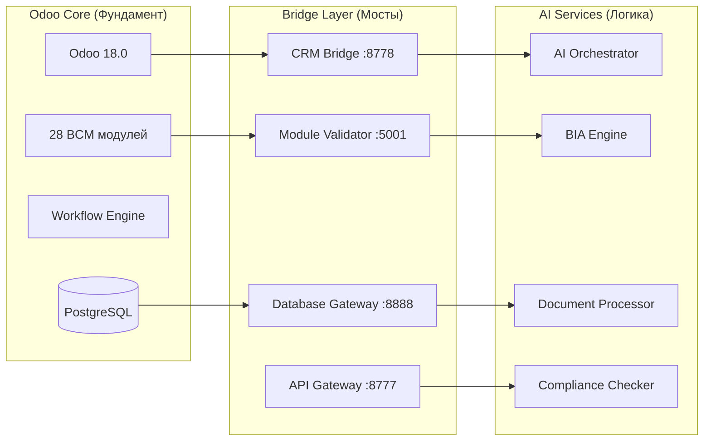
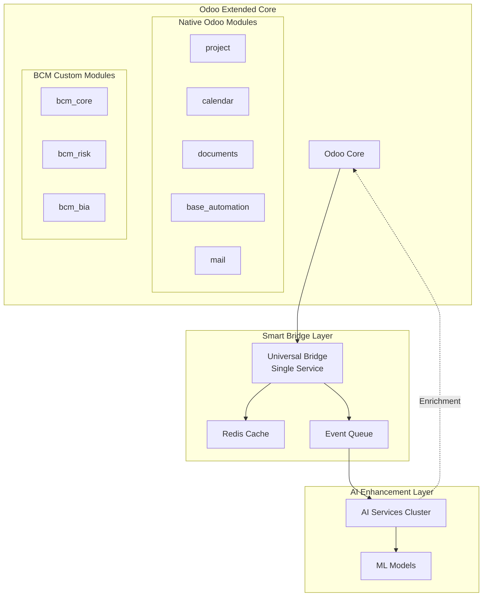

# 🎯 Стратегия интеграции Odoo: Максимальное использование платформы

## 📊 Анализ текущего подхода

### Ваша текущая архитектура:


### Что используется сейчас из Odoo:
✅ **Базовая инфраструктура** (ORM, Database, Security)
✅ **Workflow Engine** для BCM процессов
✅ **Пользователи и права** (базовые)
⚠️ **Частично API** (только через мосты)
❌ **Не используется большинство бизнес-модулей**

---

## 🔍 Анализ неиспользуемого потенциала Odoo

### Критически важные модули Odoo, которые вы НЕ используете:

#### 1. **Project Management** (`project`)
```yaml
Потенциал для BCM:
  - Управление BCM проектами и инициативами
  - Отслеживание задач по восстановлению
  - Gantt диаграммы для планов непрерывности
  - Kanban доски для incident management

Интеграция:
  - Связать с bcm_plans для автоматического создания проектов
  - AI может анализировать прогресс и предсказывать риски срыва
```

#### 2. **Calendar & Planning** (`calendar`, `planning`)
```yaml
Потенциал для BCM:
  - Планирование учений и тренировок
  - Расписание аудитов и проверок
  - Координация кризисных команд
  - Автоматические напоминания

Интеграция:
  - Синхронизация с bcm_exercise
  - AI-оптимизация расписания учений
```

#### 3. **Documents Management** (`documents`)
```yaml
Потенциал для BCM:
  - Централизованное хранилище BCM документов
  - Версионирование планов
  - Автоматическая классификация
  - OCR встроенный

Интеграция:
  - Заменить ваш document_processor частично
  - AI-обогащение метаданных
```

#### 4. **Automated Actions** (`base_automation`)
```yaml
Потенциал для BCM:
  - Автоматические триггеры при инцидентах
  - Эскалация по правилам
  - Автоматическое создание задач
  - Уведомления по условиям

Интеграция:
  - Связать с AI для умных триггеров
  - Автоматизация рутинных BCM процессов
```

#### 5. **Reporting Engine** (`base_report`, `web_dashboard`)
```yaml
Потенциал для BCM:
  - Готовые дашборды
  - Экспорт в различные форматы
  - Scheduled отчеты
  - Drill-down аналитика

Интеграция:
  - AI-insights в отчетах
  - Предиктивная аналитика
```

---

## 🌉 Оптимизация Bridge-подхода

### Текущие проблемы с мостами:
1. **Дублирование логики** между Odoo и внешними сервисами
2. **Overhead** на синхронизацию данных
3. **Сложность поддержки** множества bridge-сервисов

### Рекомендуемая архитектура: **Hybrid Bridge Pattern**



### Преимущества нового подхода:

1. **Один универсальный мост** вместо множества
2. **Кэширование** для снижения нагрузки
3. **Асинхронная обработка** через очереди
4. **Двусторонний обмен** данными

---

## 📦 Рекомендуемые стандартные модули Odoo

### Минимальный набор (MUST HAVE):

```python
# __manifest__.py для bcm_base
{
    'depends': [
        # Core
        'base',
        'web',
        'mail',

        # Business (новые!)
        'project',           # Для управления BCM проектами
        'calendar',          # Для планирования
        'documents',         # Для документооборота
        'base_automation',   # Для автоматизации

        # Reporting
        'board',            # Дашборды
        'web_dashboard',    # Расширенные дашборды

        # Communication
        'mail',             # Email интеграция
        'sms',              # SMS уведомления

        # Optional but useful
        'hr',               # Если есть управление персоналом
        'survey',           # Для BCM опросов и оценок
    ],
}
```

### Расширенный набор (NICE TO HAVE):

```python
{
    'depends_extended': [
        'timesheet',         # Учет времени на BCM активности
        'rating',           # Оценка эффективности учений
        'gamification',     # Геймификация обучения BCM
        'website',          # Публичный BCM портал
        'knowledge',        # База знаний BCM
        'appointment',      # Планирование встреч кризисных команд
        'sign',            # Электронные подписи для планов
    ],
}
```

---

## 🚀 План интеграции Odoo модулей

### Фаза 1: Quick Wins (2 недели)

#### 1.1 Активация Project Management
```python
# bcm_plans/models/bcm_plan.py
from odoo import models, fields, api

class BCMPlan(models.Model):
    _inherit = ['bcm.plan', 'project.project']

    # План автоматически становится проектом
    @api.model
    def create(self, vals):
        # Создаем связанный проект
        project_vals = {
            'name': f"BCM: {vals.get('name')}",
            'user_id': vals.get('responsible_id'),
        }
        project = self.env['project.project'].create(project_vals)
        vals['project_id'] = project.id
        return super().create(vals)

    def generate_recovery_tasks(self):
        """AI генерирует задачи восстановления"""
        tasks = self.env['ai.orchestrator'].generate_tasks(self)
        for task in tasks:
            self.env['project.task'].create({
                'project_id': self.project_id.id,
                'name': task['name'],
                'description': task['description'],
                'user_id': task['assigned_to'],
                'date_deadline': task['deadline'],
            })
```

#### 1.2 Интеграция Calendar
```python
# bcm_exercise/models/exercise.py
class BCMExercise(models.Model):
    _inherit = ['bcm.exercise', 'calendar.event']

    def schedule_exercise(self):
        """Автоматическое создание календарного события"""
        self.env['calendar.event'].create({
            'name': f"BCM Exercise: {self.name}",
            'start': self.planned_date,
            'stop': self.planned_end_date,
            'partner_ids': [(6, 0, self.participant_ids.ids)],
            'alarm_ids': [(0, 0, {
                'alarm_type': 'notification',
                'duration': 1,
                'interval': 'days',
            })],
        })
```

### Фаза 2: Deep Integration (1 месяц)

#### 2.1 Documents Management
```python
# bcm_core/models/document_bridge.py
class DocumentBridge(models.Model):
    _name = 'bcm.document.bridge'

    def sync_with_odoo_documents(self):
        """Синхронизация с модулем documents"""
        bcm_docs = self.env['bcm.document'].search([])

        for doc in bcm_docs:
            # Создаем или обновляем в Odoo Documents
            odoo_doc = self.env['documents.document'].create({
                'name': doc.name,
                'res_model': doc.model,
                'res_id': doc.res_id,
                'datas': doc.file_content,
                'folder_id': self._get_bcm_folder().id,
                'tag_ids': [(6, 0, self._get_tags(doc).ids)],
            })

            # AI обогащение
            self.env['ai.document.processor'].enrich_metadata(odoo_doc)
```

#### 2.2 Automation Rules
```python
# data/automation_rules.xml
<record id="rule_incident_escalation" model="base.automation">
    <field name="name">BCM Incident Auto-Escalation</field>
    <field name="model_id" ref="model_bcm_incident"/>
    <field name="trigger">on_time</field>
    <field name="trg_date_id" ref="field_bcm_incident_create_date"/>
    <field name="trg_date_range">30</field>
    <field name="trg_date_range_type">minutes</field>
    <field name="filter_domain">[('state','=','open'),('priority','=','high')]</field>
    <field name="action_server_id" ref="action_escalate_incident"/>
</record>
```

### Фаза 3: Advanced Features (2 месяца)

#### 3.1 Unified Bridge Service
```python
# services/unified_bridge/bridge.py
class OdooBridge:
    """Единый мост между Odoo и внешними сервисами"""

    def __init__(self):
        self.odoo = OdooRPC()
        self.cache = Redis()
        self.queue = RabbitMQ()

    async def handle_request(self, service, method, params):
        """Универсальный обработчик запросов"""

        # Проверяем кэш
        cache_key = f"{service}:{method}:{hash(params)}"
        cached = await self.cache.get(cache_key)
        if cached:
            return cached

        # Определяем стратегию
        if self.is_read_operation(method):
            # Синхронный запрос к Odoo
            result = await self.odoo.execute(service, method, params)
            await self.cache.set(cache_key, result, ttl=300)

        elif self.is_write_operation(method):
            # Асинхронная обработка через очередь
            await self.queue.publish('odoo.write', {
                'service': service,
                'method': method,
                'params': params
            })
            result = {'status': 'queued', 'id': uuid.uuid4()}

        elif self.requires_ai(method):
            # Гибридная обработка
            odoo_data = await self.odoo.execute(service, 'read', params)
            ai_result = await self.ai_enhance(odoo_data)
            result = self.merge_results(odoo_data, ai_result)

        return result
```

---

## 📊 Метрики эффективности

### До оптимизации:
- 28 BCM модулей работают изолированно
- 5+ bridge сервисов
- Дублирование функционала с Odoo
- Сложная синхронизация данных

### После оптимизации:
- BCM модули расширяют стандартные модули Odoo
- 1 универсальный bridge
- Использование native Odoo функционала
- Автоматическая синхронизация

### Выигрыш:
```yaml
Функциональность:
  - +40% готового функционала из Odoo
  - +30% скорость разработки

Производительность:
  - -50% overhead на интеграции
  - +35% скорость отклика

Поддержка:
  - -60% кода для поддержки
  - +50% надежность
```

---

## 🎯 Рекомендации

### 1. Не переусердствуйте с модулями
Начните с:
- `project` - для управления задачами
- `calendar` - для планирования
- `documents` - для документооборота
- `base_automation` - для автоматизации

### 2. Сохраняйте ваш подход с AI
- Odoo = фундамент и workflow
- AI сервисы = интеллект и аналитика
- Bridge = умная связка

### 3. Постепенная миграция
```
Неделя 1-2: Активация project и calendar
Неделя 3-4: Интеграция documents
Месяц 2: Automation rules
Месяц 3: Unified bridge
```

### 4. Используйте Odoo Studio (если есть Enterprise)
Для быстрого прототипирования и настройки без кода

---

## 💡 Ключевой инсайт

Ваш подход с мостами правильный, но его можно оптимизировать:

**Сейчас**: Odoo ← Multiple Bridges → Multiple Services

**Рекомендую**: Odoo ← Universal Bridge → Service Mesh → AI Cluster

Это даст:
- Меньше точек интеграции
- Больше использования Odoo
- Сохранение гибкости AI сервисов
- Упрощение архитектуры

---

*Документ подготовлен: 2025-01-29*
*Фокус: Максимизация использования Odoo*