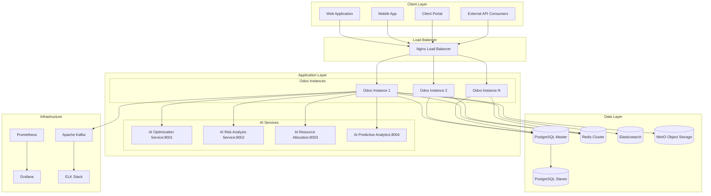
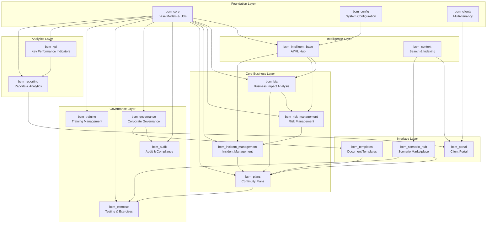
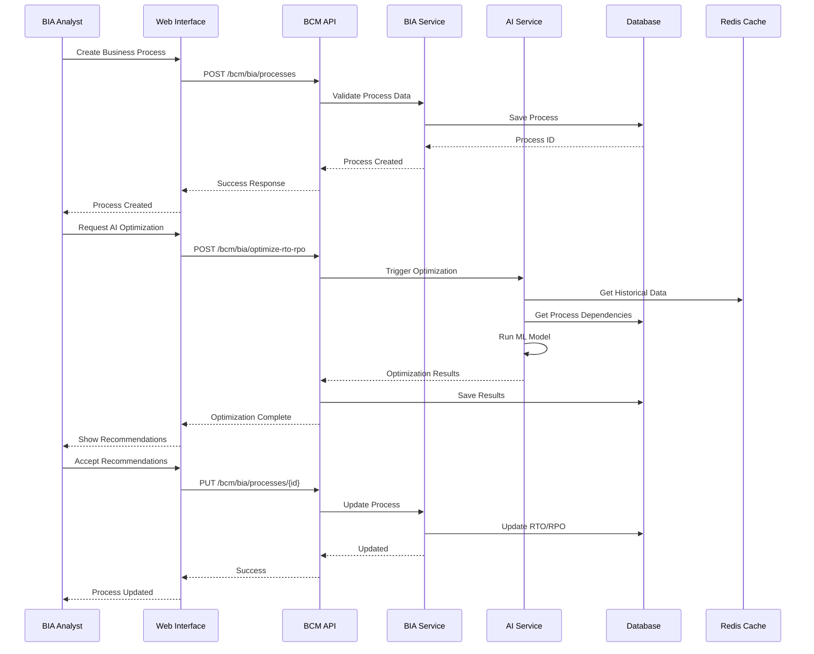
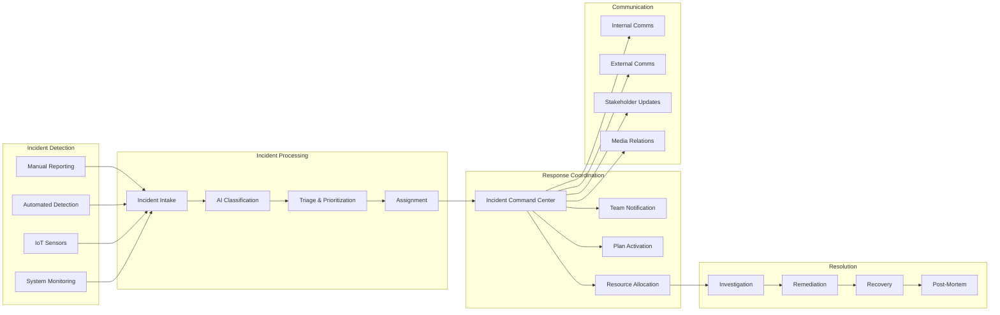
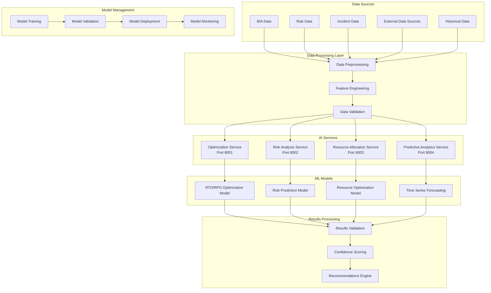
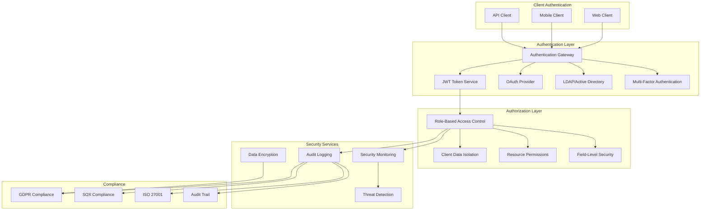
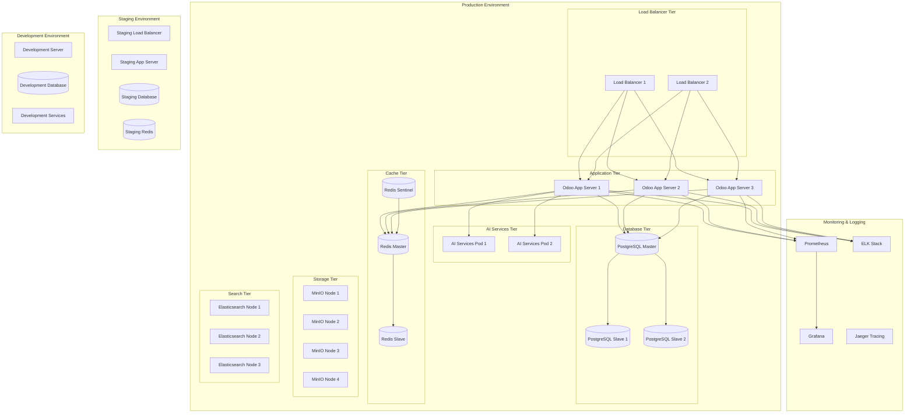
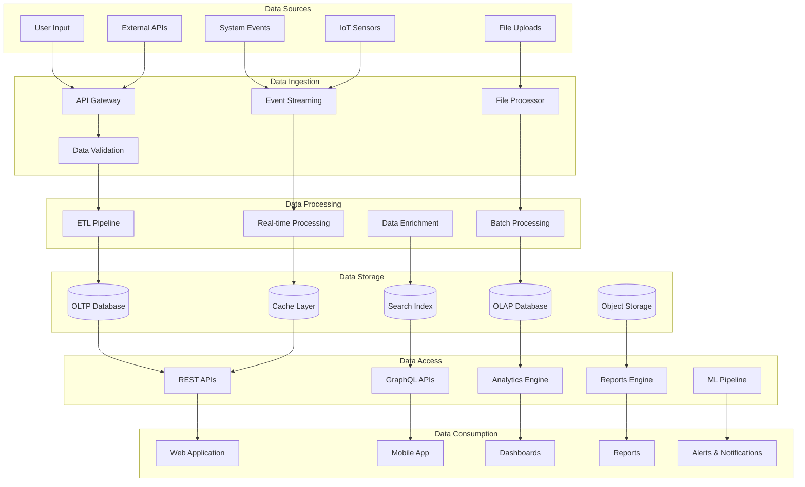
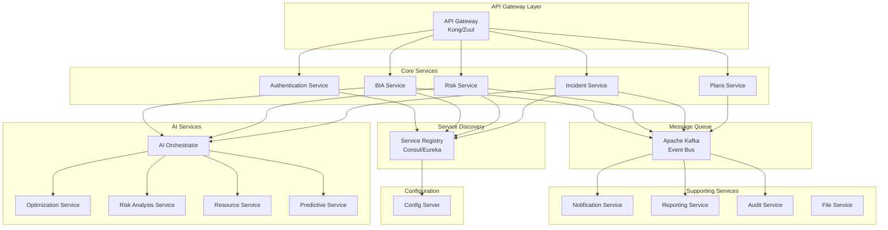

# Архитектурные диаграммы BCM Platform

## 1. Общая архитектура системы

## 2. Модульная архитектура BCM

## 3. Диаграмма потоков данных - BIA Process

## 4. Архитектура управления инцидентами

## 5. AI/ML Архитектура

## 6. Диаграмма безопасности и аутентификации

## 7. Deployment Architecture

## 8. CI/CD Pipeline

```mermaid
graph LR
    subgraph "Source Control"
        Git[Git Repository]
        PR[Pull Request]
    end
    
    subgraph "CI Pipeline"
        Trigger[Webhook Trigger]
        Build[Build & Test]
        Security[Security Scan]
        Quality[Code Quality]
        Docker[Docker Build]
    end
    
    subgraph "Testing Stages"
        Unit[Unit Tests]
        Integration[Integration Tests]
        E2E[E2E Tests]
        Performance[Performance Tests]
    end
    
    subgraph "Deployment Stages"
        Dev_Deploy[Deploy to Dev]
        Stage_Deploy[Deploy to Staging]
        Prod_Deploy[Deploy to Production]
    end
    
    subgraph "Post-Deployment"
        HealthCheck[Health Checks]
        Monitoring[Monitoring Setup]
        Rollback[Rollback Capability]
    end
    
    Git --> Trigger
    PR --> Trigger
    
    Trigger --> Build
    Build --> Security
    Security --> Quality
    Quality --> Docker
    
    Docker --> Unit
    Unit --> Integration
    Integration --> E2E
    E2E --> Performance
    
    Performance --> Dev_Deploy
    Dev_Deploy --> Stage_Deploy
    Stage_Deploy --> Prod_Deploy
    
    Prod_Deploy --> HealthCheck
    HealthCheck --> Monitoring
    Monitoring --> Rollback
```

## 9. Data Flow Architecture

## 10. Microservices Communication

Эти диаграммы показывают:

1. **Общую архитектуру** - все уровни системы от клиентов до данных
2. **Модульную структуру** - взаимосвязи 19 BCM модулей
3. **Потоки данных** - как данные проходят через систему
4. **AI архитектуру** - специализированные AI сервисы
5. **Безопасность** - многоуровневую защиту
6. **Deployment** - production ready инфраструктуру
7. **CI/CD** - процесс разработки и развертывания
8. **Обработку данных** - от источников до потребления
9. **Микросервисы** - современную архитектуру сервисов

Диаграммы созданы в формате Mermaid и могут быть легко встроены в документацию или презентации.