# 👨‍💻 BCM PLATFORM - HANDOVER ДЛЯ КОМАНДЫ РАЗРАБОТЧИКОВ

## 🎯 ОБЗОР ПРОЕКТА

### 🚀 Что уже готово (Phase 1 - COMPLETED ✅)
```
🧠 bcm_core                 ✅ Модели, Views, API контроллеры готовы
🤖 bcm_intelligent_base     ✅ AI интеграция и базовые поля
🛠️ bcm_base                ✅ Сервисная интеграция с 4 AI сервисами
🌐 Frontend Vue.js          ✅ 25+ компонентов, роутинг, stores
🐳 Docker Infrastructure    ✅ Все сервисы запущены и работают
📊 Architecture Docs        ✅ Полная документация и схемы
```

### 🎯 Что нужно доделать (Phase 2-4)
```
⚙️ bcm_config              🔄 Конфигурация системы (NEXT)
🏢 bcm_context             🔄 Организационный контекст (NEXT)
👥 bcm_community           🔄 Форум и база знаний (NEXT)
📊 bcm_bia                 ⏳ Анализ воздействия на бизнес
📋 bcm_plans               ⏳ Планы восстановления
🚨 bcm_incident            ⏳ Управление инцидентами
... (еще 17 модулей)
```

---

## 🔧 ТЕХНИЧЕСКАЯ НАСТРОЙКА

### 🐳 Быстрый старт разработчика

```bash
# 1. Клонирование репозитория
git clone https://github.com/SEH-foundation/ISO-22301
cd ISO-22301

# 2. Запуск базовых сервисов
docker-compose up -d postgres redis odoo

# 3. Запуск AI сервисов
docker-compose up -d ai_orchestrator bia_engine document_processor compliance_checker

# 4. Запуск фронтенда
cd frontend/web_portal-2
npm install
npm run dev

# 5. Проверка здоровья
curl http://localhost:8069/web/health  # Odoo
curl http://localhost:8000/health      # AI Orchestrator
curl http://localhost:5174             # Frontend
```

### 📁 Структура проекта

```
ISO-22301/
├── 🧠 core/odoo-18.0/addons/           # BCM модули Odoo
│   ├── bcm_core/                       # ✅ Ядро системы
│   ├── bcm_intelligent_base/           # ✅ AI интеграция
│   ├── bcm_base/                       # ✅ Сервисная интеграция
│   ├── bcm_config/                     # 🔄 Конфигурация (TODO)
│   ├── bcm_context/                    # 🔄 Контекст (TODO)
│   └── ... (еще 20 модулей)
├── 🌐 frontend/web_portal-2/           # Vue.js приложение
│   ├── src/components/                 # ✅ UI компоненты
│   ├── src/views/modules/              # ✅ 25+ BCM модулей
│   ├── src/stores/                     # ✅ Pinia состояние
│   └── src/services/                   # ✅ API клиенты
├── 🤖 services/                        # AI микросервисы
│   ├── ai_orchestrator/                # ✅ Центральный AI
│   ├── bia_engine/                     # ✅ BIA анализ
│   ├── document_processor/             # ✅ Обработка документов
│   └── compliance_checker/             # ✅ Проверка соответствия
├── 🐳 docker-compose.yml               # ✅ Инфраструктура
└── 📊 BCM_*_ARCHITECTURE_MAP.md        # ✅ Документация
```

### 🔗 Порты и сервисы

| Сервис | Порт | Статус | Описание |
|--------|------|--------|----------|
| 🌐 Frontend | 5174 | ✅ | Vue.js + TypeScript |
| 🔗 Odoo API | 8069 | ✅ | Основное API BCM |
| 🤖 AI Orchestrator | 8000 | ✅ | Центральный AI |
| 📊 BIA Engine | 8082 | ✅ | Анализ воздействия |
| 📄 Document Processor | 8083 | ✅ | Обработка документов |
| ✅ Compliance Checker | 8084 | ✅ | Проверка соответствия |
| 💾 PostgreSQL | 5432 | ✅ | База данных |
| ⚡ Redis | 6379 | ✅ | Кэш и сессии |
| 📨 RabbitMQ | 5672/15672 | ✅ | Очереди сообщений |
| 🔐 Keycloak | 8080 | ✅ | SSO аутентификация |

---

## 🏗️ АРХИТЕКТУРНЫЕ РЕШЕНИЯ

### 🧠 Модульная архитектура Odoo

```mermaid
graph TB
    subgraph "🏗️ FOUNDATION LAYER"
        CORE[bcm_core<br/>95% ready<br/>Base models & API]
        INTEL[bcm_intelligent_base<br/>80% ready<br/>AI integration]
        BASE[bcm_base<br/>75% ready<br/>Service integration]
    end

    subgraph "🔧 FUNCTIONAL LAYER"
        CONFIG[bcm_config<br/>90% ready<br/>System config]
        CONTEXT[bcm_context<br/>90% ready<br/>Organization context]
        CLIENTS[bcm_clients<br/>95% ready<br/>CRM system]
    end

    subgraph "📊 BUSINESS LAYER"
        BIA[bcm_bia<br/>75% ready<br/>Impact analysis]
        PLANS[bcm_plans<br/>70% ready<br/>Continuity plans]
        INCIDENT[bcm_incident<br/>75% ready<br/>Incident handling]
        RISK[bcm_risk_management<br/>75% ready<br/>Risk analysis]
    end

    subgraph "🤖 AI LAYER"
        SCENARIO[bcm_scenario_hub<br/>90% ready<br/>AI Scenarios]
        TRAINING[bcm_training<br/>95% ready<br/>AI Learning Coach]
        AI_CTRL[bcm_ai_control<br/>85% ready<br/>AI Management]
        GOVERNANCE[bcm_governance<br/>95% ready<br/>AI Governance Brain]
    end

    subgraph "📈 ANALYTICS LAYER"
        KPI[bcm_kpi<br/>75% ready<br/>Performance metrics]
        REPORTING[bcm_reporting<br/>70% ready<br/>BI & Reports]
        AUDIT[bcm_audit<br/>70% ready<br/>Compliance audit]
    end

    subgraph "👥 COMMUNITY LAYER"
        COMMUNITY[bcm_community<br/>85% ready<br/>Forum & Knowledge]
        PORTAL[bcm_portal<br/>90% ready<br/>Client Portal]
        TEMPLATES[bcm_templates<br/>70% ready<br/>Document templates]
    end

    CORE --> CONFIG
    CORE --> CONTEXT
    CORE --> CLIENTS
    INTEL --> SCENARIO
    INTEL --> TRAINING
    INTEL --> AI_CTRL
    BASE --> BIA
    BASE --> PLANS
    BASE --> INCIDENT
    CONFIG --> KPI
    CONTEXT --> GOVERNANCE
    CLIENTS --> PORTAL
```



**Принципы:**
- 🔗 **Зависимости вверх** - модули зависят только от базовых
- 🏢 **Изоляция данных** - каждая компания видит только свои данные
- 🤖 **AI интеграция** - через bcm_base и bcm_intelligent_base
- 📊 **События** - EventBus для real-time уведомлений

### 🎨 Frontend архитектура
```
Vue 3 + Composition API + TypeScript
├── 🗂️ Pinia stores         # Управление состоянием
├── 🎨 Component library     # Переиспользуемые компоненты
├── 🔗 Service layer        # API клиенты и бизнес-логика
├── 📱 Mobile-first design  # Адаптивный дизайн
└── 🚀 PWA support          # Progressive Web App
```

**Паттерны:**
- 🔄 **Композиция > наследование** - useComposables для переиспользования
- 📊 **Reactive data flow** - Pinia для глобального состояния
- 🛡️ **Type safety** - TypeScript на всех уровнях
- ⚡ **Lazy loading** - Динамические импорты для модулей

---

## 📝 CODING STANDARDS

### 🧠 Odoo модули
```python
# 📁 models/my_model.py
from odoo import models, fields, api, _
from odoo.exceptions import ValidationError

class MyBCMModel(models.Model):
    """Документация модели"""
    _name = 'bcm.my.model'
    _description = 'My BCM Model'
    _inherit = ['bcm.base']  # Всегда наследуем от bcm.base
    _order = 'sequence, name'

    # Поля
    name = fields.Char('Name', required=True)
    active = fields.Boolean(default=True, tracking=True)

    # AI интеграция (если нужна)
    _inherit_ai = ['bcm.intelligent.base']

    @api.constrains('name')
    def _check_name(self):
        """Валидация имени"""
        for record in self:
            if not record.name:
                raise ValidationError(_("Name is required"))

    def action_ai_analyze(self):
        """AI анализ записи"""
        ai_service = self.env['bcm.ai.service']
        result = ai_service.analyze_process_risk({
            'name': self.name,
            'description': self.description
        })
        self.ai_recommendations = result.get('recommendations')
        return result
```

### 🎨 Vue.js компоненты
```typescript
<!-- 📁 components/MyComponent.vue -->
<template>
  <div class="my-component">
    <h2>{{ title }}</h2>
    <BCMCard v-for="item in items" :key="item.id">
      <template #title>{{ item.name }}</template>
      <template #content>{{ item.description }}</template>
    </BCMCard>
  </div>
</template>

<script setup lang="ts">
import { ref, computed, onMounted } from 'vue'
import { useBCMAPI } from '@/composables/useBCMAPI'
import type { BCMItem } from '@/types'
import BCMCard from '@/components/common/BCMCard.vue'

// Props с типизацией
interface Props {
  title: string
  moduleType: string
}
const props = defineProps<Props>()

// Состояние
const items = ref<BCMItem[]>([])
const isLoading = ref(false)

// Composables
const { api } = useBCMAPI()

// Computed
const filteredItems = computed(() =>
  items.value.filter(item => item.active)
)

// Methods
async function loadItems() {
  isLoading.value = true
  try {
    const response = await api.get(`/bcm/${props.moduleType}`)
    items.value = response.data
  } catch (error) {
    console.error('Failed to load items:', error)
  } finally {
    isLoading.value = false
  }
}

// Lifecycle
onMounted(() => {
  loadItems()
})
</script>

<style scoped lang="scss">
.my-component {
  padding: 1rem;

  h2 {
    color: var(--bcm-primary);
    font-size: 1.5rem;
    margin-bottom: 1rem;
  }
}
</style>
```

---

## 🔄 WORKFLOW РАЗРАБОТКИ

### 🌿 Git Flow
```bash
# 1. Создание feature ветки
git checkout main
git pull origin main
git checkout -b feature/bcm-config-implementation

# 2. Разработка
# ... делаем изменения ...
git add .
git commit -m "feat(bcm_config): add system configuration models

- Add BCMSystemConfig model with validation
- Implement configuration API endpoints
- Add frontend configuration interface
- Add unit tests for config validation

🤖 Generated with Claude Code"

# 3. Пуш и PR
git push origin feature/bcm-config-implementation
# Создать Pull Request в GitHub

# 4. После ревью и мержа
git checkout main
git pull origin main
git branch -d feature/bcm-config-implementation
```

### ✅ Definition of Done
```
📋 Функциональность:
├── ✅ Модели реализованы с валидацией
├── ✅ API endpoints протестированы
├── ✅ Frontend компоненты работают
├── ✅ Интеграция с AI (если нужна)
└── ✅ Права доступа настроены

🧪 Качество:
├── ✅ Unit тесты написаны и проходят
├── ✅ Integration тесты проходят
├── ✅ Code review пройден
├── ✅ TypeScript ошибок нет
└── ✅ ESLint/Prettier применены

📚 Документация:
├── ✅ Inline документация в коде
├── ✅ API endpoints задокументированы
├── ✅ README обновлен (если нужно)
└── ✅ Changelog обновлен
```

---

## 🎯 ПРИОРИТЕТНЫЙ ПЛАН РАЗРАБОТКИ

### 🔥 Phase 2 - IMMEDIATE (1-2 недели)
```
⚙️ bcm_config (Priority: HIGH)
├── 📋 Модели: SystemConfig, UserPreferences, CompanySettings
├── 🔗 API: CRUD операции, валидация, экспорт/импорт
├── 🎨 Frontend: Страница настроек, формы конфигурации
└── 🤖 AI: Умные настройки по умолчанию

🏢 bcm_context (Priority: HIGH)
├── 📋 Модели: OrganizationProfile, BusinessUnit, Stakeholder
├── 🔗 API: Контекстная информация, иерархия
├── 🎨 Frontend: Org chart, профиль компании
└── 🤖 AI: Анализ организационного контекста

👥 bcm_community (Priority: MEDIUM)
├── 📋 Модели: ForumTopic, KnowledgeArticle, UserReputation
├── 🔗 API: Форум, база знаний, модерация
├── 🎨 Frontend: Форум, поиск, рейтинги
└── 🤖 AI: Модерация контента, рекомендации
```

### 📊 Phase 3 - CORE BUSINESS (2-3 недели)
```
📊 bcm_bia (Priority: CRITICAL)
├── 📋 Модели: ProcessImpact, FinancialModel, Dependencies
├── 🔗 API: BIA расчеты, моделирование сценариев
├── 🎨 Frontend: BIA wizard, дашборд, отчеты
└── 🤖 AI: ML-оптимизация RTO/RPO, прогнозирование

📋 bcm_plans (Priority: CRITICAL)
├── 📋 Модели: RecoveryPlan, PlanTemplate, PlanVersion
├── 🔗 API: Планы, шаблоны, версионирование
├── 🎨 Frontend: План editor, библиотека шаблонов
└── 🤖 AI: Автогенерация планов, оптимизация

🚨 bcm_incident (Priority: HIGH)
├── 📋 Модели: Incident, IncidentResponse, Timeline
├── 🔗 API: Инциденты, эскалация, отчетность
├── 🎨 Frontend: Incident dashboard, воркфлоу
└── 🤖 AI: Автоклассификация, прогноз воздействия
```

### 📈 Phase 4 - ADVANCED (3-4 недели)
```
Остальные 14 модулей по приоритету бизнес-важности:
🎓 Training → 🏃 Exercise → ⚠️ Risk Management →
📊 KPI → 📈 Reporting → 🏛️ Governance → ...
```

---

## 🐛 ИЗВЕСТНЫЕ ПРОБЛЕМЫ И РЕШЕНИЯ

### ⚠️ Временно отключенные функции
```javascript
// ❌ ОТКЛЮЧЕНО в main.ts (строка 88-100)
// Odoo session initialization - для отладки
// Включить после исправления CORS

// ❌ ОТКЛЮЧЕНО в App.vue (строка 100-101)
// WebSocket connections - вызывает xhr poll error
// Включить после настройки EventBus

// ❌ ОТКЛЮЧЕНО в AppHeader.vue (строка 318-322)
// Notifications API - endpoint не готов
// Включить после реализации bcm_config
```

### 🔧 Быстрые фиксы
```bash
# 1. Исправление CORS для Odoo API
# Добавить в docker-compose.yml для odoo:
environment:
  - CORS_ORIGINS=http://localhost:5174,http://localhost:5173

# 2. Включение WebSocket после fix EventBus
# В App.vue раскомментировать:
await webSocketStore.connect()

# 3. Исправление уведомлений
# Создать endpoint в bcm_core:
@http.route('/api/notifications', type='json', auth='user')
def get_notifications(self, **kwargs):
    # Реализация
```

### 🚨 Production Readiness Checklist
```
🔐 Безопасность:
├── ❌ HTTPS сертификаты
├── ❌ Secrets management (не в коде!)
├── ❌ Rate limiting на API
├── ❌ Input sanitization
└── ❌ Security headers

📊 Мониторинг:
├── ❌ Application metrics
├── ❌ Error tracking (Sentry?)
├── ❌ Performance monitoring
├── ❌ Business metrics dashboard
└── ❌ Alerting rules

🚀 DevOps:
├── ❌ CI/CD pipeline
├── ❌ Automated testing
├── ❌ Blue-green deployment
├── ❌ Database migrations
└── ❌ Backup strategy
```

---

## 📚 РЕСУРСЫ ДЛЯ КОМАНДЫ

### 📖 Документация
```
📊 Архитектура:
├── BCM_PLATFORM_ARCHITECTURE_MAP.md     # Общая архитектура
├── BCM_BUSINESS_SCENARIOS_AND_FLOWS.md  # Бизнес-сценарии
└── BCM_SECURITY_AND_PATTERNS.md         # Безопасность и паттерны

🧠 Odoo документация:
├── https://odoo.com/documentation/18.0/  # Официальная документация
├── https://odoo.com/slides/               # Обучающие материалы
└── https://github.com/odoo/odoo          # Исходный код

🎨 Frontend документация:
├── https://vuejs.org/guide/              # Vue.js 3
├── https://pinia.vuejs.org/              # Pinia state management
├── https://router.vuejs.org/             # Vue Router
└── https://www.typescriptlang.org/docs/  # TypeScript
```

### 🛠️ Инструменты разработки
```bash
# VS Code Extensions (рекомендуемые)
- Python (ms-python.python)
- Pylance (ms-python.vscode-pylance)
- Vetur/Volar (Vue.volar)
- TypeScript (ms-vscode.vscode-typescript-next)
- ESLint (dbaeumer.vscode-eslint)
- Prettier (esbenp.prettier-vscode)
- GitLens (eamodio.gitlens)
- Docker (ms-azuretools.vscode-docker)

# Полезные команды
docker-compose logs -f odoo              # Логи Odoo
docker-compose exec odoo odoo shell      # Odoo shell
npm run lint -- --fix                    # Исправить ESLint ошибки
npm run type-check                       # Проверка TypeScript
```

### 🎯 Контакты и поддержка
```
🏗️ Архитектор:     Claude (Anthropic AI)
📧 Technical Lead:  [Ваш email]
👥 Team Chat:       [Slack/Teams channel]
🐛 Bug Reports:     [GitHub Issues]
📋 Project Board:   [GitHub Projects/Jira]
📚 Wiki:           [Confluence/Notion]
```

---

## 🚀 СЛЕДУЮЩИЕ ШАГИ

### ✅ Немедленные действия (Today)
1. **Проверить environment** - все сервисы работают?
2. **Настроить IDE** - установить расширения, настроить отладку
3. **Изучить код** - начать с bcm_core, понять паттерны
4. **Запустить тесты** - убедиться что все работает

### 🎯 Первая неделя
1. **Выбрать модуль** - рекомендую bcm_config (проще всего)
2. **Создать ветку** - feature/bcm-config-implementation
3. **Реализовать модели** - следуя паттернам bcm_core
4. **Добавить API** - REST endpoints для CRUD операций
5. **Создать фронтенд** - страница настроек в Vue.js

### 🏁 Первый месяц
1. **Завершить Phase 2** - bcm_config, bcm_context, bcm_community
2. **Настроить CI/CD** - автоматизировать тестирование и деплой
3. **Добавить мониторинг** - базовые метрики и алерты
4. **Подготовить demo** - показать working prototype

**🎯 Цель: Полностью функциональная BCM платформа с AI интеграцией**

---

## 💡 СОВЕТЫ ДЛЯ УСПЕХА

### 🎯 Best Practices
- 📊 **Начинайте с простого** - сначала базовые CRUD, потом AI
- 🧪 **Тестируйте постоянно** - каждый commit должен работать
- 📚 **Документируйте все** - будущая команда скажет спасибо
- 🔄 **Итерируйте быстро** - лучше рабочий MVP чем идеальный план
- 👥 **Общайтесь часто** - daily standups, еженедельные ретро

### ⚠️ Подводные камни
- 🔐 **Безопасность с самого начала** - не оставлять на потом
- 📊 **Мониторинг критичен** - в production без него никуда
- 🎨 **UX важнее красоты** - сначала usability, потом дизайн
- 🤖 **AI - это инструмент** - не магическая палочка
- 📈 **Производительность имеет значение** - особенно с AI

**Удачи в разработке! 🚀**