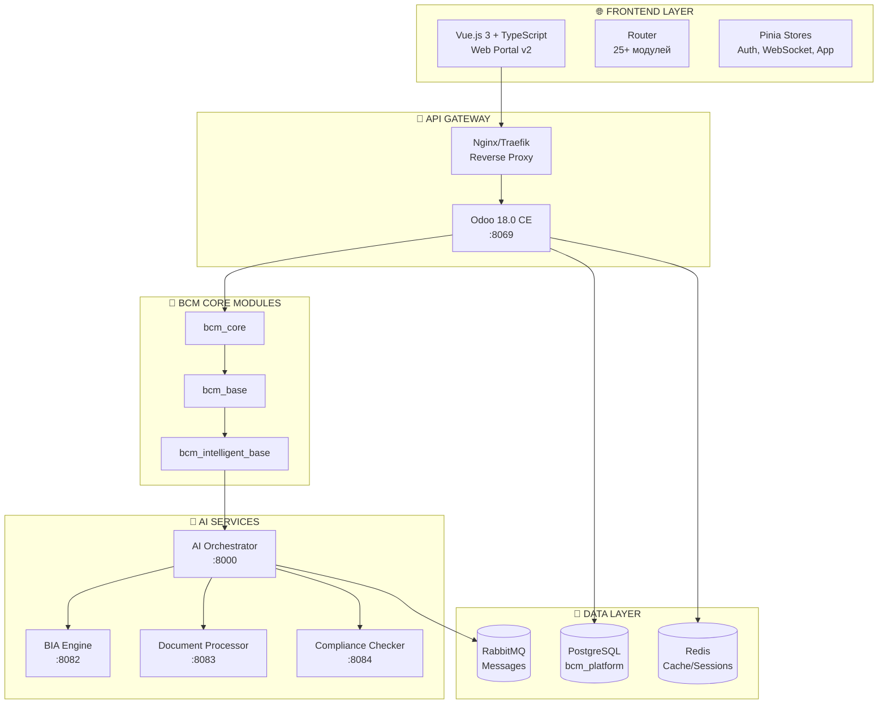
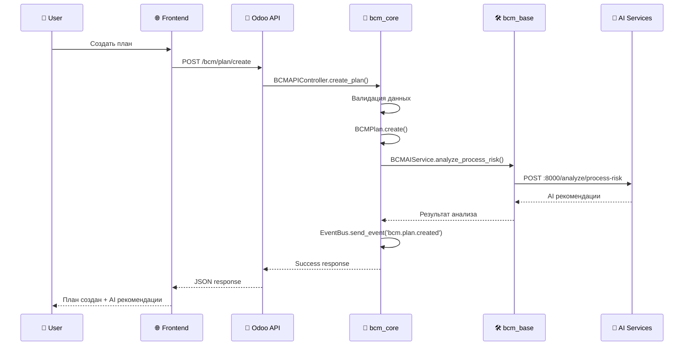
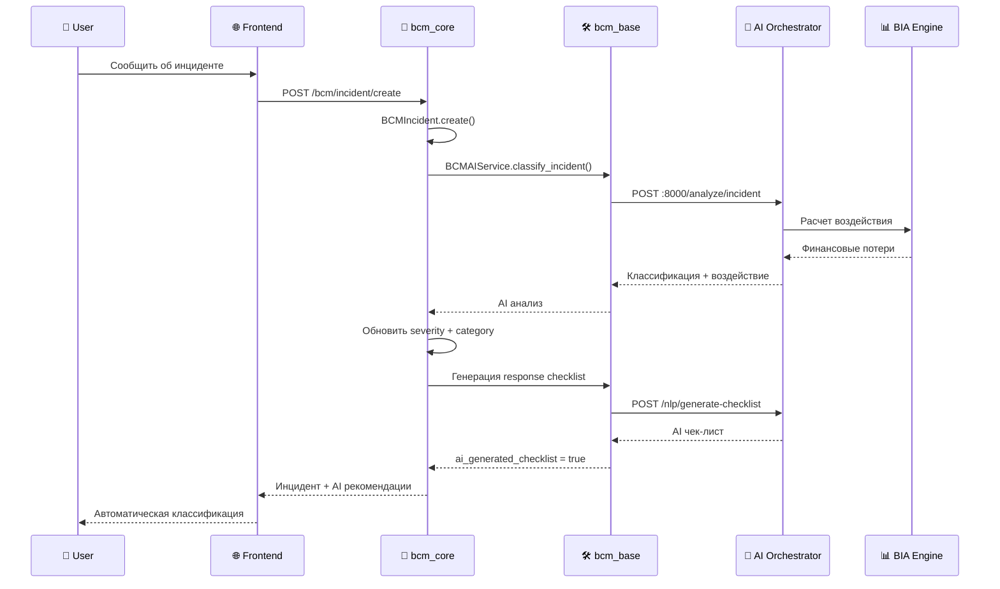

# 🏗️ BCM PLATFORM - АРХИТЕКТУРНАЯ КАРТА

## 📊 ОБЩАЯ АРХИТЕКТУРА СИСТЕМЫ



---

## 🎯 ФАЗА 1 - ОСНОВНЫЕ МОДУЛИ (ДЕТАЛЬНО)

### 📦 bcm_core - Ядро системы
```
┌─────────────────────────────────────────────────────────┐
│                     🧠 BCM_CORE                        │
│                   (Последовательность: 1)               │
├─────────────────────────────────────────────────────────┤
│ 📋 МОДЕЛИ:                                             │
│  ├── BCMBase (Abstract)     - Базовый класс           │
│  ├── BCMTag                 - Теги и категории         │
│  ├── BCMPlan                - Планы БНП                │
│  ├── BCMIncident            - Инциденты                │
│  ├── BCMBusinessProcess     - Бизнес-процессы          │
│  └── BCMAILifecycle         - Мониторинг ИИ органов   │
├─────────────────────────────────────────────────────────┤
│ 🔗 КОНТРОЛЛЕРЫ:                                        │
│  ├── /bcm/plan/create       - Создание планов         │
│  ├── /bcm/plan/update       - Обновление планов       │
│  ├── /bcm/incident/create   - Создание инцидентов     │
│  ├── /bcm/incident/update   - Обновление инцидентов   │
│  └── /bcm/incident/update_checklist - Чек-листы      │
├─────────────────────────────────────────────────────────┤
│ 🎯 ФУНКЦИИ:                                            │
│  ├── Базовая модель для всех BCM записей              │
│  ├── Аудит и отслеживание изменений                   │
│  ├── Мультитенантность (изоляция по компаниям)       │
│  ├── ISO 22301 compliance tracking                     │
│  ├── Интеграция с EventBus                            │
│  └── AI органы lifecycle monitoring                    │
├─────────────────────────────────────────────────────────┤
│ 📊 VIEWS (Odoo):                                       │
│  ├── bcm_plan_views.xml     - Планы (tree/form)      │
│  ├── bcm_incident_views.xml - Инциденты (tree/form)  │
│  └── menu.xml               - Главное меню BCM        │
├─────────────────────────────────────────────────────────┤
│ 🔐 БЕЗОПАСНОСТЬ:                                       │
│  ├── group_bcm_user         - Базовые пользователи   │
│  ├── group_bcm_manager      - Менеджеры BCM          │
│  └── Права доступа для всех моделей                   │
└─────────────────────────────────────────────────────────┘
    ⬇️ ЗАВИСИМОСТИ: base, mail, web
    ⬆️ ИСПОЛЬЗУЕТСЯ: ALL BCM MODULES
```

### 🤖 bcm_intelligent_base - AI слой
```
┌─────────────────────────────────────────────────────────┐
│                🤖 BCM_INTELLIGENT_BASE                 │
│                   (Последовательность: 70)             │
├─────────────────────────────────────────────────────────┤
│ 📋 МОДЕЛИ:                                             │
│  ├── BCMIntelligentBase (Abstract) - AI поля и методы │
│  └── BCMAIIntegration           - Интеграция с AI     │
├─────────────────────────────────────────────────────────┤
│ 🎯 ФУНКЦИИ:                                            │
│  ├── ai_enabled              - Включение AI анализа   │
│  ├── ai_score                - Оценка AI (0-1)        │
│  ├── ai_recommendations      - Рекомендации AI        │
│  ├── ai_last_analysis        - Время последнего ИИ    │
│  ├── ai_analyze()            - Базовый метод анализа  │
│  └── Интеграция с 4 AI сервисами                      │
├─────────────────────────────────────────────────────────┤
│ 🔗 AI СЕРВИСЫ:                                         │
│  ├── AI Orchestrator (:8000)  - Центральный ИИ       │
│  ├── BIA Engine (:8082)       - Анализ воздействия    │
│  ├── Document Processor (:8083) - Обработка документов│
│  └── Compliance Checker (:8084) - Проверка соответствия│
├─────────────────────────────────────────────────────────┤
│ 📦 ВНЕШНИЕ ЗАВИСИМОСТИ:                                │
│  ├── requests, httpx          - HTTP клиенты          │
│  ├── pydantic                 - Валидация данных      │
│  ├── numpy, pandas            - Обработка данных      │
│  └── fastapi                  - API интеграция        │
└─────────────────────────────────────────────────────────┘
    ⬇️ ЗАВИСИМОСТИ: base, web, mail, project, hr, website, portal
    ⬆️ ИСПОЛЬЗУЕТСЯ: bcm_bia, bcm_plans, bcm_risk_management
```

### 🛠️ bcm_base - Сервисы интеграции
```
┌─────────────────────────────────────────────────────────┐
│                    🛠️ BCM_BASE                         │
│                   (Последовательность: -)              │
├─────────────────────────────────────────────────────────┤
│ 📋 МОДЕЛИ:                                             │
│  ├── BCMServiceConfig        - Конфигурация сервисов  │
│  └── BCMAIService            - Интеграционный сервис  │
├─────────────────────────────────────────────────────────┤
│ 🎯 ФУНКЦИИ BCMServiceConfig:                           │
│  ├── name, service_type      - Идентификация сервиса  │
│  ├── base_url, port          - Сетевые настройки      │
│  ├── api_key, timeout        - Аутентификация         │
│  ├── health_status           - Состояние сервиса      │
│  ├── check_health()          - Проверка доступности   │
│  └── create_default_configs() - Автонастройка         │
├─────────────────────────────────────────────────────────┤
│ 🎯 ФУНКЦИИ BCMAIService:                               │
│  ├── check_services_health() - Мониторинг всех сервисов│
│  ├── get_service_config()    - Получение конфигурации │
│  ├── _make_api_request()     - Универсальный API клиент│
│  ├── analyze_process_risk()  - Анализ рисков процессов│
│  ├── classify_incident()     - Классификация инцидентов│
│  ├── compute_bia_analysis()  - BIA вычисления         │
│  ├── upload_document()       - Загрузка документов    │
│  ├── search_documents()      - Поиск в документах     │
│  ├── conduct_compliance_assessment() - Оценка соответствия│
│  └── get_compliance_analytics() - Аналитика соответствия│
├─────────────────────────────────────────────────────────┤
│ 🔗 ТИПЫ СЕРВИСОВ:                                      │
│  ├── ai_orchestrator         - AI Оркестратор         │
│  ├── bia_engine              - BIA Движок             │
│  ├── document_processor      - Процессор документов   │
│  └── compliance_checker      - Проверка соответствия  │
└─────────────────────────────────────────────────────────┘
    ⬇️ ЗАВИСИМОСТИ: base, mail, web
    ⬆️ ИСПОЛЬЗУЕТСЯ: Все модули требующие AI интеграции
```

---

## 🔄 СХЕМЫ ВЗАИМОДЕЙСТВИЯ

### 📋 1. Создание BCM Плана


### 🚨 2. Обработка инцидента с AI


### 🔍 3. Health Check всех сервисов
```mermaid
graph LR
    subgraph "🛠️ bcm_base"
        SVC[BCMAIService]
        CFG[BCMServiceConfig]
    end

    subgraph "🤖 AI Services"
        ORCH[AI Orchestrator<br/>:8000/health]
        BIA[BIA Engine<br/>:8082/health]
        DOC[Document Processor<br/>:8083/health]
        COMP[Compliance Checker<br/>:8084/health]
    end

    SVC -->|check_services_health()| CFG
    CFG -->|check_health()| ORCH
    CFG -->|check_health()| BIA
    CFG -->|check_health()| DOC
    CFG -->|check_health()| COMP

    ORCH -.->|Status| SVC
    BIA -.->|Status| SVC
    DOC -.->|Status| SVC
    COMP -.->|Status| SVC
```

---

## 📊 ПОЛНАЯ КАРТА ЗАВИСИМОСТЕЙ BCM МОДУЛЕЙ

### 🔵 ФАЗА 1 - Основы (0 BCM зависимостей)
```
🧠 bcm_core           ├── base, mail, web
🤖 bcm_intelligent_base ├── base, web, mail, project, hr, website, portal
🛠️ bcm_base           ├── base, mail, web
⚙️ bcm_config         ├── base, web, mail
🏢 bcm_context        ├── base, web, mail
👥 bcm_community      ├── base, mail, website, portal, website_forum
```

### 🟡 ФАЗА 2 - Простые (1 BCM зависимость)
```
🌐 bcm_portal         ├── bcm_core
📊 bcm_bia            ├── bcm_intelligent_base
🚨 bcm_incident       ├── bcm_core
📋 bcm_plans          ├── bcm_core
🎓 bcm_training       ├── bcm_core
🏃 bcm_exercise       ├── bcm_core
🎭 bcm_scenario_hub   ├── bcm_core
👥 bcm_clients        ├── bcm_core
```

### 🟠 ФАЗА 3 - Средние (2-3 BCM зависимости)
```
📄 bcm_templates      ├── bcm_core, bcm_plans
🔍 bcm_audit          ├── bcm_core, bcm_plans
🤖 bcm_ai_control     ├── bcm_core, bcm_intelligent_base
🔥 bcm_incident_management ├── bcm_core, bcm_incident
⚠️ bcm_risk_management ├── bcm_core, bcm_bia
🌐 bcm_admin_website  ├── bcm_core, bcm_portal
📈 bcm_reporting      ├── bcm_core, bcm_plans, bcm_incident
```

### 🔴 ФАЗА 4 - Сложные (4+ BCM зависимости)
```
📊 bcm_kpi           ├── bcm_core, bcm_bia, bcm_plans, bcm_incident
🏛️ bcm_governance    ├── bcm_core, bcm_kpi, bcm_plans, bcm_audit
```

---

## 🎨 FRONTEND АРХИТЕКТУРА

### 📱 Vue.js Components Map
```
src/
├── 🎨 components/
│   ├── layout/
│   │   ├── AppHeader.vue      - Главный хедер
│   │   ├── AppSidebar.vue     - Боковое меню
│   │   └── AppFooter.vue      - Подвал
│   ├── ai/
│   │   └── AIScenarioWizard.vue - AI помощник
│   ├── common/
│   │   └── WebSocketStatus.vue - Статус соединения
│   └── scenarios/
│       └── ScenarioCollaborationHub.vue
├── 📄 views/
│   ├── Dashboard.vue          - Главная панель
│   ├── Analytics.vue          - Аналитика
│   ├── modules/               - 25+ BCM модулей
│   │   ├── BCMCore.vue        ✅ ГОТОВ
│   │   ├── BCMPortal.vue      ✅ ГОТОВ
│   │   ├── BCMGovernance.vue  ✅ ГОТОВ
│   │   └── ... (еще 22 модуля)
│   └── auth/
│       ├── Login.vue          - Авторизация
│       └── ForgotPassword.vue - Восстановление
├── 🗂️ stores/ (Pinia)
│   ├── auth.ts               - Аутентификация
│   ├── app.ts                - Состояние приложения
│   └── websocket.ts          - WebSocket соединения
├── 🔗 services/
│   ├── api.ts               - BCM API клиент
│   ├── websocket.ts         - WebSocket сервис
│   └── scenarioService.ts   - Сценарии
└── 📝 types/
    └── index.ts             - TypeScript типы
```

### 🎯 Frontend Routes (25+ модулей)
```
/ ─────────────────── Dashboard
├── /analytics ──── Analytics Dashboard
├── /modules/
│   ├── /bcm-core ── 🧠 Ядро системы
│   ├── /bcm-portal ── 🌐 Главный портал
│   ├── /bcm-governance ── 🏛️ Управление
│   ├── /bcm-context ── 🏢 Контекст организации
│   ├── /bcm-config ── ⚙️ Конфигурация
│   ├── /bcm-bia ── 📊 Анализ воздействия
│   ├── /bcm-risk-management ── ⚠️ Управление рисками
│   ├── /bcm-plans ── 📋 Планы БНП
│   ├── /bcm-templates ── 📄 Шаблоны
│   ├── /bcm-incident ── 🚨 Инциденты
│   ├── /bcm-training ── 🎓 Обучение
│   ├── /bcm-exercise ── 🏃 Учения
│   ├── /bcm-scenario-hub ── 🎭 Сценарии
│   ├── /bcm-kpi ── 📊 Показатели
│   ├── /bcm-reporting ── 📈 Отчетность
│   ├── /bcm-audit ── 🔍 Аудит
│   ├── /bcm-clients ── 👥 Клиенты
│   ├── /admin ── 🔧 Администрирование
│   └── ... (еще модули)
├── /simulation/
│   ├── /dashboard ── Панель симуляций
│   ├── /exercises ── Живые учения
│   └── /scenarios ── Конструктор сценариев
└── /auth/
    ├── /login ── Вход в систему
    └── /forgot-password ── Восстановление
```

---

## 🔌 API ENDPOINTS КАРТА

### 🧠 bcm_core API
```
POST /bcm/plan/create           - Создание плана БНП
POST /bcm/plan/update           - Обновление плана БНП
POST /bcm/incident/create       - Создание инцидента
POST /bcm/incident/update       - Обновление инцидента
POST /bcm/incident/update_checklist - Обновление чек-листа
```

### 🤖 AI Services API
```
AI Orchestrator (:8000)
├── GET  /health                - Проверка состояния
├── POST /analyze/process-risk  - Анализ рисков процессов
├── POST /analyze/incident      - Классификация инцидентов
├── POST /nlp/query            - NLP запросы
└── POST /nlp/generate-checklist - Генерация чек-листов

BIA Engine (:8082)
├── GET  /health               - Проверка состояния
├── POST /compute              - Комплексный BIA анализ
└── POST /optimize/single-process - Оптимизация процесса

Document Processor (:8083)
├── GET  /health               - Проверка состояния
├── POST /upload               - Загрузка документа
└── GET  /search               - Поиск в документах

Compliance Checker (:8084)
├── GET  /health               - Проверка состояния
├── POST /assess               - Оценка соответствия
├── POST /evidence             - Предоставление доказательств
└── GET  /analytics/compliance-trends - Аналитика соответствия
```

---

## 🎯 СТАТУС РЕАЛИЗАЦИИ

### ✅ ГОТОВО (ФАЗА 1)
- 🧠 **bcm_core**: Модели, Views, API, Frontend ✅
- 🤖 **bcm_intelligent_base**: AI интеграция ✅
- 🛠️ **bcm_base**: Сервисы интеграции ✅
- 🌐 **Frontend**: Vue.js приложение работает ✅
- 🐳 **Docker**: Все сервисы запущены ✅

### 🔄 В ПРОЦЕССЕ
- ⚙️ **bcm_config**: Конфигурация системы
- 🏢 **bcm_context**: Организационный контекст
- 👥 **bcm_community**: Форум и база знаний

### ⏳ ПЛАНИРУЕТСЯ
- Остальные 17 BCM модулей по фазам
- Полная интеграция с AI сервисами
- Production развертывание

---

## 🚀 NEXT STEPS

1. **Тестирование Фазы 1** - Проверить все функции bcm_core
2. **Фаза 2** - Реализовать bcm_config, bcm_context, bcm_community
3. **API Integration** - Подключить реальные данные в frontend
4. **AI Features** - Активировать все AI возможности
5. **Production** - Подготовить к боевому развертыванию

**🎯 Цель: Полнофункциональная BCM платформа с AI интеграцией**