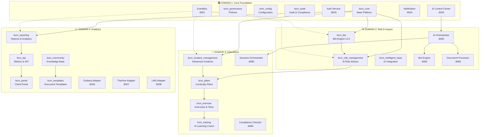

# 🏗️ BCM Platform Architecture Strategy
*Strategic Vision for Digital Business Continuity Management Ecosystem*

---

## 🎯 Executive Summary

Данная архитектурная стратегия определяет комплексную экосистему BCM платформы, состоящую из 4 основных доменов, 8 AI-органов Digital BCM Organism и микросервисной архитектуры с event-driven интеграцией.

---

## 📊 Домены и группировка сервисов

### 🏛️ **DOMAIN 1: Core Foundation & Governance**
*Базовая инфраструктура и управление*

#### Основные модули:
- **bcm_core** - Базовая платформа и мульти-тенантность
- **bcm_governance** - Политики и управление
- **bcm_config** - Конфигурация системы
- **bcm_context** - Организационный контекст
- **bcm_audit** - Аудит и соответствие

#### Сервисы поддержки:
- **Auth Service** (Port: 8005) - JWT аутентификация
- **EventBus** (Port: 8001) - Обмен сообщениями
- **Notification Service** (Port: 8004) - Уведомления
- **AI Control Center** (Port: 8200) - Digital BCM Organism

#### UI группы страниц:
- **Admin Portal** - Системное администрирование
- **Governance Dashboard** - Политики и процедуры
- **Audit Interface** - Аудит и комплаенс
- **Configuration Panel** - Настройки системы

---

### 🔍 **DOMAIN 2: Risk & Impact Analysis**
*Анализ рисков и воздействия на бизнес*

#### Основные модули:
- **bcm_risk_management** - AI-Powered Risk Advisor (FAIR методология)
- **bcm_bia** - AI-Powered Business Impact Analysis (BIA Engine v2.0)
- **bcm_intelligent_base** - AI интеграция

#### AI-Enhanced сервисы:
- **AI Orchestrator** (Port: 8000) - Центральный AI координатор
- **BIA Engine** (Port: 8082) - BIA анализ и оптимизация
- **Document Processor** (Port: 8083) - Обработка документов

#### UI группы страниц:
- **Risk Management** - Управление рисками с AI анализом
- **BIA Analysis** - Анализ воздействия на бизнес
- **AI Assistant** - AI помощник для анализа
- **Risk Dashboard** - Дашборд рисков в реальном времени

---

### 🚨 **DOMAIN 3: Operations & Response**
*Операционное управление и реагирование*

#### Основные модули:
- **bcm_incident_management** - Продвинутое управление инцидентами
- **bcm_incident** - Базовые инциденты
- **bcm_plans** - Планы непрерывности
- **bcm_exercise** - Учения и тестирование
- **bcm_training** - Обучение с AI Learning Coach

#### Операционные сервисы:
- **Scenario Orchestrator** (Port: 8085) - Управление сценариями
- **Compliance Checker** (Port: 8084) - Проверка соответствия

#### UI группы страниц:
- **Incident Management** - Управление инцидентами
- **Crisis Room** - Кризисный центр
- **Plans & Procedures** - Планы и процедуры
- **Exercises & Training** - Учения и обучение
- **Response Teams** - Команды реагирования

---

### 📈 **DOMAIN 4: Analytics & Collaboration**
*Аналитика, отчетность и коллаборация*

#### Основные модули:
- **bcm_reporting** - Отчеты и аналитика
- **bcm_kpi** - Метрики и KPI
- **bcm_portal** - Клиентский портал
- **bcm_community** - База знаний и форумы
- **bcm_templates** - Шаблоны документов
- **bcm_clients** - Управление клиентами (мульти-тенант)

#### Интеграционные сервисы:
- **Grafana Adapter** (Port: 8006) - Интеграция с Grafana
- **TheHive Adapter** (Port: 8007) - Интеграция с TheHive
- **LMS Adapter** (Port: 8008) - Интеграция с LMS

#### UI группы страниц:
- **Analytics Dashboard** - Аналитический дашборд
- **KPI Overview** - Обзор KPI
- **Reports & Insights** - Отчеты и инсайты
- **Collaboration Hub** - Центр сотрудничества
- **Knowledge Portal** - Портал знаний
- **Client Management** - Управление клиентами

---

## 🤖 Digital BCM Organism - 8 AI Органов

### AI Органы первого уровня:
1. **AI Risk Advisor** - Анализ и предсказание рисков
2. **AI BIA Brain** - Оптимизация RTO/RPO и финансовое моделирование
3. **AI Crisis Coordinator** - Координация кризисного реагирования
4. **AI Learning Coach** - Персонализированное обучение

### AI Органы второго уровня:
5. **AI Compliance Oracle** - Мониторинг соответствия требованиям
6. **AI Scenario Generator** - Генерация сценариев и учений
7. **AI Report Analyst** - Автоматическая аналитика и инсайты
8. **AI Integration Hub** - Координация внешних интеграций

---

## 🔗 Архитектурная диаграмма взаимодействий



---

## 🌐 UI/UX Группировка страниц

### 📱 **Группа 1: Dashboard & Overview**
- **Main Dashboard** - Центральный дашборд с KPI
- **Executive Summary** - Обзор для руководства
- **System Health** - Статус системы
- **Quick Actions** - Быстрые действия

### 🔍 **Группа 2: Risk & Analysis**
- **Risk Management** - Реестр рисков с AI анализом
- **BIA Analysis** - Анализ воздействия на бизнес
- **Risk Matrix** - Матрица рисков
- **AI Insights** - AI инсайты и рекомендации

### 🚨 **Группа 3: Incident & Crisis**
- **Incident Dashboard** - Активные инциденты
- **Crisis Room** - Центр кризисного реагирования
- **Emergency Contacts** - Экстренные контакты
- **Response Teams** - Команды реагирования

### 📋 **Группа 4: Plans & Procedures**
- **Recovery Plans** - Планы восстановления
- **Standard Procedures** - Стандартные процедуры
- **Plan Templates** - Шаблоны планов
- **Plan Testing** - Тестирование планов

### 🎯 **Группа 5: Training & Exercises**
- **Training Programs** - Программы обучения
- **Exercise Calendar** - Календарь учений
- **Competency Tracking** - Отслеживание компетенций
- **Learning Resources** - Ресурсы обучения

### 📊 **Группа 6: Reports & Analytics**
- **Analytics Dashboard** - Аналитический дашборд
- **KPI Reports** - Отчеты по KPI
- **Compliance Reports** - Отчеты соответствия
- **Executive Reports** - Отчеты руководству

### 👥 **Группа 7: Collaboration & Knowledge**
- **Knowledge Portal** - Портал знаний
- **Community Forums** - Форумы сообщества
- **Document Library** - Библиотека документов
- **Best Practices** - Лучшие практики

### ⚙️ **Группа 8: Admin & Configuration**
- **System Administration** - Администрирование
- **User Management** - Управление пользователями
- **Client Management** - Управление клиентами (мульти-тенант)
- **Integration Settings** - Настройки интеграций

---

## 🔄 Event-Driven интеграция

### Основные event patterns:
- **bcm.core.*** - Базовые системные события
- **bcm.risk.*** - События управления рисками
- **bcm.bia.*** - События анализа воздействия
- **bcm.incident.*** - События управления инцидентами
- **bcm.plan.*** - События планов непрерывности
- **bcm.exercise.*** - События учений
- **bcm.training.*** - События обучения
- **bcm.compliance.*** - События соответствия
- **system.*** - Системные события

### AI-Enhanced events:
- **ai.analysis.*** - AI анализ и рекомендации
- **ai.prediction.*** - AI предсказания
- **ai.optimization.*** - AI оптимизация
- **ai.learning.*** - AI обучение

---

## 🎯 Стратегические принципы архитектуры

### 1. **Domain-Driven Design**
- Четкое разделение по бизнес-доменам
- Автономность доменов
- Ясные границы ответственности

### 2. **AI-First Approach**
- Digital BCM Organism в центре архитектуры
- AI-enhanced workflow во всех модулях
- Predictive analytics и автоматизация

### 3. **Event-Driven Architecture**
- Асинхронная коммуникация
- Loose coupling между модулями
- Real-time responsiveness

### 4. **Multi-Tenant SaaS**
- Полная изоляция данных клиентов
- Scalable infrastructure
- Централизованное управление

### 5. **Microservices Pattern**
- Independent deployment
- Technology diversity
- Fault isolation

### 6. **API-First Design**
- RESTful APIs для всех модулей
- GraphQL для сложных запросов
- OpenAPI 3.0 спецификации

---

## 🚀 Deployment & Scaling Strategy

### Container Orchestration
```yaml
Infrastructure:
  - Kubernetes cluster
  - Docker containers
  - Helm charts
  - Istio service mesh

Scaling:
  - Horizontal pod autoscaling
  - Cluster autoscaling
  - Load balancing
  - CDN integration

Monitoring:
  - Prometheus metrics
  - Grafana dashboards
  - Jaeger tracing
  - ELK logging stack
```

---

## 🔮 Будущее развитие

### Фаза 1 (Q1-Q2 2025):
- Полная реализация Digital BCM Organism
- Advanced AI интеграции
- Enhanced real-time capabilities

### Фаза 2 (Q3-Q4 2025):
- Machine Learning optimization
- Predictive analytics enhancement
- Global compliance frameworks

### Фаза 3 (2026):
- IoT integration
- Blockchain для audit trails
- Advanced simulation capabilities

---

**Эта архитектурная стратегия обеспечивает масштабируемую, устойчивую и инновационную BCM платформу, готовую к будущим вызовам цифровой трансформации.**